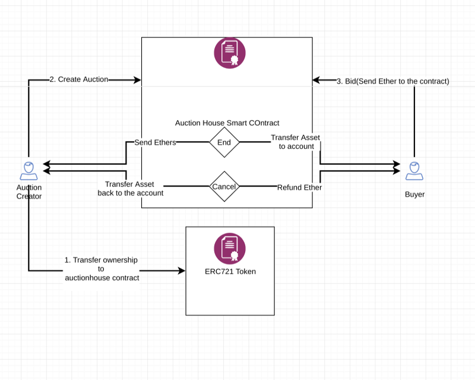

# Decentralized Auction Application on Ethereum

This project aims to implement basic functionalities of an auction platform using Ethereum.

## Requirements

The application should be decentralized and utilize Ethereum's stack:

1. Smart contracts for business logic(auctions, bids, refund and transfer of ownership)
2. Swarm for data storage(image and metadata)
3. Whisper for a peer-to-peer messaging(chatrooms)

### Deed Repository
Manage non-fungible tokens by implementing an asset/token/deed repository which hold unique asset/token/deed.

#### ERC: Non-fungible Token Standard #721 (NFT)
See following link: 
https://github.com/ethereum/eips/issues/721

### Auction Repository

Auction repository MUST act as an auction house which does the following:

- Holds asset/token/deed that is to be auctioned(ERC721 Ownership by smart contract)
- Allow users bid on auctions
- Keep track of auctions/bids/ownership
- Transfer ownership of asset/token/deed to winder
- Transfer Funds to auction creator if auction is ended and there is at least one winner
- Cancel auction and deal with refunds
- UI to interact with the above functionality

### Front-end: Vuejs2.x + Vuetify

The front-end is developed using a reactive UI framework with integration of Vuetify, a google's material design implementation.

## Implementation/Data flow

#### 1. Register an ERC721 Non-Fungible Token with the AuctionDaap Deed Repository

The idea of a Deed Repository is used across this project to hold any NFT with metadata attached to. A token/deed is registered by giving a unique ID and attaching metadata(TokenURI). The metadata is what makes each token important or valuable.

#### 2. Transfer Ownership of the NFT to AuctionRepository(Auction house)

The Auction house needs to verify that a NFT is owned by the auction creator, therefore before the auction is created, the owner should transfer the ownership of the NFT to the AuctionRepository smart contract address.

#### 3. Create Auction for NFT

Creating the auction is a simple process of entering auction details such as name, strarting price, expirty date etc. The important part is to have the reference between the deed and the auction.

#### 4. Bid on Auction

Anyone can bid on an auction except the owner of the auction. Biding means that previous bidders are refunded and new bid is placed. Bid requirements are as follow:
1. Auction not expired
2. Bidder is not auction owner
3. Bid amount is greator than current bid or starting price(if no bid)

#### 5. Refunds

If an auction is canceled, the Auction Repository MUST return the ownership of the asset/token/deed back to the auction creator and refund bidders if any.

#### 5. Bidder Win Auction

If there is an auction winner, the asset/token/deed is transfered to the bidder and the bid amount is sent to the auction creator.

