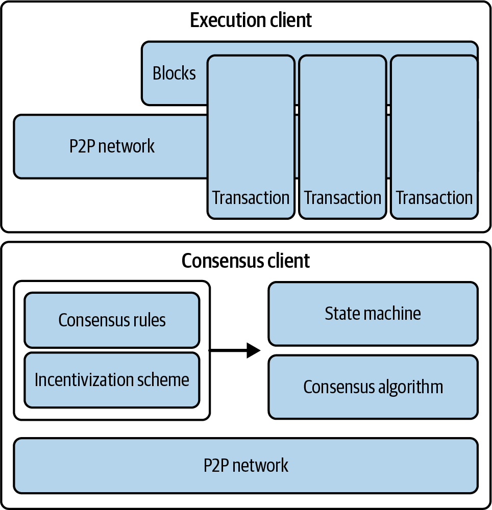

# Chapter 1. What Is Ethereum?

Ethereum is often described as the “world computer.” But what does that mean? Let’s start with a computer science–focused description and then try to decipher that with a more practical analysis of Ethereum’s capabilities and characteristics while comparing it to Bitcoin and other decentralized information exchange platforms (or *blockchains*, to be precise).

From a computer science perspective, Ethereum is a deterministic but practically unbounded state machine, consisting of a globally accessible singleton state and a virtual machine that applies changes to that state.

From a more practical perspective, Ethereum is an open source, globally decentralized computing infrastructure that executes programs called *smart contracts*. It uses a blockchain to synchronize and store the system’s state changes, along with a cryptocurrency called *ether* to meter and constrain execution resource costs.

The Ethereum platform enables developers to build powerful decentralized applications with built-in economic functions. It provides high availability, auditability, transparency, and neutrality while reducing or eliminating censorship and reducing certain counterparty risks.

## Ethereum Compared to Bitcoin

Many people approach Ethereum with some prior experience of cryptocurrencies, specifically Bitcoin. Ethereum shares many elements with other open blockchains: a peer-to-peer (P2P) network connecting participants; a Byzantine, fault-tolerant consensus algorithm for synchronization of state updates; the use of cryptographic primitives, such as digital signatures and hashes; and a digital currency (ether). Yet in many ways, both the purpose and construction of Ethereum are strikingly different from those of the open blockchains that preceded it, including Bitcoin.

Ethereum’s purpose is not primarily to be a digital currency payment network. While the digital currency ether is both integral to and necessary for the operation of Ethereum, ether is intended as a *utility currency* to pay for use of the Ethereum platform as the world computer.

Unlike Bitcoin, which has a very limited scripting language, Ethereum is designed to be a general-purpose, programmable blockchain that runs a virtual machine capable of executing code of arbitrary and unbounded complexity. Where Bitcoin’s Script language is intentionally constrained to simple true/false evaluation of spending conditions, Ethereum’s language is *Turing complete*, meaning that Ethereum can function as a general-purpose computer.

In September 2022, Ethereum further distinguished itself from Bitcoin with The Merge upgrade, transitioning its consensus model from proof of work (PoW) to proof of stake (PoS). This important change not only underlines Ethereum’s commitment to reducing its environmental impact—aligning with its innovative vision—but also enhances its scalability and security features.

## Components of a Blockchain

The components of an open, public blockchain are (usually) as follows:

- A P2P network connecting participants and propagating transactions and blocks of verified transactions, based on a standardized “gossip” protocol
- Messages, in the form of transactions, representing state transitions
- A set of consensus rules governing what constitutes a transaction and what makes for a valid state transition
- A state machine that processes transactions according to the consensus rules
- A chain of cryptographically secured blocks that acts as a journal of all the verified and accepted state transitions
- A consensus algorithm that decentralizes control over the blockchain by forcing participants to cooperate in the enforcement of the consensus rules
- A game-theory-sound incentivization scheme (e.g., PoW costs plus block rewards) to economically secure the state machine in an open environment
- One or more open source software implementations of these components (“clients”)

All or most of these components are usually combined in a single software client. For example, in Bitcoin, the reference implementation is developed by the Bitcoin Core open source project and implemented as the Bitcoin client. Initially, Ethereum also required a single client before its transition to PoS. However, Ethereum now utilizes two distinct clients: one for consensus and another for execution. Instead of a reference implementation, Ethereum relies on a reference specification: a mathematical description detailed in the [“Yellow Paper”](https://oreil.ly/IJ7_B), which has been consistently updated throughout Ethereum’s development. The Ethereum community is currently transitioning toward a reference specification written in Python for both the [consensus](https://oreil.ly/yjU6s) and the [execution](https://oreil.ly/ggODg) clients. A number of clients have been built according to the reference specification. We will dive deeper into this topic in Chapter 3.

Figure 1-1 shows a graphical representation of the blockchain components.

**Figure 1-1.** Components of a blockchain

In the past, we used the term *blockchain* to represent all the components listed as a shorthand reference to the combination of technologies that encompass all the characteristics described. Today, however, there are a huge variety of blockchains with different properties. We need qualifiers to help us understand the characteristics of the blockchain in question, such as *open,**public, global, decentralized, neutral,* and *censorship resistant*, to identify the important emergent characteristics of a “blockchain” system that these components allow.

Not all blockchains are created equal. Despite the huge amount of property they show, we can broadly categorize blockchains into permissioned versus permissionless and public versus private:

**Permissionless**

Permissionless blockchains, like Bitcoin and Ethereum, are accessible to anyone. These decentralized networks allow anyone to join, participate in the consensus process, and read and write data, promoting trust through transparency.

**Permissioned**

Permissioned blockchains restrict access, allowing only authorized participants to join the network and perform certain actions.

**Public**

Public blockchains are decentralized and open to everyone, allowing broad participation in network activities and ensuring transparency through widespread distribution and consensus mechanisms.

**Private**

Private blockchains limit access to a specific group of participants, often within organizations or among trusted partners.

## The Birth of Ethereum

All great innovations solve real problems, and Ethereum is no exception. Ethereum was conceived at a time when people recognized the power of the Bitcoin model and were trying to move beyond cryptocurrency applications. But developers faced a conundrum: they either needed to build on top of Bitcoin or start a new blockchain. Building on Bitcoin meant living within the intentional constraints of the network and trying to find workarounds. The limited set of transaction types, data types, and sizes of data storage seemed to restrict the kinds of applications that could run directly on Bitcoin; anything else needed additional off-chain layers, and that immediately negated many of the advantages of using a public blockchain. For projects that required more freedom and flexibility while staying on chain, a new blockchain was the only option. But that meant a lot of work: bootstrapping all the infrastructure elements, exhaustive testing, and so on.

Toward the end of 2013, Vitalik Buterin, a young programmer and Bitcoin enthusiast, started thinking about further extending the capabilities of Bitcoin and Mastercoin (an overlay protocol that extended Bitcoin to offer rudimentary smart contracts). In October of that year, Buterin proposed a more generalized approach to the Mastercoin team, one that allowed flexible and scriptable (but not Turing complete) contracts to replace the specialized contract language of Mastercoin. Although the Mastercoin team was impressed, this proposal was too radical a change to fit into their development roadmap.

In December 2013, Buterin started sharing a whitepaper that outlined the idea behind Ethereum: a Turing-complete, general-purpose blockchain. A few dozen people saw this early draft and offered feedback, helping Buterin evolve the proposal.

Both of the original authors of this book, Andreas M. Antonopoulos and Dr. Gavin Wood, received an early draft of the whitepaper and commented on it. Antonopoulos was intrigued by the idea and asked Buterin many questions about the use of a separate blockchain to enforce consensus rules on smart contract execution and the implications of a Turing-complete language. Antonopoulos continued to follow Ethereum’s progress with great interest but was in the early stages of writing his book *Mastering Bitcoin* and did not participate directly in Ethereum until much later. Wood, however, was one of the first people to reach out to Buterin and offer to help with his C++ programming skills. Wood became Ethereum’s cofounder, co-designer, and CTO.

Buterin recounts in his [“A Prehistory of the Ethereum Protocol” post](https://oreil.ly/kEjpX):

> This was the time when the Ethereum protocol was entirely my own creation. From here on, however, new participants started to join the fold. By far the most prominent on the protocol side was Gavin Wood.

Wood can also be largely credited for the subtle change in vision from seeing Ethereum as a platform for building programmable money, with blockchain-based contracts that can hold digital assets and transfer them according to preset rules, to viewing it as a general-purpose computing platform. This started with subtle changes in emphasis and terminology, and later this influence became stronger with the increasing emphasis on the “Web3” ensemble, which saw Ethereum as one piece of a suite of decentralized technologies, with the other two being Whisper and Swarm. Starting in December 2013, Buterin and Wood refined and evolved the idea, together building the protocol layer that became Ethereum.

Ethereum’s founders were thinking about a blockchain without a specific purpose, which could support a broad variety of applications by being *programmed*. The idea was that by using a general-purpose blockchain like Ethereum, a developer could program their particular application without having to implement the underlying mechanisms of P2P networks, blockchains, consensus algorithms, and the like. Ethereum abstracts away those details and offers a deterministic, secure environment for writing decentralized applications. This shift in thinking didn’t just make development easier; it fundamentally expanded what blockchains could do. It laid the groundwork for entirely new sectors like decentralized finance, NFTs, and decentralized autonomous organizations (DAOs), which wouldn’t have been feasible with earlier single-purpose blockchains.

Much like Satoshi Nakamoto (the pseudonymous developer of Bitcoin), Buterin and Wood didn’t just invent a new technology; they combined new inventions with existing technologies in a novel way and delivered the prototype code to prove their ideas to the world.

The founders worked for years to build and refine their vision. And on July 30, 2015, the first Ethereum block was mined. The world’s computer started serving the world.

> **Note**
>
> Vitalik Buterin’s article [“A Prehistory of the Ethereum Protocol”](https://oreil.ly/kEjpX) was published in September 2017 and provides a fascinating first-person view of Ethereum’s earliest moments.

## Ethereum’s Stages of Development

Ethereum’s development was planned over four distinct stages, with major changes occurring at each stage. A stage may include subreleases, known as *hard forks*, that change functionality in a way that is not backward compatible.

The four main development stages are codenamed Frontier, Homestead, Metropolis, and Serenity. At the time of writing, we are in the last stage: Serenity. The Serenity stage has been further broken down into six substages codenamed The Merge, The Surge, The Scourge, The Verge, The Purge, and The Splurge.

Let’s now dive into the four development stages and describe their main purposes:

**Frontier (July 30, 2015)**

Launched at Genesis (when the first Ethereum block was mined), Frontier prepared the foundation for miners and developers by enabling the setup of mining rigs, the initiation of ETH token trading, and the testing of decentralized applications (DApps) in a minimal network setting. Initially, blocks had a gas limit of five thousand, but that was lifted in September 2015, allowing for transactions and introducing the “difficulty bomb.” Ethereum’s *difficulty bomb* is a mechanism designed to exponentially increase the difficulty of mining over time, ultimately making it infeasible. This incentivizes the transition from the original PoW consensus to the more energy-efficient PoS model currently in use.

**Homestead (March 14, 2016)**

Initiated at block 1,150,000, Homestead made Ethereum safer and more stable through key protocol updates (EIP-2, EIP-7, and EIP-8). These upgrades enhanced developer friendliness and paved the way for further protocol improvements, although the network remained in the beta phase.

**Metropolis (October 16, 2017)**

Starting at block 4,370,000, Metropolis aimed to increase network functionality, fostering DApp creation and overall network utility. Significant forks like Byzantium, Constantinople, and Istanbul during this phase optimized gas costs, enhanced security, and introduced layer-2 (L2) scaling solutions. Byzantium reduced mining rewards and implemented cryptographic provisions, while Constantinople further optimized gas costs and allowed interactions with uncreated addresses. Istanbul made the network more resilient against distributed denial of service (DDoS) attacks and introduced zero-knowledge cryptographic proofs (zk-SNARKs and STARKs) for improved scalability and privacy. These enhancements collectively set the stage for Ethereum 2.0, representing the final phase of Ethereum 1.0.

**Serenity (September 15, 2022)**

Serenity, commonly known as *Ethereum 2.0*, represents a major upgrade aimed at transforming Ethereum from a PoW to a PoS consensus mechanism. Serenity focuses on making Ethereum more sustainable and capable of handling a growing number of users and applications. This stage addresses critical issues like high energy consumption and network congestion, clearing the way for a more robust and efficient blockchain.

The Serenity upgrade is divided into several substages, each addressing specific aspects of the network’s evolution. While the main four development stages have been implemented sequentially, the five Serenity substages are being developed at the same time. This parallel approach is a strategic departure from the previous development method and is made possible because the foundational work laid down by the initial four stages was necessary for the simultaneous development of the Serenity substages. Each of these substages improves the Ethereum chain in a different aspect, unrelated to the others, enabling a more flexible and dynamic upgrade process:

**The Merge**

The Merge combines Ethereum’s mainnet with the Beacon Chain (the sidechain handling the PoS consensus), officially transitioning the network to PoS and reducing energy consumption significantly.

**The Surge**

The Surge introduces sharding, increasing Ethereum’s scalability by splitting the network into smaller, manageable pieces, which allows for more transactions per second.

**The Scourge**

The Scourge addresses issues of centralization and censorship resistance, ensuring that Ethereum remains a decentralized and open network.

**The Verge**

The Verge implements Verkle trees, reducing the data storage required for nodes and thus improving network efficiency and scalability.

**The Purge**

The Purge aims to reduce the historical data stored on Ethereum, simplifying node operation and lowering network congestion.

**The Splurge**

The Splurge includes various minor upgrades and optimizations to ensure that Ethereum runs smoothly and efficiently after all major changes are implemented.

## Ethereum: A General-Purpose Blockchain

The original blockchain—namely, Bitcoin’s blockchain—tracks the state of units of Bitcoin and their ownership. You can think of Bitcoin as a distributed-consensus *state machine*, where transactions cause a global *state transition*, altering the ownership of coins. The state transitions are constrained by the rules of consensus, allowing all participants to (eventually) converge on a common (consensus) state of the system, after several blocks are mined.

Ethereum is also a distributed state machine. But instead of tracking only the state of currency ownership, Ethereum tracks the state transitions of a general-purpose data store—that is, a store that can hold any data expressible as a *key-value tuple*. A key-value data store holds arbitrary values, each referenced by some key: for example, the value “Mastering Ethereum” referenced by the key “Book Title.” In some ways, this serves the same purpose as the data-storage model of random-access memory (RAM) used by most general-purpose computers.

Ethereum has memory that stores both code and data, and it uses the Ethereum blockchain to track how this memory changes over time. Like a general-purpose, stored-program computer, Ethereum can load code into its state machine and *run* that code, storing the resulting state changes in its blockchain. Two of the critical differences from most general-purpose computers are that Ethereum state changes are governed by the rules of consensus and the state is distributed globally. Ethereum answers the question “What if we could track any arbitrary state and program the state machine to create a worldwide computer operating under consensus?”

## Ethereum’s Components

In Ethereum, the components of a blockchain system (described in “Components of a Blockchain”) are, more specifically, as follows:

**P2P network**

Ethereum runs on the *Ethereum main network*, which is addressable on TCP port 30303, and runs a protocol called [*ÐΞVp2p*](https://oreil.ly/pUfGC).

**Consensus rules**

Ethereum’s original consensus protocol was Ethash, a PoW model defined in the reference specification: the “Yellow Paper.” It then evolved to PoS in September 2022 during The Merge upgrade (see Chapter 15).

**Transactions**

Ethereum transactions are network messages that include (among other things) a sender, a recipient, a value, and a data payload.

**State machine**

Ethereum state transitions are processed by the *Ethereum Virtual Machine* (EVM), a stack-based virtual machine that executes *bytecode* (machine-language instructions). EVM programs called *smart contracts* are written in high-level languages (e.g., Solidity) and compiled to bytecode for execution on the EVM.

**Data structures**

Ethereum’s state is stored locally on each node as a *database* (usually Google’s LevelDB), which contains the transactions and system state in a serialized hashed data structure called a *Merkle-Patricia trie*.

**Consensus algorithm**

Ethereum transitioned from a PoW to a PoS consensus mechanism to enhance energy efficiency and scalability. In PoS, validators stake their cryptocurrency to earn the right to validate transactions, create new blocks, and maintain network security. Ethereum’s PoS is the fusion of two distinct algorithms: Casper the Friendly Finality Gadget (FFG) and GHOST (Greedy Heaviest Observed Subtree) with latest message driven (LMD) updates (more on this in Chapter 15).

**Economic security**

Ethereum uses a PoS algorithm called Gasper that provides economic security to the blockchain. We’ll explore how Gasper works in detail in Chapter 15, including its role in finality and validator coordination.

**Clients**

Ethereum has several interoperable implementations of its execution and consensus client software, the most prominent of which are *go-ethereum* (Geth) and Nethermind for execution and Prysm and Lighthouse for consensus.

These references provide additional information on the technologies mentioned here:

- [Ethereum “Yellow Paper”](https://oreil.ly/IJ7_B)
- [Consensus client Python specifications](https://oreil.ly/yjU6s)
- [Execution client Python specifications](https://oreil.ly/ggODg)

## Ethereum and Turing Completeness

As soon as you start reading about Ethereum, you will encounter the term *Turing complete*. Ethereum, they say, is Turing complete, unlike Bitcoin. What exactly does that mean?

The term refers to English mathematician Alan Turing, who is considered the father of computer science. In 1936, he created a mathematical model of a computer consisting of a state machine that manipulates symbols by reading and writing them on sequential memory (resembling an infinite-length paper tape). With this construct, Turing went on to provide a mathematical foundation to answer (in the negative) questions about *universal computability*, meaning whether all problems are solvable. He proved that there are classes of problems that are uncomputable. Specifically, he proved that the *halting problem* (whether it is possible, given an arbitrary program and its input, to determine whether the program will eventually stop running) is not solvable.

Turing further defined a system to be *Turing complete* if it can be used to simulate any Turing machine. Such a system is called a *universal Turing machine* (UTM).

Ethereum’s ability to execute a stored program—in a state machine called the EVM—while reading and writing data to memory makes it a Turing-complete system and therefore a UTM. Ethereum can compute any algorithm that can be computed by any Turing machine, given the limitations of finite memory.

Ethereum’s groundbreaking innovation is to combine the general-purpose computing architecture of a stored-program computer with a decentralized blockchain, thereby creating a distributed single-state (singleton) world computer. Ethereum programs run “everywhere” yet produce a common state that is secured by the rules of consensus.

## Turing Completeness as a “Feature”

Hearing that Ethereum is Turing complete, you might arrive at the conclusion that this is a *feature* that is somehow lacking in a system that is Turing incomplete. Rather, it is the opposite. Turing completeness is very easy to achieve; in fact, [the simplest Turing-complete state machine known](https://oreil.ly/JhL2o) has four states and uses six symbols, with a state definition that is only 22 instructions long. Indeed, sometimes systems are found to be “accidentally Turing complete” (here’s a [fun reference of such systems](https://oreil.ly/7pt2q)).

However, Turing completeness is very dangerous, particularly in open-access systems like public blockchains, because of the halting problem described in the previous section. For example, modern printers are Turing complete and can be given files to print that send them into a frozen state. The fact that Ethereum is Turing complete means that any program of any complexity can be computed by Ethereum. But that flexibility brings some thorny security and resource management problems. An unresponsive printer can be turned off and turned back on again. That is not possible with a public blockchain.

## Implications of Turing Completeness

Turing proved that you cannot predict whether a program will terminate by simulating it on a computer. In simple terms, we cannot predict the path of a program without running it. Turing-complete systems can run in *infinite loops*, a term used (in oversimplification) to describe a program that does not terminate. It is trivial to create a program that runs a loop that never ends. But unintended never-ending loops can arise without warning due to complex interactions between the starting conditions and the code. In Ethereum, this poses a challenge: every participating node (client) must validate every transaction, running any smart contracts it calls. But as Turing proved, Ethereum can’t predict if a smart contract will terminate or how long it will run without actually running it (possibly running forever). Whether by accident or on purpose, a smart contract can be created such that it runs forever when a node attempts to validate it. This is effectively a denial-of-service (DoS) attack. And of course, between a program that takes a millisecond to validate and one that runs forever is an infinite range of nasty, resource-hogging, memory-bloating, CPU-overheating programs that simply waste resources. In a world computer, a program that abuses resources gets to abuse the world’s resources. How does Ethereum constrain the resources used by a smart contract if it cannot predict resource use in advance?

To answer this challenge, Ethereum introduced a metering mechanism called *gas*. As the EVM executes a smart contract, it carefully accounts for every instruction (computation, data access, etc.). Each instruction has a predetermined cost in units of gas. When a transaction triggers the execution of a smart contract, it must include an amount of gas that sets the upper limit of what can be consumed running the smart contract. The EVM will terminate execution if the amount of gas consumed by computation exceeds the gas available in the transaction. Gas is the mechanism Ethereum uses to allow Turing-complete computation while limiting the resources that any program can consume.

The next question is: how does one get gas to pay for computation on the Ethereum world computer? You won’t find gas on any exchanges. It can only be purchased as part of a transaction and can only be bought with ether. Ether needs to be sent along with a transaction, and it needs to be explicitly earmarked for the purchase of gas, along with an acceptable gas price. Just like at the pump, the price of gas is not fixed. Gas is purchased for the transaction, the computation is executed, and any unused gas is refunded back to the sender of the transaction.

## From General-Purpose Blockchains to DApps

Ethereum started as a way to make a general-purpose blockchain that could be programmed for a variety of uses. But very quickly, Ethereum’s vision expanded to become a platform for programming DApps. DApps represent a broader perspective than smart contracts. A DApp is, at the very least, a smart contract and a web user interface. More broadly, a DApp is a web application that is built on top of open, decentralized, P2P infrastructure services.

A DApp is composed of at least:

- Smart contracts on a blockchain
- A web frontend user interface

In addition, many DApps include other decentralized components, such as:

- A decentralized (P2P) storage protocol and platform
- A decentralized (P2P) messaging protocol and platform

From a practical perspective, the Ethereum web3.js JavaScript library bridges JavaScript applications that run in your browser with the Ethereum blockchain. It originally included a P2P storage network called Swarm and a P2P messaging service called Whisper—tools that made it possible to develop fully decentralized Web3 DApps. Despite the appeal of this fully decentralized DApp design, it did not gain much traction in the years following. Compromises had to be accepted to improve the user experience and boost user adoption, and a centralized Web2 website interacting with smart contracts is nowadays the standard for a DApp.

## The Third Age of the Internet
In 2004, the term *Web 2.0* came to prominence as a label of the evolution of the web toward user-generated content, responsive interfaces, and interactivity. Web 2.0 is not a technical specification but rather a term describing the new focus of web applications.

The concept of DApps is meant to take the Web to its next natural evolutionary stage, introducing decentralization with P2P protocols into every aspect of a web application. The term used to describe this evolution is *Web3*, meaning the third “version” of the web. First proposed by Gavin Wood, Web3 represents a new vision and focus for web applications: from centrally owned and managed applications to applications built on decentralized protocols.

## Ethereum’s Development Culture

So far, we’ve talked about how Ethereum’s goals and technology differ from those of other blockchains that preceded it, like Bitcoin. Ethereum also has a very different development culture.

In Bitcoin, development is guided by conservative principles: all changes are carefully studied to ensure that none of the existing systems are disrupted. For the most part, changes are only implemented if they are backward compatible. Existing clients are allowed to opt in but will continue to operate if they decide not to upgrade. This cautious approach aligns with Bitcoin’s governance model, where changes go through the Bitcoin Improvement Proposal (BIP) process, an intentionally slow and consensus-driven pipeline designed to preserve stability.

In Ethereum, by comparison, the community’s development culture is focused on the future rather than the past. The (not entirely serious) mantra is “move fast and break things.” If a change is needed, it is implemented, even if that means invalidating prior assumptions, breaking compatibility, or forcing clients to update. Ethereum’s governance reflects this more hands-on style, with coordination happening publicly through frequent AllCoreDevs calls where researchers, client teams, and ecosystem stakeholders discuss and align on upcoming changes. It’s a more agile and iterative process that trades some stability for a faster pace of innovation.

What this means to you as a developer is that you must remain flexible and be prepared to rebuild your infrastructure as some of the underlying assumptions change. One of the big challenges facing developers in Ethereum is the inherent contradiction between deploying code to an immutable system and a development platform that is still evolving. You can’t simply “upgrade” your smart contracts. You must be prepared to deploy new ones; migrate users, apps, and funds; and start over.

Ironically, this also means that the goal of building systems with more autonomy and less centralized control is still not fully realized. Autonomy and decentralization require a bit more stability in the platform than you’re likely to get in Ethereum in the next few years. To “evolve” the platform, you have to be ready to scrap and restart your smart contracts, which means you have to retain a certain degree of control over them.

But on the positive side, Ethereum is moving forward very quickly. There is little opportunity for *bike-shedding*: an expression that means holding up development by arguing over minor details, such as how to build the bicycle shed at the back of a nuclear power station. If you start bike-shedding, you might suddenly discover that while you were distracted, the rest of the development team changed the plan and ditched bicycles in favor of autonomous hovercraft.

Eventually, the development of the Ethereum platform will slow, and its interfaces will become fixed. But in the meantime, innovation is the driving principle. You’d better keep up because no one will slow down for you.

## Why Learn Ethereum?

Blockchains have a very steep learning curve because they combine multiple disciplines into one domain: programming, information security, cryptography, economics, distributed systems, P2P networks, and so on. Ethereum makes this learning curve a lot less steep, so you can get started quickly. But just below the surface of a deceptively simple environment lies a lot more. As you learn and start looking deeper, there’s always another layer of complexity and wonder.

Ethereum is a great platform for learning about blockchains, and it’s building a massive community of developers, faster than any other blockchain platform. More than any other, Ethereum is a *developer’s blockchain*: built by developers for developers. A developer familiar with JavaScript applications can drop into Ethereum and start producing working code very quickly. For the first few years of Ethereum’s life, it was common to see T-shirts announcing that you can create a token in just five lines of code. Of course, this is a double-edged sword. It’s easy to write code, but it’s very hard to write *good* and *secure* code.

Many blockchain projects, like L2s, are based on Ethereum. Learning Ethereum helps you understand these projects better and gives you the tools to explore further developments in the blockchain world. This knowledge is key for anyone looking to get involved with the latest in blockchain technology.

## Conclusion

Ethereum stands out as a groundbreaking platform in the blockchain landscape. Its design as a Turing-complete system allows for the creation of decentralized applications with sophisticated, programmable logic, going beyond the simpler functionality of Bitcoin.

For developers and technologists, understanding Ethereum opens doors to a deeper comprehension of blockchain technology and its potential applications. By mastering Ethereum, you gain the tools to participate in and contribute to the ongoing evolution of the internet, putting yourself at the cutting edge of this exciting field.