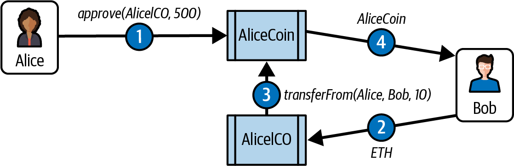

# Chapter 10. Tokens

The word *token* derives from the Old English *tācen*, meaning a sign or symbol. It is commonly used to refer to privately issued, special-purpose, coin-like items of insignificant intrinsic value, such as transportation tokens, laundry tokens, and arcade-game tokens. Nowadays, tokens administered on blockchains are redefining the word to mean blockchain-based abstractions that can be owned and that represent assets, currency, or access rights.

The association between the word *token* and insignificant value has a lot to do with the limited use of the physical versions of tokens. Often restricted to specific businesses, organizations, or locations, physical tokens are not easily exchangeable and typically have only one function. With blockchain tokens, these restrictions are lifted or, to be more accurate, are completely redefinable. Many blockchain tokens serve multiple purposes globally and can be traded for one another or for other currencies on global liquid markets. With the restrictions on use and ownership gone, the “insignificant value” expectation is also a thing of the past.

In this chapter, we look at various uses for tokens and how they are created. We also discuss attributes of tokens, such as fungibility and intrinsicality. Finally, we examine the standards and technologies that they are based on and experiment by building our own tokens.

## How Tokens Are Used

The most obvious use of tokens is as digital private currencies. However, this is only one possible use. Tokens can be programmed to serve many different functions, which often overlap. For example, a token can simultaneously convey a voting right, an access right, and ownership of a resource. As the following list shows, currency is just the first “app”:

**Currency**

A token can serve as a form of currency, with a value determined through private trade.

**Resource**

A token can represent a resource earned or produced in a sharing economy or resource-sharing environment—for example, a storage or CPU token representing resources that can be shared over a network.

**Asset**

A token can represent ownership of an intrinsic or extrinsic, tangible or intangible asset—for example, gold, real estate, a car, oil, energy, MMOG items, and so on.

**Access**

A token can represent access rights and can grant access to a digital or physical property, such as a discussion forum, an exclusive website, a hotel room, or a rental car.

**Equity**

A token can represent shareholder equity in a digital organization (e.g., a DAO) or legal entity (e.g., a corporation).

**Voting**

A token can represent voting rights in a digital or legal system.

**Collectible**

A token can represent a digital collectible (e.g., CryptoPunks) or physical collectible (e.g., a painting).

**Identity**

A token can represent a digital identity (e.g., an avatar) or a legal identity (e.g., a national ID).

**Attestation**

A token can represent a certification or attestation of fact by some authority or by a decentralized reputation system (e.g., a marriage record, birth certificate, or college degree).

**Utility**

A token can be used to access or pay for a service.

Often, a single token encompasses several of these functions. Sometimes it is hard to discern between them because the physical equivalents have always been inextricably linked. For example, in the physical world, a driver’s license (attestation) is also an identity document (identity), and the two cannot be separated. In the digital realm, previously commingled functions can be separated and developed independently (e.g., an anonymous attestation).

## Tokens and Fungibility

[Wikipedia](https://oreil.ly/ge7zP) says, “In economics, fungibility is the property of a good or a commodity whose individual units are essentially interchangeable.” Tokens are *fungible* when we can substitute any single unit of the token for another without any difference in its value or function.

*Nonfungible* *tokens* (NFTs) are tokens that each represent a unique tangible or intangible item and therefore are not interchangeable. For example, a token that represents ownership of a *specific* Van Gogh painting is not equivalent to another token that represents a Picasso, even though they may be part of the same “art ownership token” system. Similarly, a token representing a *specific* digital collectible, such as a specific CryptoKitty, is not interchangeable with any other CryptoKitty. Each NFT is associated with a unique identifier, such as a serial number.

We will see examples of both fungible and nonfungible tokens later in this chapter.

> **Note**
>
> Note that *fungible* is often used to mean “directly exchangeable for money” (for example, a casino token can be “cashed in,” while laundry tokens typically cannot). This is *not* the sense in which we use the word here.

## Counterparty Risk

*Counterparty risk* is the risk that the *other* party in a transaction will fail to meet their obligations. Some types of transactions suffer additional counterparty risk because there are more than two parties involved. For example, if you hold a certificate of deposit for a precious metal and you sell that to someone, there are at least three parties in that transaction: the seller, the buyer, and the custodian of the precious metal. Someone holds the physical asset; by necessity, they become party to the fulfillment of the transaction and add counterparty risk to any transaction involving that asset. In general, when an asset is traded indirectly through the exchange of a token of ownership, there is additional counterparty risk from the custodian of the asset. Do they have the asset? Will they recognize (or allow) the transfer of ownership based on the transfer of a token (such as a certificate, deed, title, or digital token)? In the world of digital tokens representing assets, as in the nondigital world, it is important to understand who holds the asset that is represented by the token and what rules apply to that underlying asset.

## Tokens and Intrinsicality

The word *intrinsic* derives from the Latin *intra*, meaning “from within.” Some tokens represent digital items that are intrinsic to the blockchain. Those digital assets are governed by consensus rules, just like the tokens themselves. This has an important implication: tokens that represent intrinsic assets do not carry additional counterparty risk. If you hold the keys for a CryptoKitty, there is no other party holding that CryptoKitty for you—you own it directly. The blockchain consensus rules apply, and your ownership (i.e., control) of the private keys is equivalent to ownership of the asset, without any intermediary.

Conversely, many tokens are used to represent *extrinsic* things, such as real estate, corporate voting shares, trademarks, gold bars, and bonds. The ownership of these items, which are not “within” the blockchain, is governed by law, custom, and policy, separate from the consensus rules that govern the token. In other words, token issuers and owners may still depend on real-world nonsmart contracts. As a result, these extrinsic assets carry additional counterparty risk because they are held by custodians, recorded in external registries, or controlled by laws and policies outside the blockchain environment.

One of the most important ramifications of blockchain-based tokens is the ability to convert extrinsic assets into intrinsic assets and thereby remove counterparty risk. A good example is moving from equity in a corporation (extrinsic) to an equity or voting token in a DAO or similar (intrinsic) organization. Stablecoins serve as another example, acting as blockchain-based tokens pegged to fiat currencies and backed by extrinsic assets like treasury bills and cash reserves.

## Utility, Equity, or Cash Grab?

Almost every Ethereum project seems to launch with some sort of token. But do all these projects really need tokens? The slogan “Tokenize all the things” sounds catchy, but the reality is far more complex. Tokens can be powerful tools for organizing and incentivizing communities, but they’ve also become synonymous with speculation and hype.

In theory, tokens serve two primary purposes. First, there are *utility tokens.* These are designed to provide access to a service or resource within a specific ecosystem. For example, a token might represent storage space on a decentralized network or access to premium features in a DApp. The token’s value, in this case, is tied to its function within the platform. Second, we have *equity tokens*, which are supposed to function like shares in a company. These tokens can represent ownership or control in a project, such as voting rights in a DAO or a share of profits.

In practice, the distinction between these categories is often blurred. Many utility tokens remain largely speculative, with users holding them more as assets than as access credentials. Equity-like tokens may grant governance rights but often lack mechanisms to ensure meaningful participation. Some projects integrate their tokens deeply into their economic models, but these cases remain the exception rather than the rule.

This brings us to the question: are tokens inherently bad? Not at all. Tokens can be incredibly effective for creating and incentivizing communities or powering decentralized governance in a DAO. But the reality is that most tokens are launched with profit, not utility, as the primary motivator. If you’re thinking of launching a token or investing in one, it’s worth asking some tough questions. Does the token truly serve a necessary purpose in the protocol, or is it just a fundraising tool? Would the project work just as well without it? Answering these questions honestly can help you distinguish between genuine innovation and marketing-driven hype.

It’s clear that the token landscape is still evolving, and tokens are not inherently good or bad; their value depends on how they’re designed and implemented. The challenge lies in separating the meaningful from the meaningless and resisting the lure of the next meme coin.

> **Note**
>
> During the writing of this chapter (January 2025), the newly elected president Donald Trump launched his own meme coin, which reached a market cap of $15 billion within a single day. Many had anticipated favorable crypto policies from his presidency, but instead, we got a meme coin. This event highlights the speculative frenzy dominating crypto, where hype often triumphs over substance.

## It’s a Duck!

Tokens have long been a favorite fundraising tool for startups. They promise innovation, decentralization, and sometimes outright financial freedom. But here’s the catch: offering securities to the public is a regulated activity in most jurisdictions, and tokens can easily cross the line into securities territory. For years, projects have tried to sidestep regulations by branding their tokens as “utility tokens,” claiming they’re just a presale of access to future services. The logic goes: if the token isn’t an equity share, it’s not a security. But as the old saying goes, “If it walks like a duck and quacks like a duck, it’s a duck.” And regulators, especially the US Securities and Exchange Commission (SEC), are paying attention to these ducks.

Over the last few years, the SEC has taken an increasingly aggressive stance against token offerings, striking down projects that try to straddle the line between utility and equity. For example, in 2020, the SEC sued Ripple Labs over their XRP token, arguing it was an unregistered security. Ripple claimed XRP was a currency, not a security, but the court’s partial rulings showed how nuanced these cases can be.

Even Ethereum itself wasn’t exempt from scrutiny. Back in 2018, former SEC officials declared that ether was “sufficiently decentralized” and thus not a security. But as recently as 2024, the SEC suggested that Ethereum’s transition to PoS could bring it back under the microscope. Why? Because staking rewards resemble dividends, and dividends are a hallmark of securities. These developments show just how fluid and unpredictable the regulatory landscape has become.

What’s fascinating—and frustrating—is how often these cases boil down to semantics. Projects claim their tokens are utility tools, like tickets to a service. But if the primary motivation for buyers is speculation, the SEC sees a security, plain and simple. The challenge is that the legal framework used to make these determinations was created long before blockchain technology existed. The Howey Test, developed in the 1940s to define investment contracts, wasn’t designed for decentralized networks or programmable assets. As a result, applying it to crypto projects isn’t always straightforward. Innovators want to raise money and build communities, but regulators want to protect investors from being misled. The result? A courtroom drama that plays out over and over, with billions of dollars and entire ecosystems hanging in the balance.

## Tokens on Ethereum

Blockchain tokens existed before Ethereum. In some ways, the first blockchain currency, Bitcoin, is a token itself. Many token platforms were also developed on Bitcoin and other cryptocurrencies before Ethereum. However, the introduction of the first token standard on Ethereum led to an explosion of tokens.

Vitalik Buterin suggested tokens as one of the most obvious and useful applications of a generalized programmable blockchain such as Ethereum. In fact, during Ethereum’s first year, it was common to see Buterin and others wearing T-shirts emblazoned with the Ethereum logo and a smart contract sample on the back. There were several variations of this T-shirt, but the most common showed an implementation of a token.

Before we delve into the details of creating tokens on Ethereum, it is important to have an overview of how tokens work on Ethereum. Tokens are different from ether because the Ethereum protocol does not know anything about them. Sending ether is an intrinsic action of the Ethereum platform, but sending or even owning tokens is not. The ether balance of Ethereum accounts is handled at the protocol level, whereas the token balance of Ethereum accounts is handled at the smart contract level. To create a new token on Ethereum, you must create a new smart contract. Once the smart contract is deployed, it handles everything, including ownership, transfers, and access rights. You can write your smart contract to perform all the necessary actions any way you want, but it is probably wisest to follow an existing standard. We will look at such standards next.

## The ERC-20 Token Standard

The first standard was introduced in November 2015 by Fabian Vogelsteller as an ERC. It was automatically assigned GitHub issue number 20, giving rise to the name “ERC-20 token.” The vast majority of tokens are currently based on the ERC-20 standard. The ERC-20 request for comments eventually became EIP-20, but it is still mostly referred to by the original name, ERC-20.

ERC-20 is a standard for fungible tokens, meaning that different units of an ERC-20 token are interchangeable and have no unique properties. The [ERC-20 standard](https://oreil.ly/Psw-O) defines a common interface for contracts implementing a token such that any compatible token can be accessed and used in the same way. The interface consists of a number of functions that must be present in every implementation of the standard as well as some optional functions and attributes that may be added by developers.

### ERC-20 required functions and events

A token contract that is compliant with ERC-20 must provide at least the following functions and events:

`totalSupply`

Returns the total units of this token that currently exist. ERC-20 tokens can have a fixed or a variable supply.

`balanceOf`

Given an address, returns the token balance of that address.

`transfer`

Given an address and amount, transfers that number of tokens to that address from the balance of the address that executed the transfer.

`transferFrom`

Given a sender, recipient, and amount, transfers tokens from one account to another. Used in combination with `approve`.

`approve`

Given a recipient address and amount, authorizes that address to execute several transfers up to that amount from the account that issued the approval.

`allowance`

Given an owner address and a spender address, returns the remaining amount that the spender is approved to withdraw from the owner.

`transfer`

Event triggered upon a successful transfer (call to `transfer` or `transferFrom`), even for zero-value transfers.

`approval`

Event logged upon a successful call to `approve`.

#### ERC-20 optional functions

In addition to the required functions listed in the previous section, the following optional functions are also defined by the standard:

**Name**

Returns the human-readable name (e.g., “US dollars”) of the token.

**Symbol**

Returns a human-readable symbol (e.g., “USD”) for the token.

**decimals**

Returns the number of decimals used to divide token amounts. For example, if the number of decimals is 2, then a token amount of 1,000 actually means a balance of 10.

#### The ERC-20 interface defined in Solidity

Here’s what an ERC-20 interface specification looks like in Solidity:

```solidity
contract ERC20 {
   function totalSupply() public view returns (uint256 theTotalSupply);
   function balanceOf(address _owner) public view returns (uint256 balance);
   function transfer(address _to, uint256 _value) public returns (bool success);
   function transferFrom(address _from, address _to, uint256 _value) public returns
      (bool success);
   function approve(address _spender, uint256 _value) public returns (bool success);
   function allowance(address _owner, address _spender) public view returns
      (uint256 remaining);
   event Transfer(address indexed _from, address indexed _to, uint256 _value);
   event Approval(address indexed _owner, address indexed _spender, uint256 _value);
}
```

#### ERC-20 data structures

If you examine any ERC-20 implementation, you will see that it contains two data structures: one to track balances and one to track allowances. In Solidity, they are implemented with a *data mapping*.

The first data mapping implements an internal table of token balances, by owner. This allows the token contract to keep track of who owns the tokens. Each transfer is a deduction from one balance and an addition to another balance:

```solidity
mapping(address account => uint256) _balances;
```

The second data structure is a data mapping of allowances. As we will see in the next section, with ERC-20 tokens, an owner of a token can delegate authority to a spender, allowing them to spend a specific amount (allowance) from the owner’s balance. The ERC-20 contract keeps track of the allowances with a two-dimensional mapping, with the primary key being the address of the token owner, mapping to a spender address and an allowance amount:

```solidity
mapping(address account => mapping(address spender => uint256)) public _allowances;
```

#### ERC-20 workflows: “Transfer” and “approve and transferFrom”

The ERC-20 token standard has two transfer functions. You might be wondering why.

ERC-20 allows for two different workflows. The first is a straightforward single-transaction workflow using the `transfer` function. This workflow is the one used by wallets to send tokens to other wallets. The vast majority of token transactions happen with the `transfer` workflow.

Executing the transfer contract is very simple. If Alice wants to send 10 tokens to Bob, her wallet sends a transaction to the token contract’s address, calling the `transfer` function with Bob’s address and `10` as the arguments. The token contract adjusts Alice’s balance (–10) and Bob’s balance (+10) and issues a `Transfer` event.

The second workflow is a two-transaction workflow that uses `approve` followed by `transferFrom`. This workflow allows a token owner to delegate their control to another address. It is most often used to delegate control to a contract for distribution of tokens, but it can also be used by exchanges. For example, if a company is selling tokens for an ICO, they can `approve` a crowdsale contract address to distribute a certain number of tokens. The crowdsale contract can then `transferFrom` the token contract owner’s balance to each buyer of the token, as illustrated in Figure 10-1.



**Figure 10-1.** The two-step `approve` and `transferFrom` workflow of ERC-20 tokens

> **Note**
>
> An *initial coin offering* (ICO) is a crowdfunding mechanism used by companies and organizations to raise money by selling tokens. The term is derived from *initial public offering* (IPO), which is the process by which a public company offers shares for sale to investors on a stock exchange. Unlike the highly regulated IPO markets, ICOs are open, global, and messy.

For the `approve` and `transferFrom` workflow, two transactions are needed. Let’s say that Alice wants to allow the `AliceICO` contract to sell 50% of all the AliceCoin tokens to buyers like Bob and Charlie. First, Alice launches the `AliceCoin` ERC-20 contract, issuing all the AliceCoin to her own address. Then, Alice launches the `AliceICO` contract that can sell tokens for ether. Next, Alice initiates the `approve` and `transferFrom` workflow. She sends a transaction to the `AliceCoin` contract, calling `approve` with the address of the `AliceICO` contract and 50% of the `totalSupply` as arguments. This will trigger the `Approval` event. Now, the `AliceICO` contract can sell AliceCoin.

When the `AliceICO` contract receives ether from Bob, it needs to send some AliceCoin to Bob in return. Within the `AliceICO` contract is an exchange rate between AliceCoin and ether. The exchange rate that Alice set when she created the `AliceICO` contract determines how many tokens Bob will receive for the amount of ether sent to the `AliceICO` contract. When the `AliceICO` contract calls the AliceCoin `transferFrom` function, it sets Alice’s address as the sender and Bob’s address as the recipient and uses the exchange rate to determine how many AliceCoin tokens will be transferred to Bob in the `value` field. The `AliceCoin` contract transfers the balance from Alice’s address to Bob’s address and triggers a `Transfer` event. The `AliceICO` contract can call `transferFrom` an unlimited number of times, as long as it doesn’t exceed the approval limit Alice set. The `AliceICO` contract can keep track of how many AliceCoin tokens it can sell by calling the `allowance` function.

#### ERC-2612: Gasless transfers with “permit”

In Chapter 9, we fully explored the ins and outs of the traditional `transfer` and `transferFrom` flows with ERC-20 tokens. While these methods have been the backbone of token transfers, they’re not without their limitations. Both require the sender to interact directly with the blockchain, which means they must have some native cryptocurrency on hand to cover gas fees. This creates a significant hurdle, especially when tokens are sent to a brand-new address without any native funds. It’s a frustrating experience and far from ideal.

This is where ERC-2612 steps in. It’s a clever addition to the ERC-20 token standard that lets users approve token transfers without having to touch the blockchain themselves. Here’s how it works: instead of sending an on-chain transaction to approve a transfer, you just sign the necessary data—things like the recipient’s address, the number of tokens, the expiration time, and a nonce—using your wallet. This creates a signature, and whoever needs to execute the transfer (whether it’s the recipient or another party) can submit that signature to the `permit` method of the token contract. The contract reads the signature, verifies it, and processes the approval, all without you needing to pay gas for the initial step. It’s efficient and secure, and it takes a lot of the hassle out of the process.

For ERC-2612 to work, token developers need to extend their ERC-20 contracts to include this functionality. Once it’s in place, it offers two key benefits for users. First, it simplifies the whole process. Instead of having to approve every single transfer, users can grant permission with one signature. Second, it saves on gas costs since you’re cutting down the number of transactions needed.

#### ERC-20 implementations

While it is possible to implement a token that is compatible with ERC-20 in about 30 lines of Solidity code, most implementations are more complex. This is to account for potential security vulnerabilities. The EIP-20 standard mentions two implementations, developed by Consensys and OpenZeppelin. The Consensys EIP-20 token has not been maintained since 2018, while [OpenZeppelin’s ERC-20 token](https://oreil.ly/7d7RD) became the de facto standard for developers and is actively maintained. This implementation forms the basis of OpenZeppelin libraries implementing more complex ERC-20-compatible tokens with fundraising caps, tokenized vaults, vesting schedules, and other features.

### Launching Our Own ERC-20 Token

Let’s create and launch our own token. For this example, we will use the Foundry framework. The example assumes that you have already [installed Foundry](https://oreil.ly/dfDGh) and configured it and that you are familiar with its basic operation.

We will call our token the “Mastering Ethereum Token,” with the symbol MET. First, let’s create and initialize a Foundry project directory with the following commands:

```bash
$ mkdir METoken
$ cd METoken
$ forge init
```

You should now have the following directory structure:

```
METoken/
├── foundry.toml
├── lib
│   └── forge-std
│       └── ...
├── README.md
├── script
│   └── Counter.s.sol
├── src
│   └── Counter.sol
└── test
    └── Counter.t.sol
```

`Counter` is Foundry’s default example contract, which comes with its own test and deploy scripts. We will remove all its related files to make room for our token contract.

For our example, we will import the OpenZeppelin library, the industry standard for Solidity-based tokens:

```bash
$ forge install OpenZeppelin/openzeppelin-contracts
[...]
Installed openzeppelin-contracts v5.2.0
```

Inside *METoken/lib/openzeppelin-contracts/contracts*, we can now see all the OpenZeppelin contracts. The OpenZeppelin library includes a lot more than the ERC-20 token, but we will use only a small part of it.

Next, let’s write our token contract. Create a new file, *METoken.sol*, and copy the code in Example 10-1. Our contract is very simple since it inherits all its functionality from the OpenZeppelin library.

**Example 10-1. METoken.sol: a Solidity contract implementing an ERC-20 token**

```solidity
pragma solidity 0.8.28;
import "@openzeppelin/contracts/token/ERC20/ERC20.sol";
contract METoken is ERC20 {
    constructor(uint256 initialSupply) ERC20("METoken", "MET") {
        _mint(msg.sender, initialSupply);
    }
}
```

Here we are passing `"METoken"` and `"MET"` as name and symbol to the constructor of the ERC-20 contract. The token initial supply is provided during the deployment as a constructor parameter and will be sent to the deployer of this token contract (`msg.sender`). We are using the default value for decimals, 18, which is the widely adopted standard for ERC-20 tokens.

We can now use Foundry to compile the `METoken` contract:

```bash
$ forge build
[⠊] Compiling...
[⠒] Compiling 6 files with Solc 0.8.28
[⠢] Solc 0.8.28 finished in 36.18ms
Compiler run successful!
```

Let’s set up a deploy script to bring the `METoken` contract to the blockchain. Create a new file *METokenDeploy.s.sol*, in the *METoken/script* folder and copy the following code:

```solidity
pragma solidity 0.8.28;
import {Script, console} from "forge-std/Script.sol";
import {METoken} from "../src/METoken.sol";
contract METokenDeployer is Script {
    METoken public _METoken;
    function run() public {
        vm.startBroadcast();
        _METoken = new METoken(50_000_000e18);
        vm.stopBroadcast();
    }
}
```

In this example, we are passing 50 million as the initial supply. Did you notice that we are multiplying by 1e18? Those are the token decimals. Remember that in order to have a balance of *X* tokens, we need a token amount of *X* × 10 ^ decimals.

> **Note**
>
> The suffix *.s.sol* for scripts is a Foundry naming convention to quickly identify the purpose of a file. It is not a requirement—it’s enough to place the script files inside the script folder—but it’s a very good practice that will come in handy during development. The same applies to tests with the *.t.sol* suffix.

Before we deploy on one of the Ethereum test networks, let’s start a local blockchain to test everything. We will use another tool in the Foundry toolbox: Anvil, a local Ethereum development node. To use it, just open a new terminal and type `anvil`. The console will show a list of available accounts, their private keys, the chain ID, the RPC URL, and other information. The RPC URL is the endpoint that allows Foundry (or any Ethereum client) to communicate with our local blockchain node, enabling transactions, contract deployment, and data retrieval. Anvil’s default RPC is *http://127.0.0.1:8545*. To tell our deploy script to deploy on our local blockchain, we need to provide Anvil’s RPC URL as a console parameter with the flag `--rpc-url "http://127.0.0.1:8545"`.

The final piece we need is the private key of the deployer account. Since this is a local blockchain, the addresses we use on Ethereum mainnet or testnets won’t have any funds here, and we don’t want to expose real private keys unnecessarily. Instead, we’ll use the test accounts generated by Anvil when it starts up. These accounts come preloaded with 10,000 ETH on our local chain, making them perfect for development and testing.

We are ready to deploy our token by running:

```bash
$ forge script script/METokenDeploy.s.sol --broadcast --rpc-url "http://127.0.0.1:8545"
--private-key <DEPLOYER_PRIVATE_KEY>
[⠊] Compiling...
No files changed, compilation skipped
Script ran successfully.
```

> **Note**
>
> You might be wondering what the `--broadcast` flag is for. That is to tell Foundry to actually broadcast the transaction to the blockchain. Without that, Foundry would just simulate the transaction.

The console output informed us that the deploy script ran successfully. If we take a look at the terminal where we are running Anvil, we will notice a lot of activity, among which is our contract creation:

```
   Transaction: 0xd01e3a90e1f2ee60112658e92f4ebf04c24df67d2ec1315cfb79d145729d15ec
    Contract created: 0xe7f1725E7734CE288F8367e1Bb143E90bb3F0512
    Gas used: 941861
    Block Number: 1
    Block Hash: 0x748b6058dea932317cacf45bb63be82f253554f359b97ace224e35979a92b00a
    Block Time: "Fri, 31 Jan 2025 19:10:42 +0000"
```

Our METoken was successfully deployed at the following address:

```
0xe7f1725E7734CE288F8367e1Bb143E90bb3F0512
```

Alternatively, we can deploy our token using forge’s `create` console command:

```bash
$ forge create METoken --broadcast --rpc-url http://127.0.0.1:8545 --private-key
<DEPLOYER_PRIVATE_KEY> --constructor-args 50000000000000000000000000
```

Here, the total supply is passed as a constructor argument, taking decimals into account.

#### Interacting with METoken

We can interact with our contract in several ways. We could use Remix (as we did in Chapter 2), a Solidity REPL like Foundry’s Chisel, or a JavaScript library like ethers.js. We could also execute transactions using Foundry scripts, which are what we are going to use for our examples.

Ethereum addresses are 40-character hexadecimal strings, which aren’t exactly easy to read. To make our examples clearer, we’ll assign nicknames to the two addresses we’re using: Deployer for the address that deployed the MET contract and Alice for a secondary address. We will also use one of Anvil’s prefunded addresses for Alice.

Let’s create a Foundry script to check the Deployer’s METoken balance and send some METoken to Alice. Copy the contents from the following code snippet and paste them in a new file *METoken/script/METokenInteraction.s.sol*:

```solidity
pragma solidity 0.8.28;
import {Script, console} from "forge-std/Script.sol";
import {METoken} from "../src/METoken.sol";
contract METokenInteraction is Script {
    METoken public _METoken = METoken(0xe7f1725E7734CE288F8367e1Bb143E90bb3F0512);
    address alice = 0x70997970C51812dc3A010C7d01b50e0d17dc79C8;
    function run() public {
        vm.startBroadcast();
        uint256 ourBalance = _METoken.balanceOf(msg.sender);
        console.log("Deployer initial balance:", ourBalance);
        uint256 aliceBalance = _METoken.balanceOf(alice);
        console.log("Alice initial balance:", aliceBalance);
        uint256 amountToTransfer = 50e18;
        bool success = _METoken.transfer(alice, amountToTransfer);
        if (success) {
            console.log("Transfer successful");
        } else {
            console.log("Transfer failed");
            revert();
        }
        ourBalance = _METoken.balanceOf(msg.sender);
        console.log("Deployer final balance:", ourBalance);
        aliceBalance = _METoken.balanceOf(alice);
        console.log("Alice final balance:", aliceBalance);
        vm.stopBroadcast();
    }
}
```

We can run the script with the following console command:

```bash
$ forge script script/METokenInteraction.s.sol --private-key <DEPLOYER_PRIVATE_KEY>
--rpc-url "http://127.0.0.1:8545" -vv
```

It’s important to use the same private key that was used for deployment. This ensures that `msg.sender` corresponds to the deployer address, which holds the initial token supply.

> **Note**
>
> Foundry’s `-v` flags control the verbosity level of output when running commands like `forge script` or `forge build`. Increasing the number of `v`s increases the output verbosity to include more information. To show the console logs, we need at least `-vv` while the maximum verbosity is provided by `-vvvv`.

Once we run the script, the following will be printed in the console:

```bash
[⁘] Compiling...
[:] Compiling 1 files with Solc 0.8.28
[⁖] Solc 0.8.28 finished in 312.39ms
Compiler run successful!
Script ran successfully.
== Logs ==
  Deployer initial balance: 50000000000000000000000000
  Alice initial balance: 0
  Transfer successful
  Deployer final balance: 49999950000000000000000000
  Alice final balance: 50000000000000000000
```

In this script, we first log the current token balances of the deployer and Alice. Next, we transfer 50 tokens from the deployer to Alice and log the balances again. Keep in mind that 50 tokens are represented as 50e18 because our token has 18 decimals, hence the large number of zeros.

#### Sending ERC-20 tokens to contract addresses

So far, we’ve set up an ERC-20 token and transferred some tokens from one account to another. All the accounts we used for these demonstrations are EOAs, meaning they are controlled by a private key, not a contract. What happens if we send MET tokens to a contract address? Let’s find out!

First, let’s deploy another contract into our test environment. For this example, we will use the *NaiveFaucet.sol* contract that follows:

```solidity
pragma solidity 0.8.28;
contract NaiveFaucet {
    receive() external payable {}
    // Function to withdraw Ether from the contract
    function withdraw(uint256 amount) public {
        require(amount <= address(this).balance, "Insufficient balance in faucet");
        payable(msg.sender).transfer(amount);
    }
}
```

Our directory should look like this:

```
METoken/
+---- src
|   +---- NaiveFaucet.sol
|   +---- METoken.sol
```

Let’s compile and deploy the `NaiveFaucet` contract:

```bash
$ forge create NaiveFaucet --broadcast --rpc-url http://localhost:8545
--private-key <DEPLOYER_PRIVATE_KEY>
[⁘] Compiling...
[:] Compiling 1 files with Solc 0.8.28
[⁖] Solc 0.8.28 finished in 8.69ms
Compiler run successful!
Deployer: 0xf39Fd6e51aad88F6F4ce6aB8827279cffFb92266
Deployed to: 0x9fE46736679d2D9a65F0992F2272dE9f3c7fa6e0
Transaction hash: 0x4d1947547e3cfec8db670f3c1b7ff309b41de8aacee42165578a3ddf8619f63f
```

Great, our `NaiveFaucet` contract has been deployed to the address `0x9fE46736679​d2D9a65F0992F2272dE9f3c7fa6e0`. Now, let’s send some MET to the `NaiveFaucet` contract by copying the following script to *METoken/script/METokenSend.s.sol*:

```solidity
pragma solidity 0.8.28;
import {Script, console} from "forge-std/Script.sol";
import {METoken} from "../src/METoken.sol";
contract METokenSend is Script {
    METoken public _METoken = METoken(0xe7f1725E7734CE288F8367e1Bb143E90bb3F0512);
    address naiveFaucet = 0x9fE46736679d2D9a65F0992F2272dE9f3c7fa6e0;
    function run() public {
        vm.startBroadcast();
        uint256 amountToSend = 100e18;
        bool success = _METoken.transfer(naiveFaucet, amountToSend);
        if (success) {
            console.log("Transfer successful");
        } else {
            console.log("Transfer failed");
            revert();
        }
        uint256 faucetBalance = _METoken.balanceOf(naiveFaucet);
        console.log("Faucet balance:", faucetBalance);
        vm.stopBroadcast();
    }
}
```

We can run it with:

```bash
$ forge script script/METokenSend.s.sol --private-key <DEPLOYER_PRIVATE_KEY>
--rpc-url "http://127.0.0.1:8545" -vv
[⁘] Compiling...
[:] Compiling 1 files with Solc 0.8.28
[⁖] Solc 0.8.28 finished in 413.41ms
Compiler run successful!
Script ran successfully.
== Logs ==
  Transfer successful
  Faucet balance: 100000000000000000000
```

Again, we need to use the deployer private key to make it work as that is the address that initiates the transfer.

We have transferred 100 MET to the `NaiveFaucet` contract. Now, how do we withdraw those tokens?

Remember, *NaiveFaucet.sol* is a pretty simple contract. It only has one function, `withdraw`, which is for withdrawing *ether*. It doesn’t have a function for withdrawing MET or any other ERC-20 token. If we use `withdraw`, it will try to send ether, but since `NaiveFaucet` doesn’t have a balance of ether yet, it will fail.

The `METoken` contract knows that `NaiveFaucet` has a balance, but the only way it can transfer that balance is if it receives a `transfer` call from the address of the contract. Somehow, we need to make the `NaiveFaucet` contract call the `transfer` function in `METoken`.

If you’re wondering what to do next, don’t. There is no solution to this problem. The MET sent to `NaiveFaucet` is stuck, forever. Only the `NaiveFaucet` contract can transfer it, and the `NaiveFaucet` contract doesn’t have code to call the `transfer` function of an ERC-20 token contract.

Perhaps you anticipated this problem. Most likely, you didn’t. In fact, neither did hundreds of Ethereum users who accidentally transferred various tokens to contracts that didn’t have any ERC-20 capability. Over the years, a staggering amount of millions of dollars has gotten “stuck” like this and is lost forever.

#### Demonstrating the “approve and transferFrom” workflow

Our `NaiveFaucet` contract couldn’t handle ERC-20 tokens. Sending tokens to it using the `transfer` function resulted in the loss of those tokens. Let’s rewrite the contract now and make it handle ERC-20 tokens. Specifically, we will turn it into a faucet that gives out MET to anyone who asks.

Our new faucet contract, *METFaucet.sol*, will look like Example 10-2.

**Example 10-2. METFaucet.sol: A faucet for METoken**

```solidity
pragma solidity 0.8.28;
import "@openzeppelin/contracts/token/ERC20/IERC20.sol";
contract METFaucet {
    IERC20 public _METoken;
    address public _METOwner;
    constructor(address _metokenAddress, address metOwner) {
        _METoken = IERC20(_metokenAddress);
        _METOwner = metOwner;
    }
    // Function to withdraw METoken from the contract
    function withdraw(uint256 amount) public {
        require(amount <= 10e18, "At most 10 MET");
        require(_METoken.transferFrom(_METOwner, msg.sender, amount), "Transfer failed");
    }
}
```

We’ve made quite a few changes to the basic `Faucet` example. Since `METFaucet` will use the `transferFrom` function in `METoken`, it will need two additional variables. One will hold the address of the `METoken` contract. The other will hold the address of the owner of the MET, who will approve the faucet withdrawals. In our case, the owner is the deployer since they received the initial supply. The `METFaucet` contract will call `METoken.transferFrom` and instruct it to move MET from the owner to the address where the faucet withdrawal request came from.

We declare these two variables here:

```solidity
IERC20 public _METoken;
address public _METOwner;
```

Since our faucet needs to be initialized with the correct addresses for `METoken` and `METOwner`, we need to declare a custom constructor:

```solidity
// METFaucet constructor - provide the address of the METoken contract and
// the owner address we will be approved to transferFrom
constructor(address _metokenAddress, address metOwner) {
    _METoken = IERC20(_metokenAddress);
    _METOwner = metOwner;
}
```

The next change is to the `withdraw` function. Instead of calling `transfer`, `METFaucet` uses the `transferFrom` function in `METoken` and asks `METoken` to transfer MET to the faucet recipient:

```solidity
// Use the transferFrom function of METoken
_METoken.transferFrom(metOwner, msg.sender, withdraw_amount);
```

Finally, since our faucet no longer sends ether, we should probably prevent anyone from sending ether to `METFaucet` since we wouldn’t want it to get stuck. To reject incoming ether, it suffices to remove the `receive` function from our contract.

Now that our *METFaucet.sol* code is ready, we can deploy it by providing the MET token address and its deployer as address parameters:

```bash
$ forge create METFaucet --broadcast --rpc-url http://localhost:8545 --private-key
<DEPLOYER_PRIVATE_KEY> --constructor-args
"0xe7f1725E7734CE288F8367e1Bb143E90bb3F0512""0xf39Fd6e51aad88F6F4ce6aB8827279cffFb92266"
[⁘] Compiling...
No files changed, compilation skipped
Deployer: 0xf39Fd6e51aad88F6F4ce6aB8827279cffFb92266
Deployed to: 0xCf7Ed3AccA5a467e9e704C703E8D87F634fB0Fc9
Transaction hash: 0xa8bfbde9489ee40d41328a80538d0d3e7778b7f3b896c1d51897bf85bb25cec2
```

The `METFaucet` contract has been deployed to `0xCf7Ed3AccA5a467e9e704C703E​8D87F634fB0Fc9`, and we are almost ready to test it. First let’s write a *METApprove.s.sol* script to allow the `METFaucet` contract to spend the owner’s MET tokens:

```solidity
pragma solidity 0.8.28;
import {Script, console} from "forge-std/Script.sol";
import {METoken} from "../src/METoken.sol";
contract METApprove is Script {
    METoken public _METoken = METoken(0xe7f1725E7734CE288F8367e1Bb143E90bb3F0512);
    address _METFaucet = 0xCf7Ed3AccA5a467e9e704C703E8D87F634fB0Fc9;
    function run() public {
        vm.startBroadcast();
        bool success = _METoken.approve(_METFaucet, type(uint256).max);
        if (success) {
            console.log("Approve successful");
        } else {
            console.log("Approve failed");
            revert();
        }
        vm.stopBroadcast();
    }
}
```

We can run it with:

```bash
$ forge script script/METApprove.s.sol --broadcast --private-key <DEPLOYER_PRIVATE_KEY>
--rpc-url "http://127.0.0.1:8545" -vv
[⠊] Compiling...
[⠰] Compiling 2 files with Solc 0.8.28
[⠔] Solc 0.8.28 finished in 327.90ms
Compiler run successful!
Script ran successfully.
== Logs ==
  Approve successful
```

Now, we can write a script to let a secondary address interact with the `METFaucet` contract to withdraw 10 MET tokens and log its balance before and after the operation. Let’s create a *METFaucetWithdraw.s.sol* script as in Example 10-3.

**Example 10-3. METFaucetWithdraw: a faucet withdrawal script**

```solidity
pragma solidity 0.8.28;
import {Script, console} from "forge-std/Script.sol";
import {METoken} from "../src/METoken.sol";
import {METFaucet} from "../src/METFaucet.sol";
contract METFaucetWithdraw is Script {
    METoken public _METoken = METoken(0xe7f1725E7734CE288F8367e1Bb143E90bb3F0512);
    METFaucet public _METFaucet = METFaucet(0xCf7Ed3AccA5a467e9e704C703E8D87F634fB0Fc9);
    function run() public {
        vm.startBroadcast();
       uint256 balanceBefore = _METoken.balanceOf(msg.sender);
       console.log("Alice balance before:", balanceBefore);
       _METFaucet.withdraw(10e18);
       uint256 balanceAfter = _METoken.balanceOf(msg.sender);
       console.log("Alice balance after:", balanceAfter);
        vm.stopBroadcast();
    }
}
```

We can now run this script from Alice’s address by providing her private key while running the script:

```bash
$ forge script script/METFaucetWithdraw.s.sol --broadcast --private-key <ALICE_PRIVATE_KEY>
--rpc-url "http://127.0.0.1:8545" -vv
[⠊] Compiling...
[⠰] Compiling 1 files with Solc 0.8.28
[⠔] Solc 0.8.28 finished in 330.97ms
Compiler run successful!
Script ran successfully.
== Logs ==
  Alice balance before: 0
  Alice balance after: 10000000000000000000
```

As you can see from the results, we can use the `approve` and `transferFrom` workflow to authorize one contract to transfer tokens defined in another token. If properly used, ERC-20 tokens can be used by EOAs and other contracts. However, the burden of managing ERC-20 tokens correctly is pushed to the user interface. If a user incorrectly attempts to transfer ERC-20 tokens to a contract address and that contract is not equipped to receive ERC-20 tokens, the tokens will be lost.

### Issues with ERC-20 Tokens

The adoption of the ERC-20 token standard has been truly explosive. Thousands of tokens have been launched, both to experiment with the new capabilities and to raise funds in various “crowdfunding” auctions and ICOs. However, there are some potential pitfalls, as we saw with the issue of transferring tokens to contract addresses.

One of the less obvious issues with ERC-20 tokens is that they expose subtle differences between tokens and ether itself. Whereas ether is transferred by a transaction that has a recipient address as its destination, token transfers occur within the *specific token contract state* and have the token contract as their destination, not the recipient’s address. The token contract tracks balances and issues events. In a token transfer, no transaction is actually sent to the recipient of the token. Instead, the recipient’s address is added to a mapping within the token contract itself. A transaction sending ether to an address changes the state of an address. A transaction transferring a token to an address only changes the state of the token contract, not the state of the recipient address. Even a wallet that has support for ERC-20 tokens does not become aware of a token balance unless the user explicitly adds a specific token contract to “watch.” Some wallets watch the most popular token contracts to detect balances held by addresses they control, but that’s limited to a small fraction of existing ERC-20 contracts.

In fact, it’s unlikely that a user would *want* to track all balances in all possible ERC-20 token contracts. Many ERC-20 tokens are more like email spam than usable tokens. They automatically create balances for accounts that have ether activity in order to attract users. If you have an Ethereum address with a long history of activity, especially if it was created in the presale, you will find it full of “junk” tokens that appeared out of nowhere. Of course, the address isn’t really full of tokens; it’s the token contracts that have your address in them. You only see these balances if these token contracts are being watched by the block explorer or wallet you use to view your address.

Tokens don’t behave the same way as ether. Ether is sent with the `send` function and accepted by any payable function in a contract or any externally owned address. Tokens are sent using the `transfer` or `approve` and `transferFrom` functions that exist only in the ERC-20 contract and do not (at least in ERC-20) trigger any payable functions in a recipient contract. Tokens are meant to function just like a cryptocurrency such as ether, but they come with certain differences that break that illusion.

Let’s focus on the `approve` and `transferFrom` pattern. For newer users, the `approve`-`transferFrom` system can be especially misleading. Many assume that transferring tokens is a single operation, so encountering a two-step process feels confusing and counterintuitive. Worse, the `approve` action seems harmless but can be a trap. When users approve a contract, they might unknowingly grant unlimited permissions, allowing malicious actors to drain their tokens later. This gap in understanding makes phishing attacks easier and highlights how the system’s design doesn’t align with how newcomers expect to interact with the blockchain.

Consider another issue. To send ether or use any Ethereum contract, you need ether to pay for gas. To send tokens, you *also need ether*. You cannot pay for a transaction’s gas with a token, and the token contract can’t pay for the gas for you. For example, let’s say you use an exchange to convert some Bitcoin to a token. You “receive” the token in a wallet that tracks that token’s contract and shows your balance. It looks the same as any of the other cryptocurrencies you have in your wallet. Try sending the token, though, and your wallet will inform you that you need ether to do that. You might be confused—after all, you didn’t need ether to receive the token. Perhaps you have no ether. Perhaps you didn’t even know the token was an ERC-20 token on Ethereum; maybe you thought it was a cryptocurrency with its own blockchain. The illusion just broke.

We can partially address this issue with ERC-2612’s `permit` function and the gas fee sponsorship functionality offered by smart wallets like EIP-4337 and EIP-7702. ERC-2612 lets you approve token allowances by signing off-chain messages, skipping the need for the on-chain approval transaction. EIP-4337 and other smart wallet architectures let third parties pay your gas fees in exchange for reimbursement in ERC-20 tokens. The challenge lies in the limited adoption of ERC-2612 among tokens and the lack of widespread use of smart wallets.

Some of these issues are specific to ERC-20 tokens. Others are more general issues that relate to abstraction and interface boundaries within Ethereum. Some can be solved by changing the token interface, while others may need changes to fundamental structures within Ethereum (such as the distinctions between EOAs and contracts and between transactions and messages). Some may not be “solvable” exactly and may require user interface design to hide the nuances and make the user experience consistent regardless of the underlying distinctions.

In the following sections, we will look at various proposals that attempt to address some of these issues.

### ERC-223: A proposed token contract interface standard

The ERC-223 proposal attempts to solve the problem of inadvertent transfer of tokens to a contract (that may or may not support tokens) by detecting whether the destination address is a contract or not. ERC-223 requires that contracts designed to accept tokens implement a function named `tokenFallback`. If the destination of a transfer is a contract and the contract does not have support for tokens (i.e., does not implement `tokenFallback`), the transfer fails.

To detect whether the destination address is a contract, the ERC-223 reference implementation uses a small segment of inline bytecode in a rather creative way:

```solidity
function isContract(address _addr) private view returns (bool is_contract) {
  uint256 length;
    assembly {
       // retrieve the size of the code on target address; this needs assembly
       length := extcodesize(_addr)
    }
    return (length>0);
}
```

> **Note**
>
> `extcodesize` returns the size of the bytecode stored at a given address. Historically, this was the main difference between EOAs and smart contracts: EOAs had no code, and contracts did. But that assumption no longer holds. With EIP-7702, EOAs can now have code attached, blurring the line entirely.
> There’s also an important edge case: during the constructor phase of a contract, its code has not yet been stored on chain. The EVM only writes the contract’s bytecode to the address after the constructor finishes executing. So if you call `extcodesize` on a contract’s own address from within its constructor (or on another contract that hasn’t finished deploying), it will return `0`, even though that address will eventually contain code. As a result, if an address has no code, it could be an EOA or a contract still under construction. And if it does have code, it could be either a deployed contract or an EOA using a custom code payload. In short, this check no longer reliably tells us whether an address is a contract.

The ERC-223 contract-interface specification is:

```solidity
interface ERC223Token {
  uint256 public totalSupply;
  function balanceOf(address who) public view returns (uint256);
  function name() public view returns (string _name);
  function symbol() public view returns (string _symbol);
  function decimals() public view returns (uint8 _decimals);
  function totalSupply() public view returns (uint256 _supply);
  function transfer(address to, uint256 value) public returns (bool success);
  function transfer(address to, uint256 value, bytes data) public returns (bool success);
  function transfer(address to, uint256 value, bytes data, string custom_fallback)
      public returns (bool success);
  event Transfer(address indexed from, address indexed to, uint256 value,
                 bytes indexed data);
}
```

ERC-223 is not widely implemented, and there is some debate in the [ERC discussion thread](https://oreil.ly/iguyT) about backward compatibility and trade-offs between implementing changes at the contract interface level versus the user interface. The debate continues.

### ERC-777: The future that could have been

ERC-777 brings a fresh approach to token interactions by introducing *hooks*: functions triggered during token transfers. These hooks are fully compatible with ERC-20, ensuring that existing systems can interact with ERC-777 tokens seamlessly.

The sender’s hook, `tokensToSend`, is executed before tokens leave the account, allowing senders to add logic like logging or conditional checks. On the other hand, the receiver’s hook, `tokensReceived`, springs into action when tokens land in an account. At the core of ERC-777’s hook architecture is the ERC-1820 registry, which keeps track of which addresses have implemented the required hooks: `tokensToSend` for senders and `tokensReceived` for recipients. This ensures that transfers are successful only when both parties are prepared to handle them, preventing common issues like lost tokens.

Hooks also simplify transactions. With ERC-20, transferring tokens to a contract often requires a cumbersome two-step process: `approve` and then `transferFrom`. ERC-777 does away with that, allowing atomic transactions through its hooks. It’s efficient, intuitive, and, frankly, overdue.

Another interesting feature of ERC-777 is its operator mechanism, which allows authorized addresses—often smart contracts, such as exchanges or payment processors—to send and burn tokens on behalf of a holder. Holders have the ability to grant or withdraw authorization for operators whenever they choose, giving them full control over which third parties can manage their tokens on their behalf at any given moment. Every authorization or revocation emits an event, providing visibility into authorization changes.

The ERC-777 contract interface specification is:

```solidity
interface ERC777Token {
    function name() public view returns (string);
    function symbol() public view returns (string);
    function totalSupply() public view returns (uint256);
    function granularity() public view returns (uint256);
    function balanceOf(address owner) public view returns (uint256);
    function send(address to, uint256 amount, bytes userData) public;
    function authorizeOperator(address operator) public;
    function revokeOperator(address operator) public;
    function isOperatorFor(address operator, address tokenHolder)
        public constant returns (bool);
    function operatorSend(address from, address to, uint256 amount,
                          bytes userData,bytes operatorData) public;
    event Sent(address indexed operator, address indexed from,
               address indexed to, uint256 amount, bytes userData,
               bytes operatorData);
    event Minted(address indexed operator, address indexed to,
                 uint256 amount, bytes operatorData);
    event Burned(address indexed operator, address indexed from,
                 uint256 amount, bytes userData, bytes operatorData);
    event AuthorizedOperator(address indexed operator,
                             address indexed tokenHolder);
    event RevokedOperator(address indexed operator, address indexed tokenHolder);
}
```

#### Issues with ERC-777 tokens

While ERC-777 makes token interactions more intuitive, its hooks introduce some significant challenges—most notably, the risk of reentrancy attacks. These attacks take advantage of a contract’s ability to reenter its own logic before fully updating its state, often resulting in severe consequences. The very nature of ERC-777 hooks, which pass execution control to both the sender and receiver during a token transfer, creates an ideal scenario for such exploits. This design means developers must handle these hooks carefully to avoid vulnerabilities.

The most infamous case of reentrancy caused by ERC-777 tokens integration was the Uniswap v1 incident in April 2020. Uniswap, a decentralized exchange protocol, inadvertently exposed its reserves to exploitation due to ERC-777’s hooks. Attackers could call back into the Uniswap contract mid-operation, exploiting the discrepancy between token and ether reserves to siphon out funds. While this vulnerability was specific to how Uniswap interacted with ERC-777, it’s a stark reminder of the risks these hooks introduce.

Another issue worth noting is the potential for DoS attacks. Let’s say a contract distributes ERC-777 tokens to multiple accounts. If one of the recipients is a malicious contract programmed to revert the transaction during the `tokensReceived` hook, the entire distribution process would be prevented.

These risks highlight why integrating ERC-777 isn’t as simple as swapping out ERC-20. Developers need to adopt best practices like relying on reentrancy locks to mitigate vulnerabilities.

#### The future that could have been

ERC-777 could have been the next evolution of Ethereum’s token standard. It addresses many pain points of ERC-20, particularly around the user experience and token handling. The ability to prevent lost tokens, enable atomic transactions, and build richer contract interactions are all compelling advancements.

The Ethereum community, however, became hesitant. The potential DoS and reentrancy scenarios cast a long shadow. Developers feared the complexities and risks of integrating ERC-777, even though those risks are manageable with the right precautions. Instead of rising to the challenge, we stuck with the familiar but limited ERC-20. It’s a missed opportunity to embrace a standard that aligns tokens more closely with Ethereum’s philosophy while offering superior functionality.

In the end, ERC-777’s hooks aren’t the villain; improper implementation is. With a bit of effort and adherence to secure coding practices, ERC-777 could pave the way for a more seamless Ethereum ecosystem. To further research the matter, a suggested read is the [discussion on the deprecation of ERC-777](https://oreil.ly/J4p9B) by the OpenZeppelin library.

## ERC-721: NFT Standard

So far, we’ve explored token standards for fungible tokens, like ERC-20, where each unit is interchangeable and the system cares only about account balances. Now, let’s dive into something different and far more unique: ERC-721, the standard for nonfungible tokens, or as everyone knows them now, NFTs. You may have heard of NFTs during the mania of 2021 when digital collectibles like CryptoPunks, Bored Ape Yacht Club, and NBA Top Shot captured headlines and sold for jaw-dropping sums. Trading platforms like OpenSea and Rarible became household names in the crypto world.

But what exactly makes NFTs special? Unlike ERC-20 tokens, NFTs are all about uniqueness. Each token represents ownership of a distinct item, and that item can be anything: a digital collectible, an in-game asset, a piece of art, or even a real-world asset like property or a car. The beauty of ERC-721 lies in its flexibility. It doesn’t care what the token represents as long as it’s unique and can be identified by a number. Under the hood, this is accomplished with a `uint256` identifier for each NFT. Think of it as a serial number that distinguishes one token from another. In ERC-20, we track balances by mapping an account to the amount it holds, but in ERC-721, on top of balances we’re also mapping each unique token ID to its owner:

```solidity
mapping (uint256 => address) private _owners;
```

This subtle shift in structure changes everything. Each NFT is tied to a specific owner, and its history, provenance, and unique attributes can be tracked directly. This is what makes ERC-721 perfect for applications where individuality matters, such as proving ownership of a one-of-a-kind artwork, a rare in-game sword, or even a plot of land in the metaverse.

What makes ERC-721 truly powerful and versatile is the optional ERC-721 metadata extension, which allows each token ID to be tied to a uniform resource identifier (URI). This URI can point to metadata describing the NFT, such as its name, description, and image. The URI might be a standard HTTP link pointing to a centralized server or an Inter-Planetary File System (IPFS) link for decentralized storage. Centralized servers can go offline or disappear entirely, making NFTs dependent on third-party infrastructure. By contrast, IPFS helps ensure that metadata remains accessible and tamper resistant, and it is thus the preferred choice for storing NFT metadata. The ability to associate each token with a metadata URI is what enables NFTs to carry rich, descriptive data and multimedia content, further enhancing their uniqueness and usability.

The speculative use of NFTs, particularly as digital collectibles, has undeniably dominated the public narrative. These tokens became a symbol of hype, with values driven by scarcity, celebrity endorsements, and community sentiment. Yet, beyond the flashy headlines is a world of practical applications that have the potential to redefine industries. For instance, NFTs can be used in supply chain management to track the provenance of goods, ensuring authenticity and transparency for consumers. They can represent property deeds, streamlining real estate transactions by automating ownership transfers and reducing fraud. NFTs can also be leveraged in education to issue verifiable credentials, like degrees and certificates, that are tamper proof and universally accessible.

While collectibles brought NFTs into the spotlight, their real promise lies in these practical, transformative uses. By combining uniqueness, traceability, and programmability, ERC-721 tokens are poised to become a foundational building block for the digital economy. Whether you’re minting a quirky piece of art or tokenizing a life-saving medical record, ERC-721 empowers developers to create solutions that go far beyond speculation.

The ERC-721 contract interface specification is as follows:

```solidity
interface ERC721 /* is ERC165 */ {
    event Transfer(address indexed _from, address indexed _to, uint256 _deedId);
    event Approval(address indexed _owner, address indexed _approved,
                   uint256 _deedId);
    event ApprovalForAll(address indexed _owner, address indexed _operator,
                         bool _approved);
    function balanceOf(address _owner) external view returns (uint256 _balance);
    function ownerOf(uint256 _deedId) external view returns (address _owner);
    function transfer(address _to, uint256 _deedId) external payable;
    function transferFrom(address _from, address _to, uint256 _deedId)
        external payable;
    function approve(address _approved, uint256 _deedId) external payable;
    function setApprovalForAll(address _operator, boolean _approved) payable;
    function supportsInterface(bytes4 interfaceID) external view returns (bool);
}
```

## ERC-1155: Multitoken Standard

Ethereum has come a long way since ERC-20 and ERC-721, which set the foundations for fungible and nonfungible tokens. ERC-1155, the multitoken standard, combines the strengths of both to enable efficient and versatile token management.

Imagine you’re a game developer. You want to create a system where players can collect gold coins (fungible), unique swords (nonfungible), and potions that are consumable in stacks (semifungible). With ERC-20 or ERC-721, you’d need a separate smart contract for each type of token. Each new contract would increase gas costs and add complexity because you’d also need to manage permissions and interactions between these contracts. ERC-1155 solves this problem. It lets us deploy a single contract to manage multiple token types. Each token type is identified by a unique ID, and the contract can handle all operations, including transfers, balances, and metadata retrieval, for any combination of token types. This streamlined approach reduces redundancy and transaction costs, making ERC-1155 a widely adopted standard.

ERC-1155’s batch operations are a standout feature. They let us transfer or query multiple tokens in a single transaction, saving gas and making the standard more scalable. Additionally, ERC-1155 includes safety mechanisms to prevent issues like locked tokens. When transferring tokens to a smart contract, the receiving contract must implement the `IERC1155Receiver` interface; otherwise, the transaction will revert. These hooks enable advanced interactions during token transfers. For example, a contract could implement custom logic to execute when it receives tokens, such as updating an in-game leaderboard or triggering an event. However, as seen in ERC-777, if these hooks are not handled carefully, they can introduce vulnerabilities, such as reentrancy attacks. Developers must ensure proper safeguards, such as using checks-effects-interactions patterns and reentrancy locks, to secure their contracts when implementing ERC-1155 tokens.

The ERC-1155 contract interface specification is as follows:

```solidity
interface IERC1155 /* is IERC165 */ {
    event TransferSingle(address indexed operator, address indexed from, address indexed to,
uint256 id, uint256 value);
    event TransferBatch(
        address indexed operator,
        address indexed from,
        address indexed to,
        uint256[] ids,
        uint256[] values
    );
    event ApprovalForAll(address indexed account, address indexed operator, bool approved);
    event URI(string value, uint256 indexed id);
    function balanceOf(address account, uint256 id) external view returns (uint256);
    function balanceOfBatch(
        address[] calldata accounts,
        uint256[] calldata ids
    ) external view returns (uint256[] memory);
    function setApprovalForAll(address operator, bool approved) external;
    function isApprovedForAll(
        address account,
        address operator
    ) external view returns (bool);
    function safeTransferFrom(
        address from,
        address to,
        uint256 id,
        uint256 value,
        bytes calldata data
    ) external;
    function safeBatchTransferFrom(
        address from,
        address to,
        uint256[] calldata ids,
        uint256[] calldata values,
        bytes calldata data
    ) external;
}
```

## Using Token Standards

In the previous section, we reviewed several proposed standards and a couple of widely deployed standards for token contracts. What exactly do these standards do? Should you use these standards? How should you use them? Should you add functionality beyond these standards? Which standards should you use? We will examine some of those questions next.

### What Are Token Standards and What Is Their Purpose?

Token standards are the *minimum* specifications for an implementation. What that means is that in order to be compliant with, say, ERC-20, you need to at minimum implement the functions and behavior specified by the ERC-20 standard. You are also free to *add* to the functionality by implementing functions that are not part of the standard.

The primary purpose of these standards is to encourage *interoperability* between contracts. Thus, all wallets, exchanges, user interfaces, and other infrastructure components can *interface* in a predictable manner with any contract that follows the specification. In other words, if you deploy a contract that follows the ERC-20 standard, all existing wallet users can seamlessly start trading your token without any wallet upgrade or effort on your part.

The standards are meant to be *descriptive* rather than *prescriptive*. How you choose to implement those functions is up to you; the internal functioning of the contract is not relevant to the standard. They have some functional requirements, which govern the behavior under specific circumstances, but they do not prescribe an implementation. An example of this is how a transfer function behaves when the value is set to zero. The ERC-20 standard does not specify whether the transaction should revert or not in this case.

### Should You Use These Standards?

Given all these standards, each developer faces a dilemma: use the existing standards or innovate beyond the restrictions they impose?

This dilemma is not easy to resolve. Standards necessarily restrict your ability to innovate by creating a narrow “rut” that you have to follow. On the other hand, the basic standards have emerged from experience with hundreds of applications and often fit well with the vast majority of use cases.

As part of this consideration is an even bigger issue: the value of interoperability and broad adoption. If you choose to use an existing standard, you gain the value of all the systems designed to work with that standard. If you choose to depart from the standard, you have to consider the cost of building all the support infrastructure on your own or persuading others to support your implementation as a new standard. The tendency to forge your own path and ignore existing standards is known as “not invented here” syndrome and is antithetical to open source culture. On the other hand, progress and innovation depend on departing from tradition sometimes. It’s a tricky choice, so consider it carefully!

> **Note**
>
> Per [Wikipedia](https://oreil.ly/TTA96), “not invented here” is a stance adopted by social, corporate, or institutional cultures that avoid using or buying already existing products, research, standards, or knowledge because of their external origins and costs, such as royalties.

### Detecting Standards: EIP-165

As we’ve seen, standards like ERC-20 simplify interactions between tokens and wallets. But how do we identify which interfaces a smart contract supports? This is where EIP-165 comes in, providing a standardized way for contracts to declare and detect interfaces.

EIP-165 defines a method for contracts to announce the interfaces they implement. Contracts use the `supportsInterface` function to return a `true` or `false` value for a given interface ID (a unique identifier calculated as the XOR of all the function selectors in an interface). For instance, if an interface includes `foo()` and `bar(int256)`, its ID is derived as:

```
foo.selector ^ bar.selector
```

This approach enables other contracts and tools to verify compatibility before interacting. For example, a marketplace can confirm that an NFT contract supports the ERC-721 interface before listing its tokens.

To implement EIP-165, a contract inherits from a base class, such as OpenZeppelin’s ERC-165, and overrides the `supportsInterface` method to include the contract’s supported interfaces:

```solidity
contract MyContract is IMyContract, ERC165 {
    function supportsInterface(bytes4 interfaceId) public view override returns (bool) {
        return interfaceId == type(IMyContract).interfaceId ||
super.supportsInterface(interfaceId);
    }
}
```

To better grasp how EIP-165 works in practice, let’s look at ERC-1155, a versatile and widely used standard for multitoken contracts:

```solidity
abstract contract ERC1155 is Context, ERC165, IERC1155, IERC1155MetadataURI,
    IERC1155Errors {
[...]
    /**
     * @dev See {IERC165-supportsInterface}.
     */
    function supportsInterface(bytes4 interfaceId) public view virtual override(ERC165,
IERC165) returns (bool) {
        return
            interfaceId == type(IERC1155).interfaceId ||
            interfaceId == type(IERC1155MetadataURI).interfaceId ||
            super.supportsInterface(interfaceId);
    }
[...]
}
```

> **Warning**
>
> EIP-165 relies on contracts honestly reporting their capabilities. A malicious or poorly implemented contract could falsely claim to support an interface, leading to potential issues. While EIP-165 improves developer experience and reduces friction, it should not be treated as a security guarantee.

For more advanced scenarios, such as when contracts implement interfaces on behalf of others, developers could explore ERC-1820, which uses a global registry to track interface support. While ERC-1820 is more complex than EIP-165, it offers greater flexibility for decentralized systems.

### Security by Maturity

Beyond the choice of standard, there is the parallel choice of *implementation*. When you decide to use a standard such as ERC-20, you have to then decide how to implement a compatible design. There are a number of existing “reference” implementations that are widely used in the Ethereum ecosystem, or you could write your own from scratch. Again, this choice represents a dilemma that can have serious security implications.

Existing implementations are “battle-tested.” While it is impossible to prove that they are secure, many of them underpin millions of dollars’ worth of tokens—billions, in some cases. They have been attacked, repeatedly and vigorously. So far, no significant vulnerabilities have been discovered. Writing your own is not easy; there are many subtle ways a contract can be compromised. It is much safer to use a well-tested, widely used implementation. In our examples, we used the OpenZeppelin implementation of the ERC-20 standard because this implementation is security focused from the ground up.

If you use an existing implementation, you can also extend it. Again, be careful with this impulse. Complexity is the enemy of security. Every single line of code you add expands the attack surface of your contract and could represent a vulnerability lying in wait. You might not notice a problem until you put a lot of value on top of the contract and someone breaks it.

> **Tip**
>
> Standards and implementation choices are important parts of overall secure smart contract design, but they’re not the only considerations (see Chapter 9).

## Extensions to Token Interface Standards

The token standards we’ve discussed so far provide essential functionality for creating and managing tokens. However, they’re intentionally minimal, leaving room for projects to extend and adapt them to fit specific needs. Over time, many projects have built on these standards, introducing features that enhance usability, security, and flexibility. OpenZeppelin, a leading library for Ethereum smart contracts, has become the go-to source for such extensions. Let’s explore some of the most notable extensions for ERC-20, ERC-721, and ERC-1155 tokens.

With ERC-20, for example, we see the addition of burning mechanisms. Burning allows tokens to be permanently removed from circulation, reducing supply, which is useful for deflationary models or token economics that require deliberate supply control. On the flip side, some projects incorporate caps to set hard limits on the total supply, ensuring that no more tokens can ever be minted beyond a predefined threshold.

Another interesting addition to ERC-20 is voting functionality. This allows token holders to participate in governance decisions directly through their tokens. Projects that implement this create decentralized decision-making processes, enabling stakeholders to have a say in how a protocol evolves.

ERC-721 has seen similar creativity in its extensions. Features like royalty payments let creators earn a percentage of sales whenever their NFTs are traded. URI storage is another common addition that enables metadata to be stored and retrieved dynamically, which is particularly useful for NFTs with evolving properties. Enumerable extensions allow developers to efficiently list all tokens held by an address, making it easier to build marketplaces or wallets.

ERC-1155, the multitoken standard, hasn’t been left behind. Extensions for ERC-1155 include burnable tokens and pausable contracts, allowing for added flexibility in use cases like gaming or tokenized supply chains. Some implementations also enhance metadata handling, ensuring that token details remain accessible and easy to update.

Beyond these, countless other extensions exist, addressing needs like crowdfunding, blocklisting, allowlisting, and implementing fees on transfers. Developers often combine these features with other standard libraries like OpenZeppelin’s Ownable or Access Control, tapping into even more battle-tested resources.

With flexibility comes responsibility. Extending token standards involves balancing innovation with interoperability. Writing custom features may seem appealing, but it often introduces unnecessary complexity and risks. Instead, leveraging well-established libraries and extensions, like those from OpenZeppelin, ensures security and code quality and significantly reduces development costs. There’s no need to reinvent the wheel when robust, tested solutions already exist.

## Conclusion

Tokens are more than just digital currency; they can represent governance rights, access credentials, identities, and real-world assets. Their versatility is only possible thanks to standards like ERC-20, ERC-721, and ERC-1155, which ensure seamless interoperability across wallets, exchanges, and DApps, creating a more efficient and interconnected blockchain ecosystem. In this chapter, we looked at the different types of tokens and token standards, and you built your first token and related application.
