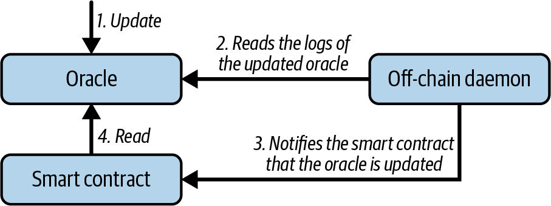
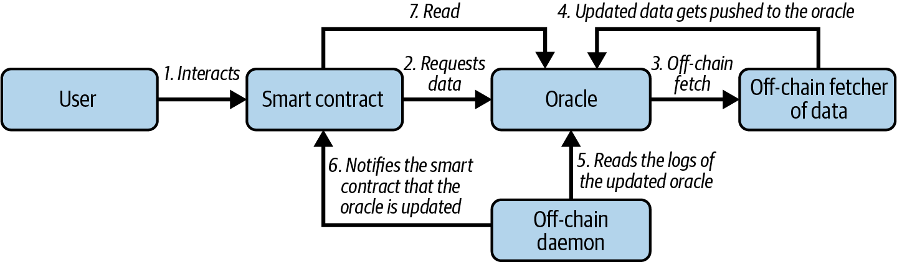
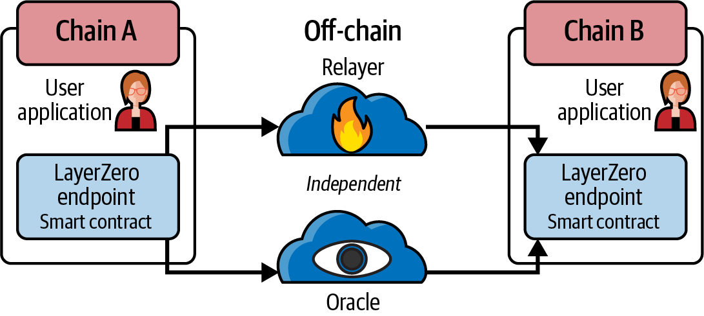
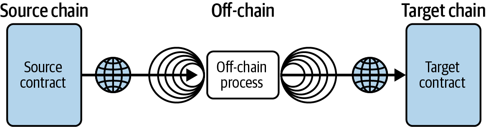

# Chapter 11. Oracles

In this chapter, we discuss *oracles*, which are systems that can provide external data sources to Ethereum smart contracts. The term *oracle* comes from Greek mythology, where it referred to a person in communication with the gods who could see visions of the future. In the context of blockchains, an oracle is a system that can answer questions that are external to Ethereum. Ideally, oracles are systems that are trustless, meaning that they do not need to be trusted because they operate on decentralized principles.

## Why Oracles Are Needed

A key component of the Ethereum platform is the EVM, with its ability to execute programs and update the state of Ethereum, constrained by consensus rules, on any node in the decentralized network. To maintain consensus, EVM execution must be totally deterministic and based only on the shared context of the Ethereum state and signed transactions. This has two particularly important consequences: the first is that there can be no intrinsic source of randomness for the EVM and smart contracts to work with, and the second is that extrinsic data can only be introduced as the data payload of a transaction.

Let's unpack those two consequences further. To understand the prohibition of a true random function in the EVM to provide randomness for smart contracts, consider the effect on attempts to achieve consensus after the execution of such a function: node A would execute the command and store 3 on behalf of the smart contract in its storage, while node B, executing the same smart contract, would store 7 instead. Thus, nodes A and B would come to different conclusions about what the resulting state should be, despite having run exactly the same code in the same context. Indeed, it could be that a different resulting state would be achieved every time the smart contract is evaluated. As such, there would be no way for the network, with its multitude of nodes running independently around the world, to ever come to a decentralized consensus on what the resulting state should be. In practice, it would get much worse than this example very quickly because knock-on effects, including ether transfers, would build up exponentially.

Note that pseudorandom functions, such as cryptographically secure hash functions (which are deterministic and therefore can be—and indeed are—part of the EVM), are not enough for many applications. Take a gambling game that simulates coin flips to resolve bet payouts, which needs to randomize heads or tails: a block proposer can gain an advantage by playing the game and only including their transactions in blocks for which they will win. So how do we get around this problem? Well, all nodes can agree on the contents of signed transactions, so extrinsic information, including sources of randomness, price information, weather forecasts, and so on, can be introduced as the data part of transactions sent to the network. However, such data simply cannot be trusted because it comes from unverifiable sources. As such, we have just deferred the problem. We use oracles to attempt to solve these problems, which we will discuss in detail in the rest of this chapter.

## Oracle Use Cases and Examples

Oracles, ideally, provide a trustless (or at least near-trustless) way of getting extrinsic (i.e., "real-world" or off-chain) information, such as the results of football games, the price of gold, or truly random numbers, onto the Ethereum platform for smart contracts to use. They can also be used to relay data securely to DApp frontends directly. Oracles can therefore be thought of as a mechanism for bridging the gap between the off-chain world and smart contracts. Mostly, they are used to pass information between different blockchains, such as token prices.

Allowing smart contracts to enforce contractual relationships based on real-world events and data broadens their scope dramatically. However, this can also introduce external risks to Ethereum's security model. Consider a "smart will" contract that distributes assets when a person dies. This is something frequently discussed in the smart contract space and highlights the risks of a trusted oracle. If the inheritance amount controlled by such a contract is high enough, the incentive to hack[^1] the oracle and trigger distribution of assets before the owner dies is very high.

[^1]: This could also mean corrupting the human operator of a centralized oracle.

Note that some oracles provide data that is particular to a specific private data source, such as academic certificates or government IDs. The source of such data, such as a university or government department, is fully trusted, and the truth of the data is subjective (truth is only determined by appeal to the authority of the source). Such data cannot therefore be provided trustlessly—that is, without trusting a source—as there is no independently verifiable objective truth. As such, we include these data sources in our definition of what counts as "oracles" because they also provide a data bridge for smart contracts. The data they provide generally takes the form of attestations, such as passports or records of achievement. Attestations will become a big part of the success of blockchain platforms in the future, particularly with regard to the related issues of verifying identity or reputation, so it is important to explore how they can be served by blockchain platforms.

Some more examples of data that oracles may provide include:

- Random numbers or entropy from physical sources, such as quantum or thermal processes (e.g., to fairly select a winner in a lottery smart contract)

- Parametric triggers indexed to natural hazards (e.g., triggering of catastrophe bond smart contracts, such as Richter scale measurements for an earthquake bond)

- Exchange rate data (e.g., for accurate pegging of cryptocurrencies to fiat currency)

- Capital markets data (e.g., pricing baskets of tokenized assets or securities)

- Benchmark reference data (e.g., incorporating interest rates into smart financial derivatives)

- Static or pseudostatic data (e.g., security identifiers, country codes, currency codes, etc.)

- Time and interval data for event triggers grounded in precise time measurements

- Weather data (e.g., insurance premium calculations based on weather forecasts)

- Political events for prediction-market resolution

- Sporting events for prediction-market resolution and fantasy sports contracts

- Geolocation data (e.g., as used in supply chain tracking)

- Damage verification for insurance contracts

- Events occurring on other blockchains for interoperability functions

- Ether market price (e.g., for fiat gas price oracles)

- Flight statistics (e.g., as used by groups and clubs for flight ticket pooling)

In the following sections, we will examine some of the ways oracles can be implemented, including basic oracle patterns, computation oracles, decentralized oracles, and oracle client implementations in Solidity.

## Oracle Design Patterns

All oracles provide a few key functions by definition. These include the ability to:

- Collect data from an off-chain source

- Transfer the data on chain with a signed message

- Make the data available

Once the data is available in a smart contract, it can be accessed by other smart contracts via message calls that invoke a `retrieve` function of the oracle's smart contract; it can also be accessed by Ethereum nodes or network-enabled clients directly.

The three main ways to set up an oracle can be categorized as immediate-read, publish-subscribe, and request-response.

### Immediate-Read

Let's start with the simplest type of oracle. Immediate-read oracles are those that provide data that is needed only for an immediate decision, such as, "What is the address for ethereumbook.info?" or "Is this person over 18?" This is illustrated in Figure 11-1.

Figure 11-1. Immediate-read oracle

Those who wish to query this kind of data tend to do so on a "just-in-time" basis; the lookup is done when the information is needed and possibly never again. Examples of such oracles include those that hold data about or that are issued by organizations, such as academic certificates, dial codes, institutional memberships, airport identifiers, self-sovereign IDs, and the like.

This type of oracle stores data once in its contract storage where any other smart contract can look it up using a request call to the oracle contract. It may be updated. The data in the oracle's storage is also available for direct lookup by blockchain-enabled (i.e., Ethereum client–connected) applications without having to go through the palaver and incur the gas costs of issuing a transaction. A shop that needs to check the age of a customer who wants to purchase alcohol could use an oracle in this way. This type of oracle is attractive to an organization or company that might otherwise have to run and maintain servers to answer such data requests.

Note that the data stored by the oracle is likely not to be the raw data that the oracle is serving—for efficiency or privacy reasons, for example. A university might set up an oracle for the certificates of academic achievement of past students. However, storing the full details of the certificates (which could run to pages of courses taken and grades achieved) would be excessive. Instead, a hash of the certificate is sufficient. Likewise, a government might want to put citizen IDs onto the Ethereum platform where clearly the details included need to be kept private. Again, hashing the data (more carefully, in Merkle trees with salts) and only storing the root hash in the smart contract's storage would be an efficient way to organize such a service.

### Publish-Subscribe

The next setup is publish-subscribe, where an oracle that effectively provides a broadcast service for data that is expected to change (perhaps both regularly and frequently) is either polled by a smart contract on chain or watched by an off-chain daemon for updates, as shown in Figure 11-2.

Figure 11-2. Publish-subscribe oracle

> **Note**  
>
> It is also possible to remove the off-chain daemon. The oracle can save the timestamp of the update and pass it to the smart contract when the data is being read. This way, the smart contract knows the last update of the data and can choose to use it or not.

This category has a pattern similar to RSS feeds, WebSub, and the like, where the oracle is updated with new information and a flag signals that new data is available to those who consider themselves "subscribed." Interested parties must either poll the oracle to check whether the latest information has changed or listen for updates to oracle contracts and act when they occur. Examples include price feeds, weather information, economic or social statistics, traffic data, and so on.

Polling is very inefficient in the world of web servers but not so in the P2P context of blockchain platforms. Ethereum clients have to keep up with all state changes, including changes to contract storage, so polling for data changes is a local call to a synced client. Ethereum event logs make it particularly easy for applications to look out for oracle updates, so this pattern can in some ways even be considered a "push" service.

### Request-Response

The request-response category is the most complicated: this is where the data space is too huge to be stored in a smart contract and users are expected to need only a small part of the overall dataset at a time, as shown in Figure 11-3. It is also an applicable model for data-provider businesses.

Figure 11-3. Request-response oracle

In practical terms, such an oracle might be implemented as a system of on-chain smart contracts and off-chain infrastructure used to monitor requests and retrieve and return data. A request for data from a decentralized application would typically be an asynchronous process involving a number of steps. In this pattern, first an EOA transacts with a decentralized application, resulting in an interaction with a function defined in the oracle smart contract. This function initiates the request to the oracle, with the associated arguments detailing the data requested in addition to supplementary information that might include callback functions and scheduling parameters. Once this transaction has been validated, the oracle request can be observed as an EVM event emitted by the oracle contract or as a state change; the arguments can be retrieved and used to perform the actual query of the off-chain data source. The oracle may also require payment for processing the request, gas payment for the callback, and permissions to access the requested data. Finally, the resulting data is signed by the oracle owner, attesting to the validity of the data at a given time, and delivered in a transaction to the decentralized application that made the request—either directly or via the oracle contract, as shown in Figure 11-3. Depending on the scheduling parameters, the oracle may broadcast further transactions updating the data at regular intervals (e.g., end-of-day pricing information).

The steps for a request-response oracle can be summarized as follows:

1. Receive a query from a DApp.

2. Parse the query.

3. Check that payment and data access permissions are provided.

4. Retrieve relevant data from an off-chain source (and encrypt it if necessary).

5. Sign the transaction(s) with the data included.

6. Broadcast the transaction(s) to the network.

7. Schedule any further necessary transactions, such as notifications and the like.

A range of other schemes is also possible; for example, data can be requested from and returned directly by an EOA, removing the need for an oracle smart contract. Similarly, the request and response could be made to and from an Internet of Things–enabled hardware sensor. Therefore, oracles can be human, software, or hardware.

The request-response pattern described here is commonly seen in client-server architectures. While this is a useful messaging pattern that allows applications to have a two-way conversation, it is perhaps inappropriate under certain conditions. For example, a smart bond requiring an interest rate from an oracle might have to request the data on a daily basis under a request-response[^2] pattern to ensure that the rate is always correct. Given that interest rates change infrequently, a publish-subscribe pattern may be more appropriate here—especially when taking into consideration Ethereum's limited bandwidth.

[^2]: Due to this asynchronicity, the requesting DApp/contract needs to be designed to handle delayed responses and cannot expect data immediately in the same transaction.

Publish-subscribe is a pattern where publishers (in this context, oracles) do not send messages directly to receivers but instead categorize published messages into distinct classes. Subscribers are able to express an interest in one or more classes and retrieve only those messages that are of interest. Under such a pattern, an oracle might write the interest rate to its own internal storage each time it changes. Multiple subscribed DApps can simply read it from the oracle contract, thereby reducing the impact on network bandwidth while minimizing storage costs.

In a broadcast or multicast pattern, an oracle would post all messages to a channel, and subscribing contracts would listen to the channel under a variety of subscription modes. For example, an oracle might publish messages to a cryptocurrency exchange rate channel. A subscribing smart contract could request the full content of the channel if it required the time series for, say, a moving average calculation; another might require only the latest rate for a spot price calculation. A broadcast pattern is appropriate where the oracle does not need to know the identity of the subscribing contract.

## Data Authentication

If we assume that the source of data being queried by a DApp is both authoritative and trustworthy (a not insignificant assumption), an outstanding question remains: given that the oracle and the request-response mechanism may be operated by distinct entities, how are we able to trust this mechanism? There is a distinct possibility that data may be tampered with in transit, so it is critical that off-chain methods are able to attest to the returned data's integrity. Two common approaches to data authentication are *authenticity proofs* and *trusted execution environments* (TEEs).

Authenticity proofs rely on cryptographic guarantees that data has not been altered on its way from the source to the blockchain. These proofs shift reliance from the transport mechanism to a verifiable attestor, such as a data provider, a secure third party, or even a decentralized network of nodes. By validating cryptographic signatures or zero-knowledge attestations on chain, a smart contract can confirm that the information it receives indeed comes from the proper authority and has not been tampered with, often without needing the original data source to implement special signing logic.

> **Note**  
>
> One practical example would be Chainlink VRF. From the documentation on Chainlink, we can read, "For each request, Chainlink VRF generates one or more random values and cryptographic proof of how those values were determined. The proof is published and verified on-chain before any consuming applications can use it." So Chainlink VRF is able to prove how it generated the random value, and that is in fact an authenticity proof.
>
> Chainlink VRF works by having a deployed smart contract request a random number from the Chainlink oracle network, providing a hint that the oracle cannot predict. Each oracle uses its private key to generate a random number off chain and then publishes the result and a corresponding cryptographic proof on chain. The smart contract can use the oracle's public key and the original hint to verify that this random output has not been manipulated. Since the proof is validated entirely on chain, an attacker cannot tamper with the result without invalidating the cryptographic checks. In the event that a node is compromised or becomes unresponsive, its failure is recorded on chain, and it is ultimately excluded from providing further randomness.

TEEs reinforce these guarantees by leveraging specialized hardware enclaves that protect and attest to code and data. When a computation runs inside such an enclave, the CPU ensures that outside processes cannot interfere with it or see the underlying data, thus preserving both integrity and confidentiality. The enclave can then provide a digitally signed "attestation" (or proof) that a particular piece of code, identified by a cryptographic hash, is running inside the secure environment. This allows smart contracts to have stronger assurances that any external data or computation hasn't been maliciously altered before arriving on chain. Secure enclaves also enable privacy features since sensitive inputs can be encrypted and processed inside the enclave without ever being revealed to the wider world.

In many modern oracle networks, these methods can be combined to further strengthen data authentication. Some rely on decentralized sets of independent nodes that pull and verify data from different sources, then reach consensus on the correct result. This multioperator system greatly reduces the risk that a single bad actor could compromise the data feed since nodes are incentivized and often economically bonded to remain honest. Others incorporate advanced cryptographic protocols to prove that data was sourced from a particular endpoint without exposing the underlying details, thus reducing dependence on fully centralized verifiers. Certain network operators also deploy hardware enclaves to run their data-fetching logic, ensuring that even if the host environment is compromised, the final results submitted to the blockchain remain unaltered and can be independently verified.

Regardless of the specific implementation, the biggest challenge is to ensure that any data retrieved and passed into a DApp is precise and trustworthy. Authenticity proofs provide a robust way to track and verify where and how data was obtained, while TEEs offer a hardware-backed means of safeguarding the entire process of collecting and relaying off-chain information.

> **Warning**  
>
> Because TEEs are relatively new, they remain largely untested and could contain numerous undiscovered vulnerabilities, making it likely that new exploits will be discovered and compromised in the future.

## Computation Oracles

So far, we have only discussed oracles in the context of requesting and delivering data. However, oracles can also be used to perform arbitrary computation, a function that can be especially useful given Ethereum's inherent block gas limit and comparatively expensive computation costs. Rather than just relaying the results of a query, computation oracles can be used to perform computation on a set of inputs and return a calculated result that may have been infeasible to calculate on chain. For example, you could use a computation oracle to perform a computationally intensive regression calculation in order to estimate the yield of a bond contract.

Lagrange and Brevis, known as *ZK coprocessors*, enable smart contracts to run intensive computations off chain while still ensuring on-chain verification. Brevis, for example, lets DApps request complex tasks or historical data without generating an upfront zero-knowledge proof. Instead, the network posts results "optimistically," assuming they are correct. Once the results are published on chain, there is a challenge window when anyone can dispute them. If the results are challenged, the proposer must then produce a full zero-knowledge proof to validate the outcome. If no proof is provided or if the proof shows that the initial results were incorrect, challengers are rewarded, and those who submitted false results are penalized. If no challenges arise, the results are accepted as valid, dramatically cutting down on the number of zero-knowledge proofs required and reducing costs.

## Decentralized Oracles

While centralized data or computation oracles suffice for many applications, they represent single points of failure in the Ethereum network. A number of schemes have been proposed around the idea of decentralized oracles as a means of ensuring data availability and the creation of a network of individual data providers with an on-chain data aggregation system.

Chainlink has proposed a decentralized oracle network consisting of three key smart contracts—a reputation contract, an order-matching contract, and an aggregation contract—and an off-chain registry of data providers. The reputation contract is used to keep track of data providers' performance. Scores in the reputation contract are used to populate the off-chain registry. The order-matching contract selects bids from oracles using the reputation contract. It then finalizes a service-level agreement, which includes query parameters and the number of oracles required. This means that the purchaser needn't transact with the individual oracles directly. The aggregation contract collects responses (submitted using a commit-reveal scheme) from multiple oracles, calculates the final collective result of the query, and finally feeds the results back into the reputation contract.

One of the main challenges with such a decentralized approach is the formulation of the aggregation function. Chainlink proposes calculating a weighted response, allowing a validity score to be reported for each oracle response. Detecting an invalid score here is nontrivial since that relies on the premise that outlying data points, measured by deviations from responses provided by peers, are incorrect. Calculating a validity score based on the location of an oracle response among a distribution of responses risks penalizing correct answers over average ones. Therefore, Chainlink offers a standard set of aggregation contracts but also allows customized aggregation contracts to be specified.

A related idea is the *SchellingCoin protocol*. Here, multiple participants report values, and the median is taken as the "correct" answer. Reporters are required to provide a deposit that is redistributed in favor of values that are closer to the median, therefore incentivizing the reporting of values that are similar to others. A common value, also known as the *Schelling point*, which respondents might consider as the natural and obvious target around which to coordinate, is expected to be close to the actual value.

## Cross-Chain Messaging Protocols

Numerous applications frequently call for data transfers and interactions among several chains, each with its own community governance, consensus rules, and token standards. Cross-chain protocols have emerged as critical tools for facilitating communication among blockchains, allowing smart contracts and decentralized applications to access a wider range of services, liquidity, and data. While oracles bridge external information into a single blockchain, cross-chain protocols extend that concept by connecting entire ecosystems.

One way to understand cross-chain protocols is as specialized "communication layers" that connect blockchains. Instead of being used solely to ingest external data, these protocols facilitate the transfer of information between chains.

Among the popular cross-chain initiatives, LayerZero offers a framework for lightweight message passing across blockchains. It aims to provide a more efficient and flexible interoperability layer by focusing on the "transport" and "validation" of messages. LayerZero's design revolves around two key off-chain entities—the Oracle and the Relayer—that collaborate to verify cross-chain transactions, as illustrated in Figure 11-4.

Figure 11-4. LayerZero cross-chain architecture

The Oracle performs an independent query on a transaction's proof or block header, whereas the Relayer passes the proof itself. A user-configurable set of Oracles and Relayers can be used to decentralize trust. If the Oracle and Relayer provide the same data, LayerZero's smart contracts on the destination chain accept the message as valid, allowing developers to create complex interoperability solutions without relying on a single bridging provider or centralized entity.

Another well-known project, Wormhole, originated to enable transfers primarily between Solana and Ethereum. It has since expanded to include other networks, such as Binance Smart Chain, Hyperliquid, and Avalanche. Wormhole's approach is based on a network of guardians that monitor events on a single chain and sign messages attesting to them. Once enough guardians have signed, the attestation is considered valid, allowing the corresponding event (such as a token transfer) to be recognized on the destination chain, as illustrated in Figure 11-5. This scheme can help not only with token bridging but also with more complex tasks, such as cross-chain governance proposals and NFT transfers. Wormhole seeks to reduce the risk of a single point of failure by utilizing the combined security of several guardians; however, this necessitates careful selection and upkeep of guardian sets.

Figure 11-5. Wormhole cross-chain architecture

Chainlink's Cross-Chain Interoperability Protocol (CCIP) builds on the organization's existing oracle network to provide a generalized framework for secure messaging and token transfers between blockchains. Its focus is on delivering a high level of trust minimization, relying on decentralized oracles to verify events across different networks. CCIP can lock or burn tokens on a source chain, then mint or unlock them on the destination chain, making it possible for DApps to extend their functionalities across multiple ecosystems. By reusing the robust infrastructure that Chainlink has developed for decentralized data feeds and verifiable randomness, CCIP offers a natural path for projects already relying on these services to expand into cross-chain operations.

> **Note**  
>
> Circle's Cross-Chain Transfer Protocol (CCTP) is also worth mentioning. It works similarly to CCIP, but its use is primarily to bridge USDC between different chains. CCTP has been integrated by Chainlink into CCIP.

Alongside these protocols, an increasing number of interoperability layers and bridging solutions are available, each of which fills a slightly different niche. Projects like Polkadot and Cosmos, for instance, were built from the ground up with cross-chain capabilities, utilizing designs like parachains and hubs to promote seamless asset and data exchange. The Inter-Blockchain Communication (IBC) protocol in Cosmos uses client verification, where each connected chain stores "light clients" of other chains. Polkadot secures parachains via a shared set of validators in the Relay Chain, bundling transactions from each parachain into a unified consensus. These architectures prioritize scalability and security but introduce their own learning curves, especially for developers who are accustomed to Ethereum-like environments.

## Conclusion

As you can see, cross-chain protocols and oracles give smart contracts an essential function by bringing outside information into the contract's execution. With that, of course, oracles also introduce a significant risk—if they are trusted sources and can be compromised, they can result in compromised execution of the smart contracts they feed. When you are considering using an oracle, you should generally be very careful about the trust model. Your smart contract may be vulnerable to potentially erroneous inputs if you presume the oracle can be relied upon. However, if the security assumptions are carefully thought out, oracles can be very helpful.

Decentralized oracles can resolve some of these concerns and offer trustless external data for Ethereum smart contracts. Choose carefully, and you can start exploring the bridge between Ethereum and the "real world" that oracles offer.

We also looked at how cross-chain protocols act as a bridge between Ethereum and other ecosystems, carrying over much of the potential and risk associated with oracles but expanding the range of use cases and functionalities even further.
