# Chapter 12. Decentralized Applications

In this chapter, we'll demystify DApps, explaining what they are, how they work, and how their core architecture is structured. After covering the fundamentals, we'll walk through a practical, hands-on example where you'll build your first DApp from the ground up. This includes deploying the necessary smart contracts, integrating a frontend, and preparing the entire stack for a near-production environment. By the end, you'll have both a working DApp and a solid understanding of the core concepts that underpin these innovative applications.

## What Is a DApp?

*DApp* stands for *decentralized application*; it's a completely new paradigm shift compared to legacy applications, where you usually have the following architecture, as shown in Figure 12-1:

- A closed source code for the logic part of the app
- A centralized database to store application data into
- A unique frontend to let users access the app

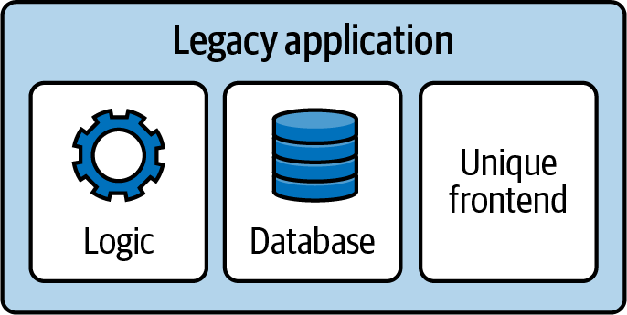

Figure 12-1. General architecture of a legacy application

Think about Instagram, TikTok, your bank, or whatever applications you have on your phone right now. They probably rely on a very similar architecture. You have access to the application only if the team behind it wants you to access it; there are no alternative websites you can visit to log into your Instagram account if the official one is out of service.

DApps have two clear goals: don't have a single point of failure and be a product that people can still use even if the whole team disappears. Their architecture can be simplified in the following way, as shown in Figure 12-2:

- Several Ethereum smart contracts form the basis of the logic part of the DApp. Most of the time, the Solidity (or Vyper) code is open source, too.
- Smart contracts can also contain data, working as a proper database and collecting all necessary user information.
- People can access the app via an official frontend, which is easily replaceable with an alternative one (even one that is made by the community) if the main one doesn't work for whatever reason.

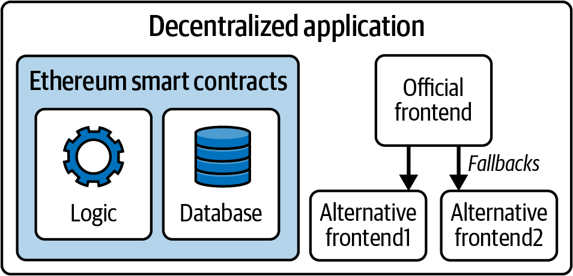

Figure 12-2. General architecture of a DApp

> **Note**  
>
> DApps can have some off-chain components with some degree of centralization, too, but usually these components are not fundamental for the core logic of the application. They may be helpful to speed up the application in the average case, but it should always be possible to fully rely on on-chain data in the worst case. This is not always true, and there are definitely some DApps that have core logic parts dependent on centralized components. They are not truly decentralized apps but are more like a hybrid form between legacy and fully decentralized applications.

In the next sections, we'll further explore each component of the DApp stack to better understand how they work and how they relate to one another and the Ethereum protocol.

## Backend (Smart Contract)

In a DApp, core business logic and data storage are encoded into smart contracts and run on the Ethereum blockchain instead of residing on a centralized server. The blockchain acts as a decentralized backend where transaction execution, state changes, and record keeping are trustlessly enforced by the network rather than a single entity.

Users don't need to trust any centralized team to access a DApp because they can expect the Ethereum network to always be working properly, handling all their transactions and correctly updating smart contracts' state, no matter the day or the hour.

Furthermore, this architecture introduces a very powerful property: *censorship resistance*. With traditional applications, you very often have a list of countries that are forbidden to access the app because of government laws or whatever reason. For example, as of 2025, Facebook is banned in Brazil, China, Iran, North Korea, Myanmar, Russia, Turkmenistan, and Uganda. People in those countries cannot create a profile or log into the platform.

With DApps built on Ethereum, this type of censorship is not achievable anymore. Even though it's still possible to ban an official website for a particular DApp, no one can prevent an address from interacting with some random smart contracts on chain. Anyone could jump in and create an alternative frontend for the DApp, and everybody could use it to interact with the DApp again.

### The Tornado Cash Saga

It's worth mentioning the story of Tornado Cash here. Tornado Cash is a decentralized mixing service that enables anyone, anywhere, to mix traceable or "tainted" cryptocurrencies with others, obscuring the trail back to their original source by breaking all links between the real sender and receiver of the funds.

On August 8, 2022, the US Treasury Department's Office of Foreign Assets Control blocklisted Tornado Cash, effectively prohibiting US citizens and companies from using it. The platform was accused of laundering more than $7 billion in cryptocurrencies. Two days later, on August 10, one of Tornado Cash's developers, Alexey Pertsev, was arrested in Amsterdam for only the crime of creating the platform itself. The official GitHub repository was removed, and developer accounts were suspended. As of December 2024, the official website remains inaccessible.

Given all of this, you might assume that the Tornado Cash DApp has ceased operations, but this couldn't be further from the truth. While the service has received less attention (and liquidity) since these events, the protocol remains fully functional and accessible through various IPFS-hosted gateways. In other words, anyone in the world can still use Tornado Cash as much as they could before, even without the original official website.

## Data Storage

Data storage refers to the solution used to save users' data. Storing and reading data into and out of smart contracts is possible, but it's an expensive operation, and it doesn't scale well; further, not everything needs to be saved on chain.

Usually, smart contracts store critical state information and enforce the DApp logic. Key pieces of information, such as account balances, ownership records, or results of computations, are stored directly in the smart contract. This ensures that sensitive and value-bearing data remains fully transparent, tamper resistant, and accessible to anyone with an Ethereum node.

All other information can be saved in a less decentralized data storage solution, such as a classical database. For example, DApp developers often use indexers for fast data query or centralized databases to store user data, so the frontend doesn't need to interact with the Ethereum chain at all.

> **Note**  
>
> A *blockchain indexer* is a tool that lets developers query and analyze data stored on the blockchain in a fast and efficient way. It takes transaction data, transforms it into machine- and human-readable data, and loads it into a database for easy querying.
>
> In fact, you cannot directly "search" data in the blockchain. For example, let's say you'd like to know how many USDC tokens a certain account held on block 15364050. You cannot just go to the USDC smart contract and look for it because it doesn't store historical data. You could take all the transactions that happened from that block up to now, filter them, and extract all the USDC transfer information that is related to that account, and then you could finally get your answer back. As you can imagine, this is not a desirable approach to follow. This is where indexers come into play. They maintain a database-like structure that lets you immediately run a query for whatever information you need, including historical information, and get an answer back quickly.

The idea is that you only need to store essential data and application logic on chain so that anyone can verify the DApp is working correctly; anything else can and should be left off chain.

### IPFS

*IPFS* is a decentralized, content-addressable storage system that distributes stored objects among peers in a P2P network. *Content addressable* means that each piece of content (file) is hashed and the hash is used to identify that file. You can then retrieve any file from any IPFS node by requesting it by its hash.

IPFS aims to replace HTTP as the protocol of choice for delivery of web applications. Instead of storing a web application on a single server, the files are stored on IPFS and can be retrieved from any IPFS node. Read the IPFS docs to learn more.

### Merkle trees

An interesting and frequently used solution is to save data off chain with a Merkle tree structure and store only the Merkle root on chain. This way, you don't have to store all the data in smart contracts, which would cost you a lot of money in gas fees, but you're still able to perform some sort of validation on chain.

> **Note**  
>
> Editor's note: the following code examples refer to "whitelist" in a very specific technical context. Though this term has problematic connotations, it is also widely used throughout the industry and its documentation. While we greatly value inclusivity, the authors have opted to keep the term as-is here for the sake of clarity in this presentation of technical concepts.

The most common use case is when you create an NFT collection and you want to whitelist different addresses so that they can mint those NFTs at a lower price before the public sale is open to everyone. You have two options.

The first is to create a storage variable inside the smart contract that maps each address to a Boolean value, which is true for all whitelisted addresses. Then, you can use this map to verify if a certain address is indeed whitelisted. The user doesn't have to provide anything when submitting the mint transaction; the contract simply checks that `msg.sender` is included in the whitelisted map, as follows:

```solidity
// SPDX-License-Identifier: MIT
pragma solidity 0.8.28;

// import OpenZeppelin contracts.
import "@openzeppelin/contracts/token/ERC721/ERC721.sol";
import "@openzeppelin/contracts/access/Ownable.sol";

// A simplified NFT contract with a whitelist mint function that uses a mapping to 
// store whitelisted addresses.
contract MyWhitelistNFT is ERC721, Ownable {
    // ... rest of the contract
    
    // mapping for whitelisted addresses
    mapping(address => bool) public isWhitelisted;
    
    /**
     * @notice Whitelist mint function.
     */
    function whitelistMint() payable {
        // ... rest of the function
        
        // check if the user is whitelisted.
        require(isWhitelisted[msg.sender], "You are not whitelisted");
        
        // mint the NFT.
        _safeMint(msg.sender, nextTokenId);
        nextTokenId++;
    }
}
```

The second is to create a Merkle tree off chain and store the Merkle root on chain in the contract. Then, you give each whitelisted user its Merkle proof. The user submits the Merkle proof to the contract, which verifies on chain the validity of that proof (usually through some libraries), as follows:

```solidity
// SPDX-License-Identifier: MIT
pragma solidity 0.8.28;

// import OpenZeppelin contracts.
import "@openzeppelin/contracts/token/ERC721/ERC721.sol";
import "@openzeppelin/contracts/access/Ownable.sol";
import "@openzeppelin/contracts/utils/cryptography/MerkleProof.sol";

// A simplified NFT contract with a whitelist mint function that uses a merkle tree to 
// store whitelisted addresses.
contract MyWhitelistNFT is ERC721, Ownable {
    // ... rest of the contract
    
    // the merkle root of the off-chain generated Merkle Tree.
    bytes32 public merkleRoot;
    
    /**
     * @notice Whitelist mint function.
     * @dev User must provide a merkle proof to prove they are whitelisted.
     * @param _merkleProof The proof that msg.sender is whitelisted.
     */
    function whitelistMint(bytes32[] calldata _merkleProof) external payable {
        // ... rest of the function
        
        // verify that (msg.sender) is in the merkle tree using the provided proof.
        bytes32 leaf = keccak256(abi.encodePacked(msg.sender));
        bool isValidLeaf = MerkleProof.verify(_merkleProof, merkleRoot, leaf);
        require(isValidLeaf, "Invalid Merkle Proof: Not whitelisted");
               
        // mint the NFT.
        _safeMint(msg.sender, nextTokenId);
    }  
}
```

The second option is a lot cheaper and more efficient than the first, especially for large whitelists.

> **Note**  
>
> This method greatly reduces gas costs but introduces the potential risk of a dishonest whitelist creator unless the tree and proofs are auditable. Ideally, the original list used to generate the tree should be open source and accessible so that anyone can verify the validity of the resulting Merkle root.

## Frontend (Web User Interface)

The frontend of a DApp is created by using any of the most well-known Web2 frameworks, such as React, Angular, or Vue. The interaction with the Ethereum chain, if needed, is abstracted through libraries like `viem` or `ethers.js`.

A naive approach to building a DApp frontend is to read data only directly from the chain to update all the components. For example, if you need to display the balances of some tokens that an account holds, you could query the blockchain and get the answer back, repeating this step for every new block.

The main problem with this naive approach is that your website becomes really slow, and it could be very frustrating for users to interact with such a frontend. This is why, as we've mentioned previously, developers often use centralized data storage components in their DApp architecture, minimizing the interaction with the chain: it makes the whole user experience better. So you usually end up with a frontend that relies on some centralized components, but you can always verify all the information by double-checking on the blockchain. Eventually, you could create your own alternative frontend for a particular DApp if you don't trust the official one or simply don't like it at all.

Figure 12-3 shows a complete (simplified) DApp architecture.

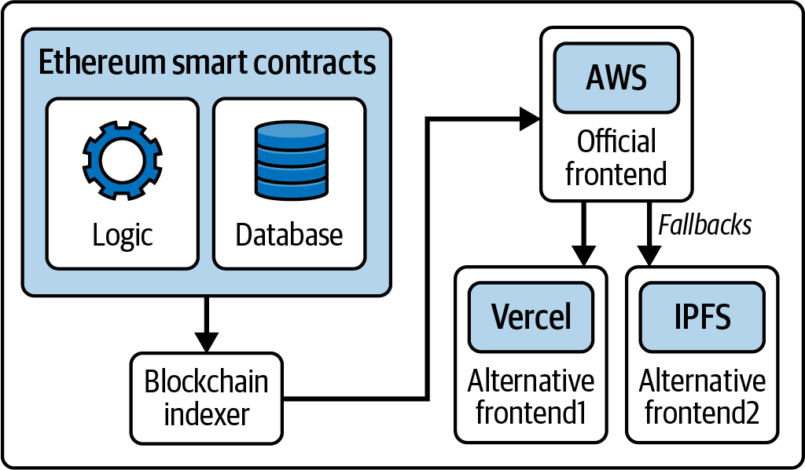

Figure 12-3. Complete DApp architecture

## A Basic DApp Example

So far, we've explored the basic concepts behind a DApp. Now, it's time to roll up our sleeves and build a DApp ourselves.

You can find lots of tutorials online to help you build your first DApp on Ethereum from scratch, but we really recommend [Speedrun Ethereum](https://oreil.ly/Onygc). It's the most effective way to learn quickly and immediately start building cool stuff. To increase your knowledge of building DApps on Ethereum, we suggest that you complete all the challenges you can find on Speedrun Ethereum and join the [BuidlGuidl community](https://buidlguidl.com).

In this section, we're going to build a very basic decentralized application, a sort of "Hello World" DApp. You don't need any previous experience; all you need is a computer and an internet connection.

### Installation Requirements

To follow this tutorial, you need to install [node.js](http://node.js) and [yarn](https://oreil.ly/dq_hw) on your computer. Refer to the official websites to download and install them. We'll use [Scaffold-ETH 2](https://scaffoldeth.io), a very cool tool that lets you create your development environment very quickly.

### Creating the DApp

Let's open a terminal and run the following command:

```bash
$ npx create-eth@latest
```

It will ask for a project name. We chose "mastering-ethereum" for this demonstration:

```
 +-+-+-+-+-+-+-+-+-+-+-+-+-+-+ 
 | Create Scaffold-ETH 2 app | 
 +-+-+-+-+-+-+-+-+-+-+-+-+-+-+

? Your project name: mastering-ethereum
```

Then, it will ask for the Solidity framework we want to use. We'll use Hardhat here, but feel free to choose the one you are more familiar with:

```
? What solidity framework do you want to use?
❯ hardhat
   foundry
  none
```

After a couple of seconds, you should see a "Congratulations" and some "Next steps" similar to these:

```
  Congratulations! Your project has been scaffolded! 🎉

  Next steps:

  cd mastering-ethereum
  
        Start the local development node
  
        yarn chain
  
        In a new terminal window, deploy your contracts
  
        yarn deploy
  
    In a new terminal window, start the frontend
  
    yarn start
  
 Thanks for using Scaffold-ETH 2 🙏 , Happy Building!
```

### Starting the Chain

We now have everything in place to start building our DApp. Enter the project folder:

```bash
$ cd mastering-ethereum
```

Here, you can find an example smart contract called `YourContract.sol` if you go into `packages/hardhat/contracts`. The `contracts` folder is where you should put every smart contract you will need for your DApp project.

Inside `packages/nextjs`, you will find the nextjs framework structure already in place for your DApp frontend.

Since this is a very basic tutorial, we won't write any contracts from scratch or modify the frontend. We'll stick with defaults to quickly show the usual workflow.

First, you need to start a chain for local development. In fact, even though the final product will use smart contracts that are deployed on the Ethereum mainnet, you shouldn't use a real chain to build and test your DApp. It would be really slow and a waste of a lot of money, too. Scaffold-ETH comes with a very useful and easy command to immediately start a new chain for local development. You just need to run:

```bash
$ yarn chain
```

### Deploying Your Contract

Now, you need to deploy your contract to the local chain that you set up in the previous step. Again, Scaffold-ETH has an easy command for that. Open a new terminal and type:

```bash
$ yarn deploy
```

You should see something like this:

```
Generating typings for: 2 artifacts in dir: typechain-types for target: ethers-v6
Successfully generated 6 typings!
Compiled 2 Solidity files successfully (evm target: paris).
deploying "YourContract" (tx: 0x8ec9ba16869588c2826118a0043f63bc679a4e947f739e8032e911475e77dcb4)...: deployed at 0x5FbDB2315678afecb367f032d93F642f64180aa3 with 532743 gas
👋  Initial greeting: Building Unstoppable Apps!!!
📝  Updated TypeScript contract definition file on ../nextjs/contracts/deployedContracts.ts
```

As you can see, this command deploys the contract called `YourContract`—the example smart contract—on the local chain. In the future, when you build a new DApp, you'll need to go to `packages/hardhat/deploy` and change the `00_deploy_your_contract.ts` file so that you can deploy all the contracts you actually need.

If you go back to the terminal where you previously ran the command `yarn chain`, you should have some new logs, specifically one similar to this:

```
eth_sendTransaction
  Contract deployment: <UnrecognizedContract>
  Contract address:    0x5fbdb2315678afecb367f032d93f642f64180aa3
  Transaction:         0x8ec9ba16869588c2826118a0043f63bc679a4e947f739e8032e911475e77dcb4
  From:                0xf39fd6e51aad88f6f4ce6ab8827279cfffb92266
  Value:               0 ETH
  Gas used:            532743 of 532743
  Block #1:            0xa7b8e3b6f82eccb3542279573dbf8efa2b876ff00807a8619feef191007e06d9
```

Note the `Contract deployment` and the `Contract address` lines. That proves that you have successfully deployed your contract on the local chain at that particular contract address.

### Starting the Frontend

The Scaffold-ETH example comes with a basic built-in frontend so that you can immediately start interacting with your contracts with a graphical interface. Open a new terminal window and type:

```bash
$ yarn start
```

It should return something like:

```
yarn start
  ▲ Next.js 14.2.21
  - Local:        http://localhost:3000
 
 ✓ Starting...
 ✓ Ready in 1767ms
```

Now copy the localhost URL, open your browser, and paste the link. You should see the frontend, as shown in Figure 12-4.

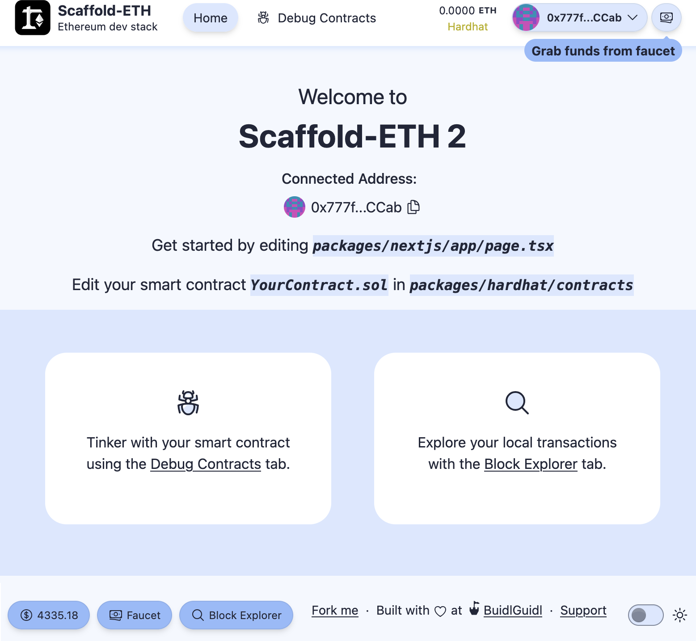

Figure 12-4. Scaffold-ETH frontend

### Interacting with Your Contract

Congratulations, you're all set up. You can now experiment and interact with your DApp. There are a couple of really useful features that you'll find fundamental for your development workflow:

- Burner wallets
- Debug Contracts section

As you can see in Figure 12-4, in the upper-right corner, we are already connected to the website with a wallet that may look random and unfamiliar to us. That's because it's a *burner wallet*: an auto-generated address whose private key is temporarily saved in your web browser. In fact, if you try to update the page, you'll notice that your burner address doesn't change.

Burner wallets are a killer feature for your development workflow since you don't have to open your Web3 wallet and connect it to the website every time. You can still do that once you're ready; you just need to click on the drop-down menu and select Disconnect; then, you can click Connect Wallet and choose your preferred wallet from the list, as shown in Figures 12-5, 12-6, and 12-7.

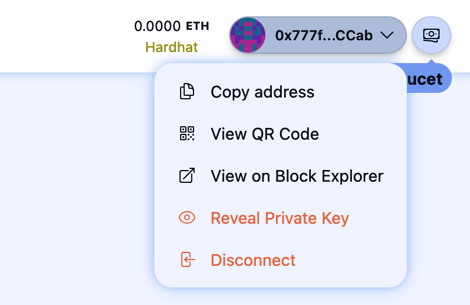

Figure 12-5. Disconnect burner wallet

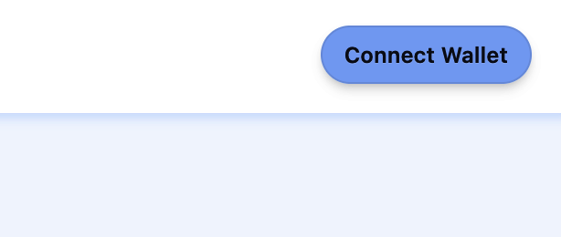

Figure 12-6. Connect Wallet button

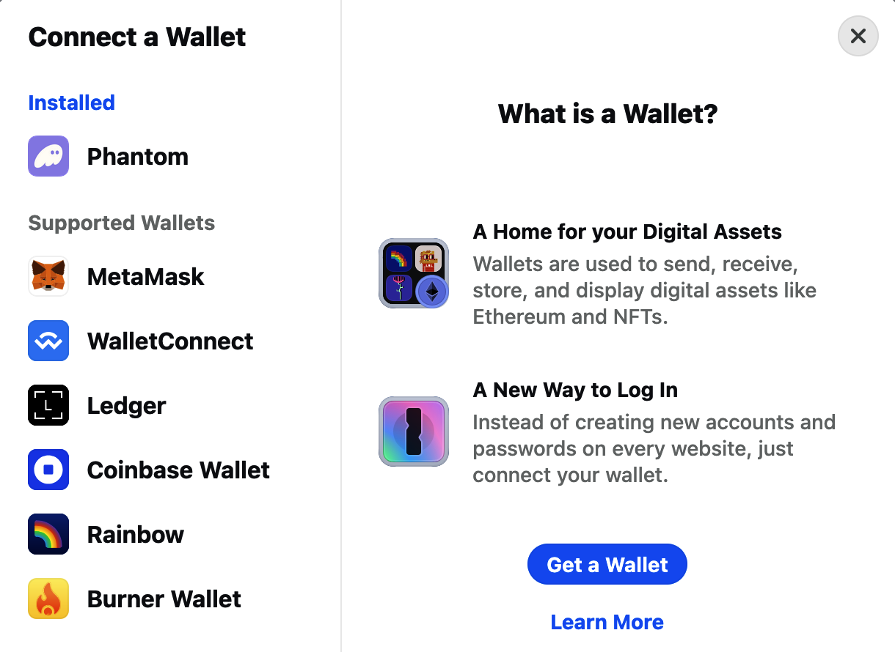

Figure 12-7. Choose wallet

The second killer feature is the Debug Contracts section. To open it, just click the Debug Contracts link at the center of the page. With the default example, you should now see something like Figure 12-8.

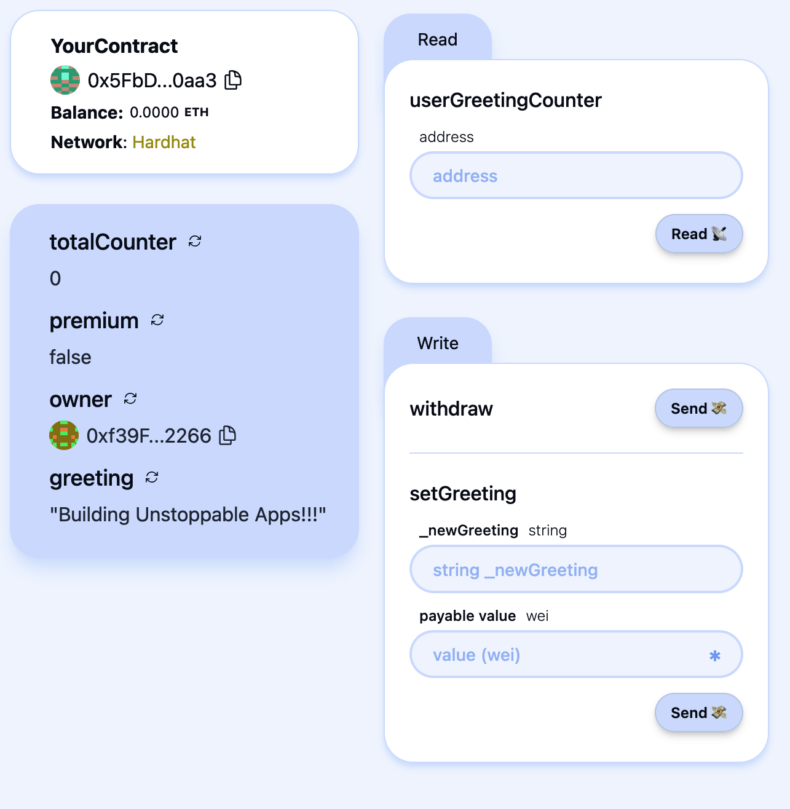

Figure 12-8. Debug Contracts section

Here, you can easily interact with all your contracts without having to build any kind of frontend on top of them. This is really useful during development to constantly check that your contracts work as you expect them to.

Let's do a small demonstration. First, we need to fund our burner wallet so that we can later send some transactions to interact with the deployed contract. To do that, you just need to click on the right-most button, as shown in Figure 12-9. You'll almost immediately receive some ETH, and you'll see your ETH balance increase.

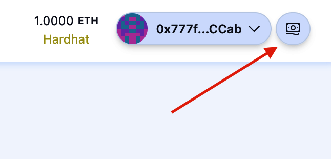

Figure 12-9. Grab funds button

Now go to the `setGreeting` section and type `hello world` in the "_newGreeting" field and `0.1` in the "payable value" field. Then, click the asterisk you can find on the right of the "payable value" field: it will transform the ETH value into the same amount represented in wei (1 ETH = 10<sup>18</sup> wei). Finally, you can click Send to send your transaction and see how it changes the state of your contract.

Figure 12-10 shows the state of the contract before hitting the Send button. You can see that your contract holds 0 ETH, the greeting is "Building Unstoppable Apps!!!," premium is false, and totalCounter is equal to 0.

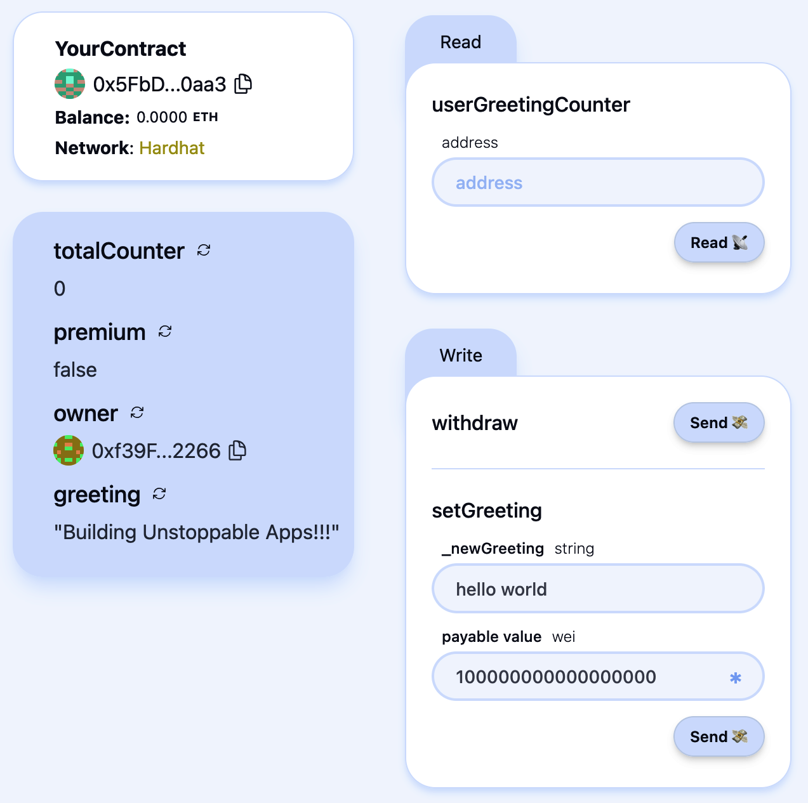

Figure 12-10. Contract state before transaction

Figure 12-11 captures the state of the contract after sending the transaction. You can immediately see that your contract now holds 0.1 ETH, the greeting is "hello world," premium is true, and totalCounter is equal to 1.

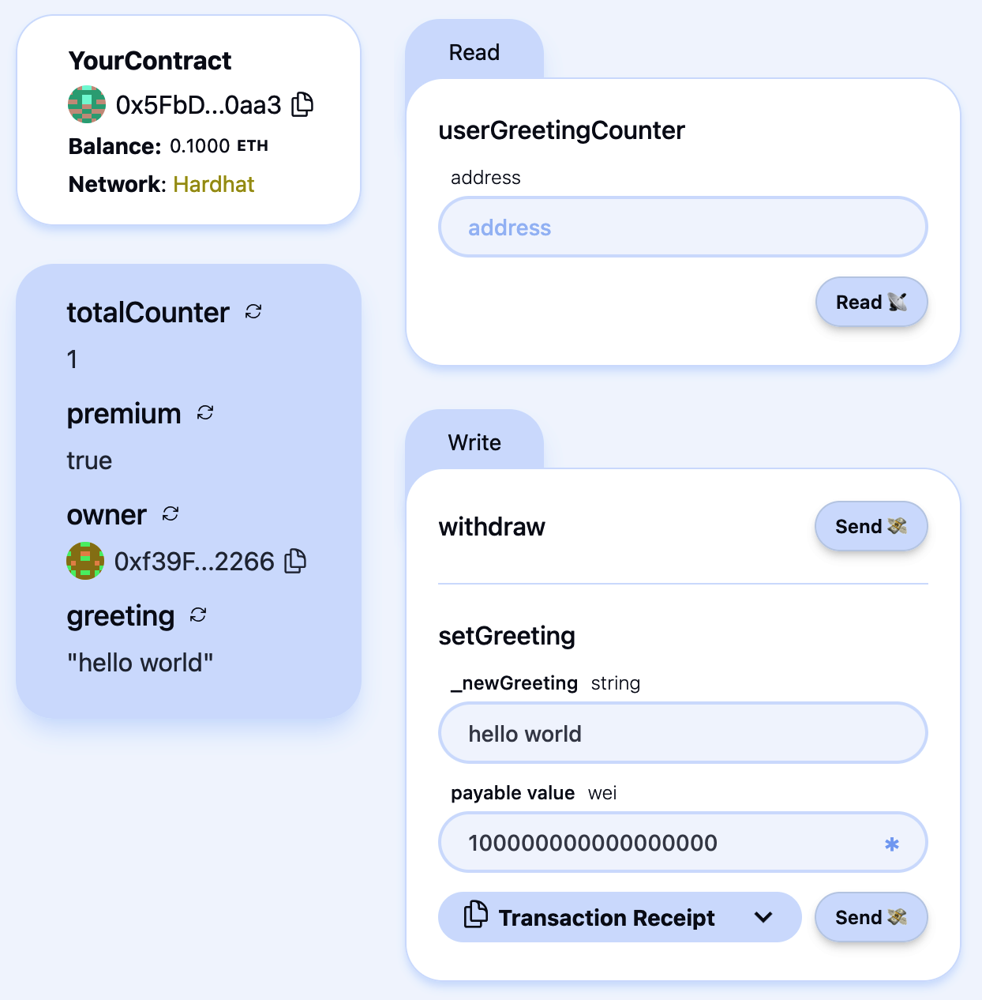

Figure 12-11. Contract state after transaction

You can play around with this and see how your contract behaves based on your inputs and actions.

### Deploying Your Contract to a Live Blockchain

Now that you've experimented with your contracts, it's time to deploy them to a real blockchain before publishing your dApp to the world. Up until now, running `yarn deploy` has only deployed your contracts to your local testnet, which no one else can access, meaning your dApp wouldn't work for anyone but you.

The first step is to generate a deployer account - i.e. the on-chain account that will submit the transaction to deploy your contracts.

```bash
$ yarn generate
```

You'll be prompted for an optional password. If everything goes well, you should see output similar to this:

```bash
👛 Generating new Wallet

✔ Enter a password to encrypt your private key:
✔ Confirm password:

📄 Encrypted Private Key saved to packages/hardhat/.env file
🪄 Generated wallet address: 0x3a08bC7AF33bfED880C41A90FeE0D2776C98e3BF

⚠️ Make sure to remember your password! You'll need it to decrypt the private key.
```

Next, you need to fund your newly generated account with some ETH on the target blockchain. To view your account details and current balance, run:

```bash
$ yarn account
```

Now you're ready to deploy your contract to Ethereum by running:

```bash
$ yarn deploy --network mainnet
```

To complete the setup, update the `scaffold.config.ts` file to point to the deployed network (Ethereum in our example). Change:

```bash
targetNetworks: [chains.hardhat],
```

to:

```bash
targetNetworks: [chains.mainnet],
```

Your frontend will now connect to the contracts you've deployed on Ethereum mainnet.

Optionally, you can verify your contracts on Etherscan with:

```bash
$ yarn verify --network mainnet
```

> **Note**  
>
> Verifying a contract on Etherscan allows anyone to view and read your contract's source code on Ethereum's most popular block explorer, confirming that it matches the actual deployed bytecode.

### Deploying to Vercel

When you're satisfied with your decentralized application, you can publish it to a production environment such as Vercel. Vercel is a really useful frontend-as-a-service tool that lets you easily deploy your application to the internet. You can also attach a custom domain that you have bought so that people can reach your DApp just by typing the domain name.

Scaffold-ETH again comes to your aid by providing a single command to immediately deploy your DApp to Vercel. Open a terminal and type:

```bash
$ yarn vercel:yolo
```

You'll need to link your Vercel account (or create a new one if you don't have it) and choose a name for your project—that's it. After a few minutes, you'll have your entire DApp deployed to Vercel, and anyone in the world can go try it out.

If you go to your Vercel profile, you can now see your newly created project. As shown in Figure 12-12, there is a Domains field where you can find the website domain that Vercel auto-generated for you.

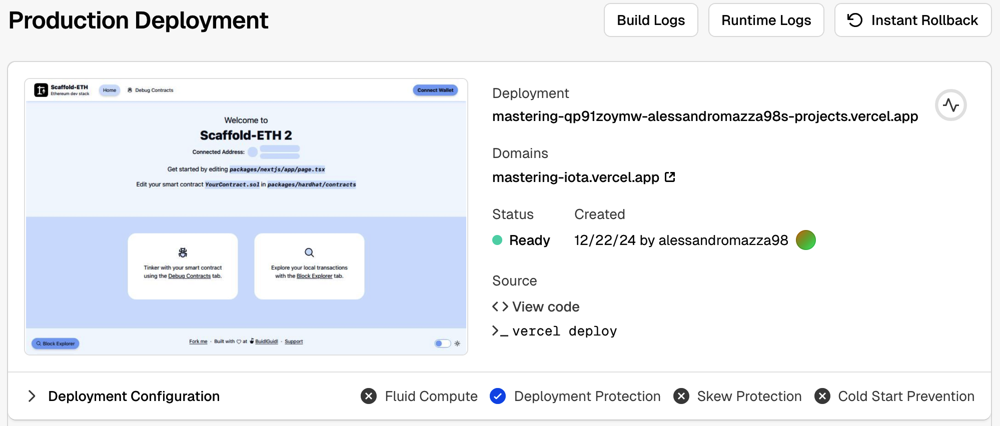

Figure 12-12. Vercel project page

## Further Decentralizing the DApp

In the previous section, we deployed our DApp to Vercel. While Vercel is one of the most popular solutions for hosting DApps, it is not a decentralized service. Everything resides on its proprietary servers, which means Vercel could potentially censor any user based on its policies and track the IP addresses of everyone interacting with your DApp.

To further decentralize our DApp, we can host the frontend on solutions like IPFS, a global P2P network of nodes. An emerging service worth mentioning is `eth.limo`, which aims to match the user experience of mainstream websites—typically served via centralized platforms—with the robustness and decentralization provided by IPFS and similar technologies.

### Decentralized Websites

[Eth.limo](https://eth.limo/) is the missing piece of the puzzle to create better decentralized websites—also called *DWebsites*—that can be accessed in the same way you usually would with a classic app. It's based on the ENS technology, which makes Ethereum addresses user-friendly with `.eth` domain names. Vitalik Buterin, one of the cofounders of Ethereum, uses ENS to link his wallet address—`0xd8dA6BF26964aF9D7eEd9e03E53415D37aA96045`—with the easy-to-remember name `vitalik.eth`.

ENS goes beyond just linking a domain with an Ethereum address: it can also resolve to an IPFS website (actually the content hash), something like `bafybeif3dy…ga4zu`. The main problem related to IPFS websites is that most popular web browsers are not able to properly resolve them and show their contents to the user. This is where `eth.limo` comes into play: it operates a reverse proxy for ENS names and IPFS contents. It captures all requests to `*.eth.limo` (basically all websites ending with `.eth.limo`) and automatically resolves the IPFS contenthash of the requested ENS record, returning the corresponding static content over HTTPS. For example, when you go to [Vitalik Buterin's official blog](https://vitalik.eth.limo), this is what's happening under the hood:

1. Eth.limo sees the incoming requests to the `vitalik.eth` ENS domain.
2. It resolves it to the IPFS contenthash (that Buterin previously set) containing the home page of his website.
3. It returns the corresponding static content over HTTPS.

This way, anyone in the world with a web browser can easily access content that is stored on IPFS with zero configuration or setup needed.

### Limitations

Even though DWebsites in general—and `eth.limo` in particular—are an evolving technology and are improving pretty fast, there are still some limitations at the time of writing this chapter (June 2025). First, IPFS can only handle static files, so it cannot perform any kind of server-side computation. Furthermore, to use `eth.limo`, you need to buy an ENS and link it to the IPFS contenthash of your frontend. And you must always use the `*.eth.limo` custom domain; you cannot cut the `.limo` final part of it, or your web browser will not be able to resolve your ENS name to the IPFS frontend for your DApp. This is probably why most DApps do not use `eth.limo`.

> **Tip**  
>
> Although it's true that most web browsers are not compatible with ENS and IPFS yet, certain browsers are starting to add support for them. One example is [Brave](https://oreil.ly/LlJT7).

It must be said that `eth.limo` is another potentially centralized third party that could stop working without any notice. In case that happens, your DApps would still be reachable through IPFS, but the `.eth.limo` URL would not redirect users to them anymore.

If you're interested and want to deep-dive into this solution for building fully decentralized websites, you can find a lot more details on the [official website](https://eth.limo).

### Deploying to IPFS

Scaffold-ETH 2 has another easy command that lets you quickly push your DApp to IPFS. You just need to open a new terminal and type:

```bash
$ yarn ipfs
```

And it's done! You should see something like this:

```
   Creating an optimized production build ...
 
 ✓ Compiled successfully
 ✓ Linting and checking validity of types
    
 ✓ Collecting page data
    
 ✓ Generating static pages (8/8)
 ✓ Collecting build traces
    
 ✓ Finalizing page optimization

…

🚀  Upload complete! Your site is now available at: https://community.bgipfs.com/ipfs/bafybei…
```

If you go to the displayed website, you should see your DApp working fine with the frontend hosted on IPFS. The string "bafy…" is the IPFS contenthash. You still need to configure `eth.limo` if you have a personal ENS and want to redirect it to this IPFS-hosted site.

This is what actually happens under the hood of this `yarn ipfs` command:

1. The frontend is built in order to have the static files ready to be uploaded to IPFS.
2. The static files are uploaded to IPFS through the BuidlGuidl (the maintainers of Scaffold-ETH 2) IPFS community node.
3. A URL is returned that redirects to the static files, working as a reverse proxy for the IPFS content (`community.bgipfs.com/<ipfs-content-hash>`).

See [BuidlGuidl IPFS](https://www.bgipfs.com) if you want to learn how to run your own IPFS node and pin a cluster.

## From App to DApp

Over the past several sections, we have gradually built a decentralized application. We used a tool called Scaffold-ETH to facilitate our development workflow: we started a local chain, deployed our contract, and launched a local frontend to immediately begin interacting with and testing our DApp. Next, we published our DApp's frontend to Vercel to show how simple it is to deploy a DApp in a production-ready environment. Finally, we explored how to further decentralize our DApp by posting the frontend to IPFS and using solutions such as ENS and `eth.limo`, allowing anyone to access it without installing a special app.

Figure 12-13 provides a concise overview of the engineering stack required to create a fully decentralized application.

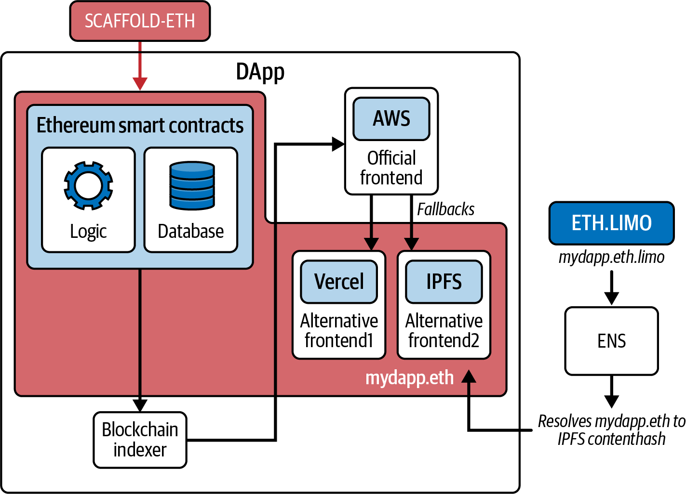

Figure 12-13. Concise overview of the full engineering stack of a DApp

## Conclusion

In this chapter, we've explored how to build a basic DApp from scratch using modern tools to streamline the development workflow. In the next chapter, we'll take a closer look at some of the most important DApps—and categories of DApps—on Ethereum that collectively create what is known as DeFi.
