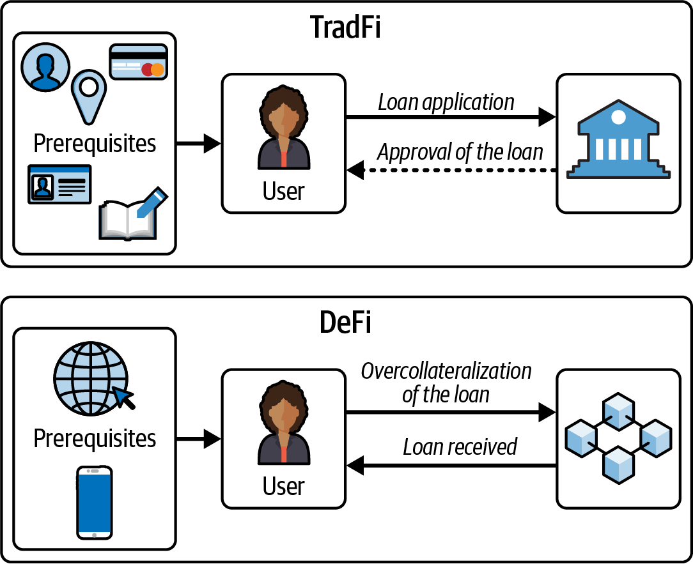
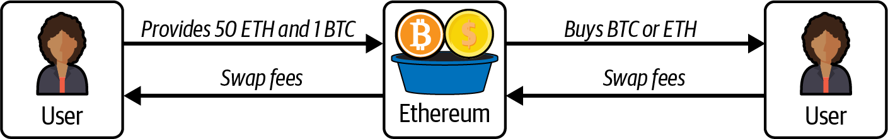
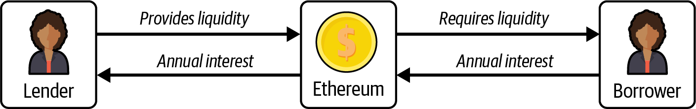
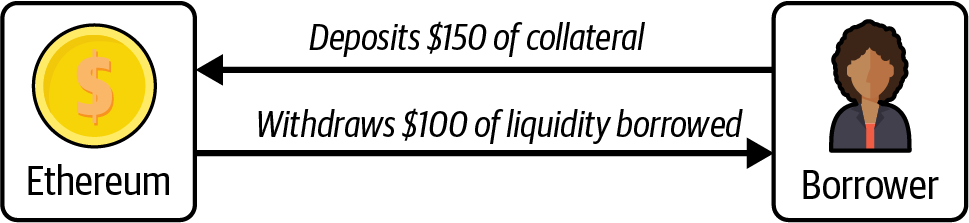
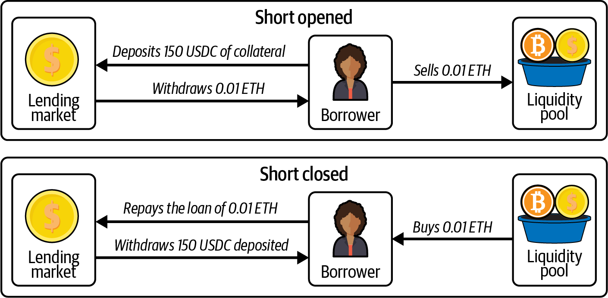
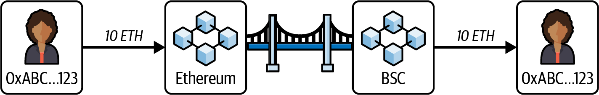
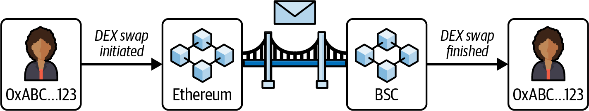

# Chapter 13. Decentralized Finance

Ethereum's smart contracts have opened up a world of possibilities beyond simple cryptocurrency transactions. *Decentralized finance* (DeFi) takes this to the next level by creating a complete financial ecosystem that operates entirely on the blockchain. Imagine traditional financial services like lending, borrowing, trading, and investing but without the need for banks, brokers, or any centralized authority. Instead, smart contracts on the Ethereum blockchain handle everything, bringing about a new era of financial autonomy and innovation.

This decentralized approach democratizes access to financial services and introduces a level of transparency and security that is often missing in traditional finance. Every transaction on the blockchain is publicly recorded and immutable, allowing anyone to verify the authenticity and integrity of the data. This level of transparency reduces the risk of fraud and corruption, creating a more trustworthy financial environment.

DeFi also opens opportunities for financial inclusion on a global scale. In regions where traditional banking infrastructure is underdeveloped or inaccessible, DeFi provides a viable alternative. People can participate in the global economy using just a smartphone and an internet connection. This capability can potentially uplift millions by providing access to credit, savings accounts, and investment opportunities that were previously out of reach. The programmability of Ethereum's smart contracts allows for the creation of complex financial instruments and services that are difficult or impossible to implement in the traditional financial system.

Currently, the primary users of DeFi are probably not the underbanked or unbanked populations of developing countries, but rather individuals from first-world nations looking to capitalize on the highly speculative nature of cryptocurrencies. While there will always be room for speculation, it's important to ensure that inclusive financial products are accessible to everyone worldwide.

## DeFi Versus Traditional Finance

DeFi is the cryptopunk response to the traditional financial (TradFi) system, representing a field that is still evolving but has already found its niche of dedicated users and innovative builders. The distinction between DeFi and TradFi is complex. However, the most significant differences lie in the mediums of exchange and the inherent properties of the blockchain, such as openness and transparency. DeFi primarily uses cryptocurrencies, which are often decentralized to varying degrees, while TradFi relies on fiat currencies, which are always centralized to the maximum degree.

TradFi systems often have high barriers to entry. Opening a bank account, obtaining a loan, or investing in financial markets typically requires significant documentation and compliance with various regulatory requirements. This process can exclude large segments of the global population, particularly those in underbanked regions. This can be seen in Figure 13-1.



Figure 13-1. Traditional finance versus DeFi loan requirements

A regular user needs many prerequisites to open a loan application, such as an ID, a provable physical address, a Social Security number, a bank account, signed documents, and a good credit score. Even with all these, the request might still be denied, and if it is approved, that will probably take a long time to happen.

In DeFi, only three prerequisites are needed: a phone, an internet connection, and enough assets to overcollateralize the loan. Once these are in place, the loan is instant, decentralized, and permissionless.

DeFi, by design, is more accessible. Anyone with an internet connection can interact with DeFi protocols, which opens financial services to billions of people who are excluded from the traditional system. The high accessibility of DeFi makes it difficult or impossible to apply TradFi's mechanisms for assessing creditworthiness and resolving fraud, which some view as a drawback and others as an improvement.

Another fascinating aspect of DeFi is its ability to create new financial instruments that are impossible within the traditional financial system. For example, flash loans allow users to borrow funds without collateral as long as the loan is repaid within the same transaction. This capability, which is unique to DeFi, opens a range of possibilities for arbitrage, collateral swaps, and other complex financial maneuvers that simply cannot be replicated in TradFi.

## DeFi Primitives

While cryptocurrencies like Bitcoin aim to improve and decentralize the concept of money, DeFi projects build on this foundation to decentralize and improve financial services. To fully grasp the financial services offered by DeFi, it is essential to understand several key concepts.

### Acceptability of Tokens in DeFi

In Ethereum's DeFi ecosystem, each token operates as a distinct contract. This can cause confusion for beginners since there may be tokens with similar names and functions that are, in reality, entirely different forms of money.

Take, for instance, the Arbitrum rollup on Ethereum, where two tokens, USDC.e and USDC, appear almost identical but differ significantly in terms of risk and acceptability. Both USDC.e and USDC aim to maintain a value pegged to one dollar. However, USDC is natively issued on the Arbitrum chain, while USDC.e is a bridged version of USDC, representing tokens that have been transferred from another chain to Arbitrum.

The risk profiles of these two tokens are markedly different. USDC.e carries all the inherent risks of USDC but adds the additional risk associated with the bridging process, such as the potential for smart contract vulnerabilities. Acceptability, defined by how widely a coin or token is accepted across various DeFi financial services, also varies between the two. Some protocols may only support USDC.e, others may exclusively support USDC, and some may accept both.

### Decentralized Exchanges

A *decentralized exchange* (DEX) is a platform where you can trade cryptocurrencies directly with other users without needing a central authority or intermediary. Instead of relying on a company to facilitate the trades, DEXs use smart contracts to manage transactions automatically. This allows you to maintain control of your funds.

#### The Evolution of DEXs

If you have ever traded on a centralized exchange, you are familiar with the order book model. In this model, buy and sell orders are listed with the prices users are willing to pay or accept. When a buy order matches a sell order, the trade is executed. The order book shows all pending orders, allowing traders to see market depth and liquidity.

On chain, this model never really caught on because blockchains are much slower and more expensive to use than traditional websites. The latency in trading on the order book and the need to pay for the transaction of every order made the user experience terrible. In 2017–2018, EtherDelta attempted to implement an on-chain order book, and a few other pure order book models were tried afterward, but they didn't gain much traction.

Bancor was the first to pioneer the *automated market maker* (AMM) model. Unlike the order book model, AMMs don't rely on buyers and sellers placing orders. Instead, they use liquidity pools, where users provide pairs of tokens.[^1] The prices are determined by a formula based on the ratio of tokens in the pool. This model allows for continuous liquidity and trading.

Uniswap significantly improved and popularized the AMM model with its simple yet effective *x × y = k* formula, where the product of the quantities of the two tokens remains constant. In this formula, *x* and *y* represent the quantities of the two tokens in the pool, and *k* is a constant value. When a trade is made, the quantities of the tokens change, but the product of the two quantities remains the same, ensuring that the pool always provides liquidity. This innovation made trading more accessible and efficient on decentralized exchanges.

[^1]: The tokens might not always be in pairs because some liquidity pools can have three or more tokens, but the most common and simplest arrangement is in pairs.

A DEX enables anyone to become a market maker by providing liquidity and earning fees for their contributions. As long as there is sufficient liquidity, trades can occur quickly and without the need for permission from a central authority, as can be seen in Figure 13-2.[^2]

[^2]: From Figure 13-2, it may appear that BTC is natively exchangeable on DEXs. However, this is not the case. BTC on DEXs is often represented by derivative contracts like Wrapped Bitcoin (WBTC), which are assets pegged to the price of BTC but carrying significantly more risk than native BTC on the BTC blockchain. Native assets are typically only available on their respective native chains. In this example, the BTC used in the pool is not native BTC but a derivative, similar to how stablecoins represent fiat money.



Figure 13-2. Decentralized exchange liquidity pool

#### Impermanent Loss

Providing liquidity on a DEX is not risk free. Beyond smart contract hacks, there's a more subtle risk called *impermanent loss*. To understand impermanent loss, we first need to grasp the basic Uniswap V2 pool model.

Many popular DEXs, like Uniswap V2, use the constant product formula *x × y = k*, where *x* and *y* are the quantities of two tokens in a liquidity pool and *k* is a constant. The price of a token is determined by the ratio of the tokens in the pool. For example, if a pool contains 100 USDC and 10 ETH, the price of 1 ETH is 100 ÷ 10 = 10 USDC. If the pool changes to 200 USDC and 10 ETH (due to trades), the price of 1 ETH becomes 200 ÷ 10 = 20 USDC.

This formula is a simplified way to understand how pools work. By providing liquidity, you act as a market maker. When users buy ETH from the pool, you sell ETH and receive USDC; when they sell ETH, you buy ETH and give USDC. In return, you earn trading fees. However, this process exposes you to impermanent loss, which occurs when the price of the tokens in the pool changes compared to when you deposited them. If the price of ETH rises or falls significantly, the value of your pool holdings may be less than if you had simply held the original tokens, even though you collect fees.

This openness also presents a significant challenge for DEXs. Since anyone can create a blockchain and launch a DEX, there are now more than one hundred DEXs (likely many more) across various blockchains. This abundance fragments liquidity, making swaps—where users exchange one cryptocurrency for another—less efficient than they would be on platforms with consolidated liquidity. This fragmentation can lead to higher *slippage*, which is the difference between the expected price of a trade and the actual price at which the trade is executed. High slippage occurs when there is insufficient liquidity, causing trades to be executed at less favorable prices than anticipated.

#### Why the Constant Product Formula Works

The elegance of the *x × y = k* formula lies in its mathematical shape: a hyperbola. This isn't just a coincidence—it's a deliberate design choice that protects liquidity pools from being completely drained.

**The Problem with Linear Pricing**

Imagine if a DEX used a simple linear (constant) pricing formula instead, where swapping 1 ETH always gives you exactly 2 USDC regardless of how much liquidity remains. This creates a very bad trading environment: whenever that fixed rate differs from the price on the rest of the market, arbitrageurs have an incentive to trade against the pool until one side of the reserves is exhausted:

1. If the pool underprices ETH relative to the market (as in our 2 USDC per ETH example when ETH trades far higher elsewhere), anyone can keep swapping USDC for ETH until the pool’s ETH is effectively gone.
2. If instead the pool overprices ETH, traders sell ETH into the pool and drain USDC the same way.
3. The pool does not rebalance itself from trade flow alone: reserves stay skewed toward one token until one asset is depleted, because the quoted price never adjusts to remaining liquidity.

This is why fixed-price or linear curves are fundamentally unsuitable for AMMs—they allow complete pool drainage.

**The Hyperbola Solution**

The constant product formula *x × y = k* produces a hyperbolic curve that has a critical property: it never touches either axis. As you try to buy more and more of one token, the price increases exponentially, making it mathematically impossible to drain either token to zero.

```
Token Y (e.g., USDC)
    │
200 ┤·
    │ ·
    │  ·
150 ┤   ·
    │    ·
    │     ·
100 ┤       ·    ← x × y = k (hyperbola)
    │         ·
    │           ··
 50 ┤              ···
    │                  ······
    │                          ·················
  0 ┼────────────────────────────────────────────→ Token X (e.g., ETH)
    0        50       100       150       200
```

Consider a pool with 100 ETH and 200 USDC (k = 20,000):

- **Swapping 1 ETH for USDC**: You receive approximately 1.98 USDC (close to the 1:2 ratio)
- **Swapping 50 ETH for USDC**: You receive only 66.67 USDC (not 100 as a linear model would suggest)
- **Trying to get all 200 USDC**: You would need to provide infinite ETH

The formula for calculating output is:

```
Δy = (y × Δx) / (x + Δx)
```

Where *Δx* is the input amount and *Δy* is the output amount. As *Δx* approaches infinity, *Δy* approaches *y* (the total reserve) but never reaches it.

This asymptotic behavior is what makes AMMs secure. The larger the trade relative to the pool size, the worse the exchange rate becomes. This creates *slippage*—the difference between the expected price and the actual execution price—which naturally discourages trades that would significantly deplete the pool.

The hyperbolic curve ensures that liquidity pools are self-protecting: the scarcer a token becomes, the more expensive it gets, creating an economic barrier that prevents complete drainage. This elegant mathematical property is what made Uniswap's simple formula revolutionary in enabling trustless, permissionless trading.

> **Note**
>
> Uniswap, which is arguably one of the most significant projects in the current DeFi landscape, was inspired by a 2016 Reddit post by Vitalik Buterin. Hayden Adams, who reportedly had no prior coding experience, took a year to develop Uniswap V1 using the Vyper programming language.

### Lending Markets

A *lending market* or *money market* is a decentralized platform that facilitates the lending and borrowing of cryptocurrencies, using smart contracts to automate and secure the entire process. Unlike traditional financial systems, lending markets operate without intermediaries like banks, providing a more transparent and efficient way to handle loans.

In a lending market, users who want to earn interest on their crypto assets can deposit their funds into a lending pool. These deposits contribute to the overall liquidity of the platform. Lenders earn interest on their deposits, with rates often determined algorithmically based on the supply and demand within the pool. The more demand there is for borrowing, the higher the interest rates are, incentivizing more lenders to contribute their assets to the pool.

Borrowers, on the other hand, can access these funds by providing collateral, which is typically worth more than the amount they wish to borrow. This overcollateralization is critical in lending to mitigate the risk of default, primarily because most crypto assets are very volatile and could leave the lending market with bad debt[^3] if the loan were not overcollateralized. The collateral is locked in a smart contract, ensuring that if the borrower fails to repay the loan, the collateral can be liquidated to cover the outstanding amount.

[^3]: Bad debt occurs when a borrower defaults on a loan and the remaining collateral is insufficient to cover the owed amount. This can happen because of sudden market volatility or improper collateral valuation. Unlike liquidation, where collateral is sold to cover the debt, bad debt remains uncollectible, causing a loss to the lending protocol and its users.

This system protects lenders and ensures that the lending pool remains solvent. A simplified version of this can be seen in Figure 13-3: the lender provides liquidity and collects annual interest paid by the borrower, who withdraws the provided liquidity.



Figure 13-3. Lending market basic flow

The interest rates in lending markets are dynamic, fluctuating based on market conditions. The platform's algorithms continuously adjust rates to balance the supply of available funds and the demand for loans. This creates an efficient and responsive financial ecosystem where both lenders and borrowers can benefit from fair market-driven rates.

Collateralization ratios are another important aspect of lending markets. These ratios determine the amount of collateral needed to secure a loan. For instance, a common collateralization ratio might be 150%, meaning that to borrow $100 worth of cryptocurrency, a borrower would need to deposit at least $150 worth of collateral, as shown in Figure 13-4. This ensures that there is a buffer to absorb potential losses from price volatility.



Figure 13-4. Lending market collateralization

If the value of the collateral falls below a certain threshold, the platform's smart contracts initiate a liquidation process. This involves selling the collateral to repay the loan, thus protecting the lenders from potential losses. Liquidation mechanisms are essential for maintaining the stability and solvency of the lending pool.

#### Incentives in DeFi

Most aspects of DeFi are open and rely heavily on proper incentives to function effectively. For instance, the liquidation process in most lending markets depends on users continuously monitoring for loans that can be liquidated. When they identify such loans, they proceed to liquidate them. To motivate users to perform these tasks, they receive a portion of the liquidated amount as a reward.

This concept of incentivization is a fundamental part of blockchain and DeFi. Many mechanisms within these systems are designed around game theory principles to ensure that participants act in ways that maintain and improve the network's functionality and security. Incentives align user actions with the overall goals of the protocol, creating a self-sustaining ecosystem.

As with most things in DeFi, composability is key. On their own, lending markets may not seem particularly impressive, especially since most require overcollateralization to request a loan. However, when you combine the ability to request a loan with other DeFi primitives, you unlock a powerful aggregation that can achieve a variety of outcomes.

For example, you can re-create a financial instrument called *shorting* by combining a lending market with a DEX. Shorting is a strategy used when you expect the price of an asset to drop. Essentially, you borrow the asset and sell it at the current price, hoping to buy it back later at a lower price, return the borrowed asset, and pocket the difference.

Here's how you can achieve a short in DeFi:

1. **Collateralize Asset A**: deposit Asset A as collateral in a lending market.

2. **Take a loan for Asset B**: borrow Asset B, which you want to short.

3. **Sell Asset B on a DEX**: sell the borrowed Asset B on a decentralized exchange.

By doing this, you effectively short Asset B with a leverage of 1x.[^4] If the price of Asset B drops, you can buy it back at the lower price, repay the loan, and keep the difference, as shown in Figure 13-5. This demonstrates how the composability of DeFi protocols can re-create traditional financial strategies in a decentralized environment.

[^4]: The short position's size is directly related to the borrowed amount.



Figure 13-5. Shorting strategy using DeFi

The applications for a lending market are extensive and may not be immediately apparent. You may wonder: why take an overcollateralized loan when you have the money? Why not just use your own funds? In some scenarios, that would be true. However, lending markets combined with DEXs can re-create financial instruments and even allow for "longing" an asset instead of shorting it. Another benefit of lending markets is the ability to avoid taxable events. In many jurisdictions, borrowing an asset is not considered a taxable event, whereas selling an asset is.

The potential uses of lending markets are vast and go beyond the scope of this book. However, lending markets improve capital efficiency and, when combined with other protocols, provide users with significant flexibility. There are also lending markets that do not require overcollateralization, although they currently lack significant traction.

### Oracles

An oracle for Ethereum, which we discussed in detail in Chapter 11, is a service that brings real-world data onto the blockchain, allowing smart contracts to interact with external information. For example, it can provide price data for cryptocurrencies, weather conditions, or sports scores, enabling smart contracts to execute based on this external data.

Oracles are essential for many aspects of DeFi, including the security of lending markets. In these markets, the price of a token can be sourced from DEXs. However, relying solely on these exchanges can make the lending market vulnerable to flash-loan attacks. In such an attack, an attacker borrows a large sum of money, manipulates the price of a coin or token on a DEX, and exploits this price change for profit.

Another vital function of oracles is their ability to bring pseudorandom numbers on chain. Since Ethereum is deterministic, every computation must produce the same result every time, enabling nodes to validate every block and transaction consistently. However, this deterministic nature means that true randomness cannot exist within Ethereum's components. For instance, if you were building a casino platform, generating random numbers would be essential. Using block timestamps, hashes, or transaction counts to create pseudorandom numbers is one method, but this approach is vulnerable to attacks since block proposers could predict or manipulate these properties in advance to exploit the casino.

Oracles let the Ethereum blockchain use external data, opening up a lot more possibilities for different applications.

> **Tip**  
>
> From this description, it may seem that oracles are a central entity, making DeFi, which is supposed to be decentralized, dependent on them. However, while some aspects of DeFi do rely on oracles, the oracles themselves are often highly decentralized and do not have a single point of failure.

### Stablecoins

*Stablecoins* are a type of cryptocurrency designed to maintain a stable value, typically pegged to a reserve asset like the US dollar, the euro, or a basket of goods. They aim to combine the benefits of cryptocurrencies, such as security and decentralization, with the stability of traditional fiat currencies.

Stablecoins achieve their stability via different mechanisms. *Fiat-collateralized stablecoins* are backed by reserves of fiat currency held in banks or other trusted custodians. For instance, each USDC or USDT token is usually backed by an equivalent amount in US dollars (USD).

*Cryptocollateralized stablecoins* take a different approach by being backed by other cryptocurrencies. Given the volatile nature of crypto assets, these stablecoins are often overcollateralized to ensure that they can maintain their peg. A well-known example is MakerDAO's DAI,[^5] where users lock up Ethereum or other cryptocurrencies as collateral to mint DAI. The overcollateralization provides a buffer against the volatility of the underlying assets.

[^5]: MakerDAO is now Sky, and DAI is now USDS.

Then there are *algorithmic stablecoins*, which do not rely on collateral but instead use algorithms and smart contracts to manage the supply of the stablecoin to keep its value stable. These stablecoins adjust the supply based on market demand, expanding or contracting to maintain the target price. TerraUSD (UST) was a notable example of an algorithmic stablecoin, although it faced significant issues, which led to its collapse.

There has not been a successful and well-capitalized algorithmic stablecoin; every attempt at building one either failed catastrophically or did not find product-market fit.

Stablecoins also contribute significantly to liquidity in DEXs. By providing a stable and predictable asset, they facilitate smoother trading and better market efficiency. Traders can easily move in and out of positions without worrying about price fluctuations, which is important for efficient market operations.

#### Limitations of Fiat-Collateralized Stablecoins

An interesting concept is that stablecoins like USDC or USDT, which can be redeemed for dollars on platforms like Coinbase and Bitfinex, respectively, have a limited potential for growth in terms of market cap size. *Market cap*, or market capitalization, is the total value of all the coins in circulation, calculated by multiplying the current price of the coin by the total supply.

The reason for this limitation is that if the total value of the stablecoin on a particular blockchain exceeds the cost of attacking that blockchain, it creates significant incentives for malicious actors to attempt an attack. This is because the potential rewards of compromising the blockchain could outweigh the costs, making it a real and quantifiable risk.

Fortunately, attacking a robust and secure blockchain like Ethereum is neither easy nor cheap. The high cost and the complexity of such an attack provide strong deterrents. However, it's important to always keep this concept in mind when considering the scalability and security of stablecoins on any blockchain.

### Liquid Staking

*Liquid staking* is a mechanism that allows users to stake their cryptocurrency assets in a PoS network while retaining the liquidity of those assets. Typically, when tokens are staked, they are locked up and cannot be accessed or traded until the staking period is over. Liquid staking solves this problem by issuing a derivative token that represents the staked assets. This derivative token can be traded, transferred, or used in other DeFi protocols, enabling users to maintain liquidity while still earning staking rewards.

For example, if you stake ETH on a liquid staking platform, you might receive a derivative token like stETH. While your ETH remains staked and continues to earn rewards, the stETH token can be freely traded or used in other DeFi activities, providing the benefits of staking without losing access to your funds.

> **Note**  
>
> A new type of derivative is emerging that is similar to liquid staking, known as *liquid restaking*. With protocols like EigenLayer, tokens are not only staked for the Ethereum chain but are also used to secure other services in a process called restaking. This new development has raised concerns about potentially overloading the Ethereum consensus mechanism.

The token received, such as stETH issued by Lido, acts like a stablecoin pegged to the price of ETH. This means it carries not only the typical risks associated with stablecoins, such as those pegged to the dollar, but additional risks related to slashing. Liquid staking protocols take the ETH deposited by users, create validator nodes, and earn staking rewards, which are then redistributed to the holders of the derivative token. This process introduces the risk of slashing, where part of the staked ETH could be lost if the validator nodes fail to operate correctly.

Beyond these risks, liquid staking might create systemic risks for the blockchain itself. For example, at the time of writing, Lido has 29% of all staked ETH. If this percentage increases to 33% or higher, that could pose significant problems.[^6] In June 2022, there was a vote in the Lido DAO to limit Lido's staking power and prevent it from surpassing the 33% mark to avoid potential systemic risk for Ethereum. Unfortunately, the vote did not pass.

[^6]: If any staker has more than 33% of the staked ETH, they could in theory attack the chain and stop the finalization process.

> **Note**  
>
> There was also controversy surrounding the vote since most of the opposition came from just a few wallets.

### Real-World Assets

In the context of DeFi, *real-world assets* (RWAs) refer to tangible or traditional financial assets that are tokenized and brought onto the blockchain. These can include anything from real estate and commodities to stocks, bonds, and even fine art. The tokenization of these assets involves converting their value into digital tokens that can be traded, lent, or borrowed on blockchain platforms.

RWAs are somewhat controversial because they often require a custodian, which contradicts the trustless principle of blockchains. This sector is one of the last in DeFi to truly emerge, and so far, there haven't been any major issues with RWA protocols. Despite going against the core ethos of crypto, RWAs unlock numerous new possibilities.

One significant application of RWAs has been bringing bonds on chain, allowing users to access the relative risk-free rate. This has enabled non-US citizens to access the 5% interest rates that were available in the United States in 2023–2024. Another valuable use for RWAs is the fractionalization of tokenized assets, such as owning a fraction of real estate.

Given that this sector is still in its infancy, we have yet to uncover all its potential. However, the risks associated with custodianship are real and concerning.

### Bridges and Omnichain Protocols

As the blockchain ecosystem evolves, a wide variety of networks with unique features and benefits has developed. However, these networks often operate in isolation, which limits the seamless transfer of assets and data between them. Bridges and omnichain protocols aim to solve this problem by facilitating cross-chain interactions, ultimately creating a more interconnected blockchain ecosystem.

> **Note**  
>
> Bridges are often very centralized because most blockchains are agnostic about the state of other chains. When transferring funds from chain A to chain B, there is typically a central authority that approves the bridging operation and unlocks the liquidity on chain B. This centralization is one of the reasons why bridges are among the most frequently hacked protocols in DeFi.

*Bridges* are specialized protocols that facilitate the transfer of assets and data between different blockchains, as shown in Figure 13-6. They act as connectors, allowing tokens and other digital assets to move from one chain to another. For instance, if you want to transfer your tokens from Ethereum to Binance Smart Chain (BSC), you would use a bridge.



Figure 13-6. Bridge connecting two blockchains

There are many different models for bridging tokens from one chain to another. Every bridge uses a specific model. The most common are as follows:

**Wrapped-token bridges (lock and mint)**

In this model, a bridge receives tokens on chain A, locks them in a smart contract, and mints a wrapped (or "proprietary") token on chain B. The wrapped token acts as a receipt representing the locked tokens. To retrieve the original tokens, the wrapped token is burned on chain B, unlocking the tokens on chain A.

For example, suppose you use the "Mastering Bridge" to transfer ETH from Ethereum to BSC. You send ETH to the bridge's smart contract on Ethereum, and the bridge mints a wrapped token, such as "MasteringETH," on BSC. To return to Ethereum, you burn MasteringETH on BSC, and the bridge releases the original ETH. These wrapped tokens often need to be swapped on a DEX to obtain the native token on chain B.

**Mint and burn**

This model is commonly used by projects that control their token's minting and burning functions. Instead of locking tokens, the bridge burns tokens on chain A (reducing the supply) and mints an equivalent amount on chain B. This requires the project to have authority over the token's smart contract. For example, a project could burn ETH-based tokens on Ethereum and mint the same token on BSC, maintaining the total supply across chains.

**Liquidity bridges**

The most common type, liquidity bridges rely on pools of tokens on multiple chains. When you bridge a token, the bridge uses its liquidity to send you the equivalent token on the destination chain, typically for a fee. Unlike wrapped-token bridges, no new tokens are minted; the bridge already holds tokens on both chains.

Following the earlier example, if you bridge ETH from Ethereum to BSC, you send ETH to the bridge on Ethereum. The bridge then releases ETH from its liquidity pool on BSC. If the bridge doesn't control minting, it must maintain sufficient liquidity on BSC to facilitate transfers. This model is popular because of its simplicity but depends on the bridge's ability to manage liquidity securely.

*Omnichain protocols*, discussed in Chapter 11 as cross-chain messaging protocols, extend the concept of cross-chain interactions by enabling seamless communication and interoperability across multiple blockchains simultaneously. These protocols aim to create a unified layer where different blockchains can interact without friction, allowing the transfer of assets, data, and even smart contract functionalities across chains. Figure 13-7 demonstrates a simple omnichain messaging protocol that allows users to initiate a swap on Ethereum and complete the swap, receiving the funds, on BSC.



Figure 13-7. Omnichain protocol example

## (De)centralized Finance

Decentralization is always difficult to define, and more often than not, it's more of a way to express a desired outcome than to describe a reality. Most DeFi protocols are not truly decentralized; they often rely on addresses with significant privileges or decisions made by a core development team, creating a centralization of power within a supposedly decentralized system.

DeFi is still in its early stages, and it's up to early adopters to shape its future and steer it in the right direction. While decentralization is the objective, it's important to recognize that it is not always the current reality. Emerging markets like DeFi can benefit from some degree of centralization to make decisions and implement changes quickly. This centralized decision making can provide the agility needed to adapt and grow in a rapidly evolving environment.

As DeFi continues to mature, the objective should be to progressively reduce centralization and shift toward a more decentralized model. Early adopters are very significant in this transition, balancing the current need for efficiency and rapid decision making with the ultimate vision of decentralization. By understanding and addressing the inherent trade-offs, the DeFi community can guide the system's evolution to better align with its foundational principles of openness, transparency, and inclusivity.

## Risks and Challenges in DeFi

DeFi comes with its own set of risks and challenges, which are often misunderstood by users, including experts. Every DeFi protocol carries specific economic risks and general smart contract risks. Additionally, depending on the degree of decentralization, there can be custodian risks or centralization problems.

Smart contract risks are easier to generalize: smart contracts can be hacked, and custodians can act maliciously or make mistakes. Economic risks are more complex and specific to each DeFi primitive or protocol. For example, the risk in a lending market is liquidation, which can sometimes occur wrongfully if the market does not use a proper oracle. The risk in providing liquidity to a DEX is impermanent loss. For stablecoins or liquid staking, the primary risk is the loss of the peg.

Understanding all the risks involved with a DeFi protocol before using it is crucial. Beyond risks, DeFi faces significant challenges. Many protocols are forks of existing ones, attempting to "vampire attack" incumbents without offering real innovation. This not only fragments liquidity and users but also dilutes the overall effectiveness of the ecosystem.

Liquidity is essential for most protocols. While they may function well in a booming market, they often degrade significantly during downturns. Most DeFi protocols are not self-sufficient and tend to work only when usage is incentivized, either because users are not genuinely interested in the product or because the costs outweigh the gains.

While DeFi shows some product-market fit, its future remains uncertain. It could evolve into a compelling piece of global infrastructure, which is the most likely outcome, or remain a niche market for a select group of users.

One significant challenge for DeFi is regulation. The regulatory environment varies greatly across countries and regulatory bodies, with most regulators opposing a fully decentralized system. While regulators cannot directly stop such systems—if a smart contract is immutable and deployed on chain, regulators cannot intervene directly—they can target developers and users, making it difficult for them to use these smart contracts.

A case in point is Tornado Cash, whose developer, Alexey Pertsev, was jailed for 64 months in the Netherlands. He was arrested in August 2022 on charges of money laundering, following the US Department of the Treasury's blocklisting of Tornado Cash for its alleged use by the North Korean hacking group Lazarus to launder illicit funds. The Tornado Cash protocol remains available, but its liquidity has significantly decreased, leading to a poorer user experience. Additionally, addresses using Tornado Cash are flagged on centralized exchanges, complicating its use.

Similar situations are occurring in other ecosystems. For example, developers of the Samourai Wallet have also faced legal actions. This pattern illustrates that while regulators cannot attack the blockchain itself, they can target its users and developers.

> **Note**  
>
> Although the authors of this book may not have the legal expertise to fully understand the cases involving Samourai Wallet or Tornado Cash and other similar instances, we do not support legal actions taken against individuals for writing decentralized code. Code should remain free, and the creator of a tool should not be punished for its misuse by others. Hopefully, no more developers will have to face such unjust consequences.

## Conclusion

DeFi enables users to be more flexible with their money, creating new opportunities and innovative financial primitives, such as flash loans. As an emerging market within the crypto space, DeFi is rapidly developing but has yet to find a proper market fit beyond token exchanges, stablecoins, and derivative creation.
