# Chapter 14. The Ethereum Virtual Machine

At the heart of the Ethereum protocol and operation is the *Ethereum Virtual Machine*, or the *EVM* for short. As you might guess from the name, it is a computation engine, not hugely dissimilar to the virtual machines of Microsoft's .NET framework or interpreters of other bytecode-compiled programming languages, such as Java. In this chapter, we take a detailed look at the EVM, including its instruction set, structure, and operation, within the context of Ethereum state updates.

## What Is the EVM?

The EVM is the part of Ethereum that handles smart contract deployment and execution. Simple value-transfer transactions from one EOA to another don't need to involve it, practically speaking, but everything else will involve a state update computed by the EVM. At a high level, the EVM running on the Ethereum blockchain can be thought of as a global decentralized computer containing millions of executable objects, each with its own permanent data store.

The EVM is a *quasi-Turing-complete* state machine: "quasi" because all execution processes are limited to a finite number of computational steps by the amount of gas available for any given smart contract execution. As such, the *halting problem* is "solved" (all program executions will halt), and the situation where execution might (accidentally or maliciously) run forever, thus bringing the Ethereum platform to a halt in its entirety, is avoided. We'll explore the halting problem in more detail in later sections.

The EVM has a *stack-based architecture*, storing all in-memory values on a stack. It works with a word size of 256 bits, mainly to facilitate native hashing and elliptic curve operations, and it has several addressable data components:

- An immutable program code ROM, loaded with the bytecode of the smart contract to be executed
- A volatile memory, with every location explicitly initialized to zero
- A transient storage that lasts only for the duration of a single transaction (and is not part of the Ethereum state)
- A permanent storage that is part of the Ethereum state, also zero initialized

There is also a set of environment variables and data that is available during execution. We will go through these in more detail later in this chapter.

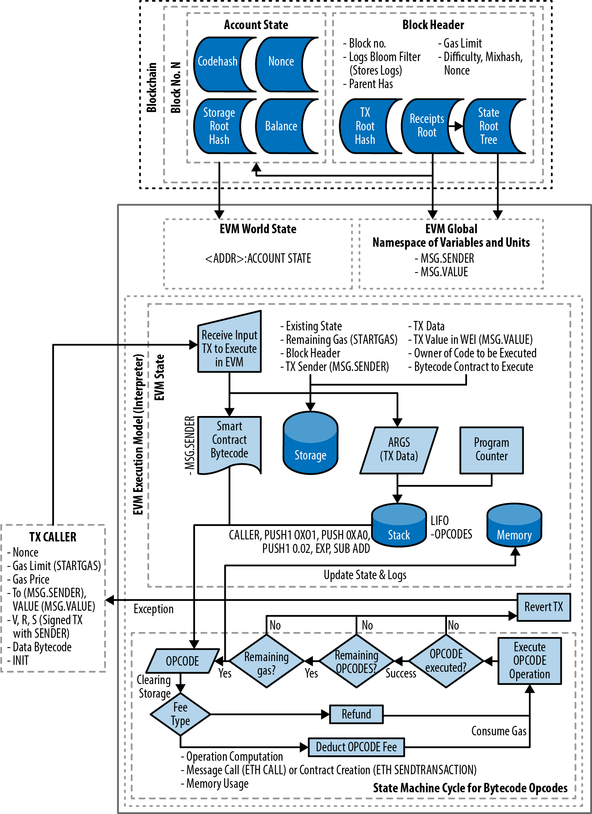

Figure 14-1. EVM architecture and execution context

## Comparison with Existing Technology

The term *virtual machine* is often applied to the virtualization of a real computer, typically by a hypervisor such as VirtualBox or QEMU, or of an entire operating system instance, such as Linux's KVM. These must provide a software abstraction, respectively, of actual hardware and of system calls and other kernel functionality.

The EVM operates in a much more limited domain: it is just a computation engine and as such, provides an abstraction of just computation and storage, similar to the Java virtual machine (JVM) specification, for example. From a high-level viewpoint, the JVM is designed to provide a runtime environment that is agnostic of the underlying host OS or hardware, enabling compatibility across a wide variety of systems. High-level programming languages such as Java or Scala (which use the JVM) or C# (which uses .NET) are compiled into the bytecode instruction set of their respective virtual machines. In the same way, the EVM executes its own bytecode instruction set (described in the next section), which higher-level smart contract programming languages such as Solidity, Vyper, and Yul are compiled into.

The EVM, therefore, has no scheduling capability because execution ordering is organized externally to it: Ethereum clients run through verified block transactions to determine which smart contracts need executing and in which order. In this sense, the Ethereum world computer is single threaded, like JavaScript. Neither does the EVM have any "system interface" handling or "hardware support"—there is no physical machine to interface with. The Ethereum world computer is completely virtual.

## What Are Other Blockchains Doing?

The EVM is definitely the most widely used virtual machine in the cryptocurrency space. Most alternative L1 and L2 blockchains use the EVM to maintain compatibility with all the existing tools and frameworks and to attract projects and developers directly from the Ethereum community.

Nevertheless, a bunch of different virtual machines have emerged in recent years: Solana VM, Wasm VM, Cairo VM, and Move VM are probably the most famous and interesting ones, each with its own advantages and disadvantages. They take different approaches to smart contract development:

**Custom languages**

Some platforms, like Cairo and Move, have created specialized programming languages specifically for writing smart contracts. This is similar to how Ethereum uses Solidity and Vyper for its virtual machine, the EVM.

**Standard languages**

Others, such as Solana and those using WebAssembly (Wasm), allow developers to write smart contracts with widely used programming languages. For example, these platforms often support Rust for smart contract development.

Another area where these alternative virtual machines differ from the EVM is the *parallelization* of transactions. We've already said that the EVM processes transactions sequentially, without any kind of parallelization. Some projects took this downside and tried to improve it. For example, both Solana VM and Move VM can handle parallel execution of transactions, even though it's not always possible—that is, when two transactions modify the same piece of storage by interacting with the same contracts, they cannot be executed in parallel.

We must say that these efforts to improve the virtual machine's performance are not being made only outside of Ethereum. In fact, lots of teams are working on breaking the current limits of the EVM by trying to add parallelization and other cool features such as *ahead-of-time* (AOT) or *just-in-time* (JIT) compilation from EVM bytecode to native machine code.

## The EVM Instruction Set (Bytecode Operations)

The EVM instruction set offers most of the operations you might expect, including:

- Arithmetic and bitwise logic operations
- Execution context inquiries
- Stack, memory, and storage access
- Control flow operations
- Logging, calling, and other operators

In addition to the typical bytecode operations, the EVM has access to account information (e.g., address and balance) and block information (e.g., block number and current gas price).

Let's start our exploration of the EVM in more detail by looking at the available *opcodes* and what they do. As you might expect, all operands are taken from the stack, and the result (where applicable) is often put back on the top of the stack.

The available opcodes can be divided into the following categories:

### Arithmetic operations

The arithmetic opcode instructions include:

```
ADD        //Add the top two stack items
MUL        //Multiply the top two stack items
SUB        //Subtract the top two stack items
DIV        //Integer division
SDIV       //Signed integer division
MOD        //Modulo (remainder) operation
SMOD       //Signed modulo operation
ADDMOD     //Addition modulo any number
MULMOD     //Multiplication modulo any number
EXP        //Exponential operation
SIGNEXTEND //Extend the length of a two's complement signed integer
SHA3       //Compute the Keccak-256 hash of a block of memory
```

Note that all arithmetic is performed modulo 2^256 (unless otherwise noted) and that the zeroth power of zero, 0^0, is taken to be 1.

### Stack operations

Stack, memory, and storage management instructions include:

```
POP     //Remove the top item from the stack
MLOAD   //Load a word from memory
MSTORE  //Save a word to memory
MSTORE8 //Save a byte to memory
SLOAD   //Load a word from storage
SSTORE  //Save a word to storage
TLOAD   //Load a word from transient storage
TSTORE  //Save a word to transient storage
MSIZE   //Get the size of the active memory in bytes
PUSH0   //Place value 0 on the stack
PUSHx   //Place x byte item on the stack, where x can be any integer from
        // 1 to 32 (full word) inclusive
DUPx    //Duplicate the x-th stack item, where x can be any integer from
        // 1 to 16 inclusive
SWAPx   //Exchange 1st and (x+1)-th stack items, where x can be any
        // integer from 1 to 16 inclusive
```

### Process-flow operations

Instructions for control flow include:

```
STOP      //Halt execution
JUMP      //Set the program counter to any value
JUMPI     //Conditionally alter the program counter
PC        //Get the value of the program counter (prior to the increment
          //corresponding to this instruction)
JUMPDEST  //Mark a valid destination for jumps
```

### System operations

Opcodes for the system executing the program include:

```
LOGx          //Append a log record with x topics, where x is any integer
              //from 0 to 4 inclusive
CREATE        //Create a new account with associated code
CALL          //Message-call into another account, i.e., run another
              //account's code
CALLCODE      //Message-call into this account with another
              //account's code
RETURN        //Halt execution and return output data
DELEGATECALL  //Message-call into this account with an alternative
              //account's code, but persisting the current values for
              //sender and value
STATICCALL    //Static message-call into an account, i.e., it cannot change
              //the state of any account
REVERT        //Halt execution, reverting state changes but returning
              //data and remaining gas
INVALID       //The designated invalid instruction
SELFDESTRUCT  //Halt execution and, if executed in the same transaction a
              //contract was created, register account for deletion. Note
              //that its usage is highly discouraged and the opcode is
              //considered deprecated
```

### Logic operations

Opcodes for comparisons and bitwise logic include:

```
LT     //Less-than comparison
GT     //Greater-than comparison
SLT    //Signed less-than comparison
SGT    //Signed greater-than comparison
EQ     //Equality comparison
ISZERO //Simple NOT operator
AND    //Bitwise AND operation
OR     //Bitwise OR operation
XOR    //Bitwise XOR operation
NOT    //Bitwise NOT operation
BYTE   //Retrieve a single byte from a full-width 256-bit word
```

### Environmental operations

Opcodes dealing with execution environment information include:

```
GAS            //Get the amount of available gas (after the reduction for
               //this instruction)
ADDRESS        //Get the address of the currently executing account
BALANCE        //Get the account balance of any given account
ORIGIN         //Get the address of the EOA that initiated this EVM
               //execution
CALLER         //Get the address of the caller immediately responsible
               //for this execution
CALLVALUE      //Get the ether amount deposited by the caller responsible
               //for this execution
CALLDATALOAD   //Get the input data sent by the caller responsible for
               //this execution
CALLDATASIZE   //Get the size of the input data
CALLDATACOPY   //Copy the input data to memory
CODESIZE       //Get the size of code running in the current environment
CODECOPY       //Copy the code running in the current environment to
               //memory
GASPRICE       //Get the gas price specified by the originating
               //transaction
EXTCODESIZE    //Get the size of an account's code
EXTCODECOPY    //Copy an account's code to memory
RETURNDATASIZE //Get the size of the output data from the previous call
               //in the current environment
RETURNDATACOPY //Copy data output from the previous call to memory
```

### Block operations

Opcodes for accessing information on the current block include:

```
BLOCKHASH  //Get the hash of one of the 256 most recently completed
           //blocks
COINBASE   //Get the block's beneficiary address for the block reward
TIMESTAMP  //Get the block's timestamp
NUMBER     //Get the block's number
PREVRANDAO //Get the previous block's RANDAO mix. This opcode replaces the
           //DIFFICULTY one since The Merge hard fork.
GASLIMIT   //Get the block's gas limit
```

## Ethereum State

The job of the EVM is to update the Ethereum state by computing valid state transitions as a result of smart contract code execution, as defined by the Ethereum protocol. This aspect leads to the description of Ethereum as a *transaction-based state machine*, which reflects the fact that external actors (i.e., account holders and validators) initiate state transitions by creating, accepting, and ordering transactions. It is useful at this point to consider what constitutes the Ethereum state.

At the top level, we have the Ethereum *world state*. The world state is a mapping of Ethereum addresses (160-bit values) to accounts. At the lower level, each Ethereum address represents an account comprising an ether balance (stored as the number of wei owned by the account), a nonce (representing the number of transactions successfully sent from this account if it is an EOA or the number of contracts created by it if it is a contract account), the account's storage (which is a permanent data store used only by smart contracts), and the account's program code (again, only if the account is a smart contract account). Traditionally, an EOA would always have no code and an empty storage. However, [EIP-7702](https://eips.ethereum.org/EIPS/eip-7702) (activated in the Pectra upgrade in May 2025) changes this assumption by allowing EOAs to delegate code execution to smart contracts. When an EOA opts into delegation, its code field is set to a 23-byte *delegation designation* with the format `0xef0100 || address`, where `address` is the 20-byte address of the target contract. The `0xef` byte is a banned opcode per [EIP-3541](https://eips.ethereum.org/EIPS/eip-3541), ensuring this designation cannot be confused with deployable contract code. When the EVM encounters a call to a delegated EOA, it loads and executes the code from the target address in the context of the EOA. This means `EXTCODESIZE` on a delegated EOA returns 23 (the size of the delegation designation), while `CODESIZE` executed within the delegated code returns the size of the target contract's code. The EOA can also use storage when executing delegated code, though the protocol recommends using [ERC-7201](https://eips.ethereum.org/EIPS/eip-7201) namespaced storage layouts to prevent collisions when migrating between delegate contracts. Importantly, delegated EOAs can still originate transactions—they remain EOAs that can sign and send transactions, but now with smart contract capabilities. The delegation can be cleared by delegating to the zero address (`0x0000000000000000000000000000000000000000`).

When a transaction results in smart contract code execution, an EVM is instantiated with all the information required in relation to the current block being created and the specific transaction being processed. In particular, the EVM's program code ROM is loaded with the code of the contract account being called, the program counter is set to zero, the storage is loaded from the contract account's storage, the memory is set to all zeros, and all the block and environment variables are set. A key variable is the gas supply for this execution, which is set to the amount of gas paid for by the sender at the start of the transaction (see "Gas Accounting During Execution" for more details). As code execution progresses, the gas supply is reduced according to the gas cost of the executed operations. If at any point the gas supply is less than zero, we get an *out-of-gas* (OOG) exception: execution immediately halts, and the transaction is abandoned. No changes to the Ethereum state are applied, except for the sender's nonce being incremented and their ether balance going down to pay the block's beneficiary for the resources used to execute the code to the halting point. At this point, you can think of the EVM as running on a sandboxed copy of the Ethereum world state, with this sandboxed version being discarded completely if execution cannot complete for whatever reason. However, if execution does complete successfully, then the real-world state is updated to match the sandboxed version, including any changes to the called contract's storage data, any new contracts created, and any ether balance transfers that were initiated.

Code execution is a recursive process. A contract can call other contracts, with each call resulting in another EVM being instantiated around the new target of the call. Each instantiation has its sandbox world state initialized from the sandbox of the EVM at the level above. Each instantiation (context) is also given a specified amount of gas for its gas supply (not exceeding the amount of gas remaining in the level above, of course) and so may itself halt with an exception due to being given too little gas to complete its execution. Again, in such cases, the sandbox state is discarded, and execution returns to the EVM at the level above.

## Ethereum Stateless

Even though at the time of writing (June 2025), all Ethereum nodes have to compute and maintain the last state—that is, what we previously called the world state—in order to be able to check the correctness of every new block by reexecuting all the transactions it contains, there are plans to get rid of that, at least partially.

The idea is to have a restricted set of actors, such as searchers and builders, that still need to get access to the state to create and publish new blocks, while all other nodes can cryptographically verify those blocks without it. This is called *statelessness*.

Statelessness is still far in the future of the Ethereum roadmap because it needs some modifications to the core protocol:

**Enshrined proposer-builder separation (ePBS)**

Separating the work of creating a block by filling it with transactions from the work of proposing it to the P2P network. The first is done by heavily specialized entities called searchers and builders that are able to create super-optimized blocks, while the second is done by Ethereum validator nodes. This is already a reality on mainnet, even though it's still not enshrined in the protocol. In fact, the majority of Ethereum blocks are already being built by a very small set of big builders.

**Verkle trees**

A replacement of the data structure that Ethereum currently uses to store the state: the Merkle-Patricia trie. This reduces by a lot the size of the cryptographical proof needed to verify the correctness of the state and makes verifying it faster than the legacy Merkle-Patricia trie.

> **Note**  
>
> Other hash-based binary trees are being tested to possibly replace Verkle trees. The core idea is just to have a data structure for the state that makes it possible to create small proofs that are quick and easy to verify.

The combination of these two upgrades can lead to a scenario where only the big entities with more powerful hardware that want to create blocks need to store and access the full state. Together with new blocks, they will create a *cryptographic witness*: the minimal set of data that proves the new state has been computed correctly based on the transactions they included into the blocks.

All other nodes (including validator nodes) store only the *state root*, which is the hash of the entire state. When they receive a new block, they use the related witness to verify its correctness.

This makes running an Ethereum node very lightweight since you don't have to store the full state and you don't even need to reexecute all the transactions (inside the EVM), but you are still able to verify that everything is correct so that you don't need to trust third parties. You could even run a node on your smartphone…

Even though research advances quickly, we are probably still a few years away from having statelessness on mainnet.

## Merkle-Patricia Trie

Right now, the Ethereum state is stored using a very peculiar data structure called a *modified Merkle-Patricia trie*. We briefly mentioned the Merkle-Patricia tree (we'll call it MPT) in the previous section, but it's very important to understand how it works and why as well as how it's used by Ethereum as the way to store the state (and not only that…) because the same reasoning applies to Verkle tries. Before diving into MPTs, you need to know about Merkle trees because they represent the foundation on which MPTs are built.

### Merkle trees

Merkle trees are a very old data structure, invented by Ralph Merkle in 1988 in an attempt to construct better digital signatures. They are very efficient when you need to be able to verify that some data exists in a database and it has not been tampered with without needing to send the entire database to prove it.

It's quite easy to create a Merkle tree starting from a collection of data. You need to separate the data into several chunks; then, you hash those chunks together and repeat this last step in a recursive way until you get only one final chunk. That chunk represents the *Merkle root*: a sort of digital fingerprint of all the data used to create the tree.

Let's create a binary Merkle tree—the simplest form of a Merkle tree—from scratch so that you can familiarize yourself with it a bit more. We start with eight chunks of data—you could think of them as different words in the English language. We hash each chunk using a specific hash function—Ethereum uses the Keccak-256 hash function, as already mentioned in Chapter 4—obtaining the leaves of the Merkle tree, represented in Figure 14-2 as hash_1, hash_2, and so on. Then, we concatenate each couple of leaves and hash them again, creating hash_12, hash_34, and so on. We repeat this process of concatenating and hashing another two times until we get to a single, final result, which represents our Merkle root: hash_12345678.

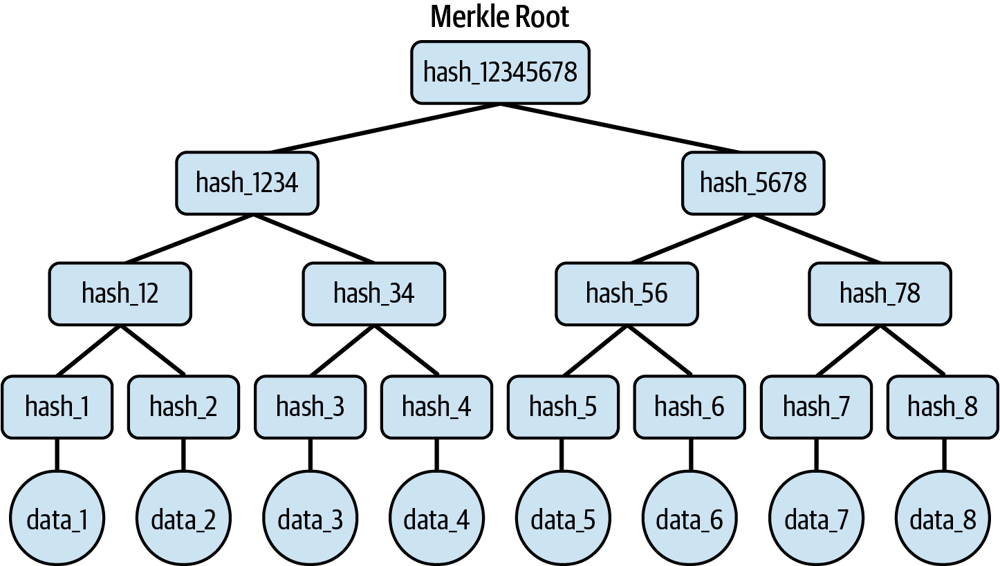

Figure 14-2. A binary merkle tree

Now, you may be asking why we need a Merkle tree to store the data. Isn't it more complicated than just storing each chunk in a classical database?

The answer is yes, it's much more complex than storing every chunk in a key-value or SQL database. The only reason we use these kinds of data structures is because they are really efficient at providing a cheap cryptographic proof that any one of the chunks is present in the entire collection of data and has not been manipulated. In fact, if we were using a normal database to store data, and we were asked to provide a proof that we have a specific chunk, we would need to publish our entire dataset so that the reader could be sure we're not lying.

Let's use our previous example to see this in practice. Let's say we want to prove that data_1 is included in the dataset. The naive approach is to provide the entire dataset, starting from data_1 up to data_8: eight items in total. With a Merkle tree, we need to provide only hash_2, hash_34, and hash_5678. Then, anyone can compute on their own the Merkle root and compare it with the one we calculated initially (which is shared publicly). If they match, you can be completely sure that data_1 is part of the initial dataset, as you can see in Figure 14-3.

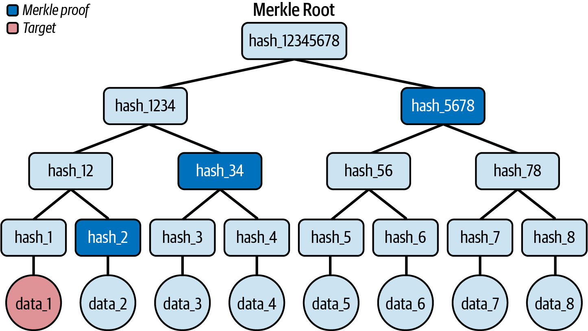

Figure 14-3. The Merkle proof to verify that data_1 is contained in the tree

> **Tip**  
>
> To reconstruct the Merkle tree, you can follow these steps:
>
> 1. Hash data_1 and get hash_1.
> 2. Concatenate hash_1 with the provided hash_2, hash it, and get hash_12.
> 3. Concatenate hash_12 with the provided hash_34, hash it, and get hash_1234.
> 4. Concatenate hash_1234 with the provided hash_5678, hash it, and get the final Merkle root.

Note that we're using only three items, versus the eight items we would need to use with the naive approach without the Merkle tree. And this is just a toy example—when you have lots of data, the savings are much bigger.

Speaking in mathematical terms, Merkle trees offer O(log(n)) complexity versus linear O(n) of the naive approach, as shown in Figure 14-4.

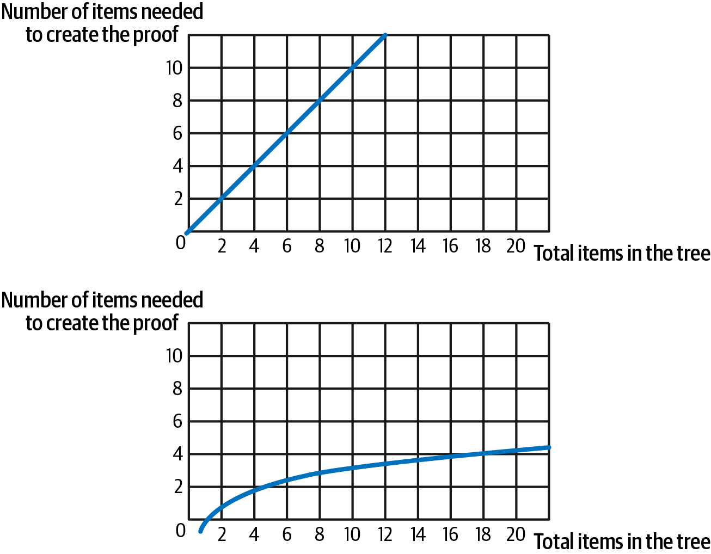

Figure 14-4. O(n) linear complexity (on the top) versus O(log(n)) complexity (on the bottom)

In the Ethereum world, this means that it's cheaper and easier to provide proofs regarding the balance of an address, the result of a transaction, or the bytecode of a specific smart contract.

### Merkle trees in Bitcoin

Bitcoin pioneered the use of Merkle trees in blockchain technology. In fact, every Bitcoin block contains the Merkle root of all transactions included in the same block so that none of them can be modified without modifying the entire block header (compromising the PoW, too).

### Merkle-Patricia trie in Ethereum

Ethereum took the same concept and applied it to itself, with some modifications for its specific needs. Merkle trees are perfectly suited for permanent data that never changes, such as Bitcoin transactions. The Ethereum state changes constantly, though, so we need to tweak Merkle trees to still maintain their useful properties while letting us change the data underneath frequently.

This is where the Merkle-Patricia trie enters the scene. The name comes from the union between Merkle trees, Patricia (Practical Algorithm to Retrieve Information Coded in Alphanumeric), and the word *trie* that originates from *retrieval*, reminding us what they are optimized for.

Essentially, Merkle-Patricia tries are modified Merkle trees with 16 children for each node. They are well suited for data like the Ethereum state where you have lots of key-value items (where keys are the addresses and values the account information for each address, such as the balance, the nonce, and the code, if any) because the key itself is encoded in the path you have to follow to reach the correct position in the tree.

Let's say we have the following key-value item we want to store:

```
car → Schumacher
```

Car is hex encoded as (0x) 6 3 6 1 7 2, so you would need to take the sixth child starting from the Merkle root, then again down to the third child, repeating this process until you get to the final value where you can read the value associated with that key—Schumacher in this example—as shown in Figure 14-5.

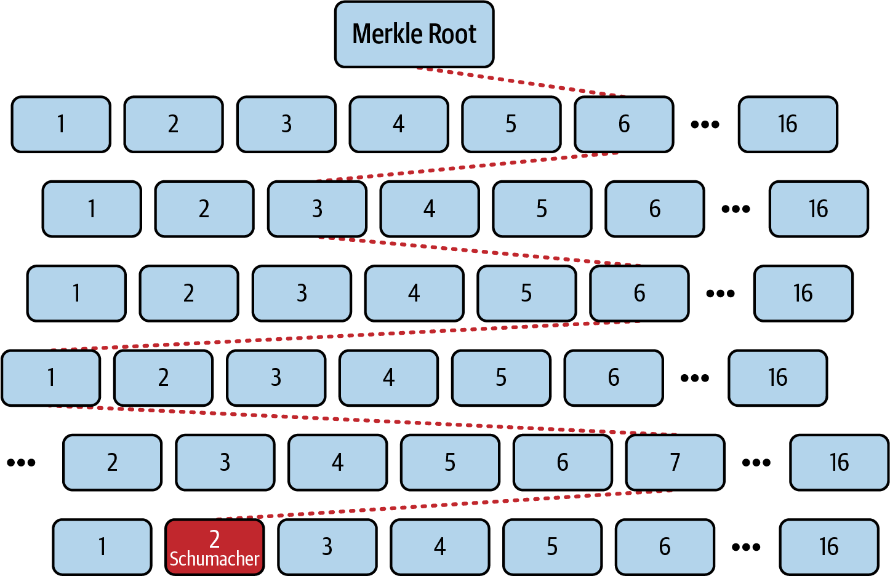

Figure 14-5. Encoding of the key-value item car --> Schumacher into a Merkle-Patricia trie

In particular, Ethereum uses four Merkle-Patricia tries:

**State trie**

To store the entire state

**Transaction trie**

To store all transactions included into a block

**Receipt trie**

To store the results of all the transactions included into a block

**Storage trie**

To store smart contract data

Every Ethereum block header contains the state, transaction, and receipt trie Merkle root, while every account (contained in the state trie) stores its own storage trie Merkle root.

## A Deep Dive into the Components of the EVM

In this section, we'll take a closer look at how each component of the EVM works. Finally, we'll examine a real-world example to see everything in action.

### Stack

The stack is a very simple data structure that follows a *last in, first out* (LIFO) order to perform operations, where every item is a 32-byte object. It can host up to 1,024 items at the same time.

The EVM can push and pop items into and from the stack through different kinds of opcodes, and it can manipulate the order of its elements, as you can see in Figure 14-6.

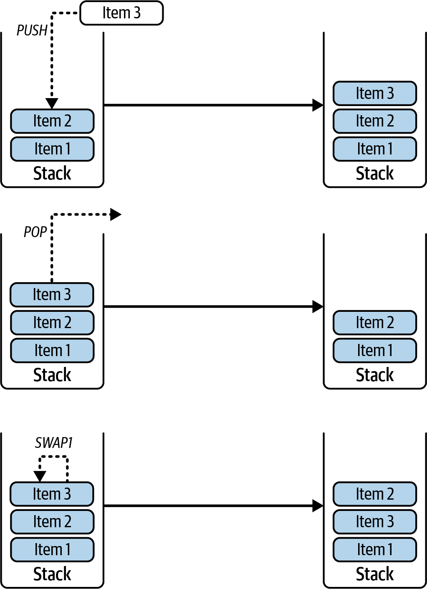

Figure 14-6. The EVM stack follows a LIFO order of operations

### Memory

The EVM memory is a byte-addressable data structure: essentially a very long array of bytes. In fact, every byte in the memory is accessible using a 32-byte (256-bit) key, which means it can contain up to 2^256 bytes. It's volatile—that is, it's deleted after the execution ends—and it's always initialized to 0.

Even though it's possible to read and write single bytes to and from the memory, most operations require reading or writing bigger chunks of data, usually 32-byte chunks, as shown in Figure 14-7.

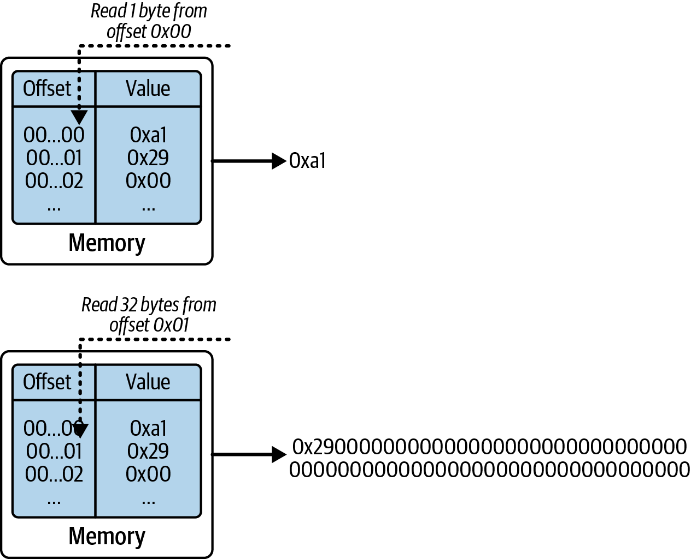

Figure 14-7. EVM memory is a volatile, byte-addressable data structure

> **Note**  
>
> Technically, you cannot read a single byte from the EVM. You can only read an entire 32-byte word. To achieve the same result as reading a single byte, the EVM needs to load the entire word that contains that byte and then "cut" it in order to return only the selected byte.

### Storage

The EVM storage is a key-value data structure where keys (most often called *slots*) and values are each 32 bytes long. This is the persistent memory of every smart contract: all values saved on it are kept indefinitely across different transactions and blocks. Each smart contract can only access and modify its own storage, and if you try to access a slot that doesn't contain any values, it will always return the value 0 without throwing any errors. Figure 14-8 shows a very basic representation of two contracts' storage.

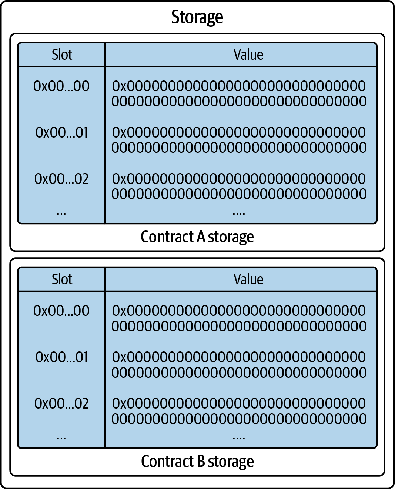

Figure 14-8. The EVM storage is a permanent memory with a key-value data structure

There is also the *transient storage*, added with [EIP-1153](https://oreil.ly/fRvKl), which behaves in the same way as the normal storage, with the only difference being that it's completely discarded after the execution of the transaction. For this reason, it's much cheaper to use than normal storage.

### Calldata

Calldata is an immutable data structure that always contains the bytes sent as input to the next *call frame* (i.e., a sandbox EVM environment). For example, in a contract-creation transaction, the calldata contains the bytecode of the contract that is going to be deployed. It can also be empty, such as in simple ETH transfers.

## Let's Put Everything Together with a Concrete Example

You are executing a transaction that works on contract A, and you have the following EVM bytecode: `60425F525F3560AB145F515500`.

You also have an initial calldata:

```
00000000000000000000000000000000000000000000000000000000000000ab
```

Let's represent the EVM bytecode in a human-readable format:

```
[00]            PUSH1            42
[02]            PUSH0
[03]            MSTORE
[04]            PUSH0
[05]            CALLDATALOAD
[06]            PUSH1            AB
[08]            EQ
[09]            PUSH0
[0a]            MLOAD
[0b]            SSTORE
[0c]            STOP
```

> **Note**  
>
> Each EVM opcode is identified by a unique 1-byte value (ranging from 0x00 to 0xFF). For example, 0x60 is the PUSH1 opcode, 0x5F the PUSH0, and so on. For a comprehensive list of all opcodes and their hexadecimal representations, refer to [EVM codes](https://www.evm.codes).

Let's see how the EVM executes these opcodes and how the stack, the memory, and the storage are manipulated. Figure 14-9 shows the initial state of the EVM.

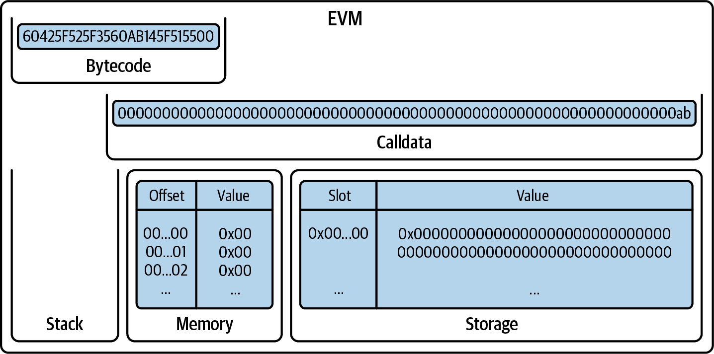

Figure 14-9. Initial EVM state

The first opcode pushes 0x42 onto the stack (Figure 14-10). Note that all push opcodes take their data (to be pushed) from the next available bytes in the bytecode itself.

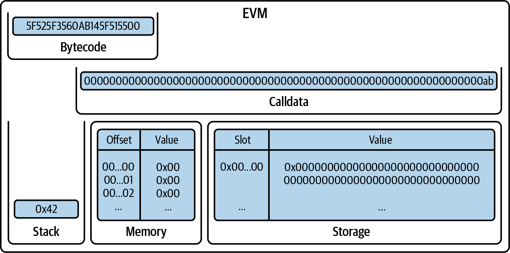

Figure 14-10. EVM after PUSH1 0x42

Next, PUSH0 pushes 0x00 onto the stack (Figure 14-11).

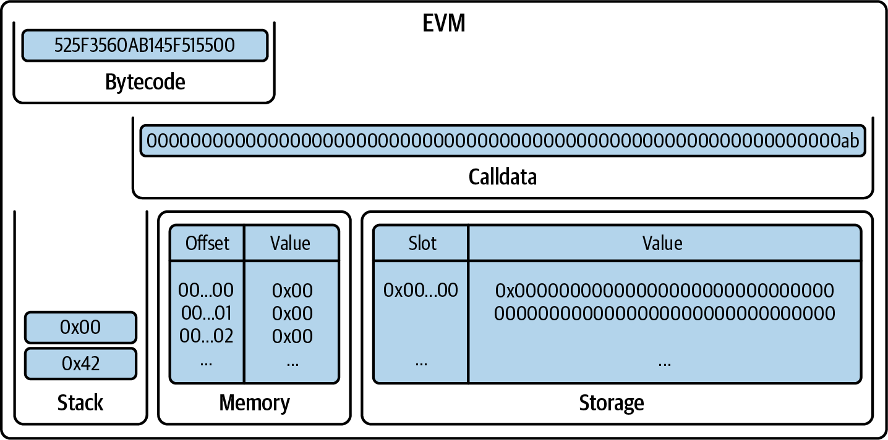

Figure 14-11. EVM after PUSH0

MSTORE pops two items from the stack, interpreting the first one as the offset (in bytes) and the second one as the value to write in the memory, starting at that offset. Note that there are lots of leading zeros in the memory (31 bytes, equal to zero) before the byte 0x42. This is correct because every value in the stack is a 32-byte value. Most of the time, we can ignore leading zeros while writing (in Figure 14-12, you can see the item 0x42), but you should always remember that they are 32-byte values.

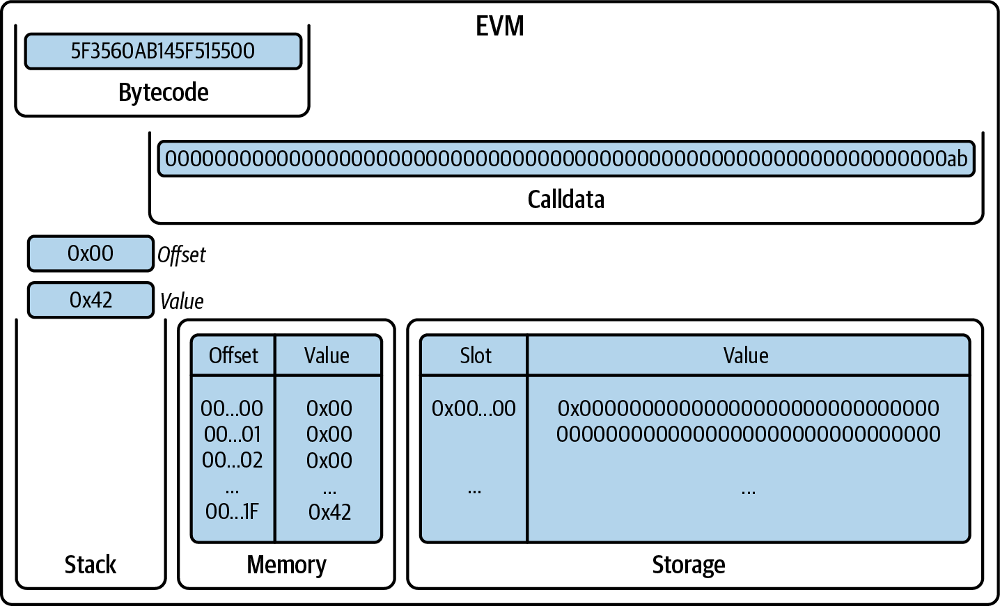

Figure 14-12. EVM after MSTORE

Then, we again have a PUSH0 that pushes 0x00 onto the stack (Figure 14-13).

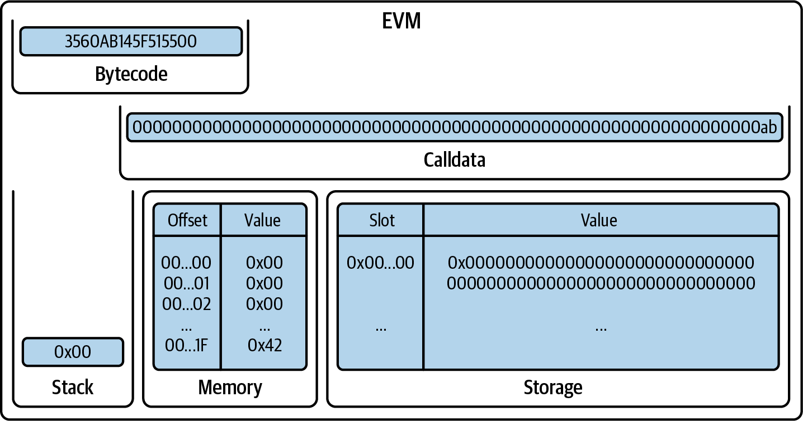

Figure 14-13. EVM after PUSH0

CALLDATALOAD takes one element from the stack, interpreted as an offset, and returns the 32-byte value in the calldata starting at that offset, then pushes it onto the stack. Here, it's returning 0xab (note that we can ignore all the leading zeros as they are not significant), as shown in Figure 14-14.

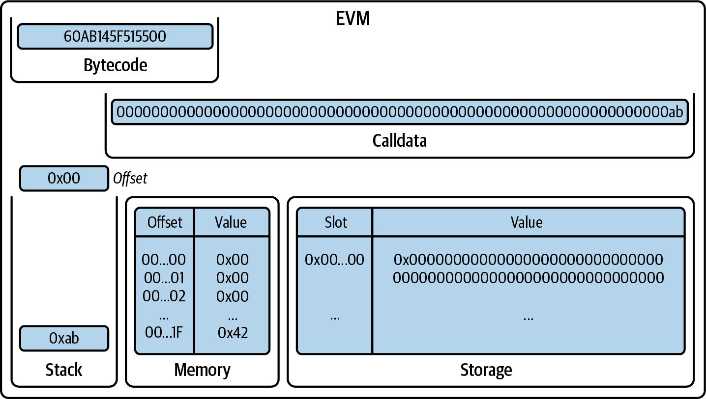

Figure 14-14. EVM after CALLDATALOAD

PUSH1 pushes 0xab onto the stack (Figure 14-15).


Figure 14-15. EVM after PUSH1 0xab

EQ pops two items from the stack, compares them, and returns 1 if they are equal, 0 otherwise. In this example, it returns 0x01 since the two values are equal, as shown in Figure 14-16.

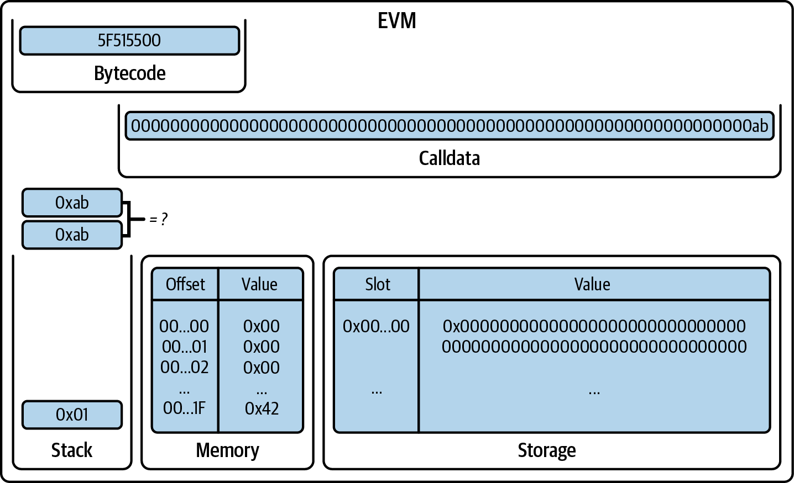

Figure 14-16. EVM after EQ

Again, a PUSH0 pushes 0x00 onto the stack (Figure 14-17).

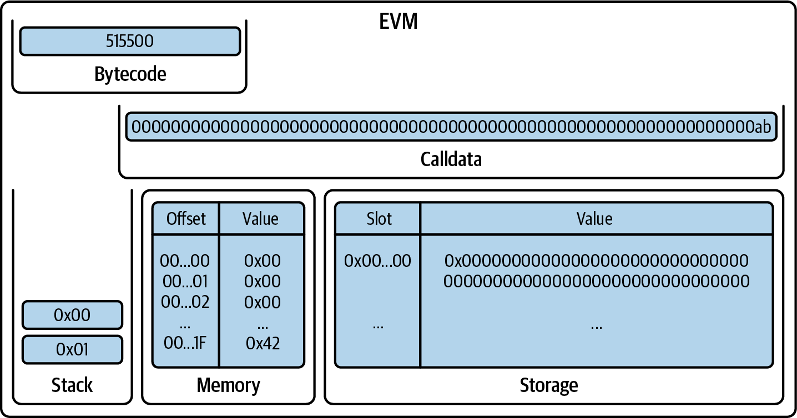

Figure 14-17. EVM after PUSH0

MLOAD takes one element from the stack, interpreting it as the offset, and reads 32 bytes in the memory, starting at that offset, then pushes the result onto the stack (Figure 14-18).

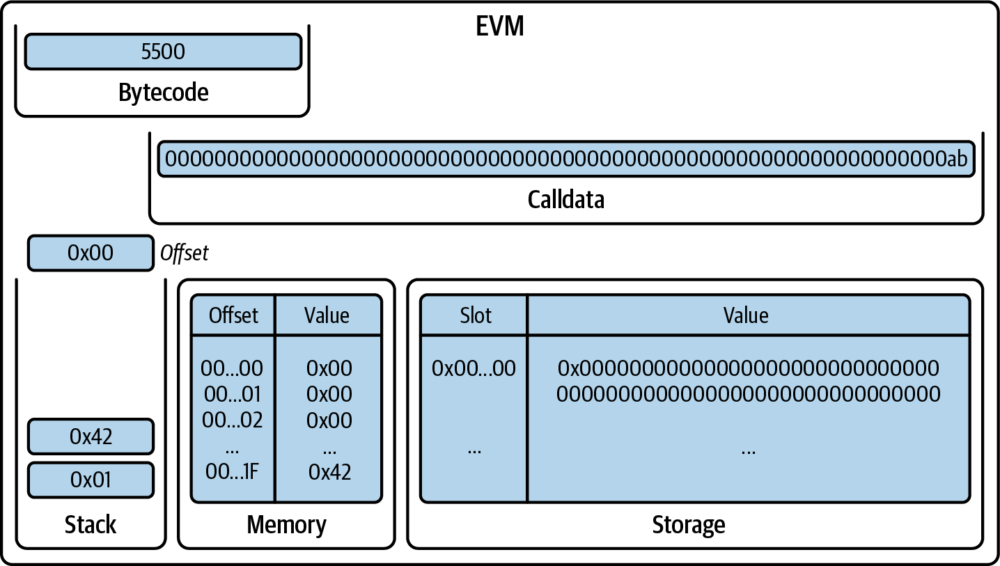

Figure 14-18. EVM after MLOAD

Now, the SSTORE pops two items from the stack, interpreting the first one as the slot and the second one as the value to be saved in the contract's storage at that slot number, as shown in Figure 14-19.

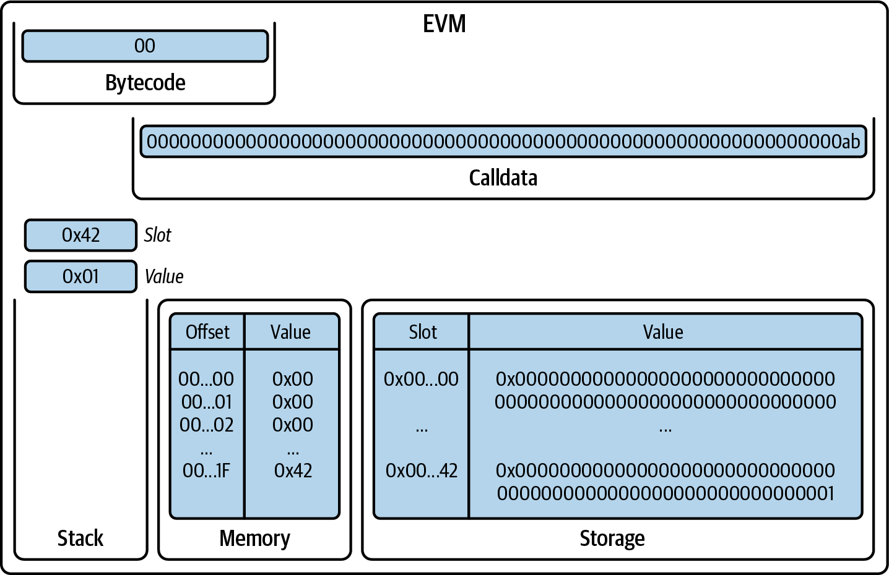

Figure 14-19. EVM after SSTORE

Finally, we have the STOP opcode that halts the execution, and the EVM returns successfully, as you can see in Figure 14-20.

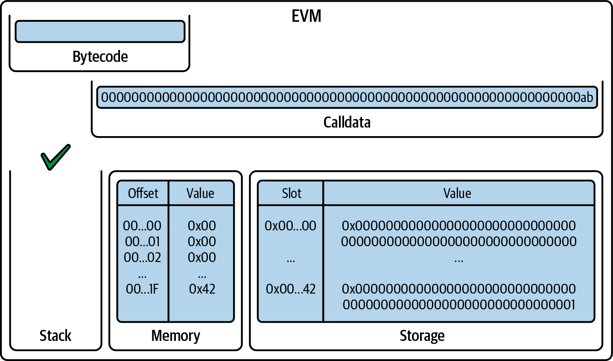

Figure 14-20. EVM after STOP

> **Tip**  
>
> In the previous example, we used the opcode PUSH0. It's important to say that not all EVM-compatible blockchains have integrated this opcode, so be aware of that when deploying a cross-chain contract. [EVM Diff](https://www.evmdiff.com) is a very cool website that shows all these subtle differences for EVM-compatible chains.

## Compiling Solidity to EVM Bytecode

We've already explored Solidity in Chapter 7. Now, we're going to see how it's compiled down into EVM bytecode that can be interpreted by the EVM.

Compiling a Solidity source file to EVM bytecode can be accomplished via several methods. In Chapter 2, we used the online Remix compiler. In this chapter, we will use the `solc` executable at the command line. To install Solidity on your computer, [follow the steps](https://oreil.ly/JW--z).

For a list of options, run the following command:

```bash
$ solc --help
```

Generating the raw opcode stream of a Solidity source file is easily achieved with the `--opcodes` command-line option. This opcode stream leaves out some information (the `--asm` option produces the full information), but it is sufficient for this discussion. For example, compiling an example Solidity file, `Example.sol`, and sending the opcode output into a directory named `BytecodeDir` is accomplished with the following command:

```bash
$ solc -o BytecodeDir --opcodes Example.sol
```

You can also use `--asm` to produce a more human-readable output:

```bash
$ solc -o BytecodeDir --asm Example.sol
```

The following command will produce the bytecode binary for our example program:

```bash
$ solc -o BytecodeDir --bin Example.sol
```

The output opcode files generated will depend on the specific contracts contained within the Solidity source file. Our simple Solidity file `Example.sol` has only one contract, named Example:

```solidity
// SPDX-License-Identifier: GPL-3.0
pragma solidity 0.8.27;

contract Example {
  address contractOwner;
  
  function test() public {
    contractOwner = msg.sender;
  }
}
```

As you can see, all this contract does is hold one persistent state variable, which is set as the address of the last account to run this contract.

If you look in the `BytecodeDir` directory, you will see the opcode file `Example.opcode`, which contains the EVM opcode instructions of the example contract. Opening the `Example.opcode` file in a text editor will show the following:

```
PUSH1 0x80 PUSH1 0x40 MSTORE CALLVALUE DUP1 ISZERO PUSH1 0xE JUMPI PUSH0 PUSH0 REVERT JUMPDEST POP PUSH1 0xA9 DUP1 PUSH1 0x1A PUSH0 CODECOPY PUSH0 RETURN INVALID PUSH1 0x80 PUSH1 0x40 MSTORE CALLVALUE DUP1 ISZERO PUSH1 0xE JUMPI PUSH0 PUSH0 REVERT JUMPDEST POP PUSH1 0x4 CALLDATASIZE LT PUSH1 0x26 JUMPI PUSH0 CALLDATALOAD PUSH1 0xE0 SHR DUP1 PUSH4 0xF8A8FD6D EQ PUSH1 0x2A JUMPI JUMPDEST PUSH0 PUSH0 REVERT JUMPDEST PUSH1 0x30 PUSH1 0x32 JUMP JUMPDEST STOP JUMPDEST CALLER PUSH0 PUSH0 PUSH2 0x100 EXP DUP2 SLOAD DUP2 PUSH20 0xFFFFFFFFFFFFFFFFFFFFFFFFFFFFFFFFFFFFFFFF MUL NOT AND SWAP1 DUP4 PUSH200xFFFFFFFFFFFFFFFFFFFFFFFFFFFFFFFFFFFFFFFF AND MUL OR SWAP1 SSTORE POP JUMP INVALID LOG2 PUSH5 0x6970667358 0x22 SLT KECCAK256 JUMPI 0xBB RETURNDATACOPY SWAP15 CALLVALUE 0xB3 0xB1 SMOD BLOBHASH STATICCALL MCOPY PUSH10 0x856E7132D8FEED4D83B6 0xB2 0xBE PUSH30 0x8B43532C818BFD64736F6C634300081B0033000000000000000000000000
```

Compiling the example with the `--asm` option produces a file named `Example.evm` in our `BytecodeDir` directory. This contains a slightly higher-level description of the EVM bytecode instructions, together with some helpful annotations:

```
/* "Example.sol":61:171  contract Example {... */
  mstore(0x40, 0x80)
  callvalue
  dup1
  iszero
  tag_1
  jumpi
  revert(0x00, 0x00)
tag_1:
  pop
  dataSize(sub_0)
  dup1
  dataOffset(sub_0)
  0x00
  codecopy
  0x00
  return
stop

sub_0: assembly {
        /* "Example.sol":61:171  contract Example {... */
      mstore(0x40, 0x80)
      callvalue
      dup1
      iszero
      tag_1
      jumpi
      revert(0x00, 0x00)
    tag_1:
      pop
      jumpi(tag_2, lt(calldatasize, 0x04))
      shr(0xe0, calldataload(0x00))
      dup1
      0xf8a8fd6d
      eq
      tag_3
      jumpi
    tag_2:
      revert(0x00, 0x00)
        /* "Example.sol":109:169  function test() public {... */
    tag_3:
      tag_4
      tag_5
      jump    // in
    tag_4:
      stop
    tag_5:
        /* "Example.sol":154:164  msg.sender */
      caller
        /* "Example.sol":138:151  contractOwner */
      0x00
      0x00
        /* "Example.sol":138:164  contractOwner = msg.sender */
      0x0100
      exp
      dup2
      sload
      dup2
      0xffffffffffffffffffffffffffffffffffffffff
      mul
      not
      and
      swap1
      dup4
      0xffffffffffffffffffffffffffffffffffffffff
      and
      mul
      or
      swap1
      sstore
      pop
        /* "Example.sol":109:169  function test() public {... */
      jump    // out
    auxdata: 0xa264697066735822122057bb3e9e34b3b10749fa5e69856e7132d8feed4d83b6b2be7d8b43532c818bfd64736f6c634300081b0033
}
```

The `--bin` option produces the machine-readable hexadecimal bytecode:

```
6080604052348015600e575f5ffd5b5060a980601a5f395ff3fe6080604052348015600e575f5ffd5b50600436106026575f3560e01c8063f8a8fd6d14602a575b5f5ffd5b60306032565b005b335f5f6101000a81548173ffffffffffffffffffffffffffffffffffffffff021916908373ffffffffffffffffffffffffffffffffffffffff16021790555056fea264697066735822122057bb3e9e34b3b10749fa5e69856e7132d8feed4d83b6b2be7d8b43532c818bfd64736f6c634300081b0033
```

You can investigate what's going on here in detail using the opcode list given in "The EVM Instruction Set (Bytecode Operations)". However, that's quite a task, so let's start by just examining the first four instructions:

```
PUSH1 0x80 PUSH1 0x40 MSTORE CALLVALUE
```

Here, we have `PUSH1` followed by a raw byte of value `0x80`. This EVM instruction takes the single byte following the opcode in the program code (as a literal value) and pushes it onto the stack. It is possible to push values of size up to 32 bytes onto the stack, as in:

```
PUSH32 0x436f6e67726174756c6174696f6e732120536f6f6e20746f206d617374657221
```

The second `PUSH1` opcode from `example.opcode` stores `0x40` onto the top of the stack (pushing the `0x80` already present there down one slot).

Next is `MSTORE`, which is a memory store operation that saves a value to the EVM's memory. It takes two arguments and, like most EVM operations, obtains them from the stack. For each argument, the stack is "popped"—that is, the top value on the stack is taken off, and all the other values on the stack are shifted up one position. The first argument for `MSTORE` is the address of the word in memory where the value to be saved will be put. For this program, we have `0x40` at the top of the stack, so that is removed from the stack and used as the memory address. The second argument is the value to be saved, which is `0x80` here. After the `MSTORE` operation is executed, our stack is empty again, but we have the value `0x80` (128 in decimal) at the memory location `0x40`.

The next opcode is `CALLVALUE`, which is an environmental opcode that pushes onto the top of the stack the amount of ether (measured in wei) sent with the message call that initiated this execution.

We could continue to step through this program in this way until we had a full understanding of the low-level state changes that this code effects, but it wouldn't help us at this stage. We'll come back to it later in the chapter.

## Contract Deployment Code

There is an important but subtle difference between the code used when creating and deploying a new contract on the Ethereum platform and the code of the contract itself. To create a new contract, a special transaction is needed that has an empty `to` field (null) and its `data` field set to the contract's *initiation code*. When such a contract-creation transaction is processed, the code for the new contract account is not the code in the `data` field of the transaction. Instead, an EVM is instantiated with the code in the `data` field of the transaction loaded into its program code ROM, and then the output of the execution of that deployment code is taken as the code for the new contract account. This is so that new contracts can be programmatically initialized using the Ethereum world state at the time of deployment, setting values in the contract's storage and even sending ether or creating further new contracts.

When compiling a contract offline—for example, using `solc` on the command line—you can get either the *deployment bytecode* or the *runtime bytecode*. The deployment bytecode is used for every aspect of the initialization of a new contract account, including the bytecode that will actually end up being executed when transactions call this new contract (i.e., the runtime bytecode) and the code to initialize everything based on the contract's constructor. The runtime bytecode, on the other hand, is exactly the bytecode that ends up being executed when the new contract is called and nothing more; it does not include the bytecode needed to initialize the contract during deployment.

Let's take the simple `Faucet.sol` contract we created in previous chapters as an example:

```solidity
// SPDX-License-Identifier: GPL-3.0
pragma solidity 0.8.27;

contract Faucet {
  // Give out ether to anyone who asks
  function withdraw(uint256 _withdrawAmount, address payable _to) public {
    // Limit withdrawal amount
    require(_withdrawAmount <= 1000000000000);
    // Send the amount to the address that requested it
    _to.transfer(_withdrawAmount);
  }
  
  // Function to receive Ether. msg.data must be empty
  receive() external payable {}
  
  // Fallback function is called when msg.data is not empty
  fallback() external payable {}
}
```

To get the deployment bytecode, we would run `solc --bin Faucet.sol`. If we instead wanted just the runtime bytecode, we would run `solc --bin-runtime Faucet.sol`. If you compare the output of these commands, you will see that the runtime bytecode is a subset of the deployment bytecode. In other words, the runtime bytecode is entirely contained within the deployment bytecode.

### CREATE Versus CREATE2 to Deploy Contracts on Chain

`CREATE` and `CREATE2` are the only two opcodes that let you deploy a new contract on chain. The main difference between them is related to the resulting address of the newly created contract. With `CREATE` the destination address is calculated as follows:

```
address = keccak256[rlp(sender_address ++ sender_nonce)][12:]
```

It's the rightmost 20 bytes of the Keccak-256 hash of the RLP encoding of the sender address followed by its nonce.

`CREATE2` was added during the Constantinople hard fork in 2019 to let developers create new contracts where the resulting address isn't dependent on the state (i.e., the nonce) of the sender. In fact, it behaves in the exact same way as the `CREATE` opcode, but the destination address is calculated like this:

```
address = keccak256(0xff ++ sender_address ++ salt ++ keccak256(init_code))[12:]
```

where:

- `init_code` is the deployment bytecode of the new contract.
- `salt` is a 32-byte value (taken from the stack)

## Disassembling the Bytecode

Disassembling EVM bytecode is a great way to understand how high-level Solidity acts in the EVM. There are a few disassemblers you can use to do this:

- [**Ethersplay**](https://oreil.ly/xW6fH) is an EVM plug-in for Binary Ninja, a disassembler. By the way, to use plug-ins, you need to buy the complete app of Binary Ninja.
- [**Heimdall**](https://oreil.ly/klTJ3) is an advanced EVM smart contract toolkit specializing in bytecode analysis and extracting information from unverified contracts.

In this section, we will be using Heimdall to produce Figure 14-21. After getting the runtime bytecode of `Faucet.sol`, we can feed it to Heimdall to see what the EVM instructions look like.

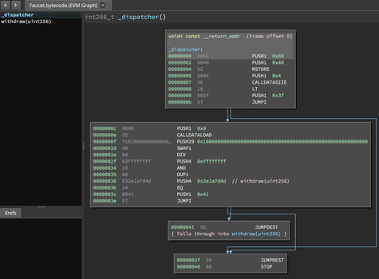

Figure 14-21. Disassembling the Faucet runtime bytecode

### Installing Heimdall

First, you need to ensure that Rust is installed on your computer. If it's not, run the following command:

```bash
$ curl https://sh.rustup.rs -sSf | sh
```

Then, run these two commands, one after the other:

```bash
$ curl -L http://get.heimdall.rs | bash
$ bifrost
```

Now, you should have Heimdall correctly installed. You can verify that by running:

```bash
$ heimdall --version
```

You should see something like this:

```bash
$ heimdall --version
heimdall 0.8.4
```

> **Note**  
>
> For the latest information on how to install Heimdall, please refer to the official documentation you can find on the [GitHub repository](https://oreil.ly/klTJ3).

### Disassembling the bytecode with Heimdall

Now that we have correctly installed Heimdall, we are ready to generate the same graph you saw in Figure 14-21. Starting with the runtime bytecode of our `Faucet.sol` contract, you can run the following command:

```bash
$ heimdall cfg <insert the runtime bytecode here>
```

Here is an example of what this command should look like:

```bash
$ heimdall cfg 608060405260043610610…
```

Now, you should see a new folder called `output`. Enter it and again enter the generated folder called `local`. Here, you should find the file `cfg.dot`:

```bash
$ cd output
$ cd local
$ ls # now you should see the file
```

Since it's a `.dot` file, we need a special program to open it correctly. In this example, we're going to use a website that lets us paste the contents of the `.dot` file and then generates the graph for us.

First, you need to copy the contents of the `.dot` file:

```bash
$ cat cfg.dot
```

This command prints to screen the entire contents of the file; copy it, open a [*control flow graph* (CFG) online generator](https://oreil.ly/swOsK), and paste it on the left side of the web page, as shown in Figure 14-22.

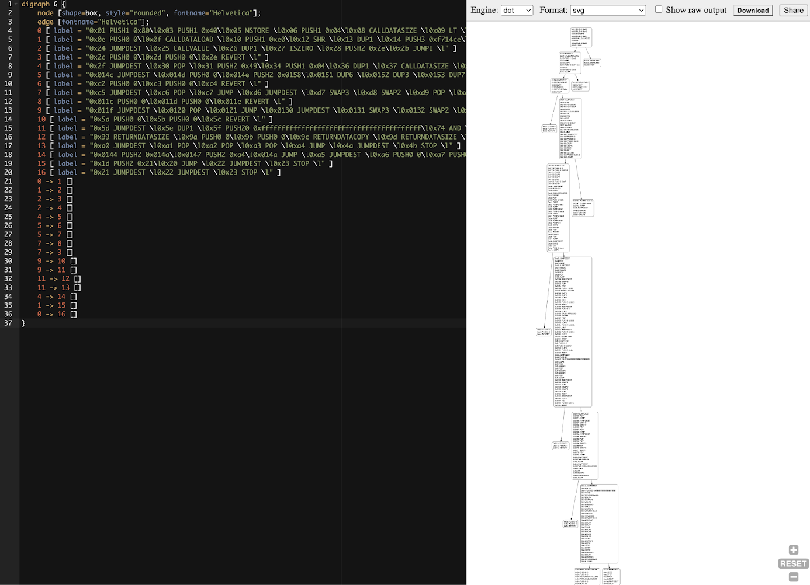

Figure 14-22. The control flow graph (CFG) of the Faucet.sol contract

Figure 14-23 shows the initial bytecode of the `Faucet.sol` contract. As you can see, it starts with the same pattern as the previous `Example.sol` contract: `PUSH1 0x80 PUSH1 0x40 MSTORE`.

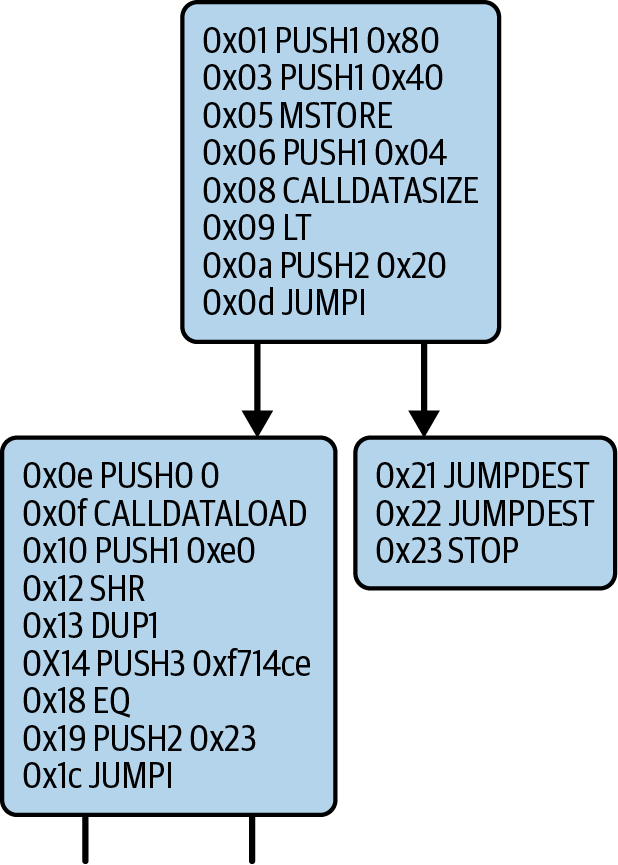

Figure 14-23. A zoom-in into the first part of the CFG graph

When you send a transaction to an ABI-compatible smart contract (which you can assume all contracts are), the transaction first interacts with that smart contract's *dispatcher*. The dispatcher reads in the `data` field of the transaction and sends the relevant part to the appropriate function. We can see an example of a dispatcher at the beginning of our disassembled `Faucet.sol` runtime bytecode. After the familiar `MSTORE` instruction, we see the following instructions:

```
PUSH1 0x04
CALLDATASIZE
LT
PUSH2 0x0020
JUMPI
```

As we have seen, `PUSH1 0x04` places `0x04` onto the top of the stack, which is otherwise empty. `CALLDATASIZE` gets the size in bytes of the data sent with the transaction (known as the calldata) and pushes that number onto the stack. After these operations have been executed, the stack looks like this:

```
Stack
<length of calldata from tx>
0x4
```

This next instruction is `LT`, short for "less than." The `LT` instruction checks whether the top item on the stack is less than the next item on the stack. In our case, it checks to see if the result of `CALLDATASIZE` is less than 4 bytes.

Why does the EVM check to see that the calldata of the transaction is at least 4 bytes? Because of how *function identifiers* work. Each Solidity function is identified by the first 4 bytes of its Keccak-256 hash. By placing the function's name and all the arguments it takes into a `keccak256` hash function, we can deduce its function identifier. In our case, we have:

```
keccak256("withdraw(uint256,address)") = 0x00f714ce...
```

Thus, the function identifier for the `withdraw(uint256,address)` function is `0x00f714ce`, since these are the first 4 bytes of the resulting hash. A function identifier is always 4 bytes long, so if the entire data field of the transaction sent to the contract is less than 4 bytes, then there's no function with which the transaction could possibly be communicating, unless a fallback function is defined. Because we implemented such a fallback function in `Faucet.sol`, the EVM jumps to this function when the calldata's length is less than 4 bytes.

`LT` pops the top two values off the stack and, if the transaction's data field is less than 4 bytes, pushes 1 onto it. Otherwise, it pushes 0. In our example, let's assume the data field of the transaction sent to our contract was less than 4 bytes.

The `PUSH2 0x0020` instruction pushes the bytes `0x0020` onto the stack. After this instruction, the stack looks like this:

```
Stack
0x0020
0x1
```

The next instruction is `JUMPI`, which stands for "jump if." It works like so:

```
jumpi(label, cond) // Jump to "label" if "cond" is true
```

In our case, `label` is `0x0020`, which is where our fallback function lives in our smart contract. The `cond` argument is 1, which was the result of the `LT` instruction earlier. To put this entire sequence into words, the contract jumps to the fallback function if the transaction data is less than 4 bytes.

At `0x20`, after two `JUMPDEST` instructions, only a `STOP` instruction follows because, although we declared a fallback function, we kept it empty. As you can see in Figure 14-24, had we not implemented a fallback function, the contract would throw an exception instead.

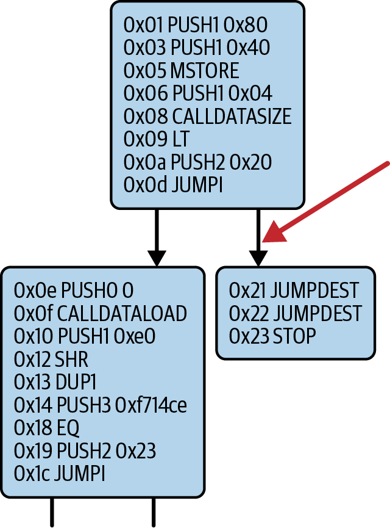

Figure 14-24. JUMPI instruction leading to fallback function

> **Note**  
>
> Heimdall represents the bytecode starting with offset equal to 0x01, even though the EVM actually interprets it as starting with offset 0x00. In the previous example, the JUMPI instruction tells the EVM to go to offset 0x20 if the condition is true, but in the graph, offset 0x20 is here represented as 0x21. As a rule of thumb, you just need to add one to every offset of the EVM to find it on the graph.

Let's examine the central block of the dispatcher. Assuming we received calldata that was greater than 4 bytes in length, the `JUMPI` instruction would not jump to the fallback function. Instead, code execution would proceed to the following instructions:

```
PUSH0 0x0
CALLDATALOAD
PUSH1 0xe0
SHR
DUP1
PUSH3 0xf714ce
EQ
PUSH2 0X23
JUMPI
```

`PUSH0` pushes 0 onto the stack, which is now otherwise empty again. `CALLDATALOAD` accepts as an argument an index within the calldata sent to the smart contract and reads 32 bytes from that index, like so:

```
calldataload(p) //load 32 bytes of calldata starting from byte position p
```

Since 0 was the index passed to it from the `PUSH0` command, `CALLDATALOAD` reads 32 bytes of calldata starting at byte 0 and then pushes it to the top of the stack (after popping the original `0x0`). After the `PUSH1 0xe0` instruction, the stack is then:

```
Stack
0xe0
<32 bytes of calldata starting at byte 0>
```

`SHR` performs a logical right shift of `0xe0` bits (224 bits, 28 bytes) to the 32-byte value element on the stack. By shifting the calldata to the right by 28 bytes, it isolates the first 4 bytes of the calldata. In fact, when shifting to the right, all the bits move before the first one are discarded, while the new bits are set to 0. Remember that the first 4 bytes of the calldata represent the function identifier of the function we want to trigger.

### Logical Bit Shift Example

You can better understand this with an example. Let's say the stack is:

```
Stack
0x1234567890 // a 5 bytes element
```

We want to get only the first two bytes (i.e., `0x1234`). To achieve this using only EVM opcodes, we can do:

```
PUSH1 0x18 // this represents the number 24 in hex, 24 bits = 3 bytes
SHR
```

In fact, by shifting the stack of items 3 bytes to the right (remember that each byte is represented here as 2 hex digits), we obtain the following item:

```
0x0000001234 | 4567890
```

The `4567890` part is discarded, and all that remains is:

```
Stack
0x1234
```

All the leading zeros can be ignored as they are not significant.

---

The new stack is:

```
Stack
<function identifier sent in data>
```

The next instruction is `DUP1`, which duplicates the first item in the stack. The stack is now:

```
Stack
<function identifier sent in data>
<function identifier sent in data>
```

Now there is a `PUSH3` instruction, followed by the push data `0xf714ce`. This opcode simply pushes the (push) data onto the stack. After this opcode, the stack looks like this:

```
Stack
0xf714ce
<function identifier sent in data>
<function identifier sent in data>
```

Now, does the `0xf714ce` look familiar to you? Do you remember what the function identifier of our `withdraw(uint256,address)` function is? It's `0x00f714ce`… Note that they are the same number as leading zeros can be ignored.

The next instruction, `EQ`, pops off the top two items of the stack and compares them. This is where the dispatcher does its main job: it compares whether the function identifier sent in the `msg.data` field of the transaction matches that of `withdraw(uint256,address)`. If they're equal, `EQ` pushes 1 onto the stack, which will ultimately be used to jump to the withdraw function. Otherwise, `EQ` pushes 0 onto the stack.

Assuming the transaction sent to our contract indeed began with the function identifier for `withdraw(uint256,address)`, our stack has become:

```
Stack
1
<function identifier sent in data> (now known to be 0x00f714ce)
```

Next, we have `PUSH2 0x23`, which is the address at which the `withdraw(uint256,address)` function lives in the contract. After this instruction, the stack looks like this:

```
Stack
0x23
1
<function identifier sent in msg.data>
```

The `JUMPI` instruction is next, and it once again accepts the top two elements on the stack as arguments. In this case, we have `JUMPI(0x23, 1)`, which tells the EVM to execute the jump to the location of the `withdraw(uint256,address)` function, and the execution of that function's code can proceed.

## Turing Completeness and Gas

As we have already touched on, in simple terms a system or programming language is *Turing complete* if it can run any program. This capability, however, comes with a very important caveat: some programs take forever to run. An important aspect of this is that we can't tell just by looking at a program whether it will take forever or not to execute. We have to actually go through with the execution of the program and wait for it to finish to find out. Of course, if it is going to take forever to execute, we will have to wait forever to find out. This is called the *halting problem* and would be a huge problem for Ethereum if it were not addressed.

Because of the halting problem, the Ethereum world computer is at risk of being asked to execute a program that never stops. This could be by accident or malice. We have described how Ethereum acts like a single-threaded machine, without any scheduler, and so if it became stuck in an infinite loop, that would mean that Ethereum would become unusable.

With gas, there is a solution, though: if after a prespecified maximum amount of computation has been performed, the execution hasn't ended, the execution of the program is halted by the EVM. This makes the EVM a quasi-Turing-complete machine: it can run any program you feed into it but only if the program terminates within a particular amount of computation. That limit isn't fixed in Ethereum—you can pay to increase it up to a maximum (called the *block gas limit*), and everyone can agree to increase that maximum over time. Nevertheless, at any one time, there is a limit in place, and transactions that consume too much gas while executing are halted.

In the following sections, we will look at gas and examine how it works in detail.

### What Is Gas?

Gas is Ethereum's unit for measuring the computational and storage resources required to perform actions on the Ethereum blockchain. In contrast to Bitcoin, whose transaction fees take into account only the size of a transaction in kilobytes, Ethereum must account for every computational step performed by transactions and smart contract code execution.

Each operation performed by a transaction or contract costs a fixed amount of gas. Some examples from the Ethereum "Yellow Paper" include:

- Adding two numbers costs 3 gas
- Calculating a Keccak-256 hash costs 30 gas + 6 gas for each 256 bits of data being hashed
- Sending a transaction costs 21,000 gas

Gas is a crucial component of Ethereum and serves a dual role: as a buffer between the (volatile) price of ether and the reward to validators for the work they do and as a defense against DoS attacks. To prevent accidental or malicious infinite loops or other computational wastage in the network, the initiator of each transaction is required to set a limit to the amount of computation they are willing to pay for. The gas system thereby disincentivizes attackers from sending "spam" transactions since they must pay proportionately for the computational, bandwidth, and storage resources that they consume.

### Gas Accounting During Execution

When an EVM is needed to complete a transaction, in the first instance it is given a gas supply equal to the amount specified by the gas limit in the transaction. Every opcode that is executed has a cost in gas, and so the EVM's gas supply is reduced as the EVM steps through the program. Before each operation, the EVM checks that there is enough gas to pay for the operation's execution. If there isn't enough gas, execution is halted and the transaction is reverted.

If the EVM reaches the end of execution successfully without running out of gas, the gas cost used is paid to the validator as a transaction fee, converted to ether based on the gas price specified in the transaction:

```
validator fee = gas cost × gas price
```

The gas remaining in the gas supply is refunded to the sender, again converted to ether based on the gas price specified in the transaction:

```
remaining gas = gas limit – gas cost
refunded ether = remaining gas × gas price
```

If the transaction "runs out of gas" during execution, the operation is immediately terminated, raising an OOG exception. The transaction is reverted, and all changes to the state are rolled back. Although the transaction was unsuccessful, the sender will be charged a transaction fee because validators have already performed the computational work up to that point and must be compensated for doing so.

#### Gas accounting considerations

The relative gas costs of the various operations that can be performed by the EVM have been carefully chosen to best protect the Ethereum blockchain from attack. More computationally intensive operations cost more gas. For example, executing the `SHA3` function is 10 times more expensive (30 gas) than the `ADD` operation (3 gas). More important, some operations, such as `EXP`, require an additional payment based on the size of the operand. There is also a gas cost to using EVM memory and for storing data in a contract's on-chain storage.

The importance of matching gas cost to the real-world cost of resources was demonstrated in 2016 when an attacker found and exploited a mismatch in costs. The attack generated transactions that were very computationally expensive and made the Ethereum mainnet almost grind to a halt. This mismatch was resolved by a hard fork (codenamed "Tangerine Whistle") that tweaked the relative gas costs.

#### Gas accounting in the future of Ethereum

Gas metering was and remains an extremely important part of how Ethereum handles the entire load of transactions in the network. It's very important to understand that gas costs are a key incentive for certain kinds of behaviors. In the future, there may be some changes in how much gas different opcodes consume.

For example, before the Cancun upgrade that introduced EIP-4844 blob transactions, all L2s were posting their data on Ethereum as part of the calldata of a transaction. That data is forever stored on all of Ethereum's nodes. Now that L2s have a better way to post their data on Ethereum through blob transactions, it's possible that in the future, calldata will become even more expensive than it is now to encourage rollups to use blob transactions and to lessen the burden for nodes of storing all that data forever.

#### Gas cost versus gas price

While the *gas cost* is a measure of computation and storage used by a transaction in the EVM, the gas itself also has a *price* measured in ether. When performing a transaction, the sender specifies the gas price they are willing to pay (in ether) for each unit of gas, allowing the market to decide the relationship between the price of ether and the cost of computing operations (as measured in gas):

```
transaction fee = total gas used × gas price paid (in ether)
```

When constructing a new block, validators on the Ethereum network can choose among pending transactions by selecting those that offer to pay a higher gas price. Offering a higher gas price will therefore incentivize validators to include your transaction and get it confirmed faster.

In practice, the sender of a transaction will set a gas limit that is higher than or equal to the amount of gas expected to be used. If the gas limit is set higher than the amount of gas consumed, the sender will receive a refund of the excess amount since validators are compensated only for the work they actually perform.

It is important to be clear about the distinction between the gas cost and the gas price. To recap:

- *Gas cost* is the number of units of gas required to perform a particular operation.
- *Gas price* is the amount of ether you are willing to pay per unit of gas when you send your transaction to the Ethereum network.

> **Tip**  
>
> Although gas has a price, it cannot be "owned" or "spent." Gas exists only inside the EVM, as a count of how much computational work is being performed. The sender is charged a transaction fee in ether, which is converted to gas for EVM accounting and then back to ether as a transaction fee paid to the validators.

#### Negative gas costs

Ethereum encourages the deletion of used storage variables by refunding some of the gas used during contract execution. There is only operation in the EVM with negative gas costs: changing a storage address from a nonzero value to zero (`SSTORE[x] = 0`) is worth a refund. The amount of refunded gas isn't fixed and depends on the values of the storage slot before and after this operation. To avoid exploitation of the refund mechanism, the maximum refund for a transaction is set to one fifth of the total amount of gas cost (rounded down).

In the past, there was another operation with a negative gas cost: `SELFDESTRUCT`. Deleting a contract (through `SELFDESTRUCT`) was worth a refund of 24,000 gas. Right now, the `SELFDESTRUCT` opcode is deprecated, and not using it anymore is recommended.

> **Tip**  
>
> Gas refunds are applied at the end of the transaction. So if a transaction doesn't have sufficient gas to reach the end of the execution, it fails, and no refunds are given.

### Block Gas Limit

The block gas limit is the maximum amount of gas that may be consumed by all the transactions in a block. It constrains how many transactions can fit into a block.

For example, let's say we have five transactions whose gas limits have been set to 30,000, 30,000, 40,000, 50,000, and 50,000. If the block gas limit is 180,000, then any four of those transactions can fit in a block, while the fifth will have to wait for a future block. As previously discussed, validators decide which transactions to include into a block. Different validators are likely to select different combinations, mainly because they receive transactions from the network in a different order.

If a validator tries to include a transaction that requires more gas than the current block gas limit, the block will be rejected by the network. Most Ethereum clients will stop you from issuing such a transaction by giving a warning along the lines of "transaction exceeds block gas limit." According to [Etherscan](https://etherscan.io), the block gas limit on the Ethereum mainnet is 36 million gas at the time of writing (June 2025), meaning that around 1,428 basic—that is, ETH transfer—transactions (each consuming 21,000 gas) could fit into a block.

#### Who chooses the block gas limit?

Before the introduction of EIP-1559 on August 5, 2021, miners (Ethereum was using a PoW-based consensus algorithm at that time) had a built-in mechanism where they could vote on the block gas limit, so capacity could be increased or decreased in subsequent blocks. The miner of a block could vote to adjust the block gas limit by a factor of 1/1024 (0.0976%) in either direction. The result of this was an adjustable block size based on the needs of the network, following miners' hashpower.

Now, validators vote on the *gas target*—that is, how much gas a block should consume on average—and the gas limit is defined to be twice the target. The 1/1024 adjusting factor that each validator must comply with is maintained the same as before.

#### Why doesn't the block gas limit rise?

You may be wondering, if validators can vote on the gas target, which directly translates to the gas limit, why doesn't the block gas limit rise to one billion instead of being almost fixed at 30 million? A bigger block gas limit would mean that more transactions could fit into a block, so transactions would become cheaper for end users.

The answer is that raising the gas limit has some cons related to the decentralization of the network. In fact, while bigger blocks can include more transactions, that also means that blocks become harder to verify on time, and that could lead to the death of Ethereum nodes made with common hardware, leaving only powerful servers to validate full blocks. Not only that, but bigger blocks also mean a bigger state growth. The final outcome is the same as before: big servers would be the only ones able to fully run a node.

Historically, the block gas limit has been raised all at once during upgrades of the protocol, as you can see in Figure 14-25. And its value is generally set to a level suggested by core developers where we are sure all clients are able to handle the load of transactions and process blocks on time.

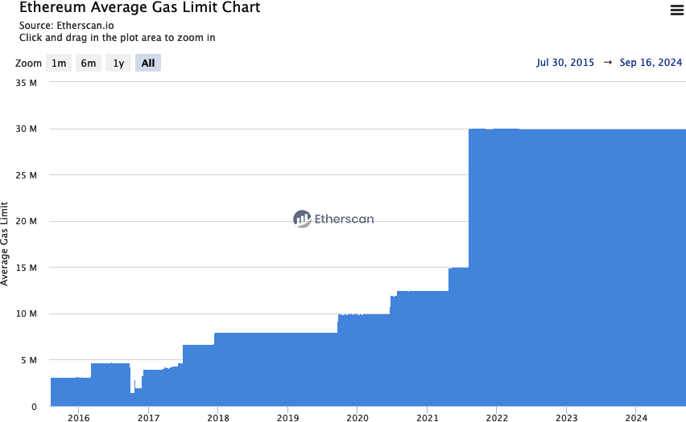

Figure 14-25. Ethereum average gas limit chart

#### Why Not Raise the Block Gas Limit?

Even though the block gas limit looks like it has been "fixed" at 30 million for more than three years, with PBS (see "Ethereum Stateless"), where actors with sophisticated hardware build the blocks—builders—and send them to proposers—validators—to publish them on the P2P network, there is an incentive to raise the block gas limit indefinitely while maintaining the actual gas used almost as a constant.

In fact, following EIP-1559, if the block gas target is much higher than the actual gas used, the base fee keeps decreasing, to the point where almost all of the gas fee goes to the validators instead of being burned (the base fee is burned, removing those ETH from the supply).

So the advantages for validators are twofold:

- They can keep the gas fees for themselves, instead of burning them and reducing the ETH supply.
- When necessary, they can create larger blocks that capture a lot of MEV activity, resulting in even more fees for them.

If you are curious about this, read more in [James Prestwich's article](https://oreil.ly/EImcE).

## Concrete Implementations

Every Ethereum node has a concrete implementation of the EVM described in this chapter. Here is a list of the most famous and used ones:

**Go-ethereum EVM**

Geth is the most adopted and oldest execution client. It contains a full implementation of the EVM written in Go.

**Execution-spec EVM**

The Ethereum Foundation maintains a Python repository on GitHub containing the specification related to the Ethereum execution client. It has a full EVM implementation written in Python.

**Revm**

Revm is one of the most used EVM implementations outside of normal Ethereum clients, thanks to its great customizability and adaptability.

**Evmone**

Evmone is probably the fastest EVM implementation. It is written in C++ and maintained by the Ipsilon team at the Ethereum Foundation.

**Besu EVM**

Besu is an execution client maintained by Consensys. It has a full implementation of the EVM written in Java.

**Nethermind EVM**

Nethermind EVM is an execution client written in C# that maintains a full implementation of the EVM.

## The Biggest EVM Upgrade: EVM Object Format

*EVM Object Format* (EOF) is the biggest upgrade to the EVM since its birth in 2015. In fact, even though there have been modifications to the EVM in the past, which were mainly focused on the gas-metering aspect or on the introduction of new opcodes, the EVM is almost identical to how it was first created by Gavin Wood.

The EVM is still great. All activities happening today on Ethereum (and all other EVM-compatible blockchains) are only possible thanks to it. It's not perfect either, and during recent years, smart contract developers have had to deal with different aspects of it and learn some tricks to overcome its constraints.

EOF is an extensible and versioned container format for the EVM with a once-off validation at deploy time. In this section, we'll explore all the major limitations of the EVM and how EOF intends to overcome them.

> **Note**  
>
> As of the final revision of this book (June 2025), the EOF upgrade has been postponed indefinitely due to insufficient consensus within the Ethereum community. There is currently no clear timeline for its implementation, and it may ultimately never be adopted. Nevertheless, we believe this section remains valuable for understanding how EOF could affect the EVM and the broader Ethereum ecosystem.

### Jumpdest Analysis

Legacy EVM doesn't validate the bytecode published on chain at creation time. On the one hand, this may look good because it lets you post whatever contract you want: you can deploy bytecode containing non-existent opcodes or add code that is never touched or truncated in the middle of a `PUSH` operation without giving the next immediate value that it must have in order to execute correctly. This actually adds lots of inefficiencies. In fact, the EVM has to check everything at runtime, which adds complexity and slows the overall performance. Here is an example of a non-existent opcode included inside an EVM bytecode:

```
600C600052602060000C
```

Here is the bytecode translated into human-readable opcodes:

```
[00]            PUSH1            0C
[02]            PUSH1            00
[04]            MSTORE
[05]            PUSH1            20
[07]            PUSH1            00
[09]            NOT-EXISTING
```

Opcode `0C` doesn't exist, and when the EVM gets to that point, it will panic and early return. Notice how the second byte in the previous bytecode is also `0C`, but the EVM doesn't fail there. The difference is that while the last `0C` byte is interpreted as an opcode and fails because it's not valid, the other one is interpreted as push data since it's the immediate value of the first `PUSH1` opcode.

One key part of this runtime check is the *jumpdest analysis*. Every client needs to do it at runtime every time a contract is executed. Let's spend some time understanding this jumpdest analysis and why it is needed in legacy EVM.

> **Tip**  
>
> To not have to perform jumpdest analysis at runtime every time a contract is called, some Ethereum node implementations save a jumpdest map for every contract. This map is created at contract deployment and saved inside the node's database.

Legacy EVM has dynamic jumps (`JUMP` and `JUMPI` opcodes) only to manage the control flow of the bytecode. This is very handy because you can change the normal flow of operations with just two opcodes. The cons are that dynamic jumps are very expensive and require a deep validation at runtime, even though most of the time, there is no need for the jump to be dynamic. In fact, very often the value to jump to is pushed to the stack immediately before the `JUMP` opcode itself. Here is a small example:

```
…6009566006016101015b6001…
```

And translated into human-readable opcodes:

```
[00]            PUSH1            09
[02]            JUMP
[03]            PUSH1            06
[05]            ADD
[06]            PUSH2            0101
[09]            JUMPDEST
[0a]            PUSH1            01
```

As you can see, the jump destination—that is, the offset `0x09` to jump to—is just pushed onto the stack through a `PUSH1` opcode immediately before the `JUMP` opcode. The EVM pushes `0x09` onto the stack, then executes the `JUMP` opcode that takes as input the previously pushed `0x09` and moves the execution to the instruction at that offset. At `0x09`, a `JUMPDEST` opcode is found, so it's considered a valid jump destination, and the execution can go on correctly.

Runtime validation is required in order to not jump to invalid destinations. Valid destinations are only `JUMPDEST` instructions that are not part of push data. This is very important to understand: legacy EVM doesn't have a proper separation between code and data. So whenever you meet the byte `0x5b`—the `JUMPDEST` opcode—in some bytecode, you cannot be completely sure if that's a real `JUMPDEST` opcode or it's part of push data without analyzing the contract as a whole.

Take a look at the following example showing this subtle difference:

```
…6009566006016101015b6001…
…6009566006016201015b6001…
```

These two bytecodes look almost identical; in fact, they differ only by one bit. But that's enough to make a huge difference in the outcome. The first bytecode is the same as the one shown in the previous example. The second looks like this in human-readable format:

```
[00]            PUSH1            09
[02]            JUMP
[03]            PUSH1            06
[05]            ADD
[06]            PUSH3            01015b
[0a]            PUSH1            01
```

If you try to execute this second code, it will fail due to an invalid jump destination. It may look a bit weird because at offset `0x09`, there's still the `0x5b` byte, which represents the `JUMPDEST` opcode. The problem here relies on the fact that, in this case, the `0x5b` byte is part of the push data, so it could not be considered a valid jump destination. This is why the execution fails at that point.

Jumpdest analysis is the process of analyzing a contract in order to know which jump destinations are valid and which are not so that when the EVM is executing the contract, it is able to detect an invalid jump destination and panic.

Let's say you're sending a transaction that interacts with Contract A. When the EVM loads it, it immediately performs jumpdest analysis to save the map of valid jump destinations and then starts with the real execution of the transaction:

```
…6009566006016101015b60016015566006016201015b6001…
```

Here it is in human-readable format:

```
[00]            PUSH1            09
[02]            JUMP
[03]            PUSH1            06
[05]            ADD
[06]            PUSH2            0101
[09]            JUMPDEST
[0a]            PUSH1            01
[0c]            PUSH1            15
[0e]            JUMP
[0f]            PUSH1            06
[11]            ADD
[12]            PUSH3            01015b
[16]            PUSH1            01
```

The EVM skims through all the bytecode and creates a map where each `0x5b` byte is marked as a valid or invalid jump destination, as you can see in Figure 14-26.

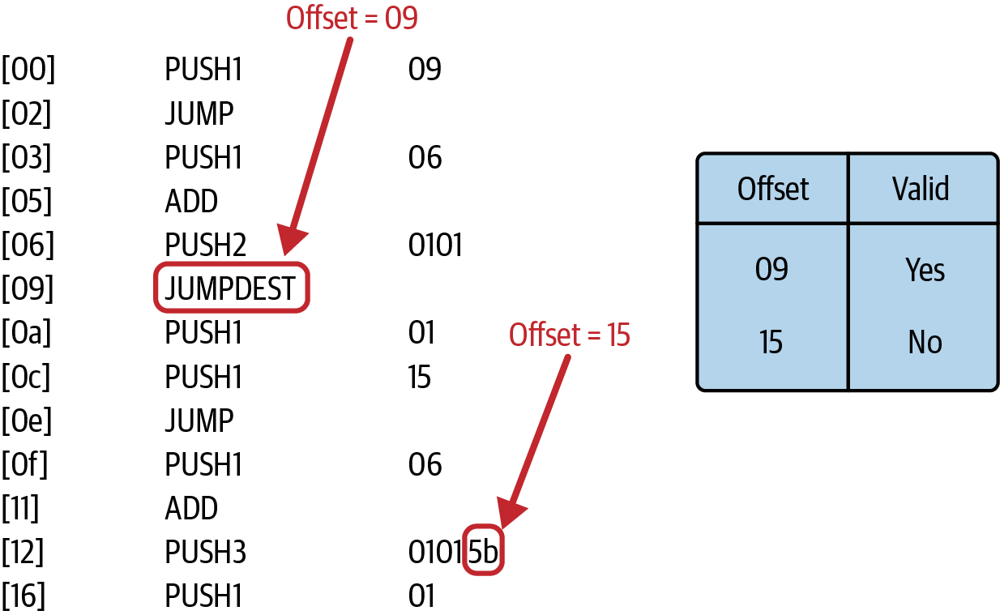

Figure 14-26.  The client creates a jumpdest map to separate valid from invalid jump destinations

### Adding and Deprecating Features

Adding or deprecating an opcode or a specific feature is not as easy as it may seem. While it is true that different opcodes have been added, such as `BLOBHASH`, `BLOBBASEFEE`, `BASEFEE`, and so on, this is always complicated because of the unstructured and not validated EVM's bytecode.

Have a look at the following example, which contains an invalid opcode, specifically `0x0C`. Suppose this is a real contract deployed on Ethereum mainnet:

```
600C600052602060000C
```

Here it is in human-readable format:

```
[00]            PUSH1            0C
[02]            PUSH1            00
[04]            MSTORE
[05]            PUSH1            20
[07]            PUSH1            00
[09]            NOT-EXISTING
```

If you try to execute this small bytecode inside an EVM, you will see that when the execution gets to the not-existing opcode, it fails.

Let's say a future upgrade adds a new opcode, the `MAX` opcode, that takes two items from the stack and returns the one containing the bigger value. The byte assigned to it is `0x0C`. Consider again the previous bytecode (remember, we're assuming it's a real contract deployed on mainnet):

```
[00]            PUSH1            0C
[02]            PUSH1            00
[04]            MSTORE
[05]            PUSH1            20
[07]            PUSH1            00
[09]            MAX
```

Now this bytecode has a completely different outcome. In fact, it doesn't fail anymore and returns successfully. This could create problems if there were contracts relying on the assumption that this contract always failed due to a (previously) not-existing opcode.

Deprecating a feature is even harder since you cannot rely on a versioning system of the EVM. So if you remove an opcode or change how it works, old contracts that were using it could break, and there is nothing apart from manual intervention (by creating a new contract) that can fix it.

When [EIP-2929](https://oreil.ly/_9kTv) was introduced to change the gas metering of state-access opcodes, some contracts broke because they were hard-coding the amount of gas to use or to expect. The solution to make them work again was to introduce *access lists*, where you can preload some accounts and storage slots that you know will be touched by the transaction and lower gas costs.

Other important aspects of legacy EVM that make upgrades harder are *code introspection* and *gas observability*. Gas observability is possible thanks to opcodes such as `GAS` or even all the `*CALL` opcodes that take gas as input, while code introspection is achievable because of opcodes such as `CODESIZE`, `CODECOPY`, `EXTCODESIZE`, `EXTCODECOPY`, and `EXTCODEHASH`.

The problem lies in the fact that if the EVM is able to access the remaining gas at a certain point of the execution, the logic of a smart contract can be made dependent on that. And if in the future, there is a change regarding gas metering of some opcodes (which is something not so rare to observe), there could be problems for all smart contracts that were relying on the old gas metering. The same applies for code introspection.

> **Note**  
>
> Without code introspection, it's possible for future versions of EOF to completely change the underlying virtual machine to something like Cairo VM or Wasm or any other by automatically transforming all contracts' code into the new VM's code with the same functionality.

### Code and Data Separation

Legacy EVM doesn't impose a structure on bytecode that is published on chain. There's no distinction between real code and data that is used within that code. Everything is just bytes, and it's interpreted step-by-step by the EVM during execution.

It's impossible to say that a certain part of the bytecode is code or data without looking at the whole contract. Take a look at the following example:

```
…730102030405060708090a0b0c0d0e0f101112131431…
[00]            PUSH20    0102030405060708090a0b0c0d0e0f1011121314
[15]            BALANCE
```

Without diving into the code, you cannot immediately tell that `0102030405060708090a0b0c0d0e0f1011121314` is not to be interpreted as a series of opcodes—`0x01`: `ADD`, `0x02`: `MUL`, and so on— but rather that it's push data representing a fixed address we want to query the balance of. This is bad for static analysis tools and formal verification, and it makes it more difficult for smart contracts to be able to correctly process executable code directly on chain.

### Stack Too Deep

We're now going to take a look at one of the most hated limitations of the EVM: the "stack too deep" error. If you try to compile the following smart contract, you'll immediately get it:

```solidity
// SPDX-License-Identifier: MIT
pragma solidity 0.8.27;

contract StackTooDeep {
    function add(
        uint256 a,uint256 b,uint256 c,uint256 d,uint256 e,uint256 f,uint256 g,uint256 h,uint256 i
    ) external pure returns(uint256) {
        return a+b+c+d+e+f+g+h+i;
    }
}
```

Here is the output when trying to compile the contract:

```
solc StackTooDeep.sol --bin
Error: Stack too deep. Try compiling with `--via-ir` (cli) or the equivalent `viaIR: true` (standard JSON) while enabling the optimizer. Otherwise, try removing local variables.
 --> StackTooDeep.sol:8:16:
  |
8 |         return a+b+c+d+e+f+g+h+i;
  |                                ^
```

This error is very subtle because it's a direct consequence of how the EVM works. In fact, even though the maximum number of items you can push onto the stack is 1,024, the EVM is only capable of easy access to the top 16 elements of that, through opcodes such as `DUP1..16` and `SWAP1..16`.

In our `StackTooDeep` example, the `add` function takes nine different parameters, each required to be put onto the stack. Then, it performs eight additions to get the final result. The problem lies in these details. While the final operation can look like a big single addition, in reality, the compiler has to segment each one and create a temporary variable that holds the intermediate result that needs to be saved into the stack. So we end up with nine parameters plus eight intermediate results, with a total of 17 stack items needed. When the compiler tries to reference a variable that is at position 17 or more in the stack, it fails because it doesn't have any opcodes that are able to easily access it.

To even better visualize the problem, you can look at Figure 14-27, which shows the stack composition in detail for every step. You can easily see that variable `i` is at depth 17 at the end of execution. The compiler doesn't let a local variable or parameter to not be easily accessible in the function's scope, so it throws the "stack too deep" error.

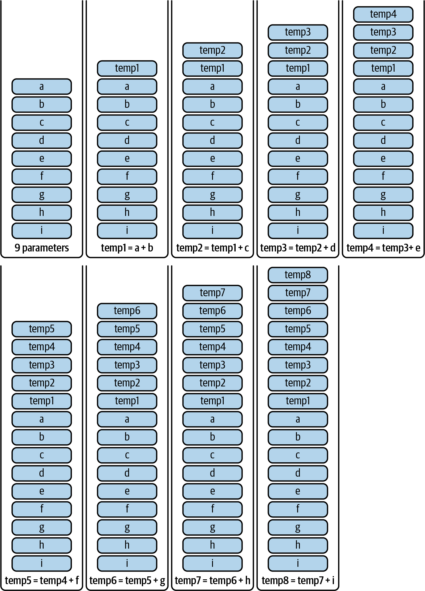

Figure 14-27. Stack composition for every step

This is just a very simple example that shows one of the problems smart contract developers have to overcome during their daily jobs. Even though compilers have become better and better at analyzing and managing these kinds of situations automatically, the EVM imposes some hard limitations based on how it currently works.

### EOF

EOF addresses all of these issues by introducing a container format for EVM bytecode with validation at deploy time, a versioning system, and a full separation between code and data. Here is an example of EOF-valid bytecode:

```
EF00010100040200010008030001003004002000008000045F5FD1005FEC0000EF00010100040200010004030001001404000000008000025F5FEE00EF00010100040200010001040000000080000000000102030405060708090a0b0c0d0e0f10111213141516171819101a1b1c1d1e
```

Here it is translated into human-readable format:

```
Magic bytes                      EF00
EOF version                      01
Stack validation data            01 0004
Code sections                    02 0001 0008
Subcontainer section size        03 0001 0030
Data section size                04 0020
Header terminator                00
Stack: #ins, #outs, max stack    00 80 0004
Code                             5F5FD1005FEC0000
Subcontainers                    EF00010100040200010004030001001404000000008000025F5FEE00
                                 EF00010100040200010001040000000080000000
Data                             000102030405060708090a0b0c0d0e0f10111213141516171819101
                                 a1b1c1d1e
```

Just hold on for a moment—we'll explain everything in the following sections.

#### Improvements

Jumpdest analysis and all gas and code introspection opcodes are completely removed and are now considered undefined. All opcodes in the code section must be valid, immediate values (such as push data) must be present in the code, and there must not be unreachable instructions. Stack validation is performed at creation time, too. This makes stack underflow and overflow impossible during execution, removing the necessity of doing all those checks at runtime because the EVM can assume contracts already respect all the rules since they have been validated at deployment.

> **Tip**  
>
> These validation guarantees improve the feasibility of AOT or JIT compilation of EVM bytecode into machine-native code.

Dynamic jumps are removed, too, and static relative jumps are introduced with three new opcodes: `RJUMP`, `RJUMPI`, and `RJUMPV`, which take immediate values, similar to `PUSH` opcodes. Notice how it's possible with EOF to add new instructions that take immediates because there is no jumpdest analysis anymore and everything is checked at creation time instead of at runtime.

As you can see from the EOF container in the previous section, EOF introduces the concept of *functions* (i.e., code sections), isolating the stack for each of them. Legacy EVM can only mimic this behavior by relying on dynamic jumps: Solidity or Vyper functions are only an internal representation.

Three opcodes—`CALLF`, `RETF`, and `JUMPF`—and a *return stack* (completely separated from the EVM's usual operand stack) are added for that reason. In particular, the return stack is needed in order to save execution information before jumping into a function so that it's possible to return to the caller without losing data. Figure 14-28 can help you better visualize how this works.

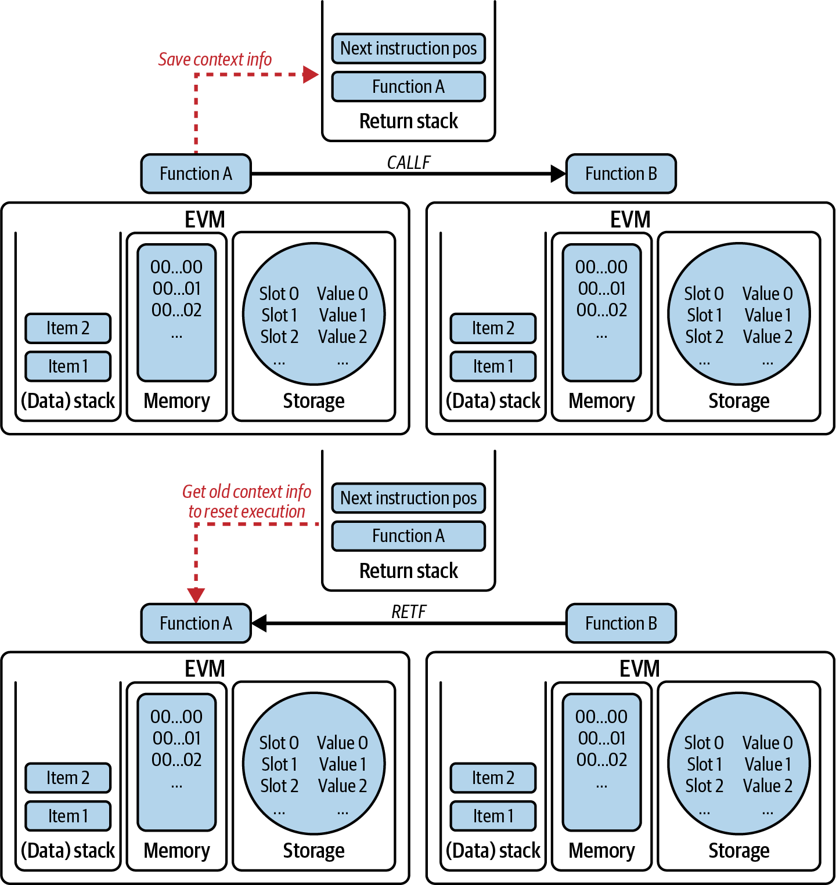

Figure 14-28. EOF introduces the concept of functions or code sections

The "stack too deep" problem is solved through the addition of three new opcodes: `DUPN`, `SWAPN`, and `EXCHANGE`. The first two instructions are analogous to the old `DUP1..16` and `SWAP1..16` with the only difference being that they take one immediate value representing the index of the item to duplicate or swap. That index can go up to 256, much more than the previous hard limit of 16.

The `EXCHANGE` opcode is a new opcode that lets you swap two different items in the stack (note that `SWAPN` always swaps the n item with the first one, while `EXCHANGE` can swap arbitrary items with one another). This is particularly useful for compilers implementing *stack-scheduling algorithms*, which try to minimize stack traffic given a set of variables and usage analysis.

`CREATE` and `CREATE2` are made obsolete in EOF contracts. Instead, `EOFCREATE` and `RETURNCONTRACT` are introduced to provide a way to create new EOF contracts.

In the end, new `CALL` instructions are added to replace the old, removed ones: `EXTCALL`, `EXTDELEGATECALL`, `EXTSTATICCALL`, and `RETURNDATALOAD`. They don't allow specifying a gas limit (no gas observability) and don't require an output buffer where the EVM would save the return data of the subcall. `RETURNDATALOAD` is introduced for the specific reason to get the return data of the last executed subcall onto the stack of the caller.

#### EOF in action

Let's analyze the EOF contract shown at the beginning of this section:

```
EF00010100040200010008030001003004002000008000045F5FD1005FEC0000EF00010100040200010004030001001404000000008000025F5FEE00EF00010100040200010001040000000080000000000102030405060708090a0b0c0d0e0f10111213141516171819101a1b1c1d1e
```

First, we have the EOF header, made by:

```
Magic bytes                    EF00
```

Magic bytes are needed to distinguish EOF contracts from legacy ones (no other contract starts with `EF00` in Ethereum mainnet thanks to EIP-3541).

Then, there is the EOF version, which can lead to future upgrades to the EOF format in a graceful way:

```
EOF version                    01
```

Stack validation data always starts with the identifier `01`, and it's followed by the size of the "Stack" part. In this example, we have a 4-byte-long "Stack" section:

```
Stack validation data            01 0004
```

Code sections start with the identifier `02`, followed by the number of code sections (aka functions) and their related size. Here we have one code section, 8 bytes long:

```
Code sections                02 0001 0008
```

Subcontainer section size starts with the identifier `03`, followed by the number of subcontainers and their related sizes. Here we have one subcontainer, 48 bytes long (remember, it's always hex format):

```
Subcontainer section size        03 0001 0030
```

Data section size starts with the identifier `04`, followed by the size of the data section. Here we have 32 bytes in the data section:

```
Data section size                04 0020
```

Finally, there is the header terminator `00`, which always marks the end of the EOF header:

```
Header terminator                00
```

The Stack section shows the number of inputs and outputs and the max stack height for each code section (only one in this example). We have zero inputs and a nonreturning function (`80` is a special byte representing a nonreturning function), and the max height of the stack equals 4:

```
Stack: #ins, #outs, max stack        00 80 0004
```

Here are all the code sections containing EVM bytecode that is executed by the EVM:

```
Code                        5F5FD1005FEC0000
```

We have only one function (code section), containing the following opcodes:

```
PUSH0 PUSH0 DATALOADN 0 PUSH0 EOFCREATE 0 STOP
```

This code first pushes `0-0` onto the stack thanks to the first two `PUSH0` opcodes. Then, it reads 32 bytes of the data section, starting at offset zero (the next immediate value in the code) and pushes them onto the stack. Then, another `0` is pushed through the last `PUSH0`. Finally, `EOFCREATE` is called with `0` as the immediate argument, which calls the first code section of the first subcontainer:

```
Subcontainers                EF00010100040200010004030001001404000000008000025F5FEE00EF0001
                             0100040200010001040000000080000000
```

The subcontainers section includes all of the EOF subcontainers included in the EOF bytecode. In this example, we have one subcontainer. Subcontainers are EOF-formatted bytecode: the idea is that you can nest EOF containers inside other EOF containers. This is useful for factory contracts.

In the end, there is the data section containing all the data the contract needs for execution. Here we have 32 bytes of data:

```
Data                        000102030405060708090a0b0c0d0e0f10111213141516171819101a1b1c1d1e
```

This analysis could be recursively applied to the subcontainer of this EOF bytecode in order to completely understand what it's doing, but we leave that to the reader if you are interested in diving deeper into the rabbit hole of the EVM.

## The Future of the EVM

The future of the EVM, besides EOF, is uncertain and will depend on how the EVM will be used by developers and different projects. There are some interesting areas where the EVM could expand, though, such as the *zk-EVM* that would provide zero-knowledge proofs attached to each block to prove its correct execution. Also, [*EVMMAX*](https://oreil.ly/ioqSx) and [*SIMD*](https://oreil.ly/7q0Dq) would bring more power to the EVM, making it much faster to do lots of cryptographic processing, which would be particularly beneficial for cryptographic-dependent applications such as privacy protocols or L2s.

## Conclusion

In this chapter, we explored the EVM, tracing the execution of various smart contracts and looking at how the EVM executes bytecode. We also looked at gas, the EVM's accounting mechanism, and saw how it solves the halting problem and protects Ethereum from DoS attacks. Furthermore, we analyzed EOF, looking at how it tries to fix different flows of legacy EVM.

Next, in Chapter 15, we will explore the mechanism used by Ethereum to achieve decentralized consensus.
