# Chapter 15. Consensus

Throughout this book we have talked about *consensus rules*—the rules that everyone must agree to for the system to operate in a decentralized yet deterministic manner. In computer science, the term *consensus* predates blockchains and is related to the broader problem of synchronizing state in distributed systems, such that different participants in a distributed system all (eventually) agree on a single system-wide state. This is called *reaching consensus*.

When it comes to the core functions of decentralized record keeping and verification, it can become problematic to rely on trust alone to ensure that information derived from state updates is correct. This rather general challenge is particularly pronounced in decentralized networks because there is no central entity to decide what is true. The lack of a central decision-making entity is one of the main attractions of blockchain platforms because of the resulting capacity to resist censorship and the lack of dependence on authority for permission to access information. However, these benefits come at a cost: without a trusted arbitrator, any disagreements, deceptions, or differences need to be reconciled using other means. Consensus algorithms are the mechanism used to reconcile security and decentralization.

In blockchains, consensus is a critical property of the system. Simply put, there is money at stake! So in the context of blockchains, consensus is about being able to arrive at a common state while maintaining decentralization. In other words, consensus is intended to produce a system of strict rules without rulers. There is no one person, organization, or group "in charge"; rather, power and control are diffused across a broad network of participants whose self-interest is served by following the rules and behaving honestly.

The ability to come to consensus across a distributed network, under adversarial conditions, without centralizing control is the core principle of all open, public blockchains. To address this challenge and maintain the valued property of decentralization, the community continues to experiment with different models of consensus. This chapter explores these consensus models and their expected impact on smart contract blockchains such as Ethereum.

> **Note**  
>
> While consensus algorithms are an important part of how blockchains work, they operate at a foundational layer, far below the abstraction of smart contracts. In other words, most of the details of consensus are hidden from the writers of smart contracts. You don't need to know how they work to use Ethereum, any more than you need to know how routing works to use the internet.

## Principles of Consensus

In blockchain technology, particularly within Ethereum, understanding the principles of consensus helps us make sense of how the network maintains its integrity and operates effectively. To get a clearer picture of how it all works, let's walk through the core ideas.

### Safety

In the context of consensus mechanisms, *safety* is about ensuring that the network consistently agrees on the blockchain's current state without error. This means avoiding problems like double-spending and transaction conflicts, maintaining consistency across the network. In a safe system, every node has an identical view of the history of the chain, effectively behaving like a centralized implementation that executes operations atomically one at a time.

### Finality

*Finality* is one of the most important safety features in Ethereum's consensus mechanism. It marks the point at which transactions are considered complete and irreversible, ensuring that once a transaction has been added to the blockchain, it cannot be altered or removed. This irreversible nature of transactions instills a high level of trust in the system, providing certainty to users that their transactions are permanently recorded.

Basically, finality puts the idea of safety into action, turning it from just a concept into something practical. It ensures that even though different parts of the network might have their own local views, there exists a point of irrevocable agreement that makes the chain's history fixed and unchangeable.

### Liveness

While safety ensures that nothing bad happens on the network, *liveness* guarantees that something good always happens, eventually. In other words, the Ethereum network will continue to process transactions and add new blocks, come what may.

From another perspective, liveness can also be understood in terms of availability. In practical terms, this means that whenever we submit a valid transaction to a node that is acting honestly within the network, we can expect the transaction to be included in a forthcoming block that contributes to the extension of the blockchain. This expectation of transaction inclusion and processing is necessary to achieve user trust and the overall efficacy of the Ethereum platform.

### Block Trees and Forking

Designing a consensus protocol that is both safe and live under all circumstances is not possible—you have to favor one of the two. While the Ethereum consensus protocol offers both safety and liveness under good network conditions, it prioritizes liveness when things get chaotic. It does so through the concept of forking.

In a blockchain, every block (except for the special Genesis block) builds on and points to a parent block. Thus, we end up with a chain of blocks: a blockchain. On chains implementing forking consensus protocols, this linear condition is often not the case in practice: in real-world conditions, we can end up with something more like a block tree—as you can see in Figure 15-1—than a blockchain, and the goal of the consensus protocol is for all nodes on the network to agree on the same linear sequence of blocks.

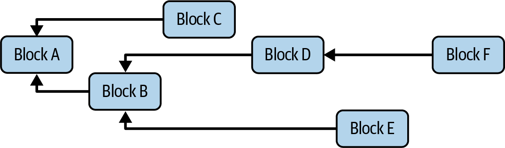

Figure 15-1. Block tree structure

The various branches in the block tree are called *forks*. Forks happen naturally as a consequence of network and processing delays or client faults and malicious client behavior.

If we were to consult nodes that are following different forks, they would give us different answers regarding the state of the system. Here lies the resilience of forking consensus protocols: instead of stopping entirely under unfavorable conditions, they fork. Eventually, we want every correct node on the network to agree on an identical linear view of history and hence a common view of the state of the system. It is the role of the protocol's *fork choice rule* to bring about this agreement: given a block tree and some decision criteria, the fork choice rule is designed to select, from all the available branches, the one that is most likely to eventually end up in the final linear, canonical chain. The downside of a forking protocol is that nodes following branches that don't end up in the canonical chain will eventually have to rewind their view of reality, reversing any recent transactions they have processed, in order to get onto the correct branch. This is called a *reorg* or *reversion* and is disruptive, so protocols aim to minimize it as much as possible.

Now we can understand the power of finality in Ethereum consensus protocol: forking is a powerful means to liveness, but for the network to be usable, this flexibility must be balanced by some safety guarantees.

## Consensus via Proof of Work

The creator of the original blockchain, Bitcoin, invented a consensus algorithm based on *proof of work* (PoW). Arguably, PoW is the most important invention underpinning Bitcoin. The colloquial term for PoW is *mining*, which creates a misunderstanding about the primary purpose of consensus. Often, people assume that the purpose of mining is to create new currency since the purpose of real-world mining is to extract precious metals or other resources. Rather, the real purpose of mining (and all other consensus models) is to secure the blockchain while keeping control over the system decentralized and diffused across as many participants as possible. The reward of newly minted currency is an incentive to those who contribute to the security of the system: a means to an end. In that sense, the reward is the means, and decentralized security is the end.

In PoW consensus, there is also a corresponding "punishment," which is the cost of energy required to participate in mining. This significant energy consumption isn't a flaw; it's key to a deliberate security and incentive design. If participants do not follow the rules and earn the reward, they risk the funds they have already spent on electricity to mine. Thus, PoW consensus is a careful balance of risk and reward that drives participants to behave honestly out of self-interest.

Ethereum started as a PoW blockchain following Bitcoin's example, in that it used a PoW algorithm with the same basic incentive system for the same basic goal: securing the blockchain while decentralizing control. Ethereum's PoW algorithm was slightly different from Bitcoin's and was called *Ethash*.

### Ethash: Ethereum's PoW Algorithm

Before Ethereum transitioned to PoS, it relied on a PoW algorithm called Ethash. It used an evolution of the Dagger-Hashimoto algorithm, which is a combination of Vitalik Buterin's Dagger algorithm and Thaddeus Dryja's Hashimoto algorithm. Ethash is dependent on the generation and analysis of a large dataset, known as a *directed acyclic graph* (or, more simply, "the DAG"). The DAG had an initial size of about 1 GB and continued to slowly and linearly grow, being updated once every epoch (30,000 blocks, or roughly 125 hours).

The purpose of the DAG was to make the Ethash PoW algorithm dependent on maintaining a large, frequently accessed data structure. This in turn was intended to make Ethash ASIC resistant, which means that it was more difficult to make application-specific integrated circuit (ASIC) mining equipment that is orders of magnitude faster than a fast GPU. Ethereum's founders wanted to avoid centralization in PoW mining, where those with access to specialized silicon-fabrication factories and big budgets could dominate the mining infrastructure and undermine the security of the consensus algorithm.

Using consumer-level GPUs to carry out the PoW on the Ethereum network meant that more people around the world could participate in the mining process. A larger number of independent miners meant that the mining power was more decentralized, which meant a situation like in Bitcoin, where much of the mining power is concentrated in the hands of a few large, industrial mining operations, could be avoided. The downside of the use of GPUs for mining was that it precipitated a worldwide shortage of GPUs in 2017, causing their price to skyrocket and an outcry from gamers. This led to purchase restrictions at retailers, limiting buyers to one or two GPUs per customer.

Until 2017, the threat of ASIC miners on the Ethereum network was largely non-existent. Using ASICs for Ethereum required the design, manufacture, and distribution of highly customized hardware. Producing them required a considerable investment of time and money. The Ethereum developers' long-expressed plans to move to a PoS consensus algorithm, now realized, likely kept ASIC suppliers from targeting the Ethereum network for a long time.

## Consensus via Proof of Stake

Historically, PoW wasn't the first consensus algorithm to be proposed. Before it, many researchers explored ideas based on financial or reputational stake. Even earlier still, some of the first consensus models were permissioned: validators were selected through authority or identity, not open competition. *Practical Byzantine fault tolerance* (PBFT), for example, requires a fixed or curated set of validators, a model that still underlies many traditional distributed systems today.

One of the major breakthroughs of PoW-based consensus was that it made participation permissionless: anyone with the available computational power could contribute and get rewarded, without needing approval to join. That was a huge win for decentralization. In a sense, PoW was invented as a permissionless alternative to the more closed models.

Following Bitcoin's success, many blockchains adopted PoW. But the explosion of research into consensus reignited interest in PoS and led to major advances. From the beginning, Ethereum's founders hoped to eventually migrate to PoS. In fact, Ethereum's original PoW chain included a built-in handicap, the so-called *difficulty bomb*, which was designed to slowly make mining harder over time, forcing the system toward the eventual transition. Ethereum's version of PoS, while permissionless, has some conceptual roots in the earlier authority-based systems: here, identity and participation come from putting down stake. But since anyone with ETH can do so, it preserves the open-access spirit of Nakamoto's design.

In general, a PoS algorithm works as follows. The blockchain keeps track of a set of validators, and anyone who holds the blockchain's base cryptocurrency (ether, in Ethereum's case) can become a validator by sending a special type of transaction that locks up their ether into a deposit. Validators take turns proposing and voting on the next valid block, and the weight of each validator's vote depends on the size of their deposit (i.e., stake). Validators earn small rewards proportional to their stake when they participate correctly in the protocol. If they make mistakes, like publishing inaccurate or late attestations, they can incur small penalties, roughly on the same scale as the rewards. But there's a much more serious consequence called *slashing*, which happens only when a validator is provably malicious—for example, by publishing conflicting attestations or equivocating blocks. Thus, PoS forces validators to act honestly and follow the consensus rules via a system of reward and punishment. The major difference between PoS and PoW is that the punishment in PoS is intrinsic to the blockchain (e.g., loss of staked ether), whereas in PoW the punishment is extrinsic (e.g., loss of funds spent on electricity).

Since Ethereum was launched in 2015, there was the intention to transition to a PoS consensus protocol. The first concrete step in that direction came on December 1, 2020, with the launch of the Beacon Chain. Initially, the Beacon Chain was an empty blockchain that let everyone become a validator by depositing 32 ETH into a specific deposit contract and handled only its internal consensus of validators and their respective balances. At that time, the Ethereum blockchain was still using Ethash as its consensus protocol.

On September 15, 2022, the Merge hard fork occurred, and the Beacon Chain, with its own set of validators, extended its PoS-based consensus protocol to the Ethereum main blockchain, effectively ending the use of Ethash. However, some limitations remained, including the inability for validators to withdraw their capital and leave the validator set. These issues were fully resolved on April 12, 2023, with the Shapella update, which completed the work of transitioning Ethereum from a PoW to a PoS consensus protocol.

The PoS consensus protocol used by Ethereum is called *Gasper*. In the following sections, we will explore how it works, starting with basic terminology and progressing to the fork choice rule (LMD-GHOST) and finality gadget (Casper FFG). We will conclude with an example to clarify the theoretical concepts that we have discussed.

## PoS Terminology

In this section, we'll focus on Ethereum PoS consensus components and terminology.

### Nodes and Validators

*Nodes* form the backbone of the Ethereum network. They communicate with one another and are responsible for validating consensus adherence. *Validators*, which are responsible for proposing and voting on new blocks, are attached to these nodes, but despite what the name might imply, they don't actually validate the blocks themselves. Instead, it's the node software that checks whether blocks and transactions follow the protocol rules. A single node can host multiple validators, and validator duties are carried out by running both an execution client and a consensus client. We'll see exactly what those duties are in the next sections.

One peculiar property of PoS to keep in mind is that the set of active validators is known: this will be key to achieving finality since we can identify when we have reached a majority vote of participants.

### Blocks and Attestations

Strict time management is an important property of Ethereum's PoS. The two key intervals in PoS are the *slot*, which is exactly 12 seconds, and the *epoch*, which spans 32 slots.

At every slot, exactly one validator is selected to propose a block. During every epoch, every validator gets to share its view of the world exactly once, in the form of an *attestation*. An attestation contains votes for the head of the chain that will be used by the LMD-GHOST protocol and votes for checkpoints that will be used by the Casper FFG protocol, where FFG stands for "Friendly Finality Gadget." Attestation sharing is bandwidth intensive, so it's distributed across each epoch instead of every block to spread the necessary workload and keep it manageable.

The protocol incentivizes block and attestation production and accuracy via a system of rewards and penalties for validators, but it tolerates empty slots and attestations, which can happen for both organic (e.g., a node went offline) and profit-driven reasons. We will expand on this in the later section "Timing Games".

## LMD-GHOST

LMD-GHOST is the main part of the Ethereum consensus protocol: it's the fork choice rule algorithm. It selects the latest block a node should consider valid in its local view of the blockchain. This block is also called the *head of the chain*.

To fully understand how it works, you must know some basic concepts of the Ethereum PoS protocol. In a classic PoW-based consensus protocol, entities responsible for creating new blocks and adding them to the chain (i.e., miners) don't need to adhere to any special requirement. If they publish a block that satisfies the PoW, then it gets accepted by the whole network. In Ethereum's PoS-based consensus protocol, validators must stake a big amount of ETH as collateral—right now, at least 32 ETH—just to enter into the validators set.

As we have previously briefly mentioned, validators have two main duties:

**Block proposing**

Every slot, a validator is pseudorandomly selected to create and propose the next block for the chain.

**Creating attestations**

Every slot, a proportion of the validators is selected to publish their votes for the block that they think is the best head of the chain. This vote is then shared to every validator in the form of an attestation.

When a validator votes for a certain block inside an attestation, it's actually assigning it a score. This score is exactly equal to the amount of ETH the validator has staked at the moment they've published the attestation. But there's more: this vote is not only a vote for that block but also a vote for all ancestor blocks that live in the same fork of that selected block, as you can see in Figure 15-2.

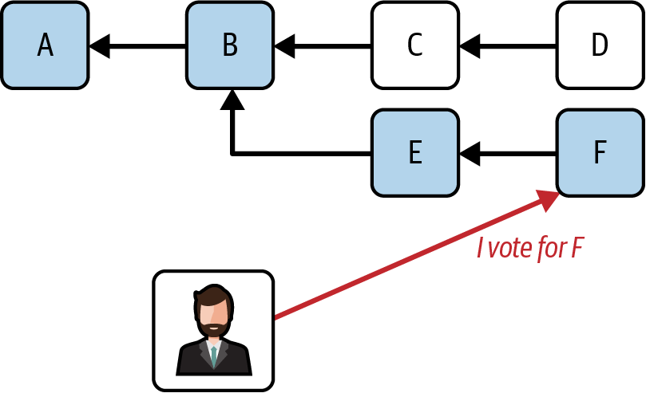

Figure 15-2. Vote propagation to ancestors

You could say that a vote for a block is propagated back to all its ancestors. To make this concept even clearer, we can assign a score to all branches. A *branch* is the link that connects a block with its parent, as shown in Figure 15-3.

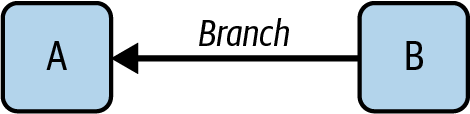

Figure 15-3. Branch definition

We define the score of a branch to be the sum of the score of the block that roots that branch (block B in Figure 15-3) plus the score of all its direct descendant branches.

Figure 15-4 shows a chain of blocks where each block has a score equal to 1. The branch connecting E to D has a score exactly equal to the score of block E because there are no descendant blocks. To compute the score of branch D→C, you need to add the score of block D to the score of all descendant branches. In this case, there's only one descendant branch: branch E→D. So it's 1 (score of block D) + 1 (score of branch E→D) = 2. Then we have branch C→B: its score is 1 (score of block C) + 2 (score of branch D→C) = 3. Here, we have a small fork with block C′; we need to assign a score to branch C′→B. Its score is just 1 (score of block C′) because block C′ has no direct descendant. Finally, we have branch B→A; to compute its score, we need to sum 1 (score of block B) + 1 (score of branch C′→B) + 3 (score of branch C→B) = 5.

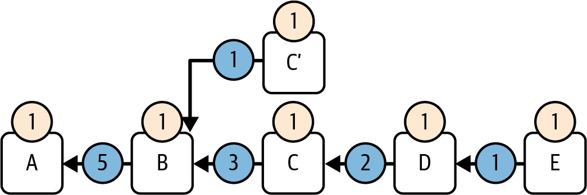

Figure 15-4. Branch score calculation example

Figure 15-5 contains a more complex scenario with several forks where each block has a different score. Look at it and make sure you understand how the score of each branch is computed.

Figure 15-5. Complex branch scoring

After the last example, it should be clear that the score of a block not only influences that single block but also all its ancestors as it gets propagated back to all previous branches. The idea is that if a validator votes (in the form of an attestation) for a block to be the head of the chain, it's also considering all its ancestors valid and part of the correct chain.

Now, we can finally go into the details of how LMD-GHOST really works and how it selects the block to be considered the head of the chain. Let's start by analyzing its name. LMD-GHOST is made up of two acronyms: *latest message driven* and *greediest heaviest observed subtree*.

### Latest Message Driven

To assign a score to each block and branch, you need to consider only the most recent attestation of each validator. That means that if you receive two attestations from a validator V, then you don't have to count them twice; you need to check which one is the most recent and discard the other one.

Figure 15-6 shows a validator that publishes an attestation on block B in which they share the fact that they think block B is the head of the chain. Then, at a later time during block F, the validator is selected again to post a new attestation in which they express their preference for block F as the new head of the chain. When that validator posts the new attestation at block F, other validators need to discard the old one (published during block B) and consider only the most recent.

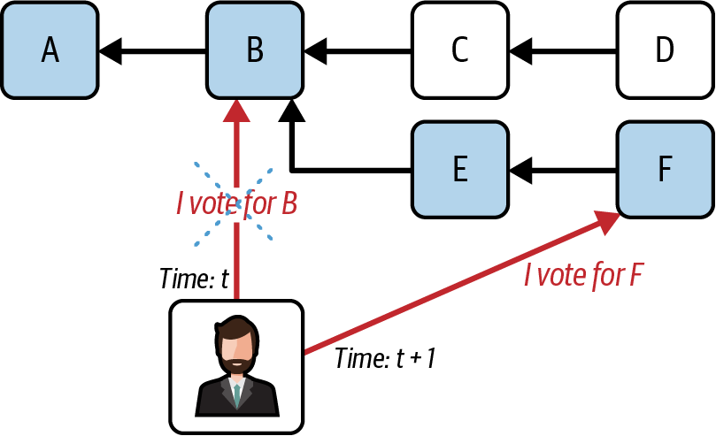

Figure 15-6. Latest message driven example

### Greediest Heaviest Observed Subtree

GHOST is the key aspect of the fork choice rule. The head block is the block with no further descendants that is part of the fork with the highest vote.

Let's see it in practice to better understand how LMD-GHOST works in a real scenario. Figure 15-7 represents the same scenario we used previously.

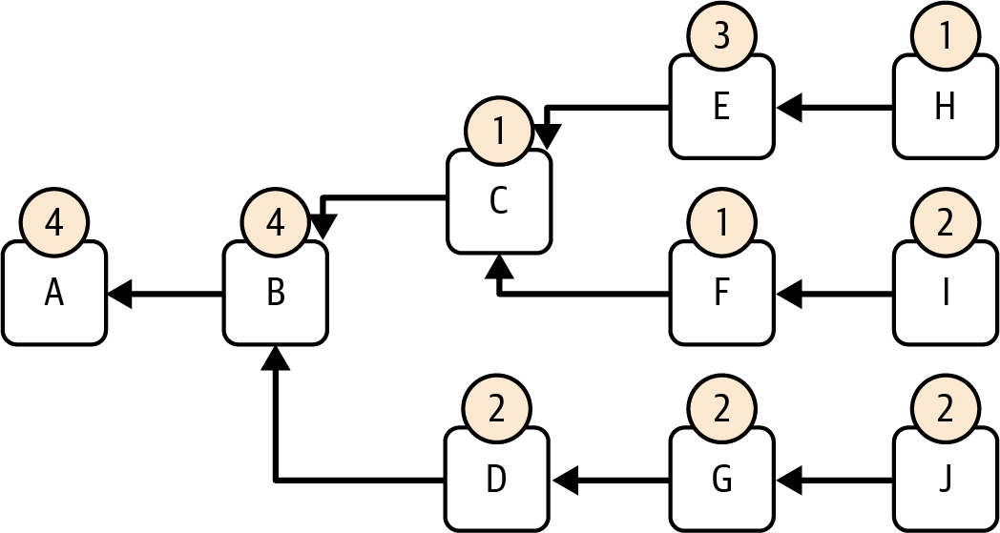

Figure 15-7. LMD-GHOST scenario

LMD-GHOST always starts from an initial block that is considered part of the finalized chain. Initially, that's the Genesis block, but with the full PoS-based Ethereum consensus protocol, it keeps getting updated with the last justified checkpoint block—that's terminology that we'll explore in "Casper FFG: The Finality Gadget". It's not crucial if you don't know what a justified checkpoint is yet; you just need to know that there's always a starting block.

In this example, block A is the initial block. Let's assume we're a validator who needs to cast an attestation or who is selected to propose the next block. We need to run LMD-GHOST to know which block is the head of the chain so that we can publish the attestation accordingly or we can build the next block on top of the correct previous head block. We've already collected other validators' attestations up to now, only considering the most recent one for every validator, following the LMD rule of the protocol. So we have the score of all blocks, made up as the sum of the score that each validator gave to each of them.

At this point LMD-GHOST works in two steps:

1. It assigns a score to all branches, following the same methodology we explained before by propagating backward the score of each block to all previous branches. Figure 15-8 shows the final scores of all branches.

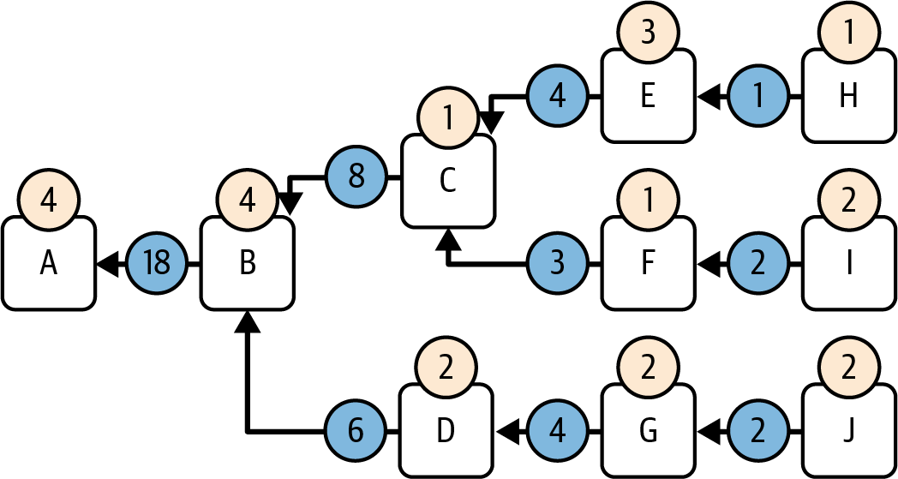

Figure 15-8. Branch scores computed

2. Then, starting at the initial block, the GHOST part of the protocol greedily proceeds to select the branch with the highest score until it gets to a block with no descendants. That's the head block returned by the LMD-GHOST fork choice rule.

Let's see this running step-by-step in our example. LMD-GHOST starts at initial block A and immediately goes to block B by following branch B→A as there are no alternative branches to choose from, as shown in Figure 15-9.

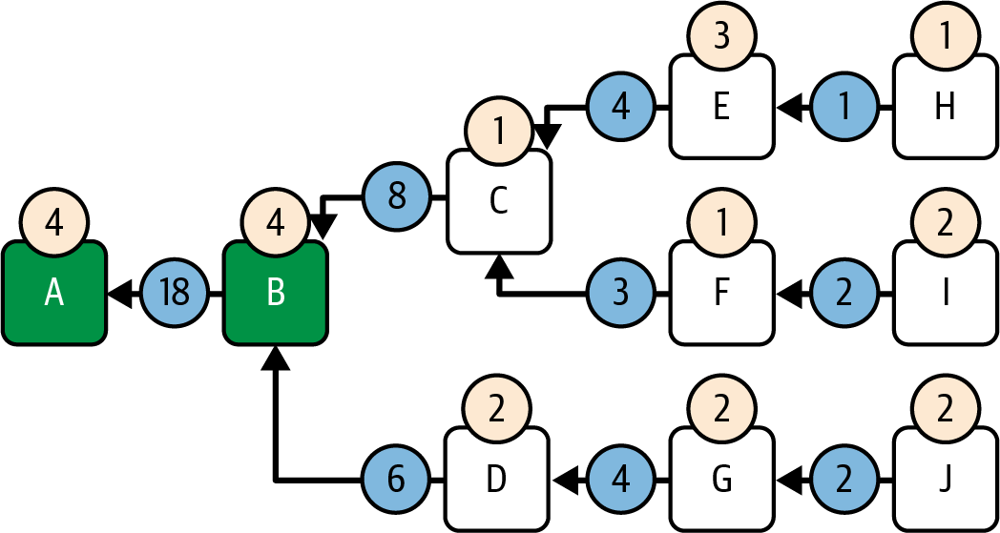

Figure 15-9. LMD-GHOST step 1

Now, there are two branches to choose from:

- Branch C→B with a score equal to 8
- Branch D→B with a score equal to 6

GHOST greedily selects branch C→B since it's the one with the highest score, as shown in Figure 15-10. Note that it doesn't matter that block D has a higher score than block C because LMD-GHOST doesn't consider the score of a single block but rather the score of the entire fork that block lives in.

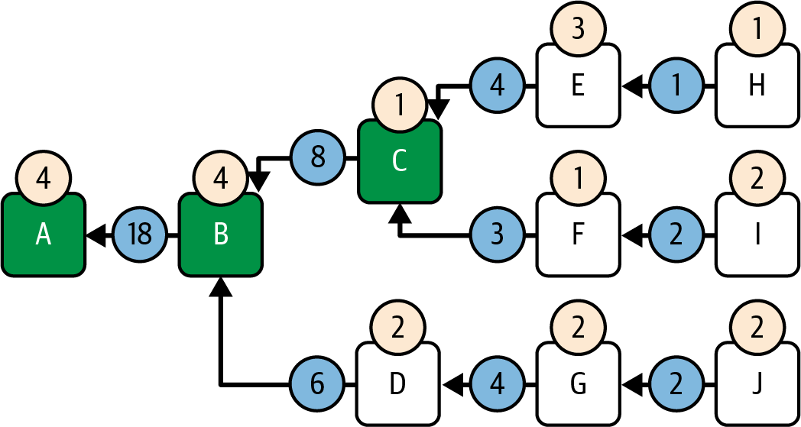

Figure 15-10. LMD-GHOST step 2

We now have two different branches to choose from:

- Branch E→C with a score equal to 4
- Branch F→C with a score equal to 3

GHOST selects branch E→C, as shown in Figure 15-11.

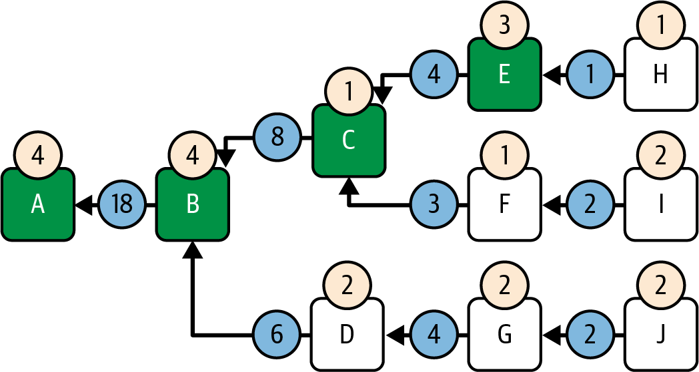

Figure 15-11. LMD-GHOST step 3

At this point, we have only one branch to choose from, branch H→E, so that's the one selected by GHOST, as shown in Figure 15-12.

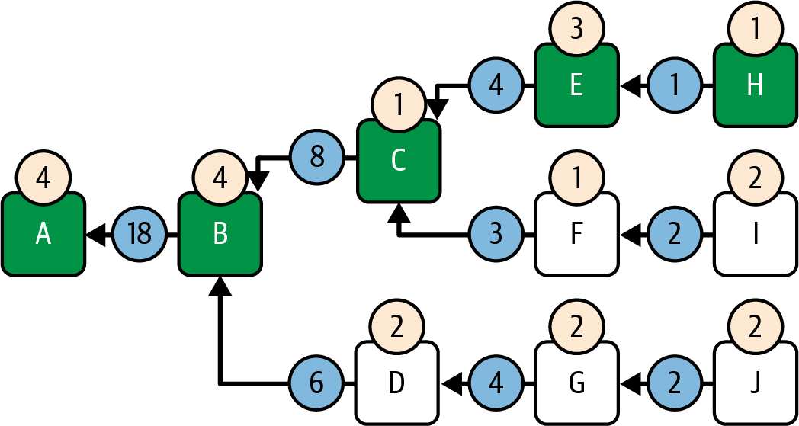

Figure 15-12. LMD-GHOST step 4

Block H has no descendants. LMD-GHOST stops and returns it as the new head block of the chain.

### Incentives

LMD-GHOST offers a variety of explicit incentives for validators who strictly follow the rules, and punishments for those who act maliciously. In this section, we'll explore how it prevents malicious actors from breaking the rules and rewards benevolent ones.

Validators need to perform two different duties:

- Proposing blocks
- Creating attestations

For each of these, LMD-GHOST includes several ways to make sure everyone behaves according to the rules.

#### Proposing blocks

When a validator is selected to propose a new block to the chain, it must create only a single valid block. By doing that, the validator earns the sum of the priority fees of all transactions included into the block they have created, plus some newly minted ETH, as you can see in Figure 15-13.

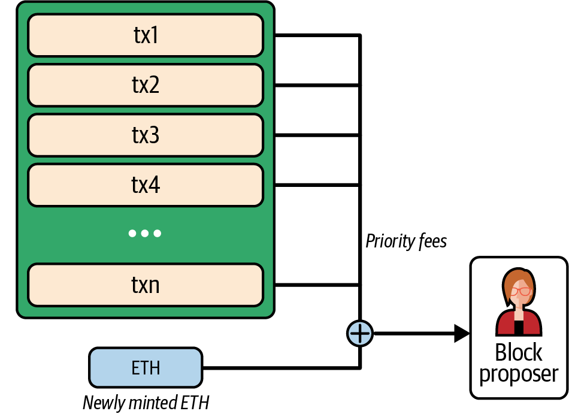

Figure 15-13. Block proposal reward

If the validator tries to cheat by creating more than one block, the protocol explicitly punishes them by slashing a proportion of their stake. In fact, to become part of the validator set, you must stake some ETH as collateral (at least 32 ETH). This stake is (also) necessary so that the protocol can punish you by slashing—that is, removing—some ETH from it, as shown in Figure 15-14.

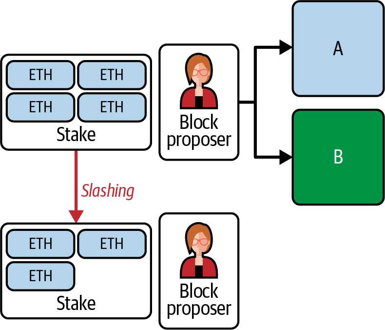

Figure 15-14. Block proposal slashing

> **Note**  
>
> It's interesting to note here that the explicit punishment is a big difference between Ethereum's PoS consensus protocol and Bitcoin's PoW. Bitcoin miners get rewarded if their block becomes part of the heaviest chain. If they create more than one block for a single block number, there's no explicit punishment.
>
> You may wonder why. It's because PoW-based systems require some work to be made to create a valid block (the PoW itself). If a miner creates more than one block, they are just wasting time and money because eventually only one block will end up in the heaviest chain, so they'll get rewarded for only one of them.
>
> Ethereum PoS protocol doesn't require validators to perform a PoW to create a valid block. That means that creating more than a single block is almost free for validators. That's why we need explicit punishment for anyone who tries to cheat in this way.

#### Creating attestations

When a validator is selected to share their view of the network in the form of an attestation, they must publish only a single, valid one. By doing that, they earn a small fee (much smaller than the one earned by the block proposer), as you can see in Figure 15-15.

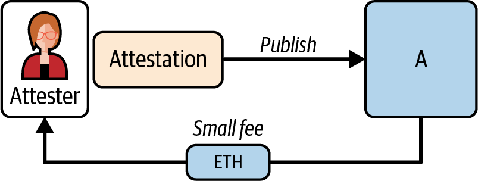

Figure 15-15. Attestation reward

If the validator tries to cheat by creating more than a single attestation or contradictory attestations, the protocol explicitly punishes them by slashing a proportion of their stake, as shown in Figure 15-16.

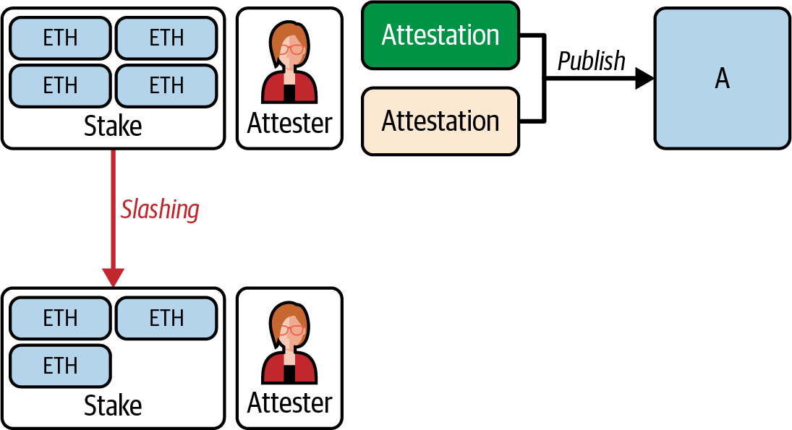

Figure 15-16. Attestation slashing

If the validator keeps behaving maliciously for quite a long time, the protocol has the power of force-ejecting them from the validator set.

## Casper FFG: The Finality Gadget

Casper FFG is a kind of metaconsensus protocol. It is an overlay that can be run on top of an underlying consensus protocol in order to add finality to it.

In Ethereum's PoS consensus, the underlying protocol is LMD-GHOST, which does not provide finality. Finality ensures that once blocks are confirmed in the chain, they cannot be reversed: they will be part of the chain forever. So in essence, Casper FFG functions as a finality gadget, and we use it to add finality to LMD-GHOST.

Casper FFG takes advantage of the fact that, in a PoS protocol, we know who our participants are: the validators who manage the staked ether. This means that we can use vote counting to judge when we have seen a majority of the votes of honest validators, or more precisely, votes from validators who manage the majority of the stake. In everything that follows, every validator's vote is weighted by the value of the stake that they manage, but for simplicity, we won't spell this out every time.

Casper FFG, like all classic Byzantine fault tolerant (BFT) protocols, can ensure finality as long as fewer than a third of validators are faulty or adversarial. Once a majority of honest validators have declared a block final, all honest validators agree, making that block irreversible. By requiring that honest validators constitute more than two thirds of the total, the system ensures that the consensus accurately represents the honest majority's view. Notably, Casper FFG distinguishes itself from traditional BFT protocols by offering economic finality (you'll find more details in "Accountable Safety and Plausible Liveness") even if more than one-third of validators are compromised.

### Epochs and Checkpoints

Casper FFG ensures consensus by requiring votes from more than two thirds of validators within an epoch, dividing voting across 32 slots to manage the large validator set efficiently, as shown in Figure 15-17. An epoch is divided into 32 slots, each of which usually contains a block. The first slot of an epoch is its *checkpoint*.

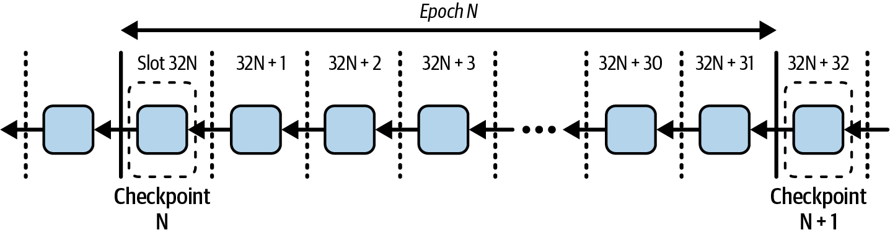

Figure 15-17. Epochs and checkpoints

Validators vote once per epoch on a checkpoint, the first slot, to maintain a unified voting focus. This process, which incorporates both Casper FFG and LMD-GHOST votes for efficiency, aims at finalizing checkpoints, in the context of Casper FFG, not entire epochs, clarifying that finality extends to the checkpoint and its preceding content.

### Justification and Finalization

Casper FFG, like traditional BFT protocols, secures network agreement in two stages. Initially, validators broadcast and gather views on a proposed checkpoint. If a significant majority agrees, the checkpoint is *justified*, signaling a tentative agreement. In the subsequent round, if validators confirm widespread support for the justified checkpoint, it achieves *finalization*, meaning it's unanimously agreed upon and irreversible. This process underlines the collaborative effort to ensure network consistency and security, aiming for checkpoints to be justified and then finalized within specific time frames and improving the reliability of the consensus mechanism.

#### Sources and targets, links and conflicts

In Casper FFG, votes comprise source and target checkpoints, representing validators' commitments to the blockchain's state at different points. These votes are cast as a linked pair, indicating a validator's current and proposed points of consensus. The source vote reflects a validator's acknowledgment of widespread support for a checkpoint, while the target vote represents a conditional commitment to a new checkpoint, dependent on similar support from others. This dual-vote system facilitates a structured progression toward finalizing blocks, ensuring network integrity and continuity.

#### Supermajority links

In Casper FFG, a *supermajority link* between source and target checkpoints, *s→t*, is established when more than two thirds of validators, by stake weight, endorse the same link, with their votes included in the blockchain. This mechanism ensures consensus and security by validating the sequence of checkpoints through widespread validator agreement.

#### Justification

In Casper FFG, when a node observes a majority of validators agreeing on a transition from one checkpoint to another, it justifies the old checkpoint. This signifies that the node has seen evidence of consensus from a significant portion of the validator set, as shown in Figure 15-18, making a commitment not to revert to a previous state unless overwhelming consensus is shown for an alternative path.

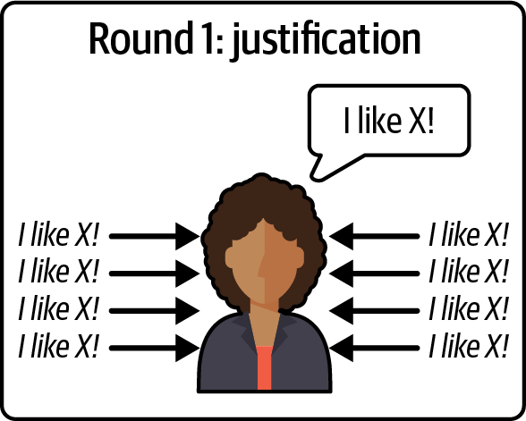

Figure 15-18. Justification process[^1]

[^1]: The node has seen a supermajority link CN → CN + 1, therefore marking CN + 1 as justified. Since CN + 1 is a direct child of CN in the checkpoint tree, it also marks CN as finalized. Finalized checkpoints are cross-hatched and marked with F.

#### Finalization

When a node observes a consensus (a supermajority link) from one justified checkpoint to its direct child, it finalizes the parent checkpoint, as shown in Figure 15-19. This indicates a network-wide commitment not to revert from this point, backed by a strong majority of validator support. Finalization ensures network stability and security by making the blockchain history immutable past that checkpoint, preventing reversals without significant consequences for validators.

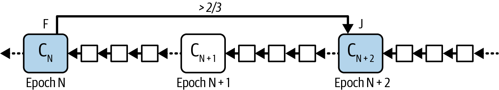

Figure 15-19. Finalization process

### Slashing

Casper FFG implements a slashing mechanism to penalize validators for breaches of protocol rules with the aim of securing network consensus. This enforcement discourages actions that could otherwise undermine the blockchain's integrity, such as finalizing conflicting checkpoints. Detection of these breaches, especially complex scenarios like surround votes (see "Fork Choice Rule"), may rely on specialized external services due to their technical challenges. Slashing consequences are proportional to the misconduct's severity and overall network health, with penalties scaling based on the collective behavior within a specific time frame, which ensures fairness and accountability in validators' actions.

### Fork Choice Rule

Casper FFG modifies the traditional LMD-GHOST fork choice rule, mandating that nodes prioritize the chain with the highest justified checkpoint; this checkpoint then effectively becomes the starting block for the LMD-GHOST protocol. This adaptation, which is an evolution from the LMD-GHOST protocol's approach, ensures that the network achieves finality by committing to checkpoints that have been agreed upon by a supermajority of validators. It effectively guarantees that once a checkpoint is justified, the network cannot revert beyond it, reinforcing the security and stability of the blockchain. This rule is also designed to maintain network liveness, aligning with Casper's foundational goals.

### The Casper Commandments

In Casper FFG, checkpoints are central to ensuring network consensus and security. They are marked by epoch numbers that increase with blockchain progression. Validators must adhere to strict voting rules: they cannot vote on different outcomes for the same checkpoint, so no double-voting, as shown in Figure 15-20. If this voting rule were not in place, a reorg would be much more likely, rendering the chain highly unstable.

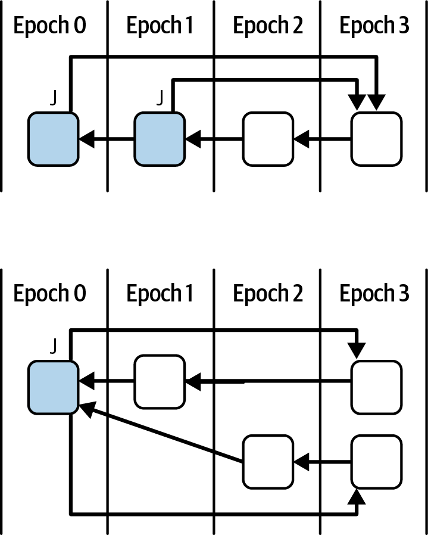

Figure 15-20. No double-voting rule

Validators must also avoid creating votes that could be interpreted as contradicting previous commitments (no surround vote). Violating these principles leads to slashing, a penalty designed to maintain the integrity and accountability of the consensus mechanism, as shown in Figure 15-21.

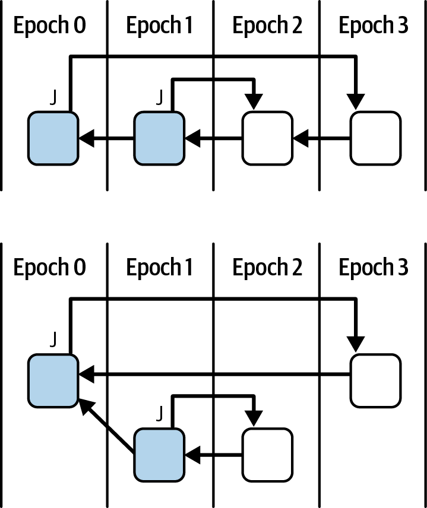

Figure 15-21. No surround vote rule

### Accountable Safety and Plausible Liveness

The Casper FFG consensus protocol makes two guarantees that are analogous to, but different from, the concepts of safety and liveness in classical consensus: *accountable safety* and *plausible liveness*.

#### Accountable safety and economic finality

Casper FFG's proof of accountable safety demonstrates that conflicting checkpoints cannot be finalized unless more than one-third of validators violate protocol rules. This system ensures that checkpoints finalized with fewer than one-third adversarial validators remain irreversible, enforcing both network security and economic penalties for dishonest behavior.

Economic finality in Casper FFG introduces a cost to potential attackers, enforcing security not just through protocol rules but also through economic disincentives. Validators who attempt to undermine the network by finalizing conflicting checkpoints face severe penalties, losing a significant portion of their stakes. This approach contrasts with traditional consensus mechanisms by adding a layer of economic consequences, ensuring that finalizing a block carries a substantial cost for malicious actors and thereby enhancing the blockchain's integrity and resilience against attacks.

#### Plausible liveness

Casper FFG ensures that the network remains active and can always reach consensus without any honest validators being penalized, embodying the concept of plausible liveness. This means that, provided a supermajority of validators are honest, the protocol can continue justifying and finalizing new checkpoints, avoiding any deadlock scenarios where progress is halted because of fear of slashing. This principle ensures the network's resilience and continuous operation, underlining Casper's adaptability to maintain consensus even under challenging conditions.

## A Practical Example: The Life Cycle of a Checkpoint

Let's take a journey together through the life cycle of a checkpoint in Ethereum's Casper FFG mechanism.

The community of Ethereum validators can be overwhelmingly large, with potentially hundreds of thousands involved. It's not practical for all these votes to be processed at once. So how do we manage this?

Votes are spread out across what we call an epoch, which is divided into 32 slots, each lasting 12 seconds. This way, each validator votes exactly once per epoch, with about 1/32 of the validator set voting in each slot. Figure 15-22 shows a pool of such validators.

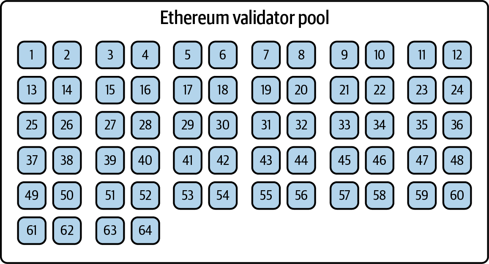

Figure 15-22. Validator pool

In this example, the number of validators is, of course, much more limited than on the real Ethereum network, but we do have 64 nodes that are divided into 32 groups. Each of the groups will vote for one slot in the epoch, as shown in Figure 15-23.

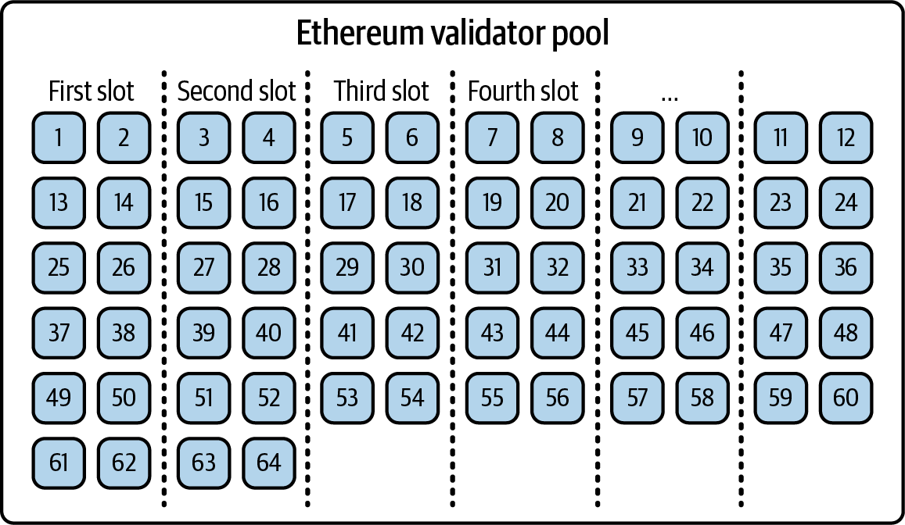

Figure 15-23. Validators divided into groups

Now, what are they voting on? They vote on a checkpoint: specifically, the very first slot of an epoch.[^2] This checkpoint acts as a common goal for validators voting at different times.

[^2]: A checkpoint is always the very first slot of an epoch, but its block hash may be from an earlier block if the checkpoint's own block is missing.

> **Note**  
>
> It's important to clarify something here: although we often talk about finalizing epochs, in technical terms we're actually finalizing checkpoints, which are these first slots. Once a checkpoint is finalized, everything up to and including that slot is set in stone, secure and unchangeable.

A representation of an epoch—in this case, epoch N—is shown in Figure 15-24. The checkpoint N is the slot 32N; once that checkpoint is finalized, slot 32N-1 and every other slot before that will be considered finalized.

Figure 15-24. Epoch representation

The process to achieve this security is rigorous and resembles traditional BFT consensus mechanisms. In the next sections, we'll describe how it works.

### First Round: Justification

Validators each broadcast their own views of the current epoch's checkpoint to the network. Then, they listen to see if a supermajority of the network agrees with their perspectives. If they do, this checkpoint is "justified." At this stage, validators believe that the majority of the network supports this checkpoint for finalization, although they are not entirely certain that everyone agrees just yet.

The key issue is that validators can't yet be sure that malicious actors on the network aren't feeding them false information about the network's state—saying one thing to them and something else to others. This is a very important point that's often overlooked. If all participants were always honest, justification would imply finalization, and the entire two-round process could be avoided.

When a validator justifies a checkpoint, they have received approval from two thirds of the network for that specific checkpoint, as shown in Figure 15-25, but this first round of approval is only local to the validator itself. It's possible, especially under adversarial conditions, that not enough validators have reached a consensus. Traditional PBFT-style consensus mechanisms—like those used in Algorand, Dfinity, and Cosmos—would halt at this stage and lose liveness. Ethereum, on the other hand, keeps going. If it can't justify a checkpoint, no problem—it simply moves on and tries to justify the next one. This works because Ethereum relies on LMD-GHOST for liveness, while Casper FFG is just an overlay—a "nice to have." So if finality stalls temporarily, that's not a critical issue.

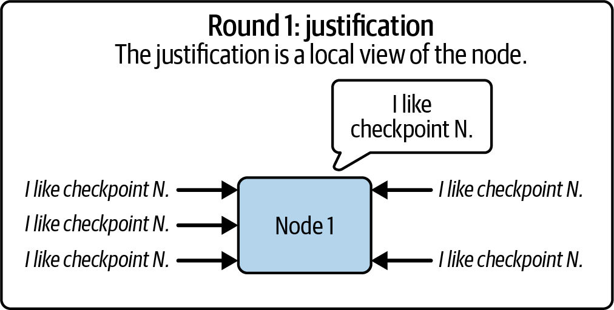

Figure 15-25. Justification round

### Second Round: Finalization

Validators announce that they have heard from a supermajority that they also support this checkpoint. They check again to see if the rest of the network confirms that this supermajority indeed exists. If so, the validators can "finalize" the checkpoint, as shown in Figure 15-26. Finalization is a powerful step—it means that no honest validator will ever revert this checkpoint. They may not have marked it as finalized in their local view yet, but at least they've marked it as justified, and it cannot be reversed without punishable actions.

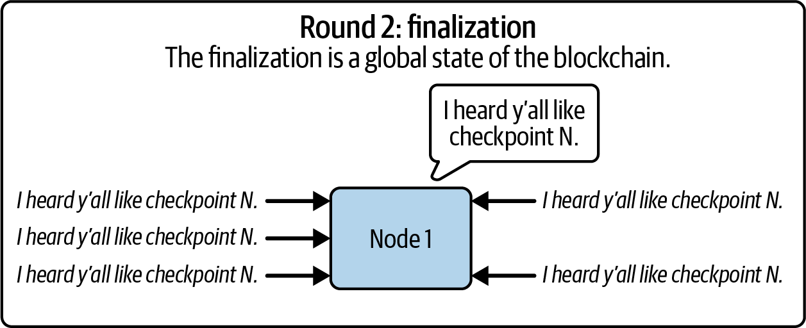

Figure 15-26. Finalization round

In practice, each round ideally spans one epoch, meaning it takes one epoch to justify a checkpoint and another to finalize it. That totals about 12.8 minutes. However, thanks to the pipelined design of Casper FFG, we can finalize a checkpoint every 6.4 minutes, once per epoch.

> **Note**  
>
> It's also worth noting that from an external viewpoint, we might see signs that a checkpoint will likely be finalized before the 12.8 minutes are up since votes are accumulated gradually as the epoch progresses, assuming there's no significant chain reorganization. However, the official in-protocol actions of justification and finalization occur only at the end of an epoch.

There are a lot of things that can go wrong during the justification and finalization of checkpoints. Let's analyze two important cases and how they are handled by this friendly finality gadget.

### Conflicting Justification

It's insightful to think about why we need both "justified" and "finalized" statuses for checkpoints. Why isn't it sufficient to immediately finalize a checkpoint once a supermajority of two thirds has voted in favor of it?

Here's the distinction: justification is about local agreement, whereas finality is about global consensus.

Justifying a checkpoint means that I, as a validator, have received confirmation from two thirds of the validators that they approve the checkpoint. This approval, however, represents only my local perspective. It's possible that other validators have different information; I can't be sure. Despite this uncertainty, as an honest validator, I commit to never reversing any checkpoint that I've justified based on my local data.

Finalizing a checkpoint, on the other hand, takes this a step further. It occurs when I've received assurances from two thirds of the validators that they, too, have heard from two thirds of their peers confirming the checkpoint's validity. This means that a supermajority of the network—not just my local view—acknowledges and commits to this checkpoint. It's this broad consensus that protects the checkpoint from being reversed globally. Therefore, a finalized checkpoint is not just locally recognized; it's globally secured.

Let's explore an extreme scenario to understand the consensus process better. Suppose we have four validators, A, B, C, and D, as shown in Figure 15-27. All of them are honest, but the network they operate in can experience indefinite delays. For the sake of this example, imagine that there's a checkpoint at every block height.

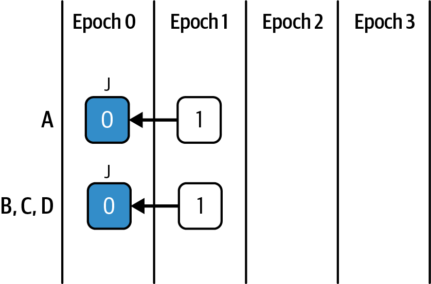

Figure 15-27. Four validators scenario

Every validator in the scenario has the block 0 and can therefore justify the checkpoint 0; so 0, the source, is justified locally for all four validators, and 1 is the target (see "Sources and targets, links and conflicts").

Now let's imagine that A is severely delayed in the network connection and that it's also chosen to propose a block. A proposes a block in epoch 2. This block contains all four votes to justify checkpoint 1, but since its network connection is severely delayed, the other validators never see it.

A has a supermajority link (see "Supermajority links") between the source 0 and the target 1, so it will finalize checkpoint 0 and justify checkpoint 1. Meanwhile, B, C, and D saw no votes in the current epoch, so they still have only justified checkpoint 0. They will also vote for an empty checkpoint in this epoch, which is checkpoint X, as shown in Figure 15-28.

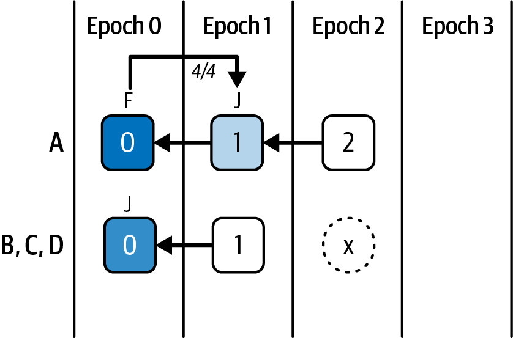

Figure 15-28. Network delay scenario step 1

In epoch 3, one validator among B, C, and D is chosen to propose a block.

This block contains three votes with the source as checkpoint 0 and the target as checkpoint X; therefore, there is a supermajority link between 0 and X that allows the validators B, C, and D to have checkpoint 0 as finalized and checkpoint X as justified, as shown in Figure 15-29. A, on the other hand, considers this block to be invalid, because in its local view, 1 is justified and cannot be reverted. The only solution for validator A's chain to continue is to delete its memory and resync with the rest of the network.

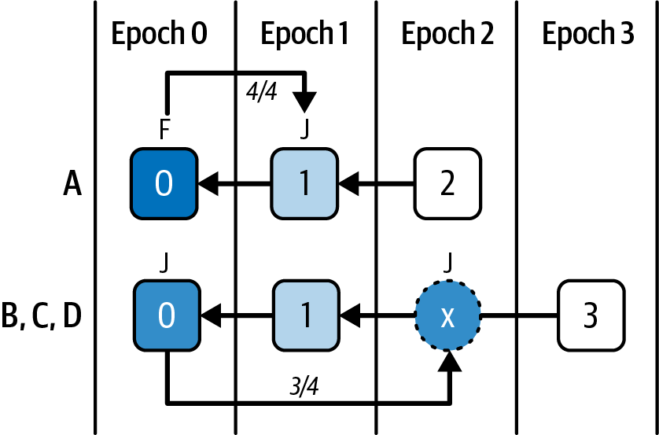

Figure 15-29. Network delay scenario step 2

> **Note**  
>
> It is important to remember that in this example, validators B, C, and D never saw the block proposed by A. Since they did not observe block 2—the block that would have justified checkpoint 1—they cannot agree on block 1 and are therefore unable to justify checkpoint 1. As a result, they vote on an empty checkpoint instead.

This example demonstrates that even simple network delays can cause nodes to have differing views of justification and finalization. However, this alone doesn't justify the need for two separate phases: justification followed by finalization. The reasoning behind the two phases is very straightforward: if we didn't have a justification step, A would have finalized checkpoint 1, which would have been considered invalid by the rest of the validators, as shown in Figure 15-30.

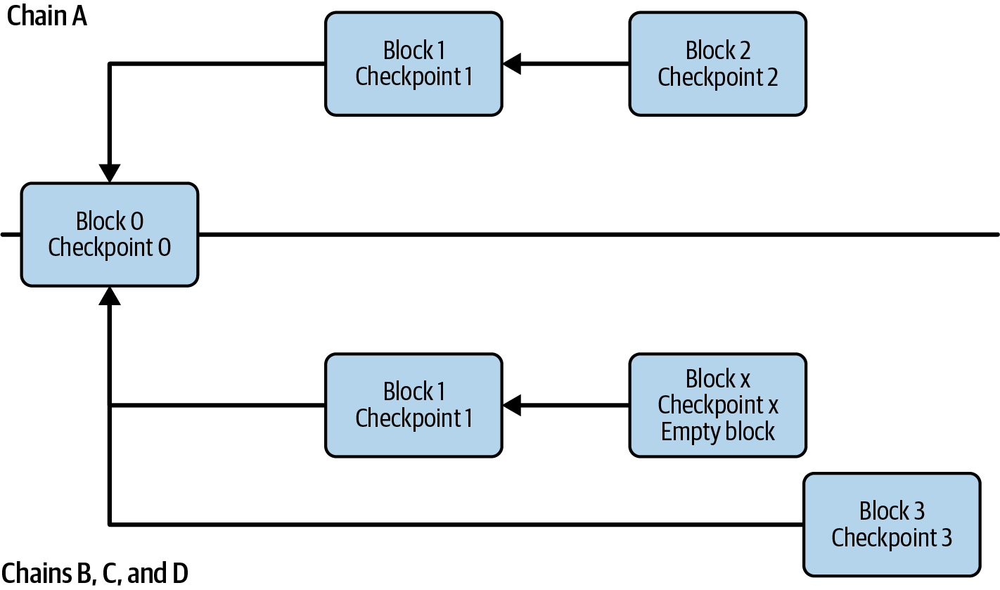

Figure 15-30. Without justification step

In the previous example, A had to delete its memory and resync with the rest of the network. This is because justification, as we said before, is similar to a local step and can be reverted. However, this would not have been possible if A had directly finalized checkpoint 1. Without the two phases, A would have had a finalized block reverted and B, C, and D would have been able to orphan block 1 without being slashed. The only way to guarantee safety is with a two-way commit: justification and finalization.

## Gasper: A Real Example

So far, we have seen how Casper FFG and LMD-GHOST work on their own. Let's see now how they are combined into Gasper and used inside the Ethereum PoS consensus protocol.

The best way to fully understand how Gasper works is to follow a real example of a blockchain using it to gain consensus over the history of blocks. We won't use Ethereum mainnet for our example. Instead, we'll create a mock-up network with three validators in order to better describe what is happening during each phase of the consensus protocol, as you will see in Figure 15-31.

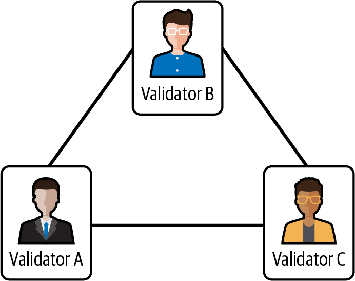

Figure 15-31. Gasper mock network

The three validators have the same number of ETH in stake, so their voting power—that is, their contribution to the score of every block in which they vote—is the same. Also, every validator publishes an attestation every block, instead of once in an epoch as in the Ethereum mainnet.

Our goal is to see the life of a block from being published to first being justified and then finalized.

In our simplified network, every epoch is made of three slots, shown in Figure 15-32.

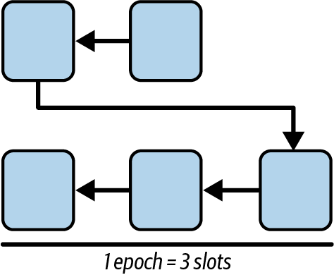

Figure 15-32. Simplified epoch structure

Let's start our example at epoch number 1. This is not the real first epoch; we just call it "epoch 1" for simplicity. Validator A is the one selected to propose the first block. We can call the block that they are to propose block 1, as shown in Figure 15-33.

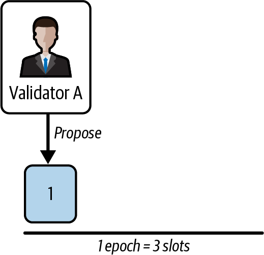

Figure 15-33. Block 1 proposal

Validator A publishes block 1, and immediately, that block starts propagating in the network. Shortly after the publication, validators B and C receive it and save it into their view of the network.

Then, all the validators make an attestation by voting what they think is the last head block of the chain. To do that, they have to run LMD-GHOST on their local views. The result is block 1. These attestations are published and shared with all validators.

Now, validator B is selected to propose the block at the next slot—slot 2—as you'll see in Figure 15-34. To do that, the validator still has to run LMD-GHOST on their local view of the network to get the last head block to build on top of.

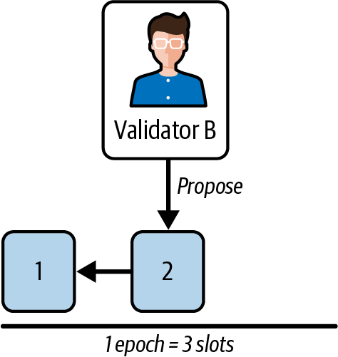

Figure 15-34. Block 2 proposal

Here is validator B's view of the network:

- Validator A attestation: head block: block 1
- Validator B attestation: head block: block 1
- Validator C attestation: head block: block 1

So the result of LMD-GHOST for validator B is block 1. They can now publish block 2 on top of block 1. Inside block 2, validator B saves also all the attestations they have seen that were not included in a previous block. So they save the three attestations that contain a vote for block 1.

Block 2 propagates in the network and, shortly after its publication, validators A and C receive it. Remember that while LMD-GHOST uses both votes shared via P2P and included in blocks, Casper FFG takes into consideration only votes included into blocks. So while including LMD-GHOST votes into the block doesn't affect LMD-GHOST results if validators are already sharing them through the P2P network, it's fundamental for Casper FFG since that's the only way validators get to know them.

Again, all validators make an attestation by voting what they think is the last head block of the chain. Since they all have block 2 in their local views, they all vote for it to be the head of the chain. Then, they publish these attestations so that all validators can see them.

Now, validator C is selected to propose the next block at slot 3. They run LMD-GHOST on top of their local view to get the head block. Here is validator C's view of the network:

- Validator A attestation: head block: block 2
- Validator B attestation: head block: block 2
- Validator C attestation: head block: block 2

The result is block 2, so validator C publishes block 3 on top of it, shown in Figure 15-35.

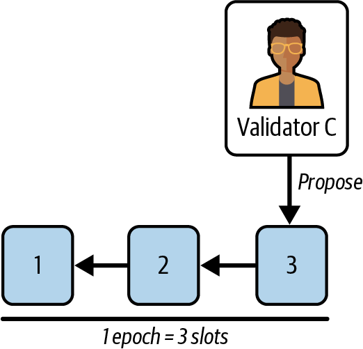

Figure 15-35. Block 3 proposal

Inside block 3, validator C saves the three attestations voting for block 2 because they were not included in previous blocks.

Block 3 propagates in the network and, shortly after its publication, validators A and B receive it. Then, the validators make an attestation voting for it.

Now, we go back to validator A. They have to propose the next block—slot 4—which is also the first block of the new epoch—epoch 2—as you'll see in Figure 15-36.

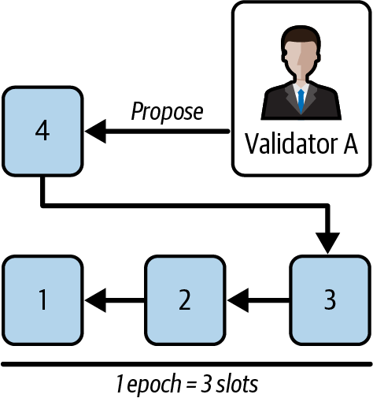

Figure 15-36. Block 4 proposal - new epoch

Validator A runs LMD-GHOST on their local view to get the head of the chain. Here is validator A's view of the network:

- Validator A attestation: head block: block 3
- Validator B attestation: head block: block 3
- Validator C attestation: head block: block 3

The result is block 3, so validator A publishes block 4 on top of it.

Inside block 4, validator A saves the three attestations voting for block 3 because they were not included in previous blocks.

Block 4 propagates in the network and, shortly after its publication, validators B and C receive it. The validators have to make a new attestation voting for it to be the head of the chain. But this time, something changes.

We are in a new epoch, so the validators have to update the Casper FFG part of the vote. In fact, we previously ignored that an attestation includes not only a vote for the last head block of the chain—the LMD-GHOST part of the consensus protocol—but also a vote for the Casper-FFG checkpoints. In particular, every attestation includes a source and a target vote. The source vote is the last justified checkpoint that the validator knows about, while the target vote represents what the validator thinks should become the next block to be justified.

So the attestation that validators A, B, and C make is as follows:

**Attestation**

- Head block: block 4
- Source block: block 1
- Target block: block 4

The target block is easy to select because it's just the first block of the epoch (there could be some edge cases where the target block is not the first one of an epoch, but we ignore them for simplicity's sake). The source block is calculated by looking at the attestations a validator has and seeing if there is a block voted to be the target block by more than two thirds of the validators. We didn't include source and target block in the previous attestations, but let's say that they all include block 1 as the target block. So right now, we have justified block 1 because there is a supermajority link from block 1 to block 4. See Figure 15-37.

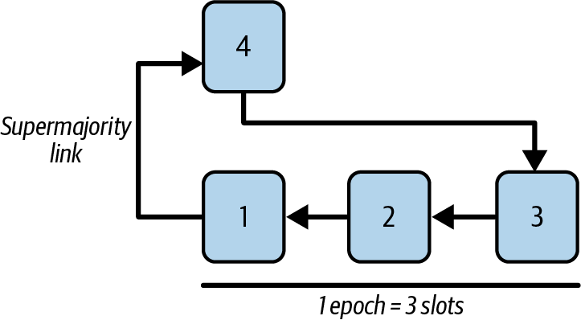

Figure 15-37. Block 1 justified

These attestations are then published and shared with all the validators and will be included in the next slots (usually in the very next slot). We can skip blocks 5 and 6 and go straight to block 7, the first block of the next epoch: epoch 3, shown in Figure 15-38.

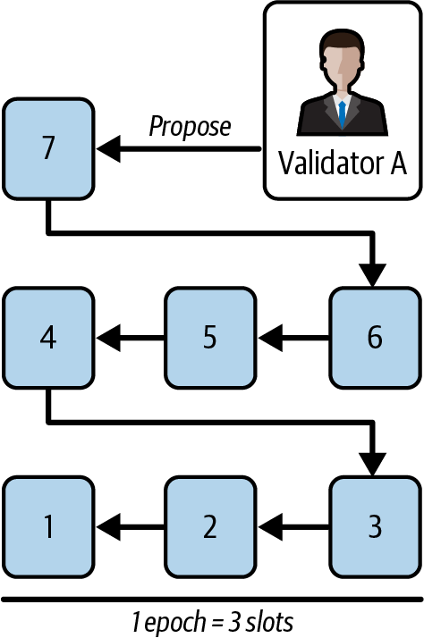

Figure 15-38. Block 7 proposal - epoch 3

Again, validator A is selected to propose the block. They run LMD-GHOST on their local view. Here is validator A's view of the network:

- Validator A attestation: head block: block 6, source block: 1, target block: 4
- Validator B attestation: head block: block 6, source block: 1, target block: 4
- Validator C attestation: head block: block 6, source block: 1, target block: 4

The result is block 6, so they publish block 7 on top of it.

Block 7 propagates in the network and, shortly after its publication, validators B and C receive it. The validators have to make a new attestation voting for it to be the head of the chain. And something changes again here.

We are in the next epoch—epoch 3—so the Casper-FFG part of the attestation changes again. In fact, the attestation that validators A, B, and C make is like this:

**Attestation**

- Head block: block 7
- Source block: block 4
- Target block: block 7

As you can see, the target block is now block 7, and the source block is block 4. This is true because validators A, B, and C all voted for a target block equal to block 4 in the previous attestation. We have now justified block 4 because we have a new supermajority link from block 4 to block 7, as shown in Figure 15-39.

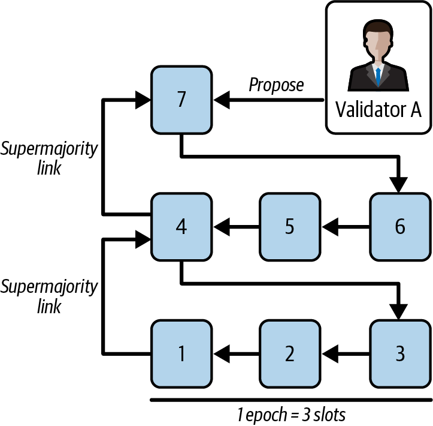

Figure 15-39. Block 4 justified, block 1 finalized

We have also finalized block 1 because it's a justified checkpoint whose direct child—block 4—is also justified. When a validator considers a block to be finalized, that means the validator has seen a confirmation from more than two thirds of the validators that they all have seen that that block is justified. In fact, if we take validator A—this applies to validators B and C, too—they have seen B and C's attestations where they voted for block 1 as the source block. Voting for block 1 as the source block means that B and C previously had seen a two-thirds majority of votes for block 1 as the target block. So we can be sure that, in order to revert block 1, at least one third of the validators must be slashed because they double-voted.

## Controversy and Competition

At this point, you might be wondering why we need so many different consensus algorithms. Which one works better? The answer to this question is at the center of the most exciting area of research in distributed systems during the past decade. It all boils down to what you consider "better"—which, in the context of computer science, is about assumptions, goals, and the unavoidable trade-offs.

It is likely that no algorithm can optimize across all dimensions of the problem of decentralized consensus. When someone suggests that one consensus algorithm is "better" than the others, you should start asking questions that clarify, better at what: immutability? Finality? Decentralization? Cost? There is no clear answer, at least not yet. Furthermore, the design of consensus algorithms is at the center of a multibillion-dollar industry and generates enormous controversy and heated arguments. In the end, there might not be a "correct" answer, just as there might be different answers for different applications.

The entire blockchain industry is one giant experiment where these questions will be tested under adversarial conditions, with enormous monetary value at stake. In the end, history will answer the controversy.

The controversies in a consensus protocol can be many, and coordinating the network to solve them is challenging. Aligning incentives is crucial but not always possible. We will examine two current problems of the Ethereum consensus algorithm.

### Timing Games

In Ethereum's protocol, time is structured into 12-second units called slots. Each slot assigns a validator the role of proposing a block right at the start (*t* = 0). A committee of attesters is then tasked with validating this block, aiming to do so by four seconds into the slot (*t* = 4), which is considered the attestation deadline.

*Timing games* are strategies where validators wait as long as possible before proposing a block to maximize their MEV rewards, as shown in Figure 15-40. This practice involves a delicate balance, requiring validators to delay their proposals to capture more value while ensuring that their block is supported by a sufficient portion of the attesting committee to remain on the canonical chain.

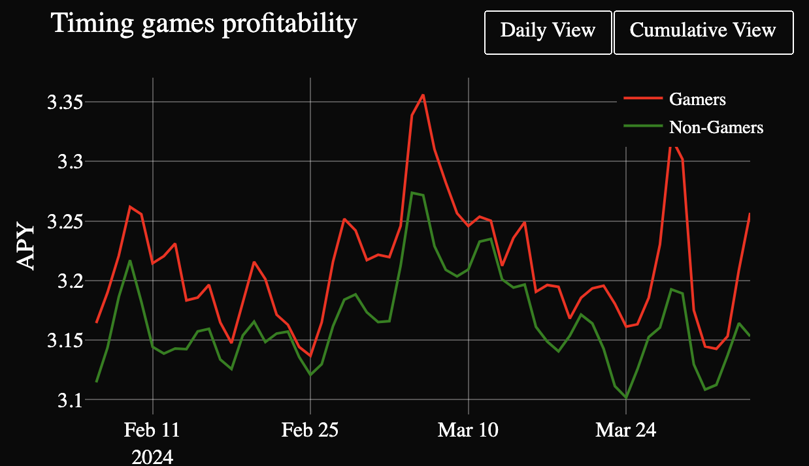

Figure 15-40. Timing game strategy

Timing games in Ethereum create a competitive landscape where gains from MEV for one validator may lead to disadvantages for others. This competition can disrupt consensus by increasing the number of missed slots and potential block reorganizations. Additionally, it motivates attesters to postpone their validations, adding layers of complexity to the process.

"Principles of Consensus" points out the importance of liveness for Ethereum's consensus process. However, timing games pose a threat to this critical feature by compromising the network's reliability.

What's a timing game? It's like waiting for the perfect moment to make a move, aiming to get the most out of it. This is what some of the people keeping the network up and running are trying to do. They're waiting for the right time to act to get the most rewards. But this waiting game can be risky. If their internet is slow or they're not too experienced, they may miss their chance to do their part. And missing too many chances could make the network less dependable.

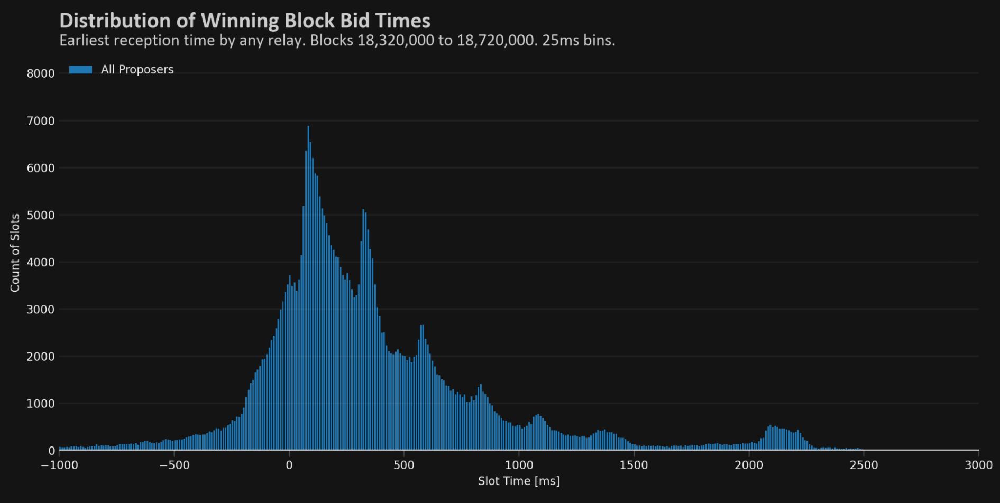

Figure 15-41. Timing game risk visualization

Right now, this isn't a big problem. Most of the entries working as validators aren't really getting into these timing games or aren't playing them at all, as shown in Figure 15-41.

> **Note**  
>
> Since we wrote this chapter in 2024, things have changed a bit. Right now, a solution has been added in the [Dencun hard fork](https://oreil.ly/TXJYS) called "proposer boost" that does punish late block proposers. The proposer boost adds weight to the attestations of the block proposer in the slot where the block is proposed.

### Centralization of Supermajority

The concept of supermajority client risk in Ethereum is all about balancing the network's health and security. Ethereum decided to use multiple clients to prevent any single point of failure. This is because all software, including these clients, can have bugs. The real trouble starts when there's a consensus bug, which could lead to something serious, such as creating infinite ether out of thin air. If just one client ran the whole show and it got hit by such a bug, fixing it would be a nightmare. The network could keep running with the bug active long enough for an attacker to cause irreversible damage.

Let's analyze a quick example of what could happen if a majority client had a bug. Note that every block in Figure 15-42 is a checkpoint and not a block in the blockchain.

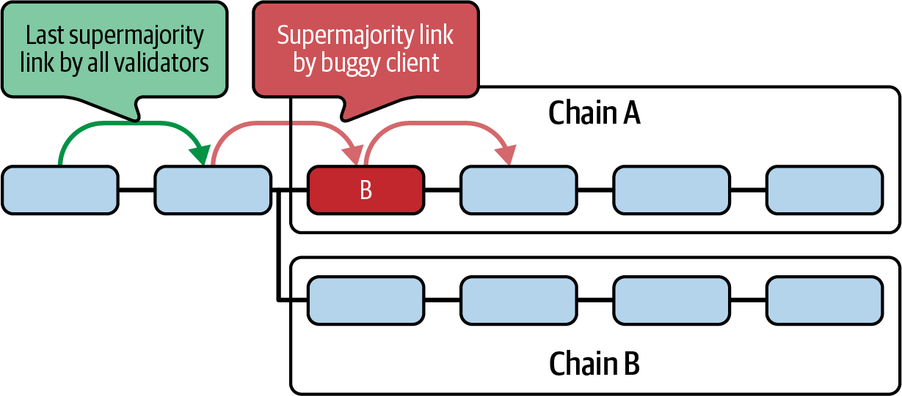

Figure 15-42. Majority client bug scenario

Functional clients disregard the epoch containing the invalid block (labeled "B"). The arrow pointing to block B serves to justify the invalid epoch, while the one coming from it finalizes it.

Assuming the bug is resolved and the validators who finalized the invalid epoch wish to switch back to the correct chain B, a preliminary action required is the justification of epoch X, as shown in Figure 15-43.

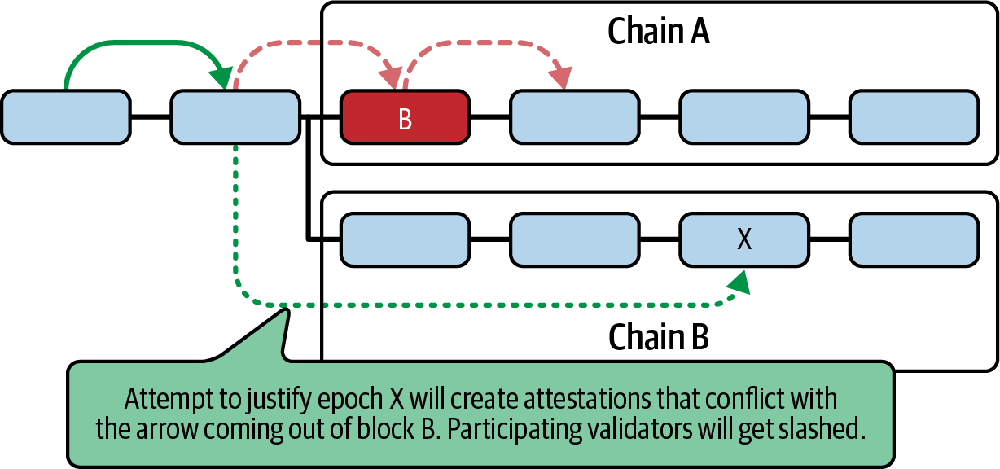

Figure 15-43. Recovery from bug requires justification

To engage in the justification of epoch X, requiring a supermajority link as shown by the dashed arrow, validators must bypass the arrow coming out of block B, which represents the finalization of the invalid epoch. Casting votes for both links could lead to penalties for these validators.

The multiclient approach offers a safety net. If a bug pops up in a client that less than half the network uses, the rest of the network, running other clients, simply ignores the buggy block. This keeps the network on track, minimizing disruption. But if a majority client—especially one used by more than two thirds of validators—introduces a bug, that could wrongly finalize the chain, leading to a potential split.

Ethereum encourages diversifying clients because if everyone used the same client and it failed, the whole network would be at risk. The penalties for running a client that goes against the grain are there to discourage putting all our eggs in one basket. This way, if a client does have a bug, the damage is contained, affecting fewer users. If a minority client causes trouble, it's less of an issue because the majority can correct the path and continue finalizing the chain.

The more we spread out our choices across different clients, the safer Ethereum becomes. It's not just about avoiding technical failures; it's about safeguarding Ethereum's future against any single point of failure. This diversity is our best defense against network-wide crises, ensuring that Ethereum remains robust and resilient no matter what comes its way.

When we first wrote this chapter, the percentage of usage for Geth was 63%, which was a problem, as we explained previously. Right now the situation is more healthy, but it will still need to improve in the future; as of now, 41% of the execution clients are using Geth and 38% are using Nethermind, as shown in Figure 15-44.

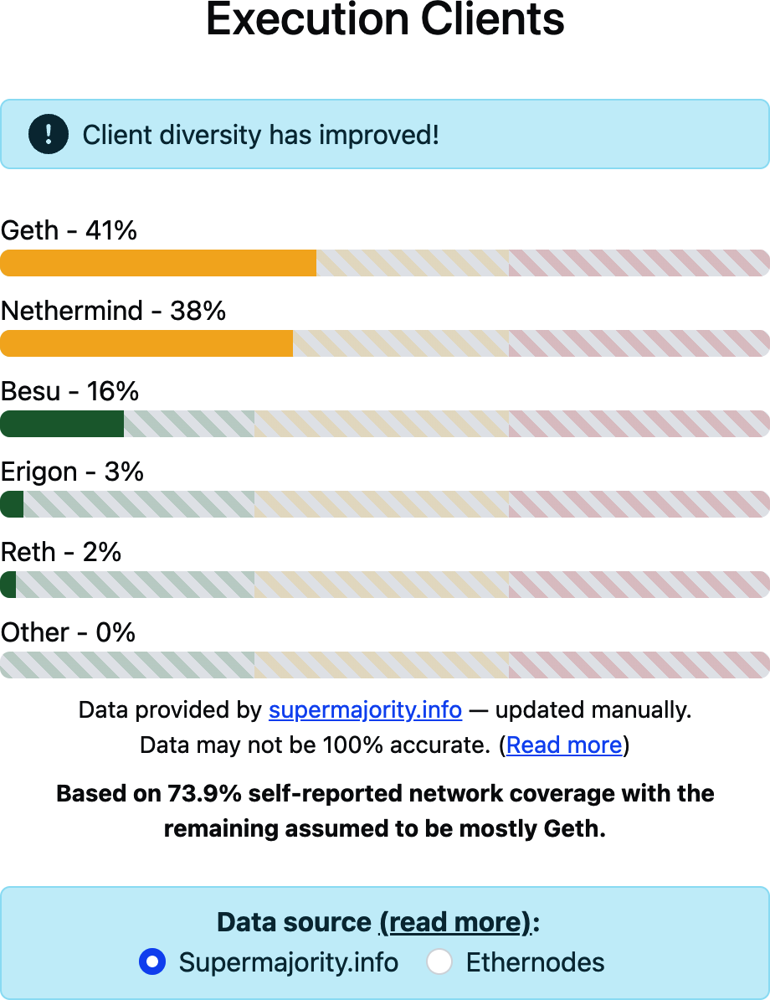

Figure 15-44. Current execution client distribution

This issue affects not only execution clients but also consensus clients, although the problem on the consensus side was quickly addressed, and the situation is now relatively healthy and stable, as shown in Figure 15-45.

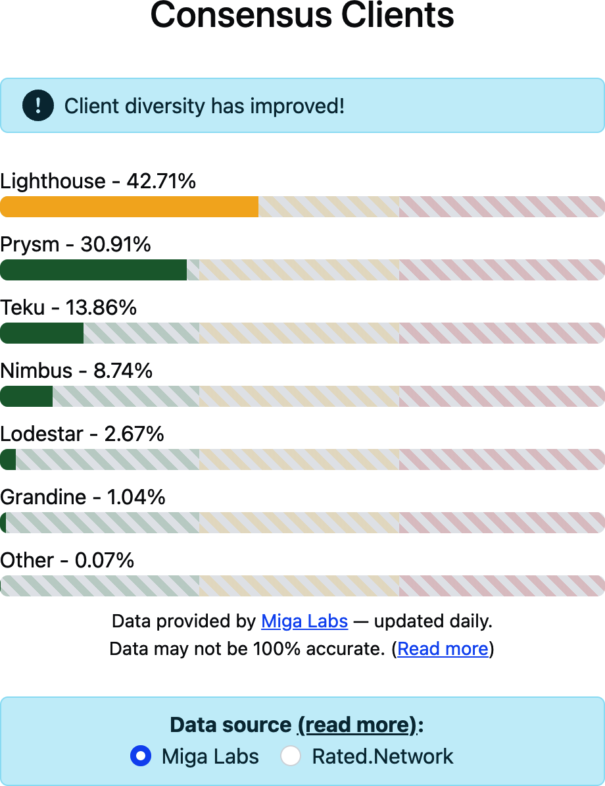

Figure 15-45. Current consensus client distribution

## Conclusion

The consensus algorithm is one of the most complicated (and delicate) things in Ethereum. It represents a never-ending journey of innovation and improvement, with ongoing proposals to enhance its functionality and efficiency. Features such as single-slot finality and the ability to increase the max effective balance for validators illustrate the continuous efforts to refine and optimize the system.

Understanding the core principles of consensus provides a solid foundation for appreciating these advancements and their impact on the robustness and scalability of the Ethereum network. As Ethereum evolves, so too will its consensus mechanisms, driving forward the capabilities of this pioneering blockchain technology.

For further reading, we recommend:

- [Gasper paper](https://oreil.ly/1BoMt)
- [Upgrading Ethereum](https://oreil.ly/Jzh-9) by Ben Edgington
- ["Decentralization Is Good or Not? Defending Consensus in Ethereum 2.0"](https://oreil.ly/VNC1Q)
