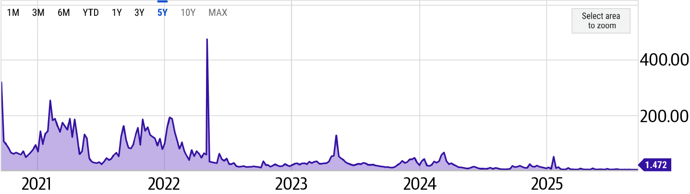
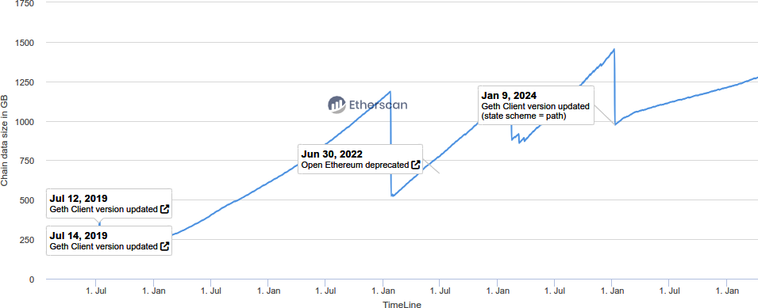
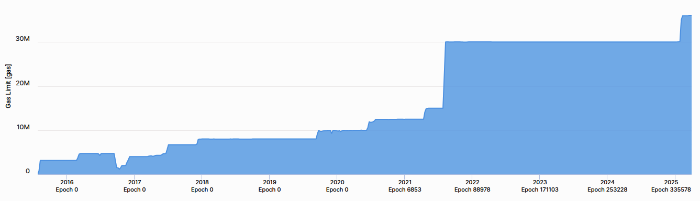
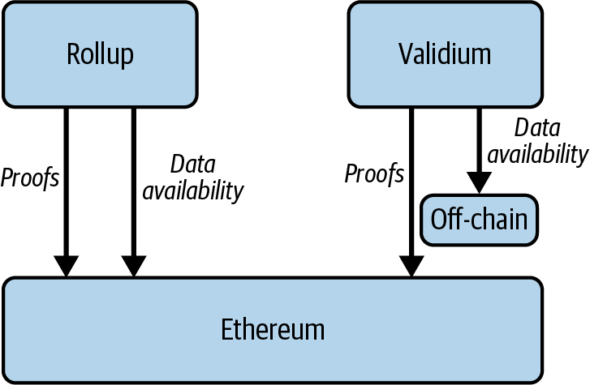
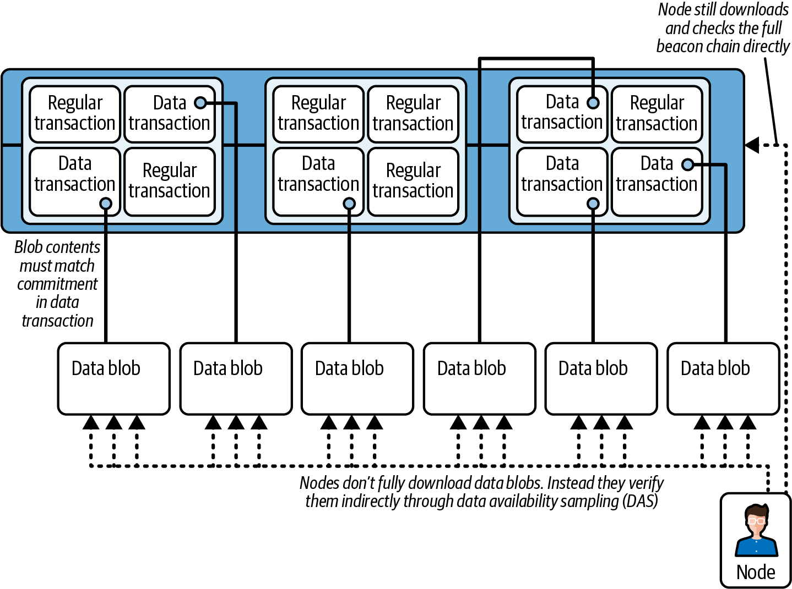
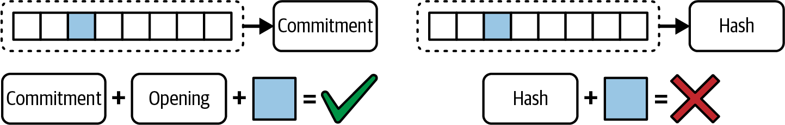
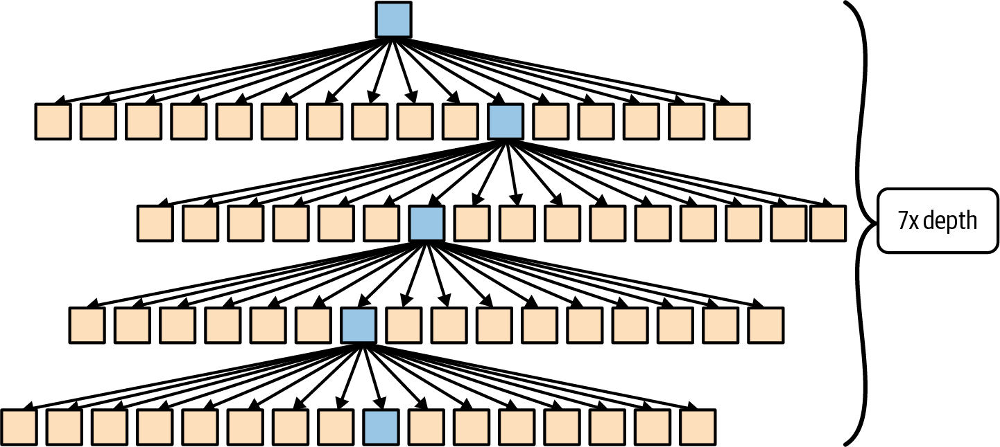
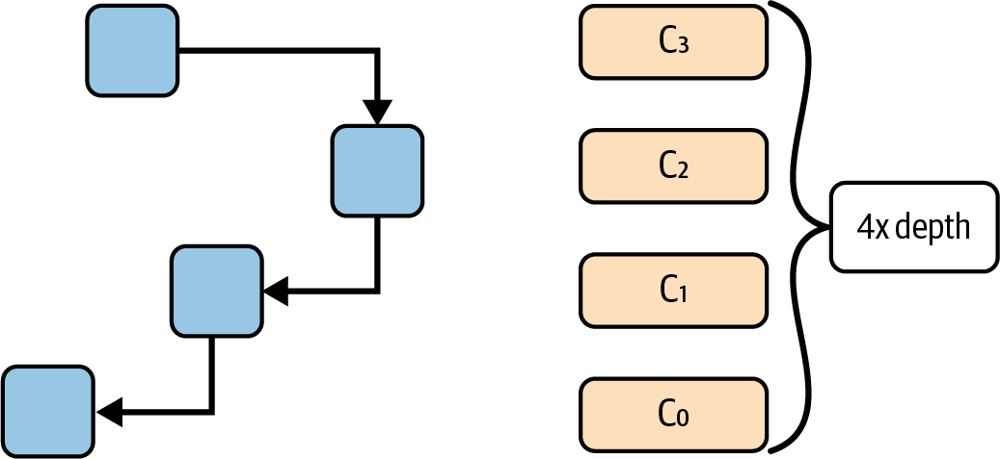
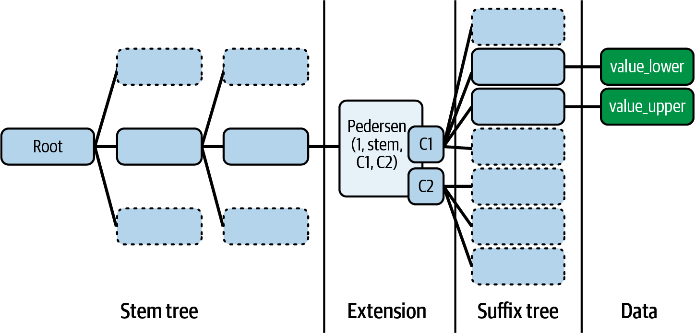

# Chapter 16. Scaling Ethereum

Ethereum is one of the most powerful and widely used blockchain platforms, but as we've seen time and again, success comes with growing pains. Ethereum has become so popular that its base layer is having trouble keeping up, gas fees often get so high that transactions become too expensive, and the system is becoming weighed down by all the data it has to handle. While Ethereum developers have been rolling out upgrades like EIP-1559 (described in Chapter 6), The Merge (the 2022 hard fork that changed the consensus protocol from PoW to PoS), and EIP-4844 (proto-danksharding, described later in this chapter), the fundamental constraints of L1 remain a bottleneck for mass adoption. These improvements help, but they don't eliminate the need for additional scaling solutions like L2 rollups.

> **Note**  
>
> L2 rollups are scaling solutions that process transactions off chain and then post a summary (such as a proof or data batch) to Ethereum's Layer 1. This reduces congestion and fees while still relying on Ethereum for security. There are two main types: optimistic rollups (assume valid, challenge if wrong) and zero-knowledge rollups (prove correctness with cryptography). Ethereum essentially becomes a settlement layer, meaning its main role shifts toward verifying proofs, ensuring data availability, and providing ultimate security guarantees for L2 transactions. We will explore rollups in detail in the second part of this chapter.

## The Problems of Ethereum's Layer 1

To fully understand Ethereum's scaling challenges, we need to break things down into four major issues: the scalability trilemma, gas costs and network congestion, state growth and storage, and block propagation and MEV. These issues aren't unique to Ethereum—other chains run into the same problems in different forms—but Ethereum's popularity amplifies them. Let's dig into each.

### The Scalability Trilemma

Ethereum, like any permissionless blockchain, has three fundamental goals: *decentralization*, *security*, and *scalability*. But here's the problem: improving one of these often means compromising another. This is what Vitalik Buterin calls the *scalability trilemma*.

Let's break it down:

**Decentralization**

Decentralization is what makes Ethereum censorship resistant and trustless. Anyone can run a node, validate transactions, and participate in the network without needing permission from a central authority.

**Security**

Security ensures that Ethereum remains resilient against attacks. Transactions must be irreversible, smart contracts must be immutable, and bad actors should have no easy way to manipulate the system.

**Scalability**

Scalability is what allows the network to handle thousands or even millions of transactions per second (TPS), making it practical for global adoption.

The challenge is that traditional blockchains like Ethereum are designed to be fully decentralized and secure at the cost of scalability. Every transaction is processed by all nodes, ensuring correctness but also creating a bottleneck.

Why can't we just increase throughput? If we try to speed things up by making blocks larger (so they can hold more transactions), fewer people will be able to run full nodes because the hardware requirements will become too demanding. This could push Ethereum toward centralization, where only a handful of powerful entities control the network—exactly what we're trying to avoid.

Other blockchains, like Solana, have taken a different approach. They've optimized for speed and scalability but at the cost of decentralization, requiring more powerful hardware to run a node. Ethereum has refused to compromise on decentralization, making the challenge of scaling all the more difficult.

PoS, introduced with The Merge, replaced the energy-intensive PoW system. This not only cut Ethereum's energy use dramatically but also reduced the dominance of big players who could afford massive mining setups. While staking introduces new centralization risks, it's still a step toward a more accessible and efficient network. However, PoS brings new challenges, such as the centralization risk posed by large staking pools. Liquid staking solutions help keep staked ETH accessible, but they also concentrate control in the hands of a few platforms. Finding the right balance remains a work in progress.

### Gas Costs and Network Congestion

One of the most frustrating experiences for Ethereum users is high gas fees, with transaction costs that fluctuate wildly depending on network demand. How does this happen, and why do fees get so expensive during peak times?

Ethereum transactions require *gas*, a unit that measures the computational effort needed to execute operations like transfers or smart contract interactions. The more complex the operation, the more gas it requires. Every block has a limited amount of gas it can include, meaning there's competition for block space. When demand is high, users bid against one another, driving fees up.

We've seen this play out in dramatic ways:

**CryptoKitties craze (2017)**

This was the first real test of Ethereum's limits. A simple game where users could breed and trade digital cats clogged the network so badly that transaction times slowed to a crawl and gas fees soared.

**DeFi Summer (2020)**

The explosion of DeFi apps like Uniswap and Compound brought massive activity to Ethereum. Traders rushed to make transactions, sometimes paying hundreds of dollars in gas fees to get priority in the mempool.

**NFT boom (2021)**

NFT drops became gas wars, with people paying thousands just to mint a new digital collectible before someone else did. Some transactions failed despite users spending exorbitant amounts on gas.

Ethereum's Layer 1 wasn't designed to handle this level of demand efficiently. However, the introduction of EIP-1559 in 2021 changed how fees work by introducing variable block sizes and a new gas-pricing mechanism, which reduced spikes in gas fees during periods of high network activity. The rising popularity of L2 solutions has allowed Ethereum to offload a significant portion of its computational burden, further reducing gas fees. More recently, EIP-4844 (proto-danksharding) was rolled out, significantly lowering fees, especially for L2 rollups, and making Ethereum transactions more affordable for users. Despite these improvements, Ethereum's transaction costs remain higher than those of most other blockchains (see Figure 16-1).

Figure 16-1. Gas cost comparison across blockchains

### State Growth and Storage Issues

Ethereum isn't just used for transactions; it's a *global state machine* that continuously tracks account balances, smart contract data, DeFi positions, NFTs, and other on-chain activity. Unlike traditional databases, which can archive or delete old records, Ethereum is designed to retain its full history, ensuring transparency and verifiability. The problem? As Ethereum grows, it needs to store more data, and that storage burden keeps getting heavier.

Right now, the size of Ethereum's state—essentially, the set of all active accounts, contract balances, and storage slots—is growing at an alarming rate. Every new smart contract adds to this state, and every transaction modifies it. Full nodes, which play a crucial role in verifying the network's integrity, must store and constantly update this data. As the state grows, it becomes increasingly difficult for individuals to run full nodes without expensive hardware, leading to concerns about decentralization.

Archival nodes face an even bigger challenge. These nodes store not only the current state but also the entire historical record of Ethereum, including every past transaction and contract execution. The sheer volume of this data reaches into the terabytes, requiring significant storage capacity and bandwidth. The number of people capable of running these nodes is shrinking, raising questions about who will preserve Ethereum's long-term history.

Validators, who are responsible for proposing and attesting to blocks in Ethereum's PoS system, also feel the weight of state growth. To verify transactions efficiently, they need quick access to the latest blockchain state. But as the state expands, accessing and processing this information becomes slower and more expensive. If this trend continues unchecked, we risk creating an environment where only those with high-end hardware can participate in validation, pushing Ethereum toward centralization.

Ethereum developers have explored solutions to curb state bloat, including history expiry and state rent, which we will discuss in detail later in this chapter in "Scaling the L1".

Client diversity also helps. While Geth has historically been the dominant Ethereum client (see Figure 16-2), alternatives like Nethermind, Erigon, and Besu introduce optimizations that improve storage efficiency. Erigon, for example, specializes in handling historical data more efficiently, reducing the burden on full nodes.

Figure 16-2. Ethereum client distribution

### Block Propagation and MEV

Even if Ethereum could handle a higher transaction throughput, there's another fundamental bottleneck: the time it takes for new blocks to propagate across the network. The moment a validator produces a new block, that block must be broadcast to thousands of other nodes worldwide. The larger the block, the longer it takes to propagate. And the longer it takes, the higher the chance of network disagreements, or even temporary forks, where different parts of the network momentarily diverge.

PoS has helped reduce these risks, but block-propagation delays still affect performance. Client teams have been working on network optimizations to speed things up, but it's a challenge we'll continue to refine as we scale Ethereum.

There's another issue that lurks beneath the surface: MEV. Even though Ethereum has transitioned to PoS, the name "miner extractable value" has stuck. Today, it's more accurate to call it *maximal extractable value*, meaning the profit that validators and searchers can make by strategically reordering, including, or excluding transactions in a block.

MEV arises because transactions don't always get processed in the order they're submitted. Instead, validators can prioritize transactions based on their own profit motives. This creates opportunities for sophisticated actors to extract value in ways that disadvantage regular users. High-frequency trading bots scan the mempool (Ethereum's waiting room for transactions yet to be included in a block), searching for profitable opportunities. For example, if someone submits a large trade on a decentralized exchange like Uniswap, bots can jump ahead of them, buying the asset first and selling it back at a higher price. This is known as a *sandwich attack*, which is a form of front-running, and it's one of the most notorious forms of MEV.

A mitigation that has been running for years is MEV-Boost, a protocol developed by Flashbots that makes MEV more democratic and transparent. However, the long-term fix is a more fundamental redesign: a native implementation of *proposer-builder separation* (PBS). We'll explore these solutions in more detail in the following section.

> **Note**  
>
> MEV is largely absent from most L2 chains because they typically rely on centralized transaction sequencers. A single centralized sequencer usually processes transactions in the exact order they're received, eliminating opportunities for transaction reordering or front-running. While this centralized approach significantly reduces MEV, it does introduce potential trade-offs related to decentralization and censorship resistance. Future L2 developments aim to balance these trade-offs by introducing decentralized sequencing mechanisms.

## Solutions

What's being done to overcome Ethereum's scaling challenges? While there's no single, simple fix, developers are actively working on various improvements to make the network faster, cheaper, and better equipped for mass adoption. Let's take a closer look at the main strategies they're exploring.

### Scaling the L1

Scaling Ethereum's base layer, Layer 1, is one of the hardest challenges we've faced since day one. The reality is that no single fix will solve everything; scaling isn't a binary switch we can flip. Instead, it's a long-term process: a combination of optimizations that gradually make Ethereum more efficient without sacrificing decentralization or security. While L2 rollups are our best bet for handling the majority of transactions, improving Ethereum's base layer is still important. If we can increase throughput and efficiency at L1, rollups become even more powerful, gas fees drop, and Ethereum stays competitive without resorting to centralization. Let's walk through some of the core ways we're improving Ethereum's base layer.

#### Raising the gas limit

Ethereum's blocks aren't constrained by the number of transactions they can hold but by how much gas can fit inside each block. This is the *gas limit*. We can think of it like a budget. Every transaction consumes gas based on its complexity, and the available gas in a block is defined by the EIP-1559 mechanics. Raising the gas limit means we can fit more transactions in each block, effectively increasing Ethereum's throughput.

But it's not as simple as just cranking up the gas limit. Bigger blocks take longer to propagate across the network, making Ethereum more susceptible to chain splits. They also increase hardware requirements for full nodes, pushing us closer to centralization. So increases in gas limit happen gradually and carefully, balancing throughput improvements with network health (see Figure 16-3).

Figure 16-3. Historical gas limit changes

#### The future of parallel execution in Ethereum

Ethereum processes transactions sequentially because of its shared-state model. This ensures security and consistency but limits scalability since transactions cannot be executed in parallel. In contrast, some newer blockchains like Solana and Aptos have adopted parallel execution, but they rely on more centralized architectures and require validators to use high-performance hardware.

The challenge in Ethereum is that transactions often interact with the same state—for example, two DeFi trades modifying the same liquidity pool. Reordering them without a robust dependency-management system could break smart contract logic. Another complexity is that full nodes must verify all transactions, and introducing parallel execution would require careful synchronization across threads.

Ethereum researchers are actively exploring solutions to introduce partial parallel execution while maintaining decentralization. One approach is *stateless execution*, which reduces the reliance on full node storage, making transaction processing more efficient. Another is *optimistic concurrency*, where transactions are assumed to be independent and are rolled back only if conflicts arise. We'll explain these concepts in detail in the second part of this chapter.

Several experimental implementations of parallel EVM have emerged in EVM-compatible chains, including Monad, Polygon PoS, and Shardeum. Monad, for instance, implements an optimistic parallel execution model that achieves more than 10,000 TPS. Polygon PoS has achieved a 1.6x gas throughput increase with its Block-STM approach, allowing for partial parallelization of transactions. These advancements provide valuable insights, but Ethereum must implement parallelization while preserving decentralization, a balance that remains a key challenge. Recent studies suggest that about 64.85% of Ethereum transactions could be parallelized, highlighting significant potential for performance improvements. However, as of March 2025, there is no concrete plan for integrating parallel execution into Ethereum's mainnet. Discussions around parallelizing EVM through end-of-the-block virtual transactions are ongoing, but the complexity of Ethereum's execution model makes implementation challenging. The roadmap for Ethereum's scalability includes continued research into transaction-dependency resolution, alternative execution models, and gradual improvements to EVM efficiency.

#### State growth and expiry

Ethereum's state, comprising the collection of all account balances, smart contract storage, and other on-chain data, just keeps growing. Every new contract adds more data, and once something is written to Ethereum's state, it stays there forever. This is great for decentralization and verifiability but terrible for scalability. Full nodes must store and process all this data, and as the state gets larger, the cost of running a node increases.

Right now, the Ethereum state size is around 1.2 TB for full nodes, but archival nodes, which store the entire historical state and transaction data, need upward of 21 TB of storage. This massive data footprint makes it increasingly difficult for individuals to run archival nodes, concentrating this role in the hands of a few well-funded entities. It's worth mentioning that Erigon and Reth execution clients are optimized to require less storage, as both need around 2 TB for an archive node.

There's often confusion between state expiry and history expiry, but they address different problems. *State expiry* aims to reduce the size of Ethereum's actively maintained state by requiring smart contracts to periodically pay rent for the storage they consume. If a contract doesn't pay, it becomes inaccessible until someone explicitly pays to revive it. This would significantly slow state growth and make it easier for full nodes to operate.

*History expiry*, on the other hand, deals with the sheer size of past transaction data. Instead of forcing every node to store all historical transactions, Ethereum could prune older data, offloading it to external storage solutions. This wouldn't affect the live state but would make historical queries more reliant on third-party data providers. Both approaches have trade-offs, and research is ongoing to determine the best balance between efficiency and accessibility.

To explore this topic further, we recommend looking into EIP-4444, which covers history expiry. As for state expiry, it's still in the research phase, so there's no clear strategy yet, but you can find more information in the Ethereum roadmap.

#### Proposer-builder separation

MEV has been a persistent issue in Ethereum, even after the transition to PoS. Validators and specialized searchers engage in transaction reordering, front-running, and other strategies to extract profit at the expense of regular users. This isn't just an economic problem; it also affects network health, increasing congestion and making gas fees unpredictable.

PBS is one of the most promising solutions for mitigating MEV. Right now, validators both propose and build blocks, meaning they have full control over transaction ordering. PBS changes this by splitting these roles: validators still propose blocks, but the actual block construction is outsourced to specialized builders through a competitive auction. This removes the direct incentive for validators to engage in MEV extraction and makes transaction inclusion more transparent.

PBS has already been tested in the form of MEV-Boost, which allows validators to outsource block construction to the highest bidder. However, it's important to understand that MEV-Boost and PBS won't eliminate MEV; they will just make it more transparent and fairer. MEV will still exist because the underlying incentives that drive arbitrage, front-running, and sandwich attacks won't go away. What PBS does is ensure that instead of a few insiders benefiting from opaque MEV strategies, the process of capturing MEV is more open, fair, and competitive. In the long run, additional solutions like order-flow auctions, encrypted mempools, and other MEV-mitigation techniques will need to be integrated alongside PBS to further reduce its negative impact.

### Rollups

Ethereum has faced persistent challenges with scalability, transaction throughput (measured in TPS), and high fees. To address these issues, the concept of rollups has emerged.

*Rollups* are mechanisms that execute transactions "off chain" on a dedicated L2, then post aggregated ("rolled up") data or proofs back to the L1 blockchain. Because the heavy lifting of computation and state updates occurs away from L1, the blockchain avoids its usual throughput bottlenecks, thereby increasing transaction speeds and lowering fees. In effect, the rollup's own execution environment handles signature checks, contract execution, and state transitions more efficiently, while L1 remains the authoritative "settlement layer."

Rollups aim to preserve as much of L1's security as possible. The security goals are ensuring data availability, verifying correct state transitions, and providing censorship resistance. Data availability requires all transaction and state information to be accessible so that in the event of a dispute, participants can independently verify the chain's state or safely withdraw funds by relying on data posted to (or guaranteed by) L1. State-transition integrity ensures that changes on L2 are valid according to the network rules, typically through validity proofs (such as zero-knowledge proofs) or fraud proofs. Finally, censorship resistance guarantees that no single entity or small group of participants can indefinitely block or withhold user transactions.

> **Note**  
>
> Data availability and validity are essential components of secure rollup implementations, ensuring that malicious actors cannot forge transactions, steal funds, or artificially inflate balances. Data validity typically relies on one of two main approaches. The first approach uses zero-knowledge proofs, where each batch of the L2 transactions comes with a cryptographic proof attesting to correct execution. When this proof is submitted to L1, a smart contract verifies its correctness before accepting the new state root. The second approach uses fraud proofs under an optimistic assumption: the L2 operator posts new states to L1, and anyone can challenge those submissions by providing evidence of wrongdoing. If a fraud proof is upheld, the invalid batch is reversed, and the malicious actor faces penalties.
>
> Beyond validity, data availability ensures that users can always reconstruct the chain if the L2 operator disappears or behaves dishonestly. Different methods exist to achieve this. Some systems store all transaction data directly on L1, often as Ethereum calldata, or more commonly nowadays, blobs, so it remains transparently recorded in blockchain logs. Other designs rely on off-chain data availability layers, specialized networks, or external storage solutions that offer cryptoeconomic incentives for maintaining and providing data. Hybrid approaches may combine both methods: critical information is placed on chain, while less essential data is stored off chain.

Rollups rely on a specialized smart contract deployed on L1 that maintains the canonical state of all L2 accounts. This contract stores a root (commonly a Merkle root) representing the current L2 state, accepts batches of new transactions submitted by designated actors (sometimes called sequencers, aggregators, or operators), and verifies the validity of those batches. Depending on the type of rollup, it may check zero-knowledge proofs or handle fraud proofs to ensure that the state updates are legitimate. In the event of a detected violation (e.g., a successful fraud proof), the contract can revert the invalid batch.

Anyone meeting the rollup's requirements, such as staking a bond, can submit a state update of L2 transactions to the smart contract. This isn't always the case. In fact, as of now, most rollups with the highest transaction volume and total value locked are centralized at the sequencer level. While some rollups have achieved decentralization, for the majority it remains an end goal. Each state update includes the previous state root (to show continuity), a newly proposed state root (reflecting the result of the submitted transactions), and either compressed transaction data or references to it. If the rollup's rules are satisfied (and no valid challenges arise, in the case of optimistic rollups), the contract updates its stored state root to the new one, making it the canonical L2 state.

Different rollups deal with fraud or invalid state updates in distinct ways. Optimistic rollups assume by default that new state updates are correct but provide a challenge window (often lasting several days) for anyone to submit a fraud proof. If a proof is verified, the invalid state update is rolled back, and the malicious submitter's stake is slashed. Meanwhile, zero-knowledge rollups require a zero-knowledge proof to accompany each new state root. Since this proof is verified on chain, the chain immediately knows whether the updates are valid; if the proof is correct, no lengthy challenge period is necessary.

#### Rollup stages

During their early phases, most rollups retain partial centralized controls, often called *training wheels*, which allow operators to swiftly intervene in the event of bugs or critical updates. Although this is practical for a new system, true decentralization demands that such training wheels be gradually removed.

To chart this transition, a framework has been proposed, building on Vitalik Buterin's initial milestones, that categorizes rollups into three maturity stages. Each stage indicates how much authority remains in centralized hands and how close the rollup is to inheriting Ethereum's base-layer security.

At *stage 0*, a rollup calls itself a rollup but is still heavily operator controlled. It posts state roots to L1 and provides data availability on L1, enabling reconstruction of the L2 state if something goes wrong. However, at this point the system's "proof mechanism" (fraud or validity proofs) may not be fully enforced by an on-chain smart contract; operator intervention is the main fallback if errors occur. Essentially, stage 0 ensures the rudiments of a rollup—on-chain data, state roots, and user-facing node software—are in place, but governance remains centralized.

> **Note**  
>
> The requirements can change for this three-stage framework. For example, as of this writing (February 2025), Arbitrum is a stage 1 rollup, but with the new requirements, it might become a stage 0 rollup if it does not upgrade the network in time.

*Stage 1* rollups need to have a proper proof system (fraud proofs for optimistic rollups or validity proofs for zero-knowledge rollups), and there must be at least five external actors who can submit these proofs. Users should also be able to withdraw or "exit" the system without needing operator cooperation, safeguarding them from censorship. Another criterion is a minimum seven-day exit window for users if they disagree with a proposed system upgrade, although a "Security Council" can still intervene more quickly if a critical bug emerges. This council must be formed via a multisig requiring at least 50% of eight or more signers,[^1] with half external to the rollup's main organization. While this council can fix bugs or revert malicious transactions, there is still a potential single point of failure.

[^1]: This was recently modified, and the requirements changed a little bit. We will not analyze the changes in this chapter; see Luca Donno's Medium article for more.

*Stage 2* signifies that the rollup is truly decentralized, relying on permissionless proofs and robust user protections.[^2] The fraud or validity proof system must be open to anyone—no allowlists. A user must have at least 30 days to exit if a governance proposal or an upgrade is introduced, ensuring that they are not coerced into changes. The Security Council's role is strictly limited to on-chain, soundness-related errors, such as contradictory proofs being submitted, rather than broad governance or discretionary power. Thus, at this final stage, human intervention is narrowly scoped, and the rollup is governed mostly by smart contracts and community consensus, closely mirroring Ethereum's ethos of minimal trust.

[^2]: Stage 2 does not indicate a better UX or more adoption; it just indicates more decentralization.

We want to extend a thank you to everyone involved in developing and updating this framework and anyone involved in analyzing and making public the information about the stages of the rollup; your service is very much appreciated and needed.

#### Optimistic rollups

Optimistic rollups rely on fraud proofs. The operator posts state roots to the L1 under the assumption that they are valid. Observers, however, retain the option to challenge batches they believe are fraudulent. If the challenge proves correct, the invalid batch is reverted, and the operator is penalized. Since validity is not instantly confirmed, users must often wait through a challenge window, sometimes a week or more, before confidently withdrawing funds or achieving finality. This design results in longer withdrawal times but offers easy compatibility with the EVM and lower proof complexity. Operators do not need to construct zero-knowledge circuits, which simplifies some aspects of running the system. Nonetheless, the delayed withdrawal times can affect the user experience, and there is a possibility of economic attacks if the operator's bond is smaller than the total locked value. Examples of optimistic rollups include Arbitrum, Optimism, Base, and several other projects inspired by the "Optimistic Ethereum" model.

#### Zero-knowledge rollups

ZK rollups operate on a validity-proof basis. When a provider bundles transactions on L2, it generates cryptographic proofs (often SNARKs or STARKs) attesting to the correctness of state transitions. These proofs are verified on chain, offering near-instant finality because there is no need for an extended challenge window. Users benefit from fast withdrawals since no waiting period is needed to confirm legitimacy. The high security originates from the direct verification of proofs, reducing dependence on watchers or sizable operator stakes. Validating a proof on chain is typically more efficient than processing each transaction individually. However, implementing zero-knowledge proofs for general-purpose EVM computations is computationally expensive, potentially requiring specialized hardware.

##### The Risk of Zero-Knowledge Proofs

The reality is that bleeding-edge cryptography is risky. Let's take Zcash as an example. Zcash used part of the implementations presented in the paper "Succinct Non-Interactive Zero Knowledge for a von Neumann Architecture", which describes the zk-SNARK construction used in the original launch of Zcash.

In 2018, years after the release of this paper and dozens of peer reviews, Ariel Gabizon, a cryptographer employed by Zcash at the time, discovered a subtle cryptographic flaw that allowed for a counterfeiting vulnerability—essentially a double-spend attack. The vulnerability was fixed in the Zcash Sapling upgrade, and it seems that it was not exploited by anyone, but it had lain dormant in a very public and referenced paper for years before anyone noticed.

In this chapter, we refer to zero-knowledge proofs as being high security and trustworthy. This is generally true, but it's a dangerous assumption if it is never challenged.

Certain zero-knowledge systems also demand a *trusted setup*[^3] (common with SNARKs) to generate initial parameters, which carries its own security considerations. Leading ZK-rollup projects include ZKsync, Starknet, Scroll, and Aztec. The latter also incorporates privacy features under the label "ZK-ZK-rollup."

[^3]: As discussed in Chapter 4.

ZK-rollups were originally well suited for simple tasks like token transfers or swaps but struggled with more complex functionalities. This changed with the emergence of *zk-EVM*, a development aiming to replicate the entire EVM off chain. By generating proofs for Turing-complete computations, including EVM bytecode execution, zk-EVM expands the scope of ZK rollups, allowing for a broad range of DApps to benefit from both scalability and zero-knowledge-level security.

Projects take different paths to achieve zk-EVM functionality. One method uses a transpiler, which converts Solidity (or other EVM high-level languages) into a circuit-friendly language such as Cairo (used by StarkWare). Another approach directly interprets standard EVM bytecode, opcode by opcode, building circuits that reflect each instruction. Hybrid or multitype solutions adjust parts of the EVM (such as data structures or hashing algorithms) to make them more proof friendly while trying to maintain near-full Ethereum compatibility. We will not further expand on zk-EVMs in this chapter; this will be done in Chapter 17.

### Other Types of Scaling Solutions

Optimistic and ZK rollups are not the only kinds of scaling solutions; they are the two main ones that have been adopted for now, but this might change in the future. We will analyze other scaling solutions: briefly for the ones that are old and have less chance of becoming relevant now, and in more depth for the solutions that are upcoming and have a bright future.

#### Validiums

*Validiums* do not store transaction data on Ethereum. Instead, they post proofs to Ethereum that verify the state of the L2 chain, as shown in Figure 16-4. Essentially, a validium is a rollup that uses alternative data availability solutions, such as Celestia, Avail, or EigenLayer.

Figure 16-4. Validium architecture

As an L2, a validium does not pay high gas fees associated with storing data on Ethereum. This approach is more cost-effective than rollups, meaning gas fees are much lower for users. However, validiums are typically considered less secure than other rollups since they store transaction data off of Ethereum using solutions such as a data availability committee or alternative data availability solutions.

#### Sidechains

A *sidechain* is a blockchain network operating in parallel with another blockchain (called a main chain). Typically, a sidechain connects with the main chain via a two-way bridge that permits transferring of assets and possibly arbitrary data like contract state, Merkle proofs, and results of specific transactions between the two networks.

Most sidechains have their consensus mechanisms and validator sets separate from the main chain. This allows sidechains to settle and finalize transactions without relying on another blockchain. However, it also means that the security of funds bridged to the sidechain depends on the existence of strong cryptoeconomic incentives to discourage malicious behavior among validators.

#### Based Rollups

*Based rollups* rely on the native sequencing capabilities of an L1 blockchain. This design enables a seamless integration that leverages L1's decentralization, liveness, and security properties.

Based rollups use a simpler approach to sequencing compared to traditional rollups. While most rollups implement their own sequencers, based rollups tap into the sequencer of the underlying Layer 1. Essentially, the main difference is that the L1 validators are the sequencers for the rollup instead of having an external one, as with optimistic rollups.

The consensus, data availability, and settlement layers are all just Ethereum. The only component built into the rollup itself is the execution layer, which takes responsibility for executing transactions and updating their statuses. This design allows L1 block proposers to directly partner with L2 block builders and searchers to incorporate the next rollup block into the L1 block. Because based sequencing relies solely on the existing Ethereum validation approach, it does not depend on any external consensus.

> **Note**  
>
> Based rollups are probably the most promising solution, and they might surpass optimistic rollups in usage. This is mainly because, since the finality is the same as Ethereum itself, there could be atomic transactions between based rollups without the challenge window. For example, DeFi liquidity could be aggregated between based rollups. Earlier, this was possible only on ZK rollups.

#### Booster Rollups

*Booster rollups* are rollups that process transactions as if they were directly executed on L1, granting them full access to the L1 state. At the same time, they maintain their own separate storage. In this way, both execution and storage scale at the L2 level, while the L1 framework serves as a shared base. Another way to see this is that each L2 reflects the L1, effectively adding new block space for all L1-deployed apps by sharding transaction execution and storage.

If Ethereum's future demands the use of hundreds or even thousands of rollups to handle the high scalability demands, having each rollup function as an isolated chain, complete with its own rule set and contracts, may not be ideal. Developers would find themselves duplicating code onto each rollup.

Booster rollups, instead, directly add extra block space to any DApp running on L1. Rolling out a booster rollup can be thought of as adding additional CPU cores or more hard drive space to a computer. Whenever an application knows how to leverage multithreading (multirollup, in a blockchain sense), it can automatically make use of that expanded capacity. Developers simply have to consider how best to utilize that extra environment.

#### Native Rollups

The native rollup proposal introduces the `EXECUTE` precompile, designed to serve as a verifier for rollup state transitions; this significantly simplifies development of EVM-equivalent rollups by removing the need for complex infrastructure, such as fraud-proof games, SNARK circuits, and security councils. With `EXECUTE`, you can deploy minimal native and based rollups in just a few lines of Solidity code.

Because this new precompile closely parallels the "EVM in EVM" idea, it will be upgraded through Ethereum's normal hard-fork process, governed by social consensus. This alignment guarantees that updates to the EVM also apply to the precompile, so rollups inherit Ethereum's validation rules without requiring governance structures like security councils or multisigs, ultimately making them more secure for end users.

The `EXECUTE` precompile validates EVM state transitions, allowing rollups to leverage Ethereum's native infrastructure at the application layer. It checks EVM state transitions using inputs such as `pre_state_root`, `post_state_root`, `trace`, and `gas_used` while employing an EIP-1559-like mechanism for gas pricing. To enforce correctness, validators may rely on reexecution or SNARK proofs, depending on how each rollup balances scale and complexity. This design, combined with a based rollup approach, where both sequencing and proof systems operate directly under Ethereum, simplifies the creation of "trustless rollups."

### Danksharding

*Danksharding* is Ethereum's latest approach to sharding, offering notable simplifications over earlier designs.

> **Note**  
>
> Since we are mentioning sharding for the first time, it makes sense to introduce the concept briefly. Keep in mind that this is a topic that can be researched much more. It is out of the scope for this book, but it's an interesting topic nonetheless.
>
> The base concept of sharding is to split the network into different parts so that each shard can process a subset of transactions and improve performance and costs.
>
> This has already been implemented by other chains in different forms. In Ethereum, we will never actually reach the first, pure idea of sharding that was conceptualized years ago because it's not necessary anymore. The roadmap has gone toward the direction of scaling the L1 in a L2-centric way.

A key difference between Ethereum's recent sharding proposals (both danksharding and proto-danksharding) and most other sharding solutions lies in Ethereum's rollup-centric strategy. Rather than expanding transaction capacity directly, Ethereum sharding focuses on providing more space for large "blobs" of data that the core protocol does not interpret. (As for these blobs, we will explore them in more detail in a later section.) An important requirement for verifying these blobs of data is to check that they remain accessible—that is, they can be retrieved from the network. L2 rollup protocols will then use these data blobs to enable high-throughput transactions, as shown in Figure 16-5.

Figure 16-5. Danksharding architecture

Rollups store executed transactions in data blobs and generate a cryptographic "commitment"[^4] for verification. To create this commitment, they encode the data using a polynomial function. This polynomial can then be evaluated at specific points.

[^4]: A polynomial commitment is like a short, secure "summary" of a polynomial (a mathematical expression such as *f(x) = 2x − 1*) that allows you to prove specific values in it without revealing the entire polynomial. Imagine writing down a secret formula and placing it in a locked safe. Later, someone can ask, "What's the result if we set *x = 10*?" Without opening the safe or showing them your full formula, you can quickly and easily provide proof that the correct answer is a certain number. Polynomial commitments do exactly this but mathematically: they let you securely and efficiently prove the accuracy of specific points (such as *x = 10*) within a larger mathematical dataset, without exposing all the details. You'll find a more detailed explanation of polynomial commitments in Chapter 4.

For example, consider a simple polynomial function such as *f(x) = 2x − 1*. Evaluating this function at points *x = 1, 2, 3* gives the values 1, 3, 5. A prover independently applies the same polynomial to the original data and checks its values at these points. If the underlying data changes even slightly, the polynomial—and thus, its evaluated values—will no longer match, alerting participants to inconsistencies.

When a rollup posts data in a blob, it also provides a commitment published on chain. This commitment is created by fitting a polynomial to the data and evaluating that polynomial at specific points determined by random numbers produced during the KZG ceremony (discussed in Chapter 4). Provers independently evaluate the polynomial at these same points. If their evaluation matches the commitment values, the data is confirmed to be accurate. In practice, these commitments and their proofs are more complex since they are secured using cryptographic methods to ensure integrity.

Danksharding's main advancement is the introduction of a merged fee market, which is intended to be a combination of the gas fee market and the blob fee market. Rather than having multiple shards, each with its own block and proposer, danksharding designates a single proposer to select all transactions and data for each slot.

To prevent this approach from imposing high hardware requirements on validators, PBS is used. In PBS, specialized "block builders" compete by bidding for the right to assemble the slot's contents, while the proposer merely picks the valid header with the highest bid. Only block builders must handle the full block, and even this step can be decentralized further through specialized oracle protocols. Meanwhile, validators and users can rely on DAS to verify the block—remember, a large portion of the block is just data.

> **Note**  
>
> The terms *danksharding* and *proto-danksharding* carry the names of the two main figures of the Ethereum Foundation who helped shape this kind of sharding. Dank stands for Dankrad Feist and proto for Protolambda, aka Diederik Loerakker. Both are researchers: Feist works for the Ethereum Foundation, and Loerakker works for OP Labs at the time of writing.

### Proto-Danksharding

*Proto-danksharding* (also known as EIP-4844) proposes implementing most of the foundational logic and infrastructure required for full danksharding, such as transaction formats and verification rules, but without actual DAS.[^5] Under proto-danksharding, validators and users still directly verify the complete availability of all data blobs.

[^5]: Data availability sampling is a mechanism for verifying data availability without having to download all the data for a block.

The primary innovation introduced by proto-danksharding is a new transaction type, known as a *blob-carrying transaction*. These transactions (which we already analyzed in Chapter 6) function similarly to regular transactions but include an extra data component called a blob. Blobs are relatively large (approximately 125 KB) and can be significantly cheaper than an equivalent amount of calldata.[^6] However, blob data isn't directly accessible by the EVM; the EVM can only access a cryptographic commitment to the blob. The data in these blobs is also automatically deleted after a fixed time period (set to 4,096 epochs at the time of writing, or about 18 days).

[^6]: Raw data used for storing function arguments passed during external calls in the EVM.

Because validators and clients must still download the complete contents of each blob, proto-danksharding limits data bandwidth to around 1 MB per slot. Despite this restriction, proto-danksharding still offers substantial scalability benefits since blob data does not compete directly with the gas costs of standard Ethereum transactions.

A few questions might arise after you read this.

**Why is it OK to delete blobs data after 18 days? How would users access older blobs?**

Rollups publish cryptographic commitments to their transaction data on chain and simultaneously make the underlying transaction data available through data blobs. This arrangement allows independent provers to verify the accuracy of commitments or challenge incorrect data if necessary. At the network level, consensus clients temporarily store these data blobs and attest that the data has been propagated and made available across the Ethereum network. To prevent nodes from becoming excessively large and resource intensive over time, this data is automatically pruned after 18 days. The attestations provided by consensus clients guarantee that provers had adequate time and access to verify or challenge data during this period. After pruning, the actual data can continue to be stored off chain by rollup operators, users, or other third parties.

There are several practical methods for storing and making historical data easily accessible in the long term. For instance, application-specific protocols (such as individual rollups) can require their own nodes to retain the historical data relevant specifically to their applications. Since historical data loss poses no risk to Ethereum itself, only to individual applications, it makes sense for each application to independently manage its data storage. Other potential solutions include using decentralized systems like BitTorrent—for instance, to regularly generate and distribute daily snapshots of blob data—or leveraging Ethereum's Portal Network, which can be expanded to support historical data storage. Additionally, services such as block explorers, API providers, or third-party indexing platforms like The Graph are likely to maintain comprehensive archives. Finally, individual researchers, hobbyists, or academic institutions conducting data analysis could also keep complete historical records locally, benefiting from the convenience and performance gains of direct access to the data.

**Wouldn't it be better to reduce the costs in the normal transaction's calldata instead of having 1 MB bandwidth per slot dedicated to blobs?**

The issue here relates to the difference between the average load on the Ethereum network and its worst-case (peak) load. Currently, Ethereum blocks average about 90 KB, although the theoretical maximum block size, achieved if all 36 million gas in a block were used entirely for calldata,[^7] is approximately 2 MB. Ethereum has occasionally processed blocks nearing this maximum size without major issues. However, if we simply lowered the gas cost of calldata tenfold while the average block size remained manageable, the potential worst-case block size would surge to around 20 MB, overwhelming the Ethereum network.

[^7]: Calldata refers to the portion of a transaction containing data that isn't executed directly but is posted on chain primarily for record-keeping and verification purposes.

Ethereum's current gas-pricing model makes it difficult to separately manage average-load and worst-case scenarios because the ratio between these two depends on how users distribute their gas expenditure across calldata and other resources. As a result, Ethereum must price gas based on worst-case scenarios, artificially limiting average load below what the network can comfortably support. By introducing a multidimensional fee market, where gas pricing explicitly distinguishes between different resource types, we can better align average network usage with its actual capacity, safely accommodating more data per block. Proto-danksharding and EIP-4488 are two proposals designed specifically to address this issue by improving Ethereum's gas-pricing model.

> **Warning**  
>
> EIP-4488 should not be confused with EIP-4844 (thanks for the not-at-all confusing numbers in these EIPs). EIP-4488 is an earlier, simpler attempt to solve the same problem of average-case/worst-case load mismatch. It is currently stagnant, so it will probably never be implemented. EIP-4844, on the other hand, is already live.

An ulterior motive is that the end goal is to allow nodes to not download all the blobs of data. This is possible with blobs but can't be done with calldata.

> **Tip**  
>
> You may have many more questions. For answers, see the full listing of further readings at the end of this chapter.

### Stateless Ethereum

The ability to run Ethereum nodes on modest hardware is crucial for achieving genuine decentralization. This is because operating a node enables users to independently verify blockchain information through cryptographic checks rather than relying on third parties. Running a node also allows users to submit transactions directly to Ethereum's P2P network without intermediaries. If these benefits are limited only to users with expensive equipment, true decentralization cannot be achieved. Therefore, Ethereum nodes must have minimal processing and memory requirements, ideally capable of running on everyday hardware like mobile phones, microcomputers, or inconspicuously on home computers.

Today, high disk space requirements are the primary obstacle preventing widespread access to Ethereum node operation. The main reason for this is the need to store Ethereum's extensive state data, which is important for correctly processing new blocks and transactions.

While cheaper hard drives can store older data, they are typically too slow to manage incoming blocks efficiently. Merely making storage cheaper or more efficient offers only temporary relief because Ethereum's state data growth is effectively unbounded; storage needs will continuously increase, forcing technological improvements to constantly keep pace. A more sustainable approach involves developing new client methods for verifying blocks and transactions that don't rely on retrieving data from local storage.

The term *statelessness* can be somewhat misleading since it doesn't actually eliminate the concept of state entirely. Rather, it changes how Ethereum nodes manage state data. There are two main types of statelessness: weak and strong. *Weak statelessness* allows most nodes to operate without storing state data by shifting that responsibility to a limited number of specialized nodes. In contrast, *strong statelessness* removes the requirement for any node to store the complete state data altogether.

> **Tip**  
>
> In the following subsections, we will explain weak statelessness and strong statelessness. It is also worth mentioning that these are not the only ways to reach a "stateless Ethereum," as we just said; statelessness here basically means changing how Ethereum nodes manage state data. Another way to do it is with light clients like Helios. Helios converts an untrusted, centralized RPC endpoint into a safe, nonmanipulable, local RPC for its users. It is light enough to be run on mobile devices and requires very little storage.

#### Weak Statelessness

*Weak statelessness*, briefly mentioned in Chapter 14, involves changes to how Ethereum nodes verify state updates but does not entirely eliminate the necessity for state storage across the network. Instead, it places the responsibility of storing the complete state data onto specialized nodes known as block proposers or builders. All other nodes on the network can then verify blocks without needing to maintain the full state data locally. Under weak statelessness, creating (proposing) new blocks requires full access to Ethereum's state data, whereas verifying these blocks can be done without storing any state data at all.

Implementing weak statelessness depends on Ethereum clients adopting a new data structure known as *Verkle trees* (covered in greater detail in the next section). Verkle trees replace Ethereum's current state storage structures and enable the creation of small, fixed-size witnesses[^8] that nodes exchange to verify blocks without referencing local databases. Additionally, PBS is necessary since it allows block builders—specialized nodes with stronger hardware—to handle the intensive task of maintaining full state data, while regular nodes operate statelessly.

[^8]: Verifying a block means reexecuting its transactions, updating Ethereum's state, and confirming that the computed state root matches the one provided by the block proposer. Ethereum clients currently require the entire state trie, stored locally, to verify blocks. A witness includes only the necessary parts of the state data required to execute a block's transactions. However, using traditional Merkle trees, these witnesses become too large, making it difficult for nodes to download and process them quickly within Ethereum's 12-second slot time. This limitation favors nodes with fast internet connections, leading to centralization. Verkle trees solve this by significantly reducing witness sizes, enabling stateless verification without requiring local storage of the state.

#### Verkle Trees

The term *Verkle tree* combines "vector commitment" and "Merkle tree" (which we explained in Chapter 14). Verkle trees are essential for enabling stateless Ethereum clients, which verify blocks without storing the entire Ethereum state locally. Instead, these clients rely on witnesses,[^9] accompanied by cryptographic proofs confirming their validity. Small witness sizes are critical because witnesses must be efficiently distributed and processed by nodes within Ethereum's 12-second slots. The current Merkle-based state data structure produces overly large witnesses, making it unsuitable for stateless verification. Verkle trees address this issue by significantly reducing witness sizes.

[^9]: Witnesses are compact collections of state data necessary to execute a block's transactions.

Just as the name indicates, Verkle trees use *vector commitments*: namely, KZG polynomial commitments, which are cryptographic commitments allowing efficient proof of data values at specific positions within a large dataset without revealing the whole dataset. They scale much better and have a faster computation than hashes that are currently used in Merkle trees, as shown in Figure 16-6. In Merkle trees, we have only the Merkle root (hash), while in Verkle trees, we also have the vector commitment.

Figure 16-6. Merkle tree versus Verkle tree

With only the hash, we are unable to prove that a certain element is present in a specific location in a certain vector of values; you need to pass the whole vector. But with a vector commitment and an opening—a small portion of the whole vector of values—it is possible to prove that a certain element exists in that specific location.

Merkle trees allow Ethereum nodes to verify small parts of data without downloading the entire blockchain. However, when Merkle trees become very large, the size of the proof (the information needed to verify data) also grows significantly. These large proofs slow the network and make it difficult to maintain efficiency as Ethereum continues to scale, as shown in Figure 16-7.

Figure 16-7. Merkle tree proof size

To prove that a specific leaf X is present in this Merkle tree, it is mandatory to pass all the siblings of a given node along the path; this is because the hash would not make sense without this piece of data.

Verkle trees address this issue by significantly reducing the size of these proofs. Instead of having proofs that get larger as the amount of data increases, Verkle trees use a cryptographic method called vector commitments. Vector commitments allow you to prove large amounts of data with very short, compact proofs. This means that even if Ethereum's blockchain gets bigger, the proofs stay small and efficient, as shown in Figure 16-8.

Figure 16-8. Verkle tree proof size

By utilizing the vector commitments analyzed before, we can avoid unnecessary data and reduce the proof size for the Verkle tree significantly.

The proof size for a Merkle tree is as follows (note that the proof sizes are calculated based on Figures 16-5 and 16-6):

- Leaf data plus 15 siblings (unnecessary data sent for every level of depth, 32 bytes for each sibling) multiplied by the seven levels of depth = 3.58 MB for one thousand leaves

The proof size for a Verkle tree is much smaller:

- Leaf data plus a commitment (32 bytes) plus a value (32 bytes) plus an index (1 byte) multiplied by the four levels of depth plus some small constant-size data = 150 KB for one thousand leaves

One small question that might arise after this explanation is: why did we account for seven levels of depth for the Merkle tree and only four for the Verkle tree? The answer is very simple: Merkle trees' nodes have only 15 siblings, while Verkle trees' nodes have 255. Since the width for each level is much larger with the same depth, we can store much more data in the Verkle trees.

A Verkle tree organizes data into (key, value) pairs, where each key is 32 bytes consisting of a 31-byte "stem" and a single-byte "suffix," as shown in Figure 16-9. The key scheme is designed this way so that storage locations that are close have the same stem and a different suffix, making it cheaper to access "neighboring" storage positions.

Figure 16-9. Verkle tree key structure

These keys are structured into three types of nodes:

- Extension (or leaf) nodes representing one stem with up to 256 different suffixes
- Inner nodes containing up to 256 child nodes, potentially including other extension nodes
- Empty nodes

To build a complete Verkle tree, you start from the leaf nodes and compute the polynomial commitments progressively upward (bottom-up) until you reach the top-level or root commitment. This root commitment succinctly represents the entire tree's data, allowing nodes to verify blockchain data quickly by only referencing this single root commitment. When a node needs to verify specific blockchain data, such as a user's account balance or transaction validity, it obtains this known root commitment along with a very small cryptographic proof, typically just a few hundred bytes.

#### Strong Statelessness

*Strong statelessness* eliminates the requirement for nodes to store any state data whatsoever. In this model, transactions include small witnesses that can be aggregated by block producers. These producers then need to store only the minimal amount of state necessary to generate witnesses for frequently accessed accounts. This shifts most of the responsibility for state management to the users themselves since users must provide these witnesses and specify precisely which accounts and storage keys their transactions interact with through access lists. While this approach would enable nodes to become extremely lightweight, it introduces certain trade-offs, notably increasing complexity and difficulty when interacting with smart contracts.

Strong statelessness has been explored in research, but it is currently not planned for Ethereum's immediate roadmap. Ethereum is more likely to pursue weak statelessness since it appears sufficient to meet the network's scaling objectives for the foreseeable future.

## Conclusion

Ethereum's approach to scaling isn't just about making things faster; it's about upgrading the whole system without sacrificing what makes it trustworthy: decentralization and security. Instead of quick fixes, Ethereum is using rollups and danksharding, and it is aiming for statelessness to build a layered system while continuing to improve the Layer 1. In this setup, L2 networks handle most of the execution work but still rely on Ethereum's base layer for security and final settlement. It's a thoughtful, modular path forward that keeps core values intact while laying the groundwork for long-term growth and innovation.

For more, please see the following readings:

- Danksharding proposal
- Proto-danksharding proposal
- EIP-4844
- Danksharding (easily comprehensible for anyone)
- EIP-4488
- Verkle trees for statelessness
- Verkle proofs
- Verkle tree EIP
- Verkle tree structure
- Pairing-based cryptography report to better understand the BLS12-318 curve
- BLS12-318 explained "simply"
