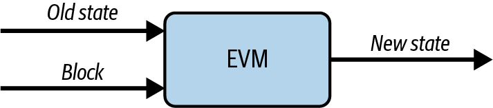
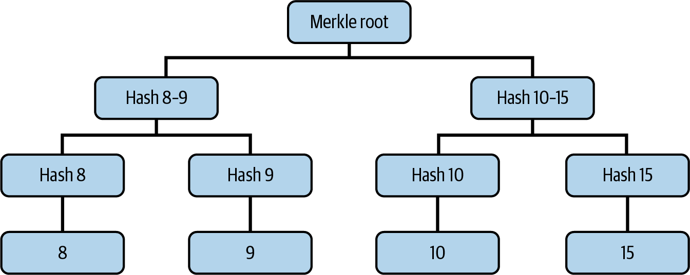
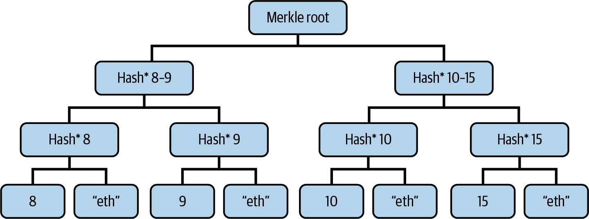
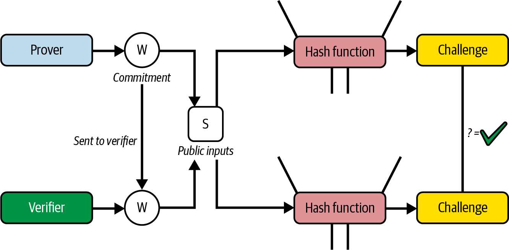
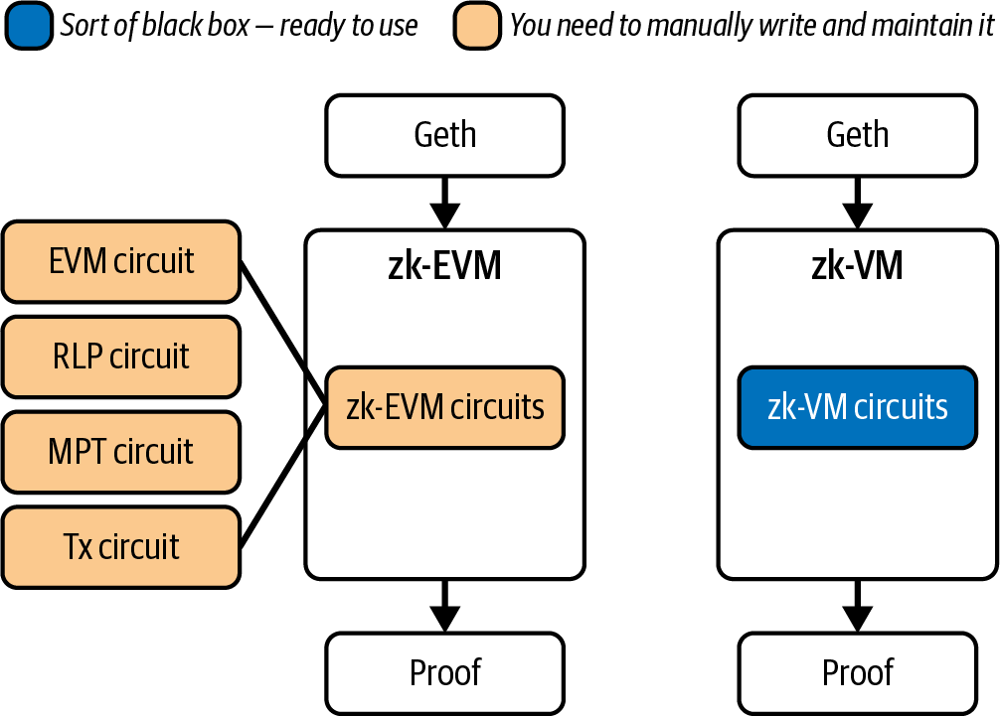

# Chapter 17. Zero-Knowledge Proofs

In this chapter, we'll explore the fascinating world of *zero-knowledge cryptography* and see how it perfectly applies to the Ethereum roadmap, making it possible to really scale and accommodate mass-adoption demand for block space. Zero-knowledge technology is a very complex topic and relies on lots of mathematical rules that we won't be able to explain in detail. The goal of this chapter is to make sure you can understand why zero-knowledge cryptography offers a unique opportunity for Ethereum and fits well into the scaling roadmap. By the end of the chapter, you'll know how zero-knowledge cryptography works on a high level, what its useful properties are, and how Ethereum is going to use it to improve the protocol.

## History

*Zero-knowledge proofs* were introduced in the paper ["The Knowledge Complexity of Interactive Proof-Systems"](https://oreil.ly/a6KH6) by Shafi Goldwasser, Silvio Micali, and Charles Rackoff in 1985, where they describe a zero-knowledge proof as a way to prove to another party that you know something is true without revealing any information besides the fact that your statement is actually true.
Even though zero-knowledge proofs were discovered in the 1980s, their practical use cases were very limited. Everything changed in 2011 with the arrival of the [BIT+11](https://oreil.ly/C6HvM) paper that introduced *SNARKs* (*succinct noninteractive arguments of knowledge*) as a theoretical framework for creating zero-knowledge proofs for arbitrary computations. Two years later, in 2013, the [Pinocchio PGHR13](https://oreil.ly/4uU6x) paper provided the first practical implementation of a general-purpose SNARK, making SNARKs feasible for real-world applications. For the first time, it was possible to prove that a generic program had been executed correctly without having to reexecute it and without revealing the actual computation details.

The revolution had started. From that moment on, the field of zero-knowledge proofs evolved at an impressively rapid pace. In 2016, the [Groth16 algorithm](https://oreil.ly/rxlOL) significantly improved the efficiency of zk-SNARKs by reducing proof size and verification time. Because of its exceptional succinctness, Groth16 remains widely used today, despite the availability of newer systems. For example, Tornado Cash, a decentralized mixer application, uses it to implement zero-knowledge proofs on chain.

In 2017, [Bulletproofs](https://oreil.ly/ZUeIe) introduced a groundbreaking advancement by eliminating the need for a *trusted setup* (in later sections, we'll do a deep dive into what a trusted setup actually is), though at the cost of larger proof sizes. This was followed in 2018 by [*zk-STARKs*](https://oreil.ly/TCnTT), which not only removed the requirement for trusted setups but also provided postquantum security—meaning their cryptographic foundations are resistant to attacks from quantum computers. The former is used nowadays in the cryptocurrency project Monero to obfuscate transaction amounts, while the latter forms the cryptographic basis of Starknet, an Ethereum L2.

In 2019, [PLONK](https://oreil.ly/3453_) and [Sonic](https://oreil.ly/f6_Sq) made significant contributions by introducing universal and updatable trusted setups, which made SNARKs more flexible and practical for general-purpose applications. These innovations continue to influence modern zero-knowledge systems.

Zero-knowledge proofs remain in active development, with recent advances bringing improvements in proving time, recursion efficiency, and practical applications like zk-EVMs and modern zk-VMs. New constructions and optimizations continue to emerge regularly, pushing the boundaries of what's possible with zero-knowledge technology.

That's a reality mostly thanks to the money brought by the cryptocurrency space. The Ethereum Foundation itself has contributed (and still contributes) by providing multiple grants and having dedicated teams research the topic.

## Definition and Properties

Now, let's be more specific and define what a zero-knowledge proof is and which properties it must have. We've already said that a zero-knowledge proof is a protocol that lets a party—usually called the *prover*, P—prove to another party—usually called the *verifier*, V—that a statement is true without revealing anything apart from the fact that that specific statement is true.

Let's formalize some important definitions:

**Statement**

The claim being proven. The statement is public and verifiable by anyone, and it doesn't include private information.

**Witness**

The secret information that proves the statement is true. The witness is known only by the prover.

**Proof**

The cryptographic object that convinces a verifier that the statement is true without revealing the witness.

All zero-knowledge proof systems must adhere to the following three properties:

**Completeness**

If the prover P holds a true statement, then it must be able to compute a valid zero-knowledge proof by following the protocol rules. There cannot be a case where a prover is not able to produce a valid proof if it's following all the rules correctly.

**Soundness**

It must be infeasible for any malicious prover to forge a valid proof for a false statement. If a zero-knowledge proof is accepted by a verifier, the only way the prover must have created it is by following all the protocol rules accordingly, starting with a true statement.

**Zero knowledge**

As the name suggests, a verifier shouldn't get to know anything other than the validity of the initial statement while following the protocol.

## How Ethereum Uses Zero-Knowledge Proofs

You may wonder why this very new piece of cryptography is important for the future development and roadmap of Ethereum. The answer is actually pretty straightforward.

The real power of zero-knowledge proof systems, in the context of Ethereum, is that they enable the possibility of verifying the validity of a statement without having to perform all the computations needed to get to that final statement. First, a prover computes a certain statement and attaches a zero-knowledge proof to it; then, all verifiers can simply use the zero-knowledge protocol and trustlessly take that statement as true, without needing to do the same computation that the prover did.

A careful reader may have already spotted where this perfectly applies to Ethereum: block execution and state updates—in other words, the *EVM state transition function*. Every new block updates the current state by processing all transactions included into it. Figure 17-1 shows a good representation of this.



Figure 17-1. EVM state transition function

You can think of the EVM as a black box that takes in as input the current state of the blockchain and the new received block full of transactions, and then returns the new, updated state of the chain. Right now, when an Ethereum full node receives a new block, it reexecutes all the transactions contained in that block so that it can trustlessly update the state without having to rely on any trusted third party.
The main issue with this approach is that block execution becomes a potential bottleneck because it's very load intensive. You end up having to balance the hardware requirements that a full node must adhere to in order to work fine and be up to date with the tip of the chain with the level of decentralization that you want to have in the network. The more you want to scale by pushing the requirements of a full node higher, the more you compromise decentralization because less sophisticated actors cannot economically sustain running a full node anymore. And vice versa: the lower you keep hardware requirements so that anyone can run a node, the more you're limited in terms of maximal throughput that your blockchain can handle. Ethereum has always preferred the decentralization branch of this trade-off, keeping hardware requirements low enough to allow for solo stakers and full node runners to exist.

Here is where zero-knowledge proof systems come into play. What if there is a way for a full node to trustlessly update its state without having to execute any transaction—basically not having to perform the heavy computation of the EVM state transition function? This idea can be summarized in the following example:

1. Some actors perform the actual EVM computation by executing all transactions included into a new block and producing the updated state of the chain.
2. These actors create a zero-knowledge proof that attests to the validity of the state and share it, together with the new updated state, to all full nodes.
3. When all other full nodes receive the new state of the chain and the zero-knowledge proof, they just verify the validity of the proof, and if it's valid, they can trustlessly update their own states of the chain with the new state they have just received.

This way, you still need to have nodes—probably maintained by heavily financed companies—that do need to execute all transactions, but all other nodes can be cheap since they only need to verify a proof. You can bump hardware requirements really high for the first type of nodes so that you can handle a much bigger throughput and still have a high level of decentralization thanks to the "magic" of zero-knowledge proofs.

As of now, we have always assumed that generating a zero-knowledge proof and verifying it is fast and straightforward. In fact, the previous steps only make sense if verifying a zero-knowledge proof is faster than reexecuting all of the transactions contained in an average Ethereum block. And it turns out that today, it's quite hard to achieve such a property. But that's an optimization problem: it's just a matter of when, not if. We'll soon reach the point where it will be feasible to generate and verify a zero-knowledge proof for an Ethereum block in real time. Ethproofs is a very cool website to follow if you're interested in the development of this topic.

## L2s Also Benefit from ZK

The Ethereum mainnet is not the only thing that benefits from zero-knowledge proof technology. In fact, as you may have already read in Chapter 16, there is a category of rollups called *ZK rollups*. As the name suggests, they use zero-knowledge proof systems to prove the EVM execution so that they can post state updates of their chains, attached with a zero-knowledge proof that ensures that the new state has been computed correctly.

You may wonder how ZK rollups are able to use zero-knowledge technology if, as we previously said, it's currently not possible to achieve real-time proving for average Ethereum blocks. The answer is that they don't; they don't even need to do real-time proving for each block of the L2. Usually, they post an aggregate zero-knowledge proof once every hour or so that proves that all the state updates that happened between the last one and the most recent one have been executed correctly.

The time elapsed between every zero-knowledge proof only affects the time to finality of the rollup itself. If a proof is posted once every hour, that means that on average, you need to wait 30 minutes to be able to consider your transaction really finalized (on the L1).

## A Small Example

To become more familiar with how zero-knowledge proof systems work, let's start with a simple and small example: the *partition problem*. This is a well-known problem that consists of the task of "deciding whether a given multiset S of positive integers can be partitioned into two subsets S1 and S2 such that the sum of the numbers in S1 equals the sum of the numbers in S2."

> **Note**  
>
> The partition problem is a decision problem, whereas Ethereum relies on zero-knowledge proofs to verify computation traces. Although Ethereum's primary use case for zero-knowledge proofs is execution-trace verification, working through the partition problem is still an excellent way to build your intuition about how zero-knowledge proof systems work.


If we have S = [1, 1, 5, 7], we can satisfy the problem by partitioning it into S1 = [1, 1, 5] and S2 = [7]. But it's not always possible to generate a correct solution to this problem; in fact, if S = [1, 1, 5, 8], then it's impossible to partition it into two subsets that sum up to the same number.

The partition problem is NP-complete, meaning that an algorithm doesn't exist that can solve it in polynomial time—that is, providing a solution if there is one or proving the solution doesn't exist in a small amount of time.

### Let's Prove It

The structure of the partition problem perfectly applies to the properties of zero-knowledge proof systems we have seen so far. In fact, since it's hard to find a solution, it could be interesting to delegate the computational power of finding it to a rich prover, equipped with a supercomputer, and then use zero-knowledge technology to prove that it found a valid solution without having everyone else perform the same heavy computation but also without actually revealing that solution.

To make the partition problem suitable for zero-knowledge proof systems, we need to tweak it a little bit. Suppose we have a list `s` of positive integers. We'll say that another list `a` is a *satisfying assignment* if:

1. `len(s) == len(a)`
2. All elements of `a` are 1 or –1
3. The dot product between `s` and `a` is 0

Note that this construction is completely analogous to the partition problem. If we take our previous initial list S = [1, 1, 5, 7], then the satisfying assignment `a` is equal to:

```
a = [1, 1, 1, –1]
```

You can manually check that all three conditions are true:

1. `len(s) = 4 == len(a) = 4`
2. All elements of `a` are 1 or –1
3. Dot product: 1 × 1 + 1 × 1 + 1 × 5 + (–1) × 7 = 1 + 1 + 5 – 7 = 0

The *dot product* between two lists of equal length is computed by multiplying each member of the first list with the corresponding element of the second one and then summing all the results. More technically, if we have lists `s = [s0, s1, s2, sn]` and `a = [a0, a1, a2, an]` of equal length `n`, the dot product is calculated as follows:

<math xmlns="http://www.w3.org/1998/Math/MathML">
  <mi mathcolor="#000000">s</mi>
  <mo mathcolor="#000000">⋅</mo>
  <mi mathcolor="#000000">a</mi>
  <mo mathcolor="#000000">=</mo>
  <mrow>
    <munderover>
      <mo stretchy="false">∑</mo>
      <mrow>
        <mi mathcolor="#000000">i</mi>
        <mo mathcolor="#000000">=</mo>
        <mn mathcolor="#000000">0</mn>
      </mrow>
      <mrow>
        <mi mathcolor="#000000">n</mi>
      </mrow>
    </munderover>
    <mrow>
      <mfenced separators="">
        <mrow>
          <msub>
            <mrow>
              <mi mathcolor="#000000">s</mi>
            </mrow>
            <mrow>
              <mi mathcolor="#000000">i</mi>
            </mrow>
          </msub>
          <mo mathcolor="#000000">×</mo>
          <msub>
            <mrow>
              <mi mathcolor="#000000">a</mi>
            </mrow>
            <mrow>
              <mi mathcolor="#000000">i</mi>
            </mrow>
          </msub>
        </mrow>
      </mfenced>
    </mrow>
  </mrow>
  <mo mathcolor="#000000">=</mo>
  <msub>
    <mrow>
      <mi mathcolor="#000000">a</mi>
    </mrow>
    <mrow>
      <mn mathcolor="#000000">0</mn>
    </mrow>
  </msub>
  <msub>
    <mrow>
      <mi mathcolor="#000000">s</mi>
    </mrow>
    <mrow>
      <mn mathcolor="#000000">0</mn>
    </mrow>
  </msub>
  <mo mathcolor="#000000">+</mo>
  <msub>
    <mrow>
      <mi mathcolor="#000000">a</mi>
    </mrow>
    <mrow>
      <mn mathcolor="#000000">1</mn>
    </mrow>
  </msub>
  <msub>
    <mrow>
      <mi mathcolor="#000000">s</mi>
    </mrow>
    <mrow>
      <mn mathcolor="#000000">1</mn>
    </mrow>
  </msub>
  <mo mathcolor="#000000">+</mo>
  <msub>
    <mrow>
      <mi mathcolor="#000000">a</mi>
    </mrow>
    <mrow>
      <mn mathcolor="#000000">2</mn>
    </mrow>
  </msub>
  <msub>
    <mrow>
      <mi mathcolor="#000000">s</mi>
    </mrow>
    <mrow>
      <mn mathcolor="#000000">2</mn>
    </mrow>
  </msub>
  <mo mathcolor="#000000">+</mo>
  <mo mathcolor="#000000">.</mo>
  <mo mathcolor="#000000">.</mo>
  <mo mathcolor="#000000">.</mo>
  <mo mathcolor="#000000">+</mo>
  <msub>
    <mrow>
      <mi mathcolor="#000000">a</mi>
    </mrow>
    <mrow>
      <mi mathcolor="#000000">n</mi>
    </mrow>
  </msub>
  <msub>
    <mrow>
      <mi mathcolor="#000000">s</mi>
    </mrow>
    <mrow>
      <mi mathcolor="#000000">n</mi>
    </mrow>
  </msub>
</math>

Of course, we could immediately provide `a` to the verifier, and they could easily check that it is a valid solution, but that would violate the zero-knowledge assumption of not revealing the solution.

Let's start generating a different list `w` by creating the *partial-sum list*—that is, `w[i]` is equal to the partial dot product between `s` and `a` up to `i`. In the context of zero-knowledge proof systems, `w` is also called the *witness*. Following our example, we can compute `w`:

```
w = [1, 2, 7, 0]
```

Note that if `a` is a valid satisfying assignment, then `w` always ends with a 0.

To make the proof system work better, let's apply a small modification to the proof `p` we have built so far. In particular, we'll put the last item of the list `w` in the first position, so our previous `w` now becomes:

```
w = [0, 1, 2, 7]
```

Sweet! This list `w` has a very cool property:

```
|s[i]| = |w[i + 1] – w[i]|
```

You can check the validity of this statement yourself:

```
|s[0]| = |w[0 + 1] – w[0]| = |w[1] – w[0]| = |1 – 0| = |1| = 1
|s[1]| = |w[1 + 1] – w[1]| = |w[2] – w[1]| = |2 – 1| = |1| = 1
|s[2]| = |w[2 + 1] – w[2]| = |w[3] – w[2]| = |7 – 2| = |5| = 5
|s[3]| = |w[3 + 1] – w[3]| = |w[4] – w[3]| = |w[0] – w[3]| = |0 – 7| = |–7| = 7
```

Note that to compute `s[3]`, we would need to access `w[4]`, which does not exist since `w` has only four items (and we start indexing from zero). Still, there is a very easy solution: you just need to go back to the first element of `w` as if `w` were cyclical.

A verifier could ask for two consecutive elements of `w` and check that the previous relation holds. Remember that the verifier has access to `s` because that is publicly available; it represents the input of this problem but has no access to `a`, the satisfying assignment, which represents the solution. If the equation holds, it means the prover knows a satisfying assignment `a` for this problem.

### Issues

What we have built so far is a very naive proof system. In fact, there are three big issues with it:

1. Previously, we said that once the verifier has asked for two consecutive elements of `w` and the equation holds true, then they have verified that the prover knows a solution to this problem. This is not true. With only one query, the verifier cannot be completely sure; they have to make several queries of consecutive elements of `w` before being sure of it with a really high probability.
2. While it's true that the verifier can indeed verify that the prover has a solution to the problem, this proof system relies on the integrity of the prover. What if the prover is malevolent and lies? When the verifier asks for two consecutive elements of `w`, the prover could provide two random numbers that still satisfy the equation.
3. Furthermore, this proof system is not zero knowledge. In fact, by asking for consecutive elements of `w`, the verifier gets to know a lot about the satisfying assignment `a`. The verifier knows how `w` has been constructed, so the more they know about `w`, the more they know about the solution `a`.

Let's address these issues now and try to build a better proof system.

### Zero Knowledge

Let's add zero knowledge to the system. The main issue with the protocol we've built so far is that we send the real values of `w` to the verifier, and that lets the verifier understand a lot of information about `a`. To see this in practice, let's do two simple steps of interaction between prover and verifier.

The verifier asks for `w[1]` and `w[2]` and checks that `|w[2] – w[1]| = |s[1]|`, so the prover provides `w[1] = 1` and `w[2] = 2`, and the verifier can confirm that the equation holds true:

<math xmlns="http://www.w3.org/1998/Math/MathML">
  <mfenced open="|" close="" separators="|">
    <mrow>
      <mi mathcolor="#000000">s</mi>
      <mo stretchy="false" mathcolor="#000000">[</mo>
      <mn mathcolor="#000000">1</mn>
      <mo stretchy="false" mathcolor="#000000">]</mo>
    </mrow>
    <mrow>
      <mo mathcolor="#000000">=</mo>
    </mrow>
    <mrow>
      <mi mathcolor="#000000">w</mi>
      <mo stretchy="false" mathcolor="#000000">[</mo>
      <mn mathcolor="#000000">2</mn>
      <mo stretchy="false" mathcolor="#000000">]</mo>
      <mo mathcolor="#000000">−</mo>
      <mi mathcolor="#000000">w</mi>
      <mo stretchy="false" mathcolor="#000000">[</mo>
      <mn mathcolor="#000000">1</mn>
      <mo stretchy="false" mathcolor="#000000">]</mo>
    </mrow>
    <mrow>
      <mo mathcolor="#000000">=</mo>
    </mrow>
    <mrow>
      <mn mathcolor="#000000">2</mn>
      <mo mathcolor="#000000">−</mo>
      <mn mathcolor="#000000">1</mn>
    </mrow>
    <mrow>
      <mo mathcolor="#000000">=</mo>
    </mrow>
    <mrow>
      <mn mathcolor="#000000">1</mn>
    </mrow>
    <mrow>
      <mo mathcolor="#000000">=</mo>
      <mn mathcolor="#000000">1</mn>
    </mrow>
  </mfenced>
</math>

Then, the verifier asks for another query: `w[2]` and `w[3]`. The prover provides `w[2] = 2` and `w[3] = 7`, and the verifier checks the equation:

<math xmlns="http://www.w3.org/1998/Math/MathML">
  <mfenced open="|" close="" separators="|">
    <mrow>
      <mi mathcolor="#000000">s</mi>
      <mo stretchy="false" mathcolor="#000000">[</mo>
      <mn mathcolor="#000000">2</mn>
      <mo stretchy="false" mathcolor="#000000">]</mo>
    </mrow>
    <mrow>
      <mo mathcolor="#000000">=</mo>
    </mrow>
    <mrow>
      <mi mathcolor="#000000">w</mi>
      <mo stretchy="false" mathcolor="#000000">[</mo>
      <mn mathcolor="#000000">3</mn>
      <mo stretchy="false" mathcolor="#000000">]</mo>
      <mo mathcolor="#000000">−</mo>
      <mi mathcolor="#000000">w</mi>
      <mo stretchy="false" mathcolor="#000000">[</mo>
      <mn mathcolor="#000000">2</mn>
      <mo stretchy="false" mathcolor="#000000">]</mo>
    </mrow>
    <mrow>
      <mo mathcolor="#000000">=</mo>
    </mrow>
    <mrow>
      <mn mathcolor="#000000">7</mn>
      <mo mathcolor="#000000">−</mo>
      <mn mathcolor="#000000">2</mn>
    </mrow>
    <mrow>
      <mo mathcolor="#000000">=</mo>
    </mrow>
    <mrow>
      <mn mathcolor="#000000">5</mn>
    </mrow>
    <mrow>
      <mo mathcolor="#000000">=</mo>
      <mn mathcolor="#000000">5</mn>
    </mrow>
  </mfenced>
</math>

With these two interactions, the verifier gets to know three elements of w:

<math xmlns="http://www.w3.org/1998/Math/MathML">
  <mtable>
    <mtr>
      <mtd/>
      <mtd>
        <mi mathcolor="#000000">w</mi>
        <mo stretchy="false" mathcolor="#000000">[</mo>
        <mn mathcolor="#000000">1</mn>
        <mo stretchy="false" mathcolor="#000000">]</mo>
        <mo mathcolor="#000000">=</mo>
        <mn mathcolor="#000000">1</mn>
      </mtd>
    </mtr>
    <mtr>
      <mtd/>
      <mtd>
        <mi mathcolor="#000000">w</mi>
        <mo stretchy="false" mathcolor="#000000">[</mo>
        <mn mathcolor="#000000">2</mn>
        <mo stretchy="false" mathcolor="#000000">]</mo>
        <mo mathcolor="#000000">=</mo>
        <mn mathcolor="#000000">2</mn>
      </mtd>
    </mtr>
    <mtr>
      <mtd/>
      <mtd>
        <mi mathcolor="#000000">w</mi>
        <mo stretchy="false" mathcolor="#000000">[</mo>
        <mn mathcolor="#000000">3</mn>
        <mo stretchy="false" mathcolor="#000000">]</mo>
        <mo mathcolor="#000000">=</mo>
        <mn mathcolor="#000000">7</mn>
      </mtd>
    </mtr>
  </mtable>
</math>

Since the verifier already knows `s = [1, 1, 5, 7]` and knows how `w` has been computed, they can derive that the initial part of the solution `a` is equal to `[1, 1, 1]` because that's the only way to get `w[3] = 7`, `w[2] = 2`, and `w[1] = 1`.

We need to find a way to mask the real values of `w` but still manage to satisfy the relation between the new `w` and the input list `s`. To achieve that, we need to add some level of randomness in a very specific way.

First, instead of `a`, we flip a coin, and if it's heads, we leave it as it is; otherwise, we change the signs for all elements, so all 1s becomes –1s, and vice versa. Note that this change doesn't break the three main properties of the satisfying assignment `a` for the problem.

Then, we get a new random integer value `r`. We calculate `w` in the same way as before, but we add `r` to every element of it. Even this change doesn't break the key relation between `s` and `w`.

Every time the verifier asks for a new query, we have to flip a coin and compute a different random value `r`. This way, while the verifier is still able to verify the validity of the equation, they are not able to understand anything about `a` because all `w` values will look random to them.

Let's do a small demonstration. Remember, the prover (us, in this example) starts with both `s` and `a`:

<math xmlns="http://www.w3.org/1998/Math/MathML">
  <mtable>
    <mtr>
      <mtd/>
      <mtd>
        <mi mathcolor="#000000">s</mi>
        <mo mathcolor="#000000">=</mo>
        <mo stretchy="false" mathcolor="#000000">[</mo>
        <mn mathcolor="#000000">1</mn>
        <mo mathcolor="#000000">,</mo>
        <mn mathcolor="#000000">1</mn>
        <mo mathcolor="#000000">,</mo>
        <mn mathcolor="#000000">5</mn>
        <mo mathcolor="#000000">,</mo>
        <mn mathcolor="#000000">7</mn>
        <mo stretchy="false" mathcolor="#000000">]</mo>
      </mtd>
    </mtr>
    <mtr>
      <mtd/>
      <mtd>
        <mi mathcolor="#000000">a</mi>
        <mo mathcolor="#000000">=</mo>
        <mo stretchy="false" mathcolor="#000000">[</mo>
        <mn mathcolor="#000000">1</mn>
        <mo mathcolor="#000000">,</mo>
        <mn mathcolor="#000000">1</mn>
        <mo mathcolor="#000000">,</mo>
        <mn mathcolor="#000000">1</mn>
        <mo mathcolor="#000000">,</mo>
        <mo mathcolor="#000000">−</mo>
        <mn mathcolor="#000000">1</mn>
        <mo stretchy="false" mathcolor="#000000">]</mo>
      </mtd>
    </mtr>
  </mtable>
</math>

Now, the verifier asks for `w[1]` and `w[2]` to check that `|w[2] – w[1]| = |s[1]|`.

First, we need to flip a coin to eventually change all values of `a`. It's tails, so we need to flip all signs, and `a` becomes:

<math xmlns="http://www.w3.org/1998/Math/MathML">
  <mi mathcolor="#000000">a</mi>
  <mo mathcolor="#000000">′</mo>
  <mo mathcolor="#000000">=</mo>
  <mo stretchy="false" mathcolor="#000000">[</mo>
  <mo mathcolor="#000000">−</mo>
  <mn mathcolor="#000000">1</mn>
  <mo mathcolor="#000000">,</mo>
  <mo mathcolor="#000000">−</mo>
  <mn mathcolor="#000000">1</mn>
  <mo mathcolor="#000000">,</mo>
  <mo mathcolor="#000000">−</mo>
  <mn mathcolor="#000000">1</mn>
  <mo mathcolor="#000000">,</mo>
  <mn mathcolor="#000000">1</mn>
  <mo stretchy="false" mathcolor="#000000">]</mo>
</math>

Then, we compute a random value `r = 4`. We calculate `w` and add `r` to each element:

<math xmlns="http://www.w3.org/1998/Math/MathML">
  <mtable>
    <mtr>
      <mtd/>
      <mtd>
        <mi mathcolor="#000000">w</mi>
        <mo mathcolor="#000000">=</mo>
        <mo stretchy="false" mathcolor="#000000">[</mo>
        <mn mathcolor="#000000">0</mn>
        <mo mathcolor="#000000">,</mo>
        <mo mathcolor="#000000">−</mo>
        <mn mathcolor="#000000">1</mn>
        <mo mathcolor="#000000">,</mo>
        <mo mathcolor="#000000">−</mo>
        <mn mathcolor="#000000">2</mn>
        <mo mathcolor="#000000">,</mo>
        <mo mathcolor="#000000">−</mo>
        <mn mathcolor="#000000">7</mn>
        <mo stretchy="false" mathcolor="#000000">]</mo>
      </mtd>
    </mtr>
    <mtr>
      <mtd/>
      <mtd>
        <mi mathcolor="#000000">w</mi>
        <mo mathcolor="#000000">′</mo>
        <mo mathcolor="#000000">=</mo>
        <mo stretchy="false" mathcolor="#000000">[</mo>
        <mn mathcolor="#000000">4</mn>
        <mo mathcolor="#000000">,</mo>
        <mn mathcolor="#000000">3</mn>
        <mo mathcolor="#000000">,</mo>
        <mn mathcolor="#000000">2</mn>
        <mo mathcolor="#000000">,</mo>
        <mo mathcolor="#000000">−</mo>
        <mn mathcolor="#000000">3</mn>
        <mo stretchy="false" mathcolor="#000000">]</mo>
      </mtd>
    </mtr>
  </mtable>
</math>

And we provide <math xmlns="http://www.w3.org/1998/Math/MathML">
  <msup>
    <mrow>
      <mi mathcolor="#000000">w</mi>
    </mrow>
    <mrow>
      <mo mathcolor="#000000">′</mo>
    </mrow>
  </msup>
  <mo stretchy="false" mathcolor="#000000">[</mo>
  <mn mathcolor="#000000">1</mn>
  <mo stretchy="false" mathcolor="#000000">]</mo>
  <mo mathcolor="#000000">=</mo>
  <mn mathcolor="#000000">3</mn>
</math> and <math xmlns="http://www.w3.org/1998/Math/MathML">
  <msup>
    <mrow>
      <mi mathcolor="#000000">w</mi>
    </mrow>
    <mrow>
      <mo mathcolor="#000000">′</mo>
    </mrow>
  </msup>
  <mo stretchy="false" mathcolor="#000000">[</mo>
  <mn mathcolor="#000000">2</mn>
  <mo stretchy="false" mathcolor="#000000">]</mo>
  <mo mathcolor="#000000">=</mo>
  <mn mathcolor="#000000">2</mn>
</math>.

The verifier can still confirm the validity of the equation:

<math xmlns="http://www.w3.org/1998/Math/MathML">
  <mfenced open="|" close="|" separators="|">
    <mrow>
      <mi mathcolor="#000000">s</mi>
      <mo stretchy="false" mathcolor="#000000">[</mo>
      <mn mathcolor="#000000">1</mn>
      <mo stretchy="false" mathcolor="#000000">]</mo>
    </mrow>
    <mrow>
      <mo mathcolor="#000000">=</mo>
    </mrow>
  </mfenced>
  <msup>
    <mrow>
      <mi mathcolor="#000000">w</mi>
    </mrow>
    <mrow>
      <mo mathcolor="#000000">′</mo>
    </mrow>
  </msup>
  <mo stretchy="false" mathcolor="#000000">[</mo>
  <mn mathcolor="#000000">2</mn>
  <mo stretchy="false" mathcolor="#000000">]</mo>
  <mo mathcolor="#000000">−</mo>
  <msup>
    <mrow>
      <mi mathcolor="#000000">w</mi>
    </mrow>
    <mrow>
      <mo mathcolor="#000000">′</mo>
    </mrow>
  </msup>
  <mfenced open="" close="" separators="|">
    <mrow>
      <mo stretchy="false" mathcolor="#000000">[</mo>
      <mn mathcolor="#000000">1</mn>
      <mo stretchy="false" mathcolor="#000000">]</mo>
    </mrow>
    <mrow>
      <mo mathcolor="#000000">=</mo>
    </mrow>
    <mrow>
      <mn mathcolor="#000000">2</mn>
      <mo mathcolor="#000000">−</mo>
      <mn mathcolor="#000000">3</mn>
    </mrow>
    <mrow>
      <mo mathcolor="#000000">=</mo>
    </mrow>
    <mrow>
      <mo mathcolor="#000000">−</mo>
      <mn mathcolor="#000000">1</mn>
    </mrow>
    <mrow>
      <mo mathcolor="#000000">=</mo>
      <mn mathcolor="#000000">1</mn>
    </mrow>
  </mfenced>
</math>

Now, the verifier runs another query, asking for `w[2]` and `w[3]`. Again, we need to flip a coin to eventually change all values of `a`. This time, it's heads, so we don't change signs:

Then, we compute a random value `r = 1`. We calculate `w` and add `r` to each element:

<math xmlns="http://www.w3.org/1998/Math/MathML">
  <mi mathcolor="#000000">a</mi>
  <mo mathcolor="#000000">=</mo>
  <mo stretchy="false" mathcolor="#000000">[</mo>
  <mn mathcolor="#000000">1</mn>
  <mo mathcolor="#000000">,</mo>
  <mn mathcolor="#000000">1</mn>
  <mo mathcolor="#000000">,</mo>
  <mn mathcolor="#000000">1</mn>
  <mo mathcolor="#000000">,</mo>
  <mo mathcolor="#000000">−</mo>
  <mn mathcolor="#000000">1</mn>
  <mo stretchy="false" mathcolor="#000000">]</mo>
</math>

And we provide <math xmlns="http://www.w3.org/1998/Math/MathML">
  <msup>
    <mrow>
      <mi mathcolor="#000000">w</mi>
    </mrow>
    <mrow>
      <mo mathcolor="#000000">″</mo>
    </mrow>
  </msup>
  <mo stretchy="false" mathcolor="#000000">[</mo>
  <mn mathcolor="#000000">2</mn>
  <mo stretchy="false" mathcolor="#000000">]</mo>
  <mo mathcolor="#000000">=</mo>
  <mn mathcolor="#000000">3</mn>
</math> and <math xmlns="http://www.w3.org/1998/Math/MathML">
  <msup>
    <mrow>
      <mi mathcolor="#000000">w</mi>
    </mrow>
    <mrow>
      <mo mathcolor="#000000">″</mo>
    </mrow>
  </msup>
  <mo stretchy="false" mathcolor="#000000">[</mo>
  <mn mathcolor="#000000">3</mn>
  <mo stretchy="false" mathcolor="#000000">]</mo>
  <mo mathcolor="#000000">=</mo>
  <mn mathcolor="#000000">8</mn>
</math>.
The verifier can still confirm the validity of the equation:

<math xmlns="http://www.w3.org/1998/Math/MathML">
  <mfenced open="|" close="|" separators="|">
    <mrow>
      <mi mathcolor="#000000">s</mi>
      <mo stretchy="false" mathcolor="#000000">[</mo>
      <mn mathcolor="#000000">2</mn>
      <mo stretchy="false" mathcolor="#000000">]</mo>
    </mrow>
    <mrow>
      <mo mathcolor="#000000">=</mo>
    </mrow>
  </mfenced>
  <msup>
    <mrow>
      <mi mathcolor="#000000">w</mi>
    </mrow>
    <mrow>
      <mo mathcolor="#000000">″</mo>
    </mrow>
  </msup>
  <mo stretchy="false" mathcolor="#000000">[</mo>
  <mn mathcolor="#000000">3</mn>
  <mo stretchy="false" mathcolor="#000000">]</mo>
  <mo mathcolor="#000000">−</mo>
  <msup>
    <mrow>
      <mi mathcolor="#000000">w</mi>
    </mrow>
    <mrow>
      <mo mathcolor="#000000">″</mo>
    </mrow>
  </msup>
  <mfenced open="" close="" separators="|">
    <mrow>
      <mo stretchy="false" mathcolor="#000000">[</mo>
      <mn mathcolor="#000000">2</mn>
      <mo stretchy="false" mathcolor="#000000">]</mo>
    </mrow>
    <mrow>
      <mo mathcolor="#000000">=</mo>
    </mrow>
    <mrow>
      <mn mathcolor="#000000">8</mn>
      <mo mathcolor="#000000">−</mo>
      <mn mathcolor="#000000">3</mn>
    </mrow>
    <mrow>
      <mo mathcolor="#000000">=</mo>
    </mrow>
    <mrow>
      <mn mathcolor="#000000">5</mn>
    </mrow>
    <mrow>
      <mo mathcolor="#000000">=</mo>
      <mn mathcolor="#000000">5</mn>
    </mrow>
  </mfenced>
</math>

But now, the verifier cannot understand much about the satisfying assignment a. In fact, they now have the following information:

<math xmlns="http://www.w3.org/1998/Math/MathML">
  <mtable>
    <mtr>
      <mtd/>
      <mtd>
        <msup>
          <mrow>
            <mi mathcolor="#000000">w</mi>
          </mrow>
          <mrow>
            <mo mathcolor="#000000">′</mo>
          </mrow>
        </msup>
        <mo stretchy="false" mathcolor="#000000">[</mo>
        <mn mathcolor="#000000">1</mn>
        <mo stretchy="false" mathcolor="#000000">]</mo>
        <mo mathcolor="#000000">=</mo>
        <mn mathcolor="#000000">3</mn>
      </mtd>
    </mtr>
    <mtr>
      <mtd/>
      <mtd>
        <msup>
          <mrow>
            <mi mathcolor="#000000">w</mi>
          </mrow>
          <mrow>
            <mo mathcolor="#000000">′</mo>
          </mrow>
        </msup>
        <mo stretchy="false" mathcolor="#000000">[</mo>
        <mn mathcolor="#000000">2</mn>
        <mo stretchy="false" mathcolor="#000000">]</mo>
        <mo mathcolor="#000000">=</mo>
        <mn mathcolor="#000000">2</mn>
      </mtd>
    </mtr>
    <mtr>
      <mtd/>
      <mtd>
        <msup>
          <mrow>
            <mi mathcolor="#000000">w</mi>
          </mrow>
          <mrow>
            <mo mathcolor="#000000">″</mo>
          </mrow>
        </msup>
        <mo stretchy="false" mathcolor="#000000">[</mo>
        <mn mathcolor="#000000">2</mn>
        <mo stretchy="false" mathcolor="#000000">]</mo>
        <mo mathcolor="#000000">=</mo>
        <mn mathcolor="#000000">3</mn>
      </mtd>
    </mtr>
    <mtr>
      <mtd/>
      <mtd>
        <msup>
          <mrow>
            <mi mathcolor="#000000">w</mi>
          </mrow>
          <mrow>
            <mo mathcolor="#000000">″</mo>
          </mrow>
        </msup>
        <mo stretchy="false" mathcolor="#000000">[</mo>
        <mn mathcolor="#000000">3</mn>
        <mo stretchy="false" mathcolor="#000000">]</mo>
        <mo mathcolor="#000000">=</mo>
        <mn mathcolor="#000000">8</mn>
      </mtd>
    </mtr>
  </mtable>
</math>

The `w` values on the different queries look random to them, and they are not able to reconstruct the assignment `a`.

Nice! We managed to add zero knowledge to the proof system. Let's now address a malevolent prover.

### Prover Commitment

The problem we need to address is that the prover can lie to the verifier, providing completely made-up numbers instead of the real values of the computed witness `w`. This is really bad because the prover would be able to provide a valid proof of a false statement—that is, even though the prover doesn't actually have a satisfying assignment `a`, they are able to potentially trick the verifier into believing that they do.

We need to find a way to make sure the prover cannot lie without being caught. Essentially, we need the prover to do a *commitment* of all `w` values before providing them to the verifier.

This is where Merkle trees help us again. We introduced them in Chapter 14, so we won't go into much detail on how they work here.

Let's do a new example to see the new construction in practice. We (the prover) have:

<math xmlns="http://www.w3.org/1998/Math/MathML">
  <mtable>
    <mtr>
      <mtd>
        <mi mathcolor="#000000">s</mi>
      </mtd>
      <mtd>
        <mo mathcolor="#000000">=</mo>
        <mo stretchy="false" mathcolor="#000000">[</mo>
        <mn mathcolor="#000000">1</mn>
        <mo mathcolor="#000000">,</mo>
        <mn mathcolor="#000000">1</mn>
        <mo mathcolor="#000000">,</mo>
        <mn mathcolor="#000000">5</mn>
        <mo mathcolor="#000000">,</mo>
        <mn mathcolor="#000000">7</mn>
        <mo stretchy="false" mathcolor="#000000">]</mo>
      </mtd>
    </mtr>
    <mtr>
      <mtd>
        <mi mathcolor="#000000">a</mi>
      </mtd>
      <mtd>
        <mo mathcolor="#000000">=</mo>
        <mo stretchy="false" mathcolor="#000000">[</mo>
        <mn mathcolor="#000000">1</mn>
        <mo mathcolor="#000000">,</mo>
        <mn mathcolor="#000000">1</mn>
        <mo mathcolor="#000000">,</mo>
        <mn mathcolor="#000000">1</mn>
        <mo mathcolor="#000000">,</mo>
        <mo mathcolor="#000000">−</mo>
        <mn mathcolor="#000000">1</mn>
        <mo stretchy="false" mathcolor="#000000">]</mo>
      </mtd>
    </mtr>
  </mtable>
</math>

We flip a coin, and it's heads, so we don't need to change all the signs of the assignment `a`. We then compute `w` as the dot product between `a` and `s` (with a swap between the first and last elements):

<math xmlns="http://www.w3.org/1998/Math/MathML">
  <mi mathcolor="#000000">w</mi>
  <mo mathcolor="#000000">=</mo>
  <mo stretchy="false" mathcolor="#000000">[</mo>
  <mn mathcolor="#000000">0</mn>
  <mo mathcolor="#000000">,</mo>
  <mn mathcolor="#000000">1</mn>
  <mo mathcolor="#000000">,</mo>
  <mn mathcolor="#000000">2</mn>
  <mo mathcolor="#000000">,</mo>
  <mn mathcolor="#000000">7</mn>
  <mo stretchy="false" mathcolor="#000000">]</mo>
</math>

We compute a random value `r = 8` and we add it to each element of `w`:

<math xmlns="http://www.w3.org/1998/Math/MathML">
  <mi mathcolor="#000000">w</mi>
  <mo mathcolor="#000000">′</mo>
  <mo mathcolor="#000000">=</mo>
  <mo stretchy="false" mathcolor="#000000">[</mo>
  <mn mathcolor="#000000">8</mn>
  <mo mathcolor="#000000">,</mo>
  <mn mathcolor="#000000">9</mn>
  <mo mathcolor="#000000">,</mo>
  <mn mathcolor="#000000">10</mn>
  <mo mathcolor="#000000">,</mo>
  <mn mathcolor="#000000">15</mn>
  <mo stretchy="false" mathcolor="#000000">]</mo>
</math>

Now we need to commit to all values of `w′` and send the commitment to the verifier so that we ensure that if we ever cheat by providing fake values of `w′`, then it's trivial to spot it. Figure 17-2 shows the Merkle tree built using all `w′` values as leaves.



Figure 17-2. Merkle tree built using `w′` values

The Merkle root is the final commitment that is sent to the verifier.

At this point, the verifier starts asking for the first query: <math xmlns="http://www.w3.org/1998/Math/MathML">
  <msup>
    <mrow>
      <mi mathcolor="#000000">w</mi>
    </mrow>
    <mrow>
      <mo mathcolor="#000000">′</mo>
    </mrow>
  </msup>
  <mo stretchy="false" mathcolor="#000000">[</mo>
  <mn mathcolor="#000000">1</mn>
  <mo stretchy="false" mathcolor="#000000">]</mo>
</math> and <math xmlns="http://www.w3.org/1998/Math/MathML">
  <msup>
    <mrow>
      <mi mathcolor="#000000">w</mi>
    </mrow>
    <mrow>
      <mo mathcolor="#000000">′</mo>
    </mrow>
  </msup>
  <mo stretchy="false" mathcolor="#000000">[</mo>
  <mn mathcolor="#000000">2</mn>
  <mo stretchy="false" mathcolor="#000000">]</mo>
</math>. We can provide <math xmlns="http://www.w3.org/1998/Math/MathML">
  <msup>
    <mrow>
      <mi mathcolor="#000000">w</mi>
    </mrow>
    <mrow>
      <mo mathcolor="#000000">′</mo>
    </mrow>
  </msup>
  <mo stretchy="false" mathcolor="#000000">[</mo>
  <mn mathcolor="#000000">1</mn>
  <mo stretchy="false" mathcolor="#000000">]</mo>
  <mo mathcolor="#000000">=</mo>
  <mn mathcolor="#000000">9</mn>
</math> and <math xmlns="http://www.w3.org/1998/Math/MathML">
  <msup>
    <mrow>
      <mi mathcolor="#000000">w</mi>
    </mrow>
    <mrow>
      <mo mathcolor="#000000">′</mo>
    </mrow>
  </msup>
  <mo stretchy="false" mathcolor="#000000">[</mo>
  <mn mathcolor="#000000">2</mn>
  <mo stretchy="false" mathcolor="#000000">]</mo>
  <mo mathcolor="#000000">=</mo>
  <mn mathcolor="#000000">10</mn>
</math> to the verifier, and they can check:

<math xmlns="http://www.w3.org/1998/Math/MathML">
  <mfenced open="|" close="|" separators="|">
    <mrow>
      <mi mathcolor="#000000">s</mi>
      <mo stretchy="false" mathcolor="#000000">[</mo>
      <mn mathcolor="#000000">1</mn>
      <mo stretchy="false" mathcolor="#000000">]</mo>
    </mrow>
    <mrow>
      <mo mathcolor="#000000">=</mo>
    </mrow>
  </mfenced>
  <msup>
    <mrow>
      <mi mathcolor="#000000">w</mi>
    </mrow>
    <mrow>
      <mo mathcolor="#000000">′</mo>
    </mrow>
  </msup>
  <mo stretchy="false" mathcolor="#000000">[</mo>
  <mn mathcolor="#000000">2</mn>
  <mo stretchy="false" mathcolor="#000000">]</mo>
  <mo mathcolor="#000000">−</mo>
  <msup>
    <mrow>
      <mi mathcolor="#000000">w</mi>
    </mrow>
    <mrow>
      <mo mathcolor="#000000">′</mo>
    </mrow>
  </msup>
  <mfenced open="" close="" separators="|">
    <mrow>
      <mo stretchy="false" mathcolor="#000000">[</mo>
      <mn mathcolor="#000000">1</mn>
      <mo stretchy="false" mathcolor="#000000">]</mo>
    </mrow>
    <mrow>
      <mo mathcolor="#000000">=</mo>
    </mrow>
    <mrow>
      <mn mathcolor="#000000">10</mn>
      <mo mathcolor="#000000">−</mo>
      <mn mathcolor="#000000">9</mn>
    </mrow>
    <mrow>
      <mo mathcolor="#000000">=</mo>
    </mrow>
    <mrow>
      <mn mathcolor="#000000">1</mn>
    </mrow>
    <mrow>
      <mo mathcolor="#000000">=</mo>
      <mn mathcolor="#000000">1</mn>
    </mrow>
  </mfenced>
</math>

Now, the verifier needs to make sure that we didn't cheat, so they also ask the prover for the *verification path*, which contains all the data they need to re-create the Merkle tree on its own in order to check that the Merkle root is the same as the commitment we sent. If that's the case, then they are sure we didn't cheat; otherwise, they immediately know we did cheat.

Specifically, the verification path for this query contains:

- Hash 8
- Hash 15

This way, the verifier can re-create the Merkle tree up to the root and verify the commitment. So, we send hash 8 and hash 15 to the verifier, the verifier checks the validity of the commitment, and finally, this query is over.

You may have spotted a new issue, though. In fact, due to the verification-path requirement, we ended up sending some additional data about `w′`: hash 8 and hash 15. While it's true that it should be computationally infeasible to revert a hash function—that is, to get the actual values 8 and 15 from their hashes—a malevolent verifier could try a brute-force attack and may succeed in finding out a part of the Merkle tree that we didn't intend to reveal. Luckily for us, there is a simple and nice tweak that solves this problem.

### Adding Randomness to the Commitment

The idea is analogous to what we have previously done to add the zero-knowledge property to our proof system. This time, we need to add randomness to the commitment so that we don't reveal any information about `w` (or `w′`) in the verification path.

When we create the Merkle tree, instead of using only the hash of the exact value of each element of `w′` for the leaves of the tree, we add a random string that we won't provide to the verifier. Figure 17-3 shows the new Merkle tree built with this new methodology.



Figure 17-3. Merkle tree with added randomness for zero-knowledge property

For this example, we used the string "eth" to mask each item of the witness `w′`. Note that if you don't have this secret string, it's impossible to decode the actual values. Now, when we send hash* 8 and hash* 15 to the verifier in the verification path, they really have no clue about the concrete `w′` values behind the hash. Even if they try to brute-force attack, they don't know the secret string we used to hide the `w′` items even further.

### Conclusion? Or Not…

We did it! We managed to create a (very naive and basic) zero-knowledge proof system for our initial partition problem!

You may still think: "That's a great proof system, but it still requires a lot of interaction between the prover and the verifier. They need to be online at the same time to make sure the protocol succeeds. Is there a way to fix it and transform this interactive zero-knowledge proof system into a noninteractive zero-knowledge proof system?"

And you would be so right. It's true that our system requires interaction between prover and verifier to work correctly, and that's really annoying for most use cases. We are lucky again (so much luck here, eh?). There is a scientific paper that could help us.

## Fiat-Shamir Heuristic

In 1986, two well-known cryptographers, Amos Fiat and Adi Shamir, published the paper ["How to Prove Yourself: Practical Solutions to Identification and Signature Problems"](https://oreil.ly/TGfa-), in which they invented the transformation protocol that is still widely used today and has their name: the *Fiat-Shamir heuristic* or transformation.

> **Note**  
>
> Adi Shamir is a real legend in cryptography: he's the S in the RSA algorithm, one of the first and most widely used public key cryptosystems. Amos Fiat was his colleague at the Weizmann Institute of Science in Israel.


The Fiat-Shamir heuristic is a protocol that can transform an interactive zero-knowledge proof system into a noninteractive one by replacing the verifier's random challenges with a cryptographic hash function.

If you think about what the verifier has to do in the system we have built so far, you will notice that it's essentially giving the prover some random numbers—the queries—that the prover has to use to generate the correspondent proof.

Remember, we used to say, "Now the verifier asks for `w[1]` and `w[2]`." This can be translated into the verifier giving the prover the numbers 1 and 2 to create the proof for `w[1]` and `w[2]`.

We can summarize the original interactive protocol in the following way, skipping the part where the prover creates the witness `w` and tweaks it into `w′`:

1. The prover generates a commitment to `w′` and sends it to the verifier.
2. The verifier sends a random challenge—a query.
3. The prover sends a response to the challenge—a proof.
4. The verifier verifies the validity of the proof.
This process is repeated for every different query the verifier asks. And it all works fine because the prover doesn't know in advance which queries the verifier is going to ask—they're random to the prover. So if we find a way to make the prover itself generate all the queries in a random but predictable way, we are able to transform the entire process into a noninteractive protocol.

In their 1986 paper, Fiat and Shamir propose using a hash function to act as a "random oracle" that simulates the verifier's random challenges. Let's do a quick example with only two rounds of the protocol.

In the first round:

1. The prover generates a commitment.
2. The prover takes the commitment and the public inputs of the problem, and concatenates and hashes them. The result is going to be the first challenge:

    ```
    challenge = hash(commitment || public inputs)
    ```

3. The prover computes a response to the challenge—a proof.

In the second round:

1. The prover generates a new commitment.
2. The prover takes the new commitment and everything computed so far in the protocol (the old commitment, the proof, and the public inputs), and concatenates and hashes them. The result is going to be the new challenge:

    ```
    new challenge = hash(commitment || proof || new_commitment || public inputs)
    ```

3. The prover computes a response to the new challenge—a new proof.

At this point, the prover can send the entire transcript of the protocol to the verifier. The verifier needs to:

1. Make sure that all challenges have been computed correctly by using the hash function and all valid inputs. This is to ensure that the prover didn't try to cheat with made-up challenges.
2. Verify the validity of all the proofs in the same way they did before in the interactive protocol. This is to ensure that the prover actually knows a solution to the initial problem.

Figure 17-4 shows the process of the verifier making sure that the challenge has been computed correctly before verifying the validity of the zero-knowledge proof.



Figure 17-4. Fiat-Shamir heuristic makes the protocol noninteractive

And that's it! Thanks to the Fiat-Shamir heuristic, we now have a noninteractive zero-knowledge proof system. The cool feature that comes for free is that a prover is now able to generate a valid proof that anyone can verify. So we need only one honest party that verifies the proof to detect if the prover is trying to cheat or not.

### Conclusion?

In this section, we built our first noninteractive zero-knowledge proof system for the partition problem. Modern zero-knowledge architectures are much more complex, and this book is definitely not going to explain all of that (even though you can find some very good papers at the end of the chapter for further reading). Still, what we've discussed thus far is the basis of all new zero-knowledge technology. If you understand that, you can fall into the zero-knowledge rabbit hole and start exploring all the nitty-gritty details behind it.

In the next section, we'll look at two of the most widely used real frameworks for building a zero-knowledge proof system: SNARK and STARK.

## SNARK Versus STARK

Previously, we were able to create a zero-knowledge proof system for our initial partition problem. That's a good start. Now, what if we want to create a zero-knowledge proof system for a completely different computation? Can we reuse the same architecture that we built before for the partition problem?

It turns out that we can't: the commitment `w` and its properties—for example, `|s[i]| = |w[i+1] – w[i]|`—are too specific to the partition problem to be applied to other problems. However, this isn't a big drawback: we can use what we learned from building this zero-knowledge proof system to develop a more general approach.
And here's where SNARK comes onto the scene. As we already discussed in "History", SNARK was introduced in 2011 in the BIT+11 paper as a general framework for building zero-knowledge proofs for arbitrary computations. Only two years later, the Pinocchio paper created the first implementation that was usable in real-world applications.

SNARK systems rely on a cryptographic secret called *trusted setup* to work in a noninteractive way. You can see it as a common knowledge base shared with all the participants of a cryptographic protocol: a sort of initialization phase where you need to generate some secrets and use them to compute some other values—proving and verification keys—that are going to be needed for the correct execution of the SNARK protocol.

Usually, the trusted setup is obtained through the use of *multiparty computation*: lots of actors each generate a different secret (also called *toxic waste*), compute the proving and verification keys, and delete their initial secrets. Then, those keys are added together to obtain two final keys that will be used in the SNARK protocol. The main benefit of this is that you need only a single benevolent entity to delete its toxic waste to be sure that anyone cannot cheat and the trusted setup has been generated in a tamper-proof way. In Chapter 4, we covered this in the discussion on KZG commitments.

Even though SNARK protocols work perfectly fine, the 1-of-N trust assumption of the trusted setup, together with the difficulty of creating a very resilient initial ceremony to generate the final public keys, has always created lots of discussion and brought several researchers and companies to look into trustless zero-knowledge proof systems that could work completely without it. Furthermore, SNARK systems rely on elliptic curve cryptography that is not quantum resistant, another critical aspect that people pointed out.

In 2018, a paper written by Eli Ben-Sasson, Iddo Bentov, Yinon Horesh, and Michael Riabzev called ["Scalable, Transparent, and Post-Quantum Secure Computational Integrity"](https://oreil.ly/TCnTT) introduced a new trustless framework for building general zero-knowledge proof systems: zk-STARK.
STARK stands for "*scalable transparent argument of knowledge*." In particular, *transparent* refers to the groundbreaking property of not needing a trusted setup. It also relies on collision-resistant hash functions instead of elliptic curve cryptography, making it even quantum resistant.

These advantages explain why most people now consider STARK to be the most modern zero-knowledge proof system. However, SNARKs are not an obsolete technology. They do have some advantages in certain contexts, mostly in the proof size, which can be fundamental in bandwidth-constrained environments such as blockchains. Moreover, several mixed approaches have been developed that try to take the best from both worlds.

## Zk-EVM and zk-VM

Now that we've done a technical deep dive into how zero-knowledge proof systems work, we can finally go back to Ethereum and see how the tech has evolved in recent years.

We've already explained how we can use zero-knowledge proof systems to improve Ethereum—that is, prove the EVM execution of a block so that full nodes don't have to reexecute all transactions included into that block to trustlessly update their states. Instead, they can just verify a zero-knowledge proof, and if it's valid, they know the new state has been computed correctly. We also saw a basic example of how to create a zero-knowledge proof system for a very specific computation—the partition problem—and then we introduced SNARK and STARK frameworks, which let us generalize the architecture and apply it to any arbitrary computation.
So we can immediately wonder: can we use a SNARK or STARK zero-knowledge proof system to correctly prove the EVM block execution? Yes, we definitely can, but there are a couple of choices we have to make.

In the partition-problem example, we had to slightly transform the initial proposition—that is, whether you can divide a set of integers into two subsets so that the sum of the numbers in the two subsets is equal—into something that was easier to prove with the system that we later built—that is, we added the satisfying assignment `a` and three constraints that it must satisfy to be valid. The transformation is necessary in order to be able to tackle the problem in a mathematical way. And it applies to SNARK and STARK frameworks.

In fact, even though it's true that you can zero-knowledge prove any arbitrary computation using a SNARK or STARK framework, you first need to transform the computation into a form that the framework is able to correctly digest and process, usually called a *circuit*. It turns out that's a very hard task. In particular, it's really error prone to transform a complex computation such as the EVM state transition function into a zero-knowledge circuit, and it's also difficult to debug if there are any errors or problems. If the circuit is not correct or there are bugs, then you cannot trust the zero-knowledge proof that is later generated because it doesn't reflect the actual computation that has been done, so it could even be possible to generate a valid zero-knowledge proof for a fake statement—that is, saying that the new EVM state is "state1" while the correct one should be "state2."

An EVM implementation that also includes a zero-knowledge proof-generation system is called a *zk-EVM*. You can find a concrete zk-EVM in the ZKsync repository.

Initially, every project that wanted to build a ZK rollup had to tackle the hard work of creating the correct zero-knowledge circuit for the EVM state transition function. This is why at the time of writing (June 2025), we have far more optimistic rollups than ZK rollups. But things are changing really fast, thanks to the arrival of zk-VMs.
*Zk-VMs* drastically change the perspective of building a ZK rollup and, more generally, a zero-knowledge proof system for the EVM state transition function. The idea is quite straightforward: instead of having to create a custom circuit for every different computation in order to then apply a SNARK or STARK framework, what if we could create a universal circuit that can be used for all kinds of computations? It would be a sort of general-purpose zero-knowledge computer that could handle any arbitrary computation. This layer of abstraction is really powerful: "one circuit to rule them all."

This way, you only need to focus on the computation you want to prove, and the zk-VM handles all the hard work of generating a proof. The most famous zk-VMs right now are [SP1](https://oreil.ly/kgVYY) and [RISC Zero](https://oreil.ly/z6v2l).

Figure 17-5 offers a streamlined visualization that captures the core elements of both zk-EVM and zk-VM frameworks.



Figure 17-5. Comparison of zk-EVM and zk-VM frameworks

## Conclusion

In this final chapter, we explored the basics of zero-knowledge technology: from its invention in 1985 to the groundbreaking innovations of the Bit+11 and Pinocchio papers that truly brought it to real-world applications, particularly in the blockchain world. We used the small partition problem as an example to gain intuition on how these complex systems work under the hood, and we later examined more generalized approaches, such as SNARK and STARK frameworks, that make it possible to apply a standard methodology to build a zero-knowledge proof system for any arbitrary computation. Finally, we introduced a very recent development: zk-VMs, which are quickly revolutionizing the sector thanks to their significant advantage of having a single circuit capable of handling arbitrary computations, which eliminates the need for developers to spend time creating custom circuits tied to specific computations they want to prove.

The future of Ethereum will undoubtedly intersect with zero-knowledge technology, both at the L2 level and directly on the L1 level. The concrete solution that will ultimately prevail remains unknown; perhaps it will be a combination of different approaches to ensure greater resilience against bugs or failures. Only time will tell...

For further reading on this subject, please see the following:

- [A simple example](https://oreil.ly/jVNdu)
- ["You Could Have Invented SNARKs"](https://oreil.ly/jiaOa) by Ethan Buchman
- ["Why and How zk-SNARK Works: Definitive Explanation"](https://oreil.ly/EUUzt) by Maksym Petkus
- [The RareSkills Book of Zero Knowledge](https://oreil.ly/tpHrl)
