# Chapter 2. Ethereum Basics

In this chapter, we will start exploring Ethereum. We'll discuss how to use wallets, create transactions, and run a basic smart contract.

## Ether Currency Units

Ethereum's currency unit is called *ether*, identified also as ETH or with the symbols Ξ (from the Greek letter *Xi* that looks like a stylized capital *E*) or, less often, ♦: for example, 1 ether, 1 ETH, Ξ1, or ♦1.

> **Tip**  
>
> Use Unicode characters U+039E for Ξ and U+2666 for ♦.

Ether is subdivided into smaller units, down to the smallest unit possible, which is named *wei*. One ether is 1 quintillion wei (1 × 10^18^, or 1,000,000,000,000,000,000). You may hear people refer to the currency as "Ethereum," too, but this is a common beginner's mistake. Ethereum is the system; ether is the currency.

The value of ether is always represented internally in Ethereum as an unsigned integer value denominated in wei. When you transact 1 ether, the transaction encodes 1,000,000,000,000,000,000 wei as the value.

Ether's various denominations have both a scientific name using the International System of Units (SI) and a colloquial name that pays homage to many of the great minds of computing and cryptography. Table 2-1 lists the various units, their colloquial (common) names, and their SI names. In keeping with the internal representation of value, the table shows all denominations in wei (first row), with ether shown as 10^18^ wei in the seventh row.

**Table 2-1. Ether denominations and unit names**

| Value (in wei) | Exponent | Common name | SI name |
|---|---|---|---|
| 1 | 1 | Wei | Wei |
| 1,000 | 10^3^ | Babbage | Kilowei or femtoether |
| 1,000,000 | 10^6^ | Lovelace | Megawei or picoether |
| 1,000,000,000 | 10^9^ | Shannon | Gigawei or nanoether |
| 1,000,000,000,000 | 10^12^ | Szabo | Microether or micro |
| 1,000,000,000,000,000 | 10^15^ | Finney | Milliether or milli |
| *1,000,000,000,000,000,000* | *10^18^* | *Ether* | *Ether* |
| 1,000,000,000,000,000,000,000 | 10^21^ | Grand | Kiloether |
| 1,000,000,000,000,000,000,000,000 | 10^24^ | | Megaether |

## Choosing an Ethereum Wallet

The term *wallet* has come to mean many things, although the definitions are all related, and on a day-to-day basis, they all boil down to pretty much the same thing. We will use the term *wallet* to refer to a software application that helps you manage your Ethereum account. In short, an Ethereum wallet is your gateway to the Ethereum system. It holds your keys and can create and broadcast transactions on your behalf. Choosing an Ethereum wallet can be difficult because there are many options with different features and designs. Some are more suitable for beginners, and some are more suitable for experts. The Ethereum platform itself is still being improved, and the "best" wallets are often the ones that adapt to the changes that come with the platform upgrades.

But don't worry! If you choose a wallet and don't like how it works—or if you like it at first but later want to try something else—you can change wallets quite easily. All you have to do is make a transaction that sends your funds from the old wallet to the new wallet or export your private keys and import them into the new one.

Remember that for a wallet application to work, it must have access to your private keys, so it is vital that you only download and use wallet applications from sources you trust. Fortunately, in general, the more popular a wallet application is, the more trustworthy it is likely to be. Nevertheless, it is good practice to avoid "putting all your eggs in one basket" and have your Ethereum accounts spread across a couple of wallets and seed phrases.

The following are some good starter wallets; the selection of these wallets is not an endorsement of their quality or security. They are simply a good starting place for demonstrations and testing. All of the following wallets are both browser-extension wallets and mobile wallets:

**MetaMask**

MetaMask is easy to use and convenient for testing as it is able to connect to a variety of Ethereum nodes and test blockchains.

**Rabby Wallet**

Rabby is often a good choice for new users as it is designed for simplicity and ease of use. It has a lot of security features built in.

**Phantom**

Phantom is a wallet that can connect only to Ethereum, among other non-EVM chains.

## Control and Responsibility

Open blockchains like Ethereum are important because they operate as a *decentralized* system. That means lots of things, but one crucial aspect is that each user of Ethereum can—and should—control their own *private keys*, which control access to funds and smart contracts. We sometimes call the combination of access to funds and smart contracts an *account* or *wallet*. These terms can get quite complex in their functionality, so we will go into this in more detail later. As a fundamental principle, however, it is as easy as one private key equals one "account." Some users choose to give up control over their private keys by using a third-party custodian, such as an online centralized exchange. In this book, we will teach you how to take control and manage your own private keys.

With control comes a big responsibility. If you lose your private keys, you lose access to your funds and contracts. No one can help you regain access—your funds will be locked forever. Here are a few tips to help you manage this responsibility:

- Do not improvise security. Use tried-and-tested standard approaches.

- The more important the account (e.g., the higher the value of the funds controlled compared to your total net worth), the higher the security measures that should be taken.

- One of the highest security levels is gained from a hardware wallet device, but this level is not required for every account.

- Never store your private key in plain form, especially digitally. Fortunately, most user interfaces today won't even let you see the raw private key without throwing multiple warnings.

- When you are prompted to back up a key as a mnemonic word sequence, use pen and paper to make a physical backup. Do not leave that task "for later"; you will forget. These backups can be used to rebuild your private key in case you lose all the data saved on your system or if you forget or lose your password. However, they can also be used by attackers to get your private keys, so never store them digitally and keep at least one physical copy stored securely.

- Before transferring any large amounts (especially to new addresses), first do a small test transaction (e.g., less than $1 value) and wait for confirmation of receipt.

- When you create a new account, start by sending only a small test transaction to the new address. Once you receive the test transaction, try sending it back again from that account. There are lots of reasons account creation can go wrong, and if it has gone wrong, it is better to find out with a small loss. If the tests work, all is well (also a testnet could be used to avoid any kind of loss).

- Public block explorers are an easy way to independently see whether a transaction has been accepted by the network; while this information is already public on the blockchain, block explorers make it incredibly easy to access. However, this convenience has a negative impact on your privacy because you reveal your addresses to block explorers, which can track you.

- Public block explorers are usually reliable, but not all the time—do not trust them blindly.

- Do not send money to any of the addresses shown in this book. The private keys are listed in the book, and someone could immediately take that money.

Now that we've covered some basic best practices for key management and security, let's get to work using MetaMask!

## Getting Started with MetaMask

Open the Google Chrome browser and navigate to [Extensions](https://oreil.ly/0rOvX). Search for "MetaMask" and click on the logo of a fox. You should see something similar to Figure 2-1.

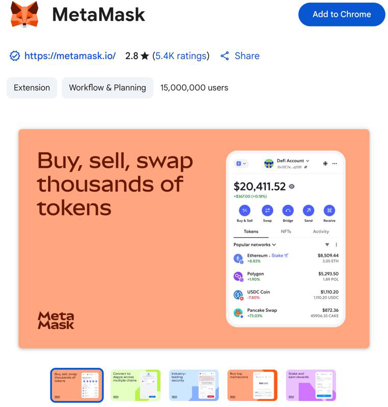

Figure 2-1. The detail page of the MetaMask Chrome extension

It's important to verify that you are downloading the real MetaMask extension because sometimes people are able to sneak malicious extensions past Google's filters. The real one does the following:

- Shows the ID `nkbihfbeogaeaoehlefnkodbefgpgknn` in the address bar

- Is offered by [*https://metamask.io*](https://metamask.io)

- Has more than 5,400 reviews

- Has more than 15 million users

Once you confirm that you are looking at the correct extension, click "Add to Chrome" to install it.

### Creating a Wallet

Once MetaMask is installed, you should see a new icon (the head of a fox) in your browser's toolbar. Click it to get started. You will be asked to accept the terms and conditions and then to create your new Ethereum wallet by entering a password (see Figure 2-2).

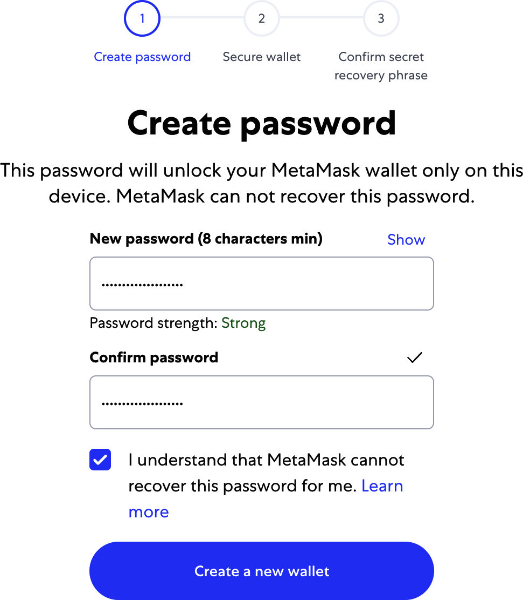

Figure 2-2. The password page of the MetaMask Chrome extension

> **Tip**  
>
> The password controls access to MetaMask so that it can't be used by anyone with access to your browser. This password is only for your local device; if an attacker gains access to the private key or seed phrase, they will be able to access the funds in your addresses. The password is not needed if the attacker has the private key or seed phrase.

Once you've set a password, MetaMask will generate a wallet for you and show you a *mnemonic backup* consisting of 12 English words (see Figure 2-3). These words can be used in any compatible wallet to recover access to your funds should something happen to MetaMask or your computer. You do not need the password for this recovery; the 12 words are sufficient.

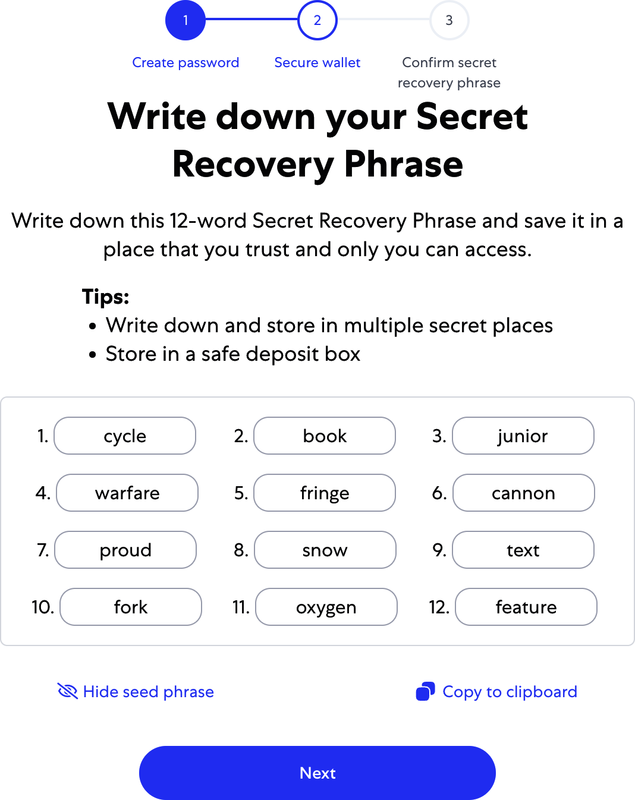

Figure 2-3. The mnemonic backup of your wallet created by MetaMask

> **Tip**  
>
> Back up your mnemonic (12 words) on paper, twice. Store the two paper backups in two separate secure locations, such as a fire-resistant safe, a locked drawer, or a safe deposit box. Treat the paper backups like cash of equivalent value to what you store in your Ethereum wallet. Anyone with access to these words can gain access to and steal your money. We will go into much more detail on how to keep your seed phrase safe in Chapter 5.

Once you have confirmed that you have stored the mnemonic securely, you'll be able to see the details of your Ethereum account, as shown in Figure 2-4.

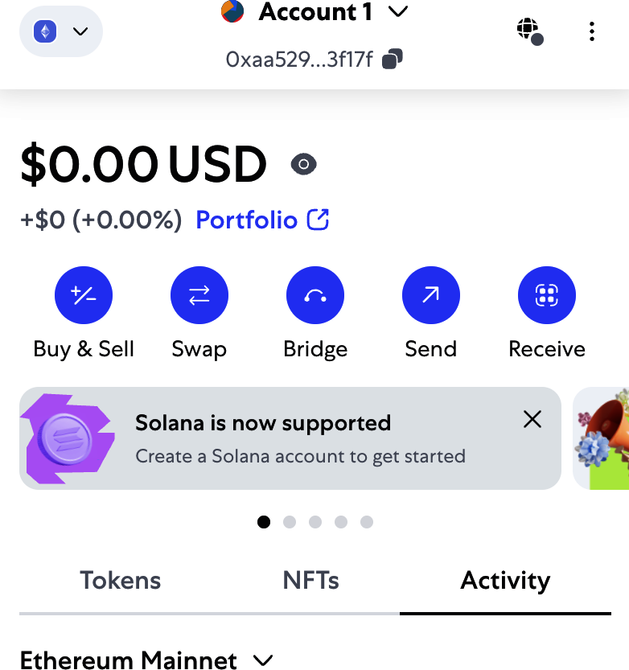

Figure 2-4. Your Ethereum account in MetaMask

> **Note**  
>
> Do not send any assets to the addresses shown in this book. The seed phrase is public for educational purposes, and every asset sent to these addresses will probably be lost.

Your account page shows the name of your account ("Account 1" by default), an Ethereum address (`0xaa529…f17f` in the example), and a colorful icon to help you visually distinguish this account from other accounts. At the top of the account page, you can see which Ethereum network you are currently working on ("Main Network" in the example).

Congratulations! You have set up your first Ethereum wallet.

### Switching Networks

As you can see on the MetaMask account page, you can choose among multiple Ethereum networks. By default, MetaMask will try to connect to the main network. The other choices are public testnets, any Ethereum node of your choice, or nodes running private blockchains on your own computer (localhost):

**Main Ethereum Network**

The main public Ethereum blockchain. Real ETH, real value, and real consequences.

**Sepolia Test Network**

Launched in October 2021 as a proof-of-authority network by Ethereum's core developers, Sepolia has since transitioned to a PoS consensus, mirroring Ethereum's mainnet environment.

**Holesky Test Network**

The Holesky Testnet is Ethereum's advanced testing ground for staking, infrastructure, and protocol development.

**Localhost 8545**

Connects to a node running on the same computer as the browser. The node can be part of any public blockchain (main or testnet) or a private testnet.

**Custom RPC**

Allows you to connect MetaMask to any node with a Geth-compatible remote procedure call (RPC) interface. The node can be part of any public or private blockchain.

> **Note**  
>
> Your MetaMask wallet uses the same private key and Ethereum address on all the networks it connects to. However, your Ethereum address balance on each Ethereum network will be different. For instance, if you use your keys to send ether on the Sepolia testnet, your balances on other networks will remain unaffected.

### Getting Some Test Ether

Your first task is to get your wallet funded. You won't be doing that on the main network because real ether costs money and handling it requires a bit more experience. For now, you'll load your wallet with some testnet ether.

Switch MetaMask to the Sepolia Test Network by clicking the Ethereum icon on the top left; toggle the option "Show test networks" and click Sepolia, as shown in Figure 2-5.

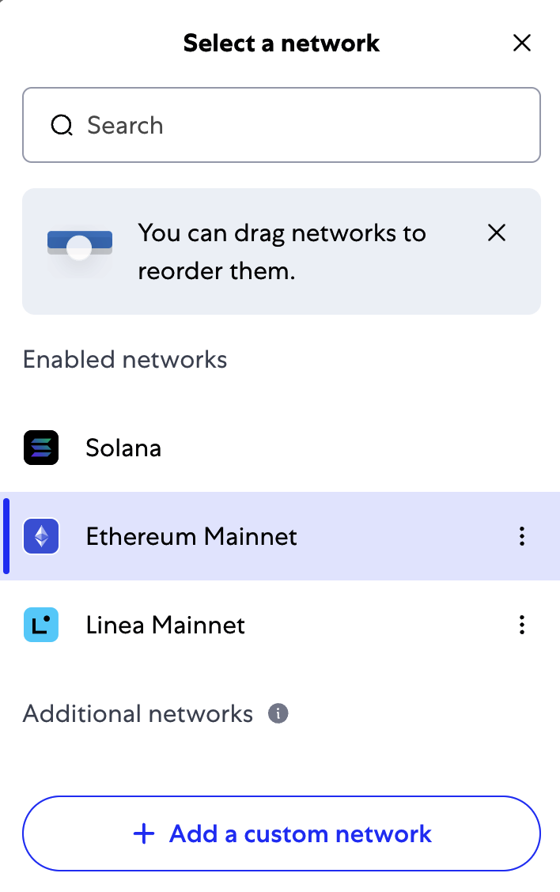

Figure 2-5. MetaMask networks

Click Buy, then navigate to one of the faucets in [this list](https://oreil.ly/VE0t0). Once you have decided which faucet you want to use—they are all pretty much equivalent—you can request ethers on the test network, as shown in Figure 2-6.

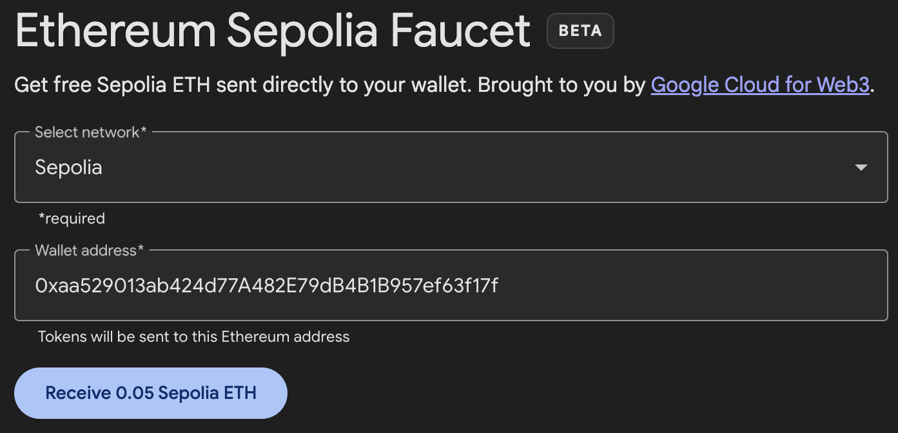

Figure 2-6. MetaMask Sepolia test faucet

The transaction ID for the request of testnet ether looks like this:

    0x471273d9417e98e7f1adaae61e53a353b2d2313de2e71fc4b6184bf5a63fa0ae

In a few seconds, the new transaction will be processed by the Sepolia network, and your MetaMask wallet will show a balance of 0.05 ETH (this depends on how much ether the faucet is willing to send). Now, click to the first transaction in your browser extension and click "View on block explorer," as shown in Figure 2-7. This will navigate to a *block explorer*, which is a website that allows you to visualize and explore blocks, addresses, and transactions.

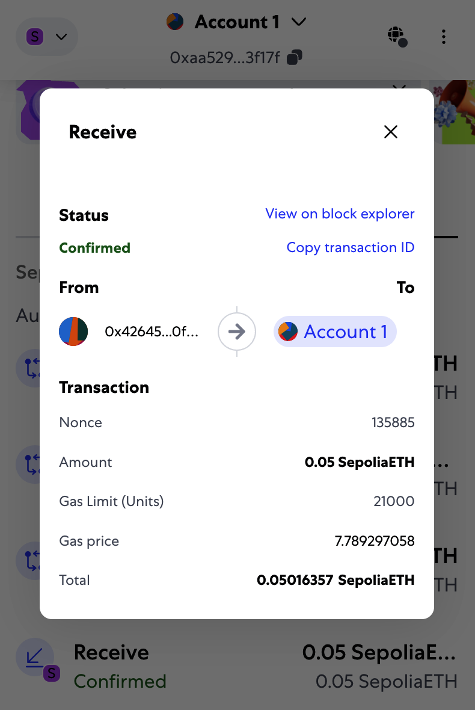

Figure 2-7. Transaction viewed from MetaMask

MetaMask uses the [Etherscan block explorer](https://etherscan.io), one of the more popular Ethereum block explorers. The transaction containing the payment from the Sepolia test faucet is shown in Figure 2-8.

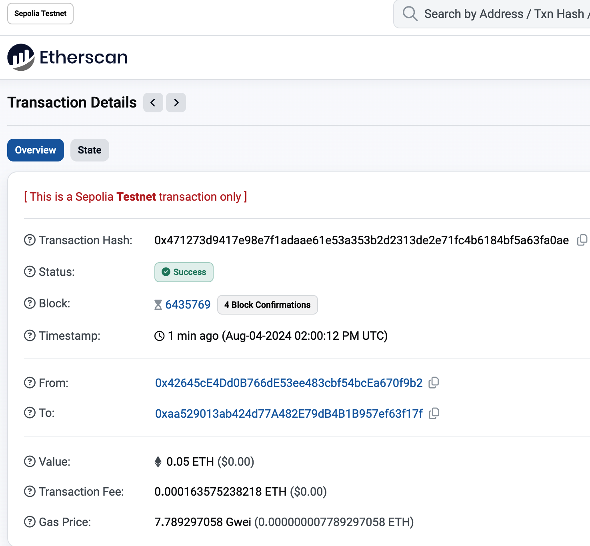

Figure 2-8. Etherscan Sepolia block explorer

The transaction has been recorded on the Sepolia blockchain and can be viewed at any time by anyone, simply by searching for the transaction ID. Try entering the transaction hash into the [*sepolia.etherscan.io* website](http://sepolia.etherscan.io) to see it for yourself:

    0x471273d9417e98e7f1adaae61e53a353b2d2313de2e71fc4b6184bf5a63fa0ae

### Sending Ether from MetaMask

Once you've received your first test ether from the Sepolia test faucet, you can experiment with sending ether by trying to send some back to the faucet or to any other address. In this example, we will be trying to send some testnet ether to Vitalik Buterin, as shown in Figure 2-9.

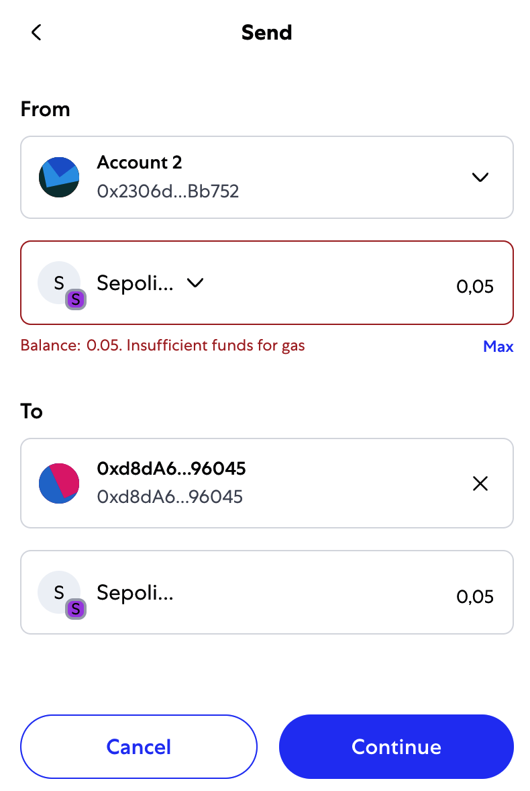

Figure 2-9. Sending 0.05 ether to an address

Oops! You probably noticed that you can't complete the transaction—MetaMask says you have an insufficient balance. At first glance, this may seem confusing: you have 0.05 ETH, you want to send 0.05 ETH, so why is MetaMask saying you have insufficient funds?

The answer is because of the cost of gas. Every Ethereum transaction requires payment of a fee, which is collected by the network to validate the transaction. The fees in Ethereum are charged in a virtual currency called *gas*. You pay for the gas with ether, as part of the transaction.

> **Note**  
>
> Fees are required on the test networks, too. Without fees, a test network would behave differently from the main network, making it an inadequate testing platform. Fees also protect the test networks from DoS attacks and poorly constructed contracts (e.g., infinite loops), much like they protect the main network.

When you send the transaction, MetaMask will calculate the average gas price of recent successful transactions—for example, at 3 gwei, which stands for gigawei. Wei is the smallest subdivision of the ether currency, as we discussed in "Ether Currency Units". The gas limit is set at the cost of sending a basic transaction: 21,000 gas units, which is the smallest amount of gas that can be used to send a transaction. Therefore, the maximum amount of ETH you will spend is 3 × 21,000 gwei = 63,000 gwei = 0.000063 ETH. (Be advised that average gas prices can fluctuate. We will see in a later chapter how you can increase or decrease your gas limit to ensure that your transaction takes precedence if need be.)

All this is to say that making a 0.05 ETH transaction costs 0.050063 ETH. Click Reject to cancel this transaction. Let's try again, this time by sending 0.01 ETH.

### Exploring the Transaction History of an Address

By now, you have become an expert in using MetaMask to send and receive test ether. Your wallet has received and sent payments. You can view all these transactions using the [*sepolia.etherscan.io* block explorer](http://sepolia.etherscan.io). You can either copy your wallet address and paste it into the block explorer's search box or have MetaMask open the page for you. Next to your account icon in MetaMask, you will see a button showing three dots. Click it to show a menu of account-related options (see Figure 2-10).

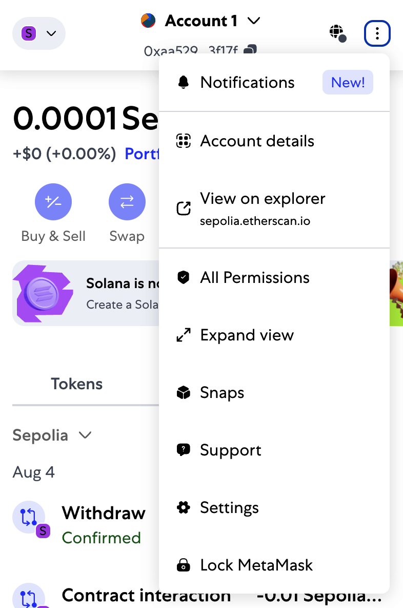

Figure 2-10. MetaMask account context menu

> **Tip**  
>
> The default settings of MetaMask are not very privacy centric. It is advisable to carefully analyze the settings found in Settings → Security and Privacy. Once you are familiar with how MetaMask works, it is also advisable to change the Ethereum mainnet network from the default one to one that uses an RPC with privacy settings that suit your needs. The most private solution would be to have your own node with an RPC to which you can connect; we will see how to do that in Chapter 3.

Select "View account on Etherscan" to open a web page in the block explorer showing your account's transaction history, as shown in Figure 2-11.

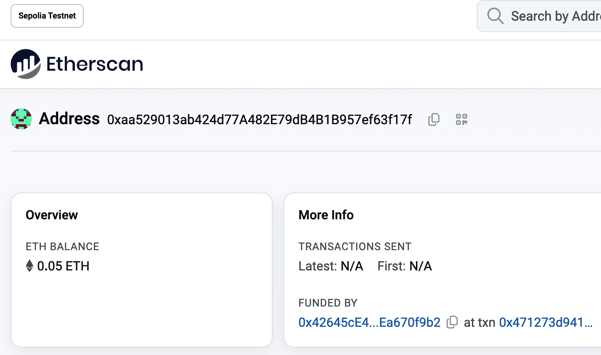

Figure 2-11. Address transaction history on Etherscan

Here you can see the entire transaction history of your Ethereum address. It shows all the transactions recorded on the Sepolia blockchain where your address is the sender or recipient. Click on a few of these transactions to see more details.

> **Warning**  
>
> Beware, there is a known attack, called *address poisoning*, that can display transactions with spoofed addresses on the block explorer. The block explorer should be used for a quick check, but the information shown might not be accurate.

You can explore the transaction history of any address. Take a look at the transaction history of the Sepolia test faucet address (hint: it is the "sender" address listed in the oldest payment to your address). You can see all the test ether sent from the faucet to you and to other addresses. Every transaction you see can lead you to more addresses and more transactions. Before long, you will be lost in the maze of interconnected data. Public blockchains contain an enormous wealth of information, all of which can be explored programmatically, as we will see in future examples.

## Introducing the World Computer

You've now created a wallet and sent and received ether. So far, we've treated Ethereum as a cryptocurrency. But Ethereum is much, much more. In fact, the cryptocurrency function is subservient to Ethereum's function as a decentralized world computer. Ether is meant to be used to pay for running *smart contracts*, which are computer programs that run on an emulated computer called the *EVM*.

The EVM is a global singleton, meaning that it operates as if it were a global single-instance computer, running everywhere. Each node on the Ethereum network runs a local copy of the EVM to validate contract execution, while the Ethereum blockchain records the changing *state* of this world computer as it processes transactions and smart contracts. We'll discuss this in much greater detail in Chapter 14.

## Externally Owned Accounts and Contracts

The type of account you created in the MetaMask wallet is called an *externally owned account* (EOA). EOAs are those that have a private key; having the private key means control over access to funds or contracts.

You're probably guessing that there is another type of account. That other type of account is a *contract account*. A contract account has smart contract code, which a simple EOA can't have. Furthermore, a contract account does not have a private key. Instead, it is owned (and controlled) by the logic of its smart contract code: the software program recorded on the Ethereum blockchain at the contract account's creation and executed by the EVM.

Contracts have addresses, just like EOAs. Contracts can also send and receive ether, just like EOAs. However, when a transaction destination is a contract address, it causes that contract to *run* in the EVM, using the transaction—and the transaction's data—as its input. In addition to ether, transactions can contain *data* indicating which specific function in the contract to run and what parameters to pass to that function. In this way, transactions can *call* functions within contracts.

Note that because a contract account does not have a private key, it cannot *initiate* a transaction. Only EOAs can initiate transactions, but contracts can *react* to transactions by calling other contracts, building complex execution paths.

In the next few sections, we will write our first contract. You will then learn how to create, fund, and use that contract with your MetaMask wallet and test ether on the Sepolia test network.

## A Simple Contract: A Test Ether Faucet

Ethereum has a few different high-level languages, all of which can be used to write a contract and produce EVM bytecode. You can read about the most prominent and interesting ones in Chapter 7. One high-level language is by far the dominant choice for smart contract programming: Solidity. Solidity was created by Gavin Wood and has become the most widely used language in Ethereum (and beyond). We'll use Solidity to write our first contract.

For our first example (Example 2-1), we will write a contract that controls a faucet. You've already used a faucet to get test ether on the Sepolia test network. A *faucet* is a relatively simple thing: it gives out ether to any address that asks and can be refilled.

##### Example 2-1. *Faucet.sol*: a Solidity contract implementing a faucet

```solidity
pragma solidity 0.8.26;
// SPDX-License-Identifier: GPL-3.0

// Our first contract is a faucet!
contract Faucet {

    // Give out ether to anyone who asks
    function withdraw(uint256 _withdrawAmount, address payable _to) public {

        // Limit withdrawal amount
        require(_withdrawAmount <= 1000000000000);

        // Send the amount to the address that requested it
        _to.transfer(_withdrawAmount);
    }

    // Function to receive Ether. msg.data must be empty
    receive() external payable {}

    // Fallback function is called when msg.data is not empty
    fallback() external payable {}
}
```

This is a very simple contract, about as simple as we can make it. It is also a *flawed* contract, demonstrating a number of bad practices and security vulnerabilities. We will learn by examining many of its flaws in later sections. But for now, let's look at what this contract does and how it works, line by line. You will quickly notice that many elements of Solidity are similar to existing programming languages, such as JavaScript, Java, or C++.

The first line is the `pragma` statement:

    pragma solidity 0.8.26;

By including this line at the top of a Solidity source file, you ensure that the code is compiled with version 0.8.26 of the Solidity compiler, ensuring compatibility and avoiding potential issues that might arise from using a different compiler version.

Next is a comment indicating that the smart contract is licensed under the GPL-3.0 license:

    // SPDX-License-Identifier: GPL-3.0

This is important for legal and compliance reasons because it informs users and developers about their rights and obligations concerning the use and distribution of the code.

Comments are for humans to read and are not included in the executable EVM bytecode. We usually put them on the line before the code we are trying to explain, or sometimes on the same line. Comments start with two forward slashes: `//`. Everything from the first slash until the end of that line is treated the same as a blank line and ignored.

This is also a comment:

    // Our first contract is a faucet!

The next line is where our actual contract starts:

    contract Faucet {

This line declares a `contract` object, similar to a `class` declaration in other object-oriented languages. The contract definition includes all the lines between the curly braces (`{}`), which define a *scope*, much like how curly braces are used in many other programming languages.

Next, we declare the first function of the `Faucet` contract:

    function withdraw(uint256 _withdrawAmount, address payable _to) public {

The function is named `withdraw`, and it takes one unsigned integer (`uint256`) named `_withdrawAmount` and an `address payable` named `_to`. It is declared as a public function, meaning it can be called by other contracts. The function definition follows, between curly braces. The first part of the `withdraw` function sets a limit on withdrawals:

    require(_withdrawAmount <= 1000000000000);

It uses the built-in Solidity function `require` to test a precondition: that the `_withdrawAmount` is less than or equal to 1,000,000,000,000 wei, which is the base unit of ether (see Table 2-1) and equivalent to 0.000001 ether. If the `withdraw` function is called with a `withdraw_amount` greater than that amount, the `require` function here will cause contract execution to stop and fail with an *exception*. Note that statements need to be terminated with a semicolon in Solidity.

This part of the contract is the main logic of our faucet. It controls the flow of funds out of the contract by placing a limit on withdrawals. It's a very simple control but can give you a glimpse of the power of a programmable blockchain: decentralized software controlling money.

Here we have the first design flaw of the contract. It is not a security flaw, but it would be better to always add an error message to the `require` statement. This way, when a user's transaction fails due to a `require` statement, the reason is clear.

The corrected `require` statement is:

    require(_withdrawAmount <= 1000000000000, "The requested amount is too much, try a smaller amount!");

Next comes the actual withdrawal:

    _to.transfer(_withdrawAmount);

A couple of interesting things are happening here. The function `transfer` is a built-in function that transfers ether from the current contract to another specified address—in this case, the `_to` address. The `transfer` function takes an amount as its only argument. We pass the `_withdrawAmount` value that was the parameter to the `withdraw` function declared a few lines earlier.

This is possible because the `_to` address was defined as payable. The built-in functions `transfer` and `send` can be called only on payable addresses. Here is the second flaw in the code: while `transfer` is perfectly fine if an EOA calls the `withdraw` function, it becomes problematic if another contract triggers this function. In that case, the transaction might fail because the `transfer` function can utilize only up to 2,300 gas, and multiple contract calls will likely exceed this limit. To fix this issue, you can use the built-in `call` function instead of `transfer` and `send`. However, this built-in function needs to be handled properly to avoid security flaws. For now, we will leave the built-in `transfer` function as is.

The very next line is the closing curly brace, indicating the end of the definition of our `withdraw` function.

Next, we declare two more functions:

    receive() external payable {}
    fallback() external payable {}

These functions are the `fallback` and `receive` functions, which are called if the transaction that triggered the contract didn't name any of the declared functions in the contract, or any function at all, or didn't contain data. Contracts can have these functions and are usually the ones that receive ether. When *msg.data* is empty, the `receive` function will be triggered; when *msg.data* is not empty, the `fallback` function will be triggered.

Right below our `fallback` function is the final closing curly brace, which closes the definition of the contract `Faucet`. That's it!

## Compiling the Faucet Contract

Now that we have our first example contract, we need to use a Solidity compiler to convert the Solidity code into EVM bytecode so that it can be executed by the EVM on the blockchain itself.

The Solidity compiler comes as a standalone executable, as part of various frameworks, and bundled in IDEs. To keep things simple, we will use one of the more popular IDEs: Remix.

Use your Chrome browser (with the MetaMask wallet you installed earlier) to navigate to the [Remix IDE](https://remix.ethereum.org).

When you first load Remix, it will start with a sample contract called *Storage.sol*. We don't need that, so close it by clicking the `x` on the corner of the tab, as seen in Figure 2-12.

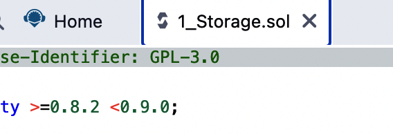

Figure 2-12. Closing the default example tab

Now, create a new file, as shown in Figure 2-13. Name the new file *Faucet.sol*.

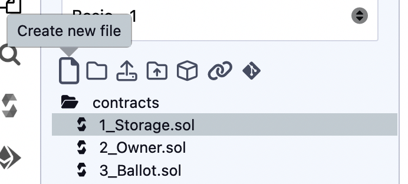

Figure 2-13. Creating a new contract

Once you have the new tab open, copy and paste the code from our example *Faucet.sol*, as shown in Figure 2-14.

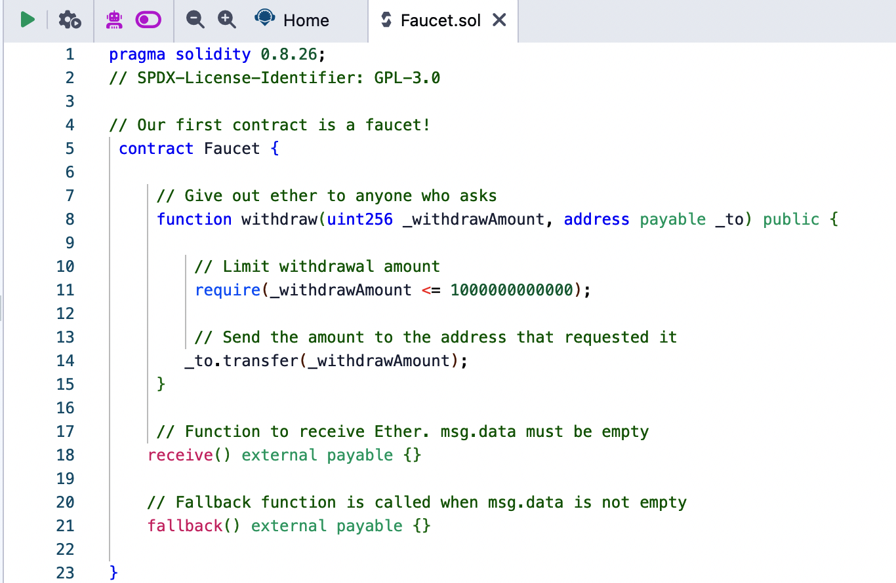

Figure 2-14. Copying the Faucet example code into the new contract

Once you have loaded the *Faucet.sol* contract into the Remix IDE, navigate to the compile section of Remix and click Compile *Faucet.sol*. If all goes well, you will see a green box (see Figure 2-15).

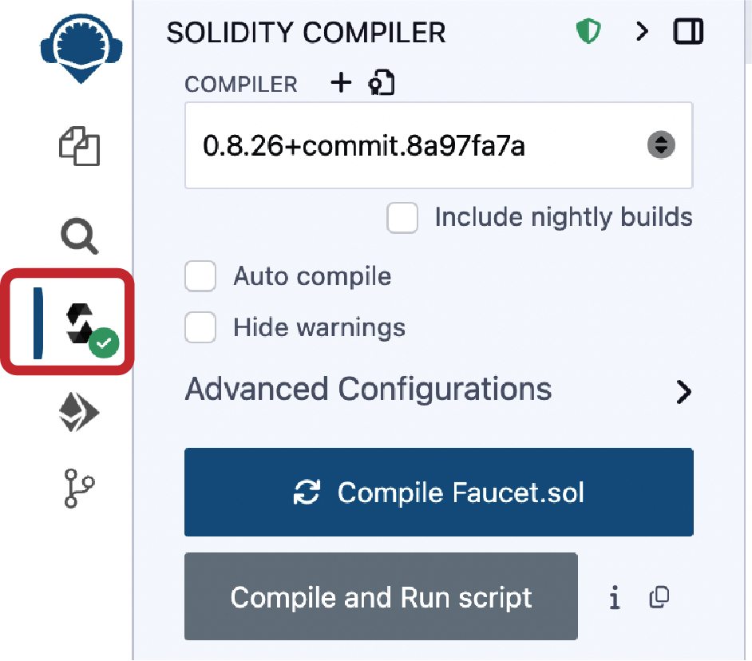

Figure 2-15. Remix successfully compiles the *Faucet.sol* contract

If something goes wrong, the most likely problem is that the Remix IDE is using a version of the Solidity compiler that is different from 0.8.26. In that case, our `pragma` directive will prevent *Faucet.sol* from compiling. To change the compiler version, go to the Compiler tab, set the version to 0.8.26, and try again.

The Solidity compiler has now compiled our *Faucet.sol* into EVM bytecode. If you are curious, the bytecode looks like this:

    6080604052348015600e575f80fd5b506101af8061001c5f395ff3fe608060405260043610610020575f3560
    e01c8062f714ce1461002957610027565b3661002757005b005b348015610034575f80fd5b5061004f600480
    360381019061004a919061013b565b610051565b005b64e8d4a51000821115610062575f80fd5b8073ffffff
    ffffffffffffffffffffffffffffffffff166108fc8390811502906040515f60405180830381858888f19350
    5050501580156100a5573d5f803e3d5ffd5b505050565b5f80fd5b5f819050919050565b6100c0816100ae56
    5b81146100ca575f80fd5b50565b5f813590506100db816100b7565b92915050565b5f73ffffffffffffffff
    ffffffffffffffffffffffff82169050919050565b5f61010a826100e1565b9050919050565b61011a816101
    00565b8114610124575f80fd5b50565b5f8135905061013581610111565b92915050565b5f80604083850312
    15610151576101506100aa565b5b5f61015e858286016100cd565b925050602061016f85828601610127565b
    915050925092905056fea26469706673582212207de2f4d88c747c9332dceef5dcd739f3380ec8a8c2167a29
    2ba64ee24fa32a8a64736f6c634300081a0033

Aren't you glad you are using a high-level language like Solidity instead of programming directly in EVM bytecode? Us too!

## Creating the Contract on the Blockchain

So, we have a contract. We've compiled it into bytecode. Now, we need to "register" the contract on the Ethereum blockchain. We will be using the Sepolia testnet to test our contract, so that's the blockchain we want to submit it to.

Registering a contract on the blockchain involves creating a special transaction whose `to` field is left empty (null). This empty destination signals to the Ethereum blockchain that you want to deploy a new contract rather than send a transaction to an existing address. The transaction's `data` field contains the compiled contract bytecode. Fortunately, the Remix IDE will handle all of that for you and send the transaction to MetaMask.

First, switch to the Run tab and select Injected Web3 in the Environment drop-down selection box. This connects the Remix IDE to the MetaMask wallet and, through MetaMask, to the Sepolia test network. Once you do that, you can see Sepolia under Environment. Also, the Account selection box shows the address of your wallet (see Figure 2-16).

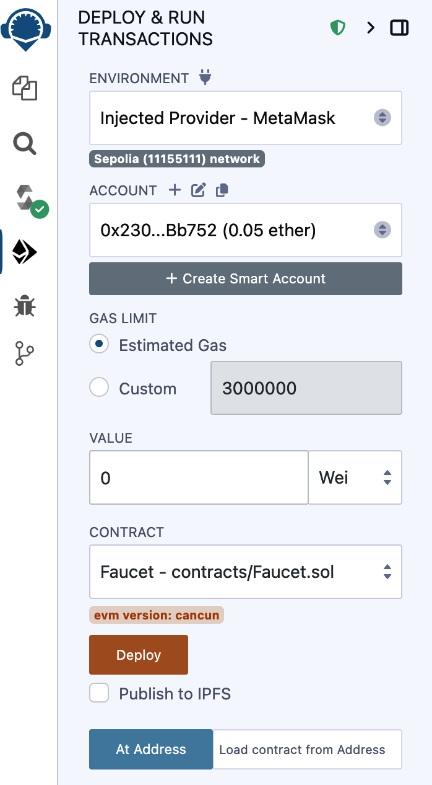

Figure 2-16. Remix IDE Run tab with Injected Web3 environment selected

Right below the Run settings you just confirmed is the `Faucet` contract, ready to be created. Click the Deploy button shown in Figure 2-16.

Remix will construct the special "creation" transaction, and MetaMask will ask you to approve it, as shown in Figure 2-17. You'll notice that the contract-creation transaction has no ether in it, but it has some bytes of data (the compiled contract) and will consume some gwei in gas. Click Submit to approve it.

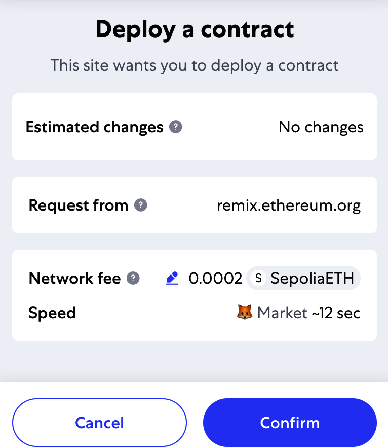

Figure 2-17. MetaMask showing the contract creation transaction

Now you have to wait. It will take about 15–30 seconds for the contract to be processed on Sepolia. Remix won't appear to be doing much, but be patient.

Once the contract is created, it appears at the bottom of the Run tab (see Figure 2-18).

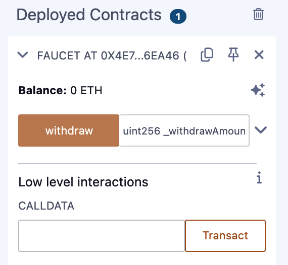

Figure 2-18. The Faucet contract is alive!

Notice that the `Faucet` contract now has an address of its own: Remix shows it as "Faucet at 0x4E7…6EA46" (although your address—the random letters and numbers—will be different).

## Interacting with the Contract

Let's recap what we've learned so far. Ethereum contracts are programs that control money, which run inside a virtual machine called the EVM. They are created by a special transaction that submits their bytecodes to be recorded on the blockchain. Once they are created on the blockchain, they have an Ethereum address, just like wallets. Anytime someone sends a transaction to a contract address, it causes the contract to run in the EVM, with the transaction as its input. Transactions sent to contract addresses may have ether or data or both. If they contain ether, it is "deposited" to the contract balance. If they contain data, the data can specify a named function in the contract and call it, passing arguments to the function.

### Viewing the Contract Address in a Block Explorer

We now have a contract recorded on the blockchain, and we can see it has an Ethereum address. Let's check it out in the [*sepolia.etherscan.io* block explorer](http://sepolia.etherscan.io) and see what a contract looks like. In the Remix IDE, copy the address of the contract by clicking the icon next to its name (see Figure 2-19).

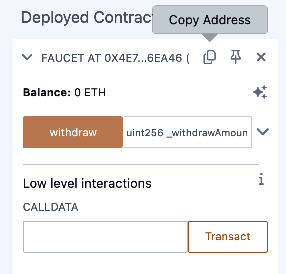

Figure 2-19. Copying the contract address from Remix

Keep Remix open; we'll come back to it later. Now, navigate your browser to [*sepolia.etherscan.io*](http://sepolia.etherscan.io) and paste the address into the search box. You should see the contract's Ethereum address history, as shown in Figure 2-20.

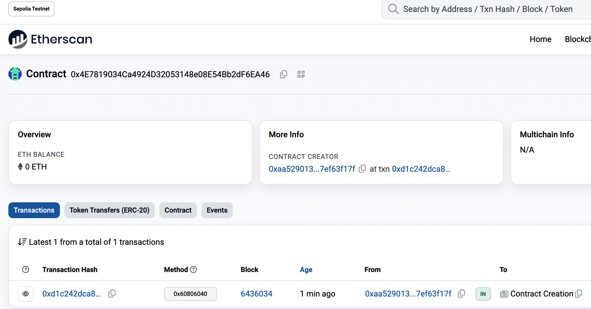

Figure 2-20. Viewing the Faucet contract address in the Etherscan block explorer

### Funding the Contract

For now, the contract has only one transaction in its history: the contract-creation transaction. As you can see, the contract also has no ether (zero balance). That's because we didn't send any ether to the contract in the creation transaction, even though we could have.

Our faucet needs funds! Our first project will be to use MetaMask to send ether to the contract. You should still have the address of the contract in your clipboard (if not, copy it again from Remix). Open MetaMask and send 0.01 ether to it, exactly as you would to any other Ethereum address (see Figure 2-21).

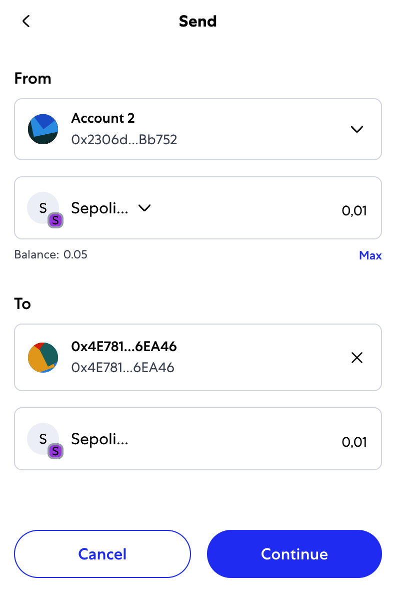

Figure 2-21. Sending 0.01 ether to the contract address

In a minute, if you reload the Etherscan block explorer, it will show another transaction to the contract address and an updated balance of 0.01 ether.

Remember the `receive` function in our *Faucet.sol* code? It looked like this:

    receive() external payable {}

When you send the transaction to the contract address, with no data specifying which function to call, it calls this `receive` function. Your transaction caused the contract to run in the EVM, updating its balance. You have funded your faucet!

### Withdrawing from Our Contract

Next, let's withdraw some funds from the faucet. To withdraw, we have to construct a transaction that calls the `withdraw` function and passes a `_withdrawAmount` and a `_to` argument to it. To keep things simple for now, Remix will construct that transaction for us, and MetaMask will present it for our approval.

Return to the Remix tab and look at the contract on the Run tab. You should see a red box labeled "withdraw" with a field entry labeled "uint256 \_withdrawAmount, address \_to" (see Figure 2-22).


Figure 2-22. The withdraw function of *Faucet.sol* in Remix

This is the Remix interface to the contract. It allows us to construct transactions that call the functions defined in the contract. We will enter a `_withdrawAmount` and a `_to` address and click the withdraw button to generate the transaction.

First, let's figure out the `_withdrawAmount`. We want to try to withdraw 0.000001 ether, which is the maximum amount allowed by our contract. Remember that all currency values in Ethereum are denominated in wei internally, and our `withdraw` function expects the `_withdrawAmount` to be denominated in wei, too. The amount we want is 0.000001 ether, which is 1,000,000,000,000 wei (a 1 followed by 12 zeros).

For the `_to` address we will just use our Account 1 in MetaMask.

> **Tip**  
>
> Due to a limitation in JavaScript, a number as large as 10^17^ cannot be processed by Remix. Instead, we enclose it in quotation marks to allow Remix to receive it as a string and manipulate it as a `BigNumber`. If we don't enclose it in quotes, the Remix IDE will fail to process it and display "Error encoding arguments: Error: Assertion failed."

Type `"1000000000000"` (with the quotes) into the `_withdrawAmount` box, copy-paste your Account 1 address from MetaMask, and click the transact button. (You might see it as the withdraw button. Figure 2-23 shows an expanded view of the function; if your view is not expanded, then the button will be called "withdraw.")

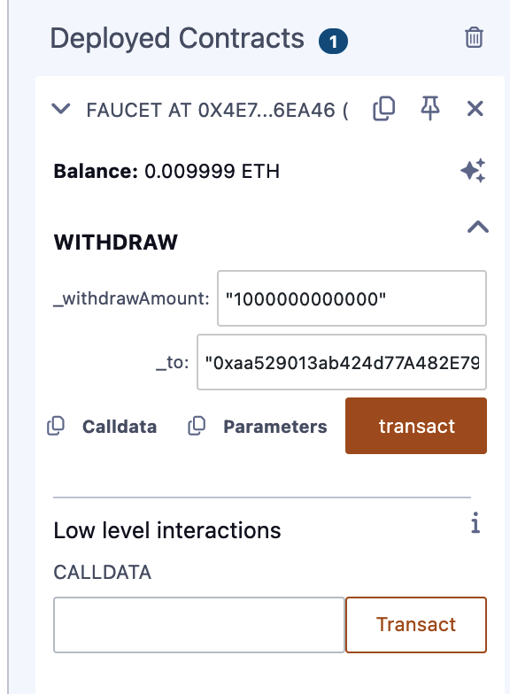

Figure 2-23. Click transact in Remix to create a withdrawal transaction

MetaMask will pop up a transaction window for you to approve. Click Submit to send your withdrawal call to the contract (see Figure 2-24).

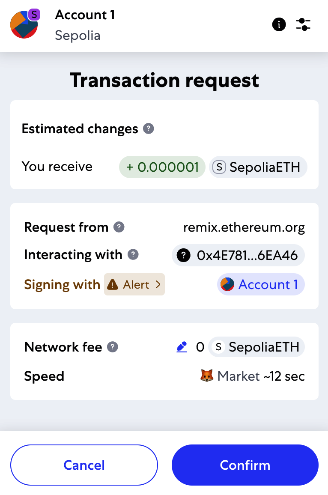

Figure 2-24. MetaMask transaction to call the withdraw function

Wait a minute and then reload the Etherscan block explorer to see the transaction reflected in the `Faucet` contract address history (see Figure 2-25).

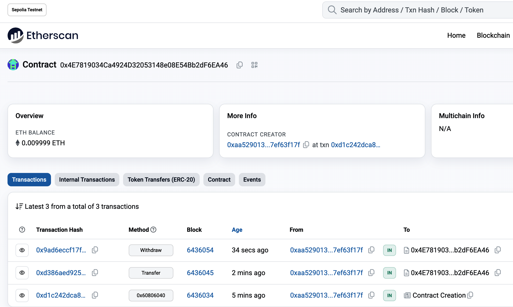

Figure 2-25. Etherscan shows the transaction calling the withdraw function

We now see a new transaction with the contract address as the destination and a value of 0 ether. The contract balance has changed and is now 0.009999 ether because it sent us 0.000001 ether as requested.

But we don't see an "OUT" transaction in the contract address history. Where's the outgoing withdrawal? A new tab named Internal Transactions has appeared on the contract's address history page. Because the 0.000001 ether transfer originated from the contract code, it is an internal transaction (also called a *message*). Click that tab to see it (see Figure 2-26).

This "internal transaction" was sent by the contract in this line of code (from the `withdraw` function in *Faucet.sol*):

    _to.transfer(_withdrawAmount);

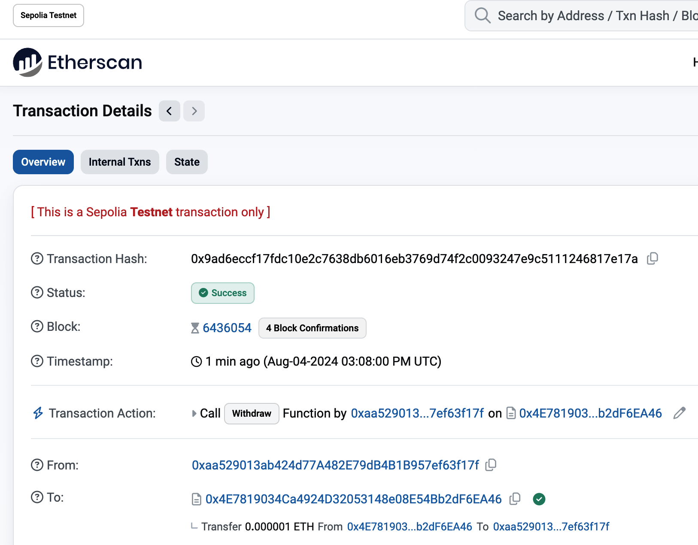

Figure 2-26. Etherscan shows the internal transaction transferring ether out from the contract

To recap: you sent a transaction from your MetaMask wallet that contained data instructions to call the `withdraw` function with a `_withdrawAmount` argument of 0.000001 ether and an address. That transaction caused the contract to run inside the EVM. As the EVM ran the `Faucet` contract's `withdraw` function, it first called the `require` function and validated that the requested amount was less than or equal to the maximum allowed withdrawal of 0.000001 ether. Then, it called the `transfer` function to send you the ether. Running the `transfer` function generated an internal transaction that deposited 0.000001 ether into your wallet address from the contract's balance. That's the one shown on the Internal Transactions tab in Etherscan.

## Conclusion

In this chapter, you set up a wallet using MetaMask and funded it using a faucet on the Sepolia test network. You received ether into your wallet's Ethereum address, and then you sent ether to another address.

Next, you wrote a `Faucet` contract in Solidity. You used the Remix IDE to compile the contract into EVM bytecode, then used Remix to form a transaction and created the `Faucet` contract on the Sepolia blockchain. Once created, the `Faucet` contract had an Ethereum address, and you sent it some ether. Finally, you constructed a transaction to call the `withdraw` function and successfully asked for 0.000001 ether. The contract checked the request and sent you 0.000001 ether with an internal transaction.

It may not seem like much, but you've just successfully interacted with software that controls money on a decentralized world computer.

We will do a lot more Solidity smart contract programming in Chapter 7 and learn about best practices and security considerations in Chapter 9.
