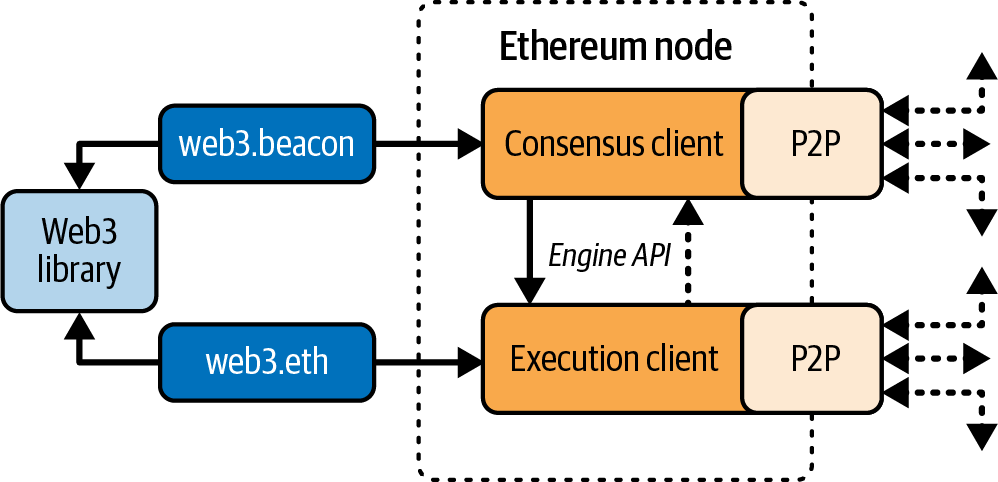

# Chapter 3. Ethereum Nodes

An Ethereum node is a software application that implements the Ethereum specification and communicates over the P2P network with other Ethereum nodes.

Initially, a node only had to run a single client to completely implement all the requirements to be part of the Ethereum ecosystem. On September 15, 2022, The Merge hard fork happened, changing the consensus protocol from a PoW-based scheme to Gasper, the new PoS-based consensus protocol. This also led to the separation of concerns—consensus and execution—and the creation of a new type of Ethereum client: a consensus client.

And so, at the time of writing, an Ethereum node must run two pieces of software at the same time to be compatible with the latest spec, as shown in Figure 3-1, with the definitions as follows:

**Consensus client**

This new software is now in charge of the consensus protocol that lets all nodes agree on a single history of the blockchain.

**Execution client**

This software focuses on receiving all the blocks and transactions happening on the network, executing them inside the EVM, and verifying their correctness.



Different Ethereum clients—both execution and consensus clients—interoperate if they comply with the reference specification and the standardized communication protocols. While these different clients are implemented by different teams and in different programming languages, they all “speak” the same protocol and follow the same rules. As such, they can all be used to operate and interact with the same Ethereum network.

Ethereum is an open source project, and the source code for all major clients is available under open source licenses (e.g., LGPL v3.0), free to download and use for any purpose. Open source means more than simply free to use, though. It also means that Ethereum is developed by an open community of volunteers and can be modified by anyone. More eyes mean more trustworthy code.

Ethereum was originally defined by a single formal specification called the “Yellow Paper,” which was written by one of the original coauthors of this book, Gavin Wood. Even though this specification is periodically updated as major changes are made to Ethereum, there is a clear path toward two different reference implementations, one for execution clients and one for consensus clients. These reference implementations are written in Python and prioritize readability and simplicity.

> **Note**  
>
> These specs are not intended to be full-node implementations. They serve as executable pseudocode specifications.

This is in contrast to Bitcoin, for example, which is not defined in any formal way. Where Bitcoin’s “specification” is the reference implementation Bitcoin Core, Ethereum’s execution specification is documented in a paper that combines an English and a mathematical (formal) specification. This formal specification, in addition to various Ethereum Improvement Proposals (EIPs) and the new consensus specification written in Python, defines the standard behavior of an Ethereum node.

As a result of Ethereum’s clear formal specification, there are a number of independently developed yet interoperable software implementations of an Ethereum client. Ethereum has a greater diversity of implementations running on the network than any other blockchain, which is generally regarded as a good thing. Indeed, this has, for example, proven to be an excellent way of defending against attacks on the network because exploitation of a particular client’s implementation strategy simply hassles the developers while they patch the exploit, while other clients keep the network running almost unaffected.

## Ethereum Networks

A variety of Ethereum-based networks exist that largely conform to the formal specification defined in the original Ethereum “Yellow Paper” but that may or may not interoperate with one another.

Several EVM-compatible chains, such as Ethereum Classic, BNB Chain, and Polygon, share large portions of the execution spec, though many deviate in consensus and parameters. While they are mostly compatible at the protocol level, these networks often have features or attributes that require maintainers of Ethereum client software to make small changes to support each network. Because of this, not every version of Ethereum client software runs every Ethereum-based blockchain.

As of June 2025, there are five main implementations of the Ethereum execution protocol, written in four different languages, and five implementations of the Ethereum consensus protocol, written in five different languages:

The execution clients are:

- Geth, written in Go
- Nethermind, written in C#
- Besu, written in Java
- Erigon, written in Go
- Reth, written in Rust

The consensus clients are:

- Lighthouse, written in Rust
- Lodestar, written in TypeScript
- Nimbus, written in Nim
- Prysm, written in Go
- Teku, written in Java

In this section, we will look at the following two execution clients:

**Geth**

The oldest and most widely used execution client, maintained by the Ethereum Foundation

**Reth**

A new Rust-based execution client created by Paradigm after Parity/OpenEthereum was discontinued

And we will look at the following two consensus clients:

**Prysm**

The first consensus client, now maintained by Offchain Labs

**Lighthouse**

The most used consensus client, maintained by Sigma Prime

We’ll show how to set up a node using each client. Specifically, we’ll use the Geth-Prysm and Reth-Lighthouse combinations, and we’ll explore some of their command-line options and APIs.

> **Note**  
>
> These pairs are just examples; you can choose to combine whatever execution and consensus clients you like the most to run an Ethereum node.

## Should I Run a Full Node?

The health, resilience, and censorship resistance of blockchains depend on them having many independently operated and geographically dispersed full nodes—that is, nodes that download the entirety of the blockchain and keep data indefinitely. Each full node can help other new nodes obtain the block data to bootstrap their operations as well as offer the operator an authoritative and independent verification of all transactions and contracts.

> **Note**
>
> To be really precise, there is a distinction between these nodes:  
>
> **Archive nodes**  
> Ethereum nodes that keep all data indefinitely  
>
> **Full nodes**  
> Ethereum nodes that discard historical state and receipts—usually the default option when you spin up a node

However, running a full node will incur a cost in hardware resources and bandwidth. A full node must download at least 2 TB of data (as of June 2025, depending on the client configuration) and store it on a local hard drive. This data burden increases quite rapidly every day as new transactions and blocks are added. We discuss this topic in greater detail in the later section “Hardware Requirements for a Full Node”.

A full node running on a live mainnet network is not necessary for Ethereum development. You can do almost everything you need to do with a testnet node (which connects you to one of the smaller public test blockchains), with a local private blockchain like Anvil, or with a hosted node API offered by a service provider like Infura or Alchemy.

You also have the option of running a remote client, which does not store a local copy of the blockchain or validate blocks and transactions. These clients offer the functionality of a wallet and can create and broadcast transactions. Remote clients can be used to connect to existing networks, such as your own full node, a public blockchain, a public or permissioned (proof-of-authority) testnet, or a private local blockchain. In practice, you will likely use a remote client, such as MetaMask, Rabby Wallet, or Coinbase Wallet, as a convenient way to switch between all the different node options.

The terms remote client and wallet are used interchangeably, although there are some differences. Usually, a remote client offers an API (such as the web3.js API) in addition to the transaction functionality of a wallet.

Do not confuse the concept of a remote client in Ethereum with that of a light client (which is analogous to a Simplified Payment Verification [SPV] client in Bitcoin). Light clients validate block headers and use Merkle proofs to validate the inclusion of transactions in the blockchain and determine their effects, giving them a similar level of security as a full node. Conversely, Ethereum remote clients do not validate block headers or transactions. They entirely trust a full node to give them access to the blockchain and hence lose significant security and anonymity guarantees. You can mitigate these problems by using a full node you run yourself.

### Full Node Advantages and Disadvantages

Choosing to run a full node helps with the operation of the networks you connect it to but also incurs some mild to moderate costs for you. Let’s look at some of the advantages and disadvantages.

**Advantages**:

- Supports the resilience and censorship resistance of Ethereum-based networks
- Authoritatively validates all transactions
- Can interact with any contract on the public blockchain without an intermediary
- Can directly deploy contracts into the public blockchain without an intermediary
- Can query (read only) the blockchain status (accounts, contracts, etc.) offline
- Can query the blockchain without letting a third party know the information you’re reading

**Disadvantages**:

- Requires significant and growing hardware and bandwidth resources
- May require several days to fully sync when first started
- Must be maintained, upgraded, and kept online to remain synced

### Public Testnet Advantages and Disadvantages

Whether or not you choose to run a full node, you will probably want to run a public testnet node. Let’s look at some of the advantages and disadvantages of using a public testnet.

**Advantages:**

- A testnet node needs to sync and store much less data—about 100–300 GB depending on the network (as of June 2025).
- A testnet node can fully sync in a few hours.
- Deploying contracts or making transactions requires test ether, which has no value and can be acquired for free from several “faucets.”
- Testnets are public blockchains with many other users and contracts, running “live.”

**Disadvantages:**

- You can’t use “real” money on a testnet; it runs on test ether. Consequently, you can’t test security against real adversaries, as there is nothing at stake.
- There are some aspects of a public blockchain that you cannot test realistically on a testnet. For example, transaction fees, although necessary to send transactions, are not a consideration on a testnet, since gas is free (meaning that testnet ETH doesn’t have any real economic value). Further, the testnets do not experience network congestion like the public mainnet sometimes does.
- Some testnets are designed for specific purposes, and they could be slightly different than Ethereum mainnet.

### Local Blockchain Simulation Advantages and Disadvantages

For many testing purposes, the best option is to launch a single-instance private blockchain. Anvil is one of the most popular local blockchain simulations that you can run and interact with without any other participants.

**Advantages:**

- No syncing and almost no data on disk; you produce the first block yourself.
- No need to obtain test ether; you “award” yourself block rewards that you can use for testing.
- No other users, just you.
- No other contracts, just the ones you deploy after you launch it.

**Disadvantages:**

- Having no other users means that your local chain doesn’t behave the same as a public blockchain. There’s no competition for transaction space or sequencing of transactions.
- No block producers other than you means that block production is more predictable; therefore, you can’t test some scenarios that occur on a public blockchain. It’s worth mentioning that Anvil (and other tools like Hardhat) let you configure the block production modes to try to reproduce mainnet-like behavior, but still, it’s not the same as being on Ethereum mainnet.
- Having no other contracts means you have to deploy everything you want to test, including dependencies and contract libraries. Luckily for you, tools like Anvil let you fork the Ethereum mainnet chain at arbitrary blocks and experiment with your smart contracts in a mainnet-like state.

## Running an Ethereum Node

If you have the time and resources, you should attempt to run a full node, even if only to learn more about the process. In this section, we cover how to download, compile, and run the Ethereum clients Geth-Prysm and Reth-Lighthouse. This requires some familiarity with using the command-line interface (CLI) on your operating system. It’s worth installing these clients, whether you choose to run them as full nodes, as testnet nodes, or as clients to a local private blockchain.

### Hardware Requirements for a Full Node

Before we get started, you should ensure that you have a computer with sufficient resources to run an Ethereum full node. You will need at least 2 TB of disk space to store a full copy of the Ethereum blockchain. If you also want to run a full node on the Ethereum testnet, you will need at least an additional 100–400 GB. Downloading 2 TB of blockchain data can take a long time, so it’s recommended that you work on a fast internet connection.

Syncing the Ethereum blockchain is very input/output (I/O) intensive. It is best to have a solid-state drive (SSD). If you have a mechanical hard-disk drive (HDD), you will need at least 8 GB of RAM to use as cache. Otherwise, you may discover that your system is too slow to keep up and fully sync.

Here is a summary of the minimum requirements to sync a full copy of an Ethereum-based blockchain:

- CPU with 2 or more cores
- At least 2 TB free storage space
- 8 GB RAM minimum with an SSD, or 8+ GB if you have an HDD (SSD is highly preferable)
- 7+ Mbps download internet service

If you want to sync in a reasonable amount of time and store all the development tools, libraries, clients, and blockchains we discuss in this book, you will want a more capable computer. Here are our recommended specifications:

- Fast CPU with 4+ cores—a higher clock speed is more important than core count
- 16+ GB RAM
- Fast NVMe SSD with at least 2 TB free space
- 24+ Mbps download internet service
	
It’s difficult to predict how fast a blockchain’s size will increase and when more disk space will be required, so it’s recommended to check the blockchain’s latest size before you start syncing.

> **Note**
>
> The disk-size requirements listed here assume you will be running a node with default settings, where the blockchain is “pruned” of old state data. If you instead run a full “archival” node, where all state is kept on disk, it will likely require more than 2 TB (up to 12–15 TB) of disk space, depending on the client. Always consult the latest hardware requirements on the official client website before running a node.

### Software Requirements for Building and Running a Client

This section covers Geth-Prysm and Reth-Lighthouse client software. It also assumes you are using a Unix-like command-line environment. The examples show the commands and output as they appear on macOS running the Bash shell (command-line execution environment). Instructions work unchanged on most Linux distros. Windows users can use Windows Subsystem for Linux (WSL2).

> **Tip**
>
> In many of the examples in this chapter, we will be using the operating system’s CLI (also known as a shell), accessed via a terminal application. The shell will display a prompt; you type a command, and the shell responds with some text and a new prompt for your next command. The prompt may look different on your system, but in the following examples, it is denoted by a $ symbol. In the examples, when you see text after a $ symbol, don’t type the $ symbol but type the command immediately following it (shown in bold), then press Enter to execute the command. In the examples, the lines below each command are the operating system’s responses to that command. When you see the next $ prefix, you’ll know it’s a new command and you should repeat the process.

Before we get started, you may need to install some software. If you’ve never done any software development on the computer you are currently using, you will probably need to install some basic tools. For the examples that follow, you will need to install git, the source-code management system; golang, the Go programming language and standard libraries; and Rust, a systems programming language.

Here are the documentation pages for the four clients we’ll use in this example:

- [Geth](https://oreil.ly/zYviP)
- [Prysm](https://oreil.ly/9-2FC)
- [Reth](https://oreil.ly/KDmMt)
- [Lighthouse](https://oreil.ly/RRpAs)

Feel free to consult these websites to understand more details about each client’s architecture and for troubleshooting during installation.

### Preparation Phase

Starting from your home directory, create a folder in your computer called *ethereum-node1* and then two subfolders within it called *execution* and *consensus*:

```bash
$ mkdir ethereum-node1
$ cd ethereum-node1
$ mkdir execution
$ mkdir consensus
```

Now you should have a folder structure like this:

```bash
ethereum-node1
├── consensus
└── execution
```

Repeat the previous step with a new folder called *ethereum-node2*:

```bash
$ cd .. # this command is used to go back to your home directory
$ mkdir ethereum-node2
$ cd ethereum-node2
$ mkdir execution
$ mkdir consensus
```

In the end you should have two root folders — *ethereum-node1* and *ethereum-node2* — with two subfolders within each root folder: *execution* and *consensus*.

You will also need to install [Go](https://golang.org/) and [Rust](https://www.rust-lang.org/). You can have a look at their official websites for a guide on how to install them.

### Geth-Prysm

Go into the newly created folder *ethereum-node1*:

```bash
$ cd ethereum-node1
```

#### Geth

First we’re going to install Geth by building it from the source code. Geth is a Go language implementation of the execution specs that is actively developed by the Ethereum Foundation, so it is considered the “official” implementation of the Ethereum client. Typically, every Ethereum-based blockchain will have its own Geth implementation. If you’re running Geth, then you’ll want to make sure you grab the correct version for your blockchain using one of the following repository links:

- [Ethereum](https://oreil.ly/qzK-O)
- [BNB Chain](https://oreil.ly/tGtL3)
- [Polygon PoS](https://oreil.ly/ZWhh3)

> **Note**
>
> You can skip these instructions and install a precompiled binary for your platform of choice. The precompiled releases are much easier to install and can be found in the “releases” section of any of the repositories listed here. However, you may learn more by downloading and compiling the software yourself.

**Cloning the repository**. The first step is to clone the Git repository to get a copy of the source code. To make a local clone of your chosen repository, use the git command as follows in the execution subfolder:

```bash
$ cd execution
$ git clone https://github.com/ethereum/go-ethereum.git
```

You should see a progress report as the repository is copied to your local system:

```bash
Cloning into 'go-ethereum'...
remote: Enumerating objects: 130745, done.
remote: Counting objects: 100% (11/11), done.
remote: Compressing objects: 100% (11/11), done.
remote: Total 130745 (delta 1), reused 6 (delta 0), pack-reused 130734
Receiving objects: 100% (130745/130745), 204.15 MiB | 6.13 MiB/s, done.
Resolving deltas: 100% (80729/80729), done.
```

Great! Now that you have a local copy of Geth, you can compile an executable for your platform.

**Building Geth from source code**. To build Geth, change to the directory where the source code was downloaded and use the make command after selecting the latest release—right now, it’s v1.14.3, but you can always check for the latest one:

```bash
$ cd go-ethereum
$ git checkout v1.14.3
$ make geth
```

If all goes well, you will see the Go compiler building each component until it produces the Geth executable:

```bash
go run build/ci.go install ./cmd/geth
go: downloading golang.org/x/crypto v0.22.0
go: downloading golang.org/x/net v0.24.0
[...]
github.com/ethereum/go-ethereum/cmd/utils
github.com/ethereum/go-ethereum/beacon/blsync
github.com/ethereum/go-ethereum/cmd/geth
Done building.
Run "./build/bin/geth" to launch geth.
```

Let’s make sure Geth works without actually starting it:

```bash
$ ./build/bin/geth version

GethVersion: 1.14.3-stable
Git Commit: ab48ba42f4f34873d65fd1737fabac5c680baff6
Architecture: arm64
Go Version: go1.22.2
Operating System: darwin
[...]
```

Your `geth version` command may show slightly different information, but you should see a version report much like the one shown here.

Don’t run Geth yet because we still need to install a consensus client to let the Ethereum node sync up to the tip of the chain.

#### Prysm

Now it’s the consensus client’s turn. Prysm is a Go language implementation of the consensus specs that is actively developed by Offchain Labs. Initially, it was by far the most used consensus client after The Merge. Now, thanks to a great community effort to boost client diversity, its share of the market is greatly reduced, standing at 37%.

**Installing the binary**. Prysm can be built from source code as we did for Geth, but it’s a bit more complicated. The suggested way to install it is the following method. First, go to the *consensus* folder:

```bash
$ cd ../.. # this command is used to go back in the ethereum-node1 folder
$ cd consensus
```

Now, run the following command:

```bash
$ curl https://raw.githubusercontent.com/prysmaticlabs/prysm/master/prysm.sh --output prysm.sh && chmod +x prysm.sh
```

**Generating a JWT Secret**. The execution and consensus clients that made up an Ethereum node are two distinct pieces of software, but they always have to interact with each other. To achieve that, there is a sort of password that is used by both the execution and the consensus client to authenticate their connection. Now we need to generate it:

```bash
$ ./prysm.sh beacon-chain generate-auth-secret
```

A *jwt.hex* file should appear. Let’s move it to the parent folder:

```bash
$ mv jwt.hex ../jwt.hex
```

#### Run the node

Now that you have both the execution and the consensus clients and you have correctly generated the JWT secret, you can spin up the clients and have an Ethereum full node running.

**Running the execution client**. First, you need to run the execution client, Geth. Navigate back to the *execution* folder and run this command:

```bash
$ cd .. # this command is used to go back in the ethereum-node1 folder
$ cd execution
$ ./go-ethereum/build/bin/geth --mainnet \
	--http \
	--http.api eth,net,engine,admin,web3 \
	--authrpc.jwtsecret=../jwt.hex
```

If you see something like this, everything is running fine:

```bash
INFO [06-08|17:56:38.738] Starting Geth on Ethereum mainnet...
INFO [06-08|17:56:38.738] Bumping default cache on mainnet         provided=1024 updated=4096
INFO [06-08|17:56:38.740] Maximum peer count                       ETH=50 total=50
INFO [06-08|17:56:38.745] Set global gas cap                       cap=50,000,000
INFO [06-08|17:56:38.752] Initializing the KZG library             backend=gokzg
INFO [06-08|17:56:38.771] Allocated trie memory caches             clean=614.00MiB dirty=1024.00MiB
INFO [06-08|17:56:38.772] Using pebble as the backing database…
```

**Running the consensus client**. Now you should run the consensus client, Prysm. Don’t close the terminal tab in which the execution client lives. Just open a new terminal window or tab and navigate to the *consensus* folder:

```bash
$ cd ethereum-node1
$ cd consensus
$ ./prysm.sh beacon-chain \
	--execution-endpoint=http://localhost:8551 \
	--mainnet \
	--jwt-secret=../jwt.hex \
	--checkpoint-sync-url=https://beaconstate.info \
	--genesis-beacon-api-url=https://beaconstate.info
```

You could be asked to accept Prysm terms and conditions. If that’s the case, type **accept**, and you should be done:

```bash
Prysm Terms of Use
By downloading, accessing or using the Prysm implementation (“Prysm”), you (referenced
herein as “you” or the “user”) certify that you have read and agreed to the terms and
conditions below.
TERMS AND CONDITIONS: https://github.com/prysmaticlabs/prysm/blob/develop/TERMS_OF_SERVICE.md
Type “accept” to accept this terms and conditions [accept/decline]: (default: decline):
```

And you’re done! You should see both the execution and consensus client start logging lots of data on the terminal.

Execution client:

```bash
INFO [06-08|18:08:49.039] Forkchoice requested sync to new head    number=20,048,206 hash=8df21a..4afb49 finalized=unknown
INFO [06-08|18:08:52.507] Syncing beacon headers                   downloaded=322,560 left=19,725,577 eta=42m4.183s
INFO [06-08|18:08:57.515] Looking for peers                        peercount=1 tried=42 static=0
INFO [06-08|18:09:00.508] Syncing beacon headers                   downloaded=370,688 left=19,677,449 eta=43m35.827s
INFO [06-08|18:09:01.637] Forkchoice requested sync to new head    number=20,048,207 hash=d99dab..0293c9 finalized=unknown
```

Consensus client:

```bash
[2024-06-08 18:09:24]  INFO blockchain: Called new payload with optimistic block payloadBlockHash=0xd44520a09a7a slot=9253245
[2024-06-08 18:09:24]  INFO blockchain: Called fork choice updated with optimistic block finalizedPayloadBlockHash=0x38916be8a559 headPayloadBlockHash=0xd44520a09a7a headSlot=9253245
[2024-06-08 18:09:24]  INFO blockchain: Synced new block block=0xec930e7c... epoch=289163finalizedEpoch=289161 finalizedRoot=0xb8065a78... slot=9253245
[2024-06-08 18:09:24]  INFO blockchain: Finished applying state transition attestations=123 payloadHash=0xd44520a09a7a slot=9253245 syncBitsCount=510 txCount=212
[2024-06-08 18:09:24]  INFO p2p: Peer summary activePeers=64 inbound=0 outbound=63
[2024-06-08 18:09:28]  INFO sync: Subscribed to topic=/eth2/6a95a1a9/beacon_attestation_35/ssz_snappy[2024-06-08 18:09:36]  INFO blockchain: Called new payload with optimistic block payloadBlockHash=0xff879102f29e slot=9253246
```

Now you have an Ethereum full node that is syncing up to the tip of the chain. Note that the synchronization can take a lot of time (hours or days depending on your hardware and internet connectivity).

> **Note**
>
> If you want to learn more about the specific commands and CLI flags we’ve used in this example, the official docs for [Geth](https://oreil.ly/zYviP) and [Prysm](https://oreil.ly/4sn6-) are the best places to look.

### Reth-Lighthouse

Let’s do the same thing but using two different clients: Reth as the execution client and Lighthouse as the consensus client.

#### Reth

First, you need to install Reth. Go into the *ethereum-node2* folder and then into the execution folder.

**Cloning the repository**. The first step is to clone the Git repository to get a copy of the source code. Go back to your home directory and type the following commands:

```bash
$ cd ethereum-node2
$ cd execution
$ git clone https://github.com/paradigmxyz/reth
```

Great! Now that you have a local copy of Reth, you can compile an executable for your platform.

**Building Reth from source code**. To build Reth, you need to run the following command:

```bash
$ cd reth
$ cargo install --locked --path bin/reth --bin reth
```

It could take more than 10 minutes to complete the installation. When it’s done, you can check if Reth is correctly installed by running:

```bash
$ reth --version
```

You should see something like (the version can change):

```bash
reth Version: 0.2.0-beta.6-dev
Commit SHA: ac29b4b73
Build Timestamp: 2024-04-22T17:29:01.000000000Z
Build Features: jemallocBuild Profile: maxperf+
```

#### Lighthouse

Now you need to install Lighthouse, the consensus client. Go back to the *ethereum-node2* folder and dive into the *consensus* folder:

```bash
$ cd .. # this command is used to go back in the ethereum-node2 folder
$ cd consensus
```

You have to install some dependencies first. If you are on a macOS, you need to run:

```bash
$ brew install cmake
```

If you’re using a different operating system, you can refer to the [Lighthouse official documentation](https://oreil.ly/vEghS).

**Cloning the repository**. The first step is to clone the Git repository to get a copy of the source code:

```bash
$ git clone https://github.com/sigp/lighthouse.git
```

Great! Now that you have a local copy of Lighthouse, you can compile an executable for your platform.

**Building Lighthouse from source code**. To build Lighthouse, you need to run the following command:

```bash
$ cd lighthouse
$ git checkout stable
$ make
```

This could take more than 10 minutes to complete.

#### Run the node

Again, you need to run the execution client, Reth, first.

**Running the execution client**. Navigate back to the *execution* folder and run this command:

```bash
$ cd ../.. # this command is used to go back to the ethereum-node2 folder
$ cp ../ethereum-node1/jwt.hex ./jwt.hex # we use the same jwt.hex file we generated before
$ cd execution
$ reth node --full --http --http.api all --authrpc.jwtsecret=../jwt.hex
```

If you see something like this, everything is running fine:

```bash
2024-06-08T16:58:43.498297Z  INFO Starting reth version="0.2.0-beta.6-dev (ac29b4b73)"
2024-06-08T16:58:43.498434Z  INFO Opening database path="/Users/alessandromazza/Library/Application Support/reth/mainnet/db"
2024-06-08T16:58:43.514141Z  INFO Configuration loaded path="/Users/alessandromazza/Library/Application Support/reth/mainnet/reth.toml"
2024-06-08T16:58:43.514778Z  INFO Database opened
2024-06-08T16:58:43.514917Z  INFO Pre-merge hard forks (block based):…
```

**Running the consensus client**. Now you should run the consensus client, Lighthouse. Don’t close the terminal tab in which the execution client lives. Just open a new terminal window or tab and navigate into the *consensus* folder:

```bash
$ cd ethereum-node2
$ cd consensus
$ lighthouse bn \
    --network mainnet \
	--checkpoint-sync-url https://mainnet.checkpoint.sigp.io \
	--execution-endpoint http://localhost:8551 \
	--execution-jwt ../jwt.hex \
	--http
```

And you’re done! You should see both the execution and consensus client start logging lots of data on the terminal.

Execution client:

```bash
2024-06-08T17:03:03.355648Z  INFO Received headers total=10000 from_block=18458372 to_block=18448373
2024-06-08T17:03:04.792262Z  INFO Received headers total=10000 from_block=18448372 to_block=18438373
2024-06-08T17:03:04.800043Z  INFO Received headers total=10000 from_block=18438372 to_block=18428373
2024-06-08T17:03:04.913377Z  INFO Received headers total=10000 from_block=18428372 to_block=18418373
```

Consensus client:

```bash
Jun 08 17:03:24.929 INFO New block received                      root: 0xa49c057026cea3190df38548d49963e271ebdc4d6f93d2301adc4034d6563113, slot: 9253515
Jun 08 17:03:29.001 WARN Head is optimistic                      execution_block_hash: 0x5a14bfcb9e74c5b3a5121f99ef461ae066262200c269b5d11475274eb78aa7a5, info: chain not fully verified, block and attestation production disabled untilexecution engine syncs, service: slot_notifier
Jun 08 17:03:29.001 INFO Synced                                  slot: 9253515, block: 0xa49c…3113, epoch: 289172, finalized_epoch: 289170, finalized_root: 0xca35…2b06, exec_hash: 0x5a14…a7a5 (unverified), peers: 31, service: slot_notifier
```

Now you have an Ethereum full node that is syncing up to the tip of the chain. Note that the synchronization can take a lot of time (hours or days depending on your hardware and internet connectivity).

> **Note**
>
> If you want to learn more about the specific commands and CLI flags we’ve used in this example, the official docs for [Reth](https://reth.rs) and [Lighthouse](https://oreil.ly/vEghS) are the best places to look.

The next section explains the challenges with the initial synchronization of Ethereum’s blockchain.

> **Tip**
>
> Do all these steps look complicated and confusing to you? But you would still like to contribute to the network and really don’t depend on any trusted third party running your own Ethereum full node?
>
> There is a perfect solution for you: it’s the BuidlGuidl Client, a project that created a one-line command that lets you run an Ethereum node. You don’t believe it? [See it yourself](https://oreil.ly/9FKZd).
>
> Another option is to use [Dappnode](https://dappnode.com). You can choose two different solutions:
>
> - Buy a plug-n-play device that comes with an Ethereum full node built in.
>
> - Install Dappnode Core software that makes it really easy to launch an Ethereum full node.

## The First Synchronization of Ethereum-Based Blockchains

Normally when syncing an Ethereum blockchain, your client will download and validate every block and every transaction since the very start—that is, from the genesis block. While it is possible to fully sync the blockchain this way, the sync will take a very long time and has high resource requirements (it will need much more RAM and will take a very long time indeed if you don’t have fast storage).

Many Ethereum-based blockchains were the victims of DoS attacks at the end of 2016. Affected blockchains will tend to sync slowly when doing a full sync. For example, on Ethereum, a new client will make rapid progress until it reaches block 2,283,397. This block was mined on September 18, 2016, and marks the beginning of the DoS attacks. From this block to block 2,700,031 (November 26, 2016), the validation of transactions becomes extremely slow, memory intensive, and I/O intensive. This results in validation times exceeding one minute per block on contemporary 2016 hardware. Ethereum implemented a series of upgrades, using hard forks, to address the underlying vulnerabilities that were exploited in the DoS attacks. These upgrades also cleaned up the blockchain by removing some 20 million empty accounts created by spam transactions.

If you are syncing with full validation, your client will slow, and it may take several days, or perhaps even longer, to validate the blocks affected by the DoS attacks. Fortunately, most Ethereum clients include an option to perform a “fast” synchronization that skips the full validation of transactions until it has synced to the tip of the blockchain, then resumes full validation starting from the new tip of the chain. For execution clients, the option to enable fast synchronization is typically snap sync. For consensus clients, the option for fast synchronization is checkpoint sync.

In this tutorial, we’ve been using by default fast synchronization both with snap sync on the execution client and checkpoint sync on the consensus client, with the exception of Reth, which doesn’t support snap sync yet (as of June 2025).

## The JSON-RPC Interface

Ethereum clients offer an API and a set of RPC commands, which are encoded as JSON. You will see this referred to as the JSON-RPC API. Essentially, the JSON-RPC API is an interface that allows us to write programs that use an Ethereum client as a gateway to an Ethereum network and blockchain.

Usually, the RPC interface is offered as an HTTP service on port 8545. For security reasons, it is restricted by default to accept connections only from localhost (the IP address of your own computer, which is 127.0.0.1).

To access the JSON-RPC API, you can use a specialized library (written in the programming language of your choice) that provides “stub” function calls corresponding to each available RPC command, or you can manually construct HTTP requests and send/receive JSON-encoded requests. You can even use a generic command-line HTTP client like curl to call the RPC interface. Let’s try that. First, ensure that you have the execution client configured and running. Then, switch to a new terminal window and type the following command:

```bash
$ curl -X POST -H "Content-Type: application/json" --data \
	'{"jsonrpc":"2.0","method":"web3_clientVersion","params":[],"id":1}' \
	http://localhost:8545

{"jsonrpc":"2.0","id":1,"result":"Geth/1.14.3-stable/darwin-arm64/go1.22.2"}
```

In this example, we use curl to make an HTTP connection to the address *http://localhost:8545*. We are already running the execution client, which offers the JSON-RPC API as an HTTP service on port 8545. We instruct curl to use the HTTP POST method and to identify the content as type **application/json**. Finally, we pass a JSON-encoded request as the data component of our HTTP request. Most of our command line is just setting up curl to make the HTTP connection correctly. The interesting part is the actual JSON-RPC command we issue:

```bash
{"jsonrpc":"2.0","method":"web3_clientVersion","params":[],"id":1}
```

The JSON-RPC request is formatted according to the [JSON-RPC 2.0 specification](https://oreil.ly/m0HLL). Each request contains four elements:

**jsonrpc**

Version of the JSON-RPC protocol. This must be exactly "2.0".

**method**

The name of the method to be invoked.

**params**

A structured value that holds the parameter values to be used during the invocation of the method. This member may be omitted.

**id**

An identifier established by the client that must contain a string, number, or NULL value if included. The server must reply with the same value in the response object if included. This member is used to correlate the context between the two objects.

> **Tip**
>
> The id parameter is used primarily when you are making multiple requests in a single JSON-RPC call, a practice called batching. Batching is used to avoid the overhead of a new HTTP and TCP connection for every request. In the Ethereum context, for example, we would use batching if we wanted to retrieve thousands of transactions over one HTTP connection. When batching, you set a different id for each request and then match it to the id in each response from the JSON-RPC server. The easiest way to implement this is to maintain a counter and increment the value for each request.

The response we receive is:

```bash
{"jsonrpc":"2.0","id":1,"result":"Geth/1.14.3-stable/darwin-arm64/go1.22.2"}
```

This tells us that the JSON-RPC API is being served by Geth client version 1.14.3-stable.

Let’s try something a bit more interesting. In the next example, we ask the JSON-RPC API for the current price of gas in wei:

```bash
$ curl -X POST -H "Content-Type: application/json" --data \
	'{"jsonrpc":"2.0","method":"eth_gasPrice","params":[],"id":4213}' \
	http://localhost:8545
	
{"jsonrpc":"2.0","id":4213,"result":"0x1B1717FC7"}
```


The response, 0x1B1717FC7, tells us that the current gas price is 7.27 gwei (gigawei or billion wei). If, like us, you don’t think in hexadecimal, you can convert it to decimal on the command line with a little Bash-fu:

```bash
$ echo $((0x1B1717FC7))
7271972807
```

The full JSON-RPC API can be investigated on the [Ethereum wiki](https://oreil.ly/lO2Z0).

> **Tip**
>
> In this section, we used raw curl requests to show the Ethereum JSON-RPC interface. In real life, you probably want to access it through a better, more programmatic way. Here is where libraries come into play. Feel free to explore the three most famous and used ones:
>
> - [ethers.js](https://oreil.ly/JKvSJ)
>
> - [web3.py](https://oreil.ly/dHSF4)
>
> - [alloy](https://alloy.rs)

## Remote Ethereum Clients

Remote clients offer a subset of the functionality of a full client. They do not store the full Ethereum blockchain, so they are faster to set up and require far less data storage.

These clients typically provide the ability to do one or more of the following:

- Manage private keys and Ethereum addresses in a wallet
- Create, sign, and broadcast transactions
- Interact with smart contracts using the data payload
- Browse and interact with DApps
- Offer links to external services, such as block explorers
- Convert ether units and retrieve exchange rates from external sources
- Inject a Web3 instance into the web browser as a JavaScript object
- Use a Web3 instance provided or injected into the browser by another client
- Access RPC services on a local or remote Ethereum node

Remote clients commonly offer some of the functions of a full-node Ethereum client without synchronizing a local copy of the Ethereum blockchain by connecting to a full node being run elsewhere—for example, by you locally on your machine or on a web server or by a third party on its server.

Let’s look at some of the most popular remote clients and the functions they offer.

### Mobile (Smartphone) Wallets

Most production mobile wallets operate as remote clients because smartphones do not have adequate resources to run a full Ethereum client. Light clients are in development and are not in general use for Ethereum. The most famous one is [Helios](https://oreil.ly/4joTo), which is still experimental software.

Popular mobile wallets include the following (we list these merely as examples; this is not an endorsement or an indication of the security or functionality of these wallets):

**Coinbase Wallet**

A mobile wallet that supports a bunch of different chains, such as Ethereum (and all L2s), EVM-compatible L1s, Bitcoin, Solana, Litecoin, and Dogecoin. It can also connect to a Coinbase account.

**Phantom**

Phantom is another multichain wallet that is compatible with Ethereum, Solana, Bitcoin, and Polygon.

**Trust Wallet**

A mobile multichain wallet that supports more than one hundred blockchains. Trust Wallet is available for iOS and Android.

**Uniswap Wallet**

A mobile wallet that supports only Ethereum and EVM-compatible L2s and L1s. It’s made by the Uniswap team. It’s quite new, available both for iOS and Android.

### Browser Wallets

A variety of wallets and DApp browsers are available as plug-ins or extensions of web browsers like Chrome and Firefox. These are remote clients that run inside your browser. Some of the more popular ones include:

**MetaMask**

[MetaMask](https://metamask.io), introduced in [Chapter 2](https://masteringethereum.xyz/chapter_2.html#getting-started-with-metamask), is a versatile browser-based wallet, RPC client, and basic contract explorer. It is available on Chrome, Firefox, Opera, and Brave Browser.

**Phantom**

Phantom also has a web browser wallet that has a very nice and clean UI.

**Rabby Wallet**

Rabby is a new multichain web browser wallet that supports more than one hundred different blockchains (EVM-compatible chains).

**Coinbase Wallet**

Coinbase Wallet also has the web browser wallet. It has the same features as the mobile version.

### Hardware Wallets

The majority of mobile and browser wallets can be coupled with the higher security of hardware wallets: offline devices designed to never connect to the internet and built to resist tampering and other forms of physical attacks, providing a higher level of security. Several companies are building these kinds of devices, but two of the most widely used are Ledger and Trezor.

## Conclusion

In this chapter, we explored Ethereum clients. You downloaded, installed, and synchronized a client, becoming a participant in the Ethereum network and contributing to the health and stability of the system by replicating the blockchain on your own computer.

In the future, new types of Ethereum clients will be available since the research and development around Ethereum is huge. Interesting areas include:

**History pruning**

Prune historical data to lower the storage requirement for a full node

**Verkle trees and statelessness**

Be able to verify a block without having the full Ethereum state

**zk-EVM**

Verify the correctness of a block by verifying a zero-knowledge proof without having to reexecute all the transactions in the block

We’ll explore each of these concepts in the following chapters, but first, we need to uncover the true magic that makes all this possible: cryptography.
