# Chapter 4. Cryptography

One of Ethereum's foundational technologies is *cryptography*, which is a branch of mathematics used extensively in computer security. Cryptography means "secret writing" in Greek, but the study of cryptography encompasses more than just secret writing, which is referred to as *encryption*. Cryptography can, for example, also be used to prove knowledge of a secret without revealing that secret (e.g., with a *digital signature*) or to prove the authenticity of data (e.g., with digital fingerprints, also known as *hashes*). These types of cryptographic proofs are mathematical tools critical to the operation of the Ethereum platform (and, indeed, all blockchain systems) and are also extensively used in Ethereum applications.

Note that, at the time of publication, no part of the Ethereum protocol involves encryption; that is to say all communications with the Ethereum platform and between nodes (including transaction data) are unencrypted and can (necessarily) be read by anyone. This is so everyone can verify the correctness of state updates and consensus can be reached. In the future, advanced cryptographic tools, such as zero-knowledge proofs and homomorphic encryption, will be available that will allow for some encrypted calculations to be recorded on the blockchain while still enabling consensus; however, while provision has been made for them, they have yet to be fully deployed.

In this chapter, we will introduce some of the cryptography used in Ethereum—namely, *public key cryptography* (PKC), which is used to control ownership of funds, in the form of private keys and addresses.

## Keys and Addresses

As we learned earlier in this book, Ethereum has two different types of accounts: EOAs and contracts. Ownership of ether by EOAs is established through digital *private keys*, Ethereum *addresses*, and digital *signatures*. The private keys are at the heart of all user interactions with Ethereum. In fact, account addresses are derived directly from private keys: a private key uniquely determines a single Ethereum address, also known as an account.

Private keys are not used directly in the Ethereum system in any way; they are never transmitted or stored on Ethereum. That is to say that private keys should remain private and should never appear in messages passed to the network, nor should they be stored on chain; only account addresses and digital signatures are ever transmitted and stored on the Ethereum system. For more information on how to keep private keys safe and secure, see "Wallet Best Practices".

Access to and control of funds are achieved with digital signatures, which are also created using the private key. Ethereum transactions require a valid digital signature to be included in the blockchain. Anyone with a copy of a private key has control of the corresponding account and any ether it holds. Assuming a user keeps their private key safe, the digital signatures in Ethereum transactions prove the true owner of the funds, because they prove ownership of the private key.

In PKC-based systems, such as that used by Ethereum, keys come in pairs consisting of a private (secret) key and a public key. Think of the public key as similar to a bank account number and the private key as similar to the secret PIN; it is the latter that provides control over the account and the former that identifies it to others. The private keys themselves are very rarely seen by Ethereum users; for the most part, they are stored (in encrypted form) in special files and managed by Ethereum wallet software.

In the payment portion of an Ethereum transaction, the intended recipient is represented by an Ethereum address, which is used in the same way as the beneficiary account details of a bank transfer. As we will see in more detail shortly, an Ethereum address for an EOA is generated from the public key portion of a key pair. However, not all Ethereum addresses represent public–private key pairs; they can also represent contracts, which, as we will see in Chapter 7, are not backed by private keys.

In the rest of this chapter, we will:

- Dive deeper into the fundamentals of cryptography and explore its mathematical underpinnings within Ethereum
- Examine the processes of key generation, storage, and management
- Review the various encoding formats used for private keys, public keys, and addresses
- Investigate the validator key cryptography and the KZG commitment scheme, which represent the most recent updates to Ethereum's cryptographic infrastructure

## PKC and Cryptocurrency

PKC (also called *asymmetric cryptography*) is a core part of modern-day information security. The *key exchange protocol*, first published in the 1970s by Martin Hellman, Whitfield Diffie, and Ralph Merkle, was a monumental breakthrough that incited the first big wave of public interest in the field of cryptography. Before the 1970s, strong cryptographic knowledge was kept secret by governments.

PKC uses unique keys to secure information. These keys are based on mathematical functions that have a special property: it is easy to calculate them but hard to calculate their inverse. Based on these functions, cryptography enables the creation of digital secrets and unforgeable digital signatures, which are secured by the laws of mathematics.

For example, multiplying two large prime numbers together is trivial. But given the product of two large primes, it is very difficult to find the prime factors (a problem called *prime factorization*). Let's say we present the number 8,018,009 and tell you it is the product of two primes. Finding those two primes is much harder for you than it was for me to multiply them to produce 8,018,009.

Some of these mathematical functions can be inverted easily if you know some secret information. In the preceding example, if I tell you that one of the prime factors is 2,003, you can trivially find the other one with simple division: 8,018,009 ÷ 2,003 = 4,003. Such functions are often called *trapdoor functions* because they are very difficult to invert unless you are given a piece of secret information that can be used as a shortcut to reverse the function.

A more advanced category of mathematical functions that is useful in cryptography is based on arithmetic operations on an *elliptic curve*. In elliptic curve arithmetic, multiplication modulo a prime is simple, but division (the inverse) is practically impossible. This is called the *discrete logarithm problem*, and there are currently no known trapdoors. *Elliptic curve cryptography* is used extensively in modern computer systems and is the basis of Ethereum's (and other cryptocurrencies') use of private keys and digital signatures.

> **Note**
>
> Take a look at the following resources if you're interested in reading more about cryptography and the mathematical functions that are used in modern cryptography:
> - [Cryptography](https://oreil.ly/wOT_b)
> - [Trapdoor function](https://oreil.ly/WrxXr)
> - [Prime factorization](https://oreil.ly/rxAnN)
> - [Discrete logarithm](https://oreil.ly/pj8PD)
> - [Elliptic curve cryptography](https://oreil.ly/RP2QF)

In Ethereum, we use PKC to create the public–private key pair we have been talking about in this chapter. They are considered a "pair" because the public key is derived from the private key. Together, they represent an Ethereum account by providing, respectively, a publicly accessible account handle (the address) and private control over access to any ether in the account and over any authentication the account needs when using smart contracts. The private key controls access by being the unique piece of information needed to create digital signatures, which are required to sign transactions to spend any funds in the account. Digital signatures are also used to authenticate owners or users of contracts, as we will see in Chapter 7.

> **Tip**
>
> In most wallet implementations, the private and public keys are stored together as a key pair for convenience. However, the public key can be trivially calculated from the private key, so storing only the private key is also possible.

A digital signature can be created to sign any message. For Ethereum transactions, the details of the transaction itself are used as the message. The mathematics of cryptography—in this case, elliptic curve cryptography—provides a way for the message (i.e., the transaction details) to be combined with the private key to create a code that can be produced only with knowledge of the private key. That code is called the digital signature.

Note that an Ethereum transaction is basically a request to access a particular account with a particular Ethereum address. When a transaction is sent to the Ethereum network in order to move funds or interact with smart contracts, it needs to be sent with a digital signature created with the private key corresponding to the Ethereum address in question. Elliptic curve mathematics means that anyone can verify that a transaction is valid, by checking that the digital signature matches the transaction details and the Ethereum address to which access is being requested. The verification doesn't involve the private key at all; that remains private. However, the verification process determines beyond doubt that the transaction could have come only from someone with the private key that corresponds to the public key behind the Ethereum address. This is the "magic" of PKC.

> **Tip**
>
> There is no encryption as part of the Ethereum protocol—all messages that are sent as part of the operation of the Ethereum network can (necessarily) be read by everyone. As such, private keys are used only to create digital signatures for transaction authentication.

## Private Keys

A private key is simply a number, picked at random. Ownership and control of the private key is the root of user control over all funds associated with the corresponding Ethereum address as well as access to contracts that authorize that address. The private key is used to create signatures required to spend ether by proving ownership of funds used in a transaction. The private key must remain secret at all times because revealing it to third parties is equivalent to giving them control over the ether and contracts secured by that private key. The private key must also be backed up and protected from accidental loss. If it's lost, it cannot be recovered, and the funds secured by it are lost forever, too.

> **Tip**
>
> The Ethereum private key is just a number. One way to pick your private keys randomly is to simply use a coin, pencil, and paper: toss a coin 256 times and you have the binary digits of a random private key you can use in an Ethereum wallet (probably—see the following paragraphs). The public key and address can then be generated from the private key.

The first and most important step in generating keys is to find a secure source of *entropy*, or randomness. Creating an Ethereum private key essentially involves picking a number between 1 and 2^256. The exact method you use to pick that number does not matter as long as it is not predictable or deterministic. Ethereum software uses the underlying operating system's *random number generator* (RNG) to produce 256 random bits. Usually, the OS RNG is initialized by a human source of randomness, which is why you may be asked to wiggle your mouse around for a few seconds or to press random keys on your keyboard. An alternative could be cosmic radiation noise on the computer's microphone channel.

More precisely, a private key can be any nonzero number up to a very large number slightly less than 2^256—a huge 78-digit number, roughly 1.158 × 10^77. The exact number shares the first 38 digits with 2^256 and is defined as the order of the elliptic curve used in Ethereum. To create a private key, we randomly pick a 256-bit number and check that it is within the valid range. In programming terms, this is usually achieved by feeding an even larger string of random bits (collected from a cryptographically secure source of randomness) into a 256-bit hash algorithm such as Keccak-256 or SHA-256, both of which will conveniently produce a 256-bit number. If the result is within the valid range, we have a suitable private key. Otherwise, we simply try again with another random number.

> **Note**
>
> The size of Ethereum's private-key space—2^256—is an unfathomably large number. It is approximately 10^77 in decimal—that is, a number with 78 digits. For comparison, the visible universe is estimated to contain 10^80 atoms. Thus, there are almost enough private keys to give every atom in the universe an Ethereum account. If you pick a private key randomly, there is no conceivable way anyone will ever guess it or pick it themselves.

Note that the process of generating private keys is an offline one; it does not require any communication with the Ethereum network—or indeed, any communication with anyone at all. As such, to pick a number that no one else will ever pick, it needs to be truly random. If you choose the number yourself, the chance that someone else will try it (and then run off with your ether) is too high. Using a bad RNG (like the pseudorandom `rand` function in most programming languages) is even worse because it is even more obvious and even easier to replicate. Just like with passwords for online accounts, the private key needs to be unguessable. Fortunately, you never need to remember your private key, so you can take the best possible approach for picking it: true randomness.

> **Warning**
>
> Do not write your own code to create a random number or use a "simple" RNG offered by your programming language. Note that JavaScript-based RNGs in browser wallets can be insecure unless backed by OS entropy. It is vital that you use a cryptographically secure pseudorandom number generator (such as CSPRNG) with a seed from a source of sufficient entropy. Study the documentation of the RNG library you choose to make sure it is cryptographically secure. Correct implementation of the CSPRNG library is critical to the security of the keys.

The following is a randomly generated private key shown in hexadecimal format (256 bits shown as 64 hexadecimal digits, each 4 bits):

```
f8f8a2f43c8376ccb0871305060d7b27b0554d2cc72bccf41b2705608452f315
```

## Public Keys

An Ethereum public key is a point on an elliptic curve, meaning it is a set of x and y coordinates that satisfy the elliptic curve equation.

In simpler terms, an Ethereum public key is two numbers, joined together. These numbers are produced from the private key by a calculation that can only go one way. That means that it is trivial to calculate a public key if you have the private key, but you cannot calculate the private key from the public key.

> **Warning**
>
> MATH is about to happen! Don't panic. If you start to get lost at any point in the following paragraphs, you can skip the next few sections. There are many tools and libraries that will do the math for you.

The public key is calculated from the private key using *elliptic curve multiplication*, which is practically irreversible: `K = k * G`, where `k` is the private key, `G` is a constant point called the *generator point*, `K` is the resulting public key, and `*` is the special elliptic curve "multiplication" operator. Note that elliptic curve multiplication is not like normal multiplication. It shares functional attributes with normal multiplication, but that is about it. For example, the reverse operation (which would be division for normal numbers), known as "finding the discrete logarithm"—that is, calculating `k` if you know `K`—is as difficult as trying all possible values of `k` (a brute-force search that will likely take more time than this universe will allow for).

In simpler terms, arithmetic on the elliptic curve is different from "regular" integer arithmetic. A point (`G`) can be multiplied by an integer (`k`) to produce another point (`K`). But there is no such thing as division, so it is not possible to simply "divide" the public key `K` by the point `G` to calculate the private key `k`. This is the one-way mathematical function described in the previous section "PKC and Cryptocurrency".

> **Note**
>
> Elliptic curve multiplication is a type of function that cryptographers call a "one-way" function: it is easy to do in one direction (multiplication) and impossible to do in the reverse direction (division). The owner of the private key can easily create the public key and then share it with the world, knowing that no one can reverse the function and calculate the private key from the public key. This mathematical trick becomes the basis for unforgeable and secure digital signatures that prove ownership of Ethereum funds and control of contracts.

Before we demonstrate how to generate a public key from a private key, let's look at elliptic curve cryptography in a bit more detail.

### Elliptic Curve Cryptography Explained

Elliptic curve cryptography is a type of asymmetric or public key cryptography based on the discrete logarithm problem as expressed by addition and multiplication on the points of an elliptic curve. Figure 4-1 is an example of an elliptic curve, similar to that used by Ethereum.

> **Note**
>
> Ethereum uses the exact same elliptic curve, called `secp256k1`, as Bitcoin. That makes it possible to reuse many of the elliptic curve libraries and tools from Bitcoin.

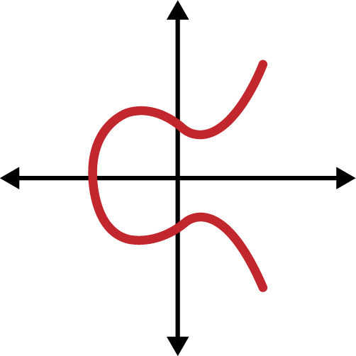

Figure 4-1. An elliptic curve

Ethereum uses a specific elliptic curve and set of mathematical constants, as defined in a standard called `secp256k1`, established by the US National Institute of Standards and Technology (NIST). The `secp256k1` curve is defined by the following function, which produces an elliptic curve:

```
y^2 = (x^3 + 7) over (Fp)
```

or:

```
y^2 mod p = (x^3 + 7) mod p
```

The `mod p` (modulo prime number p) indicates that this curve is over a *finite field* of prime order p, also written as Fp, where p = 2^256 – 2^32 – 2^9 – 2^8 – 2^7 – 2^6 – 2^4 – 1, which is a very large prime number.

Because this curve is defined over a finite field of prime order instead of over the real numbers, it looks like a pattern of dots scattered in two dimensions, which makes it difficult to visualize. However, the math is identical to that of an elliptic curve over real numbers. As an example, Figure 4-2 shows the same elliptic curve over a much smaller finite field of prime order 17, showing a pattern of dots on a grid. The `secp256k1` Ethereum elliptic curve can be thought of as a much more complex pattern of dots on an unfathomably large grid.

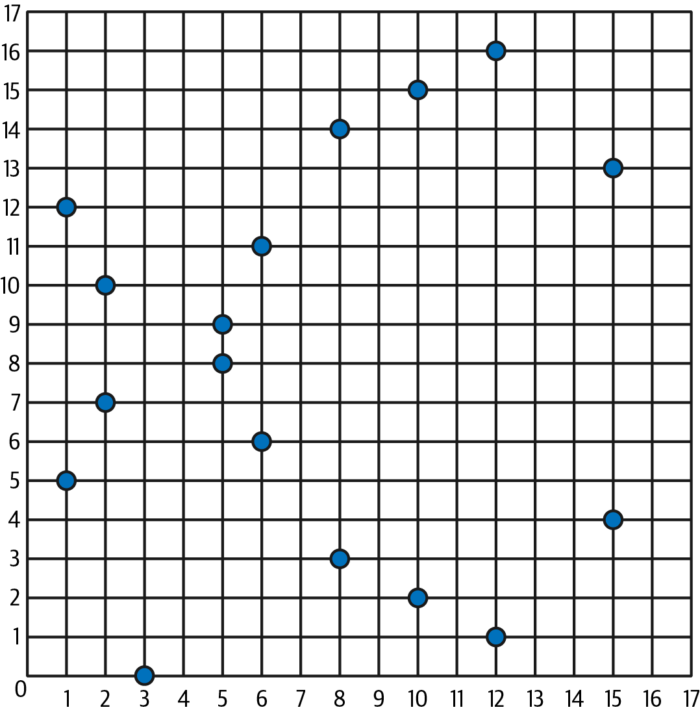

Figure 4-2. Elliptic curve cryptography: visualizing an elliptic curve over F(p), with p=17

So for example, the following is a point Q with coordinates (x, y) that is a point on the `secp256k1` curve:

```
Q = (49790390825249384486033144355916864607616083520101638681403973749255924539515, 59574132161899900045862086493921015780032175291755807399284007721050341297360)
```

Example 4-1 shows how you can check this yourself using Python. The variables `x` and `y` are the coordinates of the point Q, as in the preceding example. The variable `p` is the prime order of the elliptic curve (the prime that is used for all the modulo operations). The last line of Python is the elliptic curve equation (the `%` operator in Python is the modulo operator). If `x` and `y` are indeed the coordinates of a point on the elliptic curve, then they satisfy the equation and the result is zero. Try it yourself, by typing `python` (or `python3`) on a command line and copying each line (after the prompt `>>>`) from the listing.

**Example 4-1. Using Python to confirm that this point is on the elliptic curve**

```python
Python 3.12.4 (main, Jun  6 2024, 18:26:44) [Clang 15.0.0 (clang-1500.3.9.4)] on darwin
Type "help", "copyright", "credits" or "license" for more information.
>>> p = 115792089237316195423570985008687907853269984665640564039457584007908834671663
>>> x = 49790390825249384486033144355916864607616083520101638681403973749255924539515
>>> y = 59574132161899900045862086493921015780032175291755807399284007721050341297360
>>> (x ** 3 + 7 - y**2) % p
0
```

### Elliptic Curve Arithmetic Operations

A lot of elliptic curve math looks and works very much like the integer arithmetic we learned at school. Specifically, we can define an addition operator, which instead of jumping along the number line is jumping to other points on the curve. Once we have the addition operator, we can also define multiplication of a point and a whole number, which is equivalent to repeated addition.

Elliptic curve addition is defined such that given two points P1 and P2 on the elliptic curve, there is a third point P3 = P1 + P2, also on the elliptic curve.

Geometrically, this third point P3 is calculated by drawing a line between P1 and P2. This line will intersect the elliptic curve in exactly one additional place (amazingly). Call this point P3′ = (x, y). Then reflect in the x-axis to get P3 = (x, –y), as you can see in Figure 4-3.

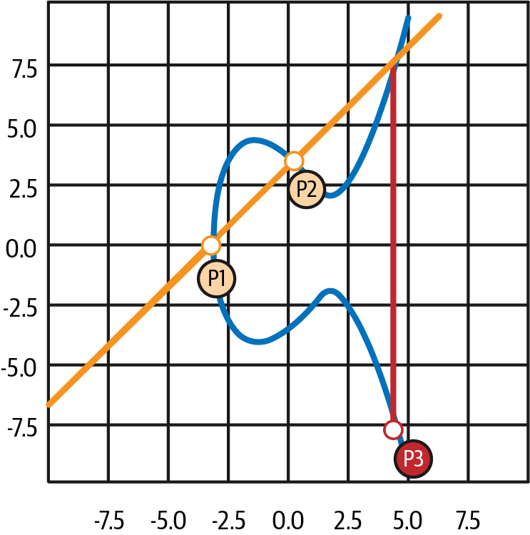

Figure 4-3. Elliptic curve addition: adding two points on an elliptic curve

If P1 and P2 are the same point, the line "between" P1 and P2 should extend to be the tangent to the curve at this point P1. This tangent will intersect the curve at exactly one new point, as shown in Figure 4-4. You can use techniques from calculus to determine the slope of the tangent line. Curiously, these techniques work, even though we are restricting our interest to points on the curve with two integer coordinates!

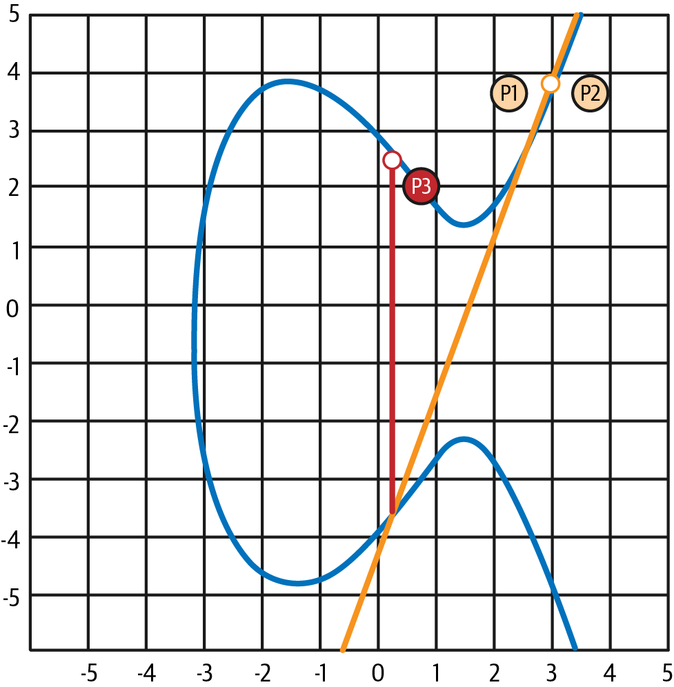

Figure 4-4. Elliptic curve addition: adding a point to itself

In elliptic curve math, there is also a point called the *point at infinity*, which roughly corresponds to the role of the number zero in addition. On computers, it's sometimes represented by `x = y = 0` (which doesn't satisfy the elliptic curve equation, but it's an easy separate case that can be checked). There are a couple of special cases that explain the need for the point at infinity.

In some cases (e.g., if P1 and P2 have the same x values but different y values, as shown in Figure 4-5), the line will be exactly vertical, in which case P3 = the point at infinity.

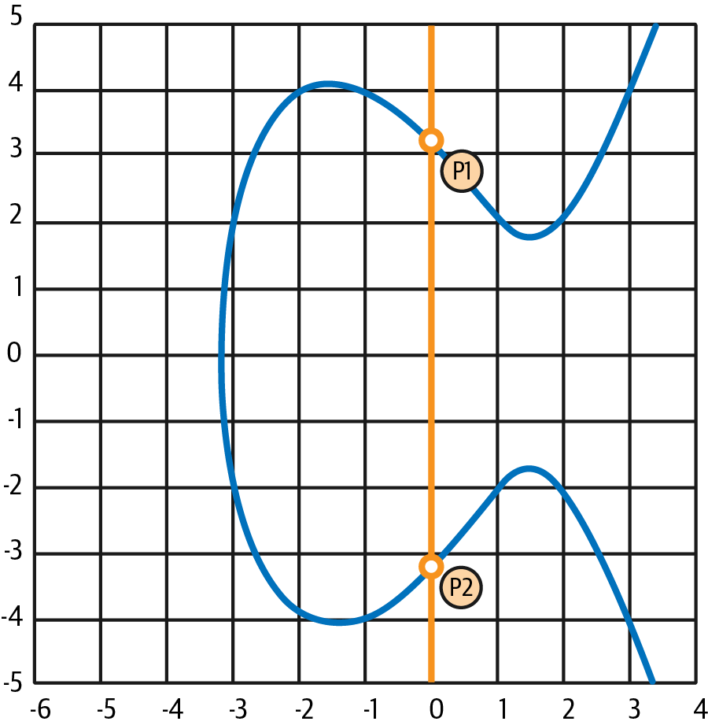

Figure 4-5. Elliptic curve addition: a special case results in the point at infinity

If P1 is the point at infinity, then P1 + P2 = P2. Similarly, if P2 is the point at infinity, then P1 + P2 = P1. This shows how the point at infinity plays the role that zero plays in "normal" arithmetic.

It turns out that `+` is associative, which means that `(A + B) + C = A + (B + C)`. That means we can write `A + B + C` (without parentheses) without ambiguity.

Now that we have defined addition, we can define multiplication in the standard way that extends addition. For a point P on the elliptic curve, if k is a whole number, then `k * P = P + P + P + … + P` (k times). Note that k is sometimes (perhaps confusingly) called an exponent in this case.

### Generating a Public Key

Starting with a private key in the form of a randomly generated number `k`, we multiply it by a predetermined point on the curve called the generator point `G` to produce another point somewhere else on the curve, which is the corresponding public key `K`:

```
K = k * G
```

The generator point is specified as part of the `secp256k1` standard; it is the same for all implementations of `secp256k1`, and all keys derived from that curve use the same point `G`. Because the generator point is always the same for all Ethereum users, a private key `k` multiplied with `G` will always result in the same public key `K`. The relationship between `k` and `K` is fixed but can only be calculated in one direction, from `k` to `K`. That's why an Ethereum address (derived from `K`) can be shared with anyone and does not reveal the user's private key (`k`).

As we described in the previous section, the multiplication of `k * G` is equivalent to repeated addition, so `G + G + G + … + G`, repeated k times. In summary, to produce a public key `K` from a private key `k`, we add the generator point `G` to itself, k times.

> **Tip**
>
> A private key can be converted into a public key, but a public key cannot be converted back into a private key, because the math only works one way.

Let's apply this calculation to find the public key for the specific private key we showed you in the section "Private Keys":

```
K = f8f8a2f43c8376ccb0871305060d7b27b0554d2cc72bccf41b2705608452f315 * G
```

A cryptographic library can help us calculate `K`, using elliptic curve multiplication. The resulting public key `K` is defined as the point:

```
K = (x, y)
```

where:

```
x = 6e145ccef1033dea239875dd00dfb4fee6e3348b84985c92f103444683bae07b
y = 83b5c38e5e2b0c8529d7fa3f64d46daa1ece2d9ac14cab9477d042c84c32ccd0
```
In Ethereum you may see public keys represented as a serialization of 130 hexadecimal characters (65 bytes). This is adopted from a standard serialization format proposed by the industry consortium Standards for Efficient Cryptography Group (SECG), documented in [Standards for Efficient Cryptography (SEC1)](https://oreil.ly/Y_cOQ). The standard defines four possible prefixes that can be used to identify points on an elliptic curve, listed in Table 4-1.

**Table 4-1. Serialized elliptic curve public key prefixes**

| Prefix | Meaning | Length (bytes, including prefix) |
|--------|---------|----------------------------------|
| 0x00 | Point at infinity | 1 |
| 0x04 | Uncompressed point | 65 |
| 0x02 | Compressed point with even y | 33 |
| 0x03 | Compressed point with odd y | 33 |

Ethereum only uses uncompressed public keys, so the only prefix that is relevant is (hex) `04`. The serialization concatenates the x and y coordinates of the public key:

```
04 + x-coordinate (32 bytes / 64 hex) + y-coordinate (32 bytes / 64 hex)
```

Therefore, the public key we calculated earlier is serialized as:

```
046e145ccef1033dea239875dd00dfb4fee6e3348b84985c92f103444683bae07b83b5c38e5e2b0c8529d7fa3f64d46daa1ece2d9ac14cab9477d042c84c32ccd0
```

### Elliptic Curve Libraries

There are a couple of implementations of the `secp256k1` elliptic curve that are used in cryptocurrency-related projects:

[**OpenSSL**](https://www.openssl.org)

The OpenSSL library offers a comprehensive set of cryptographic primitives, including a full implementation of `secp256k1`. For example, to derive the public key, the function `EC_POINT_mul` can be used.

[**libsecp256k1**](https://oreil.ly/lv84W)

Bitcoin Core's `libsecp256k1` is a C-language implementation of the `secp256k1` elliptic curve and other cryptographic primitives. It was written from scratch to replace OpenSSL in Bitcoin Core software and is considered superior in both performance and security.

## Cryptographic Hash Functions

Cryptographic hash functions are used throughout Ethereum. In fact, hash functions are used extensively in almost all cryptographic systems—a fact captured by cryptographer Bruce Schneier, who said, "Much more than encryption algorithms, one-way hash functions are the workhorses of modern cryptography."

In this section, we will discuss hash functions, explore their basic properties, and see how those properties make them so useful in so many areas of modern cryptography. We address hash functions here because they are part of the transformation of Ethereum public keys into addresses. They can also be used to create digital fingerprints, which aid in the verification of data.

In simple terms, a *hash function* is any function that can be used to map data of arbitrary size to data of fixed size. The input to a hash function is called a *preimage*, the *message*, or simply the input data. The output is called the *hash*. Cryptographic hash functions are a special subcategory that have specific properties that are useful to secure platforms, such as Ethereum.

A cryptographic hash function is a *one-way hash function* that maps data of arbitrary size to a fixed-size string of bits. The "one-way" nature means that it is computationally infeasible to re-create the input data if one only knows the output hash. The only way to determine a possible input is to conduct a brute-force search, checking each candidate for a matching output; given that the search space is virtually infinite, it is easy to understand the practical impossibility of the task. Even if you find some input data that creates a matching hash, it may not be the original input data: hash functions are "many-to-one" functions. Finding two sets of input data that hash to the same output is called finding a *hash collision*. Roughly speaking, the better the hash function, the rarer hash collisions are. For Ethereum, they are effectively impossible.

Let's take a closer look at the main properties of cryptographic hash functions:

**Determinism**

A given input message always produces the same hash output.

**Verifiability**

Computing the hash of a message is efficient (linear complexity).

**Noncorrelation**

A small change to the message (e.g., a 1-bit change) should change the hash output so extensively that it cannot be correlated to the hash of the original message.

**Irreversibility**

Computing the message from its hash is infeasible, equivalent to a brute-force search through all possible messages.

**Collision protection**

It should be infeasible to calculate two different messages that produce the same hash output.

Resistance to hash collisions is particularly important for avoiding digital signature forgery in Ethereum.

The combination of these properties makes cryptographic hash functions useful for a broad range of security applications, including:

- Data fingerprinting
- Message integrity (error detection)
- Proof of work
- Authentication (password hashing and key stretching)
- Pseudorandom number generators
- Message commitment (commit-reveal mechanisms)
- Unique identifiers

We will find many of these in Ethereum as we progress through the various layers of the system.

### Ethereum's Cryptographic Hash Function: Keccak-256

Ethereum uses the Keccak-256 cryptographic hash function in many places. Keccak-256 was designed as a candidate for the SHA-3 Cryptographic Hash Function Competition held in 2007 by NIST. Keccak was the winning algorithm, which became standardized as Federal Information Processing Standard (FIPS) 202 in 2015.

However, during the period when Ethereum was developed, the NIST standardization was not yet finalized. NIST adjusted some of the parameters of Keccak after completion of the standards process, allegedly to improve its efficiency. At the same time, heroic whistleblower Edward Snowden revealed documents implying that NIST may have been improperly influenced by the National Security Agency to intentionally weaken the Dual_EC_DRBG RNG standard, effectively placing a backdoor in the standard RNG. The result of this controversy was a backlash against the proposed changes and a significant delay in the standardization of SHA-3. At the time, the Ethereum Foundation decided to implement the original Keccak algorithm as proposed by its inventors, rather than the SHA-3 standard as modified by NIST.

> **Warning**
>
> While you may see "SHA-3" mentioned throughout Ethereum documents and code, many—if not all—of those instances actually refer to Keccak-256, not the finalized FIPS-202 SHA-3 standard. The implementation differences are slight, having to do with padding parameters, but they are significant in that Keccak-256 produces different hash outputs than FIPS-202 SHA-3 for the same input.

### Which Hash Function Am I Using?

How can you tell if the software library you are using implements FIPS-202 SHA-3 or Keccak-256, if both might be called "SHA-3"?

An easy way to tell is to use a *test vector*, an expected output for a given input. The test most used for a hash function is the empty input. If you run the hash function with an empty string as input, you should see the following results:

```
Keccak256("") = c5d2460186f7233c927e7db2dcc703c0e500b653ca82273b7bfad8045d85a470
SHA3("") = a7ffc6f8bf1ed76651c14756a061d662f580ff4de43b49fa82d80a4b80f8434a
```

Regardless of what the function is called, you can test it to see whether it is the original Keccak-256 or the final NIST standard FIPS-202 SHA-3 by running this simple test. Remember, Ethereum uses Keccak-256, even though it is often called SHA-3 in the code.

> **Note**
>
> Due to the confusion created by the difference between the hash function used in Ethereum (Keccak-256) and the finalized standard (FIP-202 SHA-3), all instances of `sha3` in all code, opcodes, and libraries have been renamed to `keccak256`. See [ERC-59](https://oreil.ly/rTHDv) for details.

Next, let's examine the first application of Keccak-256 in Ethereum, which is to produce Ethereum addresses from public keys.

## Ethereum Addresses

Ethereum addresses are unique identifiers that are derived from public keys or contracts using the Keccak-256 one-way hash function.

In our previous examples, we started with a private key and used elliptic curve multiplication to derive a public key.

**Private key k:**

```
k = f8f8a2f43c8376ccb0871305060d7b27b0554d2cc72bccf41b2705608452f315
```

**Public key K (x and y coordinates concatenated and shown as hex):**

```
K = 6e145ccef1033dea239875dd00dfb4fee6e3348b84985c92f103444683bae07b83b5c38e5e...
```

> **Note**
>
> It is worth noting that the public key is not formatted with the prefix (hex) `04` when the address is calculated.

We use Keccak-256 to calculate the hash of this public key:

```
Keccak256(K) = 2a5bc342ed616b5ba5732269001d3f1ef827552ae1114027bd3ecf1f086ba0f9
```

Then, we keep only the last 20 bytes (least significant bytes), which is our Ethereum address:

```
001d3f1ef827552ae1114027bd3ecf1f086ba0f9
```

You will most often see Ethereum addresses with the prefix `0x`, which indicates they are hexadecimal encoded, like this:

```
0x001d3f1ef827552ae1114027bd3ecf1f086ba0f9
```

### Ethereum Address Formats

Ethereum addresses are hexadecimal numbers, identifiers derived from the last 20 bytes of the Keccak-256 hash of the public key.

Unlike Bitcoin addresses, which are encoded in the user interface of all clients to include a built-in checksum to protect against mistyped addresses, Ethereum addresses are presented as raw hexadecimal without any checksum. The rationale behind that decision was that Ethereum addresses would eventually be hidden behind abstractions (such as name services) at higher layers of the system and that checksums should be added at higher layers if necessary.

In reality, these higher layers were developed too slowly, and this design choice led to a number of problems in the early days of the ecosystem, including the loss of funds due to mistyped addresses and input validation errors. Furthermore, because Ethereum name services were developed more slowly than initially expected, alternative encodings were adopted very slowly by wallet developers. We'll look at a few of the encoding options next.

> **Note**
>
> It's worth mentioning the Ethereum Name Service (ENS), introduced in 2017 by Alex Van de Sande and Nick Johnson. ENS provides an on-chain solution for converting human-readable names, such as `masteringethereum.eth`, into Ethereum addresses.

### Hex Encoding with Checksum in Capitalization (ERC-55)

Due to the slow deployment of name services, a standard was proposed by [ERC-55](https://oreil.ly/JfgWs). ERC-55 offers a backward-compatible checksum for Ethereum addresses by modifying the capitalization of the hexadecimal address. The idea is that Ethereum addresses are case insensitive and all wallets are supposed to accept Ethereum addresses expressed in capital or lowercase characters, without any difference in interpretation. By modifying the capitalization of the alphabetic characters in the address, we can convey a checksum that can be used to protect the integrity of the address against typing or reading mistakes. Wallets that do not support ERC-55 checksums simply ignore the fact that the address contains mixed capitalization, but those that do support it can validate it and detect errors with a 99.986% accuracy.

The mixed-capitals encoding is subtle, and you may not notice it at first. Our example address is:

```
0x001d3f1ef827552ae1114027bd3ecf1f086ba0f9
```

With an ERC-55 mixed-capitalization checksum it becomes:

```
0x001d3F1ef827552Ae1114027BD3ECF1f086bA0F9
```

Can you tell the difference? Some of the alphabetic (A–F) characters from the hexadecimal encoding alphabet are now capitals, while others are lowercase.

ERC-55 is quite simple to implement. We take the Keccak-256 hash of the lowercase hexadecimal address. This hash acts as a digital fingerprint of the address, giving us a convenient checksum. Any small change in the input (the address) should cause a big change in the resulting hash (the checksum), allowing us to detect errors effectively. The hash of our address is then encoded in the capitalization of the address itself. Let's break it down, step-by-step:

1. Hash the lowercase address, without the `0x` prefix:

    ```
    Keccak256("001d3f1ef827552ae1114027bd3ecf1f086ba0f9") = 23a69c1653e4ebbb619b0b2cb8a9bad49892a8b9695d9a19d8f673ca991deae1
    ```

2. Capitalize each alphabetic address character if the corresponding hex digit of the hash is greater than or equal to `0x8`. This is easier to show if we line up the address and the hash:

    ```
    Address: 001d3f1ef827552ae1114027bd3ecf1f086ba0f9
    Hash   : 23a69c1653e4ebbb619b0b2cb8a9bad49892a8b9...
    ```

Our address contains an alphabetic character `d` in the fourth position. The fourth character of the hash is `6`, which is less than 8. So, we leave the `d` lowercase. The next alphabetic character in our address is `f`, in the sixth position. The sixth character of the hexadecimal hash is `c`, which is greater than 8. Therefore, we capitalize the `F` in the address, and so on. As you can see, we only use the first 20 bytes (40 hex characters) of the hash as a checksum, since we only have 20 bytes (40 hex characters) in the address to capitalize appropriately.

Check the resulting mixed-capitals address yourself and see if you can tell which characters were capitalized and which characters they correspond to in the address hash:

```
Address: 001d3F1ef827552Ae1114027BD3ECF1f086bA0F9
Hash   : 23a69c1653e4ebbb619b0b2cb8a9bad49892a8b9...
```

### Detecting an Error in an ERC-55 Encoded Address

Now, let's look at how ERC-55 addresses will help us find an error. Let's assume we have printed out an Ethereum address, which is ERC-55 encoded:

```
0x001d3F1ef827552Ae1114027BD3ECF1f086bA0F9
```

Now let's make a basic mistake in reading that address. The character before the last one is a capital F. For this example, let's assume we misread that as a capital E, and we type the following (incorrect) address into our wallet:

```
0x001d3F1ef827552Ae1114027BD3ECF1f086bA0E9
```

Fortunately, our wallet is EIP-55 compliant! It notices the mixed capitalization and attempts to validate the address. It converts it to lowercase and calculates the checksum hash:

```
Keccak256("001d3f1ef827552ae1114027bd3ecf1f086ba0e9") = 5429b5d9460122fb4b11af9cb88b7bb76d8928862e0a57d46dd18dd8e08a6927
```

As you can see, even though the address has only changed by one character (in fact, only one bit, as `e` and `f` are one bit apart), the hash of the address has changed radically. That's the property of hash functions that makes them so useful for checksums!

Now, let's line up the two and check the capitalization:

```
001d3F1ef827552Ae1114027BD3ECF1f086bA0E9
5429b5d9460122fb4b11af9cb88b7bb76d892886...
```

It's all wrong! Several of the alphabetic characters are incorrectly capitalized. Remember that the capitalization is the encoding of the correct checksum.

The capitalization of the address we input doesn't match the checksum just calculated, meaning something has changed in the address, and an error has been introduced.

## Validators' Cryptography

In this section, we're going to explore the cryptography used by validators in the new PoS-based consensus protocol. While the core idea is always to be able to digitally sign messages and verify them, there are interesting requirements that lead to design choices and final implementations that differ from the cryptography used in Ethereum for transactions or addresses.

### Introduction

When Ethereum was using *Ethash*—the PoW consensus algorithm—there was no reason why block proposers—miners at that time—should have signed the blocks they were producing. In fact, PoW-based consensus algorithms don't need to know who's creating the blocks in order to correctly work. If a block proposer misbehaves, the protocol implicitly punishes them by making them waste electric energy and time, thus money.
Let's take the example of a miner who tries to do a double spend by creating two blocks at the same time. To better understand the core idea behind this "exploit," imagine a miner wants to buy a car and agrees with the dealer to pay in ETH—let's say 10 ETH. The miner then creates two blocks at the same time. Let's suppose they're both valid: in the first one, the miner adds the payment transaction in which they send 10 ETH to the car dealer while in the other block, they don't. The miner is trying to split the chain in two parts.

Depending on (almost) random factors, the car dealer could receive first the block in which the miner paid them 10 ETH. So the car dealer can suppose that the payment went fine. But they don't give the car to the miner yet. In fact, the car dealer knows that in PoW systems, you usually want to wait a bunch of blocks before considering a transaction definitely settled.

After more or less 12 seconds, a different miner produces a new block on top of the block that doesn't contain the 10 ETH payment. This is completely possible as it usually depends on which block this next miner has received first. Now there is one longer blockchain and, thanks to the *heaviest chain rule*—also known (a bit wrongly) as the *longest chain rule*—that chain is considered the only one that is valid by all the nodes.

The car dealer sees that the valid blockchain doesn't contain the block they previously received in which there is the 10 ETH payment, so they consider the payment not done, and they don't give the car to the miner.

Remember that, in PoW systems, miners have to spend real energy and time to produce a valid block that passes the PoW check—that is, the block hash is lower than a dynamic threshold—so the fact that they spend energy and time to create a block and then they see one of their blocks rejected by the entire network is already an implicit punishment. They lost precious energy and time they could have better spent by creating only valid blocks, respecting all the rules and not trying to cheat.

PoS systems don't have this same implicit punishment for block producers (i.e., validators) that misbehave. Instead, they use an explicit method: *slashing*.

*Slashing* is the action of punishing a validator who didn't follow the rules by subtracting some (or all) of their staked ETH. This explains why validators have to put a minimum amount of ETH at stake to become active validators. If they don't have anything at stake, the protocol won't be able to punish them if they start to act maliciously.

Explicitly punishing validators for not following the rules requires knowing exactly what every validator is doing. To do that, every message (including blocks) that validators send must be authenticated with their digital signatures.

Let's re-create the analogous example we used previously with the miner. Now we have a validator who is proposing two blocks at the same time. While with PoW, the miner should have spent double the energy and time to produce two valid blocks at the same time, with PoS this is (almost) entirely free.

But here is where slashing enters into the scene. *Double-signing* — proposing two blocks at the same time — is a slashable event, so the validator is immediately punished by (in this specific example) destroying all their ETH at stake.

Now that we know why validators must authenticate all of their messages, we can deep-dive into the cryptography used for that: BLS signatures. In the next section, we'll see the requirements that led to the final decision to use BLS cryptography.

### Requirements

The first solution you could think of for this problem—that is, the need to authenticate every message that validators send to one another—is to apply the same digital signature algorithm Ethereum already uses to digitally sign every transaction: the *Elliptic Curve Digital Signature Algorithm* (ECDSA).

But it wouldn't work with the high number of validators Ethereum has—more than one million. In fact, there is a fundamental requirement that this digital signature algorithm should adhere to: it must be possible to condense signatures in order to reduce the space needed for them in the block and lower the time nodes need to spend on validating all validators' signatures.

Right now, every validator can cast a vote—a message that needs to be authenticated—once every *epoch*, or 32 *slots* (we'll expand more on this in Chapter 15). These messages need to travel the P2P gossip layer to reach other validators and nodes, be validated by every other node to check that the signature is valid, and be inserted into a block.

It's very easy to spot a bottleneck here: the more validators that join the network, the more messages that nodes need to handle. Even blocks become bigger because they need to reserve more and more space for those validators' signatures.

> **Note**
>
> You can easily calculate the number of messages that nodes need to handle based on the number of active validators:
> ```
> N = number of active validators
> 1 msg / 1 epoch × N =
> = 1 msg / 32 slots × N = ← one epoch is made of 32 slots
> = 1 msg / 32 × 12 seconds × N = ← every slot takes 12 seconds
> = 1 msg / 384 seconds × N =
> = 0.0026041667 msg / second × N
> ```
>
> So we have about 0.0026 messages every second that we need to multiply with N, the number of active validators in the network:
>
> ```
> N = 1,000 → ~2.6 messages per second
> N = 10,000 → ~26 messages per second
> N = 100,000 → 260 messages per second
> N = 1,000,000 → 2,600 messages per second
> ```

Right now, the Ethereum PoS protocol is handling about 2,600 messages every second.

For these reasons, most PoS blockchains have a very small validator set, in the tens or hundreds at maximum. Even the Ethereum initial proposal (see [EIP-1011](https://oreil.ly/pQSCp)) was targeting a maximum of nine hundred validators, with 1,500 ETH as the minimum deposit for being elected in the active validator set.

This would have been the final specification for the Ethereum PoS protocol if Justin Drake, an Ethereum Foundation researcher, didn't come up with the idea of BLS signature aggregation in May 2018 in a [long article published on the ethresearch website](https://oreil.ly/EbBib).

### BLS Digital Signatures

BLS signatures are named after their authors. BLS stands for Boneh–Lynn–Shacham, referring to the three cryptographers Dan Boneh, Ben Lynn, and Hovav Shacham who introduced the signature scheme in their paper titled ["Short Signatures from the Weil Pairing"](https://oreil.ly/cJn6v) in 2001.

As ECDSA (which will be further explained in Chapter 6), BLS signatures are still based on elliptic curve cryptography. In particular, Ethereum uses the curve *BLS12-381*, designed by Sean Bowe in 2017 while he was working for the Zcash protocol. It's defined by the following function:

```
y^2 = x^3 + 4
```

over the integers modulo q, where q is a 115-decimal-digits number: `0x1a0111ea397fe69a4b1ba7b6434bacd764774b84f38512bf6730d2a0f6b0f6241eabfffeb153ffffb9feffffffffaaab`.

#### How Does It Work?

The core idea is very similar to how ECDSA works: there is a secret key from which a public key is derived. Then, every message is signed using the secret key, and everyone else can verify its integrity by using the corresponding public key.

The secret key (`sk`) is an integer between 1 and r – 1, where r is this huge number: `0x73eda753299d7d483339d80809a1d80553bda402fffe5bfeffffffff00000001`. It has 77 decimal digits!

The public key (`pk`) is obtained by doing `sk * g1`, a scalar multiplication of the elliptic curve point, where `g1` is the generator of a group called G1. The `pk` is represented in a compressed and serialized format, resulting in a 48-byte string.

The message (`m`) that is signed is always mapped to an elliptic curve point, which is a member of a different group called G2. You can think of this mapping as a sort of hash function that takes a message `m`—that is, the actual validator's attestation—and outputs a point `H(m)` in G2, represented in its compressed serialized form as a 96-byte string.

Finally, we obtain the signature (σ) of the message `m` by doing `sk * H(m)`, a new elliptic point in G2.

The key differences between ECDSA and BLS lie in the low-level details of the two protocols—that is, in the mathematical techniques they use for verifying the correctness of signatures. In fact, while ECDSA involves mathematical linear calculations, such as scalar multiplication and addition on the elliptic curve, BLS signatures rely on the more complex arithmetic of *elliptic curve bilinear pairings*.

In fact, a signature σ is valid if and only if the following equation holds true:

```
e(g1,σ) = e(pk, H(m))
```

where `e` is an elliptic curve bilinear pairing.

#### Inside Elliptic Curve Properties

Completely understanding the previous equation requires a deep knowledge of elliptic curves, pairings, and all that huge rabbit hole. But an easy way to understand it is to simply follow the steps here. You won't grasp all the details of why and how the pairing has that property, but it can still help you familiarize yourself with it:

```
e(pk, H(m)) = e(sk * g1,H(m)) = ← pk = sk * g1
= e(g1, H(m))^sk = ← thanks to a pairing property
= e(g1, sk * H(m)) = ← thanks to the same property
= e(g1,σ) ← σ = sk * H(m)
```

As Vitalik Buterin pointed out in a [Medium article](https://oreil.ly/v578s):

> If you view elliptic curve points as one-way encrypted numbers—`encrypt(p) = p * G = P`, where G is the generator point—then whereas traditional elliptic curve math lets you check linear constraints on the numbers (e.g., if `P = G * p`, `Q = G * q` and `R = G * r`, checking `5 * P + 7 * Q = 11 * R` is really checking that `5 * p + 7 * q = 11 * r`), pairings let you check quadratic constraints (e.g., checking `e(P, Q) * e(G, G * 5) = 1` is really checking that `p * q + 1 * 5 = 0`).

As you can imagine, more complex arithmetic also means more time to produce and to verify a signature. The only reason Ethereum is using BLS signatures for validators is their extremely important property of *signature aggregation*.

In fact, if you take two ECDSA signatures and sum them together, you don't obtain a meaningful result. If you try to use that result to prove the integrity of the initially signed message, you won't pass any test.

Instead, if you take two BLS signatures and sum them together, you are simply doing an elliptic curve addition. The result is a new elliptic curve point—in G2—that you can use against the sum of the two correspondent public keys—which is still an elliptic curve point in G1—to correctly verify the integrity of the initially signed message.

> **Note**
>
> Aggregate signatures and aggregate public keys are indistinguishable from a single signature and a single public key, so you can use the exact same algorithm to verify the correctness of an aggregated signature.
>
> **Aggregated signature and public key:**
> ```
> σagg = σ1 + σ2 + σ3 + … + σn
> pkagg = pk1 + pk2 + pk3 + … + pkn
> ```
>
> **Aggregated signature verification:**
>
> ```
> e(pkagg,H(m)) =
> = e(pk1 + pk2 + pk3 + ... + pkn,H(M)) =
> = e((sk1 + sk2 + sk3 + ... + skn) * g1,H(m)) =
> = e(g1,H(m))^(sk1 + sk2 + sk3 + ... + skn) =
> = e(g1,(sk1 + sk2 + sk3 + ... + skn) * H(m)) =
> = e(g1,σ1 + σ2 + σ3 + ... + σn) =
> = e(g1,σagg)
>```

#### In Summary

Cryptography is really hard; it requires a deep mathematical background. And this book isn't really for cryptographers, so it's fundamental to summarize what we've briefly touched on in the previous sections. We explained how BLS signatures work and why they were chosen as the digital signature algorithm that validators use in the new PoS-based consensus protocol: their aggregation property lets you condense more digital signatures into one, reducing the amount of space needed to store them and the time to validate them without losing any security.

We can now do a quick example to demonstrate how validators use BLS algorithms in "real life" and how signature aggregation comes into play. Figure 4-6 illustrates a scenario where we have three validators who want to express their votes for a block, block A. So they cast their votes, sign them, and share them with one another.

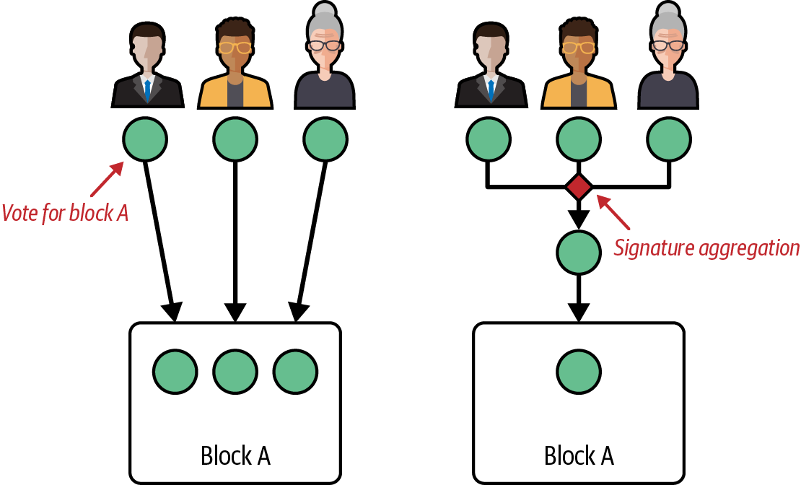

Figure 4-6. BLS signature aggregation: three validators vote and sign

Without BLS, you would need to save all three signed votes into the block to store them permanently. With BLS, you can aggregate all three signed votes into a new aggregated vote and store only that into the block.

This not only saves space but also dramatically reduces the amount of time and computation all Ethereum nodes have to do when validating all signed votes because they can directly validate aggregated ones instead of performing the validation for each single signed vote. And the magic of BLS cryptography is that the aggregated result is no different than a normal signature: that means that verifying the validity of an aggregated signature is no harder than verifying the validity of a single signature. Thus, by significantly reducing the number of signed votes that must be validated, while requiring the same amount of computation to verify each signature, the total amount of computation—and therefore time—that full nodes must perform is much lower than it would be without BLS-aggregated signatures, as shown in Figure 4-7.

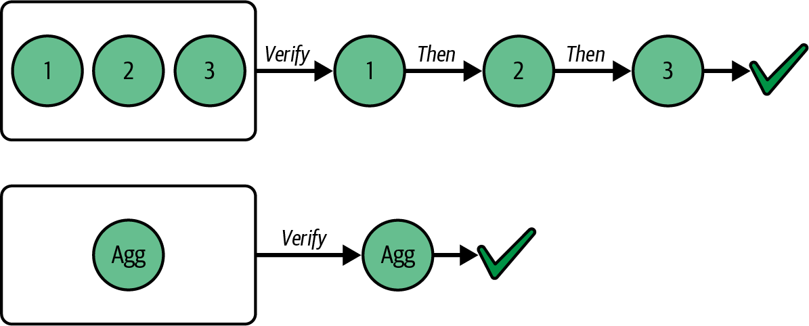

Figure 4-7. BLS signature aggregation reduces validation time

What if a validator doesn't follow the rules? If a validator behaves maliciously—for example, by double-signing, or voting for two different blocks at the same time—the protocol can detect this behavior and punish the validator accordingly, as shown in Figure 4-8.

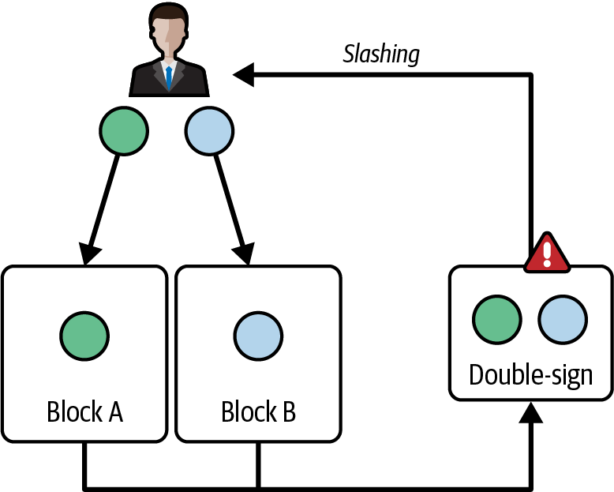

Figure 4-8. BLS signatures enable detection of malicious validators

In fact, because all votes are digitally signed using the BLS signature scheme, it's trivial to identify validators who are responsible for misbehaviors and slash them accordingly.

## KZG Cryptography

On March 13, 2024, Ethereum upgraded to the Cancun-Deneb (Dencun) hard fork. This upgrade contained a lot of changes, but the most important one was definitely the introduction of a new type of transaction: EIP-4844 blob transaction.

We're not going to deep-dive here into why blob transactions are important to Ethereum's roadmap, as we will do that in much more detail in Chapter 16. Instead, in the next sections we'll explore the cryptography underneath this new type of transaction: *polynomial commitment schemes* and, more specifically, the *KZG commitment scheme*.

### Introduction

Before looking at polynomial commitment schemes, it's important to understand the problem we're facing and the final goal we want to reach.

> **Note**
>
> In this section, we'll briefly mention the term Layer 2s (L2s). While L2s will be properly explained and expanded on in Chapter 16, it can be useful to at least have a quick introduction to them. L2s are a new scaling solution for Ethereum: they are real blockchains, with a unique history and state, that periodically post all their updates and data to the Ethereum mainnet. The rationale is that it must be possible to derive the entire L2 blockchain by looking only at the Ethereum mainnet.

Without going into too much detail, L2s post a lot of data into the Ethereum main chain every day. All this data has to be downloaded and verified by all the nodes in the network. This situation usually leads to a spike in gas fees that, in critical scenarios, can reach $10–$20 just for a single ETH transfer.

Eventually, instead of posting all this data directly on chain, we only want to store a commitment to it—that is, a cryptographic hash—leaving the full data outside the Ethereum chain. But posting only a hash creates a new problem: all the nodes in the network must ensure that the data that the commitment points to exists somewhere; otherwise, we may have lost critical data.

The first (obvious) solution would be to obligate all the nodes to temporarily download the full data so that they can easily verify the commitment is valid—that is, it points to the full data they have. This is where we are at the time of writing this chapter (June 2025).

The long-term solution is to not require all the nodes to download the full data but just a very small part of it. Nodes can then use cryptographic proofs that ensure the data is fully available. These proofs have to be small and need to be verified quickly. The idea is that it's much faster and more lightweight to prove—and verify—that the data is available than it is to download it and directly verify it. This strategy is called *data availability sampling* (DAS), one of the most important areas of research in the Ethereum community.

To achieve the final goal of DAS, we want a cryptographic system that enables us—all the nodes—to:

- Create a commitment to some data (data you want to prove that exists and is available in its entirety)
- Generate small proofs for the data related to the previously created commitment
- Easily verify these proofs

This cryptographic system optionally (but ideally) shouldn't reveal much information about the data it refers to.

In the next section, we'll explore such a cryptographic system: polynomial commitment schemes and, more specifically, the KZG commitment scheme.

> **Note**
>
> You may wonder why we're talking about polynomial commitment schemes instead of data commitment schemes. And that's a very good question: our goal is to be able to commit to some data, not to a polynomial. But here is the trick: data can be represented as a polynomial. So if we are able to produce a polynomial commitment scheme, then we're good.

### Polynomial Commitment Schemes

A *polynomial commitment scheme* allows a prover to compute a commitment to a polynomial, with the property that this commitment can later be "opened"—evaluated—at any position. The prover can show that the value of the polynomial at a certain position is equal to a claimed value and can generate a proof for that claim. The verifier, having both the commitment and the proof, can verify that the proof is valid if and only if the prover didn't cheat—that is, the committed polynomial actually evaluates to the claimed value at the selected position.

#### Introduction to Polynomials

We'll talk about polynomials a lot in this section, so it's important to make sure everyone knows what a polynomial is, since it may have been a long time since you studied them in school.

A polynomial is a mathematical expression like this:

```
x^3 + 3x^2 – 9
```

where `x` is the variable and all the numbers (1, 3, 0, –9) are the coefficients. Note that we put a 0 as the third coefficient because that polynomial is actually the following one:

```
x^3 + 3x^2 + 0x – 9
```

We'll refer to a polynomial as `p(x)` throughout this section:

```
p(x) = x^3 + 3x^2 + 0x – 9
```

We'll also need the *degree* `n` of a polynomial. It's the number of the highest power in the polynomial. The degree of our example polynomial is 3. So `n = 3`.

The general formula to describe a polynomial is the following:

```
p(x) = p₀ + p₁x + p₂x² + ... + pₙxⁿ
```

Or more formally:

```
p(x) = Σ pᵢxⁱ  (for i = 0 to n)
```

where `n` is the degree of the polynomial and `pi` are all its coefficients.

### Using Merkle Trees

Let's start looking at a polynomial commitment scheme using the classical Merkle tree data structure. If you're interested in deep-diving into Merkle trees, we'll expand on them in Chapter 14.

We can commit to a polynomial of degree `n = 2^d – 1`, where `d` is the depth of the Merkle tree, by setting all the leaf elements of the tree equal to all the coefficients `pi` of the polynomial we want to commit to.

Have a look at the following example:

```
p(x) = x^7 + 5x^5 – 2x^4 + 3
n = 7 ← degree of p(x)
d = 3 ← depth of the required Merkle tree
```

Figure 4-9 shows the polynomial commitment scheme applied to this example, using Merkle roots as the core cryptographic primitive.

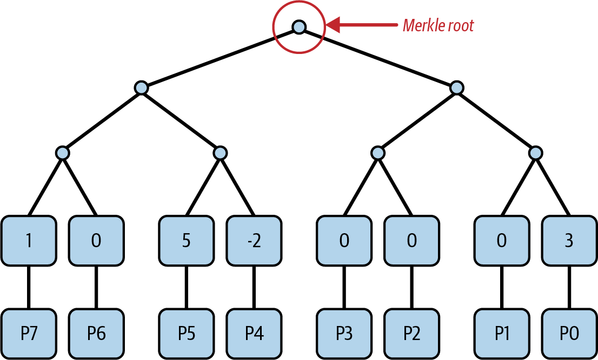

Figure 4-9. Polynomial commitment using Merkle trees

The final commitment is the Merkle root we obtain by constructing the full Merkle tree.
Now let's say we want to prove (to a verifier) that `p(1) = 7`. This statement is true because if you take `p(x)` and set `x = 1`, you can easily calculate that the polynomial at that position evaluates to 7.

To prove our assertion that `p(1) = 7`, we need to send to the verifier:

- The statement we want to prove: `p(1) = 7`
- The Merkle root—that is, the commitment to the polynomial `p(x)`
- All the coefficients `pi` of the polynomial

This way, the verifier can take all the coefficients `pi` and calculate the value of the polynomial when `x = 1`. Here, the verifier verifies that our assertion is actually true. Then, the verifier takes all the coefficients `pi` and computes the Merkle tree, comparing their Merkle root with the one we provided to them. Here, they verify that the polynomial we committed to initially is actually the same one we sent to them.

To recap the properties of polynomial commitment using Merkle trees, we have the following:

**Commitment size**

The commitment is the Merkle root, which is a single hash, usually 32 bytes long.

**Proof size**

To prove an evaluation, we need to send all the coefficients `pi` of the polynomial. That means the proof size is linear in the degree `n` of the polynomial.

**Verifier complexity**

The verifier has to do linear work (in the degree of the polynomial) to completely verify our assertion. In fact, the verifier has all the coefficients `pi` and has to compute both the Merkle tree and the evaluation of the polynomial at the claimed point.

**Scheme privacy**

The scheme doesn't hide anything about the polynomial as the prover sends all its coefficients `pi`.

These properties are not ideal because the degree `n` of the polynomial could be very big in the real Ethereum protocol, and the bandwidth required to send all its coefficients on the network is too high. Also, we would like a protocol that lets the prover reveal as little information as possible regarding the committed polynomial.

Luckily, there is a scheme that satisfies all our requirements, and this is where KZG enters the scene.

### KZG Commitment

KZG is an acronym that stands for Kate, Zaverucha, and Goldberg, the names of its three authors. These cryptographers introduced this commitment scheme in their 2010 paper ["Constant-Size Commitments to Polynomials and Their Applications"](https://oreil.ly/JnEc0).

#### The trusted setup

The KZG commitment scheme requires the presence of a *trusted setup*. You can view it as a common knowledge base shared with all the participants of a cryptographic protocol—that is, both prover and verifier. It's called a trusted setup because, in order to produce that common knowledge base, some participants need to generate random numbers (secrets), encrypt them, and create the final data. Then, they must delete the secrets to ensure the protocol remains safe. Since these participants need to be trusted to delete their secrets, this whole ceremony is called a trusted setup.

Modern setups usually use the [*Powers-of-Tau*](https://oreil.ly/uaS5x) setup, which has a 1-of-N trust model. That means we need only one honest actor for the entire trusted setup to be considered safe.

The Ethereum KZG trusted setup ceremony involved more than 140,000 different participants, as you can see in Figure 4-10.

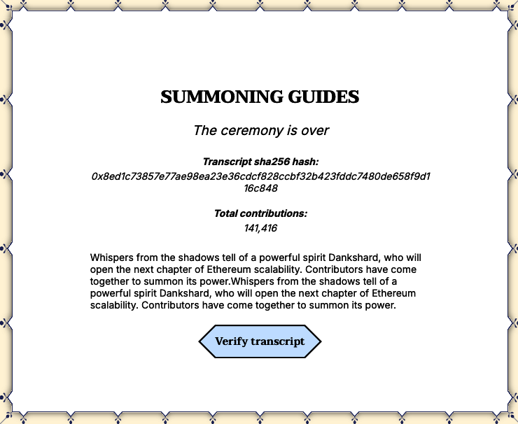

Figure 4-10. Ethereum KZG trusted setup ceremony participants

More specifically the trusted setup generates the elements `[s^i]₁` and `[s^i]₂` for `i = 0, 1, … , n – 1`, where:

- `s` is the trusted setup secret that no one knows (made by the sum of secrets that each participant has generated)
- `[s^i]₁` and `[s^i]₂` are actually elliptic curve points (respectively in curves G1 and G2)
- `n` is the order of the polynomial

> **Tip**
>
> When you see something inside square braces, that represents an elliptic curve point.

#### The commitment

As you can see, the KZG commitment scheme involves (again) elliptic curves and pairings, something we have already seen for BLS digital signatures.

Remember that on elliptic curves, if you have a secret number `a`, you can obtain an elliptic curve point `[a]` with an elliptic curve multiplication:

```
[a]₁ = aG₁
```

And it's computationally impossible to go back. Thus, if you have only `[a]`, you cannot obtain the secret `a`.

Even though neither the prover nor the verifier knows `s`, the trusted-setup secret, they can still do certain operations on it:

```
c[s^i]₁ = cs^iG₁ = [cs^i]₁  ← elliptic curve multiplication; c is an integer number
c[s^i]₁ + d[s^i]₁ = (cs^i + ds^i)G₁ = [cs^i + ds^i]₁  ← elliptic curve points addition
```

So, if `p(x) = p₀ + p₁x + p₂x² + ... + pₙxⁿ` is a polynomial, the prover can compute:

```
[p(s)]₁ = [p₀ + p₁s₁ + p₂s²₁ + ... + pₙsⁿ₁] = p₀ + p₁[s]₁ + p₂[s²]₁ + ... + pₙ[sⁿ]₁
```

Since `[s^i]₁` is part of the trusted setup, and therefore it's common knowledge, the prover is able to evaluate the polynomial at a secret point `s` that no one knows. Sounds magic, right? Be careful of one important thing, though: the output of the previous operation is not an integer number; instead, it's an elliptic curve point. That `[p(s)]₁` elliptic curve point is our KZG commitment to the polynomial `p(x)`.

#### Soundness of KZG: Why the Prover Can't Fake the Commitment

Can the prover, without knowing the secret `s`, find a different polynomial `q(x) != p(x)` so that they have the same KZG commitment: `[q(s)]₁ = [p(s)]₁`? If so, the prover would be able to make the verifier think that they know a polynomial `p` even if that's not true.

Assume they can, so there is a polynomial `r(x) = p(x) – q(x)` not constant of degree `n`. Since `q(x) != p(x)`, that means that `r(x)` has at most `n` zeros—that is, `r(x) = 0` in at most `n` positions. This is a fundamental property of algebra. You can easily verify that it holds true for all the basic geometric shapes you studied in school: lines (polynomials of degree 1) have one zero, parabolas (polynomials of degree 2) have at most two, and so on.

The only way the prover can achieve `q(s) = p(s)` is by making `r(x) = p(x) - q(x) = 0` in as many places as possible. But they can choose up to `n` zeros, as we said previously.

Since the prover doesn't know `s`, it's extremely unlikely that they will be able to guess it. In fact, `n` (order of the polynomial) << `p` (order of elliptic curves).

If `n = 228` and `p = 2^256`, the probability that `s` is one of the selected zeros is `2 × 10^-69`.

So we can say that, while there exist many polynomials with the same commitment `C = [p(s)]₁`, they are impossible to compute. This is a *computational binding*.

So far, we are able to commit to a polynomial `p(x)` by evaluating it at a secret point `s`, but we're still missing a way to prove that the initial prover's assertion `p(z) = y` is true without sending all the coefficients `pi` to the verifier. Here again is where elliptic curve pairings come in handy.

### KZG Proof

To understand the final KZG proof, we need to recall some important properties of polynomials.

A polynomial `p(x)` is divisible by `(x – z)` if it has a zero in `z`. This is very easy to understand. Take the polynomial `p(x) = x² – 4` that can also be represented as `p(x) = (x + 2)(x – 2)`. Since `p(2) = 4 – 4 = 0`, `p(x)` is divisible by `(x – 2)`.

The opposite is also true. A polynomial `p(x)` has a zero in `z` if `p(x)` is divisible by `(x – z)`. Take the same example we used before and you can easily demonstrate that.

Remember that we (as the prover) want to prove that `p(z) = y`. At this point, we take the polynomial `p(x) – y`. This polynomial evaluates to zero at `x = z`, so we can use the properties described previously—in particular, the fact that since `p(x) – y` has a zero in `z`, then it is divisible by `(x – z)`.

So we can compute the quotient polynomial `q(x)`:

```
q(x) = [p(x) – y] / (x – z)
```

which we can write in the equivalent form:

```
q(x)(x – z) = p(x) – y
```

> **Note**
>
> It's very important to note here that the quotient polynomial `q(x)` is only possible to compute because `p(x) – y` is divisible by `x – z`. Otherwise, it would be impossible as we would always have a remainder.
>
> To understand this better, let's look at an example. Take again the polynomial `p(x) = (x + 2)(x – 2)`. Since this polynomial is divisible by `(x + 2)`, we can compute the quotient polynomial:
>
> ```
> q(x) = p(x) / (x + 2) = [(x + 2)(x – 2)] / (x + 2) = x – 2
> ```
> If we tried to divide by `(x – 3)`, we wouldn't be able to obtain the quotient polynomial. You can try using the previous example if you want…

Now we're fully ready to generate our proof. In fact, a KZG proof for the assertion `p(z) = y` is `π = [q(s)]₁`. Basically, it's the (elliptic curve point) quotient polynomial evaluated at the secret point `s`.

The verifier checks the validity of this proof by computing the following equation:

```
e(π, [s – z]₂) = e(C – [y]₁, H)
```

where:

- `π = [q(s)]₁` is the KZG proof
- `C = [p(s)]₁` is the commitment to the polynomial `p(x)`
- `H` is the generator of the group G2, known to both prover and verifier

Let's prove that this cryptographic scheme is both:

**Correct**

If the prover follows all the rules, then they must be able to produce a valid proof that the verifier should be able to correctly verify.

**Sound**

The prover cannot trick the verifier by computing a fake proof—that is, the prover cannot make the verifier believe that `p(z) = y′` for some `y′ != y`.

#### Correctness

If we take the verifier equation and write it to the pairing group, basically computing the pairing operation, we get:

```
[q(s)(s – z)]ₜ = [p(s) – y]ₜ
```

where `T` is a a multiplicative subgroup of a finite field extension.

You can just see that this equation is the exact same equation we calculated before:

```
q(x)(x – z) = p(x) – y
```

evaluated at the secret point `s`. The only difference is that we have elliptic curve points instead of numbers.

That equation always holds true by construction. And that's it for the correctness part.

#### Soundness

Can the prover fake it? That means: can the prover claim that `p(z) = y′` even though that's not true and still pass the verifier check?

To try to do that, the verifier has two options:

1. The verifier can try to follow the normal procedure, just changing the claimed value `y′`. So, they have to compute the quotient polynomial by dividing `p(x) – y′` by `(x – z)`. But that's impossible because `p(z) – y′ != 0`—polynomial division is not doable here. You may wonder: what if the prover is able to choose a `y′ != y` so that `p(x) – y′ = 0`? Actually, we have already given an answer in a previous note, which is that the probability is near zero. The prover is not able to compute such a `y′`. This first solution is not a concrete option.

2. The verifier can directly work on the elliptic curve when constructing the proof. In fact, if they are able to generate the proof:

   ```
   π′ = [C – y′] / [s – z]₂
   ```

   then they can prove whatever they want:

   ```
   e(π′, [s – z]₂) = e(C – [y′]₁, H) →
   → e(π′, [s – z]₂) = e(C – [y′]₁, H) →
   → (C - y`)/(s - z)*(s - z) = C - y` →
   → C - y` = C - y`  ← This is always true.
   ```

   But again, computing that proof is computationally impossible for the prover as that requires knowledge of `s`, which is the secret of the trusted setup and no one knows its value.

### KZG Properties

To recap the properties of polynomial commitment using the KZG proof system, we have:

**Commitment size**

The commitment is a single group element of an elliptic curve that admits pairing—for example, with curve BLS12_381, this is 48 bytes long in its compressed form.

**Proof size**

The proof size is independent of the size of the polynomial `p(x)` we commit to. It's always one single group element of an elliptic curve.

**Verifier complexity**

Verification is also independent of the size of the polynomial and only requires two (elliptic curve) group multiplications and two pairings.

**Scheme privacy**

The scheme is able to mostly hide the polynomial `p(x)` that the prover commits to. In fact, while with Merkle trees the prover has to send all the coefficients, with KZG they need to only send the quotient polynomial evaluated at the secret point `s`, even though it's an elliptic curve point and not an integer number.

### Multiproofs

We were able to prove a single evaluation of a polynomial `p(x)`, but we can do more. We can prove the evaluation of a polynomial at any number of points and prove while still using the same proof size.

Let's see how this works. We want to prove that for every `zᵢ`, `p(x)` evaluates to `yᵢ`:

```
(z₀, y₀), (z₁, y₁), …, (zₖ₋₁, yₖ₋₁)
```

We can always find a polynomial of degree lower than `k` that passes through all these points. This is an algebraic property, and there also is a mathematical formula that generates that polynomial, which is called the *interpolation polynomial* `I(x)`:

```
I(x) = Σ yᵢ · ∏ (x – zⱼ)/(zᵢ – zⱼ)  (for i,j = 0 to k-1, j ≠ i)
```

Although this sounds hard, it's actually pretty easy to grasp. Let's say we have two distinct points, as shown in Figure 4-11:

```
A = (1, 0)
B = (2, 1)
```

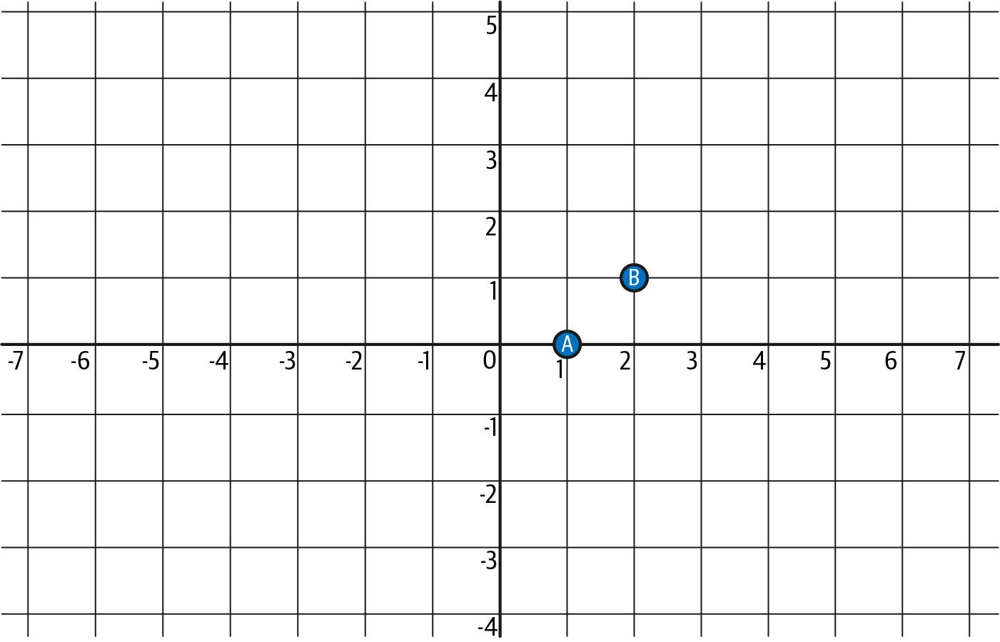

Figure 4-11. Two distinct points A and B

It's easy to understand that there is a line—a polynomial of degree 1 (which is less than two, the number of points)—that goes through both A and B.

That line is:

```
I(x) = x – 1
```

Figure 4-12 better illustrates this.

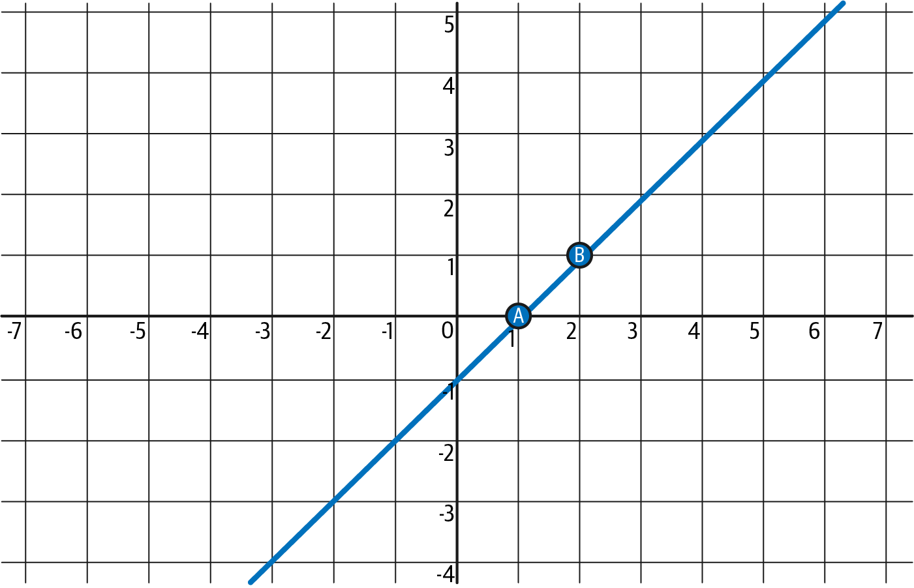

Figure 4-12. The interpolation polynomial (line) passing through points A and B

Here, we used our intuition, but we can use the formula to prove that the result is the same. Remember that we have `k = 2`:

```
I(x) = y₀ · (x – z₁)/(z₀ – z₁) + y₁ · (x – z₀)/(z₁ – z₀)
     = 0 · (x – 2)/(1 – 2) + 1 · (x – 1)/(2 – 1)
     = 0 + (x – 1) = x – 1
```
Since the prover wants to prove that `p(x)` goes through all those points mentioned at the start of this section, and we assume that's true—that is, the prover is trustworthy—`p(x) – I(x)` is zero at each `z₀, z₁, …, zₖ₋₁` point.

That means it's divisible by `(x – z₀)(x – z₁)...(x – zₖ₋₁)`. We call this polynomial `Z(x)` the *zerofier*.

Now, we proceed with the usual method. The prover computes the quotient polynomial `q(x)`:

```
q(x) = [p(x) – I(x)] / Z(x)
```

and generates the proof `π = [q(s)]₁`. Note that this proof is the usual (single elliptic curve point) KZG proof.

To check the validity of this proof, the verifier needs to:

1. Compute `I(x)` by applying the formula previously described and then calculating `[I(s)]₁`.
2. Compute `Z(x)` and then calculate `[Z(s)]₂`. Note that the verifier can compute `Z(x)` because they know all the claimed points (and values) that the prover wants to prove.
3. And then apply the usual equivalence check:

```
e(π, [Z(s)]₂) = e(C – [I(s)]₁, H)
```

by writing the equation in the pairing group:

```
q(s)Z(s) = p(s) – I(s)
```

That's the same equation we had when the prover computed the quotient polynomial before, with the only difference that here it's evaluated at the secret point `s`.

### In Summary

Let's summarize the entire prover↔verifier flow in the KZG commitment scheme.

We start with the prover, who has knowledge of some data. They immediately encode this data into a polynomial, as shown in Figure 4-13.

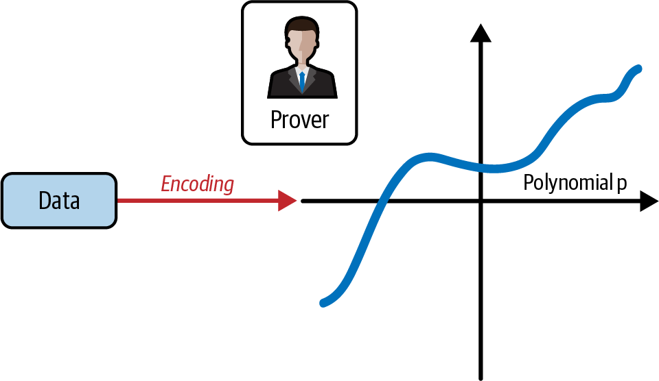

Figure 4-13. The prover encodes the data into a polynomial p

The goal of the prover is to convince the verifier that they know a certain piece of data, now encoded as a polynomial. However, the prover does not want to reveal the entire dataset. Instead, they want the verifier to be able to verify specific claims about the data. In particular, the prover wants the verifier to confirm that the polynomial evaluates to the expected values at specific points, as shown in Figure 4-14.

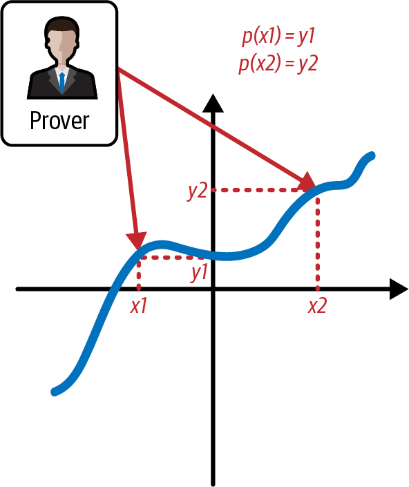

Figure 4-14. The prover wants to prove the evaluation of the polynomial at specific points

To achieve this goal, the prover computes the KZG commitment of the polynomial and sends it to the verifier, as shown in Figure 4-15.

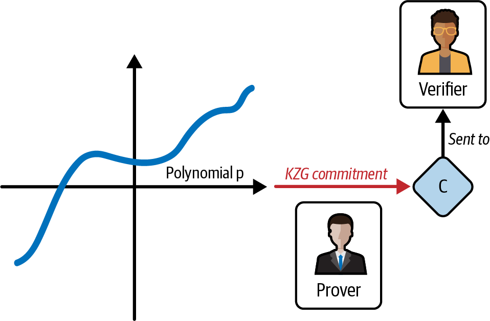

Figure 4-15. The prover computes KZG commitment C and sends it to the verifier

Then, the prover needs to compute the KZG proof for all evaluations that they want to prove to the verifier, as shown in Figure 4-16.

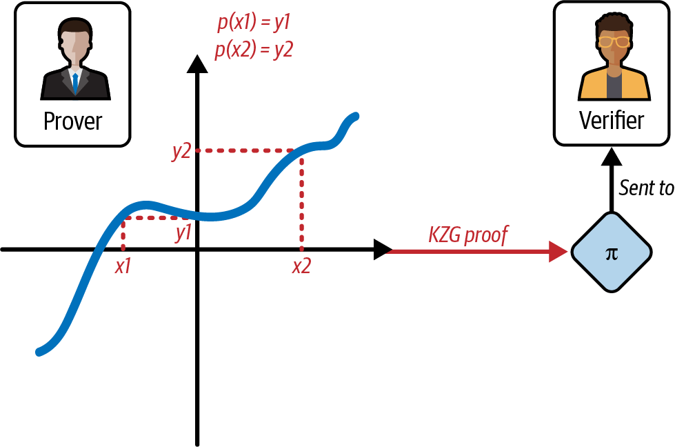

Figure 4-16. The prover computes the KZG proof of different evaluations of the polynomials and sends it to the verifier

Now, it's the verifier's turn. To make sure that the prover is honest, the verifier needs to compute the elliptic curve pairing check using the information that the prover has previously sent, along with the trusted setup, as you can see in Figure 4-17.

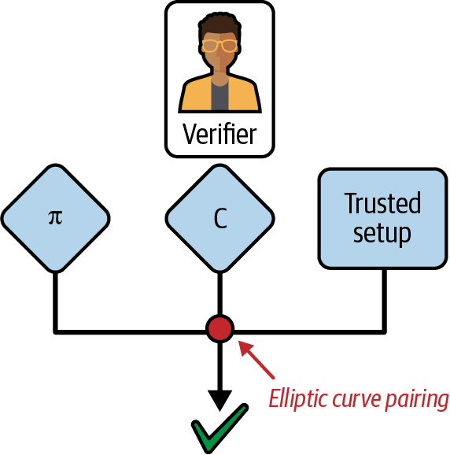

Figure 4-17. The verifier checks the validity of the evaluations through an elliptic curve pairing operation

## Conclusion

We provided a survey of PKC and focused on the use of public and private keys in Ethereum and of cryptographic tools, such as hash functions, in the creation and verification of Ethereum addresses. We also looked at digital signatures and how they can show ownership of a private key without revealing that key. In Chapter 5, we’ll put these ideas together and look at how wallets can be used to manage collections of keys.
