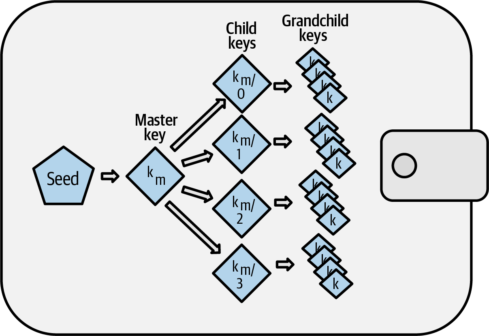
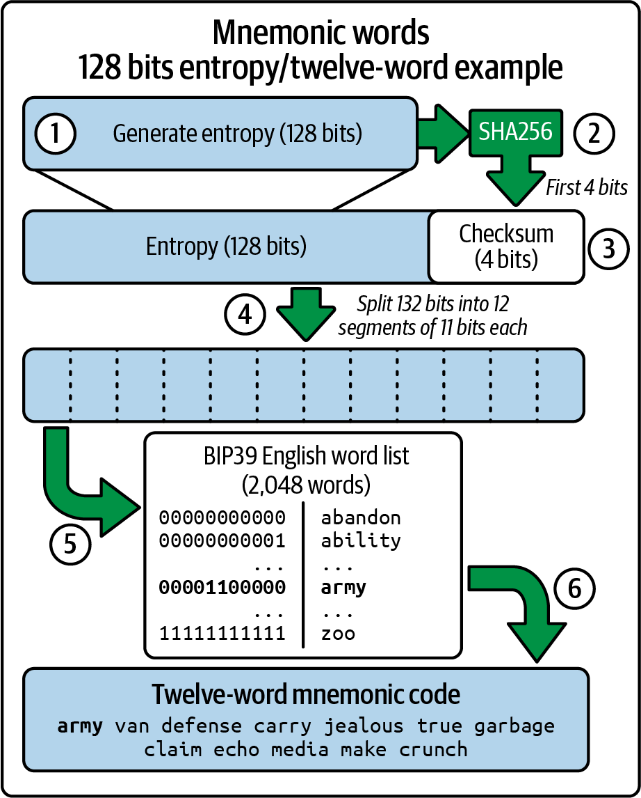
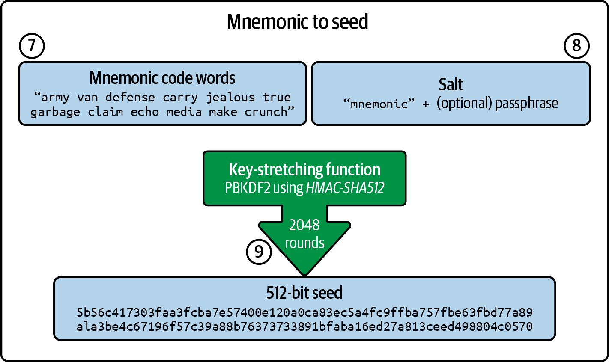
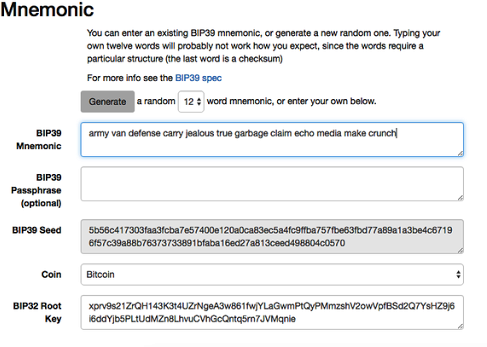
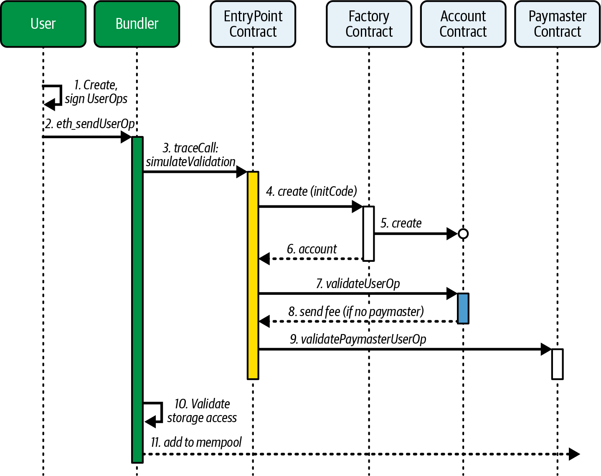
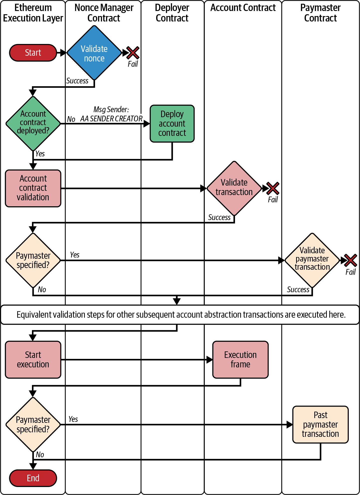
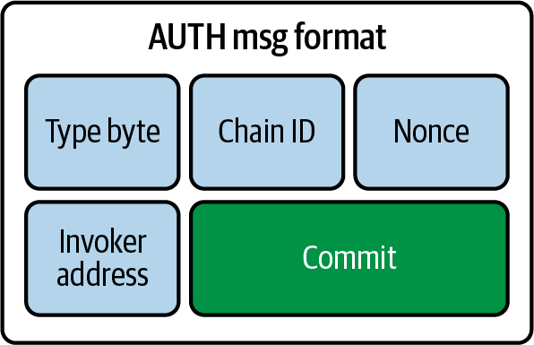
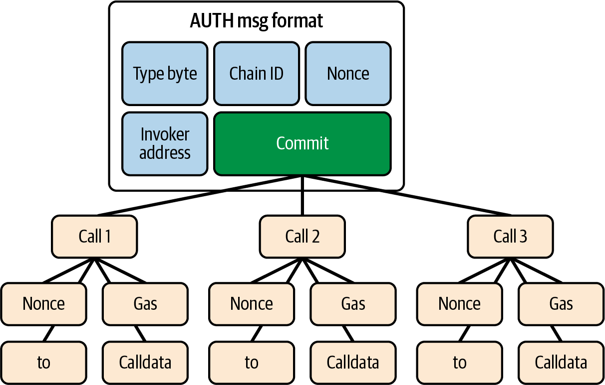
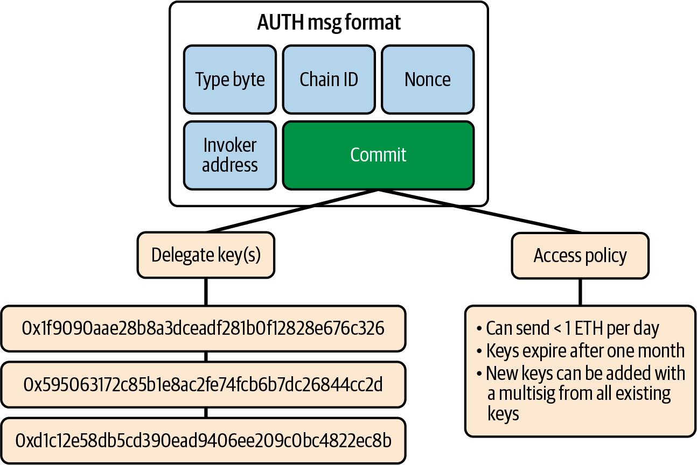
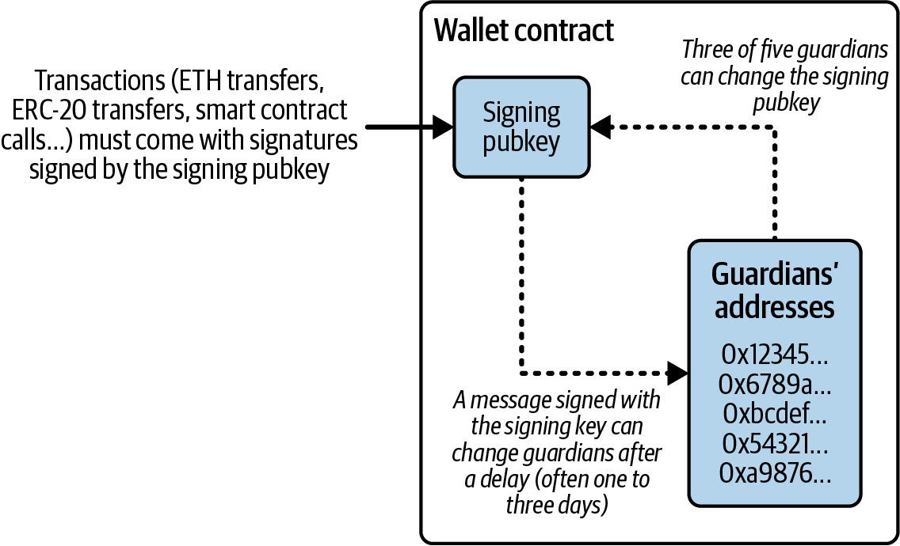

# Chapter 5: Wallets

The word *wallet* is used to describe a few different things in Ethereum. At a high level, a wallet is a software application that serves as the primary user interface to Ethereum. The wallet controls access to a user's money, manages keys and addresses, tracks the balance, and creates and signs transactions. In addition, some Ethereum wallets can interact with contracts, such as ERC-20 tokens.

More narrowly, from a programmer's perspective, the word *wallet* refers to the system used to store and manage a user's keys. Every wallet has a key-management component. For some wallets, that's all there is. Other wallets are part of a much broader category, that of *browsers*, which are interfaces to Ethereum-based DApps, which we will examine in more detail in Chapter 12. There are no clear lines of distinction between the various categories that are conflated under the term *wallet*.

In this chapter, we will look at wallets as containers for private keys and as systems for managing these keys.

## Overview of Wallet Technologies

In this section, we summarize the various technologies used to construct user-friendly, secure, and flexible Ethereum wallets.

One key consideration in designing wallets is balancing convenience and privacy. The most convenient Ethereum wallet is one with a single private key and address that you reuse for everything. Unfortunately, such a solution is a privacy nightmare since anyone can easily track and correlate all your transactions. Using a new key for every transaction is best for privacy but becomes very difficult to manage. The correct balance is difficult to achieve, which is why good wallet design is paramount.

A common misconception about Ethereum is that Ethereum wallets contain ether or tokens. In fact, very strictly speaking, the wallet holds only keys. The ether or other tokens are recorded on the Ethereum blockchain. Users control the tokens on the network by signing transactions with the keys in their wallets. In a sense, an Ethereum wallet is a *keychain*. Having said that, given that the keys held by the wallet are the only things needed to transfer ether or tokens to others, in practice this distinction is fairly irrelevant.

Where the difference does matter is in changing one's mindset from dealing with the centralized system of conventional banking (where only you and the bank can see the money in your account, and you only need to convince the bank that you want to move funds to make a transaction) to the decentralized system of blockchain platforms (where everyone can see the ether balance of an account, although they probably don't know the account's owner, and everyone needs to be convinced that the owner wants to move funds for a transaction to be enacted). In practice, this means that there is an independent way to check an account's balance without needing its wallet. Moreover, you can move your account handling from your current wallet to a different wallet, if you grow to dislike the wallet app you started out using.

> **Note**  
>
> Ethereum wallets contain keys, not ether or tokens. Wallets are like keychains containing pairs of private and public keys. Users sign transactions with the private keys, thereby proving they own the ether. The ether is stored on the blockchain.

There are two primary types of wallets, distinguished by whether the keys they contain are related to one another or not.

The first type is a *nondeterministic wallet*, where each key is independently generated from a different random number. The keys are not related to one another. This type of wallet is also known as a *JBOK wallet*, from the phrase "just a bunch of keys."

The second type of wallet is a *deterministic wallet*, where all the keys are derived from a single master key, known as the *seed*. All the keys in this type of wallet are related to one another and can be generated again if you have the original seed. Several different key-derivation methods are used in deterministic wallets. The most common derivation method uses a treelike structure, as described in "Hierarchical Deterministic Wallets (BIP-32/BIP-44)".

To make deterministic wallets slightly more secure against data-loss accidents, such as having your phone stolen or dropping it in the toilet, the seeds are often encoded as a list of words (in English or another language) for you to write down and use in case of an accident. These are known as the wallet's *mnemonic code words*. Of course, if someone gets hold of your mnemonic code words, then they can also re-create your wallet and thus gain access to your ether and smart contracts. As such, be very, very careful with your recovery word list! Never store it electronically, in a file on your computer or phone. Write it down on paper and store it in a safe, secure place.

The next few sections introduce each of the wallet technologies at a high level.

### Nondeterministic (Random) Wallets

In the first Ethereum wallet (produced for the Ethereum presale), each wallet file stored a single randomly generated private key. Such wallets are being replaced with deterministic wallets because these "old-style" wallets are in many ways inferior. For example, it is considered good practice to avoid reusing Ethereum addresses as part of maximizing your privacy while using Ethereum—that is, to use a new address (which needs a new private key) every time you receive funds. You can go further and use a new address for each transaction, although this can get expensive if you deal a lot with tokens. To follow this practice, a nondeterministic wallet will need to regularly increase its list of keys, which means you will need to make regular backups. If you ever lose your data (disk failure, drink accident, phone stolen) before you've managed to back up your wallet, you will lose access to your funds and smart contracts. The "type 0" nondeterministic wallets are the hardest to deal with because they create a new wallet file for every new address in a "just in time" manner.

Nevertheless, many Ethereum clients (including Geth) use a *keystore file*, which is a JSON-encoded file that contains a single (randomly generated) private key, encrypted by a passphrase for extra security. The JSON file's contents look like this:

```json
{
    "address": "001d3f1ef827552ae1114027bd3ecf1f086ba0f9",
    "crypto": {
        "cipher": "aes-128-ctr",
        "ciphertext":
            "233a9f4d236ed0c13394b504b6da5df02587c8bf1ad8946f6f2b58f055507ece",
        "cipherparams": {
            "iv": "d10c6ec5bae81b6cb9144de81037fa15"
        },
        "kdf": "scrypt",
        "kdfparams": {
            "dklen": 32,
            "n": 262144,
            "p": 1,
            "r": 8,
            "salt":
                "99d37a47c7c9429c66976f643f386a61b78b97f3246adca89abe4245d2788407"
        },
        "mac": "594c8df1c8ee0ded8255a50caf07e8c12061fd859f4b7c76ab704b17c957e842"
    },
    "id": "4fcb2ba4-ccdb-424f-89d5-26cce304bf9c",
    "version": 3
}
```

The keystore format uses a *key derivation function* (KDF), also known as a *password-stretching algorithm*, which protects against brute-force, dictionary, and rainbow table attacks. In simple terms, the private key is not encrypted by the passphrase directly. Instead, the passphrase is "stretched" by repeatedly hashing it. The hashing function is repeated for 262,144 rounds, which can be seen in the keystore JSON as the parameter `crypto.kdfparams.n`. An attacker trying to brute-force the passphrase would have to apply 262,144 rounds of hashing for every attempted passphrase, which slows the attack sufficiently to make it infeasible for passphrases of appropriate complexity and length.

> **Tip**  
>
> Using nondeterministic wallets is discouraged for anything other than simple tests. They are too cumbersome to back up and use for anything but the most basic of situations. Instead, use an industry standard–based hierarchical deterministic wallet with a mnemonic seed for backup.

### Deterministic (Seeded) Wallets

Deterministic or "seeded" wallets contain private keys that are all derived from a single master key, or seed. The seed is a randomly generated number that is combined with other data, such as an index number or "chain code" (see "Extended Public and Private Keys"), to derive any number of private keys. In a deterministic wallet, the seed is sufficient to recover all the derived keys, and therefore a single backup, at creation time, is sufficient to secure all the funds and smart contracts in the wallet. The seed is also sufficient for a wallet export or import, allowing for easy migration of all the keys between different wallet implementations.

This design makes the security of the seed of utmost importance, as only the seed is needed to gain access to the entire wallet. On the other hand, being able to focus security efforts on a single piece of data can be seen as an advantage.

### Hierarchical Deterministic Wallets (BIP-32/BIP-44)

Deterministic wallets were developed to make it easy to derive many keys from a single seed. Currently, one of the most advanced forms of deterministic wallet is the *hierarchical deterministic (HD) wallet* defined by Bitcoin's BIP-32 standard. HD wallets contain keys derived in a tree structure, such that a parent key can derive a sequence of child keys, each of which can derive a sequence of grandchild keys, and so on. This tree structure is illustrated in Figure 5-1.



Figure 5-1. HD wallet: a tree of keys generated from a single seed

HD wallets offer a few key advantages over simpler deterministic wallets. First, the tree structure can be used to express additional organizational meaning, such as when a specific branch of subkeys is used to receive incoming payments and a different branch is used to receive change from outgoing payments. Branches of keys can also be used in corporate settings, where different branches can be allocated to departments, subsidiaries, specific functions, or accounting categories.

The second advantage of HD wallets is that users can create a sequence of public keys without having access to the corresponding private keys. This allows HD wallets to be used on an insecure server or in a watch-only or receive-only capacity, where the wallet doesn't have the private keys that can spend the funds.

### Seeds and Mnemonic Codes (BIP-39)

There are many ways to encode a private key for secure backup and retrieval. The currently preferred method is to use a sequence of words that, when taken together in the correct order, can uniquely re-create the private key. This is sometimes known as a *mnemonic*, and the approach has been standardized by BIP-39. Today, many Ethereum wallets (as well as wallets for other cryptocurrencies) use this standard and can import and export seeds for backup and recovery using interoperable mnemonics.

To see why this approach has become popular, let's have a look at an example:

```
FCCF1AB3329FD5DA3DA9577511F8F137 ← seed in hexadecimal
wolf juice proud gown wool unfair
wall cliff insect more detail hub ← seed using BIP-39 representation
```

In practical terms, the chance of an error when writing down the hex sequence is unacceptably high. In contrast, the list of known words is quite easy to deal with, mainly because there is a high level of redundancy in the writing of words (especially English words). If *inzect* had been recorded by accident, it could quickly be determined, upon the need for wallet recovery, that *inzect* is not a valid English word and that *insect* should be used instead. We are talking about writing down a representation of the seed because that is good practice when managing HD wallets: the seed is needed to recover the wallet in the case of data loss (whether through accident or theft), so keeping a backup is very prudent. However, the seed must be kept extremely private, so digital backups should be carefully avoided—hence, the advice to back up with pen and paper.

In summary, using a recovery word list to encode the seed for an HD wallet is the easiest way to safely export a private key set, transcribe it, record it on paper, read it without error, and import it into another wallet.

## Wallet Best Practices

As cryptocurrency wallet technology has matured, certain industry standards have emerged that make wallets broadly interoperable, easy to use, secure, and flexible. These standards also allow wallets to derive keys for multiple different cryptocurrencies, all from a single mnemonic. These standards are:

- Mnemonic code words, based on BIP-39
- HD wallets, based on BIP-32
- A multipurpose HD wallet structure, based on BIP-43
- Multicurrency and multiaccount wallets, based on BIP-44

These standards may change or be made obsolete by future developments, but for now, they form a set of interlocking technologies that have become the de facto wallet standard for most blockchain platforms and their cryptocurrencies.

A broad range of software and hardware wallets have adopted the standards, making all these wallets interoperable. A user can export a mnemonic generated in one of these wallets and import it to another wallet, recovering all keys and addresses.

Some examples of software wallets supporting these standards include Rabby Wallet, MetaMask, and Phantom. Examples of hardware wallets supporting these standards are various models of Ledger and Trezor.

The following sections examine each of these technologies in detail.

> **Tip**  
>
> If you are implementing an Ethereum wallet, it should be built as an HD wallet, with a seed encoded as a mnemonic code for backup, following the BIP-32, BIP-39, BIP-43, and BIP-44 standards, as described in the following sections.

### Mnemonic Code Words (BIP-39)

Mnemonic code words are word sequences that encode a random number used as a seed to derive a deterministic wallet. The sequence of words is sufficient to re-create the seed and, from there, to re-create the wallet and all the derived keys. A wallet application that implements deterministic wallets with mnemonic words will show the user a sequence of 12–24 words when first creating a wallet. That sequence of words is the wallet backup and can be used to recover and re-create all the keys in the same or any compatible wallet application. As we explained earlier, mnemonic word lists make it easier for users to back up wallets because they are easy to read and correctly transcribe.

> **Note**  
>
> Mnemonic words are often confused with *brainwallets*. They are not the same. The primary difference is that a brainwallet consists of words chosen by the user, whereas mnemonic words are created randomly by the wallet and presented to the user. This important difference makes mnemonic words much more secure because humans are very poor sources of randomness. Perhaps more important, using the term *brainwallet* suggests that the words have to be memorized, which is a terrible idea and a recipe for not having your backup when you need it.

Mnemonic codes are defined in BIP-39. Note that BIP-39 is one implementation of a mnemonic code standard. There is a different standard, with a different set of words, used by the Electrum Bitcoin wallet and predating BIP-39. BIP-39 was proposed by the company behind the Trezor hardware wallet and is incompatible with Electrum's implementation. However, BIP-39 has now achieved broad industry support across dozens of interoperable implementations and should be considered the de facto industry standard. Furthermore, BIP-39 can be used to produce multicurrency wallets supporting Ethereum, whereas Electrum seeds cannot.

BIP-39 defines the creation of a mnemonic code and seed, which we describe here in nine steps. For clarity, the process is split into two parts: steps 1 through 6 are listed in "Generating mnemonic words", and steps 7 through 9 are listed in "From mnemonic to seed".

#### Generating mnemonic words

The wallet generates mnemonic words automatically using the standardized process defined in BIP-39. The wallet starts from a source of entropy, adds a checksum, and then maps the entropy to a word list following these steps:

1. Create a cryptographically random sequence *S* of 128–256 bits.

2. Create a checksum of *S* by taking the first length-of-*S* ÷ 32 bits of the SHA-256 hash of *S*.

3. Add the checksum to the end of the random sequence *S*.

4. Divide the sequence-and-checksum concatenation into sections of 11 bits.

5. Map each 11-bit value to a word from the predefined dictionary of 2,048 words.

6. Create the mnemonic code from the sequence of words, maintaining the order.

Figure 5-2 shows how entropy is used to generate mnemonic words.



Figure 5-2. Generating mnemonic words

Table 5-1 shows the relationship between the size of the entropy data and the length of mnemonic codes in words.

**Table 5-1. Mnemonic codes: Entropy and word length**

| Entropy (bits) | Checksum (bits) | Entropy + checksum (bits) | Mnemonic length (words) |
|---|---|---|---|
| 128 | 4 | 132 | 12 |
| 160 | 5 | 165 | 15 |
| 192 | 6 | 198 | 18 |
| 224 | 7 | 231 | 21 |
| 256 | 8 | 264 | 24 |

#### From mnemonic to seed

The mnemonic words represent entropy with a length of 128–256 bits. The entropy is then used to derive a longer (512-bit) seed through the use of the key-stretching function PBKDF2. The seed produced is used to build a deterministic wallet and derive its keys.

The key-stretching function takes two parameters: the mnemonic and a salt. The purpose of a salt in a key-stretching function is to make it difficult to build a lookup table enabling a brute-force attack. In the BIP-39 standard, the salt has another purpose: it allows for the introduction of a passphrase that serves as an additional security factor protecting the seed, which we will describe in more detail in the next section.

The process continues from the previous section with the following steps:

7. The first parameter to the PBKDF2 key-stretching function is the mnemonic produced in step 6.

8. The second parameter to the PBKDF2 key-stretching function is a *salt*. The salt is composed of the string constant `"mnemonic"` concatenated with an optional user-supplied passphrase.

9. PBKDF2 stretches the mnemonic and salt parameters using 2,048 rounds of hashing with the HMAC-SHA512 algorithm, producing a 512-bit value as its final output. That 512-bit value is the seed.

Figure 5-3 shows how a mnemonic is used to generate a seed.



Figure 5-3. From mnemonic to seed

> **Note**  
>
> The key-stretching function, with its 2,048 rounds of hashing, is a somewhat effective protection against brute-force attacks against the mnemonic or the passphrase. It makes it costly (in computation) to try more than a few thousand passphrase and mnemonic combinations, while the number of possible derived seeds is vast (2^512^, or about 10^154^)—far bigger than the number of atoms in the visible universe (about 10^80^).

Tables 5-2, 5-3, and 5-4 show some examples of mnemonic codes and the seeds they produce.

**Table 5-2. A 128-bit entropy mnemonic code with no passphrase and the resulting seed**

| | |
|---|---|
| **Entropy** | 0c1e24e5917779d297e14d45f14e1a1a |
| **Mnemonic** | army van defense carry jealous true garbage claim echo media make crunch |
| **Passphrase** | (none) |
| **Seed** | 5b56c417303faa3fcba7e57400e120a0ca83ec5a4fc9ffba757fbe63fbd77a89a1a3be4c67196f57c39... |

**Table 5-3. A 128-bit entropy mnemonic code with a passphrase and the resulting seed**

| | |
|---|---|
| **Entropy** | 0c1e24e5917779d297e14d45f14e1a1a |
| **Mnemonic** | army van defense carry jealous true garbage claim echo media make crunch |
| **Passphrase** | SuperDuperSecret |
| **Seed** | 3b5df16df2157104cfdd22830162a5e170c0161653e3afe6c88defeefb0818c793dbb28ab3ab091897d0... |

**Table 5-4. A 256-bit entropy mnemonic code with no passphrase and the resulting seed**

| | |
|---|---|
| **Entropy** | 2041546864449caff939d32d574753fe684d3c947c3346713dd8423e74abcf8c |
| **Mnemonic** | cake apple borrow silk endorse fitness top denial coil riot stay wolf luggage oxygen faint major edit measure invite love trap field dilemma oblige |
| **Passphrase** | (none) |
| **Seed** | 3269bce2674acbd188d4f120072b13b088a0ecf87c6e4cae41657a0bb78f5315b33b3a04356e53d062e5... |

#### Optional Passphrase in BIP-39

The BIP-39 standard allows for the use of an optional passphrase in the derivation of the seed. If no passphrase is used, the mnemonic is stretched with a salt consisting of the constant string `"mnemonic"`, producing a specific 512-bit seed from any given mnemonic. If a passphrase is used, the stretching function produces a *different* seed from that same mnemonic. In fact, given a single mnemonic, every possible passphrase leads to a different seed. Essentially, there is no "wrong" passphrase. All passphrases are valid, and they all lead to different seeds, forming a vast set of possible uninitialized wallets. The set of possible wallets is so large (2^512^) that there is no practical possibility of brute-forcing or accidentally guessing one that is in use, as long as the passphrase has sufficient complexity and length.

> **Tip**  
>
> There are no "wrong" passphrases in BIP-39. Every passphrase leads to some wallet, which unless previously used will be empty.

The optional passphrase creates two important features:

- A second factor (something memorized) that makes a mnemonic useless on its own, protecting mnemonic backups from compromise by a thief

- A form of plausible deniability or "duress wallet," where a chosen passphrase leads to a wallet with a small amount of funds, used to distract an attacker from the "real" wallet that contains the majority of funds

However, it is important to note that the use of a passphrase also introduces the risk of loss:

- If the wallet owner is incapacitated or dead and no one else knows the passphrase, the seed is useless, and all the funds stored in the wallet are lost forever.

- Conversely, if the owner backs up the passphrase in the same place as the seed, that defeats the purpose of a second factor.

While passphrases are very useful, they should be used only in combination with a carefully planned process for backup and recovery, considering the possibility of heirs surviving the owner being able to recover the cryptocurrency.

#### Working with Mnemonic Codes

BIP-39 is implemented as a library in many different programming languages, such as:

**python-mnemonic**

The reference implementation of the standard by the SatoshiLabs team that proposed BIP-39, in Python

**ConsenSys/eth-lightwallet**

A lightweight JavaScript Ethereum wallet for nodes and browser (with BIP-39)

**npm/bip39**

A JavaScript implementation of Bitcoin BIP-39

There is also a BIP-39 generator implemented in a standalone web page (Figure 5-4), which is extremely useful for testing and experimentation. The [Mnemonic Code Converter](https://iancoleman.io/bip39/) generates mnemonics, seeds, and extended private keys. It can be used offline in a browser, or it can be accessed online.

> **Note**  
>
> This will be emphasized repeatedly throughout the chapter because it is the most crucial rule for seed security: never, under any circumstances, save your seed phrase in digital form.



Figure 5-4. The BIP-39 generator web page

### Creating an HD Wallet from the Seed

HD wallets are created from a single *root seed*, which is a 128-, 256-, or 512-bit random number. This seed is most commonly generated from a mnemonic, as detailed in the previous section.

Every key in the HD wallet is deterministically derived from this root seed, which makes it possible to re-create the entire HD wallet from that seed in any compatible HD wallet. This makes it easy to export, back up, restore, and import HD wallets containing thousands or even millions of keys by transferring just the mnemonic from which the root seed is derived.

### HD Wallets (BIP-32)

Most HD wallets follow the BIP-32 standard, which has become a de facto industry standard for deterministic key generation. We won't be discussing all the details of BIP-32 here, only the components necessary to understand how it is used in wallets. The most important aspect is the treelike hierarchical relationships that it is possible for the derived keys to have, as you can see in Figure 5-1. It's also important to understand the ideas of extended keys and hardened keys, which are explained in the following sections.

There are dozens of interoperable implementations of BIP-32 offered in many software libraries. These are mostly designed for Bitcoin wallets, which implement addresses in a different way, but they share the same key-derivation implementation as Ethereum's BIP-32-compatible wallets. Use one designed for Ethereum or adapt one from Bitcoin by adding an Ethereum address encoding library.

There is also a BIP-32 generator implemented as a standalone web page that is very useful for testing and experimentation with BIP-32.

> **Warning**  
>
> The standalone BIP-32 generator is not an HTTPS site. That's to remind you that using this tool is not secure. It is only for testing. You should not use the keys produced by this site with real funds.

#### Extended Public and Private Keys

In BIP-32 terminology, keys can be "extended." With the right mathematical operations, these extended "parent" keys can be used to derive "child" keys, thus producing the hierarchy of keys and addresses described earlier. A parent key doesn't have to be at the top of the tree. It can be picked out from anywhere in the tree hierarchy. Extending a key involves taking the key itself and appending a special *chain code* to it. A chain code is a 256-bit binary string that is mixed with each key to produce child keys.

If the key is a private key, it becomes an *extended private key* distinguished by the prefix `xprv`:

    xprv9s21ZrQH143K2JF8RafpqtKiTbsbaxEeUaMnNHsm5o6wCW3z8ySyH4UxFVSfZ8n7ESu7fgir8i...

An *extended public key* is distinguished by the prefix `xpub`:

    xpub661MyMwAqRbcEnKbXcCqD2GT1di5zQxVqoHPAgHNe8dv5JP8gWmDproS6kFHJnLZd23tWevhdn...

A very useful characteristic of HD wallets is the ability to derive child public keys from parent public keys *without* having the private keys. This gives us two ways to derive a child public key: either directly from the child private key or from the parent public key. An extended public key can be used, therefore, to derive all the public keys (and *only* the public keys) in that branch of the HD wallet structure.

This shortcut can be used to create extremely secure public-key-only deployments, where a server or application has a copy of an extended public key but no private keys whatsoever. That kind of deployment can produce an infinite number of public keys and Ethereum addresses but cannot spend any money sent to those addresses. Meanwhile, on another, more secure server, the extended private key can derive all the corresponding private keys to sign transactions and spend the money.

One common application of this method is to install an extended public key on a web server that serves an ecommerce application. The web server can use the public key derivation function to create a new Ethereum address for every transaction (e.g., for a customer shopping cart) and will not have any private keys that would be vulnerable to theft. Without HD wallets, the only way to do this is to generate thousands of Ethereum addresses on a separate secure server and then preload them on the ecommerce server. That approach is cumbersome and requires constant maintenance to ensure that the server doesn't run out of keys—hence the preference to use extended public keys from HD wallets.

Another common application of this solution is for cold-storage or hardware wallets. In that scenario, the extended private key can be stored in a hardware wallet, while the extended public key can be kept online. The user can create "receive" addresses at will while the private keys are safely stored offline. To spend the funds, the user can use the extended private key in an offline signing Ethereum client or sign transactions on the hardware wallet device.

#### Hardened Child Key Derivation

The ability to derive a branch of public keys from an extended public key, or `xpub`, is very useful, but it comes with potential risk. Access to an `xpub` does not give access to child private keys. However, because the `xpub` contains the chain code (used to derive child public keys from the parent public key), if a child private key is known or somehow leaked, it can be used with the chain code to derive all the other child private keys. A single leaked child private key, together with a parent chain code, reveals all the private keys of all the children. Worse, the child private key together with a parent chain code can be used to deduce the parent private key.

To counter this risk, HD wallets use an alternative derivation function called *hardened derivation*, which "breaks" the relationship between parent public key and child chain code. The hardened derivation function uses the parent private key to derive the child chain code, instead of the parent public key. This creates a "firewall" in the parent-child sequence, with a chain code that cannot be used to compromise a parent or sibling private key.

In simple terms, if you want to use the convenience of an `xpub` to derive branches of public keys without exposing yourself to the risk of a leaked chain code, you should derive it from a hardened parent, rather than a normal parent. Best practice is to have the level-one children of the master keys always derived by hardened derivation, to prevent compromise of the master keys.

#### Index Numbers for Normal and Hardened Derivation

It is clearly desirable to be able to derive more than one child key from a given parent key. To manage this, an index number is used. Each index number, when combined with a parent key using the special child derivation function, gives a different child key. The index number used in the BIP-32 parent-to-child derivation function is a 32-bit integer. To easily distinguish between keys derived through the normal (unhardened) derivation function versus keys derived through hardened derivation, this index number is split into two ranges. Index numbers between 0 and 2^31^–1 (0x0 to 0x7FFFFFFF) are used *only* for normal derivation. Index numbers between 2^31^ and 2^32^–1 (0x80000000 to 0xFFFFFFFF) are used *only* for hardened derivation. Therefore, if the index number is less than 2^31^, the child is normal, whereas if the index number is equal to or above 2^31^, the child is hardened.

To make the index numbers easier to read and display, the index numbers for hardened children are displayed starting from zero, but with a prime symbol. The first normal child key is therefore displayed as 0, whereas the first hardened child (index 0x80000000) is displayed as 0′. In sequence, then, the second hardened key would have an index of 0x80000001 and would be displayed as 1′, and so on. When you see an HD wallet index *i*′, that means 2^31^ + *i*.

#### HD Wallet Key Identifier (Path)

Keys in an HD wallet are identified using a "path" naming convention, with each level of the tree separated by a slash (`/`) character (see Table 5-5). Private keys derived from the master private key start with `m`. Public keys derived from the master public key start with `M`. Therefore, the first child private key of the master private key is `m/0`. The first child public key is `M/0`. The second grandchild of the first child is `m/0/1`, and so on.

The "ancestry" of a key is read from right to left, until you reach the master key from which it was derived. For example, identifier `m/x/y/z` describes the key that is the *z*-th child of key `m/x/y`, which is the *y*-th child of key `m/x`, which is the *x*-th child of `m`.

**Table 5-5. HD wallet path examples**

| HD path | Key described |
|---|---|
| m/0 | The first (0) child private key from the master private key (m) |
| m/0/0 | The first grandchild private key of the first child (m/0) |
| m/0'/0 | The first normal grandchild of the first hardened child (m/0') |
| m/1/0 | The first grandchild private key of the second child (m/1) |
| M/23/17/0/0 | The first great-great-grandchild public key of the first great-grandchild of the 18th grandchild of the 24th child |

### Navigating the HD Wallet Tree Structure

The HD wallet tree structure is tremendously flexible. The flip side of this is that it also allows for unbounded complexity: each parent extended key can have four billion children—two billion normal children and two billion hardened children. Each of those children can have another four billion children, and so on. The tree can be as deep as you want, with a potentially infinite number of generations. With all that potential, it can become quite difficult to navigate these very large trees.

Two BIPs offer a way to manage this potential complexity by creating standards for the structure of HD wallet trees. BIP-43 proposes the use of the first hardened child index as a special identifier that signifies the "purpose" of the tree structure. Based on BIP-43, an HD wallet should use only one level-one branch of the tree, with the index number defining the purpose of the wallet by identifying the structure and namespace of the rest of the tree. More specifically, an HD wallet using only branch `m/i′/...` is intended to signify a specific purpose, and that purpose is identified by index number *i*.

Extending that specification, BIP-44 proposes a multicurrency, multiaccount structure signified by setting the "purpose" number to `44′`. All HD wallets following the BIP-44 structure are identified by the fact that they use only one branch of the tree: `m/44′/*`. BIP-44 specifies the structure as consisting of five predefined tree levels:

    m / purpose′ / coin_type′ / account′ / change / address_index

The first level, `purpose′`, is always set to `44′`. The second level, `coin_type′`, specifies the type of cryptocurrency coin, allowing for multicurrency HD wallets where each currency has its own subtree under the second level. There are several currencies defined in the standards document SLIP-0044; for example, Ethereum is `m/44′/60′`, Ethereum Classic is `m/44′/61′`, Bitcoin is `m/44′/0′`, and testnet for all currencies is `m/44′/1′`.

The third level of the tree is `account′`, which allows users to subdivide their wallets into separate logical subaccounts for accounting or organizational purposes. For example, an HD wallet might contain two Ethereum accounts: `m/44′/60′/0′` and `m/44′/60′/1′`. Each account is the root of its own subtree.

Because BIP-44 was created originally for Bitcoin, it contains a "quirk" that isn't relevant in the Ethereum world. On the fourth level of the path, `change`, an HD wallet has two subtrees: one for creating receiving addresses and one for creating change addresses. Only the "receive" path is used in Ethereum, as there is no necessity for a change address like there is in Bitcoin. Note that whereas the previous levels used hardened derivation, this level uses normal derivation. This is to allow the account level of the tree to export extended public keys for use in a nonsecured environment.

Usable addresses are derived by the HD wallet as children of the fourth level, making the fifth level of the tree the `address_index`. For example, the third receiving address for Ethereum payments in the primary account would be `M/44′/60′/0′/0/2`. Table 5-6 shows a few more examples.

**Table 5-6. BIP-44 HD wallet structure examples**

| HD path | Key described |
|---|---|
| M/44′/60′/0′/0/2 | The third receiving public key for the primary Ethereum account |
| M/44′/0′/3′/1/14 | The 15th change-address public key for the fourth Bitcoin account |
| m/44′/2′/0′/0/1 | The second private key in the Litecoin main account, for signing transactions |

## Security

Let's start by introducing the concept of security versus ease of recovery. Taking these concepts to the extreme: what's the most secure seed? It's the one that no one can recover, not even you. So if the seed is created and all copies (physical or digital) are destroyed, that's the most secure seed in the world. Not great, as you wouldn't be able to recover it, but it's technically the most secure.

On the flip side, for ease of recovery, what's the easiest seed to recover? One that has the seed phrase written everywhere, like getting it tattooed on your body, in plain sight. That seed will be super easy to recover but not secure at all.

Any choice you make for your operational security (OpSec) in self-custody will likely increase either the security or the ease of recovery of your seed phrase. Increasing security typically reduces ease of recovery, and vice versa. Sometimes, you may end up reducing both, which should be avoided.

Even with a high-security system, no setup is 100% secure. You can do everything in your power to create a perfect system, but there will still be vulnerabilities. One of the most interesting is private-key collisions: essentially generating a seed that's already been used. Since seeds in hardware wallets are generated offline and there's no database of generated seeds, it's technically possible to generate the same wallet twice. The chances of this happening are astronomically small (you're more likely to win the lottery twice in a row), but it's still a possibility.

> **Warning**  
>
> Often, there's no urgency in seed security. Either your seed has been stolen, in which case you're already in trouble, or it hasn't. This is especially true for Bitcoin wallets. For Ethereum, it is still the case, but there are situations where acting fast can save funds—for example, removing approvals to dangerous smart contracts. If you receive any urgent messages about your seed, it's probably a scam.

Complex security mechanisms for hiding your seed are not a best practice. Although they may seem foolproof at first, professionals in the field can often recover these types of seeds with the right tools. And if it's so complex that even professionals can't recover it, there's a good chance you won't be able to when needed.

Another non–best practice is relying on obscurity for security. Your system should have as few "secret" components as possible, with the seed itself being the main one. If revealing parts of your system causes it to collapse, it's not secure.

A best practice is to follow what most others do. Trying to invent new systems or, worse, creating everything from scratch is wrong. It's not secure, and the majority of people don't have the technical skills to do it. Keep things simple. Simplicity is absolutely a best practice.

Making a backup of your seed is probably the most important best practice. Whether it's a hardware wallet or a browser wallet, a backup is essential. Backup storage should (a) withstand natural disasters, (b) be geographically separate from your hardware wallet, (c) be in a secure place, and (d) have tamper-evident packaging. Dividing your seed across multiple pieces of paper is not a best practice. It gives a false sense of security.

> **Tip**  
>
> If you don't have a secure place to store your seed, consider using a passphrase. The passphrase adds an extra layer of protection by being combined with your seed during the key-generation process. You can even store the passphrase digitally since it's useless without the seed. If someone gets your seed but not your passphrase, they won't be able to access your funds for a certain amount of time; this is because the passphrase can be brute-forced if the attacker has the seed.

Everyone's needs are different, and their security requirements will vary accordingly. But you should always follow best practices. Your needs may change over time, so stay aware and adjust your OpSec if needed.

After setting up your hardware wallet, test your ability to recover the seed. Do this at least once every 12 months, ensuring that your backup works and is accessible.

What does a secure system look like? A trusted hardware wallet (like Trezor), at least one safe backup (never saved digitally), and a plan for inheritance in case something happens to you.

> **Note**  
>
> Inheritance is a very complicated topic. We recommend reading *Cryptoasset Inheritance Planning: A Simple Guide for Owners* by Pamela Morgan (Merkle Bloom).

## Improving on User Experience

As we mentioned earlier, at a high level, a wallet is a software application that serves as the primary user interface to Ethereum. So for most of Ethereum's users, the wallet is most of the user experience. For years, it has not really been improved. For example, the most popular browser wallet at the time of writing is MetaMask, which has not evolved that much since its inception; a close second, Rabby, has recently emerged. We will now examine a few updates to wallets that could drastically improve the user experience.

### Account Abstraction

Account abstraction (AA) on Ethereum is a way to make user accounts more flexible and easier to use. Normally, there are two types of accounts in Ethereum, as described in Chapter 2: EOAs and smart contract accounts. AA combines the benefits of both types. It allows regular accounts (EOAs) to behave more like smart contracts, meaning users can set up custom rules for how their accounts work, such as adding security features or allowing multiple people to sign transactions.

With AA, Ethereum can become more user-friendly and flexible. For example, you could recover a lost account without relying solely on a private key, or you could pay transaction fees in any token, not just ether.

There have been multiple proposals to implement AA. The main distinction is that one group of proposals tried to implement AA without changing the Ethereum protocol. Another group of proposals, which will be implemented in the Pectra upgrade, will end up changing the Ethereum protocol.

Let's look at the main EIPs and Ethereum Requests for Comments (ERCs) for AA. Keep in mind that these proposals are evolving rapidly, and by the time this book is published, the AA landscape may have changed significantly. Nevertheless, it's still useful to explore what has been implemented and what is planned for the near future.

> **Tip**  
>
> It is important to understand the difference between an ERC, an EIP, and a Rollup Improvement Proposal (RIP). Essentially, EIPs and RIPs are improvements that center on changes in the Ethereum networks, whereas ERCs are application-related changes that do not have any impact on core network capability.

#### ERC-4337

ERC-4337 is an advancement in the Ethereum blockchain that aims to make user accounts more versatile, secure, and user-friendly. Unlike typical upgrades that alter the Ethereum protocol, ERC-4337 introduces new functionality through smart contracts and off-chain components. As of September 2024, the primary on-chain implementation of AA is ERC-4337.

As we said in Chapter 2, traditional Ethereum accounts are divided into two types: EOAs, controlled solely by private keys, and contract accounts, which operate through smart contracts. EOAs dominate user wallets today because they are simple and economical; however, they are also limited in functionality and prone to security risks. Losing a private key can mean permanent loss of funds, and EOAs are not customizable for security features like multisignature setups or account-recovery options. Contract accounts can incorporate these security measures and more, yet their complexity and higher transaction fees have prevented their widespread use by everyday users. ERC-4337 overcomes this by enabling EOAs to function as smart contracts, merging the simplicity of EOAs with the security and flexibility of contract accounts.

The implementation of ERC-4337 introduces *UserOperations* to handle transactions differently, as shown in Figure 5-5. Rather than directly broadcasting each transaction to the blockchain, users submit UserOperations to a high-level mempool, where transactions are temporarily stored. Special participants, known as *bundlers*, collect and process these UserOperations, packaging them into a single Ethereum transaction. This process reduces network congestion and allows multiple operations to be processed in a more efficient, bundled manner. ERC-4337 also establishes a new role called *paymasters*. Typically, Ethereum transactions require the payment of gas fees in ETH, but paymasters make it possible for users to cover gas fees with alternative tokens or even to have a third-party sponsor pay the fees on their behalf. This shift eliminates a significant barrier, especially for newcomers who may not hold ETH, making the Ethereum network more inclusive and accessible.



Figure 5-5. ERC-4337 implementation diagram

Instead of using the traditional public mempool, which hosts pending transactions for EOAs, UserOperations are sent to a specialized *UserOperation mempool*: a higher-level mempool specifically designed for these operations. Bundlers monitor the UserOperation mempool, collecting multiple UserOperations to package them into a single "classic" transaction. They start by verifying each UserOperation's validity through the EntryPoint methods. After validation, the bundler submits this bundled transaction directly to the next proposed block, bypassing the regular mempool. Bundlers can either act as block builders themselves or collaborate with block builders to add the transaction to the blockchain.

#### EIP-2938

While ERC-4337 focuses on AA at a high level via smart contracts without changing Ethereum's core, EIP-2938 goes a step further by proposing that AA be embedded within the protocol layer itself. This lower-level approach allows for even more direct and flexible interactions among users, smart contracts, and applications by fundamentally changing how the EVM treats accounts. Through EIP-2938, users could handle operations without traditional EOAs, removing reliance on private-key-based accounts and enabling a greater diversity of account management systems, such as multisignature accounts or social recovery accounts, directly on Ethereum's protocol level.

The main difference between EIP-2938 and some existing AA proposals lies in the focus on integrating abstraction directly into the protocol, rather than layering it on top. With EIP-2938, Ethereum would support "operations" rather than "transactions," where each operation could represent a more versatile, customizable transaction type. EIP-2938 can redefine Ethereum's transactions as programmable objects, supporting a broader spectrum of use cases. By treating accounts and transactions as inherently programmable, it expands Ethereum's utility beyond standard payments and contract interactions, fitting perfectly with the increasingly complex applications being built on the network.

#### RIP-7560

The RIP-7560 proposal integrates EIP-2938 and ERC-4337 into a unified approach for native AA, splitting Ethereum's transaction scope into validation, execution, and post-transaction steps. By separating transaction validation into distinct processes for authorization and payment of gas fees, it enables one contract to sponsor gas fees for another account's transaction. This approach maintains compatibility with ERC-4337's ecosystem while working toward the goal of fully native AA.

ERC-4337 introduces AA at the application level, but it comes with limitations due to its out-of-protocol design. These drawbacks include extra gas costs, limited censorship resistance, a dependency on nonstandard RPC methods, and restrictions that limit compatibility with existing contract expectations. Native AA, as proposed in EIP-2938, presents a more robust alternative by building these features directly into the protocol. However, EIP-2938 doesn't fully align with ERC-4337's structure, which has been widely tested and implemented without protocol changes.

By combining EIP-2938's built-in protocol-level features with the practical insights gained from ERC-4337, this proposal brings together the best of both approaches. This hybrid approach aims to lower gas costs, improve the reliability of transactions by making them more resistant to censorship, and ensure compatibility with current and future Ethereum contracts. Gradually moving from EOAs to smart contract accounts would also reduce risks tied to private keys, making Ethereum more secure and easier to use. Importantly, this setup ensures that those already using ERC-4337 can smoothly adopt these new features.

Figure 5-6 represents the transaction flow for AA as outlined in RIP-7560. The process incorporates several key contracts that handle validation, deployment, and execution, creating a streamlined, modular approach to managing user accounts and transactions on the Ethereum blockchain.



Figure 5-6. RIP-7560 transaction flow

The flow begins with a nonce check by the Nonce Manager Contract to ensure that the transaction is unique and hasn't been replayed. This is a crucial step for transaction integrity because it prevents double-spending or accidental repeats. If the nonce is valid, the system moves forward; otherwise, the transaction is halted.

Next, the process checks if the user's Account Contract (a smart wallet) already exists. If not, the Deployer Contract steps in to create this wallet, allowing the user to participate in transactions. Once it is deployed, or if it is already in place, the Account Contract itself performs a validation check to confirm that the transaction is legitimate and aligns with the contract's logic. This ensures that only authorized actions proceed, adding a layer of security and customization to each user's wallet.

An interesting feature of this flow is the optional involvement of a Paymaster Contract. If specified, this contract can cover the gas fees for the transaction or offer alternative payment methods. When a paymaster is involved, it undergoes its own validation process to ensure it can legitimately cover the transaction costs. This flexibility allows for sponsorship models and potentially reduces the burden of transaction fees on users.

Once all validations are complete, the Ethereum Execution Layer begins processing the transaction. During execution, an Execution Frame is used to handle the transaction details and monitor its progression. After execution, if a paymaster was involved, it performs any necessary postprocessing to finalize the transaction sponsorship.

#### EIP-5806

EIP-5806 introduces a new transaction type, enabling EOAs to run custom code through a "delegate call" mechanism.

Currently, EOAs can only deploy contracts or send "call" transactions, limiting user interactions with the blockchain. This restriction affects usability since EOAs cannot perform tasks like batching multiple actions into one transaction or executing complex operations. While AA could solve these issues, its adoption path remains uncertain, and not all users can migrate because of costs and nontransferable asset custody.

This proposal offers a straightforward way for EOAs to execute custom code with minimal EVM changes and familiar security standards. By allowing EOAs to delegate calls to specific contracts, users gain more control and flexibility, enabling complex operations like multicall batching or secure token transfers. Unlike other AA proposals, this approach aims to improve EOA user experience without replacing existing abstraction methods, making it an accessible option for enhanced EOA functionality in the near future.

#### EIP-3074

EIP-3074 introduces two opcodes, `AUTH` and `AUTHCALL`, to allow EOAs to delegate control of their transactions to an "invoker" contract. The user signs a message containing the invoker and a commit (a hash of transaction values), ensuring that the invoker only processes authorized transactions. Replay protection is handled by the invoker, and users must trust this contract to avoid malicious behavior. This proposal improves transaction batching and enables flexible account delegation.

`AUTH` lets users grant a smart contract permission to act on their behalf. It uses a digital signature (ECDSA) to verify this authorization, then stores the user's address for future transactions. `AUTHCALL` allows the authorized smart contract to perform transactions, such as sending tokens or interacting with other contracts. For example, if you want to swap 10 DAI for ETH, you can authorize the invoker (using `AUTH`) with one signature. The invoker will use `AUTHCALL` to approve Uniswap to spend your DAI and then execute the swap.

Initially, replay protection and fields like value, gas, and other `AUTHCALL` arguments were also signed. The design evolved to delegate these tasks to the invoker contract, making it crucial for users to trust the invoker. Users can "commit" to particular call properties by hashing them. The invoker validates only if the committed values, such as the nonce for replay protection, match the user's commitment, as shown in Figure 5-7. This ensures that the invoker processes exactly what the user authorized.



Figure 5-7. EIP-3074 commitment validation

The commit hash enables invokers to enforce various rules, such as allowing parallel nonces or bundling multiple calls under one signature. This enables multicall flows, such as consolidating an ERC-20 approve-transfer into a single transaction, as seen in Figure 5-8.



Figure 5-8. EIP-3074 multicall flow

Additionally, it supports delegating control of the EOA to other keys by signing a commit message with the delegate's address and an access policy, which the invoker verifies before relaying calls on behalf of the EOA, as seen in Figure 5-9.



Figure 5-9. EIP-3074 delegation flow

#### EIP-5003

EIP-5003 introduces the `AUTHUSURP` opcode, which allows code deployment at an address authorized through EIP-3074, effectively removing the original EOA's signing key (when used with EIP-3607). Traditional EOAs control a lot of value on Ethereum but face limitations. There's no easy way to rotate keys, batch transactions for efficiency, or enable gas sponsorship without holding ETH. Contract accounts and AA address these issues, allowing users to customize security features, authentication methods, spending limits, key rotation, social recovery, and more. However, these benefits are mostly limited to users who actively adopt new standards through smart contract wallets and app-layer solutions, such as those proposed by ERC-4337. This leaves a substantial number of existing users, who have relied on EOAs since Ethereum's inception, with limited security and usability improvements.

While EIP-3074 offers an initial solution by enabling EOAs to delegate signing authority to a contract account, it stops short of allowing the EOA to completely revoke this original signing key. This gap introduces a security risk: even with delegated authority, the primary private key remains a potential vulnerability. If compromised, the entire account remains at risk, as there is currently no revocation option for an exposed private key. If a user's private key is leaked, either by accident or through a malicious attack, the only option is to create a new wallet and painstakingly migrate assets individually, an expensive and often incomplete process due to the immovability of certain assets within existing smart contracts.

With this EIP, `AUTHUSURP` provides a secure transition path for EOA holders. It allows EOAs to fully transfer control to a smart contract, removing the original key's authority and thereby eliminating it as a security threat.

#### EIP-7702

EIP-7702 is the main AA EIP expected to be implemented in Pectra by early 2025. (Note: this chapter was written in September and October 2024, which is why we are using future tense.) EIP-7702 introduces a "set code transaction" under EIP-2718, enabling an EOA to delegate certain code to be executed on its behalf by authorized addresses.

> **Note**  
>
> EIP-2718 introduces a "typed transaction envelope" format for Ethereum, supporting multiple transaction types within the protocol. This standardized format allows backward-compatible transaction upgrades, enabling future improvements with new transaction types while maintaining existing structures. This will be explained in more detail in Chapter 6. This EIP also adjusts EIP-3607's restrictions, allowing transactions from EOAs flagged with a delegation designation. It enables secure delegation for EOAs, adding improved account-management capabilities to Ethereum.
>
> A question arises around how users should specify the code they intend to run in their accounts. The main options are to include the bytecode directly in the transaction or to reference a pointer to the code. The simplest pointer is the address of some code deployed on chain. Direct code specification allows EOAs to execute arbitrary code within the transaction calldata. One consideration when signing a code pointer is whether that address points to the intended code on another chain; wallet maintainers can hardcode a single EIP-7702 authorization message, ensuring cross-chain code consistency.

There is an important security consideration to make. Once code is embedded in an EOA, EIP-7702 transactions may allow `msg.sender == tx.origin`, where the transaction creator is also the broadcasting address whenever the EOA code dispatches a call. Without EIP-7702, this scenario only occurs at the topmost execution layer of a transaction. Because EIP-7702 would enable transaction sponsoring, this would also be possible in other layers of execution. Consequently, this EIP breaks that invariant, affecting smart contracts that contain `require(msg.sender == tx.origin)` checks. This check serves at least three purposes:

1. Verifying that `msg.sender` is an EOA (as `tx.origin` must always be an EOA). This invariant remains unaffected by execution-layer depth; it is still possible to ensure that the `tx.origin` is the `msg.sender` if the depth of the call is 1.

2. Preventing atomic sandwich attacks, such as flash loans, which rely on altering state before and after target contract execution within the same atomic transaction. This protection is compromised by this EIP. However, using `tx.origin` for this purpose is generally considered poor practice and can already be bypassed by miners selectively including transactions.

3. Guarding against reentrancy.

Examples of the first two appear in Ethereum mainnet contracts, with the first being more common (and unaffected by this EIP). However, the third case is more vulnerable under this EIP, although no instances of reentrancy protection relying on `tx.origin` were observed during the initial review by the creators of the proposal.

> **Tip**  
>
> Unlike prior versions of this EIP and similar proposals, the delegation designation can be revoked at any time by signing and submitting an EIP-7702 authorization targeting a new address, using the account's current nonce. Without such action, a delegation remains valid indefinitely.

There is considerable interest in adding functionality improvements to EOAs, improving usability and, in some cases, improving security. One key application is transaction sponsorship, which enables users to transact without holding ETH to cover gas fees. In traditional Ethereum transactions, gas fees are paid in ETH, which may be inconvenient for users holding only other tokens or those who are new to the ecosystem. EIP-7702 introduces a model where transaction fees can be covered by third parties, temporarily or permanently, allowing users to complete transactions without ETH. This could simplify onboarding, making Ethereum applications more accessible to new users interested in specific DApps or tokens without requiring ETH management.

Traditional Ethereum accounts rely solely on a single private key, so losing it means losing access to the account and assets. EIP-7702's structure supports various recovery mechanisms, enabling users to regain access if they lose their private keys. Recovery mechanisms are especially valuable for security-focused users and for those who are new to blockchain and may find key management daunting. Potential recovery options include multisignature and social recovery, which allow selected contacts to assist in account restoration; this is a big step in Ethereum accounts' security and user-friendliness.

EIP-7702 also introduces batching and privilege deescalation. Batching allows multiple actions to be processed within a single atomic transaction, enabling users to complete complex workflows—such as ERC-20 approval followed by token spending—in one step rather than two. Privilege deescalation offers subkeys with restricted permissions, authorizing actions like spending a specific amount or interacting only with certain applications, to improve security by minimizing exposure in case of compromise.

This EIP also modifies the invariants that traditionally govern account balance and nonce behaviors. It breaks the expectation that the balance of an EOA account can only decrease due to transactions from that account, and that an EOA's nonce cannot increment once transaction execution begins. These changes affect the mempool design and other EIPs. However, since the accounts are statically listed in the outer transaction, transaction-propagation rules can be adjusted to prevent forwarding of conflicting transactions. It does have forward compatibility with ERC-4337 and RIP-7560. Among other benefits, it enables EOAs to masquerade as contracts compatible with ERC-4337 bundles via the existing EntryPoint mechanism.

> **Note**  
>
> A general design goal for state-transition changes is minimizing special cases in an EIP. Earlier iterations of this EIP resisted adding a special case for clearing an account's delegation designation. Generally, an account delegated to 0x0 behaves like a true EOA; however, most operations interacting with that account incur an additional cost. This extra cost may influence overall EIP adoption. For these reasons, a mechanism was included to allow users to restore their EOAs to their original state.

This EIP involves multiple security considerations, which will be the responsibility of the implementation and should be carefully evaluated. In addition to the noted `tx.origin` issue, there are three key considerations:

- Enabling EOAs to act like smart contracts challenges transaction propagation. Traditionally, EOAs could only send value via transactions. With this EIP, an EOA's delegated code can be invoked by anyone at any time in a transaction, preventing static balance validation by nodes; it essentially makes it harder for nodes to validate the balance of an address.

- Smart contract wallet developers must consider the implications of setting code in an account without execution. Normally, contracts are deployed with initcode, initializing storage slots deterministically. This EIP omits initcode execution for delegation, so developers must verify initial calldata to prevent an observer from front-running setup with an account they control.

- Replay protection (e.g., nonce handling) should be implemented by the delegate and signed. Without this, a malicious actor could reuse a signature, gaining near-complete control over the signer's EOA.

#### The future of account abstraction

AA on Ethereum is a complex but promising idea, with many possible paths forward. Each proposal offers a different way to make user interactions simpler and more secure. Some improve on previous proposals, such as EIP-5003 building on EIP-3074, while others, such as EIP-5806, stand alone or even lack backward compatibility. This variety reflects a search for the best solution, with the final direction likely shaped by which options users find easiest and most effective. Although the exact future is unclear, AA holds real promise for improving the experience of using Ethereum.

### Social Recovery

The primary EIP related to social recovery is EIP-2429. Titled "Secret Multisig Recovery," EIP-2429 introduces a mechanism that allows users to regain access to their wallets by assigning trusted individuals or entities as "guardians." In case a user loses their private key, they can use these guardians to help recover control of the wallet. The guardians are involved only during the recovery process, limiting their power, as shown in Figure 5-10.



Figure 5-10. Social recovery flow

> **Note**  
>
> Vitalik Buterin released an article in 2021 that said, and we are quoting, "This gets us to my preferred method for securing a wallet: social recovery." We do not know if the situation has changed, but it still might be the case that social recovery is Buterin's preferred method.

For normal use, a social recovery wallet functions like a regular one, allowing the user to sign transactions with their signing key. If the key is lost, social recovery activates, enabling the user to contact guardians, who sign a transaction to update the wallet's signing key. Guardians can be trusted individuals, devices, or institutions. Guardians can remain anonymous, and to prevent attacks, their identities aren't stored on chain. In case of the user's death, guardians can coordinate to recover the user's funds.

### ENS

The Ethereum Name Service is like a Web3 version of traditional domain names, but instead of linking to websites, it connects human-readable names to Ethereum addresses. This makes dealing with long, complex blockchain addresses much easier. For instance, rather than having to send cryptocurrency to an address like `0xd8dA6BF...`, you can simply send it to something like `vitalik.eth`. This simplifies transactions and makes the whole process far less intimidating, especially for newcomers to crypto.

If you compare ENS to the Web2 world, it's similar to how DNS works. DNS takes IP addresses (which are hard to remember) and connects them to URLs like `google.com`, so you don't have to remember a string of numbers to visit a website. However, there's a key difference between ENS and DNS: ENS is decentralized. No central authority controls your `.eth` name once you own it. In Web2, domain names are managed by registrars and can be censored, suspended, or restricted. In ENS, you control your name entirely through your Ethereum wallet, meaning your `.eth` name is as secure as the wallet that holds it.

When you're sending or receiving crypto, using a name like `andreas.eth` instead of a long, complex Ethereum address makes everything smoother and safer. It reduces the chance of making a mistake when entering an address, which can otherwise be a big risk in a transaction.

Another cool aspect of ENS is that it provides a sense of digital identity. Just like owning a domain name for your website, having a unique `.eth` name can serve as your public identity on the blockchain.

## Conclusion

Wallets are the foundation of any user-facing blockchain application. They enable users to manage collections of keys and addresses. Wallets also allow users to demonstrate their ownership of ether and authorize transactions by applying digital signatures, as we will see in Chapter 6.
