# Chapter 6. Transactions

*Transactions* are signed messages originated by an externally owned account, transmitted by the Ethereum network, and recorded on the Ethereum blockchain. This basic definition conceals a lot of surprising and fascinating details. Another way to look at transactions is that they are the only things that can trigger a change of state, or cause a contract to execute in the EVM. Ethereum is a global singleton state machine, and transactions are what make that state machine "tick," changing its state. Contracts don't run on their own. Ethereum doesn't run autonomously. Everything starts with a transaction.

In this chapter, we will dissect transactions, show how they work, and examine the details. Note that much of this chapter is addressed to those who are interested in managing their own transactions at a low level, perhaps because they are writing a wallet app; you don't have to worry about this if you are happy using existing wallet applications, although you may find the details interesting!

## The Structure of a Transaction

First, let's take a look at the basic structure of a transaction as it is serialized and transmitted on the Ethereum network. Each client that receives a serialized transaction will store it in memory using its own internal data structure, perhaps embellished with metadata that doesn't exist in the network serialized transaction itself. The network serialization is the only standard form of a transaction.

While in the first days of Ethereum, there was only a single type of transaction, [*EIP-2718*](https://oreil.ly/6Ku5V) has introduced a way to deal with different transaction types and handle them in a different way. In particular, every transaction starts with a single byte that specifies the type of the transaction:

```
transaction = tx_type || tx_payload
```

At the time of writing (June 2025), five transaction types exist, listed in Table 6-1.

**Table 6-1. EIP-2718 transaction types**

| Type identifier | Name |
|-----------------|------|
| `0x00` | Legacy transactions |
| `0x01` | EIP-2930 transactions |
| `0x02` | EIP-1559 transactions |
| `0x03` | EIP-4844 transactions |
| `0x04` | EIP-7702 transactions |

Let's analyze all of these in more detail.

### Legacy Transactions

A *legacy transaction* is a serialized binary message that contains the following data:

**Chain ID**

The chain ID of the network you're sending the transaction to. It was added with EIP-155 as a simple replay-attack-protection mechanism.

**Nonce**

A sequence number, issued by the originating EOA and used to prevent message replay.

**Gas price**

The price of gas (in wei) that the originator is willing to pay.

**Gas limit**

The maximum amount of gas the originator is willing to buy for this transaction. Note that you will pay only for the real gas used in the transaction. Gas limit only represents the maximum amount of gas you're willing to pay for.

**Recipient**

The destination Ethereum address.

**Value**

The amount of ether to send to the destination.

**Data**

The variable-length binary data payload.

**v,r,s**

The three components of an ECDSA digital signature of the originating EOA.

The transaction message's structure is serialized using the *recursive-length prefix (RLP)* encoding scheme, which was created specifically for simple, byte-perfect data serialization in Ethereum. All numbers in Ethereum are encoded as big-endian integers, of lengths that are multiples of 8 bits.

Note that the field labels (`to`, `gas limit`, etc.) are shown here for clarity but are not part of the transaction serialized data, which contains the RLP-encoded field values. In general, RLP does not contain any field delimiters or labels. RLP's length prefix is used to identify the length of each field. Anything beyond the defined length belongs to the next field in the structure.

While this is the actual transaction structure that is transmitted, most internal representations and user interface visualizations embellish this with additional information derived from the transaction or from the blockchain. For example, you may notice there is no "from" data in the address identifying the originator EOA. That is because the EOA's public key can be derived from the `v`, `r`, `s` components of the ECDSA signature. The address can, in turn, be derived from the public key. When you see a transaction showing a `from` field, that was added by the software used to visualize the transaction. Other metadata frequently added to the transaction by client software include the block number (once it is published and included in the blockchain) and a transaction ID (calculated hash). Again, this data is derived from the transaction and does not form part of the transaction message itself.

### EIP-2930 Transactions

[EIP-2930](https://oreil.ly/1dSza) transactions are the first ones to use the EIP-2718 typed transaction envelope, with `0x01` as transaction type. They are basically equal to the previous transaction type, but a new field called *access list* is added. It's an array of (addresses, storage slots) that lets a user prepay for addresses and storage slots that are going to be touched by the transaction. This way, during the execution in the EVM, the user is charged less gas.

> **Note**  
>
> To be more precise, addresses and their storage slots contained in the access list are included, respectively, in `accessed_addresses` and `accessed_storage_keys`, which are used by the EVM to differentiate between a warm and a cold access. Cold accesses charge way more gas than warm ones. For example, the `SLOAD` opcode charges 100 gas if the storage slot accessed is warm, 2,100 otherwise.

This new transaction type was primarily introduced to address issues stemming from [EIP-2929](https://oreil.ly/_9kTv). EIP-2929 increased gas costs for state-access opcodes, which caused some smart contracts to fail when processing transactions correctly due to out-of-gas errors. By introducing access lists, users can prepay for the addresses and storage slots their transactions will access, preventing these failures.

### EIP-1559 Transactions

[EIP-1559](https://oreil.ly/ZBON6) transactions were introduced during the London hard fork on August 5, 2021, using `0x02` as transaction type. They completely change the structure of the fee market on Ethereum by introducing a new protocol parameter: the *base fee*.

The base fee represents the minimum fee you need to pay to send a transaction on the Ethereum network. The block gas limit is doubled from 15 million to 30 million gas, and the *block gas target* is introduced equal to half the block gas limit: 15 million gas. The idea is to maintain the same amount of load on the Ethereum network than before on average but to let blocks be much bigger in size (potentially twice as big) if needed.

To keep blocks at an average of 15 million gas used, the base fee isn't a fixed value: it changes based on blocks' utilization rate. If a block's gas used is higher than the block gas target, then the base fee increases; if the gas used is lower than the gas target, then it decreases.

Block gas limit has (almost) always been increased at specific blocks at fixed, rounded values: 10 million, 12.5 million, 15 million, and 30 million, as you can see in Figure 6-1. In fact, even though validators (and miners with the old PoW consensus protocol) can slightly adjust the gas target on every block, which directly translates to the gas limit, block gas limit is a very crucial value, and everyone usually follows core developers' recommendations.

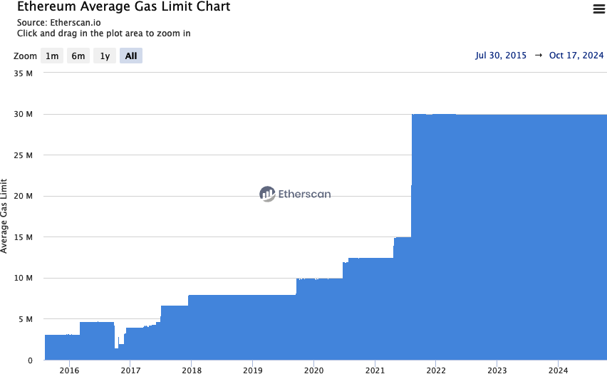

**Figure 6-1.** Block gas limit evolution

Base fees do not go to validators (or miners) who create blocks; instead, they are immediately burned, reducing the total supply of ETH. A new fee is introduced—the *priority fee*—which you can think of as the tip you pay to validators (or miners) to incentivize them to include your transactions in the next block.

> **Tip**  
>
> In theory, you could create transactions that only pay the base fee—which is mandatory—and zero priority fee. The protocol doesn't oblige you to pay a tip to validators. But in reality, you should always include it to see your transactions confirmed in a reasonable amount of time. Note that wallets normally handle base and priority fees automatically for you and set them to the correct values.

An EIP-1559 transaction is a serialized binary message that contains the following data:

**Chain ID**

Same as legacy transactions

**Nonce**

Same as legacy transactions

**Max priority fee per gas**

The price of gas (in wei) that the originator is willing to pay directly to validators as a tip for including the transaction in the block

**Max fee per gas**

The price of gas (in wei) that the originator is willing to pay in total, comprehensive of base fee and priority fee

**Gas limit**

Same as legacy transactions

**Recipient**

Same as legacy transactions

**Access list**

Same as EIP-2930 transactions

**Value**

Same as legacy transactions

**Data**

Same as legacy transactions

**v,r,s**

Same as legacy transactions

As with all transaction types, the message structure is serialized using the RLP encoding scheme.

### EIP-4844 Transactions

[EIP-4844](https://oreil.ly/JMJmB) transactions were introduced with the Cancun hard fork on March 13, 2024, using `0x03` as transaction type. We've already mentioned them in the section "KZG Commitment" in Chapter 4, and we'll discuss them further in Chapter 16. They are also called *blob-carrying transactions* because they come with a sidecar—a *blob*—which contains a large amount of data (about 131,000 bytes each) that is not accessible by the EVM but whose commitment can be accessed.

A new type of gas—the *blob gas*—is used for blobs. It's completely separated and independent from normal gas. It follows its own targeting rule even though it's still deeply inspired by EIP-1559. The idea is that if the blob gas used is greater than the target blob gas used, then the blob gas price increases; otherwise, it decreases.

The serialized binary message shares the same format as EIP-1559 with two new additions:

**Max fee per blob gas**

The price of blob gas (in wei) that the originator is willing to pay for blobs

**Blob versioned hashed**

A list of 32-byte values representing the versioned hash of every KZG commitment related to the blob

> **Note**  
>
> With the Cancun hard fork and the introduction of EIP-4844 transactions, the block header is expanded with two new elements:
>
> **Blob gas used**
>
> The total amount of blob gas used by all EIP-4844 transactions in the block
>
> **Excess blob gas**
>
> A running total of blob gas consumed in excess of the target, prior to the block

### EIP-7702 Transactions

[EIP-7702](https://oreil.ly/W_28X) transactions were included in the Pectra hard fork on May 7, 2025, using `0x04` as transaction type. They allow EOAs to set the code in their account. Traditionally, EOAs have an empty code; they can just start a transaction but cannot really perform complex operations, unless they are interacting with a smart contract. EIP-7702 changes this, making it possible for EOAs to do operations such as the following.

**Batching**

Allows multiple operations from the same user in one atomic transaction, such as an ERC-20 approval followed by spending that approval, which is a very common workflow in many decentralized exchanges.

**Sponsorship**

Account X pays for a transaction on behalf of account Y.

**Privilege deescalation**

Users can sign subkeys and give them specific permissions that are much weaker than global access to the account—for example, a permission to spend up to 1% of the total balance per day or to interact only with a specific application.

The low-level details are quite complicated, and we recommend reading the [EIP official website](https://oreil.ly/W_28X) if you're interested. The high-level overview, though, is simple yet really powerful. EIP-7702 allows EOAs to assign themselves a *delegation designator*. This delegation designator points to a smart contract (live on the Ethereum mainnet), and when a transaction is sent to the EOA, it executes the code at the designated address as if that were the EOA's actual code, as shown in Figure 6-2.

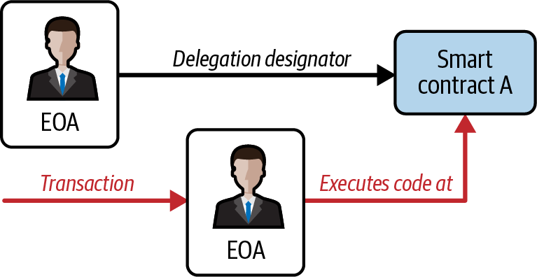

**Figure 6-2.** EIP-7702 delegation mechanism

## The Transaction Nonce

The *nonce* is one of the most important and least understood components of a transaction. Its definition in the "Yellow Paper" reads:

> Nonce: A scalar value equal to the number of transactions sent from this address or, in the case of accounts with associated code, the number of contract-creations made by this account.

Strictly speaking, the nonce is an attribute of the originating address—that is, it only has meaning in the context of the sending address. However, the nonce is not stored explicitly as part of an account's state on the blockchain. Instead, it is calculated dynamically by counting the number of confirmed transactions that have originated from an address.

There are two scenarios where the existence of a transaction-counting nonce is important: the usability feature of transactions being included in the order of creation and the vital feature of transaction-duplication protection. Let's look at an example scenario for each of these:

**Scenario 1**

Imagine you want to make two transactions. You have an important payment to make of 6 ether and another payment of 8 ether. You sign and broadcast the 6-ether transaction first because it is the more important one, and then you sign and broadcast the 8-ether transaction. Sadly, you have overlooked the fact that your account contains only 10 ether, so the network can't accept both transactions: one of them will fail. Because you sent the more important 6-ether one first, you understandably expect that one to go through and the 8-ether one to be rejected. However, in a decentralized system like Ethereum, nodes may receive the transactions in either order; there is no guarantee that a particular node will have one transaction propagated to it before the other. As such, it will almost certainly be the case that some nodes receive the 6-ether transaction first and others receive the 8-ether transaction first. Without the nonce, it would be random as to which one gets accepted and which rejected. However, with the nonce included, the first transaction you sent will have a nonce of, let's say, 3, while the 8-ether transaction has the next nonce value (i.e., 4). So that transaction will be ignored until the transactions with nonces from 0 to 3 have been processed, even if it is received first. Phew!

**Scenario 2**

Now imagine you have an account with 100 ether. Fantastic! You find someone online who will accept payment in ether for a mcguffin-widget that you really want to buy. You send them 2 ether, and they send you the mcguffin-widget. Lovely. To make that 2-ether payment, you signed a transaction sending 2 ether from your account to their account and then broadcast it to the Ethereum network to be verified and included on the blockchain. Now, without a nonce value in the transaction, a second transaction sending 2 ether to the same address a second time will look exactly the same as the first transaction. This means that anyone who sees your transaction on the Ethereum network (which means everyone, including the recipient or your enemies) can "replay" the transaction again and again and again until all your ether is gone, simply by copying and pasting your original transaction and resending it to the network. However, with the nonce value included in the transaction data, every single transaction is unique, even when sending the same amount of ether to the same recipient address multiple times. Thus, with the incrementing nonce as part of the transaction, it is simply not possible for anyone to "duplicate" a payment you have made.

In summary, it is important to note that use of the nonce is actually vital for an account-based protocol, in contrast to the *unspent transaction output (UTXO)* mechanism of the Bitcoin protocol.

### Keeping Track of Nonces

In this and future sections, we'll use the Foundry suite—in particular, the `cast` tool, which is really helpful for interacting with the blockchain in a very easy way. Make sure to install it if you want to replicate the following examples.

First, we need to set up our wallet that we're going to use throughout this chapter. Open a terminal window and type:

```bash
$ cast wallet new
Successfully created new keypair.
Address:     0x7e41354AfE84800680ceB104c5Fc99eCB98A25f0
Private key: 0xd6d2672c6b4489e6bcd4e93b9af620fa0204b639b7d7f93765479c0846be0b58
```

> **Warning**  
>
> If you send funds to the address mentioned here, you are wasting your money as the private key is known and anyone could use it to send all the funds to themselves.

Now, we need to import the private key into the computer keystore so that we can later leverage it easily:

```bash
$ cast wallet import example \
    --private-key 0xd6d2672c6b4489e6bcd4e93b9af620fa0204b639b7d7f93765479c0846be0b58
Enter password:
`example` keystore was saved successfully. Address: 0x7e41354afe84800680ceb104c5fc99ecb98a25f0
```

You can optionally (recommended) set a password that will be required when you create transactions with that account. Now we're correctly set up, but we still don't have any ETH.

You can always check your balance. First, you need to get the address associated with the account:

```bash
$ cast wallet address --account example
Enter keystore password:
0x7e41354AfE84800680ceB104c5Fc99eCB98A25f0
```

Then, you can query the blockchain for the balance. In all the examples in this chapter, we're going to use Ethereum Sepolia, a testnet blockchain:

```bash
$ cast balance 0x7e41354AfE84800680ceB104c5Fc99eCB98A25f0 --rpc-url https://ethereum-sepolia-rpc.publicnode.com
0
```

> **Note**  
>
> Note the `--rpc-url` flag in the last `cast` command. It should point to an RPC endpoint of the blockchain you're interested in. Reliable RPC endpoints often require a payment, but if you just want to experiment with it (as we'll do in this chapter), there are a lot of free options, such as:
>
> - [Public Node](https://www.publicnode.com)
> - [LlamaNodes](https://llamarpc.com/eth)
> - [ChainList](https://chainlist.org)


To get some free Sepolia ETH tokens, you can use one of the online faucets. We're going to use the Google Cloud Web3 faucet that gives 0.05 ETH, shown in Figure 6-3. Go to [Ethereum Sepolia Faucet](https://cloud.google.com/application/web3/faucet/ethereum/sepolia). Paste your address and click the "Receive 0.05 Sepolia ETH" button. You should receive 0.05 ETH really soon.

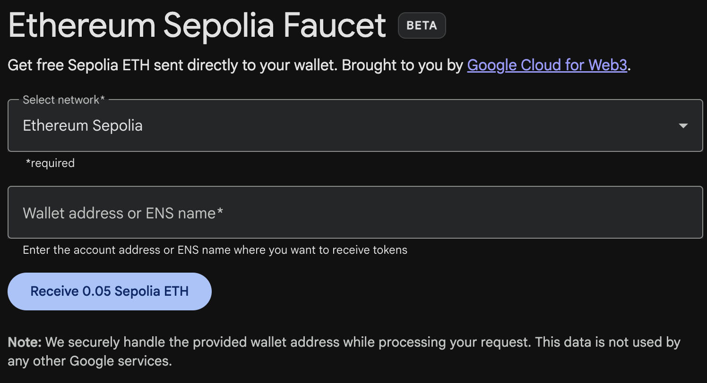

**Figure 6-3.** Google Cloud Web3 faucet

You can check that your balance is changed now and is different than 0:

```bash
$ cast balance 0x7e41354AfE84800680ceB104c5Fc99eCB98A25f0 --rpc-url https://ethereum-sepolia-rpc.publicnode.com
50000000000000000
```

Great! Now we're completely set up, and we can go back to our experiments with the transaction nonce.

In practical terms, the nonce is an up-to-date count of the number of confirmed (i.e., on-chain) transactions that have originated from an account. To find out what the nonce is, you can interrogate the blockchain using `cast`. Just open a new terminal window and type:

```bash
$ cast nonce 0x7e41354AfE84800680ceB104c5Fc99eCB98A25f0 --rpc-url https://ethereum-sepolia-rpc.publicnode.com
0
```

> **Tip**  
>
> The nonce is a zero-based counter, meaning the first transaction has nonce 0. In fact, in this example we haven't sent any transactions yet. Also note that the RPC response always points to the next available nonce—for example, if an address has already sent 10 transactions, meaning that it has used nonces from 0 to 9, the RPC response to a nonce query would be 10.


Let's try to send some ETH now. We'll send 0.001 ether to `vitalik.eth`, which is the ENS address of Vitalik Buterin, cofounder of Ethereum:

```bash
$ cast send --account example vitalik.eth --value 0.001ether --rpc-url https://ethereum-sepolia-rpc.publicnode.com
blockHash               0xa1171309fd406e44e86be9695a597d2bf5c728738d140b9958cfb50276c32b1b
blockNumber             6989355
contractAddress
cumulativeGasUsed       18009816
effectiveGasPrice       11163498011
from                    0x7e41354AfE84800680ceB104c5Fc99eCB98A25f0
gasUsed                 21000
logs                    []
logsBloom               0x00000000000000000000000000000000000000000000000000000000000000000000000000000000000000000000000000000000000000000000000000000000000000000000000000000000000000000000000000000000000000000000000000000000000000000000000000000000000000000000000000000000000000000000000000000000000000000000000000000000000000000000000000000000000000000000000000000000000000000000000000000000000000000000000000000000000000000000000000000000000000000000000000000000000000000000000000000000000000000000000000000000000000000000000000000000
root
status                  1 (success)
transactionHash         0xeb7bb0322858a4e1ed85271a60d2f8353075dc0bcd0c80448ee1d5ca0bb85def
transactionIndex        60
type                    2
blobGasPrice
blobGasUsed
authorizationList
to                      0xd8dA6BF26964aF9D7eEd9e03E53415D37aA96045
```

Your wallet will keep track of nonces for each address it manages. It's fairly simple to do that as long as you are only originating transactions from a single point. Let's say you are writing your own wallet software or some other application that originates transactions. How do you track nonces?

When you create a new transaction, you assign the next nonce in the sequence. But until it is confirmed, it will not count toward the nonce total. Let's look at this example by quickly sending the following commands one after the other:

```bash
$ cast nonce 0x7e41354AfE84800680ceB104c5Fc99eCB98A25f0 --rpc-url https://ethereum-sepolia-rpc.publicnode.com
10
$ cast send --account example vitalik.eth --value 0.001ether --async --rpc-url https://ethereum-sepolia-rpc.publicnode.com
0x85f5b0db44407a6e9252590dc809087a2e232e00a951c9cb8853a109da5ddad4
$ cast nonce 0x7e41354AfE84800680ceB104c5Fc99eCB98A25f0 --rpc-url https://ethereum-sepolia-rpc.publicnode.com
10
$ cast nonce 0x7e41354AfE84800680ceB104c5Fc99eCB98A25f0 --rpc-url https://ethereum-sepolia-rpc.publicnode.com
11
```

As you can see, the transaction we sent didn't immediately increase the nonce count; it stayed equal to 10 even after sending the transaction. If we wait a few seconds to allow for network communications to settle down and the transaction to be included in a block, the nonce call will return the expected number, 11.

> **Note**  
>
> Note the `--async` flag used in the `cast send` command: if you don't use it, `cast` will block the terminal until the transaction is confirmed inside a block. With that flag, it sends the transaction to the network and immediately returns the transaction hash, without waiting for it to be included in a block.


Now let's take a look at a different example:

```bash
$ cast nonce 0x7e41354AfE84800680ceB104c5Fc99eCB98A25f0 --rpc-url https://ethereum-sepolia-rpc.publicnode.com
11
$ cast send --account example vitalik.eth --value 0.001ether --async --rpc-url https://ethereum-sepolia-rpc.publicnode.com
0x63188aa73247ffe06388a9adf399fa715e42fbc37ca53f77642a7860c80feb9d
$ cast nonce 0x7e41354AfE84800680ceB104c5Fc99eCB98A25f0 --rpc-url https://ethereum-sepolia-rpc.publicnode.com
11
$ cast rpc eth_getTransactionCount 0x7e41354AfE84800680ceB104c5Fc99eCB98A25f0 pending --rpc-url https://ethereum-sepolia-rpc.publicnode.com
"0xc"
$ cast nonce 0x7e41354AfE84800680ceB104c5Fc99eCB98A25f0 --rpc-url https://ethereum-sepolia-rpc.publicnode.com
12
```

Before sending the transaction, our nonce count is 11; then we send the transaction and immediately ask for the new nonce. As we would expect from the previous example, the nonce is not updated yet since the transaction is still pending in the mempool and has not been included in a block. Nevertheless, we use a new query that is actually able to get the real nonce number even though the transaction is still not confirmed (`0xc` is 12 in hexadecimal format). After a few seconds, the transaction gets added to a block and the `cast nonce` call returns the new correct value.

The difference between `cast nonce` and `eth_getTransactionCount pending` is simply that the first considers only confirmed transactions—that is, included in a block—while the latter tries to also include transactions that are still pending in the mempool.

> **Warning**  
>
> Be careful when using `eth_getTransactionCount pending` for counting pending transactions. In fact, even though it tries to return the real nonce value for an address, there is no way to be completely sure that there are no other pending transactions waiting in the mempool to be confirmed.
>
> The public mempool is not a universal thing. Every node has its own mempool: a sort of dynamic repository for pending transactions, temporarily holding them until they are confirmed on the blockchain. It can be customized by setting different rules for accepting or rejecting new transactions. While it's true that RPC companies have a big network of nodes and should have a (almost) complete view of all pending transactions, you should still be wary of treating that value as 100% correct.

### Gaps in Nonces, Duplicate Nonces, and Confirmation

It is important to keep track of nonces if you are creating transactions programmatically, especially if you are doing so from multiple independent processes simultaneously.

The Ethereum network processes transactions sequentially based on the nonce. That means that if you transmit a transaction with nonce 0 and then transmit a transaction with nonce 2, the second transaction will not be included in any blocks. It will be stored in the mempool, while the Ethereum network waits for the missing nonce to appear. All nodes will assume that the missing nonce has simply been delayed and that the transaction with nonce 2 was received out of sequence.

If you then transmit a transaction with the missing nonce 1, both transactions (nonces 1 and 2) will be processed and included (if valid, of course). Once you fill the gap, the network can mine the out-of-sequence transaction that it held in the mempool.

What this means is that if you create several transactions in sequence and one of them does not get officially included in any blocks, all the subsequent transactions will be "stuck," waiting for the missing nonce. A transaction can create an inadvertent "gap" in the nonce sequence because it is invalid or has insufficient gas. To get things moving again, you have to transmit a valid transaction with the missing nonce. You should be equally mindful that once a transaction with the "missing" nonce is validated by the network, all the broadcast transactions with subsequent nonces will incrementally become valid; it is not possible to "recall" a transaction!

If, on the other hand, you accidentally duplicate a nonce—for example, by transmitting two transactions with the same nonce but different recipients or values—then one of them will be confirmed and one will be rejected. Which one is confirmed will be determined by the sequence in which they arrive at the first validating node that receives them—that is, it will be fairly random.

As you can see, keeping track of nonces is necessary, and if your application doesn't manage that process correctly, you will run into problems. Unfortunately, things get even more difficult if you are trying to do this concurrently, as we will see in the next section.

### Concurrency, Transaction Origination, and Nonces

*Concurrency* is a complex aspect of computer science, and it crops up unexpectedly sometimes, especially in decentralized and distributed real-time systems like Ethereum.

In simple terms, concurrency is when you have simultaneous computation by multiple independent systems. These can be in the same program (e.g., multithreading), on the same CPU (e.g., multiprocessing), or on different computers (e.g., distributed systems). Ethereum, by definition, is a system that allows concurrency of operations (nodes, clients, DApps) but enforces a singleton state through consensus.

Now, imagine that you have multiple independent wallet applications that are generating transactions from the same address or addresses. One example of such a situation would be an exchange processing withdrawals from the exchange's *hot wallet* (a wallet whose keys are stored online, in contrast to a *cold wallet* where the keys are never online). Ideally, you'd want to have more than one computer processing withdrawals, so it doesn't become a bottleneck or single point of failure. However, this quickly becomes problematic because having more than one computer producing withdrawals will result in some thorny concurrency problems, not least of which is the selection of nonces. How do multiple computers generating, signing, and broadcasting transactions from the same hot wallet account coordinate?

You could use a single computer to assign nonces, on a first-come, first-served basis, to computers signing transactions. However, this computer is now a single point of failure. Worse, if several nonces are assigned and one of them never gets used (because of a failure in the computer processing the transaction with that nonce), all subsequent transactions will get stuck.

Another approach would be to generate the transactions but not assign a nonce to them (and therefore leave them unsigned—remember that the nonce is an integral part of the transaction data and therefore needs to be included in the digital signature that authenticates the transaction). You could then queue them to a single node that signs them and keeps track of nonces. Again, though, this would be a choke point in the process: the signing and tracking of nonces is the part of your operation that is likely to become congested under load, whereas generating the unsigned transaction is the part you don't really need to parallelize. You would have some concurrency, but it would be lacking in a critical part of the process.

In the end, these concurrency problems, on top of the difficulty of tracking account balances and transaction confirmations in independent processes, force most implementations toward avoiding concurrency and creating bottlenecks, such as a single process handling all withdrawal transactions in an exchange or a setup of multiple hot wallets that can work completely independently for withdrawals and only need to be intermittently rebalanced.

## Transaction Gas

We talked about *gas* a little in earlier chapters, and we'll discuss it in more detail in Chapter 14. However, let's cover some basics about the role of the `gasPrice` and `gasLimit` components of a transaction.

Gas is the fuel of Ethereum. Gas is not ether: it's a separate virtual currency with its own exchange rate against ether. Ethereum uses gas to control the amount of resources that a transaction can use, since it will be processed on thousands of computers around the world. The open-ended (Turing-complete) computation model requires some form of metering to avoid DoS attacks or inadvertent resource-devouring transactions.

Gas is separate from ether to protect the system from the volatility that might arise along with rapid changes in the value of ether and as a way to manage the important and sensitive ratios between the costs of the various resources that gas pays for (computation, memory, and storage).

The `gasPrice` field in a transaction allows the transaction originator to set the price they are willing to pay in exchange for gas. The price is measured in wei per gas unit.

> **Tip**  
>
> The popular site [Etherscan](https://oreil.ly/ZIqcq) provides information on the current prices of gas and other relevant gas metrics for the Ethereum main network.


Wallets can adjust the `gasPrice` in transactions they originate to achieve faster confirmation of transactions. The higher the `gasPrice`, the faster the transaction is likely to be confirmed. Conversely, lower-priority transactions can carry a reduced price, resulting in slower confirmation. The minimum value that `gasPrice` can be set to is equal to the base fee (we've introduced it with EIP-1559 transactions) of the block in which they are included.

> **Note**  
>
> Before the London hard fork and EIP-1559, the minimum acceptable `gasPrice` was zero. That means that wallets could generate completely free transactions. Depending on capacity, these might never be confirmed, but there was nothing in the protocol that prohibited free transactions. You can find several examples of such transactions successfully included on the Ethereum blockchain during the first months of Ethereum.

### EIP-1559: Base Fee and Priority Fee

As we have already briefly explained, EIP-1559 completely changes the structure of the fee market on Ethereum by introducing a new protocol parameter: the base fee. It represents the minimum gas price that a transaction needs to pay to be considered valid and included in a block.

The difference between the base fee and the actual gas fee paid by a transaction is called the *priority fee*. It flows directly to the validator that creates the block in which that transaction lives.

### How to Know the "Correct" Gas Price

Cast offers a gas-price suggestion by calculating a median price across several blocks:

```bash
$ cast gas-price --rpc-url https://ethereum-sepolia-rpc.publicnode.com
4845187414
```

The second important field related to gas is `gasLimit`. In simple terms, `gasLimit` gives the maximum number of units of gas that the transaction originator is willing to buy in order to complete the transaction. For simple payments—meaning transactions that transfer ether from one EOA to another EOA—the gas amount needed is fixed at 21,000 gas units. To calculate how much ether that will cost, you multiply 21,000 by the `gasPrice` (or the `maxFeePerGas` for EIP-1559 transactions) you're willing to pay.

If your transaction's destination address is a contract, then the amount of gas needed can be estimated but cannot be determined with accuracy. That's because a contract can evaluate different conditions that lead to different execution paths, with different total gas costs. The contract may execute only a simple computation or a more complex one, depending on conditions that are outside of your control and cannot be predicted. To demonstrate this, let's look at an example: we can write a smart contract that increments a counter each time it is called and executes a particular loop a number of times equal to the call count. Maybe on the one-hundredth call, it gives out a special prize, like a lottery, but it needs to do additional computation to calculate the prize. If you call the contract 99 times, one thing happens, but on the one-hundredth call, something very different happens. The amount of gas you would pay for that depends on how many other transactions have called that function before your transaction is included in a block. Perhaps your estimate is based on being the 99th transaction, but just before your transaction is confirmed someone else calls the contract for the 99th time. Now you're the one-hundredth transaction to call, and the computation effort (and gas cost) is much higher.

To borrow a common analogy used in Ethereum, you can think of `gasLimit` as the capacity of the fuel tank in your car (your car is the transaction). You fill the tank with as much gas as you think it will need for the journey (the computation needed to validate your transaction). You can estimate the amount to some degree, but there might be unexpected changes to your journey, such as a diversion (a more complex execution path), that increase fuel consumption.

The analogy to a fuel tank is somewhat misleading, however. It's actually more like a credit account for a gas station company, where you pay after the trip is completed, based on how much gas you actually used. When you transmit your transaction, one of the first validation steps is to check that the account it originated from has enough ether to pay the `maxFeePerGas × gasLimit` (or the `gasPrice × gasLimit` for legacy transactions) fee. But the amount is not actually deducted from your account until the transaction finishes executing. You are billed only for gas actually consumed by your transaction, but you have to have enough balance for the maximum amount you are willing to pay before you send your transaction.

## Transaction Recipient

The recipient of a transaction is specified in the `to` field. This contains a 20-byte Ethereum address. The address can be an EOA or a contract address.

Ethereum does no further validation of this field. Any 20-byte value is considered valid. If the 20-byte value corresponds to an address without a corresponding private key or without a corresponding contract, the transaction is still valid. Ethereum has no way of knowing whether an address was correctly derived from a public key (and therefore from a private key) in existence.

> **Warning**  
>
> The Ethereum protocol does not validate recipient addresses in transactions. You can send to an address that has no corresponding private key or contract, thereby "burning" the ether, rendering it forever unspendable. Validation should be done at the user interface level.

Sending a transaction to the wrong address will probably burn the ether sent, rendering it forever inaccessible (unspendable), since most addresses do not have a known private key, and therefore no signature can be generated to spend it. It is assumed that validation of the address happens at the user interface level (see "Hex Encoding with Checksum in Capitalization (ERC-55)"). In fact, there are a number of valid reasons for burning ether—for example, as a disincentive to cheating in payment channels and other smart contracts—and since the amount of ether is finite, burning ether effectively distributes the value burned to all ether holders (in proportion to the amount of ether they hold).

## Transaction Value and Data

The main "payload" of a transaction is contained in two fields: `value` and `data`. Transactions can have both value and data, only value, only data, or neither value nor data. All four combinations are valid.

A transaction with only value is a payment. A transaction with only data is an invocation. A transaction with both value and data is both a payment and an invocation. A transaction with neither value nor data—well, that's probably just a waste of gas! But it is still possible.

Let's try all of these combinations. We'll use `cast` in the same way we did before to send transactions on Sepolia testnet.

Our first transaction contains only a value (payment) and no data payload:

```bash
$ cast send --account example vitalik.eth --value 0.001ether --rpc-url https://ethereum-sepolia-rpc.publicnode.com
```

In Figure 6-4, you can see that the value sent is 0.001 ether and the data payload (input data on etherscan) is empty (`0x00`).

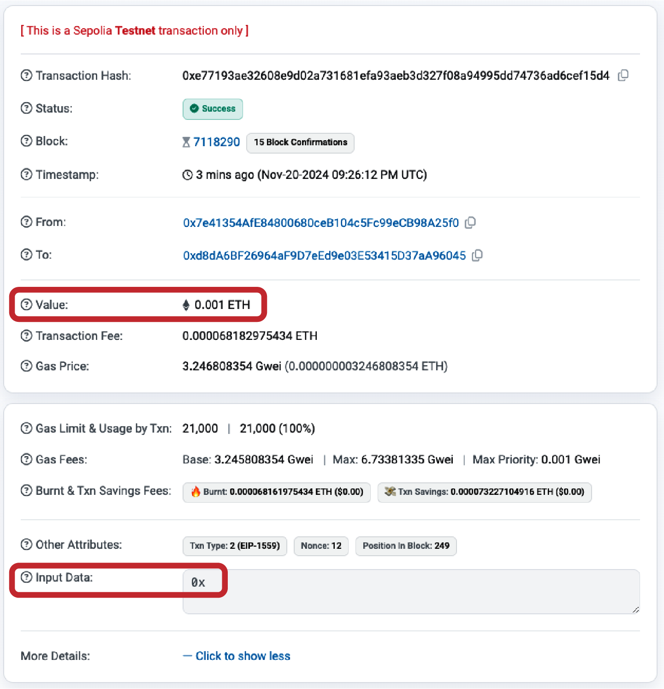

**Figure 6-4.** Transaction with only value (payment)

The next example specifies both a value and a data payload (even though this payload will be ignored as we'll send a transaction to an EOA):

```bash
$ cast send --account example vitalik.eth 0x0001 --value 0.001ether --rpc-url https://ethereum-sepolia-rpc.publicnode.com
```

In Figure 6-5, you can see that input data now contains some value, in particular `0x0001`.

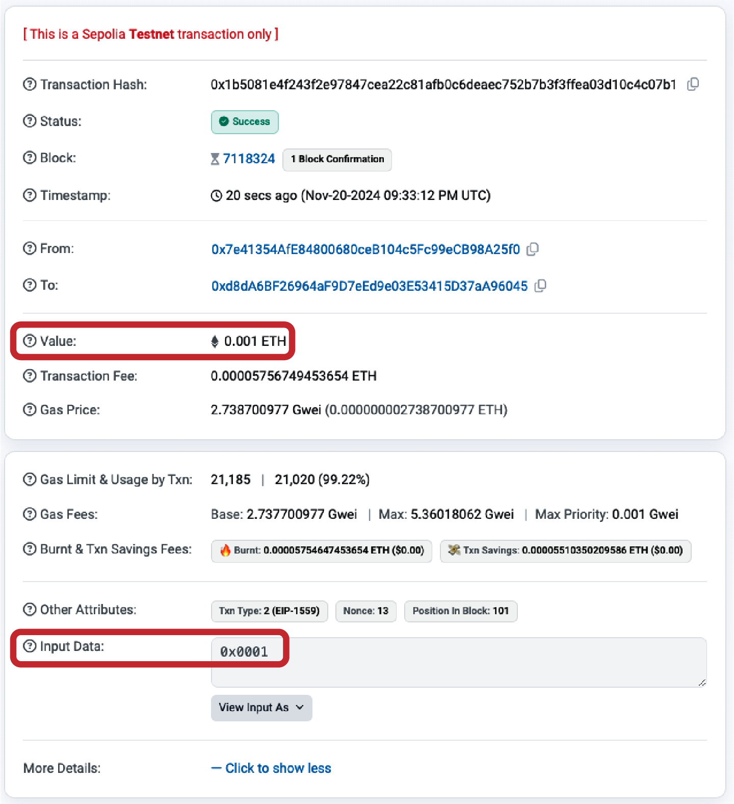

**Figure 6-5.** Transaction with both value and data

The next transaction includes a data payload but specifies a value of zero:

```bash
$ cast send --account example vitalik.eth 0x0001 --rpc-url https://ethereum-sepolia-rpc.publicnode.com
```

Figure 6-6 shows a confirmation screen indicating a value of zero ether sent in the transaction and the data payload equals to `0x0001`.

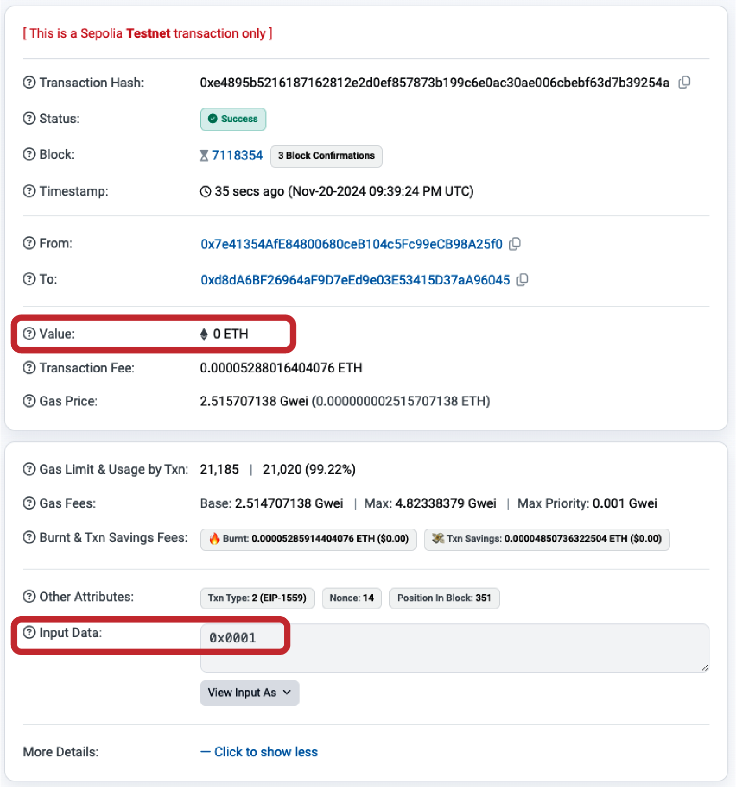

**Figure 6-6.** Transaction with only data (invocation)

Finally, the last transaction includes neither a value to send nor a data payload:

```bash
$ cast send --account example vitalik.eth --rpc-url https://ethereum-sepolia-rpc.publicnode.com
```

Figure 6-7 shows our transaction that sent zero ether and included an empty payload.

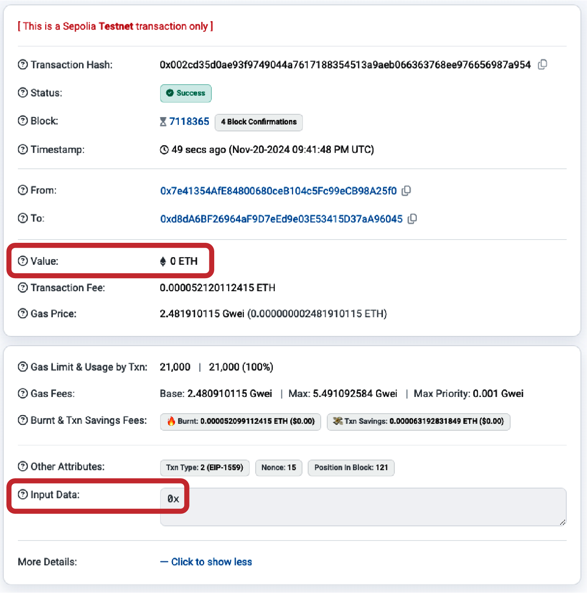

**Figure 6-7.** Transaction with neither value nor data

## Transmitting Value to EOAs and Contracts

When you construct an Ethereum transaction that contains a value, that is the equivalent of a payment. Such transactions behave differently depending on whether the destination address is a contract or not.

For EOA addresses—or rather, for any address that isn't flagged as a contract on the blockchain—Ethereum will record a state change, adding the value you sent to the balance of the address. If the address has not been seen before, it will be added to the client's internal representation of the state and its balance initialized to the value of your payment.

If the destination address (`to`) is a contract (or an EOA that has previously delegated a contract through an EIP-7702 transaction), then the EVM will execute the contract and will attempt to call the function named in the data payload of your transaction. If there is no data in your transaction, the EVM will call a *fallback function* and, if that function is payable, will execute it to determine what to do next. If there is no fallback function, then the effect of the transaction will be to increase the balance of the contract, exactly like a payment to a wallet.

A contract can reject incoming payments by throwing an exception immediately when a function is called or as determined by conditions coded in a function. If the function terminates successfully (without an exception), then the contract's state is updated to reflect an increase in the contract's ether balance.

## Transmitting a Data Payload to an EOA or Contract

When your transaction contains data, it is most likely addressed to a contract address. That doesn't mean you cannot send a data payload to an EOA—that is completely valid in the Ethereum protocol. However, in that case, the interpretation of the data is up to the wallet you use to access the EOA. It is ignored by the Ethereum protocol. Most wallets also ignore any data received in a transaction to an EOA they control. In the future, standards may emerge that allow wallets to interpret data the way contracts do, thereby allowing transactions to invoke functions running inside user wallets. The critical difference is that any interpretation of the data payload by an EOA is not subject to Ethereum's consensus rules, unlike a contract execution.

For now, let's assume your transaction is delivering data to a contract address. In that case, the data will be interpreted by the EVM as a contract invocation. Most contracts use this data more specifically as a function invocation, calling the named function and passing any encoded arguments to the function.

The data payload sent to a contract that is compatible with an *application binary interface (ABI)*, which you can assume all contracts are, is a hex-serialized encoding of the following:

**A function selector**

The first 4 bytes of the Keccak-256 hash of the function's prototype. This allows the contract to unambiguously identify which function you wish to invoke.

**The function arguments**

The function's arguments, encoded according to the rules for the various elementary types defined in the ABI specification.

In Example 2-1, we defined a function for withdrawals:

```solidity
function withdraw(uint256 _withdrawAmount, address payable _to) public {
```

The prototype of a function is defined as the string containing the name of the function, followed by the data types of each of its arguments, enclosed in parentheses and separated by commas. The function name here is `withdraw`, and it takes two arguments:

- `_withdrawAmount` that is a `uint256`
- `_to` that is an `address`

So the prototype of `withdraw` would be:

```
withdraw(uint256,address)
```

> **Note**  
>
> The `payable` keyword is used in Solidity to indicate that the address can receive ether, but it's not part of the function selector calculation. Only the base type `address` is included in the prototype.

Let's calculate the Keccak-256 hash of this string:

```bash
$ cast keccak256 "withdraw(uint256,address)"
0x00f714ce93c4a188ecc0c802ca78036f638c1c4b3ee9b98f3ed75364b45f50b1
```

The first 4 bytes of the hash are `0x00f714ce`. That's our function selector value, which will tell the contract which function we want to call.

Next, let's calculate two values to pass as the argument `withdraw_amount` and `_to`. We want to withdraw 0.000001 ether to the address `vitalik.eth`, which is `0xd8dA6BF26964aF9D7eEd9e03E53415D37aA96045`. Let's encode them together with the function selector calculated in the previous step in order to obtain the final data payload (it's also called *calldata*):

```bash
$ cast calldata "withdraw(uint256,address)" 0.000001ether 0xd8dA6BF26964aF9D7eEd9e03E53415D37aA96045
0x00f714ce000000000000000000000000000000000000000000000000000000e8d4a51000000000000000000000000000d8da6bf26964af9d7eed9e03e53415d37aa96045
```

That's the data payload for our transaction, invoking the `withdraw` function and requesting 0.000001 ether as the `withdraw_amount` and `vitalik.eth` as the `_to` address.

## Special Transaction: Contract Creation

One special case that we should mention is a transaction that creates a new contract on the blockchain, deploying it for future use. *Contract-creation transactions* are identified by an empty `to` field (null). When the `to` field is empty, the Ethereum protocol interprets this as a request to deploy a new contract, with the bytecode provided in the `data` field.

Note that the *zero address* (`0x0000000000000000000000000000000000000000`) is a distinct concept: it is a valid 20-byte address that can receive ether. Sending a transaction to the zero address does not create a contract, it simply transfers ether to that address like any other transaction. The zero address sometimes receives payments from various addresses. There are two explanations for this: either this is by accident, resulting in the loss of ether, or it is an intentional *ether burn* (deliberately destroying ether by sending it to an address from which it can never be spent). However, if you want to do an intentional ether burn, you should make your intention clear to the network and use the specially designated burn address instead:

```
0x000000000000000000000000000000000000dEaD
```

> **Warning**  
>
> Any ether sent to the designated burn address will become unspendable and will be lost forever.


A contract-creation transaction need only contain a data payload that contains the compiled bytecode that will create the contract. The only effect of this transaction is to create the contract. You can include an ether amount in the `value` field if you want to set the new contract up with a starting balance, but that is entirely optional. If you send a value (ether) to the contract-creation address without a data payload (no contract), then the effect is the same as sending to a burn address—there is no contract to credit, so the ether is lost.

As an example, we can create the `Faucet.sol` contract used in Chapter 2 by manually creating a transaction with an empty `to` field and the contract bytecode in the data payload. The contract needs to be compiled into a bytecode representation. This can be done with the Solidity compiler:

```bash
$ solc --bin Faucet.sol
Binary:
6080604052348015600e575f5ffd5…0033
```

The same information can be obtained from the Remix online compiler.

Now we can use the binary output to create the transaction:

```bash
$ cast send --account example --rpc-url https://ethereum-sepolia-rpc.publicnode.com --create 6080604052348015600e575f5ffd5…0033
```

Once the contract is published, we can see it on the Etherscan block explorer, as shown in Figure 6-8.

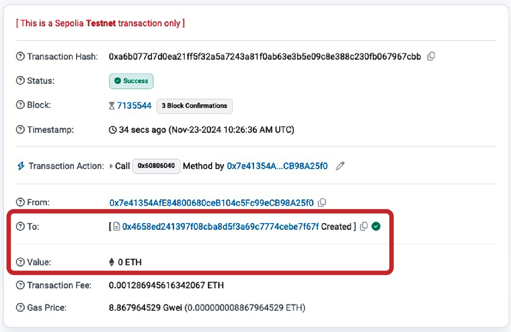

**Figure 6-8.** Contract creation transaction on Etherscan

We can look at the receipt of the transaction (using the transaction hash to reference it) to get information about the contract:

```bash
$ cast receipt 0xa6b077d7d0ea21ff5f32a5a7243a81f0ab63e3b5e09c8e388c230fb067967cbb \
    --rpc-url https://ethereum-sepolia-rpc.publicnode.com
blockHash               0x6eb071eac79a84793321b086af96b32c1d861f04b0efc7354d0f6b8d5a8fa36a
blockNumber             7135544
contractAddress         0x4658eD241397F08cba8d5F3a69c7774cebE7f67F
cumulativeGasUsed       28390874
effectiveGasPrice       8867964529
from                    0x7e41354AfE84800680ceB104c5Fc99eCB98A25f0
gasUsed                 145123
logs                    []
logsBloom               0x00000000000000000000000000000000000000000000000000000000000000000000000000000000000000000000000000000000000000000000000000000000000000000000000000000000000000000000000000000000000000000000000000000000000000000000000000000000000000000000000000000000000000000000000000000000000000000000000000000000000000000000000000000000000000000000000000000000000000000000000000000000000000000000000000000000000000000000000000000000000000000000000000000000000000000000000000000000000000000000000000000000000000000000000000000000
root
status                  1 (success)
transactionHash         0xa6b077d7d0ea21ff5f32a5a7243a81f0ab63e3b5e09c8e388c230fb067967cbb
transactionIndex        136
type                    2
blobGasPrice
blobGasUsed            
authorizationList
```

This includes the address of the contract (see `contractAddress`), which we can use to send funds to and receive funds from the contract as shown in the previous section.

Let's start by saving the newly created contract address in a variable:

```bash
$ CONTRACT_ADDRESS=0x4658eD241397F08cba8d5F3a69c7774cebE7f67F
```

Now we can fund it with some ether:

```bash
$ cast send --account example $CONTRACT_ADDRESS --value 0.02ether --rpc-url https://ethereum-sepolia-rpc.publicnode.com
```

And finally, let's call the `withdraw` function using the data payload we calculated previously, withdrawing 0.000001 ether to the `vitalik.eth` address:

```bash
$ cast send --account example $CONTRACT_ADDRESS \
0x00f714ce000000000000000000000000000000000000000000000000000000e8d4a51000000000000000000000000000d8da6bf26964af9d7eed9e03e53415d37aa96045 \
  --rpc-url https://ethereum-sepolia-rpc.publicnode.com
```

After a while, both transactions are visible on Etherscan, as shown in Figure 6-9.

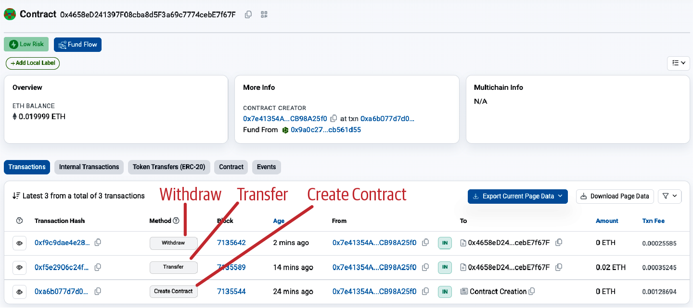

**Figure 6-9.** Contract funding and withdrawal transactions

## Digital Signatures

So far, we have not delved into any detail about digital signatures. In this section, we will look at how digital signatures work and how they can be used to present proof of ownership of a private key without revealing that private key.

### The ECDSA

The digital signature algorithm used in Ethereum is the *Elliptic Curve Digital Signature Algorithm (ECDSA)*. It's based on elliptic curve private–public key pairs, as described in "Elliptic Curve Cryptography Explained".

A digital signature serves three purposes in Ethereum (see the following sidebar). First, the signature proves that the owner of the private key, who is by implication the owner of an Ethereum account, has authorized the spending of ether or the execution of a contract. Second, it guarantees *nonrepudiation*: the proof of authorization is undeniable. Third, the signature proves that the transaction data has not been and cannot be modified by anyone after the transaction has been signed.

#### Definition of a Digital Signature

According to [Wikipedia](https://oreil.ly/kRnY2), a digital signature is a mathematical scheme for presenting the authenticity of digital messages or documents. A valid digital signature gives a recipient reason to believe that the message was created by a known sender (authentication), that the sender cannot deny having sent the message (nonrepudiation), and that the message was not altered in transit (integrity).

### How Digital Signatures Work

A digital signature is a mathematical scheme that consists of two parts. The first part is an algorithm for creating a signature, using a private key (the signing key), from a message (which in our case is the transaction). The second part is an algorithm that allows anyone to verify the signature by using only the message and a public key.

#### Creating a digital signature

In Ethereum's implementation of ECDSA, the "message" being signed is the transaction, or more accurately, the Keccak-256 hash of the RLP-encoded data from the transaction. The signing key is the EOA's private key. The result is the signature:

```
Sig = Fsig (Fkeccak256 (m), k)
```

where:

- `k` is the signing private key
- `m` is the RLP-encoded transaction
- `Fkeccak256` is the Keccak-256 hash function
- `Fsig` is the signing algorithm
- `Sig` is the resulting signature

The function `Fsig` produces a signature `Sig` that is composed of two values, commonly referred to as `r` and `s`:

```
Sig = (r, s)
```

#### Verifying the signature

To verify the signature, you must have the signature (`r` and `s`), the serialized transaction, and the public key that corresponds to the private key used to create the signature. Essentially, verification of a signature means only the owner of the private key that generated this public key could have produced this signature on this transaction.

The signature-verification algorithm takes the message (i.e., a hash of the transaction for our usage), the signer's public key, and the signature (`r` and `s` values) and returns true if the signature is valid for this message and public key.

### ECDSA Math

As mentioned previously, signatures are created by a mathematical function `Fsig` that produces a signature composed of two values, `r` and `s`. In this section, we'll look at the function `Fsig` in more detail.

The signature algorithm first generates an *ephemeral* (temporary) private key in a cryptographically secure way. This temporary key is used in the calculation of the `r` and `s` values to ensure that the sender's actual private key can't be calculated by attackers watching signed transactions on the Ethereum network.

As we know from Chapter 4, the ephemeral private key is used to derive the corresponding (ephemeral) public key, so we have:

- A cryptographically secure random number `q`, which is used as the ephemeral private key
- The corresponding ephemeral public key `Q`, generated from `q` and the elliptic curve generator point `G`

The `r` value of the digital signature is then the x coordinate of the ephemeral public key `Q`.

From there, the algorithm calculates the `s` value of the signature, such that:

```
s ≡ q-1 (Keccak256(m) + r * k) (mod p)
```

where:

- `q` is the ephemeral private key
- `r` is the x coordinate of the ephemeral public key
- `k` is the signing (EOA owner's) private key
- `m` is the transaction data
- `p` is the prime order of the elliptic curve

Verification is the inverse of the signature-generation function, using the `r` and `s` values and the sender's public key to calculate a value `Q`, which is a point on the elliptic curve (the ephemeral public key used in signature creation). The steps are as follows:

1. Check all inputs are correctly formed.
2. Calculate `w = s-1 mod p`.
3. Calculate `u1 = Keccak256(m) * w mod p`.
4. Calculate `u2 = r * w mod p`.
5. Finally, calculate the point on the elliptic curve `Q ≡ u1 * G + u2 * K (mod p)`

where:

- `r` and `s` are the signature values
- `K` is the signer's (EOA owner's) public key
- `m` is the transaction data that was signed
- `G` is the elliptic curve generator point
- `p` is the prime order of the elliptic curve

If the x coordinate of the calculated point `Q` is equal to `r`, then the verifier can conclude that the signature is valid. Note that in verifying the signature, the private key is neither known nor revealed.

> **Tip**  
>
> ECDSA is necessarily a fairly complicated piece of math; a full explanation is beyond the scope of this book. A number of guides online take you through it step-by-step: search for "ECDSA explained" or try [this one](https://oreil.ly/KUv9P).

## Transaction Signing in Practice

To produce a valid transaction, the originator must digitally sign the message using the ECDSA. When we say "sign the transaction," we actually mean "sign the Keccak-256 hash of the RLP-serialized transaction data." The signature is applied to the hash of the transaction data, not the transaction itself.

To sign a transaction in Ethereum, the originator must:

1. Create a transaction data structure, containing all the fields required for that particular transaction type.
2. Produce an RLP-encoded serialized message of the transaction data structure.
3. Compute the Keccak-256 hash of this serialized message.
4. Compute the ECDSA signature, signing the hash with the originating EOA's private key.
5. Append the ECDSA signature's computed `v`, `r`, and `s` values to the transaction.

The special signature variable `v` indicates two things: the chain ID and the recovery identifier to help the ECDSArecover function check the signature. In nonlegacy transactions, the `v` variable no longer encodes the chain ID because that is directly included as one of the items that forms the transaction itself. For more information on the chain ID, see "Raw Transaction Creation with EIP-155". The recovery identifier is used to indicate the parity of the y component of the public key (see "The Signature Prefix Value (v) and Public Key Recovery" for more details).

> **Note**  
>
> At block 2,675,000, Ethereum implemented the Spurious Dragon hard fork, which, among other changes, introduced a new signing scheme that includes transaction replay protection (preventing transactions meant for one network from being replayed on others). This new signing scheme is specified in EIP-155. This change affects the form of the transaction and its signature, so attention must be paid to the first of the three signature variables (i.e., `v`), which takes one of two forms and indicates the data fields included in the transaction message being hashed.

### Raw Transaction Creation and Signing

In this section, we'll create a raw transaction and sign it, using the `ethers.js` library. Example 6-1 demonstrates the functions that would normally be used inside a wallet or an application that signs transactions on behalf of a user.

**Example 6-1. Creating and signing a raw Ethereum transaction**

```javascript
// Load requirements first:
//
// npm install ethers
//
// Run with: node eip1559_tx.js
import { ethers } from "ethers";

// Create provider with your RPC endpoint
const provider = new ethers.JsonRpcProvider("https://ethereum-sepolia-rpc.publicnode.com");

// Private key
const privKey = "0xd6d2672c6b4489e6bcd4e93b9af620fa0204b639b7d7f93765479c0846be0b58";

// Create a wallet instance
const wallet = new ethers.Wallet(privKey);

// Get nonce and create transaction data
const txData = {
  nonce: await provider.getTransactionCount(wallet.address), // Get nonce from provider
  to: "0xb0920c523d582040f2bcb1bd7fb1c7c1ecebdb34", // Receiver address
  value: ethers.parseEther("0.0001"), // Amount to send (0.0001 ETH here)
  gasLimit: ethers.toBeHex(0x30000), // Gas limit
  maxFeePerGas: ethers.parseUnits("100", "gwei"), // Max fee per gas
  maxPriorityFeePerGas: ethers.parseUnits("2", "gwei"), // Max priority fee
  data: "0x", // Optional data
  chainId: 11155111, // Sepolia chain ID
};

// Calculate RLP-encoded transaction hash (pre-signed)
const unsignedTx = ethers.Transaction.from(txData).unsignedSerialized;
console.log("RLP-Encoded Tx (Unsigned): " + unsignedTx);
const txHash = ethers.keccak256(unsignedTx);
console.log("Tx Hash (Unsigned): " + txHash);

// Sign the transaction
async function signAndSend() {
  // Sign the transaction with the wallet
  const signedTx = await wallet.signTransaction(txData);
  console.log("Signed Raw Transaction: " + signedTx);

  // Send the signed transaction to the Ethereum network
  const txResponse = await provider.broadcastTransaction(signedTx);
  console.log("Transaction Hash: " + txResponse.hash);

  // Wait for the transaction to be mined
  const receipt = await txResponse.wait();
  console.log("Transaction Receipt: ", receipt);
}

signAndSend().catch(console.error);
```

Running the example code produces the following results:

```bash
$ node eip1559_tx.js 
RLP-Encoded Tx (Unsigned): 0x02f283aa36a714847735940085174876e8008303000094b0920c523d582040f2bcb1bd7fb1c7c1ecebdb34865af3107a400080c0
Tx Hash (Unsigned): 0x31d43a580534a77c71324a8434df6f2df993b3d551b29d4b70d8a889768a53f7
Signed Raw Transaction: 0x02f87583aa36a714847735940085174876e8008303000094b0920c523d582040f2bcb1bd7fb1c7c1ecebdb34865af3107a400080c001a03f8ed18cb03ee0fe3fbc3f0a7477a2f68db6ec84450e77e702b82a3f2c873aa4a0205c4f6a16ea8ad13a148cc3105814cd4a6860cd26a771651199c85ccb7c7f0f
Transaction Hash: 0x07bfbeb337e19763a1f74d989dae2953807dcb06822354cfefb16405a11beb93
Transaction Receipt:  TransactionReceipt {
  provider: JsonRpcProvider {},
  to: '0xB0920c523d582040f2BCB1bD7FB1c7C1ECEbdB34',
  from: '0x7e41354AfE84800680ceB104c5Fc99eCB98A25f0',
  contractAddress: null,
  hash: '0x07bfbeb337e19763a1f74d989dae2953807dcb06822354cfefb16405a11beb93',
  index: 1,
  blockHash: '0x0ac051e8f615805c69eec6e193e39637adeb7cf314a0098d455e7d9ac395a7ee',
  blockNumber: 7135937,
  logsBloom: '0x00000000000000000000000000000000000000000000000000000000000000000000000000000000000000000000000000000000000000000000000000000000000000000000000000000000000000000000000000000000000000000000000000000000000000000000000000000000000000000000000000000000000000000000000000000000000000000000000000000000000000000000000000000000000000000000000000000000000000000000000000000000000000000000000000000000000000000000000000000000000000000000000000000000000000000000000000000000000000000000000000000000000000000000000000000000',
  gasUsed: 21000n,
  blobGasUsed: null,
  cumulativeGasUsed: 42000n,
  gasPrice: 3096751769n,
  blobGasPrice: null,
  type: 2,
  status: 1,
  root: undefined
}
```

### Low-Level Manual Construction of an EIP-1559 Raw Transaction

The following example demonstrates the complete low-level process for creating and signing an EIP-1559 (type 0x02) transaction by manually building the field list, RLP-encoding it, and signing the typed payload. This approach reveals exactly what happens inside `wallet.signTransaction`.

```javascript
// npm install ethers@6
import { ethers } from "ethers";
const RLP = require('@ethereumjs/rlp');

// Replace with your own RPC and private key
const rpcUrl = "https://ethereum-sepolia-rpc.publicnode.com"; // or mainnet, etc.
const provider = new ethers.JsonRpcProvider(rpcUrl);
const privateKey = "0xYOUR_PRIVATE_KEY_HERE";
const wallet = new ethers.Wallet(privateKey, provider);

const recipient = "0xRECIPENT_ADDRESS"; // example address

async function createAndSendRawEip1559Tx() {
  const network = await provider.getNetwork(); // This is a RPC call
  const chainId = network.chainId;
  const nonce = await provider.getTransactionCount(wallet.address); // This is a RPC call

  // Example parameters — adjust as needed (or use provider.estimateGas + getFeeData)
  const maxPriorityFeePerGas = ethers.parseUnits("2", "gwei");   // tip
  const maxFeePerGas = ethers.parseUnits("30", "gwei");         // fee cap (base fee + tip)
  const gasLimit = 21000n;
  const value = ethers.parseEther("0.01"); // 0.01 ETH
  const data = "0x"; // or contract calldata
  const accessList = []; // [] or proper access list for EIP-2930 style savings

  // Unsigned fields in strict order for Transaction Type 2
  const unsignedFields = [
    chainId,                              // chainId
    nonce,                                // nonce
    maxPriorityFeePerGas,                 // maxPriorityFeePerGas
    maxFeePerGas,                         // maxFeePerGas
    gasLimit,                             // gasLimit
    recipient,                            // to
    value,                                // value
    data,                                 // data
    accessList                            // accessList
  ];

  // RLP-encode the unsigned fields
  const encodedUnsigned = RLP.encode(unsignedFields);

  // Prepend the transaction type byte (0x02)
  const txType = Buffer.from('02', 'hex');
  const fullTx = Buffer.concat([txType, encodedUnsigned]);

  // This is the signing hash
  const signingHash = ethers.keccak256(fullTx);

  // Sign the hash
  const signingKey = new ethers.SigningKey(wallet.privateKey);
  const signature = signingKey.sign(ethers.getBytes(signingHash));

  // For typed transactions we use yParity (0 or 1) instead of legacy v
  const signedFields = [
    ...unsignedFields,
    signature.v - 27, // yParity (0 or 1)
    signature.r,
    signature.s
  ];

  const encodedSigned = RLP.encode(signedFields);

  const rawTransaction = '0x02' + Buffer.from(encodedSigned).toString('hex');

  console.log("Raw transaction hex:\n", rawTransaction);

  // Send the raw transaction
  const txHash = await provider.send("eth_sendRawTransaction", [rawTransaction]);
  console.log("Transaction sent! Hash:", txHash);

  const receipt = await provider.waitForTransaction(txHash);
  console.log("Mined in block", receipt.blockNumber);
}

createAndSendRawEip1559Tx().catch(console.error);
```

## Deserializing the Transaction

Now that we have created and sent a transaction to the Ethereum network from scratch, we can follow the inverse process and try to rebuild each field of the transaction, starting with the signed raw transaction we get from the previous example. This will help you understand how each field of the transaction is actually included in the transaction itself—you just need to extract it in the correct way.

Let's start with the entire signed raw transaction:

```
0x02f87583aa36a714847735940085174876e8008303000094b0920c523d582040f2bcb1bd7fb1c7c1ecebdb34865af3107a400080c001a03f8ed18cb03ee0fe3fbc3f0a7477a2f68db6ec84450e77e702b82a3f2c873aa4a0205c4f6a16ea8ad13a148cc3105814cd4a6860cd26a771651199c85ccb7c7f0f
```

Recalling EIP-2718, all Ethereum transactions are made by:

- The first byte that specifies the transaction type
- The transaction type payload

This almost always translates in the RLP encoding of all the fields of that specific transaction type.

Our transaction starts with a `0x02`. This represents the transaction type, and `0x02` means it's an EIP-1559 transaction. The next part is the RLP encoding of all the transaction fields that make up the EIP-1559 transaction.

To quickly decode them, we can use `cast` and the `from-rlp` command, providing the rest of the transaction as input:

```bash
$ cast from-rlp f87583aa36a714847735940085174876e8008303000094b0920c523d582040f2bcb1bd7fb1c7c1ecebdb34865af3107a400080c001a03f8ed18cb03ee0fe3fbc3f0a7477a2f68db6ec84450e77e702b82a3f2c873aa4a0205c4f6a16ea8ad13a148cc3105814cd4a6860cd26a771651199c85ccb7c7f0f
["0xaa36a7","0x14","0x77359400","0x174876e800","0x030000","0xb0920c523d582040f2bcb1bd7fb1c7c1ecebdb34","0x5af3107a4000","0x",[],"0x01","0x3f8ed18cb03ee0fe3fbc3f0a7477a2f68db6ec84450e77e702b82a3f2c873aa4","0x205c4f6a16ea8ad13a148cc3105814cd4a6860cd26a771651199c85ccb7c7f0f"]
```

You can see that the output of the last `cast` command contains a list of hexadecimal items: they are the fields of the EIP-1559 transaction. Let's analyze them one by one and reconstruct the transaction:

**`0xaa36a7`**

The Sepolia chain ID: 11155111 in decimal.

**`0x14`**

The nonce used in the transaction: 20. You can go to the block explorer and see that it's actually correct.

**`0x77359400`**

The max priority fee per gas: 2000000000 in decimal. It translates to 2 gwei per gas.

**`0x174876e800`**

The max fee per gas: 100000000000 in decimal. It translates to 100 gwei per gas.

**`0x030000`**

The gas limit: 196608 in decimal.

**`0xb0920c523d582040f2bcb1bd7fb1c7c1ecebdb34`**

The recipient address.

**`0x5af3107a4000`**

The value in wei sent from the sender to the recipient: 1014 in decimal. It translates to 0.0001 ether.

**`0x`**

The empty data payload.

**`[]`**

The empty access list.

**`0x01`**

The `v` value of the signature; `0x01` means an odd y coordinate of the elliptic curve (`0x00` means an even y coordinate).

**`0x3f8ed18cb03ee0fe3fbc3f0a7477a2f68db6ec84450e77e702b82a3f2c873aa4`**

The `r` value of the signature.

**`0x205c4f6a16ea8ad13a148cc3105814cd4a6860cd26a771651199c85ccb7c7f0f`**

The `s` value of the signature.

## Raw Transaction Creation with EIP-155

The EIP-155 "Simple Replay Attack Protection" standard specifies a replay-attack-protected transaction encoding, which includes a chain ID inside the transaction data prior to signing. This ensures that transactions created for one blockchain (e.g., the Ethereum main network) are invalid on another blockchain (e.g., Ethereum Classic or the Sepolia test network). Therefore, transactions broadcast on one network cannot be replayed on another, hence the name of the standard.

By including the chain ID in the data being signed, the transaction signature prevents any changes since the signature is invalidated if the chain ID is modified. Therefore, EIP-155 makes it impossible for a transaction to be replayed on another chain because the signature's validity depends on the chain ID.

The chain ID field takes a value according to the network the transaction is meant for, as outlined in Table 6-2.

**Table 6-2. Chain identifiers**

| Chain | Chain ID |
|-------|----------|
| Ethereum mainnet | 1 |
| Ethereum Sepolia | 11155111 |
| Ethereum Holesky | 17000 |

For an exhaustive list of chain identifiers, see [ChainList](https://chainlist.org).

The resulting transaction structure is RLP encoded, hashed, and signed. For more details, see the EIP-155 specification.

## The Signature Prefix Value (v) and Public Key Recovery

As mentioned in "The Structure of a Transaction", the transaction message doesn't include a "from" field. That's because the originator's public key can be computed directly from the ECDSA signature. Once you have the public key, you can compute the address easily. The process of recovering the signer's public key is called *public key recovery*.

Given the values `r` and `s` that were computed in "ECDSA Math", we can compute two possible public keys.

First, we compute two elliptic curve points, `R` and `R′`, from the x coordinate `r` value that is in the signature. There are two points because the elliptic curve is symmetric across the x-axis, so for any value x, there are two possible values that fit the curve, one on each side of the x-axis.

From `r` we also calculate `r–1`, which is the multiplicative inverse of `r`.

Finally, we calculate `z`, which is the n lowest bits of the message hash, where n is the order of the elliptic curve.

The two possible public keys are then:

```
K1 = r–1 (sR – zG)
```

and:

```
K2 = r–1 (sR′ – zG)
```

where:

- `K1` and `K2` are the two possibilities for the signer's public key
- `r-1` is the multiplicative inverse of the signature's `r` value
- `s` is the signature's `s` value
- `R` and `R′` are the two possibilities for the ephemeral public key `Q`
- `z` is the n-lowest bits of the message hash
- `G` is the elliptic curve generator point

To make things more efficient, the transaction signature includes a prefix value `v`, which tells us which of the two possible R values is the ephemeral public key. If `v` is even, then `R` is the correct value. If `v` is odd, then it is `R′`. That way, we need to calculate only one value for R and only one value for K.

## Separating Signing and Transmission (Offline Signing)

Once a transaction is signed, it is ready to transmit to the Ethereum network. The three steps of creating, signing, and broadcasting a transaction normally happen as a single operation—for example, using the `cast send` command. However, as you saw in "Raw Transaction Creation and Signing", you can create and sign the transaction in two separate steps. Once you have a signed transaction, you can then transmit it using `ethers.JsonRpcProvider("..."").broadcastTransaction`, which takes a hex-encoded and signed transaction and transmits it on the Ethereum network.

Why would you want to separate the signing and transmission of transactions? The most common reason is security. The computer that signs a transaction must have unlocked private keys loaded in memory. The computer that does the transmitting must be connected to the internet (and be running an Ethereum client). If these two functions are on one computer, then you have private keys on an online system, which is quite dangerous.

> **Warning**  
>
> If you keep your private keys online, you're exposed to several forms of attacks, such as malware and remote hacking, and you're much more susceptible to phishing attacks, too.

Separating the functions of signing and transmitting and performing them on different machines (on an offline and an online device, respectively) is called *offline signing* and is a common security practice.

Figure 6-10 shows the process, which follows these steps:

1. Create an unsigned transaction on the online computer where the current state of the account—notably, the current nonce and funds available—can be retrieved.
2. Transfer the unsigned transaction to an "air-gapped" offline device for transaction signing (e.g., via a QR code or USB flash drive).
3. Transmit the signed transaction (back) to an online device for broadcast on the Ethereum blockchain (e.g., via a QR code or USB flash drive).

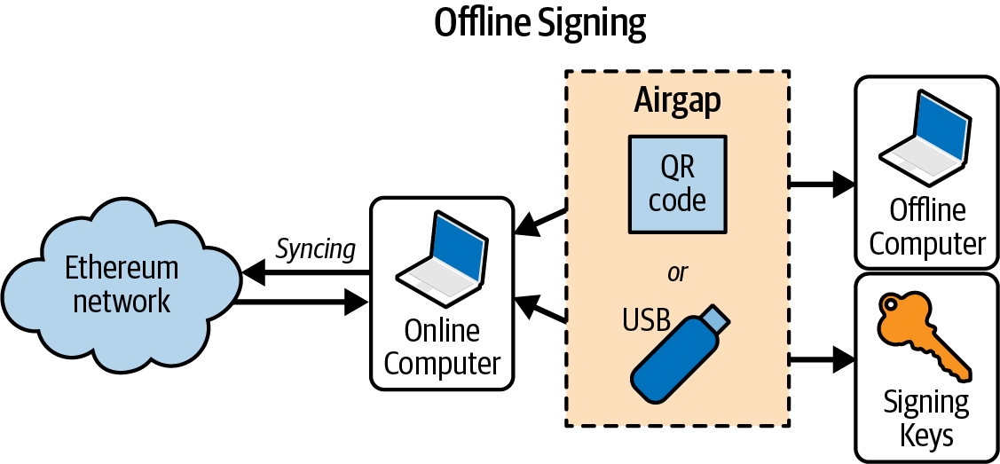

**Figure 6-10.** Offline signing process

Depending on the level of security you need, your "offline signing" computer can have varying degrees of separation from the online computer, ranging from an isolated and firewalled subnet (online but segregated) to a completely offline system known as an *air-gapped system*. In an air-gapped system, there is no network connectivity at all—the computer is separated from the online environment by a gap of "air." To sign transactions, you transfer them to and from the air-gapped computer using data storage media or (better) a webcam and QR code. Of course, this means you must manually transfer every transaction you want signed, and this doesn't scale.

While not many environments can utilize a fully air-gapped system, even a small degree of isolation has significant security benefits. For example, an isolated subnet with a firewall that allows through only a message-queue protocol can offer a much reduced attack surface and much higher security than signing on the online system. Many companies use a protocol such as ZeroMQ (0MQ) for this purpose. With a setup like that, transactions are serialized and queued for signing. The queuing protocol transmits the serialized message, in a way similar to a TCP socket, to the signing computer. The signing computer reads the serialized transactions from the queue (carefully), applies a signature with the appropriate key, and places them on an outgoing queue. The outgoing queue transmits the signed transactions to a computer with an Ethereum client that dequeues them and transmits them.

## Transaction Life Cycle

In this section, we'll explore the full life cycle of a transaction, starting from the moment it's signed to when it's included in a block and the block gets finalized.

### Creating and Signing the Transaction

The first step is to create the transaction, choosing the transaction type and filling all the fields required for it. For example, in the section "Raw Transaction Creation and Signing", we created an EIP-1559 transaction.

Once we have the transaction, we need to sign it with the correct private key (or the transaction will be invalid due to the invalid signature) in order to obtain the final and definitive signed transaction. This is the actual piece of data that we need to send to the network and wait for it to be included in a block.

### Sending the Transaction to the Network

The transaction needs to be included in a block to be considered confirmed by the Ethereum protocol; otherwise, it's just a signed transaction that only we know about.

> **Tip**  
>
> It's very important to understand that the Ethereum protocol considers valid only transactions that are included into blocks that are part of the valid chain. To update its state, you need to send your signed transaction to the network and wait for it to include your transaction into a block. Your signed transaction alone doesn't do anything if it's not included into a block.

So we need to send our signed transaction to the network. To do that, we just need to send our transaction to an Ethereum node: this can be our own node or a third-party one, such as Alchemy, Infura, or Public Node (which is the one we used in our previous example).

> **Note**  
>
> By default, all wallets use a third-party node so that a user doesn't need to install anything to start using the Ethereum network. Nevertheless, if you want to maximize your privacy and really don't want to depend on anyone, you should use your own client. You can refer to Chapter 3 for a detailed guide on how to install your first Ethereum node.


When our signed transaction reaches the first node, the node performs some validation in order to immediately remove spam invalid transactions. If the validation succeeds, then the node adds the transaction to its *mempool* and propagates it to a subsection of all its peers. Each of them validates it, adds it to its own mempool, and propagates it further.

This process is part of the Ethereum P2P gossip protocol, and the result is that within just a few seconds, an Ethereum transaction propagates to all the Ethereum nodes around the globe. From the perspective of each node, it is not possible to discern the origin of the transaction. The neighbor that sent it to the node may be the originator of the transaction or may have received it from one of its neighbors. To be able to track the origins of transactions or interfere with propagation, an attacker would have to control a significant percentage of all nodes. This is part of the security and privacy design of P2P networks, especially as applied to blockchain networks.

> **Note**  
>
> You may wonder why nodes don't flood transactions to all their neighbors and instead send them to just a subsection of neighbors. The answer is efficiency and bandwidth preservation. In fact, it would be highly inefficient to send all transactions to all nodes: there would be lots of duplicate messages, network traffic would be huge, and scalability would be poor as network traffic would grow exponentially with the number of transactions.

### Building the Block

Right now, our transaction has reached almost all the Ethereum nodes, but it's still not confirmed because it's not included into a block—until a validator that is selected to propose the next block finally takes all the transactions from its own mempool, adds them to the block, and publishes the block to the network.

Once transactions are included into a block, they modify the Ethereum state, either by modifying the balance of an account (in the case of a simple payment) or by invoking contracts that change their internal state. These changes are recorded alongside the transaction, in the form of a *transaction receipt*, which may also include events. In the example in "Raw Transaction Creation and Signing", you can find the final receipt of our transaction.

### Finalizing the Transaction

Our transaction is now included into a block and has already modified the Ethereum state. Nevertheless, the block that contains it could still be reverted and substituted with another one that doesn't include our transaction, even though that's highly unlikely to happen. This is called *block reorganization*, or *block reorgs* for short.

To be completely sure that our transaction cannot be reverted, we need to wait for the block that includes it to be finalized by the Ethereum consensus protocol (we'll explore that in much more detail in Chapter 15). This usually takes around 12 minutes.

> **Note**  
>
> Even though it's true that you should wait for the finalization to be completely sure that your transaction is confirmed on the blockchain, you can usually wait for only a couple of blocks. Wallets usually show your transaction as confirmed immediately after it has been included into a block.

## An Alternative Life Cycle

The life cycle we explored in the previous section is the old standard flow that a transaction follows, from its start to its end inside a finalized block. Over the past three to four years, and even more nowadays, a new life cycle has been established for transactions. To explain it, we need to introduce a concept called *proposer and builder separation*.

### MEV and Proposer and Builder Separation

As we'll explore further in Chapter 15, every 12 seconds a validator is required to propose a new block to advance the Ethereum chain. The validator collects transactions from its mempool, organizes them to fill the block, and publishes the block to the network so that all other nodes can validate and propagate the block.

Traditionally, Ethereum nodes have prioritized transactions based on the transaction fees paid to the validator (specifically, the priority fee for EIP-1559 transactions) in order to maximize profit. This approach was the standard method for optimizing miner and validator earnings for many years.

However, with the rising popularity of Ethereum during the 2020 "DeFi Summer," and even more so during the 2021 bull run, a new phenomenon emerged: *maximal extractable value* (*MEV*, previously called miner extractable value). This concept has significantly altered how Ethereum miners and validators create blocks.

MEV refers to the maximum value that block producers can extract from a block by making strategic decisions about:

- Which transactions to include in the block
- The order of transactions within the block
- Which transactions to exclude from the block

While this may sound innocuous, it had and still has a huge impact on block-production dynamics. For example, think about a transaction that is going to buy a big quantity of a certain token X on a decentralized exchange such as Uniswap. The validator can see this transaction and know in advance that it'll make the price go up by a lot. That means the validator could add two transactions to profit from this situation:

1. The first is a transaction that buys some tokens X, and it's ordered to happen before the big buy transaction.
2. The second sells the tokens X bought in the previous transaction, and it's ordered to happen after the big buy transaction.

This is called a *sandwich attack*: the validator profits from the slippage created by the big buy transaction. Let's demonstrate this concept with a toy (and simplified) example.

A user submits a transaction (tx1) buying one thousand tokens xyz, as shown in Figure 6-11. Suppose the price of the token xyz is $1,000, so this user is going to buy $1 million worth of tokens. This buy pressure will raise the price of the token to $1,010.

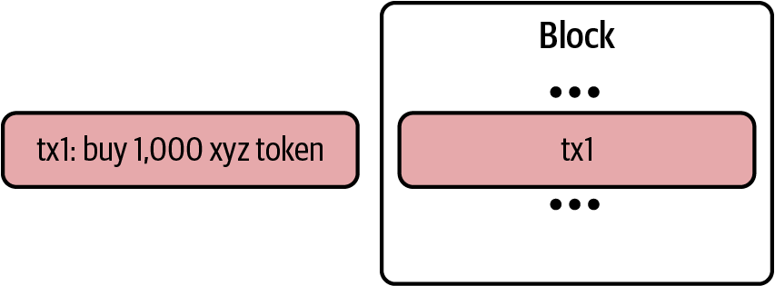

**Figure 6-11.** User transaction before MEV intervention

But the validator sees an opportunity to make money by front-running tx1. They create two transactions: tx0 and tx2, where tx0 contains a buy order of 10 xyz tokens and tx2 a sell order of the same amount. The validator places these transactions exactly before and after the user's tx1, as you can see in Figure 6-12. Remember that the validator can do this because they are the actor who is actually creating the block, so they can freely choose the ordering of transactions in it.

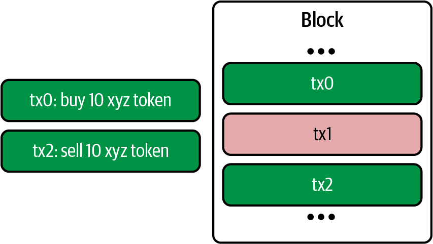

**Figure 6-12.** Sandwich attack by validator

The outcome is that the validator is able to buy 10 tokens xyz at $1,000 and sell them at $1,010, making a profit of $10 × 10 = $100.

This is a very simple strategy used by validators to maximize their profits. There are lots of other, more complex strategies. Competition is so high that a new actor has emerged: *builders*.

In fact, running all these strategies requires a lot of processing power, much more than the average validator has (remember, you can run a validator node with just 16 GB of ram). That means MEV was also threatening the decentralization of the validators, favoring big entities that could afford to spend millions of dollars on infrastructure and on people working hard on discovering new profitable strategies to build "better" blocks.

The solution to this problem came in January 2021 with the release of Flashbots v0.1. It enables block proposers (miners first, validators now) to trustlessly outsource the task of finding the optimal block construction to these new entities called builders. Thanks to this separation of duties—builders filling the block with transactions and creating the block with the highest amount of fee paid to validators (builders take a portion of this fee, too) and validators proposing the block to the network—validators can still run on average vendor machines.

### Private Mempools

The MEV ecosystem has grown so much that right now, builders compete not only to find the best strategy to maximize profits but also on the transactions they can use to fill the block. The more transactions they have, the better they can apply their strategies.

That has led to the creation of *private mempools*. These mempools allow users or entities to submit transactions directly to block producers without exposing them to the general network. They play a significant role in mitigating risks like front-running and enabling privacy-focused workflows.

Flashbots developed its own solution called [Flashbots Protect](https://oreil.ly/Jq4rT). MetaMask, the most popular wallet, has started to use private mempools by default for its users (called [smart transactions](https://oreil.ly/nnZVR)).

### New Transaction Life Cycle

MEV, proposer and builder separation, and private mempools have drastically changed the environment of block production. Nowadays, lots of transactions don't follow the usual life cycle we explained in the previous section; after they are created and signed, they are sent directly to a builder through a private mempool. The builder will take care of them, trying to include them in an optimal block and finally sending the whole block to the validator who is going to propose the next block. The transactions skip the public mempool propagation and directly appear in a built block.

## Multiple-Signature Transactions

If you are familiar with Bitcoin's scripting capabilities, you know it is possible to create a Bitcoin *multisig* account that can only spend funds when multiple parties sign the transaction (e.g., two of two or three of four signatures). Ethereum's basic EOA value transactions have no provisions for multiple signatures; however, arbitrary signing restrictions can be enforced by smart contracts with any conditions you can think of to handle the transfer of ether and tokens alike.

To take advantage of this capability, ether has to be transferred to a wallet contract that is programmed with the desired spending rules, such as multisignature requirements or spending limits (or combinations of the two). The wallet contract then sends the funds when prompted by an authorized EOA once the spending conditions have been satisfied. For example, to protect your ether under a multisig condition, transfer the ether to a multisig contract. Whenever you want to send funds to another account, all the required users will need to send transactions to the contract using a regular wallet app, effectively authorizing the contract to perform the final transaction.

These contracts can also be designed to require multiple signatures before executing local code or to trigger other contracts. The security of the scheme is ultimately determined by the multisig contract code.

The ability to implement multisignature transactions as a smart contract demonstrates the flexibility of Ethereum. Currently, Gnosis Safe has become the de facto standard for creating multisignature accounts. This suite of battle-tested smart contracts is widely used by major protocols and DAOs, securing more than $6 billion in ETH and more than $74 billion worth of ERC-20 tokens as of November 2024, as illustrated in Figure 6-13.

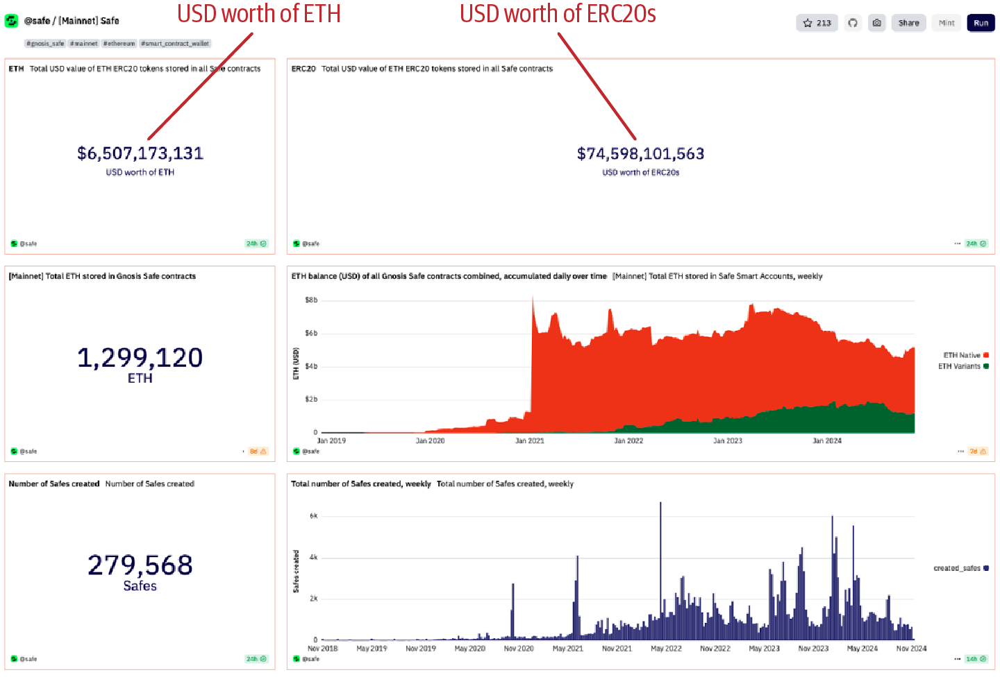

**Figure 6-13.** Gnosis Safe securing billions in value

> **Note**  
>
> With Gnosis Safe, the usual workflow to execute a transaction is as follows:
>
> 1. One of the signers of the Safe proposes a transaction that they want to sign and send to the Ethereum network.
> 2. Other signers see the transaction and sign it if they agree with its purpose.
> 3. When a quorum is reached, the transaction is finally sent to the network, where it gets processed and executed.

## Conclusion

Transactions are the starting point of every activity in the Ethereum system. Transactions are the "inputs" that cause the EVM to evaluate contracts, update balances, and more generally modify the state of the Ethereum blockchain. Next, we will work with smart contracts in a lot more detail and learn how to program in the Solidity contract-oriented language.
