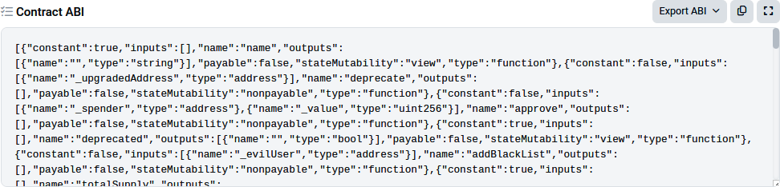

# Chapter 7. Smart Contracts and Solidity

As we discussed in Chapter 2, there are two different types of accounts in Ethereum: EOAs and contract accounts. EOAs are controlled by users, often via software such as a wallet application that is external to the Ethereum platform. In contrast, contract accounts are controlled by program code (also commonly referred to as *smart contracts*) that is executed by the EVM.

In short, EOAs are simple accounts without any associated code or data storage, while contract accounts have both associated code and data storage. EOAs are controlled by transactions created and cryptographically signed with a private key in the “real world” external to and independent of the protocol, while contract accounts don’t have private keys and so “control themselves” in the predetermined way prescribed by their smart contract code. Both types of accounts are identified by an Ethereum address. In this chapter, we’ll discuss contract accounts and the program code that controls them.

## What Is a Smart Contract?

The term *smart contract* has been used over the years to describe a wide variety of things. In the 1990s, cryptographer Nick Szabo coined the term and defined it as “a set of promises, specified in digital form, including protocols within which the parties perform on the other promises.” Since then, the concept of smart contracts has evolved, especially after the introduction of decentralized blockchain platforms with the launch of Bitcoin in 2009.

In the context of Ethereum, the term is actually a bit of a misnomer, given that Ethereum smart contracts are neither smart nor legal contracts, but the term has stuck. In this book, we use the term *smart contracts* to refer to immutable computer programs that run deterministically in the context of the EVM as part of the Ethereum network protocol—that is, on the decentralized Ethereum world computer.

Let’s unpack that definition:

**Computer programs**

Smart contracts are simply computer programs. The word *contract* has no legal meaning in this context.

**Immutable**

Once deployed, the code of a smart contract cannot change. Unlike with traditional software, the only way to modify a smart contract is to deploy a new instance.

**Deterministic**

The outcome of the execution of a smart contract is the same for everyone who runs it, given the context of the transaction that initiated its execution and the state of the Ethereum blockchain at the moment of execution.

**EVM context**

Smart contracts operate with a very limited execution context. They can access their own state, the context of the transaction that called them, and some information about the most recent blocks.

**Decentralized world computer**

The EVM runs as a local instance on every Ethereum node, but because all instances of the EVM operate on the same initial state and produce the same final state, the system as a whole operates as a single “world computer.”

## Life Cycle of a Smart Contract

Smart contracts are typically written in a high-level language such as Solidity. But in order to run, they must be compiled to the low-level bytecode that runs in the EVM. Once compiled, they are deployed on the Ethereum platform using a special contract-creation transaction, which is identified by having an empty `to` field (see "Special Transaction: Contract Creation" in Chapter 6). Each contract is identified by an Ethereum address, which is derived from the contract-creation transaction as a function of the originating account and nonce. The Ethereum address of a contract can be used in a transaction as the recipient, sending funds to the contract or calling one of the contract’s functions. Note that, unlike with EOAs, there are no keys associated with an account created for a new smart contract. As the contract creator, you don’t get any special privileges at the protocol level (although you can explicitly code them into the smart contract). You certainly don’t receive the private key for the contract account, which in fact does not exist—we can say that smart contract accounts own themselves.

Importantly, contracts *only run if they are called by a transaction*. All smart contracts in Ethereum are executed, ultimately, because of a transaction initiated from an EOA. A contract can call another contract that can call another contract, and so on, but the first contract in such a chain of execution will always have been called by a transaction from an EOA. Contracts never run “on their own” or “in the background.” Contracts effectively lie dormant until a transaction triggers execution, either directly or indirectly as part of a chain of contract calls. It is also worth noting that smart contracts are not executed “in parallel” in any sense—the Ethereum world computer can be considered to be a single-threaded machine.

Transactions are *atomic*, regardless of how many contracts they call or what those contracts do when called. Transactions execute in their entirety, with any changes in the global state (contracts, accounts, etc.) recorded only if all execution terminates successfully. *Successful termination* means that the program executed without an error and reached the end of execution. If execution fails due to an error, all of its effects (changes in state) are “rolled back” as if the transaction never ran. A failed transaction is still recorded as having been attempted, and the ether spent on gas for the execution is deducted from the originating account, but it otherwise has no effects on contract or account state.

As previously mentioned, a contract’s code cannot be changed once it is deployed. Historically, a contract could be deleted, removing its code and internal state (storage) from its address and leaving a blank account. After such a deletion, any transactions sent to that address would not result in code execution because no code would remain. This deletion was accomplished using an EVM opcode called `SELFDESTRUCT`, which provided a gas refund, incentivizing the release of network resources by deleting stored state. However, the `SELFDESTRUCT` operation was deprecated by [EIP-6780](https://oreil.ly/5LcZo) in 2023 due to the significant changes it requires to an account’s state, particularly the removal of all code and storage. With the upcoming upgrades in the Ethereum roadmap, this operation will no longer be feasible.

## Introduction to Ethereum High-Level Languages

The EVM is a virtual machine that runs a special form of code called *EVM bytecode*, analogous to your computer’s CPU, which runs machine code such as x86_64. We will examine the operation and language of the EVM in much more detail in Chapter 14. In this section, we will look at how smart contracts are written to run on the EVM.

While it is possible to program smart contracts directly in bytecode, EVM bytecode is rather unwieldy and very difficult for programmers to read and understand. Instead, most Ethereum developers use a high-level language to write programs and a compiler to convert them into bytecode.

Although any high-level language could be adapted to write smart contracts, adapting an arbitrary language to be compilable to EVM bytecode is quite a cumbersome exercise and would in general lead to some amount of confusion. Smart contracts operate in a highly constrained and minimalistic execution environment (the EVM). In addition, a special set of EVM-specific system variables and functions needs to be available. As such, it is easier to build a smart contract language from scratch than it is to make a general-purpose language suitable for writing smart contracts. As a result, a number of special-purpose languages have emerged for programming smart contracts. Ethereum has several such languages, together with the compilers needed to produce EVM-executable bytecode.

In general, programming languages can be classified into two broad programming paradigms: *declarative* and *imperative*, also known as *functional* and *procedural*, respectively. In declarative programming, we write functions that express the *logic* of a program but not its *flow*. Declarative programming is used to create programs where there are no *side effects*, meaning that there are no changes to state outside of a function. Declarative programming languages include Haskell and SQL. Imperative programming, by contrast, is where a programmer writes a set of procedures that combine the logic and flow of a program. Imperative programming languages include C++ and Java. Some languages are “hybrid,” meaning that they encourage declarative programming but can also be used to express an imperative programming paradigm. Such hybrids include Lisp, JavaScript, and Python. In general, any imperative language can be used to write in a declarative paradigm, but it often results in inelegant code. By comparison, pure declarative languages cannot be used to write in an imperative paradigm. In purely declarative languages, there are no “variables.”

While imperative programming is more commonly used by programmers, it can be very difficult to write programs that execute exactly as expected. The ability of any part of the program to change the state of any other makes it difficult to reason about a program’s execution and introduces many opportunities for bugs. Declarative programming, by comparison, makes it easier to understand how a program will behave: since it has no side effects, any part of a program can be understood in isolation.

In smart contracts, bugs literally cost money. As a result, it is critically important to write smart contracts without unintended effects. To do that, you must be able to clearly reason about the expected behavior of the program. So declarative languages play a much bigger role in smart contracts than they do in general-purpose software. Nevertheless, as you will see, the most widely used language for smart contracts (Solidity) is imperative. Programmers, like most humans, resist change!

Currently supported high-level programming languages for smart contracts include the following (ordered by popularity):

**Solidity**

A procedural (imperative) programming language with a syntax similar to JavaScript, C++, or Java. The most popular and frequently used language for Ethereum smart contracts.

**Yul**

An intermediate language used in standalone mode or inline within Solidity, which is ideal for high-level optimizations across platforms. Beginners should start with Solidity or Vyper before exploring Yul, as it requires advanced knowledge of smart contract security and the EVM.

**Vyper**

A contract-oriented programming language with Python-like syntax that prioritizes user safety and encourages clear coding practices via language design and efficient execution.

**Huff**

A low-level programming language primarily used by developers who require highly efficient and minimalistic contract code, allowing for advanced optimizations beyond what higher-level languages like Solidity offer. Like Yul, it’s not suggested for beginners.

**Fe**

A statically typed smart contract language for the EVM, inspired by Python and Rust. It aims to be easy to learn, even for developers who are new to Ethereum, with its development still in the early stages since its alpha release in January 2021.

Other languages were developed in the past but are not maintained anymore, such as LLL, Serpent, and Bamboo.

As you can see, there are many languages to choose from. However, of all of these, Solidity is by far the most popular, to the point of being the de facto high-level language of Ethereum and even other EVM-like blockchains.

## Building a Smart Contract with Solidity

Solidity was created by Gavin Wood (coauthor of the first edition of this book) as a language explicitly for writing smart contracts with features to directly support execution in the decentralized environment of the Ethereum world computer. The resulting attributes are quite general, and so it has ended up being used for coding smart contracts on several other blockchain platforms. It was developed by Christian Reitwiessner and then by Alex Beregszaszi, Liana Husikyan, Yoichi Hirai, and several former Ethereum core contributors. Solidity is now developed and maintained as an independent project on [GitHub](https://oreil.ly/ik9kH).

The main “product” of the Solidity project is the Solidity compiler, solc, which converts programs written in the Solidity language to EVM bytecode. The project also manages the important ABI standard for Ethereum smart contracts, which we will explore in detail in this chapter. Each version of the Solidity compiler corresponds to and compiles a specific version of the Solidity language.

To get started, we will download a binary executable of the Solidity compiler. Then, we will develop and compile a simple contract, following on from the example we started with in Chapter 2.

### Selecting a Version of Solidity

Solidity follows a versioning model called [*semantic versioning*](https://semver.org), which specifies version numbers structured as three numbers separated by dots: MAJOR.MINOR.PATCH. The “major” number is incremented for major and backward-incompatible changes, the “minor” number is incremented when backward-compatible features are added in between major releases, and the “patch” number is incremented for backward-compatible bug fixes.

At the time of writing, Solidity is at version 0.8.26. The rules for major version 0, which is for initial development of a project, are different: anything may change at any time. In practice, Solidity treats the “minor” number as if it were the major version and the “patch” number as if it were the minor version. Therefore, in 0.8.26, 8 is considered to be the major version and 26 the minor version. As you saw in Chapter 2, your Solidity programs can contain a pragma directive that specifies the minimum and maximum versions of Solidity that it is compatible with and can be used to compile your contract. Since Solidity is rapidly evolving, it is often better to install the latest release.

> **Note**
>
> Another consequence of the rapid evolution of Solidity is the pace at which documentation gets outdated. Right now, we’re working with Solidity version 0.8.26, and everything in this book is based on that version. While this book will always give you a solid foundation for learning Solidity, future versions might change some syntax and functionality. So, whenever you have questions or run into something new, it’s a good idea to check the [official Solidity documentation](https://oreil.ly/LzV7L) to stay current.

### Downloading and Installing Solidity

There are a number of methods you can use to download and install Solidity, depending on your operating system and requirements: either as a binary release or by compiling from source code. You can find detailed and updated instructions in the [Solidity documentation](https://oreil.ly/JW--z).

Here’s how to install the latest binary release of Solidity on an Ubuntu/Debian operating system, using the apt package manager:

```bash
$ sudo add-apt-repository ppa:ethereum/ethereum
$ sudo apt update
$ sudo apt install solc
```

Once you have solc installed, check the version by running:

```bash
$ solc --version
solc, the solidity compiler commandline interface
Version: 0.8.26+commit.8a97fa7a.Linux.g++
```

### Development Environment

While it’s entirely possible to develop Solidity smart contracts using a simple text editor, leveraging a development framework like [Hardhat](https://hardhat.org) or [Foundry](https://oreil.ly/-7Qvy) can significantly enhance your efficiency and effectiveness as a developer. These frameworks offer a comprehensive suite of tools that simplify and improve the development process. For example, they provide robust testing environments, allowing you to write and run unit tests to validate your contracts’ behavior, and they offer forking capabilities to create local instances of the mainnet for realistic testing scenarios. With advanced debugging and tracing capabilities, you can easily step through your code execution and quickly identify and resolve issues, saving time and reducing errors. Additionally, these frameworks support scripting and deployment automation, plug-in ecosystems that extend functionality, and seamless network management across different environments. Integrating these capabilities into your workflow ensures a higher level of code quality and security, which is difficult to achieve with a simple text editor.

Beyond frameworks, adopting a modern IDE like VS Code further enhances productivity. VS Code offers a wide array of extensions for Solidity, including syntax highlighting, which makes your code easier to read; advanced commenting and bookmarking tools to help organize and navigate complex projects; and visual analysis tools that provide insights into your code’s structure and potential issues. There are also web-based development environments, such as [Remix IDE](https://oreil.ly/Fz0jJ).

Together, these tools not only improve code quality but also accelerate the development process, allowing us to build and deploy smart contracts more quickly and securely.

### Writing a Simple Solidity Program

In Chapter 2, we wrote our first Solidity program. When we first built the `Faucet` contract, we used the Remix IDE to compile and deploy the contract. In this section, we will revisit, improve, and embellish `Faucet`.

Our first attempt looked like Example 7-1.

**Example 7-1. Faucet.sol: a Solidity contract implementing a faucet**

```solidity
// SPDX-License-Identifier: GPL-3.0
// Our first contract is a faucet!
contract Faucet {
    // Give out ether to anyone who asks
    function withdraw(uint _withdrawAmount, address payable _to) public {
        // Limit withdrawal amount
        require(_withdrawAmount <= 100000000000000000);
        // Send the amount to the address that requested it
        _to.transfer(_withdrawAmount);
    }
    // Accept any incoming amount
    receive() external payable {}
}
```

As we saw in Chapter 2, the SPDX license identifier in the comment indicates that the smart contract is licensed under GPL-3.0, informing users and developers of their legal rights and obligations for using and distributing the code.

### Compiling with the Solidity Compiler (solc)

Now, we will use the Solidity compiler on the command line to compile our contract directly. The Solidity compiler solc offers a variety of options, which you can see by passing the `--help` argument.

We use the `--bin` and `--optimize` arguments of solc to produce an optimized binary of our example contract:

```bash
$ solc --optimize --bin Faucet.sol
======= Faucet.sol:Faucet =======
Binary:
6080604052348015600e575f5ffd5b5060fa8061001b5f395ff3fe608060405260043610601d575f3560e01c806
2f714ce146027575f5ffd5b36602357005b5f5ffd5b3480156031575f5ffd5b506041603d366004608d565b6043
565b005b67016345785d8a00008211156056575f5ffd5b6040516001600160a01b0382169083156108fc0290849
05f818181858888f193505050501580156088573d5f5f3e3d5ffd5b505050565b5f5f60408385031215609d575f
5ffd5b8235915060208301356001600160a01b038116811460b9575f5ffd5b80915050925092905056fea264697
06673582212208935b6cf5d9070b7609ad59ac4b727e512522c674cacf09a2eff88dafa3242ee64736f6c634300
081b0033
```

The result that solc produces is a hex-serialized binary that can be submitted to the Ethereum blockchain.

## The Ethereum Contract ABI

In computer software, an *application binary interface* is an interface between two program modules—often between the operating system and user programs. An ABI defines how data structures and functions are accessed in *machine code*; this is not to be confused with an API, which defines this access in high-level, often human-readable formats as *source code*. The ABI is thus the primary way of encoding and decoding data into and out of machine code.

In Ethereum, the ABI is used to encode contract calls for the EVM and to read data out of transactions. The purpose of an ABI is to define the functions in the contract that can be invoked and describe how each function will accept arguments and return its result.

A contract’s ABI is specified as a JSON array of function descriptions (see “Functions”) and events (see “Events”). A function description is a JSON object with fields `type`, `name`, `inputs`, `outputs`, `constant`, and `payable`. An event description object has fields `type`, `name`, `inputs`, and `anonymous`.

We use the solc command-line Solidity compiler to produce the ABI for our *Faucet.sol* example contract:

```bash
$ solc --abi Faucet.sol
======= Faucet.sol:Faucet =======
Contract JSON ABI
[{"inputs":[{"internalType":"uint256","name":"withdrawAmount","type":"uint256"}],
"name":"withdraw","outputs":[],"stateMutability":"nonpayable","type":"function"},
{"stateMutability":"payable","type":"receive"}]
```

As you can see, the compiler produces a JSON array describing the two functions that are defined by *Faucet.sol*. This JSON can be used by any application that wants to access the `Faucet` contract once it is deployed. Using the ABI, an application such as a wallet or DApp browser can construct transactions that call the functions in `Faucet` with the correct arguments and argument types. For example, a wallet would know that to call the function `withdraw`, it would have to provide a `uint256` argument named `withdrawAmount`. The wallet could prompt the user to provide that value, then create a transaction that encodes it and executes the `withdraw` function.

All that is needed for an application to interact with a contract is an ABI and the address where the contract has been deployed.

## Selecting a Solidity Compiler and Language Version

As we saw in the previous code, our `Faucet` contract compiles successfully with Solidity version 0.8.26. But what if we had used a different version of the Solidity compiler? The language is still in constant flux, and things may change in unexpected ways. Our contract is fairly simple, but what if our program used a feature that was added only in Solidity version 0.8.26 and we tried to compile it with 0.8.25?

To resolve such issues, Solidity offers a compiler directive known as a *version pragma* that instructs the compiler that the program expects a specific compiler (and language) version. Let’s look at an example:

```solidity
pragma solidity 0.8.26;
```

The Solidity compiler reads the version pragma and will produce an error if the compiler version is incompatible with the version pragma. In this case, our version pragma says that this program can be compiled by a Solidity compiler with version 0.8.26. Pragma directives are not compiled into EVM bytecode; they are compile-time directives used by the compiler only to check compatibility.

> **Note**
>
> In the pragma directive, the symbol ^ states that we allow compilation with any *minor revision* equal to or above the specified one. For example, a pragma directive `pragma solidity ^0.7.1;` means that the contract can be compiled with a solc version of 0.7.1, 0.7.2, and 0.7.3 but not 0.8.0 (which is a major revision, not a minor revision).

Let’s add a pragma directive to our `Faucet` contract. We will name the new file *Faucet2.sol*, to keep track of our changes as we proceed through these examples, starting in Example 7-2.

**Example 7-2. Faucet2.sol: Adding the version pragma to Faucet**

```solidity
pragma solidity 0.8.26;
// SPDX-License-Identifier: GPL-3.0
// Our first contract is a faucet!
contract Faucet {
    // Give out ether to anyone who asks
    function withdraw(uint _withdrawAmount, address payable _to) public {
        // Limit withdrawal amount
        require(_withdrawAmount <= 100000000000000000);
        // Send the amount to the address that requested it
        _to.transfer(_withdrawAmount);
    }
    // Accept any incoming amount
    receive() external payable {}
}
```

Adding a version pragma is a best practice because it avoids problems with mismatched compiler and language versions. We will explore other best practices and continue to improve the `Faucet` contract throughout this chapter.

## Programming with Solidity

In this section, we will look at some of the capabilities of the Solidity language. As we mentioned in Chapter 2, our first contract example was very simple and also flawed in various ways. We’ll gradually improve it here while exploring how to use Solidity. This won’t be a comprehensive Solidity tutorial, however, as Solidity is quite complex and rapidly evolving. We’ll cover the basics and give you enough of a foundation to be able to explore the rest on your own.

### Data Types

First, let’s look at some of the basic data types offered in Solidity:

**Boolean (bool)**

Boolean value, `true` or `false`, with logical operators ! (not), && (and), || (or), == (equal), and != (not equal).

**Integer (int, uint)**

Signed (`int`) and unsigned (`uint`) integers, declared in increments of 8 bits from `int8` to `uint256`. Without a size suffix, 256-bit quantities are used to match the word size of the EVM.

**Fixed point (fixed, ufixed)**

Fixed-point numbers, declared with `(u)fixedMxN` where *M* is the size in bits (increments of 8 up to 256) and *N* is the number of decimals after the point (up to 18)—for example, `ufixed32x2`.

> **Note**
>
> Fixed-point numbers are not fully supported by Solidity yet. They can be declared but cannot be assigned to or from.

**Address**

A 20-byte Ethereum address. The `address` object has many helpful member functions, the main ones being `balance` (returns the account balance) and `transfer` (transfers ether to the account).

**Byte array (fixed)**

Fixed-size arrays of bytes, declared with `bytes1` up to `bytes32`.

**Byte array (dynamic)**

Variable-sized arrays of bytes, declared with `bytes` or `string`.

**Enum**

User-defined type for enumerating discrete values: `enum NAME {LABEL1, LABEL 2, ...}`. Enum’s underlying type is `uint8`; thus, it can have no more than 256 members and can be explicitly converted to all integer types.

**Arrays**

An array of any type, either fixed or dynamic: `uint32[][5]` is a fixed-size array of five dynamic arrays of unsigned integers.

**Struct**

User-defined data containers for grouping variables: `struct NAME {TYPE1 VARIABLE1; TYPE2 VARIABLE2; ...}`.

**Mapping**

Hash lookup tables for *key* ⇒ *value* pairs: `mapping(KEY_TYPE` `⇒` `VALUE_TYPE) NAME`.

In addition to these data types, Solidity offers a variety of value literals that can be used to calculate different units:

**Time units**

The global variable `block.timestamp` represents the time, in seconds, when a block was published and added to the blockchain, counting from the Unix Epoch (January 1. 70). The units `seconds`, `minutes`, `hours`, and `days` can be used as suffixes, converting to multiples of the base unit `seconds`.

> **Note**
>
> Since a block can contain multiple transactions, all transactions within a block share the same `block.timestamp`, which reflects the time the block was published, not the exact moment each transaction was initiated.

**Ether units**

The units `wei` and `ether` can be used as suffixes, converting to multiples of the base unit `wei`. Previously, the denominations `finney` and `szabo` were also available, but they were dropped in Solidity version 0.7.0.

In our `Faucet` contract example, we used a `uint` (which is an alias for `uint256`) for the `withdrawAmount` variable. We also indirectly used an `address` variable, which we set with `msg.sender`. We will use more of these data types in our examples in the rest of this chapter.

Let’s use one of the unit multipliers to improve the readability of our example contract. In the `withdraw` function, we limit the maximum withdrawal, expressing the limit in wei, the base unit of ether:

```solidity
require(withdrawAmount <= 100000000000000000);
```

That’s not very easy to read. We can improve our code by using the unit multiplier `ether`, to express the value in ether instead of wei:

```solidity
require(withdrawAmount <= 0.1 ether);
```

### Variables: Definition and Scope

In Solidity, the syntax for defining variables and functions is similar to other statically typed languages: we assign a type, a name, and an optional value to each variable. For state variables, we can also specify their visibility. The default visibility is `internal`, meaning the variable is accessible only within the contract and its derived contracts. To make them accessible from other smart contracts, we need to use the `public` visibility.

Solidity smart contracts feature three types of variable scopes:

**State variables**

These store permanent data in the smart contract, known as *persistent state*, by recording values on the blockchain. State variables are defined within the smart contract but outside any function. Example: `uint public count;`

**Local variables**

These are temporary pieces of data used during computations that hold information for short periods. Local variables are not stored on the blockchain; they exist within functions and are not accessible outside their defined scope. Example: `uint count = 1;`

**Global variables**

These are automatically provided by Solidity and are available without explicit declaration or import. They offer information about the blockchain environment and include utility functions for use within the program. The predefined global variables are exhaustively listed in the following section.

As we briefly mentioned, state variables can be declared specifying their visibility. Solidity offers three different visibility levels: *public variables* generate automatic getter functions, allowing external contracts to read their values, although they cannot modify them; *internal variables* are accessible only within the contract and its derived contracts; and *private variables* are similar to internal variables but cannot be accessed even by derived contracts.

### Predefined Global Variables and Functions

When a contract is executed in the EVM, it has access to a small set of global objects. These include the `block`, `msg`, and `tx` objects. In addition, Solidity exposes a number of EVM opcodes as predefined functions. In this section we will examine the variables and functions you can access from within a smart contract in Solidity.

#### Transaction/message call context

The `msg` object is the transaction call (EOA originated) or message call (contract originated) that launched this contract execution. It contains a number of useful attributes:

**msg.sender**

We’ve already used this one. It represents the address that initiated this contract call, not necessarily the originating EOA that sent the transaction. If our contract was called directly by an EOA transaction, then this is the address that signed the transaction, but otherwise, it will be a contract address.

**msg.value**

The value of ether sent with this call (in wei).

**msg.data**

The data payload of this call into our contract.

**msg.sig**

The first four bytes of the data payload, which is the function selector.

> **Note**
>
> Whenever a contract calls another contract, the values of all the attributes of `msg` change to reflect the new caller’s information. The only exception to this is the `delegatecall` function, which runs the code of another contract or library within the original `msg` context.

#### Transaction context

The `tx` object provides a means of accessing transaction-related information:

**tx.gasprice**

The gas price in the calling transaction

**tx.origin**

The address of the originating EOA for this transaction

#### Block context

The `block` object contains the following information about the current block:

**block.basefee**

The current block’s base fee, a dynamically adjusted value representing the minimum gas fee required for a transaction to be included in the block.

**block.blobbasefee**

The dynamically adjusting base fee for blob transactions, which was introduced to handle large data efficiently as part of Ethereum’s scalability improvements with EIP-4844.

**block.chainid**

The unique identifier of the blockchain on which the block is currently being built.

**block.prevrandao**

A pseudorandom value derived from the randomness beacon of the previous block, provided by the beacon chain. This can be useful for smart contracts that require random numbers—only for nonsensitive operations, as it can be manipulated to some extent.

**block.coinbase**

The address of the recipient of the current block’s fees and block reward.

**block.difficulty**

The difficulty (PoW) of the current block for EVM versions before Paris (The Merge). For subsequent EVM versions adopting a PoS consensus model, it behaves as a deprecated alias of `block.prevrandao`.

**block.gaslimit**

The maximum amount of gas that can be spent across all transactions included in the current block.

**block.number**

The current block number (blockchain height).

**block.timestamp**

The timestamp placed in the current block by the miner (number of seconds since the Unix epoch).

#### Address object

Any address, either passed as an input or cast from a contract object, has a number of attributes and methods.

**address.balance**

The balance of the address in wei. For example, the current contract balance is `address(this).balance`.

**address.code**

The contract bytecode stored at the address. Returns an empty-bytes array for EOA addresses.

**address.codehash**

The Keccak-256 hash of the contract bytecode stored at the address.

**address.transfer(amount)**

Transfers the amount (in wei) to this address, throwing an exception on any error. We used this function in our `Faucet` example as a method on the `msg.sender` address, as `msg.sender.transfer`.

**address.send(amount)**

Similar to `transfer`, only instead of throwing an exception, it returns `false` on error. Be careful to always check the return value of `send`.

**address.call(payload)**

Low-level `CALL` function that can construct an arbitrary message call with a data payload. Returns `false` on error. Be careful: a recipient can (accidentally or maliciously) use up all your gas, causing your contract to halt with an OOG (out of gas) exception; always check the return value of `call`.

**address.delegatecall(payload)**

Low-level `DELEGATECALL` function, like `address(this).call(...)` but with this contract’s code replaced with that of `address`. Particularly useful for implementing the proxy pattern. Returns `false` on error. Warning: advanced use only!

**address.staticcall(payload)**

Low-level `STATICCALL` function, like `address(this).call(...)` but in read-only mode, meaning that the called function cannot modify any state or send ether. Returns `false` on error.

> **Note**
>
> Both `address.send()` and `address.transfer()` forward a fixed amount of 2,300 units of gas, which might be insufficient to execute fallback logic. With EIP-7702 going live, their usage is discouraged in favor of the more flexible `address.call()`. More on this in Chapter 9.

#### Built-in functions

Other functions worth noting are:

**addmod, mulmod**

For modulo addition and multiplication. For example, `addmod(x,y,k)` calculates (x + y) % k.

**keccak256, sha256, ripemd160**

Functions to calculate hashes with various standard hash algorithms.

**ecrecover**

Recovers the address used to sign a message from the signature.

**selfdestruct(recipient_address)**

Deprecated. Used to delete the current contract and send any remaining ether in the account to the recipient address. After EIP-6780, this happens only if the self-destruct instruction is invoked in the same transaction as creation. In all other cases, the funds will be moved, but the contract and its state won’t be cleared.

**this**

The current contract, explicitly convertible to `Address` type to retrieve the address of the currently executing contract account: `address(this)`.

**super**

The contract that is one level higher in the inheritance hierarchy.

**gasleft**

The amount of gas remaining for the current execution context.

**blockhash(block_number)**

The hash of a given block identified by its block number; only available for the most recent 256 blocks.

**blobhash(index)**

The hash of the `index-th` blob associated with the current transaction.

### Contract Definition

Solidity’s principal data type is `contract`; our `Faucet` example simply defines a `contract` object. Similar to any object in an object-oriented language, the *contract* is a container that includes data and methods.

Solidity offers two other object types that are similar to a contract:

**interface**

An interface definition is structured exactly like a contract, except none of the functions are defined—they are only declared. This type of declaration is often called a *stub*; it tells you the functions’ arguments and return types without any implementation. An interface specifies the “shape” of a contract; when inherited, each of the functions declared by the interface must be defined by the child.

**library**

A library contract is one that is meant to be deployed only once and used by other contracts, using the `delegatecall` method (see “Address object”).

### Functions

Within a contract, we define functions that can be called by an EOA transaction or another contract. In our `Faucet` example, we have two functions: `withdraw` and `receive`.

The syntax we use to declare a function in Solidity is as follows:

```solidity
function FunctionName([parameters]) {public|private|internal|external} [virtual|override]
[pure|view|payable] [modifiers] [returns (return types)]
```

Let’s look at each of these components:

**FunctionName**

The name of the function, which is used to call the function in a transaction from an EOA, from another contract, or even from within the same contract.

**parameters**

Following the name, we specify the arguments that must be passed to the function, with their names and types. In our `Faucet` example, we defined `uint withdrawAmount` as the only argument to the `withdraw` function.

The next set of keywords (`public`, `private`, `internal`, `external`) specify the function’s visibility:

**public**

Public is the default; such functions can be called by other contracts or EOA transactions or from within the contract. In our `Faucet` example, both functions are defined as public.

**private**

Private functions are like internal functions but cannot be called by derived contracts.

**internal**

Internal functions are only accessible from within the contract—they cannot be called by another contract or EOA transaction. They can be called by derived contracts (those that inherit this one).

**external**

External functions are like public functions except they cannot be called from within the contract unless explicitly prefixed with the keyword `this`.

Keep in mind that the terms *internal* and *private* are somewhat misleading. Any function or data inside a contract is always *visible* on the public blockchain, meaning that anyone can see the code or data. The keywords described here affect only how and when a function can be *called*.

> **Note**
>
> Function visibility should not be confused with state variable visibility! They share keywords and semantics, but they are two different things. While state variable visibility is optional, function visibility must be explicitly defined.

The second set of keywords (`pure`, `view`, `payable`) affect the behavior of the function:

**pure**

A pure function is one that neither reads nor writes any variables in storage. It can only operate on arguments and return data, without reference to any stored data or blockchain state. Pure functions are intended to encourage declarative-style programming without side effects or state.

**view**

A function marked as a view does not modify any state. The compiler does not force the use of the `view` modifier; it only produces a warning when it can be applied.

**payable**

A payable function is one that can accept incoming payments. Functions not declared as `payable` will reject incoming payments. There are two exceptions, due to design decisions in the EVM: coinbase payments and `SELFDESTRUCT` inheritance will be paid even if the fallback function is not declared as `payable`, but this makes sense because code execution is not part of those payments anyway.

Let’s now explore the behavior of two special functions, `receive` and `fallback`:

**receive()**

The `receive` function is what allows our contracts to receive ether. It is triggered when a contract receives a call with empty calldata, typically during plain ether transfers (such as those made using `.send()` or `.transfer()`). It is declared with `receive() external payable { ... }`, and while it can’t have any arguments or return a value, it can be virtual, can override, and can have modifiers.

**fallback()**

The `fallback` function is executed when a contract is called with data that does not match any of the other function signatures. We can declare it using either `fallback() external [payable]` or `fallback(bytes calldata input) external [payable] returns (bytes memory output)`. If the `fallback` function includes the input parameter, it will contain the entire data sent to the contract (equivalent to `msg.data`). Similar to the `receive` function, the `fallback` function can be payable and virtual, can override, and can include modifiers. Nowadays, it is primarily used to implement the *proxy pattern:* a design pattern that enables smart contract upgradability.

> **Note**
>
> If the contract lacks a `receive` function but has a payable `fallback` function, the `fallback` function will be executed during such transfers. If the contract has neither a `receive` function nor a payable `fallback` function, it cannot accept ether, and the transaction will revert with an exception.

### Contract Constructor

There is a special function that is used only once. When a contract is created, it also runs the *constructor function*, if one exists, to initialize the state of the contract. The constructor is run in the same transaction as the contract creation. The constructor function is optional; you’ll notice that our `Faucet` example doesn’t have one.

Constructors can be specified through the `constructor` keyword. It looks like this:

```solidity
pragma 0.8.26
// SPDX-License-Identifier: GPL-3.0
contract MEContract {
 address owner;
 constructor () { // This is the constructor
  owner = msg.sender;
 }
}
```

A contract’s life cycle starts with a creation transaction from an EOA or contract account. If there is a constructor, it is executed as part of contract creation to initialize the state of the contract as it is being created, and it is then discarded.

> **Note**
>
> Constructors can also be marked as payable. This is necessary if you want to send ETH along with the contract-creation transaction. If the constructor isn’t payable, any ETH sent during deployment will cause the transaction to revert.

### Function Modifiers

Solidity offers a special type of function called a *function modifier*. You apply modifiers to functions by adding the modifier name in the function declaration. Modifiers are most often used to create conditions that apply to many functions within a contract. We have an access control statement already, in our `destroy` function. Let’s create a function modifier that expresses that condition:

```solidity
modifier onlyOwner {
 require(msg.sender == owner);
 _;
}
```

This function modifier, named `onlyOwner`, sets a condition on any function it modifies requiring that the address stored as the `owner` of the contract is the same as the address of the transaction’s `msg.sender`. This is the basic design pattern for access control, allowing only the owner of a contract to execute any function that has the `onlyOwner` modifier.

You may have noticed that our function modifier has a peculiar syntactic “placeholder” in it: an underscore followed by a semicolon (`_;`). This placeholder is replaced by the code of the function that is being modified. Essentially, the modifier is “wrapped around” the modified function, placing its code in the location identified by the underscore character.

To apply a modifier, you add its name to the function declaration. More than one modifier can be applied to a function; they are applied in the sequence they are declared, as a space-separated list.

Let’s define a `changeOwner` function to use the `onlyOwner` modifier:

```solidity
function changeOwner(address newOwner) public onlyOwner {
 require(newOwner != address(0), "New owner address not set");
 owner = newOwner;
}
```

The function modifier’s name (`onlyOwner`) is after the keyword `public` and tells us that the `changeOwner` function is modified by the `onlyOwner` modifier. Essentially, you can read this as “only the owner can set a new owner address.” In practice, the resulting code is equivalent to “wrapping” the code from `onlyOwner` around `changeOwner`.

Function modifiers are an extremely useful tool because they allow us to write preconditions for functions and apply them consistently, making the code easier to read and, as a result, easier to audit for security. They are most often used for access control, but they are quite versatile and can be used for a variety of other purposes.

### Contract Inheritance

Solidity’s `contract` object supports *inheritance*, which is a mechanism for extending a base contract with additional functionality. To use inheritance, specify a parent contract with the keyword `is`:

```solidity
contract Child is Parent {
 ...
}
```

With this construct, the `Child` contract inherits all the methods, functionality, and variables of `Parent`. Solidity also supports multiple inheritance, which can be specified by comma-separated contract names after the keyword `is`:

```solidity
contract Child is Parent1, Parent2 {
 ...
}
```

We can call functions higher up in the inheritance chain by explicitly specifying the contract like `Parent1.functionName()` or by using `super.functionName()` if we want to call the function just one level above in the flattened inheritance hierarchy.

Contract inheritance allows us to write our contracts in such a way as to achieve modularity, extensibility, and reuse. We start with contracts that are simple and implement the most generic capabilities, then extend them by inheriting those capabilities in more specialized contracts.

In our `Faucet` contract, we introduced access control for an owner, assigned on construction. This capability is quite generic: many contracts will have it. We can define it as a generic contract, then use inheritance to extend it to the `Faucet` contract. To enrich the example, let’s add the pausable functionality together with the access control one.

We start by defining a base contract `Owned`, which has an `owner` variable, setting it in the contract’s constructor:

```solidity
contract Owned {
    address owner;
    // Contract constructor: set owner
    constructor() {
        owner = msg.sender;
    }
    // Access control modifier
    modifier onlyOwner {
        require(msg.sender == owner);
        _;
    }
}
```

Next, we define a base contract `Pausable`, which inherits `Owned`:

```solidity
contract Pausable is Owned {
    bool paused;
    // Status check modifier
    modifier whenNotPaused {
        require(paused == false);
        _;
    }
    // Functions to pause/unpause user operations
    function pause() public onlyOwner {
        paused = true;
    }
    function unpause() public onlyOwner {
        paused = false;
    }
}
```

As you can see, the `Pausable` contract can use the `onlyOwner` function modifier, defined in `Owned`. It indirectly also uses the `owner` address variable and the constructor defined in `Owned`. Inheritance makes each contract simpler and focused on its specific functionality, allowing us to manage the details in a modular way.

Now we can further extend the `Owned` contract, inheriting its capabilities in `Faucet`:

```solidity
contract Faucet is Pausable {
    // Give out ether to anyone who asks
    function withdraw(uint _withdrawAmount, address payable _to) public whenNotPaused {
        // Limit withdrawal amount
        require(_withdrawAmount <= 0.1 ether);
        // Send the amount to the address that requested it
        _to.transfer(_withdrawAmount);
    }
    // Accept any incoming amount
    receive() external payable {}
}
```

By inheriting `Pausable`, which in turn inherits `Owned`, the `Faucet` contract can now use the `whenNotPaused` modifier, whose output can be controlled by the owner defined through the `Owned` contract constructor. The functionality is the same as if those functions were within `Faucet`, but thanks to this modular architecture, we can reuse functions and modifiers in other contracts without writing them again. Code reuse and modularity make our code cleaner, easier to read, and easier to audit.

Sometimes we might need to change some functionality of an inherited contract. Fortunately, Solidity comes with the right feature for us: function overriding. A function declared as `virtual` can be overridden by a contract higher in the inheritance chain, keeping the inheritance approach highly flexible.

Let’s see an example. Suppose we want to make the pausable feature one way: once paused, the contract cannot be unpaused anymore. In order to do this, we need to mark the `unpause` function in the `Pausable` contract as `virtual` and redeclare the `unpause` function in the `Faucet` contract with the `override` attribute, defining the new desired behavior, which is to revert:

```solidity
contract Pausable is Owned {
    bool paused;
    // Status check modifier
    modifier whenNotPaused {
        require(paused == false);
        _;
    }
    // Functions to pause/unpause user operations
    function pause() public virtual onlyOwner {
        paused = true;
    }
    function unpause() public virtual onlyOwner {
        paused = false;
    }
}
contract Faucet is Pausable {
    // Give out ether to anyone who asks
    function withdraw(uint _withdrawAmount, address payable _to) public whenNotPaused {
        // Limit withdrawal amount
        require(_withdrawAmount <= 0.1 ether);
        // Send the amount to the address that requested it
        _to.transfer(_withdrawAmount);
    }
    function unpause() public view override onlyOwner {
        revert("Disabled feature”);
    }
    // Accept any incoming amount
    receive() external payable {}
}
```

As you can see, the `unpause()` function in `Faucet` has to be declared with the `override` keyword. In the `Pausable` contract, we marked both `pause` and `unpause` functions as virtual for consistency, while in our case we only needed to change `unpause`.

> **Note**
>
> When we override a function in Solidity, we can only make the visibility more accessible—specifically, we can change it from external to public but not the other way around. For mutability, we can tighten it up, like moving from nonpayable to view or pure (as we did with `unpause`) and from view to pure. But there’s one big exception: if a function is marked as payable, it has to stay that way—we can’t change it to anything else.

### Multiple Inheritance

When we use multiple inheritance in Solidity, it relies on something called the C3 linearization algorithm to figure out the order in which contracts are inherited. This algorithm ensures that inheritance order is strict and predictable, which helps avoid issues like cyclic inheritance. In its simplest form, we can say that it figures out the order in which base contracts are checked when looking for a function, and this order goes from right to left. That means the contract on the right is considered the “most derived.” For example, in the contract declaration `contract C is A, B { }`, contract B is more derived than contract A.

Now, besides using the C3 linearization, Solidity has additional safeguards in place. One key rule is that if multiple contracts have the same function, we have to explicitly state which contracts are being overridden. Let’s walk through an example:

```solidity
contract A {
    function foo() public virtual returns(string memory){
        return "A";
    }
}
contract B {
    function foo() public virtual returns(string memory){
        return "B";
    }
}
contract C is A, B {
}
```

At first glance, this looks like it should work fine because the C3 linearization should handle everything. But in reality, it won’t compile. Solidity will throw an error that says, “TypeError: Derived contract must override function `foo`. Two or more base classes define a function with the same name and parameter types.” To fix the issue we need to explicitly override the `foo()` function from both A and B like this:

```solidity
contract C is A, B {
    function foo() public override(A, B) returns(string memory){
        return "C";
    }
}
```

So even though Solidity uses C3 linearization, we don’t really need to worry about it for the most part while coding because Solidity forces us to handle function overrides explicitly.

However, one place where C3 linearization matters is when Solidity decides the order of constructor execution. The constructors follow the C3 linearized order, but here’s the twist: they’re executed in reverse. This makes sense if you think about it: the most derived contract’s constructor should run last because it might override things that earlier constructors set up. Let’s look at an example:

```solidity
contract Base{
    uint x;
}
contract Derived1 is Base{
    constructor(){
        x = 1;
    }
}
contract Derived2 is Base{
    constructor(){
        x = 2;
    }
}
contract Derived3 is Derived1, Derived2 {
    uint public y;
    constructor() Derived1() Derived2() {
        y = x;
    }
}
```

In this case, the value of `y` will end up being 2, as expected, because `Derived2`’s constructor runs last and sets `x` to 2.

Something important to keep in mind is that the order in which you provide constructor arguments doesn’t affect the execution order. For example, we can flip the constructor calls like this:

```solidity
contract Derived3 is Derived1, Derived2 {
    uint public y;
    constructor() Derived2() Derived1() { // we switched the order here
        y = x;
    }
}
```

Even though we changed the order in the constructor, the result will still be the same. The value of `y` will be 2 because the constructor-execution order is determined by the C3 linearization, not the order we call the constructors in.

A final heads-up: Solidity’s use of C3 linearization for multiple inheritance can make the `super` keyword behave in ways you might not expect. Sometimes, calling `super` might trigger a function from a sibling class instead of the direct parent. This can lead to some surprising results where a method gets called from a class you didn’t even list in the inheritance chain. It’s a bit of an edge case, so we won’t go too deep into it, but definitely keep this in mind when using the `super` keyword in contracts with complex inheritance setups.

### Error Handling

A contract call can terminate and return an error. Error handling in Solidity is handled by three functions: `assert`, `require`, and `revert`.

When a contract terminates with an error, all the state changes (changes to variables, balances, etc.) are reverted, all the way up the chain of contract calls if more than one contract was called. This ensures that transactions are *atomic*, meaning they either complete successfully or have no effect on state and are reverted entirely.

The `assert` and `require` functions operate in the same way, evaluating a condition and stopping execution with an error if the condition is false. By convention, `assert` is used when the outcome is expected to be true, meaning that we use `assert` to test internal conditions. By comparison, `require` is used when testing inputs (such as function arguments or transaction fields), setting our expectations for those conditions. It’s also worth noting that `assert` behaves differently from `require` when it fails: it consumes all remaining gas. That makes it more expensive when triggered, and it’s one reason why we typically reserve it for invariants that should never break.

We’ve used `require` in our function modifier `onlyOwner` to test that the message sender is the owner of the contract:

```solidity
require(msg.sender == owner);
```

The `require` function acts as a *gate condition*, preventing execution of the rest of the function and producing an error if it is not satisfied. It can also include a helpful text message that can be used to show the reason for the error. The error message is recorded in the transaction log, and its adoption is suggested in order to improve the user experience by letting users know what the error is and how to fix it. So we can improve our code by adding an error message in our `require` function:

```solidity
require(msg.sender == owner, "Only the contract owner can call this function");
```

The `revert` function halts the execution of the contract and reverts any state changes. It can be used in two ways: either as a statement with a custom error passed directly without parentheses or as a function with parentheses that takes a string argument. The custom error would be much cheaper in terms of gas cost, while both the error string and the custom error are recorded in the transaction log:

```solidity
revert();
revert("Error string");
revert CustomError(arg1, arg2);
```

Certain conditions in a contract will generate errors regardless of whether we explicitly check for them. For example, in our `Faucet` contract, we don’t check whether there is enough ether to satisfy a withdrawal request. That’s because the `transfer` function will fail with an error and revert the transaction if there is insufficient balance to make the transfer:

```solidity
payable(msg.sender).transfer(withdrawAmount);
```

However, it might be better to check explicitly and provide a clear error message on failure. We can do that by adding a `require` statement before the transfer:

```solidity
require(this.balance >= withdrawAmount,
 "Insufficient balance in faucet for withdrawal request");
payable(msg.sender).transfer(withdrawAmount);
```

Additional error-checking code like this will increase gas consumption slightly, but it offers better error reporting than if omitted. While minimizing gas consumption used to be a mandatory activity due to high costs on Ethereum mainnet, the introduction of EIP-4844 has significantly reduced that cost, making gas consumption less of a pressing issue today. However, it’s still important to strike the right balance between gas efficiency and thorough error checking.

Solidity gives us even more control over error handling through the try/catch functionality. This is a very handy feature that lets us handle errors more gracefully when we’re calling external contracts. Instead of our entire transaction failing and reverting when something goes wrong, we can catch the error and decide what to do next. When we use try/catch, we basically wrap the external call in a `try` block. If the call is successful, the code inside the `try` block executes as normal. But if something goes wrong—like the called contract running out of gas, hitting a `require` statement, or throwing an exception—the code jumps to the `catch` block, where we can handle the error.

Here’s a simple example:

```solidity
function sampleExternalCall(address target, uint amount) public {
    try ITargetContract(target).someFunction(amount) {
        // This runs if the call is successful
        emit Success("Call succeeded!");
    } catch {
        // This runs if the call fails
        emit Error("Call failed!");
    }
}
```

We can catch errors in different ways depending on the type of error. The basic `catch` block catches all errors, but we can also catch specific errors. For instance, we can catch errors that return an error string using `catch Error(string memory reason)`, or we can handle low-level errors that return no data with `catch (bytes memory lowLevelData)`. Additionally, we can catch more serious panic errors, such as overflows or division by zero, using `catch Panic(uint errorCode)`.

Try/catch works only with external calls. It doesn’t help with internal function calls within the same contract. If a function in the same contract fails, it will still revert as usual, and we can’t catch that with try/catch.

### Events

When a transaction completes (successfully or not), it produces a transaction receipt. The transaction receipt contains log entries that provide information about the actions that occurred during the execution of the transaction. *Events* are the Solidity high-level objects that are used to construct these logs.

Events are especially useful for light clients and DApp services, which can “watch” for specific events and report them to the user interface or make a change in the state of the application to reflect an event in an underlying contract.

Event objects take arguments that are serialized and recorded in the transaction logs, in the blockchain. You can supply the keyword `indexed` before an argument to make the value part of an indexed table (hash table) that can be searched or filtered by an application.

#### Adding events

We have not added any events in our `Faucet` example so far, so let’s do that. We will add two events: one to log any withdrawals and one to log any deposits. We will call these events `Withdrawal` and `Deposit`, respectively. First, we define the events in the `Faucet` contract:

```solidity
contract Faucet is Pausable {
 event Withdrawal(address indexed to, uint amount);
 event Deposit(address indexed from, uint amount);
 [...]
}
```

We’ve chosen to make the addresses `indexed`, to allow searching and filtering in any user interface built to access our `Faucet`.

Next, we use the `emit` keyword to incorporate the event data in the transaction logs:

```solidity
// Give out ether to anyone who asks
function withdraw(uint withdrawAmount) public {
 [...]
 payable(msg.sender).transfer(withdrawAmount);
 emit Withdrawal(msg.sender, withdrawAmount);
}
// Accept any incoming amount
receive() external payable {
 emit Deposit(msg.sender, msg.value);
}
```

The resulting *Faucet.sol* contract looks like Example 7-3.

**Example 7-3. Faucet.sol: Revised Faucet contract, with events**

```solidity
// Version of Solidity compiler this program was written for
pragma solidity 0.8.26;
// SPDX-License-Identifier: GPL-3.0
contract Owned {
    address owner;
    // Contract constructor: set owner
    constructor() {
        owner = msg.sender;
    }
    // Access control modifier
    modifier onlyOwner {
        require(msg.sender == owner);
        _;
    }
}
contract Pausable is Owned {
    event Paused();
    event Unpaused();
    bool paused;
    // Status check modifier
    modifier whenNotPaused {
        require(paused == false);
        _;
    }
    // Functions to pause/unpause user operations
    function pause() public onlyOwner {
        paused = true;
        emit Paused();
    }
    function unpause() public onlyOwner {
        paused = false;
        emit Unpaused();
    }
}
contract Faucet is Pausable {
    event Withdrawal(address indexed to, uint amount);
    event Deposit(address indexed from, uint amount);
    // Give out ether to anyone who asks
    function withdraw(uint withdrawAmount) public whenNotPaused {
        // Limit withdrawal amount
        require(withdrawAmount <= 0.1 ether);
        // Send the amount to the address that requested it
        payable(msg.sender).transfer(withdrawAmount);
        emit Withdrawal(msg.sender, withdrawAmount);
    }
    // Accept any incoming amount
    receive() external payable {
        emit Deposit(msg.sender, msg.value);
    }
}
```

#### Catching events

Let’s walk through how we can catch on-chain events with some code. Specifically, we’ll write a script to monitor USDT token transfers on the Ethereum mainnet. To do this, we need a Web3 library, and while web3.js was the first to become popular, ethers.js has overtaken it in recent years. As developers, we prefer ethers.js, so that’s what we’ll use here.

First, let’s set up our project. Start by creating a new project folder, then install the ethers library by running:

```bash
npm i ethers
```

Next, we need the USDT contract’s ABI. You can grab it from [Etherscan](https://oreil.ly/LoWH4), right below the contract source code (see Figure 7-1), and save it in your project folder.



**Figure 7-1.** Etherscan’s USDT ABI section

Now, let’s talk about how we’ll connect to the Ethereum network. We need a WebSocket provider because we’re listening for events, which requires a continuous connection. You can choose between paid providers (which are more reliable and faster) or free, public ones you can find on websites like [ChainList](https://chainlist.org). For our example, a public one will do just fine, even though they might be rate limited.

> **Note**
>
> To listen for events, we need a WebSocket, not an RPC endpoint. RPC endpoints are great for single requests like calling a function or fetching data, but for catching events, a WebSocket connection is what allows us to keep an open line of communication between our client and the server.

Now, let’s dive into the code:

```javascript
const ethers = require("ethers");
const ABI = require("./USDTabi.json"); // the ABI we fetched from etherscan
const usdtAddress = "0xdac17f958d2ee523a2206206994597c13d831ec7"; // USDT Contract
const wssProviderURL = "wss://ethereum-rpc.publicnode.com"; // a public websocket provider
const wssProvider = new ethers.providers.WebSocketProvider(wssProviderURL);
const usdtContract = new ethers.Contract(usdtAddress, ABI, wssProvider);
async function getTransfer(){
    usdtContract.on("Transfer", (from, to, value, event)=>{
        let transferEvent ={
            from: from,
            to: to,
            value: value,
            eventData: event,
        }
        console.log(JSON.stringify(transferEvent, null, 2))
    })
}
getTransfer()
```

After we declare the USDT address and the WebSocket provider URL, the script kicks off by creating a new WebSocketProvider instance using the ethers library. This provider connects us to the Ethereum network via the WebSocket URL we specified. Next, we use the `ethers.Contract` class to create an instance of the USDT smart contract. We pass in the USDT address, the ABI, and our WebSocket provider.

Now we get to the heart of the script. We set up an event listener on the contract instance to catch `Transfer` events emitted by the USDT contract. Whenever a `Transfer` event occurs, this listener triggers a callback function that receives four parameters related to the transfer. Inside the callback, we take the transfer details, wrap them up in an object, and then format this object as a JSON string. Finally, we print that JSON string to the console using `console.log` so that we can see exactly what’s happening with each transfer in real time.

Here’s a sample output of our script:

```json
{
  "from": "0xc169e35abb35f8e712eCF9F6d9465C96962CA383",
  "to": "0x7E73F680243A93a9D98C5Ce4b349451805fc37ca",
  "value": {
    "type": "BigNumber",
    "hex": "0x55b27b90"
  },
  "eventData": {
    "blockNumber": 20687220,
    "blockHash": "0xa5c3c518d7246e516e076ef8d43c387dcb54d06702e9e059c583ce28a7a271b8",
    "transactionIndex": 166,
    "removed": false,
    "address": "0xdAC17F958D2ee523a2206206994597C13D831ec7",
    "data": "0x0000000000000000000000000000000000000000000000000000000055b27b90",
    "topics": [
      "0xddf252ad1be2c89b69c2b068fc378daa952ba7f163c4a11628f55a4df523b3ef",
      "0x000000000000000000000000c169e35abb35f8e712ecf9f6d9465c96962ca383",
      "0x0000000000000000000000007e73f680243a93a9d98c5ce4b349451805fc37ca"
    ],
    "transactionHash":
      "0xb527a5a18f10ed9b65dda7a914715a0b0bbfd6db053d8f6b35805ad49a588cfd",
    "logIndex": 300,
    "event": "Transfer",
    "eventSignature": "Transfer(address,address,uint256)",
    "args": [
      "0xc169e35abb35f8e712eCF9F6d9465C96962CA383",
      "0x7E73F680243A93a9D98C5Ce4b349451805fc37ca",
      {
        "type": "BigNumber",
        "hex": "0x55b27b90"
      }
    ]
  }
}
```

Events like these are incredibly useful, not just for off-chain communication but also for debugging. When you’re developing, you can find these events in the transaction receipt under the “logs” entry, which can be a lifesaver when things aren’t working as expected.

### Calling Other Contracts

Calling other contracts from within your contract is a very useful but potentially dangerous operation. We’ll examine the various ways you can achieve this and evaluate the risks of each method. In short, the risks arise from the fact that you may not know much about a contract you are calling into or one that is calling into your contract. When writing smart contracts, you must keep in mind that while you may mostly expect to be dealing with EOAs, there is nothing to stop arbitrarily complex and perhaps malign contracts from calling into and being called by your code.

#### Creating a new instance

The safest way to call another contract is if you create that other contract yourself. That way, you are certain of its interfaces and behavior. To do this, you can simply instantiate it using the keyword `new`, as in other object-oriented languages. In Solidity, the keyword `new` will create the contract on the blockchain and return an object that you can use to reference it. Let’s say you want to create and call a `Faucet` contract from within another contract called `Token`:

```solidity
contract Token is Pausable {
    Faucet _faucet;
    constructor() {
        _faucet = new Faucet();
    }
}
```

This mechanism for contract construction ensures that you know the exact type of the contract and its interface. The contract `Faucet` must be defined within the scope of `Token`, which you can do with an `import` statement if the definition is in another file:

```solidity
import "Faucet.sol";
contract Token is Pausable {
    Faucet _faucet;
    constructor() {
        _faucet = new Faucet();
    }
}
```

You can optionally specify the value of ether transfer on creation and pass arguments to the new contract’s constructor:

```solidity
import "Faucet.sol";
contract Token is Pausable {
    Faucet _faucet;
    constructor() {
        _faucet = new Faucet{value: 0.5 ether}();
    }
}
```

Note that this would require the `Faucet` constructor to be payable!

You can also then call the `Faucet` functions. In this example, we call the `changeOwner` function of `Faucet` from within the `changeOwner` function of `Token`:

```solidity
import "Faucet.sol";
contract Token is Pausable {
    Faucet _faucet;
    constructor() {
         _faucet = new Faucet{value: 0.5 ether}();
    }
    function changeOwner(address newOwner) onlyOwner {
        _faucet.changeOwner(newOwner);
    }
}
```

It’s important to understand that while you are the owner of the `Token` contract, the `Token` contract itself owns the new `Faucet` contract, not you! As we saw earlier in this chapter, during an external call the `msg.sender` will change; in our case, in the `Faucet` execution context, it will be the `Token` address.

#### Addressing an existing instance

Another way you can call a contract is by casting the address of an existing instance of the contract. With this method, you apply a known interface to an existing instance. It is therefore critically important that you know, for sure, that the instance you are addressing is in fact of the type you assume. Let’s look at an example:

```solidity
import "Faucet.sol";
contract Token is Pausable {
    Faucet _faucet;
    constructor(address _f) {
        _faucet = Faucet(_f);
        _faucet.withdraw(0.1 ether)
    }
}
```

Here, we take an address provided as an argument to the constructor, `_f`, and we cast it to a `Faucet` object. This is much riskier than the previous mechanism because we don’t know for sure whether that address actually is a `Faucet` object. When we call `withdraw`, we are assuming that it accepts the same arguments and executes the same code as our `Faucet` declaration, but we can’t be sure. For all we know, the `withdraw` function at this address could execute something completely different from what we expect, even if it is named the same. Using addresses passed as input and casting them into specific objects is therefore much more dangerous than creating the contract yourself.

#### Raw call, delegatecall, and staticcall

Solidity offers some even more “low-level” functions for calling other contracts. These correspond directly to EVM opcodes of the same name and allow us to construct a contract-to-contract call manually. As such, they represent the most flexible *and* the most dangerous mechanisms for calling other contracts. They return two values: `bool success` indicating whether the operation was successful and `bytes memory data` containing the return data.

Here’s the same example using a `call` method:

```solidity
contract Token is Pausable {
    constructor(address _faucet) {
        _faucet.call(abi.encodeWithSignature("withdraw(uint256)", 0.1 ether));
    }
}
```

As you can see, this type of `call` is a *blind* call into a function, very much like constructing a raw transaction, only from within a contract’s context. The `call` function will return `false` if there is a problem, so you can evaluate the return value for error handling:

```solidity
contract Token2 is Pausable {
    constructor(address _faucet) {
        (bool res, ) = _faucet.call(
            abi.encodeWithSignature("withdraw(uint256)", 0.1 ether)
        );
        if (!res) {
            revert("Withdrawal from faucet failed");
        }
    }
}
```

Variants of `call` are `staticcall` and `delegatecall`. As mentioned in the section “Address object”, `staticcall` invokes a function on another contract in a way that guarantees no state changes. This means that the called function cannot modify any state variables, interact with the blockchain’s state, or send ether.

A `delegatecall` is different from a `call` in that the `msg` context does not change. For example, whereas a `call` changes the value of `msg.sender` to be the calling contract, a `delegatecall` keeps the same `msg.sender` as in the calling contract. Essentially, `delegatecall` runs the code of another contract inside the context of the execution of the current contract. It is most often used to invoke code from a library. It also allows you to draw on the pattern of using library functions stored elsewhere but have that code work with the storage data of your contract; a clear example of this is the proxy pattern. The `delegatecall` should be used with great caution. It can have some unexpected effects, especially if the contract you call was not designed as a library.

Let’s use an example contract to demonstrate the various call semantics used by `call` and `delegatecall` for calling libraries and contracts. In Example 7-4, we use an event to log the details of each call and see how the calling context changes depending on the call type.

**Example 7-4. CallExamples.sol: An example of different call semantics**

```solidity
pragma solidity 0.8.26;
contract CalledContract {
    event callEvent(address sender, address origin, address from);
    function calledFunction() public {
        emit callEvent(msg.sender, tx.origin, address(this));
    }
}
library CalledLibrary {
    event callEvent(address sender, address origin, address from);
    function calledFunction() public {
        emit callEvent(msg.sender, tx.origin, address(this));
    }
}
contract Caller {
    function makeCalls(CalledContract _calledContract) public {
        // Calling CalledContract and CalledLibrary directly
        _calledContract.calledFunction();
        CalledLibrary.calledFunction();
        // Low-level calls using the address object for CalledContract
        (bool res, ) = address(_calledContract).
            call(abi.encodeWithSignature("calledFunction()"));
        require(res);
        (res, ) = address(_calledContract).
            delegatecall(abi.encodeWithSignature("calledFunction()"));
        require(res);
    }
}
```

As you can see in this example, our main contract is `Caller`, which calls a library `CalledLibrary` and a contract `CalledContract`. Both the called library and the contract have identical `calledFunction` functions, which emit an event `calledEvent`. The event `calledEvent` logs three pieces of data: `msg.sender`, `tx.origin`, and `this`. Each time `calledFunction` is called, it may have a different execution context (with different values for potentially all the context variables), depending on whether it is called directly or through `delegatecall`.

In `Caller`, we first call the contract and library directly by invoking `calledFunction` in each. Then, we explicitly use the low-level functions `call` and `delegatecall` to call `CalledContract.calledFunction`. This way, we can see how the various calling mechanisms behave.

Let’s deploy the contracts, run the `makeCalls` function, and capture the events. For clarity, we will replace the address with their labels (e.g., `CALLER_CONTRACT_ADDRESS`).

We called the `makeCalls` function and passed the address of `CalledContract`, then caught the four events emitted by each of the different calls. Let’s look at the `makeCalls` function and walk through each step.

The first call is:

```solidity
_calledContract.calledFunction();
```

Here, we’re calling `CalledContract.calledFunction` directly using the high-level ABI for `calledFunction`. The arguments of the event emitted are:

```json
{
    sender: 'CALLER_CONTRACT_ADDRESS',
    origin: 'EOA_ADDRESS',
    from: 'CALLED_CONTRACT_ADDRESS'
}
```

As you can see, `msg.sender` is the address of the `Caller` contract. The `tx.origin` is the address of our account, `web3.eth.accounts[0]`, that sent the transaction to `Caller`. The event was emitted by `CalledContract`, as we can see from the last argument in the event.

The next call in `makeCalls` is to the library:

```solidity
CalledLibrary.calledFunction();
```

It looks identical to how we called the contract but behaves very differently. Let’s look at the second event emitted:

```json
{
    sender: 'EOA_ADDRESS',
    origin: 'EOA_ADDRESS',
    from: 'CALLER_CONTRACT_ADDRESS'
}
```

This time, the `msg.sender` is not the address of `Caller`. Instead, it is the address of our account and is the same as the transaction origin. That’s because when you call a library, the call is always `delegatecall` and runs within the context of the caller. So, when the `CalledLibrary` code was running, it inherited the execution context of `Caller` as if its code were running inside `Caller`. The variable `this` (shown as `from` in the event emitted) is the address of `Caller`, even though it is accessed from within `CalledLibrary`.

The next two calls, using the low-level `call` and `delegatecall`, verify our expectations, emitting events that mirror what we just saw.

## Gas Considerations

Gas, described in more detail in Chapter 14, is an incredibly important consideration in smart contract programming. Gas is a resource constraining the maximum amount of computation that Ethereum will allow a transaction to consume. If the gas limit is exceeded during computation, the following series of events occurs:

- An “out of gas” exception is thrown.
- The state of the contract prior to execution is restored (reverted).
- All ether used to pay for the gas is taken as a transaction fee; it is *not* refunded.

### Best Practices

Because gas is paid by the user who initiates the transaction, users are discouraged from calling functions that have a high gas cost. It is thus in the programmer’s best interest to minimize the gas cost of a contract’s functions. To this end, there are certain practices that are recommended when constructing smart contracts so as to minimize the gas cost of a function call:

**Avoid dynamically sized arrays**

Any loop through a dynamically sized array where a function performs operations on each element or searches for a particular element introduces the risk of using too much gas. Indeed, the contract may run out of gas before finding the desired result or before acting on every element, thus wasting time and ether without giving any result at all.

**Avoid calls to other contracts**

Calling other contracts, especially when the gas cost of their functions is not known, introduces the risk of running out of gas. Avoid using libraries that are not well tested and broadly used. The less scrutiny a library has received from other programmers, the greater the risk of using it.

**Avoid redundant storage access**

Accessing storage variables, whether for reading or writing, costs a lot more gas than working with memory variables. So whenever we can, it’s better to avoid using storage directly. For example, if we need to read a storage variable several times during some calculations, it’s a good idea to first copy its value into a memory variable. This way, we can repeatedly access the cheaper memory variable instead of hitting the storage every time, saving on gas costs.

> **Note**
>
> To put this in context, Solidity uses several places to keep data: storage, which is persistent and expensive; memory, which is temporary and cheaper during execution; calldata, which is a read-only area used mainly for external function inputs; and the stack, which is used for very short-lived values and is the cheapest to access. Choosing the right one depends on how the data is used, whether it needs to persist, whether it’s mutable, and whether it’s passed from outside. We’ll dive deeper into these distinctions in Chapter 14, but it’s helpful to start thinking early about how they affect performance and cost.

### Estimating Gas Cost

When Ethereum first launched, estimating gas costs was a bit like trying to guess the winning bid at an auction. It was similar to how Bitcoin handles transaction fees: we would set our own gas price, and miners would prioritize transactions with the highest bids. This meant that during busy times, we often had to offer more just to make sure our transactions went through quickly. It worked, but it also meant gas prices could be all over the place—sometimes sky-high when the network was congested.

Then in 2021 came EIP-1559, which changed the game. Instead of us having to guess the right gas price, Ethereum introduced a base fee that adjusts automatically based on network activity. This makes gas fees way more predictable. Plus, we can still add a tip (called a *priority fee*) to speed things up if we’re in a hurry. Now estimating gas costs is more straightforward, and we’re less likely to overpay just to get our transaction processed.

Let’s explore in detail how we can estimate the gas cost of our transaction. First, every transaction has two main components for gas costs: the base fee and the priority fee:

**Base fee**

This is the minimum amount of gas we need to pay for our transaction to be included in a block. The base fee is automatically determined by the network and adjusts dynamically based on how busy the network is. If blocks are full, the base fee goes up; if blocks are underused, it goes down.

**Priority fee (tip)**

This is an extra fee we add to incentivize miners (or validators in the PoS context) to prioritize our transaction. It’s like a tip we give to get our transaction processed faster. We can set this fee ourselves, but wallet applications will suggest appropriate values according to the desired speed of transaction inclusion.

Now, the total gas cost of our transaction is calculated by multiplying the gas used (which depends on the complexity of our transaction) by the effective gas price. The effective gas price is the sum of the base fee and the priority fee.

So to estimate our gas cost, we follow these steps:

1. Look at the current base fee, which we can find using gas-tracking tools like [Etherscan Gas Tracker](https://oreil.ly/ZIqcq) or through Web3 libraries (e.g., [ethers’`maxFeePerGas()`](https://oreil.ly/YuBC0)).
2. Choose a priority fee (or tip) depending on how fast we want our transaction to go through. If we’re in a rush, we can bump up the tip. Gas-tracking tools can help us figure out the right tip amount based on current network conditions and how quickly we need things to happen.
3. Multiply the total gas price (base fee + tip) by the estimated gas usage. If we’re developers, we can calculate this estimated gas usage using Web3 libraries (e.g., [ethers’`estimateGas()`](https://oreil.ly/sfqZP)). But if we’re just regular users, no worries—any wallet app will handle this for us automatically when we send out a transaction.

For example, if the base fee is 20 gwei, we set a tip of 2 gwei, and our transaction uses 50,000 gas, our estimated gas cost would be:

(20 gwei + 2 gwei) × 50,000 = 1,100,000 gwei

So, that’s 1.1 million gwei, or 0.0011 ETH.

It is recommended that you evaluate the gas cost of functions as part of your development workflow to avoid any surprises when deploying contracts to the mainnet.

## Conclusion

In this chapter, we started working with smart contracts in detail and explored the Solidity contract programming language. We took a simple example contract, *Faucet.sol*, and gradually improved it and made it more complex, using it to explore various aspects of the Solidity language. In Chapter 8, we will work with Vyper, another contract-oriented programming language. We will compare Vyper to Solidity, showing some of the differences in the design of these two languages and deepening our understanding of smart contract programming.
