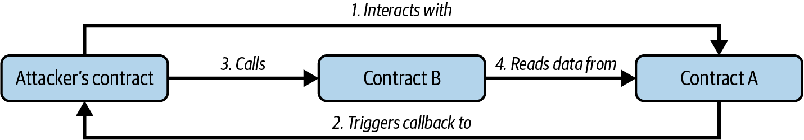

# Chapter 9. Smart Contract Security

Security is one of the most important considerations when writing smart contracts. In the field of smart contract programming, mistakes are costly and easily exploited. In this chapter, we will look at security best practices and design patterns as well as *security antipatterns*, which are practices and patterns that can introduce vulnerabilities into smart contracts.

As with other programs, a smart contract will execute exactly what is written, which is not always what the programmer intended. Furthermore, all smart contracts are public, and any user can interact with them simply by creating a transaction. Any vulnerability can be exploited, and losses are almost always impossible to recover. It is therefore critical to follow best practices and use well-tested design patterns.

Think of robust development as the first layer in a “Swiss cheese model” of security. Each layer of protection acts like a slice of Swiss cheese: none is flawless on its own, but together they create a stronger defense. The very first layer is following solid development practices: using reliable design patterns, writing clear and intentional code, and actively avoiding known pitfalls. This foundational layer gives us the best start in securing our contracts from vulnerabilities. Beyond this, other layers like testing, code reviews, and bug bounties add extra protection, but it all begins with our development practices.

## Security Best Practices

*Defensive programming* is a style of programming that is particularly well suited to smart contracts. It emphasizes the following, all of which are best practices:

**Minimalism/simplicity**

Before even writing code, it’s worth stepping back to question whether every component is really needed. Can the design be simplified? Are certain data structures introducing unnecessary surface area? Once the architecture is settled, we should still go back through the code with a critical eye, looking for opportunities to reduce lines, eliminate edge cases, or drop nonessential features. Simpler contracts are easier to reason about, test, and audit. And while some DeFi protocols legitimately grow into a few thousand lines, it’s still worth being skeptical when someone boasts about the size of their codebase. More code often means more bugs, not more value.

**Code reuse**

Try not to reinvent the wheel. If a library or contract already exists that does most of what you need, reuse it. [OpenZeppelin](https://www.openzeppelin.com), for instance, offers a suite of contracts that are widely adopted, thoroughly tested, and continuously reviewed by the community. Within your own code, follow the DRY principle: don’t repeat yourself. If you see any snippet of code repeated more than once, ask yourself whether it could be written as a function or library and reused. Code that has been battle-tested across many deployments is almost always more secure than something you’ve just written, no matter how confident you feel about it. Beware of “not invented here” syndrome, where you are tempted to “improve” a feature or component by building it from scratch. The security risk is often greater than the improvement value. Reuse isn’t laziness. It’s smart, defensive engineering.

**Code quality**

Smart contract code is unforgiving. Every bug can lead to monetary loss. You should not treat smart contract programming the same way you do general-purpose programming. Writing a DApp in Solidity is not like creating a web widget in JavaScript. Rather, you should apply rigorous engineering and software development methodologies as you would in aerospace engineering or any similarly unforgiving discipline. Once you “launch” your code, there is little you can do to fix any problems. And even if the code is upgradable, you often have very little time to respond if anything goes wrong. If someone spots a bug in your project before you do, the exploit will likely unfold in a single transaction or just a few, meaning the damage is done within seconds, long before you can intervene.

**Readability/auditability**

Your code should be clear and easy to comprehend. The easier it is to read, the easier it is to audit. Smart contracts are public: everyone can read the bytecode, and anyone skilled enough can reverse-engineer it. Therefore, it is beneficial to develop your work in public, using collaborative and open source methodologies, to draw upon the collective wisdom of the developer community and benefit from the highest common denominator of open source development. You should write code that is well documented and easy to read, following the style and naming conventions that are part of the Ethereum community.

**Test coverage**

Test everything you can. Smart contracts run in a public execution environment, where anyone can execute them with whatever input they want. You should never assume that input, such as function arguments, is well formed or properly bounded or that it has a benign purpose. Test all arguments to make sure they are within expected ranges and are properly formatted before allowing execution of your code to continue.

## Security Risks and Antipatterns

As a smart contract programmer, you should be familiar with the most common security risks, so you can detect and avoid the programming patterns that leave your contracts exposed to these risks. In the next several sections, we will look at different security risks, examples of how vulnerabilities can arise, and countermeasures or preventative solutions that can be used to address them.

The following antipatterns are often combined to execute an exploit, much like in Web2 security. Real-world exploits are usually more complex than the examples in this chapter.

### Reentrancy

One of the features of Ethereum smart contracts is their ability to call and utilize code from other external contracts. Contracts also typically handle ether and as such, often send ether to various external user addresses. These operations require the contracts to submit external calls. These external calls can be hijacked by attackers, who can force the contracts to execute further code (through a callback: either a fallback function or some hook, usually `transfer`), including calls back into themselves. Attacks of this kind were used in the infamous and still remembered DAO hack from 2016. Even after all these years, [we’re still seeing a lot of attacks exploiting this vulnerability](https://oreil.ly/87VUR), even though it’s pretty straightforward to spot and inexpensive to fix.

#### The vulnerability

This type of attack happens when an attacker manages to take control during the execution of another contract before that contract has finished updating its state. Since the contract is still in the middle of its process, it has not yet updated its state (e.g., critical variables). The attacker can then “reenter” the contract at this vulnerable moment, taking advantage of the inconsistent state to trigger actions that weren’t intended or expected. This reentry allows the attacker to bypass safeguards, manipulate data, or drain funds, all because the contract hasn’t fully settled into a safe, consistent state yet.

Reentrancy can be tricky to grasp without a practical example. Take a look at the simple vulnerable contract in Example 9-1, which acts as an Ethereum vault that allows depositors to withdraw only 1 ether per week.

**Example 9-1. EtherStore: a contract vulnerable to reentrancy**

```solidity
1 contract EtherStore {
2      uint256 public withdrawalLimit = 1 ether;
3      mapping(address => uint256) public lastWithdrawTime;
4    mapping(address => uint256) balances;
5
6    function depositFunds() public payable{
7      balances[msg.sender] += msg.value;
8    }
9
10    function withdrawFunds() public {
11        require(block.timestamp >= lastWithdrawTime[msg.sender] + 1 weeks);
12        uint256 _amt = balances[msg.sender];
13        if(_amt > withdrawalLimit){
14            _amt = withdrawalLimit;
15        }
16      (bool res, ) = address(msg.sender).call{value: _amt}("");
17        require(res, "Transfer failed");
18      balances[msg.sender] -= _amt; // assume Solidity <0.8: underflow wraps (exploitable); Solidity >=0.8: reverts here
19        lastWithdrawTime[msg.sender] = block.timestamp;
20    }
21 }
```

This contract has two public functions, `depositFunds` and `withdrawFunds`. The `depositFunds` function simply increments the sender’s balance. The `withdrawFunds` function allows the sender to withdraw their balance. This function is intended to succeed only if a withdrawal has not occurred in the last week.

The vulnerability is in line 16, where the contract sends the user their requested amount of ether. Consider an attacker who has created the contract in Example 9-2.

**Example 9-2. Attack.sol: a contract used to exploit the reentrancy vulnerability in the EtherStore contract**

```solidity
1 contract Attack {
2  EtherStore public etherStore;
3
4  // initialize the etherStore variable with the contract address
5  constructor(address _etherStoreAddress) {
6      etherStore = EtherStore(_etherStoreAddress);
7  }
8
9  function attackEtherStore() public payable {
10      // attack to the nearest ether
11      require(msg.value >= 1 ether, "no bal");
12      // send eth to the depositFunds() function
13      etherStore.depositFunds{value: 1 ether}();
14      // start the magic
15      etherStore.withdrawFunds();
16  }
17
18  function collectEther() public {
19      payable(msg.sender).transfer(address(this).balance);
20  }
21
22  // receive function - the fallback() function would have worked out too
23  receive() external payable {
24      if (address(etherStore).balance >= 1 ether) {
25          // reentrant call to victim contract
26          etherStore.withdrawFunds();
27      }
28  }
29 }
```

How might the exploit occur? First, the attacker would create the malicious contract (let’s say at the address `0x0...123`) with the `EtherStore`’s contract address as the sole constructor parameter. This would initialize and point the public variable `etherStore` to the contract to be attacked.

The attacker would then call the `attackEtherStore` function, with some amount of ether greater than or equal to 1—let’s assume 1 ether for the time being. In this example, we will also assume a number of other users have deposited ether into this contract, so its current balance is 10 ether. The following will then occur:

- *Attack.sol*, line 13: The `depositFunds` function of the `EtherStore` contract will be called with a `msg.value` of `1 ether` (and a lot of gas). The sender (`msg.sender`) will be the malicious contract (`0x0...123`). Thus, `balances[0x0..123] = 1 ether`.
- *Attack.sol*, line 15: The malicious contract will then call the `withdrawFunds` function of the `EtherStore` contract. This will pass the requirement (line 11 of the `EtherStore` contract) as no previous withdrawals have been made.
- *EtherStore.sol*, line 16: The contract will send `1 ether` back to the malicious contract.
- *Attack.sol*, line 23: The payment to the malicious contract will then execute the `receive` function.
- *Attack.sol*, line 24: The total balance of the `EtherStore` contract was 10 ether and is now 9 ether, so this `if` statement passes.
- *Attack.sol*, line 26: The fallback function calls the `EtherStore` `withdrawFunds` function again and *reenters* the `EtherStore` contract.
- *EtherStore.sol*, line 10: In this second call to `withdrawFunds`, the attacking contract’s balance is still 1 ether as line 18 has not yet been executed. Thus, we still have `balances[0x0..123] = 1 ether`. This is also the case for the `lastWithdrawTime` variable. Again, we pass the requirement.
- *EtherStore.sol*, line 16: The attacking contract withdraws another `1 ether`.
- Reenter the EtherStore contract until it is no longer the case that `EtherStore.balance >= 1`, as dictated by line 24 in *Attack.sol*.
- *Attack.sol*, line 24: Once there is less than 1 ether left in the `EtherStore` contract, this `if` statement will fail. This will then allow lines 17–19 of the `EtherStore` contract to be executed (for each call to the `withdrawFunds` function).
- *EtherStore.sol*, lines 18 and 19: The `balances` and `lastWithdrawTime` mappings will be set, and the execution will end.

The final result is that the attacker has withdrawn all ether from the `EtherStore` contract in a single transaction.

While native ether transfers intercepted by fallback functions are a common vector for reentrancy attacks, they are not the only mechanism that can introduce this risk. Several token standards, like ERC-721 and ERC-777, include callback mechanisms that can also enable reentrancy attacks. For instance, ERC-721’s `safeTransfer` function ensures that token transfers to contracts call the recipient’s `onERC721Received` function. Similarly, ERC-777 tokens allow hooks to be invoked via the `tokensReceived` function during transfers.

#### Beyond the Classic Reentrancy Pattern
Reentrancy attacks aren’t limited to a single function or contract. While classic reentrancy involves reentering the same function before it finishes, there are variations that are harder to spot, such as cross-function reentrancy, cross-contract reentrancy, and, the trickiest of all, read-only reentrancy.
Read-only reentrancy takes advantage of contracts that depend on view functions of other contracts. These functions don’t modify state but return data that other contracts rely on, often without reentrancy protection. The problem occurs when a reentrant call lets an attacker temporarily put the target contract into an inconsistent state, allowing them to use another contract (the victim) to query this unstable state through a view function.
Let’s look at how it plays out:
1. The attacker’s contract interacts with a vulnerable contract—let’s call it Contract A—which can be reentered. This contract holds data that other protocols rely on.
2. Contract A triggers a callback to the attacker’s contract, allowing the attacker’s contract logic to run.
3. While still in the fallback, the attacker’s contract calls a different protocol, Contract B, which is connected to Contract A and depends on the data it provides.
4. Contract B, unaware of any issues, reads data from Contract A. However, the state of Contract A is outdated because it hasn’t finished updating yet.
By the time this cycle ends, the attacker has already exploited Contract B by leveraging the outdated data from Contract A and then lets the callback and original call in Contract A complete as normal. The process is illustrated in Figure 9-1.


**Figure 9-1.** Read-only reentrancy

The key here is that Contract B trusts the data from Contract A, but Contract A’s state hasn’t caught up, allowing the attacker to exploit the lag. This type of attack is harder to defend against because developers often don’t protect view functions with reentrancy locks, thinking they are safe since they don’t modify state.
Read-only reentrancy teaches us that even read-only functions can be dangerous when they’re relied upon by external contracts.

#### Preventative techniques

The first best practice to follow in order to prevent reentrancy issues is sticking to the check-effect-interaction pattern when writing smart contracts. This pattern is about ensuring that all changes to state variables happen before interacting with external contracts. For instance, in the *EtherStore.sol* contract, the lines that modify state variables should appear before any external calls. The goal is to ensure that any piece of code interacting with external addresses is the last thing executed in the function. This prevents external contracts from interfering with the internal state upon reentering because the necessary updates have already been made.

Another useful technique is applying a reentrancy lock. A *reentrancy lock* is a simple state variable that “locks” the contract while it’s executing a function, preventing other external calls from interrupting. This can be implemented with a modifier like this:

```solidity
contract EtherStore {
    bool lock;
      uint256 public withdrawalLimit = 1 ether;
      mapping(address => uint256) public lastWithdrawTime;
    mapping(address => uint256) balances;

      modifier nonReentrant {
      require(!lock, "Can't reenter");
      lock = true;
      _;
      lock = false;
    }

    function withdrawFunds() public nonReentrant{
        [...]
    }
}
```

In this example, the `nonReentrant` modifier uses the lock variable to prevent the `withdrawFunds` function from being reentered while it’s still running. The `nonReentrant` modifier locks the contract when it starts and unlocks it once the function finishes. However, we shouldn’t reinvent the wheel. Instead of crafting our own reentrancy locks, it’s better to rely on well-tested libraries like OpenZeppelin’s ReentrancyGuard. These libraries provide secure, gas-optimized solutions.

> **Note**
>
> With the advent of transient storage on Ethereum in Solidity 0.8.24, OpenZeppelin has introduced ReentrancyGuardTransient, a new variant of ReentrancyGuard that leverages transient storage for significantly lower gas costs. Transient storage, enabled by [EIP-1153](https://oreil.ly/fRvKl), provides a cheaper way to store data that’s needed only for the duration of a single transaction, making it ideal for reentrancy guards and similar temporary logic. However, ReentrancyGuardTransient can be used only on chains where EIP-1153 is available, so make sure your target chain supports this feature before implementing it.

One more approach is to use Solidity’s built-in `transfer` and `send` functions to send ether. These functions forward only a limited amount of gas (2,300 units), which typically is not enough for the receiving contract to execute a reentrant call, so they are a simple way to guard against reentrancy. However, they come with notable drawbacks. If the recipient is a smart contract with nonmalicious logic in its fallback or receive function, the transfer might fail, potentially locking funds. This risk is becoming more relevant with the introduction of EIP-7702, which allows EOAs to have attached code, including fallback logic. As more EOAs adopt this capability, transactions using `transfer` or `send` are more likely to revert during regular execution of the transactions due to insufficient gas. And from a security perspective, this approach isn’t future proof: if a future hard fork reduces the gas cost of certain operations, 2,300 units might become sufficient to reenter, breaking assumptions that were previously safe. So, while `transfer` and `send` can still be helpful in narrow cases, we need to use them with caution and not rely on them as our primary defense.

Read-only and cross-contract reentrancy deserve special attention: these exploits can be tricky because they might involve two separate protocols, making coordinated prevention a challenge. When our project relies on external protocols for data, we need to dig into how the combined logic works. Even if each project is secure on its own, vulnerabilities can pop up during integration.

#### Real-world example: The DAO attack

Reentrancy played a major role in the DAO attack that occurred in 2016 and was one of the major hacks during the early development of Ethereum. At the time, the contract held more than $150 million, 15% of the circulating supply of ether. To revert the effects of the hack, the Ethereum community ultimately opted for a hard fork that split the Ethereum blockchain. As a result, Ethereum Classic (ETC) continued as the original chain, while the forked version with updated rules to reverse the hack became the Ethereum we know today.

#### Real-world example: Libertify

A recent exploit where reentrancy was the sole attack vector is the July 2023 case involving Libertify, a DeFi protocol that was breached for $400,000. Let’s check the code of the exploited function and see how it happened:

```solidity
function _deposit(
    uint256 assets,
    address receiver,
    bytes calldata data,
    uint256 nav
) private returns (uint256 shares) {
        /*
        validations
    */
    uint256 returnAmount = 0;
    uint256 swapAmount = 0;
    if (BASIS_POINT_MAX > invariant) {
        swapAmount = assetsToToken1(assets);
        returnAmount = userSwap( // External call
            data,
            address(this),
            swapAmount,
            address(asset),
            address(other)
        );
    }
    uint256 supply = totalSupply(); // State update
    if (0 < supply) {
        uint256 valueToken0 = getValueInNumeraire(
            asset,
            assets - swapAmount,
            MathUpgradeable.Rounding.Down
        );
        uint256 valueToken1 = getValueInNumeraire(
            other,
            returnAmount,
            MathUpgradeable.Rounding.Down
        );
        shares = supply.mulDiv(
            valueToken0 + valueToken1,
            nav,
            MathUpgradeable.Rounding.Down
        );
    } else {
        shares = INITIAL_SHARE;
    }
    uint256 feeAmount = shares.mulDiv(
        entryFee, BASIS_POINT_MAX, MathUpgradeable.Rounding.Down
    );
    _mint(receiver, shares - feeAmount);
    _mint(owner(), feeAmount);
}
```

This is a classic example of a reentrancy issue—you don’t see one this straightforward very often these days! The core problem here was the lack of reentrancy protection. The `userSwap()` function allowed the attacker to reenter the `deposit()` function before the original call updated `totalSupply`. This meant the attacker could mint more shares than they were actually owed, exploiting the contract for a profit.

### DELEGATECALL

The `CALL` and `DELEGATECALL` opcodes are useful for allowing Ethereum developers to modularize their code. Standard external message calls to contracts are handled by the `CALL` opcode, which executes the code in the context of the *called* contract. In contrast, `DELEGATECALL` runs the code from another contract, but in the context of the *calling* contract. That means the storage, `msg.sender`, and `msg.value` all remain unchanged. A helpful way to think about `DELEGATECALL` is that the calling contract is temporarily borrowing the bytecode of the called contract and executing it as if it were its own. This enables powerful patterns like proxy contracts and libraries, where you deploy reusable logic once and reuse it across many contracts. Although the differences between these two opcodes are simple and intuitive, the use of `DELEGATECALL` can lead to subtle and unexpected behavior, especially when it comes to storage layout. For further reading, see Loi.Luu’s [Ethereum Stack Exchange question on this topic](https://oreil.ly/GJOUl) and the [Solidity docs](https://oreil.ly/gA7vg).

#### The vulnerability

As a result of the context-preserving nature of `DELEGATECALL`, building vulnerability-free custom libraries is not as easy as you might think. The code in libraries themselves can be secure and vulnerability free; however, when it is run in the context of another application, new vulnerabilities can arise. Let’s see a fairly complex example of this, using Fibonacci numbers. Consider the library in Example 9-3, which can generate the Fibonacci sequence and sequences of similar form. (Note: this code was modified from [*https://oreil.ly/EHjOb*](https://oreil.ly/EHjOb).)

**Example 9-3. FibonacciLib: a faulty implementation of a custom library**

```solidity
1 // library contract - calculates Fibonacci-like numbers
2 contract FibonacciLib {
3     // initializing the standard Fibonacci sequence
4     uint256 public start;
5     uint256 public calculatedFibNumber;
6
7     // modify the zeroth number in the sequence
8     function setStart(uint256 _start) public {
9         start = _start;
10     }
11
12     function setFibonacci(uint256 n) public {
13         calculatedFibNumber = fibonacci(n);
14     }
15
16     function fibonacci(uint256 n) internal view returns (uint) {
17         if (n == 0) return start;
18         else if (n == 1) return start + 1;
19         else return fibonacci(n - 1) + fibonacci(n - 2);
20     }
21 }
```

This library provides a function that can generate the *n*th Fibonacci number in the sequence. It allows users to change the starting number of the sequence (`start`) and calculate the *n*th Fibonacci-like number in this new sequence.

Let us now consider a contract that utilizes this library:

```solidity
contract FibonacciBalance {
    address public fibonacciLibrary;
    // the current Fibonacci number to withdraw
    uint256 public calculatedFibNumber;
    // the starting Fibonacci sequence number
    uint256 public start = 3;
    uint256 public withdrawalCounter;
    // the Fibonacci function selector
    bytes4 constant fibSig = bytes4(keccak256("setFibonacci(uint256)"));
    // constructor - loads the contract with ether
    constructor(address _fibonacciLibrary) payable {
        fibonacciLibrary = _fibonacciLibrary;
    }
    function withdraw() public {
        withdrawalCounter += 1;
        // calculate the Fibonacci number for the current withdrawal user
        // this sets calculatedFibNumber
        (bool success, ) = fibonacciLibrary.delegatecall(
            abi.encodeWithSelector(fibSig, withdrawalCounter)
        );
        require(success, "Delegatecall failed");
        payable(msg.sender).transfer(calculatedFibNumber * 1 ether);
    }
    // allow users to call Fibonacci library functions
    fallback() external {
        (bool success, ) = fibonacciLibrary.delegatecall(msg.data);
        require(success, "Delegatecall failed");
    }
}
```

This contract allows a participant to withdraw ether from the contract, with the amount of ether being equal to the Fibonacci number corresponding to the participant’s withdrawal order—that is, the first participant gets 1 ether, the second also gets 1, the third gets 2, the fourth gets 3, the fifth 5, and so on (until the balance of the contract is less than the Fibonacci number being withdrawn).

There are a number of elements in this contract that may require some explanation. First, there is an interesting-looking variable: `fibSig`. This holds the first 4 bytes of the Keccak-256 hash of the string `"setFibonacci(uint256)"`. This is known as the [*function selector*](https://oreil.ly/u9uaH) and is put into calldata to specify which function of a smart contract will be called. It is used in the `delegatecall` on line 18 to specify that we wish to run the `setFibonacci(uint256)` function. The calldata also includes the parameter we are passing to the function. Second, we assume that the address for the FibonacciLib library is correctly referenced in the constructor.

Can you spot any errors in this contract? If you were to deploy this contract, fill it with ether, and call `withdraw`, it would likely revert.

You may have noticed that the state variable `start` is used in both the library and the main calling contract. In the library contract, `start` is used to specify the beginning of the Fibonacci sequence and is set to `0`, whereas it is set to `3` in the calling contract. You may also have noticed that the fallback function in the `FibonacciBalance` contract allows all calls to be passed to the library contract, which allows for the `setStart` function of the library contract to be called. Recalling that we preserve the state of the contract, it may seem that this function would allow you to change the state of the `start` variable in the local `FibonacciBalance` contract. If so, this would allow you to withdraw more ether since the resulting `calculatedFibNumber` is dependent on the `start` variable (as seen in the library contract). In actual fact, the `setStart` function does not (and cannot) modify the `start` variable in the `FibonacciBalance` contract. The underlying vulnerability in this contract is significantly worse than just modifying the `start` variable.

Before discussing the actual issue, let’s take a quick detour to understand how state variables actually get stored in contracts. *State* or *storage variables* (variables that persist over individual transactions) are placed into *slots* sequentially as they are introduced in the contract. (There are some complexities here; consult the [Solidity docs](https://oreil.ly/LzV7L) for a more thorough understanding.)

As an example, let’s look at the library contract. It has two state variables: `start` and `calculatedFibNumber`. The first variable, `start`, is stored in the contract’s storage at `slot[0]` (i.e., the first slot). The second variable, `calculatedFibNumber`, is placed in the next available storage slot, `slot[1]`. The function `setStart` takes an input and sets `start` to whatever the input was. This function therefore sets `slot[0]` to whatever input we provide in the `setStart` function. Similarly, the `setFibonacci` function sets `calculatedFibNumber` to the result of `fibonacci(n)`. Again, this is simply setting storage `slot[1]` to the value of `fibonacci(n)`.

Now, let’s look at the `FibonacciBalance` contract. Storage `slot[0]` now corresponds to the `fibonacciLibrary` address, and `slot[1]` corresponds to `calculatedFibNumber`. It is in this incorrect mapping that the vulnerability occurs: `delegatecall` *preserves contract context*. This means that code that is executed via `delegatecall` will act on the state (i.e., storage) of the calling contract.

Now notice that in `withdraw` on line 18 we execute `fibonacciLibrary.delegatecall(abi.encodeWithSelector(fibSig, withdrawalCounter))`. This calls the `setFibonacci` function, which, as we discussed, modifies storage `slot[1]`, which in our current context is `calculatedFibNumber`. This is as expected (i.e., after execution, `calculatedFibNumber` is modified). However, recall that the `start` variable in the `FibonacciLib` contract is located in storage `slot[0]`, which is the `fibonacciLibrary` address in the current contract. This means that the function `fibonacci` will give an unexpected result. This is because it references `start` (`slot[0]`), which in the current calling context is the `fibonacciLibrary` address (which will often be quite large, when interpreted as a `uint`). Thus, it is likely that the `withdraw` function will revert since it will not contain `uint(fibonacciLibrary)` amount of ether, which is what `calculatedFibNumber` will return.

Even worse, the `FibonacciBalance` contract allows users to call all of the `fibonacciLibrary` functions via the fallback function at line 25. As we discussed earlier, this includes the `setStart` function. We discussed that this function allows anyone to modify or set storage `slot[0]`. In this case, storage `slot[0]` is the `fibonacciLibrary` address. Therefore, an attacker could create a malicious contract, convert the address to a `uint256` (this can be done in Python easily using `int('<address>',16)`), and then call `setStart(<attack_contract_address_as_uint>)`. This will change `fibonacciLibrary` to the address of the attack contract. Then, whenever a user calls `withdraw` or the fallback function, the malicious contract will run (which can steal the entire balance of the contract) because we’ve modified the actual address for `fibonacciLibrary`. An example of such an attack contract would be:

```solidity
contract Attack {
    uint256 private storageSlot0; // corresponds to fibonacciLibrary
    uint256 private storageSlot1; // corresponds to calculatedFibNumber
    // fallback - this will run if a specified function is not found
    fallback() external {
        storageSlot1 = 0; // we set calculatedFibNumber to 0, so if withdraw
        // is called we don’t send out any ether
        payable(<attacker_address>).transfer(this.balance); // we take all the ether
    }
}
```

Notice that this attack contract modifies the `calculatedFibNumber` by changing storage `slot[1]`. In principle, an attacker could modify any other storage slots they choose to perform all kinds of attacks on this contract. We encourage you to put these contracts into [Remix](https://remix.ethereum.org) and experiment with different attack contracts and state changes through these `delegatecall` functions.

It is also important to notice that when we say that `delegatecall` is state preserving, we are not talking about the variable names of the contract but rather the actual storage slots to which those names point. As you can see from this example, a simple mistake can lead to an attacker hijacking the entire contract and its ether.

#### Preventative techniques

Solidity provides the `library` keyword for implementing library contracts (see the [docs](https://oreil.ly/K7kF1) for further details). This ensures that the library contract is stateless and non-self-destructible. Forcing libraries to be stateless mitigates the complexities of storage context demonstrated in this section. Stateless libraries also prevent attacks wherein attackers modify the state of the library directly in order to affect the contracts that depend on the library’s code. As a general rule of thumb, when you are using `DELEGATECALL`, pay careful attention to the possible calling context of both the library contract and the calling contract and, whenever possible, build stateless libraries.

#### Real-world example: Parity multisig wallet (second hack)

The second Parity multisig wallet hack is an example of how well-written library code can be exploited if it is run outside its intended context. There are a number of good explanations of this hack, such as [“Parity Multisig Hacked. Again”](https://oreil.ly/OLt5Q). To add to these references, let’s explore the contracts that were exploited.

Since the exploit is seven years old, the following code snippets have been updated to reflect the syntax of recent Solidity versions, making them easier to read and understand.

The library contract is as follows:

```solidity
1 contract WalletLibrary is WalletEvents {
2
3   ...
4
5   // throw unless the contract is not yet initialized.
6   modifier only_uninitialized { if (m_numOwners > 0) revert(); _; }
7
8   // constructor - just pass on the owner array to multiowned and
9   // the limit to daylimit
10   function initWallet(address[] memory _owners, uint256 _required, uint256
11        _daylimit) public only_uninitialized {
12     initDaylimit(_daylimit);
13     initMultiowned(_owners, _required);
14   }
15
16   // kills the contract sending everything to `_to`.
17   function kill(address _to) onlymanyowners(keccak256(msg.data)) external {
18     selfdestruct(_to);
19   }
20
21   ...
22
23 }
```

And here’s the wallet contract:

```solidity
1 contract Wallet is WalletEvents {
2
3   ...
4
5   // METHODS
6
7   // gets called when no other function matches
8   fallback() external payable {
9     // just being sent some cash?
10     if (msg.value > 0)
11       Deposit(msg.sender, msg.value);
12     else if (msg.data.length > 0)
13       _walletLibrary.delegatecall(msg.data);
14   }
15
16   ...
17
18   // FIELDS
19   address constant _walletLibrary =
20     0xcafecafecafecafecafecafecafecafecafecafe;
21 }
```

Notice that the `Wallet` contract essentially passes all calls to the `WalletLibrary` contract via a delegate call. The constant `_walletLibrary` address in this code snippet acts as a placeholder for the actually deployed `WalletLibrary` contract (which was at `0x863DF6BFa4469f3ead0bE8f9F2AAE51c91A907b4`).

The intended operation of these contracts was to have a simple, low-cost, deployable `Wallet` contract whose codebase and main functionality were in the `WalletLibrary` contract. Unfortunately, the `WalletLibrary` contract is itself a contract and maintains its own state. Can you see why this might be an issue?

It is possible to send calls to the `WalletLibrary` contract itself. Specifically, the `WalletLibrary` contract could be initialized and become owned. In fact, a user did this, calling the `initWallet` function on the `WalletLibrary` contract and becoming an owner of the library contract. The same user subsequently called the `kill` function. Because the user was an owner of the library contract, the modifier passed, and the library contract self-destructed. As all `Wallet` contracts in existence refer to this library contract and contain no method to change this reference, all of their functionality, including the ability to withdraw ether, was lost along with the `WalletLibrary` contract. As a result, all ether in all Parity multisig wallets of this type instantly became lost or permanently unrecoverable.

> **Note**
>
> The exploiter later [appeared on GitHub](https://oreil.ly/VVgnm), leaving the memorable comment, “I accidentally killed it.” He claimed to be a newcomer to Ethereum who had been experimenting with smart contracts.

### Entropy Illusion

All transactions on the Ethereum blockchain are *deterministic state transition* operations. This means that every transaction modifies the global state of the Ethereum ecosystem in a calculable way, with no uncertainty. This has the fundamental implication that there is no source of entropy or randomness in Ethereum. In the early days, finding a decentralized way to create randomness was a big challenge. But over the years, we’ve developed some solid solutions to solve this problem.

#### The vulnerability

When developers build smart contracts on Ethereum, they often need a source of randomness, whether for games, lotteries, or other features that require unpredictability. The challenge is that Ethereum, as a blockchain, is inherently deterministic: every node must reach the same result to maintain consensus. So introducing true randomness requires a bit of creativity.

One approach many developers have resorted to is using block variables (such as block hashes, timestamps, or block numbers) as seeds to generate random numbers. These values may appear random, but they are actually controlled by the validator proposing the current block. For example, imagine a DApp where the outcome of a game is based on whether the next block hash ends in an even number. A validator could manipulate the process: if they are about to propose a block and the hash doesn’t fit their desired outcome, they could, for example, change the transaction order to change the block hash in a favorable way.

Validator manipulation isn’t the only risk when deriving randomness from block variables. Other smart contracts are aware of the value of these block variables, enabling them to interact with a vulnerable contract only when the outcome is favorable.

#### Preventative techniques

Compared to the past, Ethereum developers now have reliable methods for generating randomness: `PREVRANDAO` and *verifiable random functions* (VRFs).

VRFs are cryptographic proofs ensuring that the randomness generated is fair and unbiased. VRFs are supported by multiple providers, such as Chainlink. The VRF generates a random number along with a proof that verifies its fairness. This proof is verifiable by anyone, ensuring that the randomness is secure. VRFs have become a standard decentralized solution for securely obtaining randomness in smart contracts.

Another solid option is the `PREVRANDAO` opcode, introduced to Ethereum with the transition to PoS. This opcode is used to obtain the `PREVRANDAO` value, which originates from the Randao process, an integral component of PoS block production. Essentially, Randao is a collective effort by validators to generate randomness by each contributing a piece of data. `PREVRANDAO` is the result of this process from the previous block, and it serves as a reliable source of randomness. It’s trustworthy because manipulating the `PREVRANDAO` value would require compromising a significant number of validators, making such exploitation impractical and economically unfeasible. Developers can use this value in their contracts, but they should keep in mind that `PREVRANDAO` represents the value from the previous block, which is already known. To avoid this value being predictable at the time of commitment, smart contracts should instead commit to the `PREVRANDAO` value of a future block. This way, the value won’t be known when the commitment is made.

> **Warning**
>
> Randao can be manipulated if an attacker gains control of the proposers assigned to the final slots in an epoch. To decide if `PREVRANDAO` is a reliable choice for generating randomness in your smart contract, you should carefully weigh the costs and benefits of its manipulation. Although tampering with Randao can be expensive, if your contract involves valuable assets, it’s safer to use a decentralized oracle solution instead.

With solutions like `PREVRANDAO` and VRFs widely documented and accessible, it’s uncommon nowadays to see developers using insecure block variables as a randomness source. However, mistakes still occur when shortcuts are taken or when developers are unaware of these tools.

#### Real-world example: Fomo3D

Fomo3D was an Ethereum lottery game where players bought “keys” to extend a timer, competing to be the last buyer when the timer hit zero to win the prize pool. It included an airdrop feature with poor randomness, as shown in the following code:

```solidity
function airdrop()
        private
        view
        returns(bool)
    {
        uint256 seed = uint256(keccak256(abi.encodePacked(

            (block.timestamp).add
            (block.difficulty).add
            ((uint256(keccak256(abi.encodePacked
            (block.coinbase)))) / (block.timestamp)).add
            (block.gaslimit).add
            ((uint256(keccak256(abi.encodePacked
            (msg.sender)))) / (block.timestamp)).add
            (block.number)
        )));
        if((seed - ((seed / 1000) * 1000)) < airDropTracker_) {
            return(true);
        } else {
            return(false);
        }
    }
```

A malicious contract would know in advance the values used to compute the seed, allowing it to trigger the `airdrop` function only when it would result in a win. It’s no surprise the contract was exploited.

### Unchecked CALL Return Values

There are a number of ways to perform external calls in Solidity. Sending ether to external accounts is commonly performed via the `transfer` method. However, the `send` function can also be used, and for more versatile external calls, the `CALL` opcode can be directly employed in Solidity. The `call` and `send` functions return a Boolean indicating whether the call succeeded or failed. Thus, these functions have a simple caveat, in that the transaction that executes these functions will not revert if the external call (initialized by `call` or `send`) fails; rather, the functions will simply return `false`. A common error is that the developer expects a revert to occur if the external call fails and does not check the return value.

#### The vulnerability

Consider the contract in Example 9-4.

**Example 9-4. Vulnerable Lotto contract**

```solidity
1 contract Lotto {
2
3     bool public payedOut;
4     address public winner;
5     uint256 public winAmount;
6
7     // ... extra functionality here
8
9     function sendToWinner() public {
10         require(!payedOut);
11         payable(winner).send(winAmount);
12         payedOut = true;
13     }
14
15     function withdrawLeftOver() public {
16         require(payedOut);
17         payable(msg.sender).send(address(this).balance);
18     }
19 }
```

This represents a Lotto-like contract, where a `winner` receives `winAmount` of ether, which typically leaves a little left over for anyone to withdraw. The vulnerability exists on line 11, where a `send` is used without checking the response. In this trivial example, a `winner` whose transaction fails (either by running out of gas or by being a contract that intentionally throws in the fallback function) allows `payedOut` to be set to `true` regardless of whether ether was sent or not. In this case, anyone can withdraw the `winner`’s winnings via the `withdrawLeftOver` function.

#### Preventative techniques

The first line of defense is always to check the return value of the `send` function and low-level calls, with no exceptions. Nowadays, any static analysis tool will flag this issue, making it hard to overlook.

When sending ether, we need to carefully consider which method to use. If we want the transaction to automatically revert on failure, `transfer` might seem appealing because it handles failure by default. But since both `send` and `transfer` forward only 2,300 gas units, they can easily fail when the recipient (whether a contract or, now with EIP-7702, even an EOA) has any fallback logic. Given this evolving context, the safer and more flexible approach is to use `call` instead, explicitly check its return value, and manage errors accordingly. That gives us full control over gas forwarding and keeps our contracts compatible with a wider range of recipients.

#### Real-world example: Etherpot and King of the Ether

[Etherpot](https://oreil.ly/_-iC-) was a smart contract lottery, not too dissimilar to the contract in Example 9-4. The downfall of this contract was primarily due to incorrect use of block hashes (only the last 256 block hashes are usable; see “Predefined Global Variables and Functions”). However, this contract also suffered from an unchecked `call` value.

Consider the function `cash` in Example 9-5: again, the following code snippet has been updated to reflect the syntax of recent Solidity versions.

**Example 9-5. Lotto.sol: code snippet**

```solidity
1 function cash(uint256 roundIndex, uint256 subpotIndex) public {
2    uint256 subpotsCount = getSubpotsCount(roundIndex);
3    if(subpotIndex>=subpotsCount)
4        return;
5    uint256 decisionBlockNumber = getDecisionBlockNumber(roundIndex,subpotIndex);
6    if(decisionBlockNumber>block.number)
7        return;
8    if(rounds[roundIndex].isCashed[subpotIndex])
9        return;
10    //Subpots can only be cashed once. This is to prevent double payouts
11    address winner = calculateWinner(roundIndex,subpotIndex);
12    uint256 subpot = getSubpot(roundIndex);
13    payable(winner).send(subpot);
14    rounds[roundIndex].isCashed[subpotIndex] = true;
15    //Mark the round as cashed
16 }
```

Notice that on line 13, the `send` function’s return value is not checked, and the following line then sets a Boolean indicating that the winner has been sent their funds. This bug can allow a state where the winner does not receive their ether but the state of the contract can indicate that the winner has already been paid.

A more serious version of this bug occurred in the [King of the Ether](https://oreil.ly/4zLMH) contract. An excellent [postmortem](https://oreil.ly/U8ckx) of this contract has been written that details how an unchecked, failed `send` could be used to attack the contract.

#### The ERC-20 case

When dealing with ERC-20 tokens in Solidity, simply checking the return value of token transfers isn’t enough to ensure safe interactions. This is because not all ERC-20 tokens strictly follow the ERC-20 standard, especially older tokens. Some tokens return a Boolean value upon completion of a transfer rather than revert or throw exceptions directly when the operation fails. Others might not return any value at all, leading to ambiguous behavior when interacting with them using the standard methods. Tether (USDT) is a prominent example of a widespread token that does not fully conform to the ERC-20 standard.

To mitigate this, we use libraries like OpenZeppelin’s SafeERC20. This library wraps standard ERC-20 operations (like `transfer`, `transferFrom`, and `approve`) in a way that gracefully handles these variations. If a token returns `false`, the library ensures that the transaction is reverted, and if a token doesn’t return a value, the library assumes the operation succeeded if no revert occurred.

### Race Conditions and Front-Running

To really grasp this vulnerability, let’s briefly revisit how transactions work in Ethereum. When we send a transaction, it’s broadcast to the network of nodes and placed in the mempool, a kind of waiting room for pending transactions. Validators then pick up these transactions from the mempool to build a block. Transactions within a block are executed sequentially in a specific order, and because each transaction changes the blockchain’s global state, the outcome of a transaction can vary depending on its position in the block. This transaction ordering is important because it can significantly affect the results of transaction execution.

> **Note**
>
> In practice, controlling a transaction’s position in the block mostly comes down to payment. Originally, you could influence ordering simply by offering a higher gas price. Today, thanks to the Flashbots infrastructure implementing builder-proposer separation (which isn’t yet part of Ethereum natively), users can submit bundles of transactions in a specific order and bid for their inclusion via off-chain relay systems. These processes—both the legacy mempool-based system and the new builder-based one—are covered in more detail in Chapter 6.

#### The vulnerability

*Front-running* is the practice of exploiting this sequential execution by inserting other transactions into the block in a way that benefits the front-runner. Essentially, someone watches for pending transactions that could affect the market or a specific contract and then submits their own transaction to get processed before the original. By doing so, they can capitalize on the information from the pending transaction, often to the detriment of the original sender. It’s important that our code accounts for this dynamic and is designed to be resilient against changes in transaction order within a block.

Let’s see how this could work with a simple example. Consider the contract shown in Example 9-6.

**Example 9-6. FindThisHash: a contract vulnerable to front-running**

```solidity
contract FindThisHash {
    bytes32 constant public hash =
      0xb5b5b97fafd9855eec9b41f74dfb6c38f5951141f9a3ecd7f44d5479b630ee0a;
    constructor() payable {} // load with ether
    function solve(string memory solution) public {
        // If you can find the pre-image of the hash, receive 1000 ether
        require(hash == keccak256(abi.encodePacked(solution)));
        payable(msg.sender).transfer(1000 ether);
    }
}
```

Say this contract has 1,000 ether. The user who can find the preimage of the SHA-3 hash `0xb5b5b97fafd9855eec9b41f74dfb6c38f5951141f9a3ecd7f44d​5479b630ee0a` can submit the solution and retrieve the 1,000 ether. Let’s say one user figures out that the solution is `Ethereum!`. They call `solve` with `Ethereum!` as the parameter. Unfortunately, an attacker spotted the transaction in the mempool, checked its validity, and then submitted an equivalent transaction with higher priority in the block. The original transaction will revert since the attacker’s transaction will be processed first.

#### Preventative techniques

Front-running vulnerabilities can appear in various forms, often depending on the specific logic of the smart contract or protocol. Whenever an operation can be exploited by means of transaction ordering, we have a front-running vulnerability. Therefore, the solutions are usually tailored to the specific problem. For instance, automated market maker (AMM) protocols address this issue by allowing users to set a minimum number of tokens they must receive during a swap. While this doesn’t prevent front-running entirely, it severely limits the potential profit an attacker can extract, reducing the damage and protecting users from extreme slippage.

Another general technique is the use of a commit-reveal scheme. In this approach, users first submit a transaction containing hidden information, typically represented as a hash (the commit phase). Once this transaction is included into a block, the user follows up with a second transaction that reveals the actual data (the reveal phase). This method effectively prevents front-running because attackers can’t see the details of the initial transaction until it’s too late to act on it. The trade-off, however, is that it requires two separate transactions, which means higher costs and added latency. In addition to the poorer user experience, the required delay between transactions can be a practical limitation in time-sensitive applications.

#### Real-world example: AMM and minAmountOut

Let’s explore a common real-world front-running vulnerability. It occurs when smart contracts integrating AMM protocols perform swaps that don’t set a minimum number of tokens to receive, making the said swaps susceptible to front-running attacks. If the minimum number of tokens to receive isn’t set properly (or is left too low), the swap transaction becomes vulnerable to sandwich attacks, a specific type of front-running.

Here’s how the sandwich attack unfolds: a front-runner monitors pending transactions in the mempool and spots our swap transaction that doesn’t enforce a minimum amount out. The attacker submits a buy transaction just before our swap to artificially inflate the token price. Our transaction then goes through at this inflated price, resulting in fewer tokens than we might have expected. On top of that, our transaction further inflates the price. Immediately afterward, the attacker sells their tokens at this higher price, bringing the price back down and profiting from the price difference created by our transaction. This strategy “sandwiches” our transaction between their two trades, hence the name *sandwich attack*. To fix the issue, smart contracts integrating AMMs need to fetch the real asset price from a trusted source like an oracle (even time-weight average price based), then compute and enforce a precise minimum amount out when performing a swap.

### Denial of Service

This category is very broad but fundamentally consists of attacks where users can render a contract or part of it inoperable for a period of time or, in some cases, permanently. This can trap funds in these contracts forever, as was the case described in “Real-world example: Parity multisig wallet (second hack)”.

#### The vulnerability

There are various ways a contract can become inoperable. Here we highlight just a few less-obvious Solidity coding patterns that can lead to DoS vulnerabilities.

#### Looping through externally manipulated mappings or arrays

This pattern typically appears when an owner wishes to distribute tokens to investors with a `distribute`-like function, as in the contract in Example 9-7.

**Example 9-7. DistributeTokens contract**

```solidity
1 contract DistributeTokens {
2     address public owner; // gets set somewhere
3     address[] investors; // array of investors
4     uint[] investorTokens; // the amount of tokens each investor gets
5
6     // ... extra functionality, including transfertoken()
7
8     function invest() public payable {
9         investors.push(msg.sender);
10         investorTokens.push(msg.value * 5); // 5 times the wei sent
11         }
12
13     function distribute() public {
14         require(msg.sender == owner); // only owner
15         for(uint256 i = 0; i < investors.length; i++) {
16             // here transferToken(to,amount) transfers "amount" of
17             // tokens to the address "to"
18             transferToken(investors[i],investorTokens[i]);
19         }
20     }
21 }
```

Notice that the loop in this contract runs over an array that can be artificially inflated. An attacker can create many user accounts, making the `investors` array very large. The risk isn’t just the loop itself but also the cumulative gas cost of the operations inside it, like `transferToken` or any other logic. Each additional iteration adds to the total gas used, and if the array gets large enough, the gas required to complete the loop can exceed the block gas limit. At that point, the `distribute` function effectively becomes unusable.

> **Note**
>
> This kind of DoS isn’t limited to state-changing functions. Even read-only view functions can become inaccessible if they loop over large arrays. While calling them doesn’t consume gas on chain, RPC endpoints enforce their own arbitrary gas caps on `eth_call` executions. So if a view function runs enough logic to exceed those limits, the RPC call would fail.

#### Progressing state based on external calls

Contracts are sometimes written such that progressing to a new state requires sending ether to an address or waiting for some input from an external source. These patterns can lead to DoS when the external call fails or is prevented for external reasons. In the example of sending ether, a user can create a contract that does not accept ether. If a contract requires ether to be sent in order to progress to a new state, the contract will never achieve the new state since ether can never be sent to the user’s contract that does not accept ether.

#### Unexpected issues

DoS issues can pop up in unexpected ways, and they don’t always involve malicious attacks. Sometimes, a contract’s functionality can be disrupted just by unforeseen events. For instance, if a smart contract relies on an owner’s private key to call specific privileged functions and that key gets lost or compromised, we’re in trouble. Without that key, those crucial functions become permanently inaccessible, which might stall the entire contract’s operations. Imagine an initial coin offering (ICO) contract where the owner must call a function to finalize the sale. If the key is lost, no one can call it, and tokens will stay locked forever.

Another example of an unexpected disruption comes from ether sent to a contract without its knowledge or intention. Ether can be “forced” into a contract using a method called `selfdestruct` (now deprecated) or even by sending ether before the contract is deployed to its predetermined address. If a contract assumes it controls the accounting of all ether it receives through its own functions, it might not know what to do with these uninvited funds, leading to unintended behavior. It’s like getting money in your bank account you didn’t expect—sometimes it’s nice, but it could also mean your account balance is off, and any system relying on that exact number can start acting up.

#### Preventative techniques

Since DoS issues appear in different forms, the solutions are also usually situation specific.

Long lists that risk hitting the block gas limit are a fairly common situation, so we can give some suggestions for dealing with this. In the first example, contracts should not loop through data structures that can be artificially manipulated by external users. A withdrawal pattern is recommended, whereby each of the investors call a `withdraw` function to claim tokens independently (pull-over-push pattern). For functions iterating over long lists, a good solution is to implement a pagination feature.

The generic solution for DoS is to research as much as you can what could go wrong and implement safeguards.

#### Real-world example: ZKsync Era Gemholic funds lock

As we just said, the most unexpected errors can lead to a DoS issue in a smart contract. A recent example involves Gemholic, a project that deployed a smart contract on ZKsync Era, an Ethereum L2 solution. Gemholic faced a major problem when it couldn’t access 921 ETH (approximately $1.7 million) raised in a token sale. The root cause? The smart contract relied on the `transfer()` function, which is not supported by ZKsync Era. Although ZKsync Era is compatible with much of the EVM functionality, it isn’t fully EVM equivalent, meaning some features, like `transfer()`, don’t work as they would on the Ethereum mainnet. This incompatibility resulted in Gemholic’s funds being stuck because the smart contract wasn’t able to withdraw the ether as intended. Fortunately, ZKsync’s team was able to step in and develop what they described as an “elegant solution” to unlock the funds, allowing Gemholic to access them again. Unfortunately, the specifics of this “elegant solution” remain undisclosed.

### Floating Point and Precision

As of this writing, v0.8.29 of Solidity doesn’t fully support fixed-point and floating-point numbers. This design choice stems from blockchain’s fundamental need for determinism: every node in the network must reach identical results from the same inputs to maintain consensus. Unfortunately, floating-point arithmetic is inherently nondeterministic across different hardware architectures, possibly producing subtly different results from identical calculations.

Since blockchain applications require absolute determinism to prevent network forks and maintain security, Solidity forces developers to implement floating-point representations using integer types. While this approach is more cumbersome and prone to errors if not implemented correctly, it ensures that financial calculations and smart contract logic produce identical results across all nodes in the network.

#### The vulnerability

Fixed-point numbers are not yet fully supported by Solidity. They can be declared but cannot be assigned to or from, meaning that developers are required to implement their own using the standard integer data types. There are a number of pitfalls developers can run into during this process. We will try to highlight some of these in this section. Let’s begin with a code example (Example 9-8).

**Example 9-8. FunWithNumbers**

```solidity
1 contract FunWithNumbers {
2    uint256 constant public tokensPerEth = 10;
3    uint256 constant public weiPerEth = 1e18;
4    mapping(address => uint) public balances;
5
6    function buyTokens() public payable {
7        // convert wei to eth, then multiply by token rate
8        uint256 tokens = msg.value/weiPerEth*tokensPerEth;
9        balances[msg.sender] += tokens;
10    }
11
12    function sellTokens(uint256 tokens) public {
13        require(balances[msg.sender] >= tokens);
14        uint256 eth = tokens/tokensPerEth;
15        balances[msg.sender] -= tokens;
16        payable(msg.sender).transfer(eth*weiPerEth);
17    }
18 }
```

This simple token-buying and -selling contract has some obvious problems. Although the mathematical calculations for buying and selling tokens are correct, the lack of floating-point numbers will give erroneous results. For example, when buying tokens on line 8, if the value is less than 1 ether, the initial division will result in 0, leaving the result of the final multiplication as `0` (e.g., 200 wei divided by `1e18` `weiPerEth` equals 0). Similarly, when selling tokens, any number of tokens less than 10 will also result in 0 ether. In fact, rounding here is always down, so selling 29 tokens will result in 2 ether (29 tokens / 10 `tokensPerEth` = 2.9, which rounded down resolves to 2).

The issue with this contract is that the precision is only to the nearest ether (i.e., 1e18 wei). This can get tricky when dealing with decimals in [ERC-20](https://oreil.ly/YzzyU) tokens when you need higher precision. In practical cases, the precision losses may seem small, but they can easily be amplified and exploited. Flash loans, for example, allow attackers to borrow large amounts of capital with no up-front cost, making it possible to exploit even minor inconsistencies.

#### Preventative techniques

Keeping the right precision in your smart contracts is very important, especially when dealing with ratios and rates that reflect economic decisions. You should ensure that any ratios or rates you are using allow for large numerators in fractions. For example, we used the rate `tokensPerEth` in our example. It would have been better to use `weiPerTokens`, which would be a large number. To calculate the corresponding number of tokens, we could do `msg.value/weiPerTokens`. This would give a more precise result.

Another tactic is to be mindful of order of operations. In our example, the calculation to purchase tokens was `msg.value/weiPerEth*tokenPerEth`. Notice that the division occurs before the multiplication. Solidity, unlike some languages, guarantees to perform operations in the order in which they are written. This example would have achieved a greater precision if the calculation performed the multiplication first and then the division: `msg.value*tokenPerEth/weiPerEth`.

Finally, when defining arbitrary precision for numbers, it can be a good idea to convert values to higher precision, perform all mathematical operations, and then convert back down to the precision required for output. Typically, `uint256`s are used as they are optimal for gas usage; these give us approximately 60 orders of magnitude in their range, some of which can be dedicated to the precision of mathematical operations. It is better to keep all variables in high precision in Solidity and convert back to lower precision in external apps. This is essentially how the `decimals` variable works in ERC-20 token contracts: when we send 1,000 USDT on MetaMask, we are actually sending 1,000,000,000 units of USDT, which is 1,000 multiplied by USDT’s decimals (1e6).

To see an example of how to handle math operations with increased precision, let’s bring in Wad and Ray mathematics. A *Wad* represents a decimal number with 18 digits of precision, aligning perfectly with the 18 decimals common for ERC-20 tokens like ether. This makes it ideal for representing token balances, ensuring we have enough accuracy during computations. A *Ray*, on the other hand, goes even further with 27 digits of precision, useful for calculations of ratios very close to zero. The first Solidity fixed-point math library, known as DS-Math, provided a structure for working with these high-precision numbers.

The developers at MakerDAO originally created Wad and Ray specifically for their project’s needs. Given ether’s 18-decimal standard—and the fact that most ERC-20 tokens also follow this convention, although there are plenty of exceptions—Wad was perfect for the main financial units, while Ray was reserved for cases where precise fractional adjustments were needed. And while DS-Math pioneered this approach, many more libraries are now available for precise Solidity math operations. Aave’s WadRayMath, Solmate’s FixedPointMathLib, and OpenZeppelin’s Math library are just a few options available today.

#### Real-world example: ERC-4626 inflation attack

We will now see a precision-loss vulnerability commonly exploited in the wild, using a simplified version of OpenZeppelin’s ERC-4626 implementation. ERC-4626 is a tokenized vault standard that lets users deposit assets (like USDT) into a vault and receive shares representing their portion of the vault’s assets. Example 9-9 is a simplified version of the contract we’re working with.

**Example 9-9. Simplified version of the original ERC4626 OpenZeppelin implementation**

```solidity
1 abstract contract ERC4626 is ERC20, IERC4626 {
2    using Math for uint256;
3    IERC20 private immutable _asset;
4
5    constructor(IERC20 asset_) {
6        _asset = asset_;
7    }
8
9    function totalAssets() public view returns (uint256) {
10        return _asset.balanceOf(address(this));
11    }
12    function deposit(address receiver, uint256 assets) public {
13        uint256 shares = _convertToShares(assets, Math.Rounding.Down);
14        SafeERC20.safeTransferFrom(_asset, msg.sender, address(this), assets);
15        _mint(receiver, shares);
16        emit Deposit(msg.sender, receiver, assets, shares);
17    }
18    function _withdraw(address receiver, uint256 assets) public {
19        uint256 shares = _convertToShares(assets, Math.Rounding.Up);
20        _burn(msg.sender, shares);
21        SafeERC20.safeTransfer(_asset, receiver, assets);
22        emit Withdraw(msg.sender, receiver, msg.sender, assets, shares);
23    }
24    function _convertToShares(uint256 assets, Math.Rounding rounding) internal view
      returns (uint256) {
25        uint256 supply = totalSupply();
26        return
27            (assets == 0 || supply == 0)
28                ? assets
29                : assets.mulDiv(supply, totalAssets(), rounding); // (assets * supply) /
                  totalAssets()
30    }
31    function _convertToAssets(uint256 shares, Math.Rounding rounding) public view returns
      (uint256) {
32        uint256 supply = totalSupply();
33        return
34            (supply == 0)
35                ? shares
36                : shares.mulDiv(totalAssets(), supply, rounding); // (shares * totalAssets())
                  / supply
37    }
38 }
```

Now, let’s examine how the attack plays out.

An attacker, keeping a close eye on newly created ERC-4626 vaults, sees one pop up. They waste no time and deposit a tiny amount, just one unit of the vault’s asset, to mint a share for themselves. At this point, the total assets in the vault are just one (because that’s all the attacker deposited), and the total supply of shares is also one (because the attacker minted one share).

Here’s where things get sneaky. The attacker now waits for another user to deposit a significant amount—let’s say 1,000 USDT. But before the legitimate transaction goes through, the attacker jumps in and front-runs the deposit by directly transferring 1,000 USDT to the vault contract. Importantly, the attacker doesn’t use the vault’s `deposit` function; they just call `USDT.transfer()`. This “donation” of 1,000 USDT inflates the vault’s `totalAssets()` to 1000e6 + 1, while the `totalSupply()` of shares remains 1. Keep in mind that 1,000 USDT are actually accounted as 1,000e6, which is 1,000 multiplied by USDT’s decimals (1e6).

When the victim’s deposit finally gets processed, the smart contract tries to calculate how many shares to mint for the user. Remember, the formula for calculating shares is:

(assets × supply) / `totalAssets()`

In our case, the victim is depositing 1,000e6 USDT, and the formula becomes:

1,000e6 × 1 / (1,000e6 + 1) = 0.999

Because of the rounding-down mechanism, this results in zero shares. The victim gets nothing for their 1,000 USDT deposit.

Meanwhile the attacker, still holding their one share, can now burn that share and withdraw the total vault balance, which is 2,000 USDT. The attacker walks away with all the funds while the victim is left empty-handed.

> **Note**
>
> OpenZeppelin has since updated its ERC-4626 implementation to prevent this attack by introducing both a virtual offset and a decimal offset. The decimal offset increases the number of decimal places used for vault shares, which helps minimize rounding errors and makes precision-loss attacks less profitable. The virtual offset adds virtual assets and shares to the exchange-rate calculation, limiting the attacker’s ability to manipulate the initial conversion rate and protecting the vault from dead-share creation.

### Price Manipulation

Accurate asset pricing is essential for DeFi protocols to operate smoothly. These systems depend on price oracles to deliver current asset values. Think of an *oracle* as a data feed that supplies real-world information to smart contracts. Price manipulation attacks focus on these oracles—thus, not the smart contract’s code itself but the data that the contracts depend on. This manipulation can significantly change the behavior of DeFi protocols, creating arbitrage opportunities that wouldn’t normally exist. The outcome? An attacker can exploit the system to make substantial profits.

#### The vulnerability

Imagine this simple scenario: an attacker finds a lending protocol that relies on an insecure oracle for its pricing. By manipulating the price of an asset to make it appear lower than it actually is, the attacker can borrow more of that asset than they should be able to. They then sell the borrowed asset at its true market price, making a profit. The root of this vulnerability lies in the reliance on on-chain price metrics, which can be manipulated, to determine asset prices. The manipulation is often amplified using *flash loans*: instant and collateral-free loans that must be repaid within the same transaction block.

#### Preventative techniques

When we need to determine a price, our best bet is to use decentralized oracles like Chainlink, RedStone, Pyth, and many others. Because these oracles are decentralized, that makes them much harder to compromise since an attacker would need to control more than 50% of the nodes in the network. They do have their limitations, though. For instance, they may not be available for every asset. In such cases, we can turn to a time-weighted average price (TWAP) oracle.

TWAP oracles derive asset prices from on-chain data with some added security. They function by calculating the average price of an asset over a defined time frame, such as the past five minutes. By excluding the current block from their calculations, TWAP oracles effectively protect against flash-loan attacks. However, TWAP oracles aren’t completely immune to manipulation by a well-funded attacker. The key here is to adjust the period length: the longer the period, the more capital an attacker would need to manipulate the price. But a longer period also means the TWAP price might diverge more from the actual market price. Therefore, it’s important to fine-tune the TWAP based on the specific needs and risk profile of the project.

Regardless of the oracle we use, we shouldn’t blindly trust the data it provides. It’s a good practice to regularly verify the oracle data against other sources. For instance, we could write a script that compares the oracle prices with prices from other sources and flags any significant discrepancies. If such differences are found, the protocol can be paused to prevent further issues.

#### Prototype example: Reliance on AMM on-chain data

Often, the vulnerable oracle module is part of the protocol itself, as we will see in this example. A common exploit scenario occurs when a smart contract derives asset prices directly from on-chain AMM protocols like Uniswap. Imagine a Uniswap V2 pool with reserves of 4,000 USDC and 1 ETH. A smart contract might assume that 1 ETH is worth 4,000 USDC. However, this assumption can be very risky if the inferred price is used for further state-changing operations. In such a case, an attacker could take out a flash loan to perform a large swap, altering the pool’s balance and thus changing the inferred price of ETH. The vulnerable protocol, relying on this manipulated price, will then be exploited by the attacker.

Fortunately, this specific attack vector is well known. Although it’s not exploited as frequently as it once was, it still shows up in high-profile incidents. In May 2025, for example, Mobius Token was exploited for $2.1 million. Although the immediate trigger was a faulty multiplication by `10^18` in the `mint` function, the contract also contained a separate but equally critical vulnerability: it relied on on-chain metrics to compute the BNB/USDT price, exposing it to manipulation. Even if the math bug had been absent, the contract would still have been exploited in a short time. You might be wondering how code like this made it to production, ending up securing so much total value locked (TVL). The team had chosen not to publish the contract’s source code, assuming that keeping it hidden would provide safety—another reminder that security through obscurity doesn’t work, especially when the stakes are so high.

> **Note**
>
> Using prices inferred from on-chain data is risky only when these prices are applied to state-changing operations. If the prices are solely for informational purposes, such as in a view function that frontends use to fetch data, then the attack isn’t feasible. However, if an external contract retrieves the price from such a view function and then uses it for state-changing operations, it is vulnerable to manipulation.

#### Real-world example: Mango Markets

In the Mango Markets exploit, a trader took advantage of the platform’s price manipulation vulnerabilities to extract more than $116 million. By using $10 million across two wallets, the attacker opened 483 million Mango perpetual futures (MNGO-PERPs) at a price of 3.8 cents each. They then purchased $4 million worth of MNGO on three separate exchanges, driving the oracle-reported price up by 2,300%. Using this inflated perp position as collateral, the attacker borrowed $116 million from Mango Markets, leaving significant bad debt and fleeing with the funds. As commonly happens with price-manipulation exploits, this wasn’t a hack but rather a manipulation of the system’s mechanics, exploiting Mango’s liquidity without breaking any of its underlying code.

#### Negotiating with Exploiters
Exploiters and protocols often negotiate directly on chain to decide how much of the stolen funds the exploiter should return in exchange for the protocol agreeing to drop any charges. While these deals are common, they likely hold little legal weight in court. Typically, protocols offer a bounty of around 10% to the exploiter, meaning if the exploiter returns 90% of the stolen funds, the protocol will agree to stop pursuing them. Although these types of negotiations are common, what happened in this case was particularly remarkable.
After the exploit, the attacker proposed a deal to Mango Markets’ DAO: they would return most of the stolen funds if the community agreed to cover some bad debt that had previously been taken on to save another Solana project, Solend. In response, the Mango team put forth a second proposal that would see the attacker return up to $67 million while keeping $47 million as a kind of bug bounty. The agreement included a waiver of any claims related to bad debt and a commitment not to pursue criminal charges or freeze the attacker’s funds once the tokens were returned. The first proposal got rejected, while the second one passed. This led to Mango Markets tweeting on October 15 that $67 million in assets had indeed been returned.
Things took a legal turn when one of the attackers revealed himself on Twitter, calling the exploit a “highly profitable trading strategy” and claiming it was all done within the protocol’s intended design. But US authorities saw it differently and arrested him on charges of market manipulation. Mango Markets then filed a civil suit, arguing that the agreement should be void because it was made under duress, and it sought $47 million in damages. Since DAOs are a relatively new concept legally, the case has caught a lot of attention and could set a precedent for how decentralized organizations handle legal disputes.
In a twist that perfectly captures crypto’s wild legal landscape, the attacker actually won his fraud case in May 2025: the judge ruled that you can’t defraud a permissionless protocol with no terms of service. But here’s the kicker: when authorities searched his devices during the original Mango Markets investigation, they discovered more than 1,200 images and videos of child sexual abuse material, and he’s now serving four-plus years for that, proving that even brilliant DeFi exploits can’t save you from violations of basic human decency.

### Improper Input Validation

One major vulnerability often overlooked is improper input validation. When input from users or external sources isn’t properly validated, the consequences for smart contracts can vary widely, ranging from minor issues to significant loss of funds. Proper input validation helps protect against both malicious actors who might manipulate the contract’s behavior and genuine mistakes made by users or administrators, which could otherwise lead to loss of funds. If we don’t take the right precautions, a seemingly innocent oversight can result in significant issues in the contract’s execution.

#### The vulnerability

At its core, improper input validation occurs when a smart contract doesn’t thoroughly check the data or parameters it receives before processing them. If we don’t make sure that certain values meet specific conditions, we open the door for both genuine user mistakes and potential attacks. Users might accidentally input incorrect data, while attackers could intentionally feed our contracts unexpected data. This can bypass the intended logic and lead to unexpected state changes, causing our contracts to behave unpredictably.

A simple instance of this vulnerability occurs when a setter function doesn’t verify that an address isn’t the zero address before setting it as a recipient for funds. If we mistakenly set the zero address as the recipient, funds sent to the zero address will be locked forever, making them irretrievable.

A common and dangerous misconception in smart contract development is the belief that keeping the source code private will somehow protect it from exploitation. We’ve previously discussed in this chapter why security through obscurity doesn’t work, and this principle applies to input validation as well. Developers sometimes leave functions unprotected, assuming they won’t be discovered if the code isn’t published. But attackers can and do reverse-engineer contract bytecode to identify sensitive and unprotected functions. For instance, several closed-source MEV bots have been exploited through unprotected flash-loan callbacks, leading to millions in losses. Hiding the code doesn’t hide the risk.

#### Preventative techniques

So, how do we guard against improper input validation? The first step is simple: never assume that the inputs we receive are valid. Whether the input is coming from an EOA, another contract, or sometimes even the same contract, it should be rigorously checked. We need to validate not just input lengths but also edge cases and boundary conditions like minimum and maximum values. A classic edge case we shouldn’t overlook is the zero value.

Reusable validation logic is a key part of writing secure and maintainable smart contracts. We can implement these validation blocks using either modifiers or internal functions, depending on what fits best. Modifiers are particularly useful for attaching preconditions or postconditions to multiple functions in a consistent and declarative way. For example, we might use a modifier to ensure that a function’s input isn’t the zero address or to check that the caller has the right permissions before executing a sensitive operation. Internal functions can achieve the same goals and sometimes offer more flexibility, especially when validation depends on complex logic or needs to return values.

#### Access Control
Speaking of permissions, it’s important to implement robust access controls: `msg.sender` is a parameter and should be treated as such. While custom logic is an option, using trusted libraries like OpenZeppelin helps us manage access securely while minimizing complexity.
For simple projects where one entity needs full control, developers can use OpenZeppelin’s Ownable contract, which designates a single “owner” with authority over key functions. For added security, we recommend using Ownable2Step. This version includes a two-step ownership-transfer process that helps prevent accidental loss of ownership.
For more complex needs, OpenZeppelin’s AccessControl allows us to create multiple roles, each with different permissions. Role-based access control lets us assign specific tasks to different users, making it ideal for larger projects.
Before implementing proper access control, we need to validate all our assumptions about who might call external and public functions. Smart contracts operate in a public and trustless environment, so we can’t assume that only our intended entities will interact with the contract. In fact, we should always assume an attacker will attempt to call these functions to trigger unintended behaviors.

#### Prototype example: Arbitrary calls

The most common exploits entail arbitrary calls. Here, a vulnerable smart contract allows an attacker to provide an address to be called. Under these circumstances, the contract will effectively perform any call the attacker wants. One possible way to exploit this is by returning manipulated values that trick the contract into transferring tokens it shouldn’t.

Check this sample code of a vulnerable yield aggregator protocol:

```solidity
contract Aggregator {
    function stake( ... ) external {
        ...
    }
    function claimMultipleStakingRewards(address[] calldata _claimContracts) external {
        uint256 totalRewards;
        for (uint256 i = 0; i < _claimContracts.length; i++) {
            totalRewards += IClaimContract(_claimContracts[i]).claimStakingRewards(
            msg.sender
            );
        }
        IERC20(stakingToken).transfer(msg.sender, totalRewards);
    }
}
```

Its goal is simple: the `claimMultipleStakingRewards` function loops through an array of staking contract addresses provided by the user, calls the `claimStakingRewards` function on each one, and tallies up the total rewards. Finally, it sends the accumulated rewards to the user’s address. The problem is that the contract doesn’t check whether the addresses in `_claimContracts` actually point to trusted staking contracts. That opens the door to arbitrary external calls.

For instance, an attacker can deploy a contract like this:

```solidity
contract Attack {
    function claimStakingRewards(address ) external pure returns (uint256) {
        return 1_000_000 ether; // fabricated reward
    }
}
```

This malicious contract pretends to be a staking contract and simply returns an inflated reward value. When the `Aggregator` calls `claimStakingRewards` on it, it gets tricked into thinking the caller is owed a huge amount of tokens. Without additional checks, the `Aggregator` blindly adds that to the total and transfers real tokens to the attacker. This could have been avoided with a basic allowlist to ensure that only trusted contracts are allowed in `claimMultipleStakingRewards`.

### Signature Replay Attack

Signatures on Ethereum are incredibly useful because they let us authorize actions off chain, reducing the need for costly on-chain transactions. For example, if you’re authorizing someone to take a specific action on your behalf, such as transferring tokens or accessing a certain feature in a smart contract, you can sign an off-chain message that gives them permission. The contract then verifies the signature and executes the action without needing you to interact directly on chain. This also enables gasless transactions, where you sign off chain and a relayer submits it on chain, paying the gas fees. Smart contracts can verify these signatures to ensure that actions are securely authorized without requiring constant on-chain interaction.

However, once a piece of data is signed, it should logically be used only once. If a signed transaction can be reused, it opens the door to replay attacks, where an attacker replays the signature to execute the same action multiple times, such as transferring funds or changing contract states without permission. Smart contracts must be designed to prevent this by ensuring that each signed message is unique and can’t be replayed.

#### The vulnerability

Let’s look at an example contract (Example 9-10) that’s vulnerable to replay attacks.

**Example 9-10. Token: A contract vulnerable to signature replay attack**

```solidity
1 contract Token {
2    mapping(address => uint256) public balances;
3    struct Signature {
4        bytes32 r;
5        bytes32 s;
6        uint8 v;
7    }
8    event Transfer(address indexed from, address indexed to, uint256 amount);
9    function transfer(uint256[] memory _amount, address[] memory _from, address[]
     memory _to,  Signature memory _signature) public {
10        bytes32 messageHash = keccak256(abi.encodePacked(_from, _to, _amount));
11        address signer = ecrecover(messageHash, _signature.v, _signature.r, _signature.s);
12        for(uint256 i = 0; i < _from.length; i++){
13            address __from = _from[i];
14            address __to = _to[i];
15            uint256 __amount = _amount[i];
16            require(balances[__from] >= _amount[i], "Insufficient balance");
17            require(signer == _from[i], "Invalid signature");
18            balances[__from] -= __amount;
19            balances[__to] += __amount;
20            emit Transfer(__from, __to, __amount);
21        }
22    }
23 }
```

At first glance, this looks like a handy contract function. It allows anyone with a valid signature to perform multiple transfers without the signer needing to pay gas. An administrator could sign the data off chain, and someone else—perhaps a service—could submit the transaction on chain for them. Anyway, handling signatures is not trivial, and this very short code contains a significant number of issues.

The most obvious problem is that there’s no mechanism to prevent someone from reusing the same signature over and over. Without any way to track if a signature has been used, an attacker could simply repeat the transaction until the victim’s balance is drained. The fix is pretty simple: we need to add a *nonce* (a value to be used only once, usually a counter that increments with each transaction) into the data being signed. The contract verifying the signature has the responsibility to check that the provided nonces have not been previously used. This ensures that each signature is unique, too, preventing replays. Ethereum transactions already use nonces for this reason.

Another critical issue here is signature malleability. This happens when a cryptographic signature can be altered to produce a different but still valid signature for the same underlying message. The built-in `ecrecover` function used in the contract is vulnerable to this problem. Attackers can tweak a valid signature and create another one that also works, even though the underlying signed message remains the same. To avoid this, developers should use a safer signature-verification method, like the one provided by the OpenZeppelin ECDSA library. Malleable signatures are the reason why you don’t want to use signatures as unique identifiers, such as to avoid replay attacks—stick to nonces.

We’ve addressed potential signature manipulation, but what if the data being signed can also be manipulated? In this contract, it can. The problem lies with the use of `abi.encodePacked`, which is often chosen for its compact encoding that requires less memory. But that efficiency comes with trade-offs, and we’re about to explore them. Specifically, `abi.encodePacked` concatenates raw bytes without adding length information or boundaries, which means that different sets of inputs can end up producing the same output. Here’s how that can play out.

For the sake of simplicity, let’s suppose that amounts take 8 bits (two hex digits) and addresses take 12 bits (three hex digits). Let’s say the parameters are as follows:

```solidity
_amount = [0x64, 0x64]
_from = [0x001, 0x002]
_to = [0x003, 0x003]
```

When we use `abi.encodePacked`, it combines these values into `0x6464001002003003`. But here’s where things get tricky. If we move `0x002` from `_from` to `_to`, we still get the exact same output from `abi.encodePacked` as before:

```solidity
_amount = [0x64, 0x64]
_from = [0x001]
_to = [0x002, 0x003, 0x003]
```

Over this new set of values, `abi.encodePacked` would return the same output: `0x6464001002003003`. This means that user `0x002` can use the valid signature but change the input parameters `_from` and `_to`, tricking the contract into thinking that the only transfer to be performed is from `0x001` to `0x002`. The code used in the example does a terrible job at validating inputs, allowing for this problematic situation. Anyway, it shows how `encodePacked` should be avoided when generating signatures over dynamic data types such as arrays. In these cases, we should use `abi.encode`, which produces unambiguous output even when concatenating dynamic data, effectively preventing this type of attack.

But wait, there’s one more issue. What happens if this contract is deployed on multiple chains? The same signature would be valid across all of them, creating an opportunity for cross-chain replay attacks. An attacker could monitor a user’s activity on one chain and then reuse their signature on other chains. To prevent this, we need to include contextual data in the signed message—at the very least, the `chainId`. Depending on the use case, you might also include the contract address or its version. Fortunately, we don’t have to come up with a new solution from scratch: EIP-712 is a standard that solves this by allowing for context-aware signatures. It also improves the user experience by showing users readable information about what they’re signing instead of a confusing byte string.

#### Preventative techniques

To prevent replay attacks and other vulnerabilities, we need to ensure that each signature is unique, secure, and usable only once. We can easily achieve that through nonces, secure signature handling, and context-aware signatures.

Nonces are used for ensuring uniqueness. By adding a nonce to each signed message, we prevent attackers from reusing signatures. Contracts validating signatures make sure that the nonces used are unique. Once a signature is used, its nonce becomes invalid, stopping replay attempts.

When validating signatures, we should avoid using the plain built-in `ecrecover` function and resort to OpenZeppelin’s ECDSA library, which is immune to signature malleability. We also should never use signatures as unique identifiers since they can be manipulated.

For signing dynamic data, using `abi.encode` instead of `abi.encodePacked` prevents the manipulation of the inputs by properly separating them, ensuring that they can’t be tampered with or misinterpreted.

Finally, we should implement EIP-712 any time we work with signatures. Beyond adding context awareness, such as the `chainId` to prevent cross-chain replays, EIP-712 improves user experience by letting users see a clear, meaningful visualization of the data they’re signing instead of an opaque byte string. This not only makes transactions easier to understand but also enhances user safety by making phishing attacks more difficult, since users can better recognize suspicious requests.

#### Real-world example: TCH token

In May 2024, the TCH token was exploited due to a common signature-malleability vulnerability. The issue lay in a contract’s `burnToken` function, which verified signatures to authorize token burns. To prevent signature replay attacks, the contract stored used signatures in a mapping. However, this defense could be bypassed if the signature was tampered with.

The attacker exploited this by collecting previously submitted signatures and modifying the `v` and `s` values, which are part of the signature. Although the signature was altered, it still passed verification using `ecrecover`. Since the modified signature differed from the original, it wasn’t recognized as already used, and the new version was stored in the mapping. With this trick, the attacker was able to repeatedly burn large amounts of TCH tokens owned by the PancakeSwap liquidity pair. This allowed the attacker to manipulate the token’s price in the pool and profit from the price fluctuations they had caused.

### Smart Contracts Misconfiguration

Misconfiguration is one of those sneaky issues that isn’t technically a vulnerability but can still have serious consequences for smart contracts. After you have written your smart contract and gotten it audited, the job isn’t done; you still need to deploy, maintain, and sometimes upgrade it. And it’s during these stages when misconfigurations often occur. DeFi protocols, for example, come with tons of parameters, and if any of these are misconfigured, that can lead to significant losses. Unfortunately, these kinds of issues are tricky to catch, even in audits, because auditors often overlook deployment and upgrade scripts. So while misconfigurations aren’t vulnerabilities themselves, they can create an opening for vulnerabilities, making it critical to be extra cautious during the deployment and management stages.

Misconfiguration issues are hard to categorize because they can vary widely, so instead of trying to list them all, let’s jump straight into some real-world examples to get a sense of what can go wrong.

#### Real-world example: yUSDT

Let’s take a look at the simplest possible misconfiguration case: a misconfigured storage variable in the yUSDT token from Yearn Finance, which led to an exploit in April 2023. The yUSDT token is supposed to generate yield by investing in USDT-based derivatives, but due to a misconfiguration, it was actually using a different token (IUSDC) as its underlying asset. The crazy part is that this went unnoticed for more than one thousand days. The misconfiguration allowed an attacker to manipulate the system, drain value from the pool, and mint yUSDT essentially for free. As a result, the value of yUSDT dropped to zero, and the attacker walked away with $11.6 million in profit.

#### Real-world example: Ronin Bridge

In August 2024, the Ronin Bridge was hacked just an hour after a contract upgrade. The root cause was a misstep during the upgrade process: an important variable, `_totalOperatorWeight`, wasn’t initialized. This variable was supposed to be set in the `initializeV3` function, but during the upgrade, only `initializeV4` was called, skipping over the necessary setup from the previous version. This oversight left the contract exposed. In this case, a white-hat MEV bot was able to front-run the attack and return the stolen 4,000 ETH, but this underscores the importance of thorough review and testing of upgrade procedures.

> **Note**
>
> If you think a hack happening shortly after a contract upgrade is just a coincidence, you’re mistaken. Both black and white hats closely monitor contract upgrades: black hats look for weaknesses to exploit while white hats try to prevent attacks. Teams often underestimate the security risks of even small code changes and skip the audit process. Unfortunately, it doesn’t take much to break a contract, and as this case shows, the vulnerability isn’t always in the smart contract itself—sometimes it’s in how the upgrade is executed.

#### Real-world example: Sonne Finance

The root cause of the Sonne Finance May 2024 hack wasn’t just a typical protocol bug but rather a flaw in its market-activation process. Like many protocols, Sonne was aware of the “empty market” bug found in Compound v2, where an open but unfunded market could be exploited to drain the entire protocol. The standard fix for this bug is to ensure that funds are deposited into the market atomically when it’s activated, preventing the market from being empty at any point.

Sonne had a plan in place to handle this. It intended to add the market, deposit funds, and then open the market for use—all three actions through timelocks. The process would have worked, if it had been done in the right order. The issue arose because Sonne scheduled each of these steps as separate transactions in the governance timelock controller, meaning that their execution order was not enforced. The Sonne team made the governance `EXECUTOR_ROLE` accessible to everyone, allowing any user to execute governance transactions once the timelock expired. While this setup is unusual, it wasn’t inherently problematic; however, it proved devastating in this specific situation. It left the door open for anyone to execute the actions out of order once the timelock expired.

The attacker simply executed all of the queued timelock actions without waiting for the fund deposit, leaving an empty, vulnerable market open. By exploiting this unfunded market, they drained $20 million from the protocol.

The key takeaway here is that when governance actions need to occur in a specific order to ensure security, they should be made atomic. For example, if they are using the OpenZeppelin Timelock, they should be scheduled with `scheduleBatch()` instead of `schedule()`. Sonne’s mistake was to allow these actions to be queued separately, which left them exposed.

#### Preventative techniques

To avoid misconfiguration issues and the kind of costly mistakes we’ve discussed, we need to take a proactive approach during the entire life cycle of a smart contract, especially when it comes to deployment, upgrades, and any critical governance actions. We should always ensure that deployment and upgrade scripts are thoroughly tested and audited. We need to go beyond auditing the code itself and pay close attention to the scripts that touch the mainnet, ensuring that every aspect of the process has been tested in a live-like environment.

## Contract Libraries

There is a lot of existing code available for reuse, both deployed on chain as callable libraries and off chain as code template libraries. In Ethereum, the most widely used resource is the [OpenZeppelin suite](https://oreil.ly/OSSoV), an ample library of contracts ranging from implementations of various tokens to different proxy architectures to simple behaviors commonly found in contracts, such as `Ownable`, `Pausable`, or `ReentrancyGuard`. The contracts in this repository have been extensively tested and, in some cases, even function as de facto standard implementations. They are free to use and are built and maintained by [OpenZeppelin](https://www.openzeppelin.com) together with an ever-growing list of external contributors.

Other notable contract libraries include Paradigm’s [Solmate](https://oreil.ly/yTuU9) and Vectorized’s [Solady](https://oreil.ly/zqpib). Solmate is more opinionated in design, while Solady focuses primarily on gas optimization.

## Additional Resources

Since smart contract security encompasses so much depth and nuance, here is a list of resources where curious readers can go to learn more about this very advanced subject:

**Cyfrin Updraft Smart Contract Security and Auditing**

A comprehensive 24-hour course (270+ lessons)

**Secureum Bootcamp**

A three-month intensive bootcamp focused on Ethereum smart contract security auditing

**Ethernaut**

A Solidity-based wargame by OpenZeppelin where players hack smart contract levels to learn common vulnerabilities

**Damn Vulnerable DeFi**

A capture-the-flag (CTF) platform featuring 18 challenges covering flash loans, price oracles, governance, NFTs, and more

**Capture the Ether**

A classic CTF-style Ethereum security game

**QuillCTF**

A collection of Ethereum security puzzles by QuillAudits

**Paradigm CTF**

An annual online CTF competition organized by Paradigm for experienced smart contract hackers where challenges are highly advanced and reflect cutting-edge exploits; official solutions and write-ups are often released, making it a learning resource as well

## Conclusion

Thanks to its updates, the Solidity compiler now mitigates risks like integer overflows and default visibility issues. This allowed us to remove some of the older pitfalls mentioned in the first edition of the book and to use the space to focus on more current and relevant vulnerabilities instead. Anyway, there is still a lot for any developer working in the smart contract domain to know and understand. By following best practices in your smart contract design and code writing, you will avoid many severe pitfalls and traps.

Perhaps the most fundamental software security principle is to maximize reuse of trusted code. In cryptography, this is so important that it has been condensed into an adage: “Don’t roll your own crypto.” In the case of smart contracts, this amounts to gaining as much as possible from freely available libraries that have been thoroughly vetted by the community.
